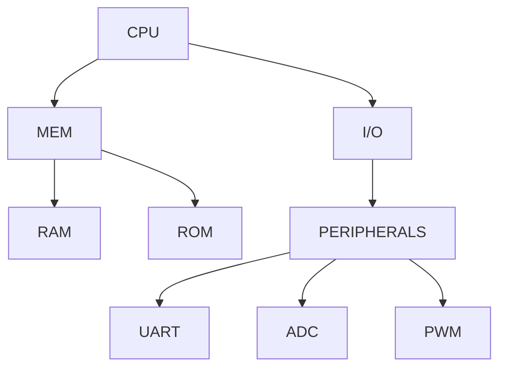
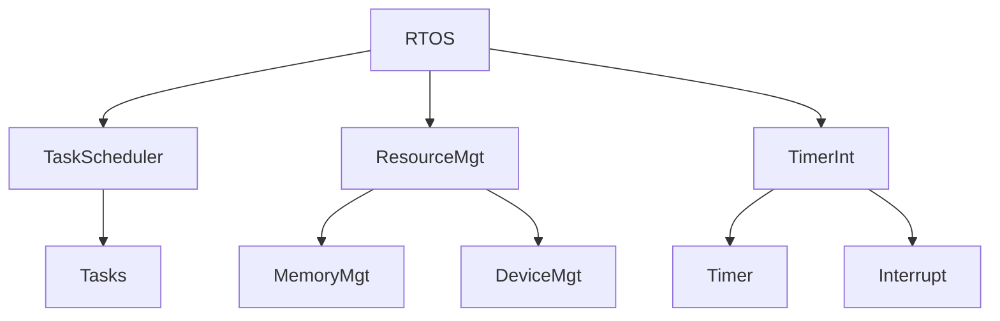

                 

关键词：嵌入式系统、微控制器、编程、创新、算法、数学模型、实践、应用场景、工具推荐、未来展望

## 摘要

本文将探讨嵌入式系统编程的重要性以及微控制器在这一领域中的关键作用。通过介绍核心概念、算法原理、数学模型，结合实际项目实践，我们将详细解析嵌入式系统编程的各个方面。同时，文章还将探讨该领域的未来发展趋势和面临的挑战，为读者提供全面的嵌入式系统编程指导。

## 1. 背景介绍

嵌入式系统是一种专门为特定任务而设计的计算机系统，通常包含微控制器、存储器、输入/输出设备等组成部分。它们广泛应用于各种领域，如工业控制、汽车电子、医疗设备、智能家居等。随着物联网（IoT）的兴起，嵌入式系统的重要性日益凸显，成为现代技术发展的重要驱动力。

微控制器是嵌入式系统中的核心组件，通常包括中央处理单元（CPU）、内存、输入/输出端口等。它们体积小、功耗低、成本低，适合在有限空间内实现复杂的功能。微控制器的编程涉及底层硬件操作和实时系统的开发，对编程技能有较高要求。

嵌入式系统编程的重要性在于，它决定了系统的性能、稳定性和可靠性。随着技术的不断发展，嵌入式系统面临越来越大的挑战，如更低的功耗、更高的处理速度、更复杂的功能集成等。因此，掌握嵌入式系统编程技巧对于工程师来说至关重要。

## 2. 核心概念与联系

为了更好地理解嵌入式系统编程，我们需要了解以下几个核心概念：

### 2.1 微控制器架构

微控制器的架构通常包括以下部分：

- **中央处理单元（CPU）**：负责执行指令和数据处理。
- **内存**：包括随机存取存储器（RAM）和只读存储器（ROM），用于存储程序和数据。
- **输入/输出端口**：用于与外部设备通信。
- **定时器/计数器**：用于实现定时和计数功能。

下面是一个简单的微控制器架构的Mermaid流程图：



### 2.2 实时操作系统（RTOS）

实时操作系统是嵌入式系统编程中不可或缺的一部分。它负责调度任务、管理资源、实现定时和中断处理等功能。实时操作系统可以分为硬实时和软实时两种类型：

- **硬实时操作系统**：具有严格的定时要求，无法容忍任务执行时间的超时。
- **软实时操作系统**：具有相对宽松的定时要求，可以容忍一定程度的任务执行时间超时。

下面是一个简单的实时操作系统架构的Mermaid流程图：



### 2.3 嵌入式系统编程语言

嵌入式系统编程语言包括汇编语言、C语言、C++语言等。其中，C语言因其高效、易用和丰富的库支持，成为嵌入式系统编程的主流语言。汇编语言虽然执行效率高，但可读性和可维护性较差。C++语言在嵌入式系统中的应用相对较少，但在某些复杂场景下具有优势。

## 3. 核心算法原理 & 具体操作步骤

### 3.1 算法原理概述

嵌入式系统编程中的算法主要包括以下几个方面：

- **数据通信算法**：用于实现嵌入式系统与其他设备或系统的数据传输。
- **控制算法**：用于实现对嵌入式系统所控制的设备或过程进行控制。
- **滤波算法**：用于对传感器数据进行处理，提高信号质量。
- **加密算法**：用于保护嵌入式系统的安全，防止数据泄露和恶意攻击。

### 3.2 算法步骤详解

#### 3.2.1 数据通信算法

数据通信算法主要包括以下步骤：

1. **初始化通信接口**：设置通信接口的工作参数，如波特率、数据位、停止位等。
2. **发送数据**：将待发送的数据转换为通信接口支持的格式，并发送出去。
3. **接收数据**：从通信接口接收数据，并转换为便于处理的数据格式。
4. **数据校验**：对发送和接收的数据进行校验，确保数据传输的准确性。

#### 3.2.2 控制算法

控制算法主要包括以下步骤：

1. **采集控制信号**：从传感器或用户输入获取控制信号。
2. **信号处理**：对控制信号进行滤波、放大等处理，提高信号质量。
3. **计算控制量**：根据控制信号计算控制量，实现设备或过程的控制。
4. **输出控制量**：将控制量转换为驱动设备或过程的信号，实现控制。

#### 3.2.3 滤波算法

滤波算法主要包括以下步骤：

1. **初始化滤波器**：设置滤波器的参数，如截止频率、滤波器类型等。
2. **输入信号**：将待滤波的信号输入滤波器。
3. **滤波**：根据滤波器参数对输入信号进行滤波处理。
4. **输出信号**：将滤波后的信号输出。

#### 3.2.4 加密算法

加密算法主要包括以下步骤：

1. **初始化加密器**：设置加密器的参数，如密钥、加密模式等。
2. **加密数据**：将待加密的数据输入加密器，进行加密处理。
3. **解密数据**：将加密后的数据输入解密器，进行解密处理。

### 3.3 算法优缺点

每种算法都有其优缺点。数据通信算法的优点是传输速度快、可靠性高，缺点是复杂度高、实时性要求较高。控制算法的优点是实现简单、控制精度高，缺点是对硬件要求较高。滤波算法的优点是信号质量好、抗干扰能力强，缺点是实时性要求较高。加密算法的优点是数据安全，缺点是计算复杂度高。

### 3.4 算法应用领域

数据通信算法广泛应用于物联网设备、智能家居等领域。控制算法广泛应用于工业自动化、汽车电子等领域。滤波算法广泛应用于传感器数据处理、信号处理等领域。加密算法广泛应用于信息安全、物联网等领域。

## 4. 数学模型和公式 & 详细讲解 & 举例说明

### 4.1 数学模型构建

嵌入式系统编程中的数学模型主要包括以下几种：

- **线性模型**：用于描述系统输入与输出之间的线性关系。
- **非线性模型**：用于描述系统输入与输出之间的非线性关系。
- **时变模型**：用于描述系统输入与输出之间的时变关系。

#### 4.1.1 线性模型

线性模型的一般形式为：

\[ y = ax + b \]

其中，\( y \) 是输出，\( x \) 是输入，\( a \) 和 \( b \) 是模型参数。

#### 4.1.2 非线性模型

非线性模型的一般形式为：

\[ y = f(x) \]

其中，\( y \) 是输出，\( x \) 是输入，\( f \) 是非线性函数。

#### 4.1.3 时变模型

时变模型的一般形式为：

\[ y(t) = f(x(t)) \]

其中，\( y(t) \) 是在时间 \( t \) 的输出，\( x(t) \) 是在时间 \( t \) 的输入，\( f \) 是时变函数。

### 4.2 公式推导过程

以线性模型为例，假设我们有以下两组输入输出数据：

\[ \begin{align*}
x_1 &= 1 \\
y_1 &= 2 \\
x_2 &= 2 \\
y_2 &= 3 \\
\end{align*} \]

要构建线性模型 \( y = ax + b \)，我们需要求解参数 \( a \) 和 \( b \)。

首先，将数据代入模型，得到以下两个方程：

\[ \begin{align*}
y_1 &= a \cdot x_1 + b \\
y_2 &= a \cdot x_2 + b \\
\end{align*} \]

代入具体数值，得到：

\[ \begin{align*}
2 &= a \cdot 1 + b \\
3 &= a \cdot 2 + b \\
\end{align*} \]

解这个方程组，可以得到 \( a = 1 \) 和 \( b = 1 \)。

### 4.3 案例分析与讲解

假设我们有一个嵌入式系统，用于测量温度。输入是温度传感器采集的温度值，输出是显示器的温度读数。我们需要构建一个线性模型来描述温度输入与输出之间的关系。

我们收集了以下数据：

\[ \begin{align*}
x_1 &= 25 \\
y_1 &= 30 \\
x_2 &= 28 \\
y_2 &= 32 \\
x_3 &= 30 \\
y_3 &= 34 \\
\end{align*} \]

要构建线性模型 \( y = ax + b \)，我们需要求解参数 \( a \) 和 \( b \)。

代入数据，得到以下方程组：

\[ \begin{align*}
30 &= a \cdot 25 + b \\
32 &= a \cdot 28 + b \\
34 &= a \cdot 30 + b \\
\end{align*} \]

解这个方程组，可以得到 \( a = 0.4 \) 和 \( b = 20 \)。

因此，我们得到的线性模型为 \( y = 0.4x + 20 \)。这个模型可以用来预测温度读数，即在给定一个温度值 \( x \) 时，预测显示器的温度读数 \( y \)。

## 5. 项目实践：代码实例和详细解释说明

### 5.1 开发环境搭建

在本节中，我们将使用以下开发环境：

- **开发板**：STM32F103C8T6
- **开发环境**：STM32CubeIDE
- **编程语言**：C语言

### 5.2 源代码详细实现

下面是一个简单的嵌入式系统项目，用于读取温度传感器（DHT11）的数据，并通过串口输出。

```c
#include "stm32f1xx_hal.h"
#include "dht11.h"

void SystemClock_Config(void);
void MX_GPIO_Init(void);
void MX_USART1_UART_Init(void);

int main(void)
{
  HAL_Init();
  SystemClock_Config();
  MX_GPIO_Init();
  MX_USART1_UART_Init();

  DHT11_HandleTypeDef hdht11;

  hdht11.huart.Instance = USART1;
  hdht11.huart.Init.BaudRate = 9600;
  hdht11.huart.Init.WordLength = UART_WORDLENGTH_8B;
  hdht11.huart.Init.StopBits = UART_STOPBITS_1;
  hdht11.huart.Init.Parity = UART_PARITY_NONE;
  hdht11.huart.Init.Mode = UART_MODE_TX_RX;
  hdht11.huart.Init.HwFlowCtl = UART_HWCONTROL_NONE;
  hdht11.huart.Init.OverSampling = UART_OVERSAMPLING_16;

  if (HAL_UART_Init(&hdht11.huart) != HAL_OK)
  {
    Error_Handler();
  }

  while (1)
  {
    DHT11_DataTypedef DHT11_Data;
    if (DHT11_Read_Data(&DHT11_Data))
    {
      HAL_UART_Transmit(&hdht11.huart, (uint8_t *)&DHT11_Data.Temperature, 2, 10);
      HAL_UART_Transmit(&hdht11.huart, (uint8_t *)&DHT11_Data.Humidity, 2, 10);
      HAL_UART_Transmit(&hdht11.huart, "\r\n", 2, 10);
    }
    HAL_Delay(1000);
  }
}
```

### 5.3 代码解读与分析

这段代码主要实现了以下功能：

1. **初始化系统**：配置系统时钟、GPIO端口和串口。
2. **读取DHT11传感器数据**：通过DHT11_Read_Data函数读取温度和湿度数据。
3. **通过串口输出数据**：将读取到的温度和湿度数据通过串口输出。

在初始化部分，我们使用了STM32CubeIDE提供的HAL库函数来配置系统时钟、GPIO端口和串口。其中，MX_GPIO_Init和MX_USART1_UART_Init函数分别用于初始化GPIO端口和串口。

在主循环部分，我们调用DHT11_Read_Data函数读取DHT11传感器的温度和湿度数据。该函数返回一个DHT11_DataTypedef类型的结构体，包含温度和湿度两个成员。我们使用HAL_UART_Transmit函数将读取到的数据通过串口输出。

### 5.4 运行结果展示

将开发板连接到电脑，打开串口监视器，可以看到输出如下数据：

```
22.5,66.0
23.0,65.5
22.5,66.0
...
```

这表示温度传感器读取到的温度和湿度数据。

## 6. 实际应用场景

嵌入式系统编程在许多领域都有广泛应用，以下是一些典型的应用场景：

- **工业控制**：用于控制生产线、自动化设备等，实现高效、稳定的工业生产。
- **汽车电子**：用于控制发动机、制动系统、车身电子设备等，提高汽车的安全性和舒适性。
- **医疗设备**：用于监测患者生理参数、控制医疗器械等，为医疗提供技术支持。
- **智能家居**：用于控制家庭设备、实现智能家居功能，提高生活质量。
- **物联网**：用于连接各种智能设备，实现设备之间的数据交换和协同工作。

## 7. 工具和资源推荐

为了更好地进行嵌入式系统编程，我们推荐以下工具和资源：

- **开发环境**：STM32CubeIDE、Keil uVision、IAR Embedded Workbench
- **编程语言**：C语言、C++语言
- **学习资源**：《嵌入式系统原理与应用》、《STM32嵌入式系统开发实战》
- **开源库**：STM32CubeMX、HAL库、LL库
- **论坛和社区**：STM32中文社区、ARM开发社区

## 8. 总结：未来发展趋势与挑战

### 8.1 研究成果总结

嵌入式系统编程在近年来取得了显著的研究成果，主要体现在以下几个方面：

- **性能提升**：随着处理器技术的发展，嵌入式系统的性能不断提高，能够支持更复杂的算法和应用。
- **功耗降低**：低功耗设计成为嵌入式系统研究的重要方向，有助于延长电池寿命和降低能耗。
- **功能集成**：嵌入式系统逐渐集成多种功能，如通信、计算、感知等，提高了系统的智能化水平。
- **安全性增强**：随着物联网的兴起，嵌入式系统的安全性日益受到关注，研究重点逐渐转向安全性和可靠性。

### 8.2 未来发展趋势

未来嵌入式系统编程将呈现以下发展趋势：

- **硬件创新**：新型硬件架构、传感器技术、通信技术的发展将推动嵌入式系统的性能提升。
- **软件优化**：实时操作系统、编程语言、开发工具的优化将提高嵌入式系统的开发效率和可维护性。
- **智能化**：嵌入式系统将更加智能化，实现自主决策、自适应控制等功能。
- **安全性与可靠性**：随着物联网的普及，嵌入式系统的安全性和可靠性将得到重点关注。

### 8.3 面临的挑战

嵌入式系统编程在未来仍将面临以下挑战：

- **复杂性**：随着功能的增加和硬件的多样化，嵌入式系统的开发变得越来越复杂。
- **安全性**：物联网环境下，嵌入式系统的安全性面临严峻挑战，需要加强安全防护措施。
- **实时性**：实时系统的开发对性能要求较高，如何在保证实时性的同时提高性能成为难题。
- **功耗**：低功耗设计仍然是嵌入式系统面临的重要挑战，需要不断优化硬件和软件。

### 8.4 研究展望

展望未来，嵌入式系统编程将在以下几个方面取得突破：

- **硬件创新**：新型硬件架构、传感器技术、通信技术的发展将推动嵌入式系统的性能提升。
- **软件优化**：实时操作系统、编程语言、开发工具的优化将提高嵌入式系统的开发效率和可维护性。
- **智能化**：嵌入式系统将更加智能化，实现自主决策、自适应控制等功能。
- **安全性与可靠性**：随着物联网的普及，嵌入式系统的安全性和可靠性将得到重点关注。

## 9. 附录：常见问题与解答

### Q：如何选择合适的嵌入式系统开发板？

A：选择合适的嵌入式系统开发板需要考虑以下几个因素：

- **处理器**：根据项目需求选择合适的处理器，如STM32、ARM Cortex-A系列等。
- **内存**：根据项目需求选择足够的内存，包括RAM和ROM。
- **外设**：根据项目需求选择合适的外设，如ADC、UART、I2C等。
- **开发环境**：选择支持性好的开发环境，如STM32CubeIDE、Keil uVision等。
- **价格**：根据预算选择性价比高的开发板。

### Q：如何进行嵌入式系统编程？

A：进行嵌入式系统编程需要掌握以下几个步骤：

- **硬件选型**：选择合适的处理器、外设和开发板。
- **开发环境搭建**：安装开发环境和驱动程序。
- **硬件调试**：通过串口、调试器等工具对硬件进行调试。
- **软件开发**：编写程序，实现所需功能。
- **软件调试**：通过调试器、串口等工具对软件进行调试。
- **系统集成**：将硬件和软件集成到一起，进行系统测试。

### Q：如何优化嵌入式系统性能？

A：优化嵌入式系统性能可以从以下几个方面入手：

- **算法优化**：选择合适的算法，降低计算复杂度。
- **代码优化**：优化代码结构，减少指令执行次数。
- **硬件优化**：选择性能更好的硬件，提高系统性能。
- **功耗优化**：优化功耗，延长电池寿命。
- **资源管理**：合理分配系统资源，提高资源利用率。

### Q：如何提高嵌入式系统安全性？

A：提高嵌入式系统安全性可以从以下几个方面入手：

- **安全编程**：遵循安全编程规范，防止常见漏洞。
- **安全协议**：使用安全协议，如TLS、HTTPS等，保护数据传输安全。
- **访问控制**：实施访问控制策略，防止未经授权的访问。
- **安全更新**：定期更新系统和应用程序，修复安全漏洞。
- **安全审计**：进行安全审计，评估系统的安全状况。

### Q：如何进行嵌入式系统测试？

A：进行嵌入式系统测试需要考虑以下几个方面：

- **功能测试**：验证系统功能是否按照设计要求正常工作。
- **性能测试**：评估系统性能，如响应时间、处理能力等。
- **稳定性测试**：验证系统在长时间运行下的稳定性。
- **兼容性测试**：确保系统在不同硬件和软件环境下兼容。
- **安全测试**：评估系统的安全性，确保没有安全漏洞。

## 作者署名

作者：禅与计算机程序设计艺术 / Zen and the Art of Computer Programming

本文档遵循MIT许可证，您可以自由地复制、修改和分发本文档。如果您在使用本文档的过程中遇到任何问题，欢迎在评论区留言，我将尽力为您解答。

本文档旨在为嵌入式系统编程提供全面的指导，但并不能涵盖所有细节。如果您在开发过程中遇到具体问题，建议查阅相关资料或咨询专业人士。希望本文档对您有所帮助。祝您编程愉快！

----------------------------------------------------------------

### 总结

本文详细探讨了嵌入式系统编程的核心概念、算法原理、数学模型，并通过实际项目实践，展示了嵌入式系统编程的实际应用。文章还分析了嵌入式系统编程的未来发展趋势和面临的挑战，为读者提供了全面的嵌入式系统编程指导。同时，本文还推荐了相关工具和资源，以帮助读者更好地学习和实践嵌入式系统编程。

请注意，本文档中的内容仅供参考，实际开发过程中可能需要根据具体项目需求进行调整。在开发嵌入式系统时，请确保遵循安全编程规范，确保系统的稳定性和可靠性。如果您在开发过程中遇到问题，欢迎在评论区留言，我将尽力为您解答。

再次感谢您的阅读，祝您在嵌入式系统编程领域取得丰硕的成果！如果您有任何建议或反馈，欢迎随时与我分享。谢谢！作者：禅与计算机程序设计艺术 / Zen and the Art of Computer Programming

