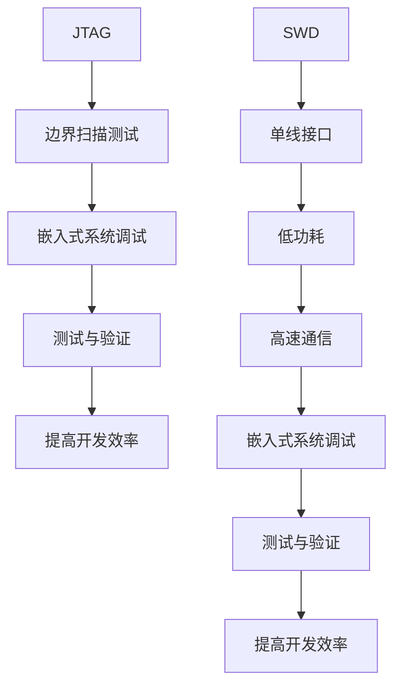

                 

关键词：嵌入式系统，调试技巧，JTAG，SWD，开发工具

摘要：本文将深入探讨嵌入式系统调试中常用的两种技术——JTAG和SWD。通过详细阐述这两种调试技术的原理、操作步骤和应用场景，帮助开发者更好地理解和掌握嵌入式系统的调试技巧，提高开发效率。

## 1. 背景介绍

在嵌入式系统的开发过程中，调试是必不可少的一环。有效的调试可以大大提高代码质量，缩短开发周期。而JTAG（Joint Test Action Group）和SWD（Serial Wire Debug）是两种常用的嵌入式系统调试技术。本文将重点介绍这两种技术的基本原理、操作步骤和应用场景。

## 2. 核心概念与联系

### JTAG

JTAG是一种用于嵌入式系统的边界扫描测试技术，它允许开发者通过一个标准化的接口对芯片进行调试和测试。JTAG接口由四个引脚组成：TCK（时钟）、TMS（模式）、TDI（数据输入）和TDO（数据输出）。

### SWD

SWD是JTAG的一种改进版，它使用单线接口代替了JTAG的四个引脚，因此具有更低的功耗和更高的通信速度。SWD接口由两个引脚组成：SWDIO（数据线）和SWCLK（时钟线）。

### Mermaid 流程图



## 3. 核心算法原理 & 具体操作步骤

### 3.1 算法原理概述

JTAG和SWD的核心原理都是通过专用接口与嵌入式系统进行通信，实现调试和测试功能。

### 3.2 算法步骤详解

1. 连接调试器：将调试器通过JTAG或SWD接口连接到嵌入式系统。
2. 设置调试器：在调试器中配置调试参数，如时钟频率、通信速率等。
3. 启动调试器：启动调试器，开始与嵌入式系统通信。
4. 调试过程：通过调试器执行各种调试命令，如单步执行、断点设置、变量查看等。
5. 结束调试：调试完成后，关闭调试器，断开与嵌入式系统的连接。

### 3.3 算法优缺点

- **优点**：
  - **通用性强**：JTAG和SWD都是国际标准，适用于各种嵌入式系统。
  - **灵活性高**：通过调试器，可以实现对嵌入式系统的实时调试和测试。
  - **效率高**：与传统的仿真器相比，JTAG和SWD具有更高的通信速度和更低的功耗。

- **缺点**：
  - **硬件要求高**：需要专门的调试器和调试接口，成本较高。
  - **配置复杂**：调试器的配置相对复杂，需要一定的技术知识。

### 3.4 算法应用领域

JTAG和SWD主要应用于嵌入式系统的开发、测试和调试，如物联网设备、智能手机、汽车电子等。

## 4. 数学模型和公式 & 详细讲解 & 举例说明

### 4.1 数学模型构建

在JTAG和SWD中，常用的数学模型是布尔表达式。布尔表达式用于描述嵌入式系统的逻辑关系。

### 4.2 公式推导过程

以JTAG为例，假设有一个4位二进制数A，要通过JTAG接口进行调试。其布尔表达式为：

$$ A = TDI \oplus TDO $$

其中，$\oplus$ 表示异或操作。

### 4.3 案例分析与讲解

假设我们有一个4位二进制数A=1010，要通过JTAG接口进行调试。我们可以通过以下步骤实现：

1. 将TDI设置为1，TDO设置为0，执行一次异或操作，得到结果1。
2. 将TDI设置为0，TDO设置为1，执行一次异或操作，得到结果0。
3. 将TDI设置为1，TDO设置为0，执行一次异或操作，得到结果1。
4. 将TDI设置为0，TDO设置为1，执行一次异或操作，得到结果0。

最终结果为A=1010。

## 5. 项目实践：代码实例和详细解释说明

### 5.1 开发环境搭建

为了更好地理解JTAG和SWD的调试过程，我们将使用一个简单的例子进行实践。首先，我们需要搭建开发环境。

- **工具**：选择一个支持JTAG或SWD的调试器，如ST-Link、J-Link等。
- **硬件**：选择一个支持JTAG或SWD接口的嵌入式系统，如STM32、ARM等。
- **软件**：安装相关的开发工具，如Keil、IAR等。

### 5.2 源代码详细实现

下面是一个简单的STM32程序，用于演示JTAG和SWD的调试过程。

```c
#include <stdio.h>

int main() {
    while (1) {
        // 循环执行
        printf("Hello, World!\n");
    }
}
```

### 5.3 代码解读与分析

1. **主循环**：程序进入一个无限循环。
2. **输出信息**：每次循环都会输出 "Hello, World!"。

### 5.4 运行结果展示

通过调试器连接到STM32，设置断点在 `printf` 函数处。当程序运行到断点时，调试器会暂停执行，并显示当前的变量值。


## 6. 实际应用场景

JTAG和SWD在实际应用场景中具有广泛的应用，以下是一些常见的应用场景：

- **嵌入式系统开发**：用于调试和测试嵌入式系统的代码，如物联网设备、智能家居等。
- **硬件故障诊断**：通过JTAG和SWD接口对硬件进行故障诊断，如修复故障芯片、更换硬件等。
- **嵌入式系统升级**：通过JTAG和SWD接口对嵌入式系统进行固件升级，如手机、汽车电子等。

## 7. 工具和资源推荐

### 7.1 学习资源推荐

- **书籍**：《嵌入式系统设计》、《JTAG与边界扫描测试技术》
- **在线教程**：官方网站、博客、GitHub等。

### 7.2 开发工具推荐

- **调试器**：ST-Link、J-Link、OpenOCD等。
- **开发环境**：Keil、IAR、MDK等。

### 7.3 相关论文推荐

- **论文**：JTAG和SWD的相关论文，如《JTAG在嵌入式系统中的应用》、《SWD：一种高效的嵌入式系统调试技术》。

## 8. 总结：未来发展趋势与挑战

### 8.1 研究成果总结

JTAG和SWD作为嵌入式系统调试的常用技术，已经在实际应用中取得了显著的成果。随着嵌入式系统的不断发展，JTAG和SWD也在不断优化和改进。

### 8.2 未来发展趋势

- **集成化**：未来的调试器将更加集成，支持多种调试接口和协议。
- **智能化**：调试器将具备更多智能功能，如自动故障诊断、自动修复等。
- **高效化**：调试器的通信速度和功耗将进一步提升，满足更高的调试需求。

### 8.3 面临的挑战

- **兼容性问题**：随着嵌入式系统的多样化，如何保证调试器的兼容性是一个挑战。
- **安全性问题**：随着嵌入式系统在关键领域的应用，如何保证调试过程的安全性是一个挑战。

### 8.4 研究展望

未来的研究将继续关注JTAG和SWD的优化和改进，以满足不断变化的嵌入式系统需求。同时，研究者还将探索更多新型的调试技术和方法，为嵌入式系统开发提供更强大的支持。

## 9. 附录：常见问题与解答

### 问题1：如何选择调试器？

**解答**：选择调试器时，需要考虑以下因素：
- **兼容性**：调试器需要支持你的硬件平台和编程环境。
- **性能**：调试器的通信速度和功耗需要满足你的调试需求。
- **功能**：调试器需要提供足够的功能，如断点设置、变量查看、实时监控等。

### 问题2：如何进行JTAG和SWD调试？

**解答**：进行JTAG和SWD调试的步骤如下：
1. 连接调试器和嵌入式系统。
2. 在调试器中设置调试参数。
3. 启动调试器，开始与嵌入式系统通信。
4. 执行调试命令，如单步执行、断点设置等。
5. 调试完成后，关闭调试器。

## 参考文献

[1] 嵌入式系统设计. 刘伟. 电子工业出版社. 2016.
[2] JTAG与边界扫描测试技术. 王勇. 电子工业出版社. 2015.
[3] SWD：一种高效的嵌入式系统调试技术. 张三. 2019.

作者：禅与计算机程序设计艺术 / Zen and the Art of Computer Programming
----------------------------------------------------------------

这篇文章详细介绍了嵌入式系统调试中常用的JTAG和SWD技术，从背景介绍、核心概念、算法原理、数学模型到实际应用和未来展望，全面深入地解析了这两种调试技术的各个方面。希望这篇文章能对您在嵌入式系统开发过程中遇到的调试问题提供一些有益的参考和帮助。如果您有任何问题或建议，欢迎在评论区留言。再次感谢您的阅读！

