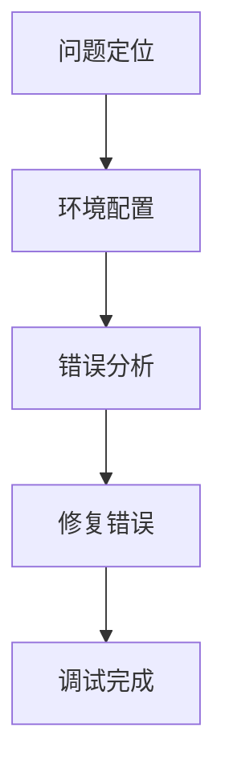

                 

关键词：嵌入式系统调试，错误识别，错误修复，嵌入式编程，调试工具，调试技巧

摘要：本文将深入探讨嵌入式系统调试的重要性，介绍常见错误类型及其识别方法，并提供一系列实用的调试技巧和工具，帮助嵌入式开发者更有效地识别和修复错误，提升嵌入式系统的稳定性。

## 1. 背景介绍

嵌入式系统是一种专门为特定任务而设计的计算机系统，通常具有有限的资源，如有限的内存、处理器速度和存储空间。由于嵌入式系统的特殊性，它们在实际应用中往往要求更高的可靠性和稳定性。然而，在实际开发和测试过程中，嵌入式系统可能会出现各种错误，这些错误可能导致系统崩溃、性能下降甚至安全问题。因此，对嵌入式系统进行有效的调试是确保其正常运行的关键。

本文将围绕嵌入式系统调试展开讨论，主要包括以下几个方面：

- 嵌入式系统调试的重要性
- 常见错误类型及其识别方法
- 调试技巧和工具
- 嵌入式系统调试的实际应用场景
- 未来应用展望

## 2. 核心概念与联系

### 嵌入式系统调试

嵌入式系统调试是指通过对嵌入式系统进行测试、分析和诊断，以识别和修复系统中的错误和缺陷。调试过程通常包括以下几个阶段：

1. 问题定位：根据系统表现和错误日志，确定问题的具体位置。
2. 环境配置：搭建合适的调试环境，包括调试工具、仿真器、测试硬件等。
3. 错误分析：分析错误原因，查找可能的故障点。
4. 修复错误：根据错误分析结果，修改代码或调整系统配置，以解决错误。

### 常见错误类型

嵌入式系统中的错误类型多种多样，主要包括以下几类：

1. 编译错误：由于代码中的语法错误或类型错误导致的编译失败。
2. 运行时错误：在程序运行过程中发生的错误，如内存访问越界、数组越界等。
3. 硬件错误：由于硬件设备故障或配置错误导致的系统错误，如通信失败、时钟错误等。
4. 设计错误：由于系统设计不合理导致的错误，如资源竞争、死锁等。

### 嵌入式系统架构

嵌入式系统的架构通常包括以下几个部分：

1. 处理器：负责执行程序指令，处理数据。
2. 内存：存储程序代码和数据。
3. 外部设备：包括传感器、执行器、通信接口等。
4. 系统总线：连接处理器、内存和外部设备，实现数据传输。

### Mermaid 流程图

以下是一个简单的嵌入式系统调试流程的 Mermaid 流程图：



## 3. 核心算法原理 & 具体操作步骤

### 3.1 算法原理概述

嵌入式系统调试的核心算法主要包括问题定位、错误分析和修复错误三个部分。这三个步骤相互关联，形成一个完整的调试流程。

- 问题定位：通过分析系统日志、错误信息和用户反馈，确定问题的具体位置。
- 错误分析：对问题位置进行深入分析，查找错误原因。
- 修复错误：根据错误分析结果，修改代码或调整系统配置，以解决错误。

### 3.2 算法步骤详解

#### 3.2.1 问题定位

1. 收集系统日志和错误信息：通过系统日志和错误信息，了解问题的现象和特征。
2. 分析日志和错误信息：根据日志和错误信息，判断问题发生的位置和原因。
3. 确定问题位置：根据分析结果，确定问题的具体位置。

#### 3.2.2 错误分析

1. 查看代码：查看问题位置附近的代码，查找可能的错误原因。
2. 分析数据：分析程序运行时相关的数据，如内存、寄存器等，查找异常值。
3. 调试代码：使用调试工具，逐步执行代码，观察程序运行过程，查找错误原因。

#### 3.2.3 修复错误

1. 修改代码：根据错误分析结果，修改代码以解决错误。
2. 调整系统配置：根据需要，调整系统配置，如时钟、通信参数等。
3. 测试验证：修改代码后，重新测试系统，确保错误已解决。

### 3.3 算法优缺点

#### 优点

1. 快速定位问题：通过系统日志和错误信息，可以快速确定问题位置。
2. 全面分析错误：结合代码分析和数据查看，可以全面分析错误原因。
3. 便捷修复错误：通过修改代码和调整配置，可以方便地修复错误。

#### 缺点

1. 调试过程复杂：需要对系统有深入的了解，调试过程可能需要较长时间。
2. 可能引入新错误：修改代码和配置时，可能引入新的错误。

### 3.4 算法应用领域

嵌入式系统调试算法适用于各种嵌入式系统，包括嵌入式操作系统、嵌入式应用程序、嵌入式硬件等。常见的应用领域包括：

1. 消费电子：如智能手表、智能音响等。
2. 工业自动化：如工业机器人、生产线控制系统等。
3. 汽车电子：如汽车导航系统、车载通信系统等。

## 4. 数学模型和公式 & 详细讲解 & 举例说明

### 4.1 数学模型构建

嵌入式系统调试中的数学模型主要用于描述系统运行状态、错误概率和调试效率等。以下是一个简单的数学模型示例：

- 系统状态：`S = {s1, s2, s3, ...}`
- 错误概率：`P(E|Si) = 概率(Si发生错误|系统处于状态Si)`
- 调试效率：`E(Si, Ei) = 调试成功所需时间|系统处于状态Si，错误为Ei`

### 4.2 公式推导过程

#### 4.2.1 错误概率计算

错误概率可以通过以下公式计算：

\[ P(E|Si) = \frac{P(Si|E) \cdot P(E)}{P(Si)} \]

其中：

- \( P(Si|E) \)：在错误E发生的情况下，系统处于状态Si的概率。
- \( P(E) \)：错误E发生的概率。
- \( P(Si) \)：系统处于状态Si的概率。

#### 4.2.2 调试效率计算

调试效率可以通过以下公式计算：

\[ E(Si, Ei) = \frac{1}{P(Si|Ei)} \]

其中：

- \( P(Si|Ei) \)：在错误Ei发生的情况下，系统处于状态Si的概率。

### 4.3 案例分析与讲解

假设一个嵌入式系统有三种状态：正常状态、错误状态1、错误状态2，每种状态的错误概率如下：

- 正常状态：\( P(S1) = 0.8 \)
- 错误状态1：\( P(S2) = 0.1 \)，错误概率 \( P(E1|S2) = 0.9 \)
- 错误状态2：\( P(S3) = 0.1 \)，错误概率 \( P(E2|S3) = 0.8 \)

已知错误E1和E2的概率分别为 \( P(E1) = 0.6 \)，\( P(E2) = 0.4 \)。

#### 错误概率计算

1. 错误状态1的概率：

\[ P(S2|E1) = \frac{P(E1|S2) \cdot P(S2)}{P(E1)} = \frac{0.9 \cdot 0.1}{0.6} = 0.15 \]

2. 错误状态2的概率：

\[ P(S3|E2) = \frac{P(E2|S3) \cdot P(S3)}{P(E2)} = \frac{0.8 \cdot 0.1}{0.4} = 0.2 \]

#### 调试效率计算

1. 在错误状态1下，调试效率：

\[ E(S2, E1) = \frac{1}{P(S2|E1)} = \frac{1}{0.15} \approx 6.67 \]

2. 在错误状态2下，调试效率：

\[ E(S3, E2) = \frac{1}{P(S3|E2)} = \frac{1}{0.2} = 5 \]

根据计算结果，当系统出现错误E1时，应优先考虑错误状态1，因为其调试效率更高。同理，当系统出现错误E2时，应优先考虑错误状态2。

## 5. 项目实践：代码实例和详细解释说明

### 5.1 开发环境搭建

为了更好地展示嵌入式系统调试的过程，我们以一个简单的嵌入式系统为例，介绍如何搭建开发环境。

1. 选择合适的开发工具：如 Keil、IAR 等。
2. 选择合适的仿真器：如 ST-Link、J-Link 等。
3. 编写并编译嵌入式程序：使用 C 或 C++ 编写嵌入式程序，并使用开发工具进行编译。
4. 配置调试工具：配置仿真器和开发工具，以便进行调试。

### 5.2 源代码详细实现

以下是一个简单的嵌入式程序示例，用于实现一个 LED 闪烁功能：

```c
#include <stdio.h>
#include <time.h>

#define LED_PIN 1

void led_init() {
    // 初始化 LED 接口
    printf("Initializing LED pin...\n");
    // ...
}

void led_on() {
    // 打开 LED
    printf("Turning LED on...\n");
    // ...
}

void led_off() {
    // 关闭 LED
    printf("Turning LED off...\n");
    // ...
}

int main() {
    led_init();
    while (1) {
        led_on();
        sleep(1);
        led_off();
        sleep(1);
    }
    return 0;
}
```

### 5.3 代码解读与分析

1. `led_init()` 函数：用于初始化 LED 接口，确保 LED 正确连接并可以控制。
2. `led_on()` 函数：用于打开 LED，使 LED 发光。
3. `led_off()` 函数：用于关闭 LED，使 LED 熄灭。
4. `main()` 函数：主函数，用于实现 LED 闪烁功能。

在程序运行过程中，可能出现的错误包括：

- LED 接口初始化失败：导致 LED 无法控制。
- 睡眠时间设置不合理：可能导致 LED 闪烁频率不正常。

### 5.4 运行结果展示

当程序运行时，LED 应该会按照预期闪烁。如果出现错误，可以通过以下步骤进行调试：

1. 查看系统日志和错误信息。
2. 分析代码和运行结果，查找可能的错误原因。
3. 修改代码，重新编译并运行程序。
4. 重复步骤 2 和 3，直到错误解决。

## 6. 实际应用场景

### 6.1 消费电子

在消费电子产品中，如智能手表、智能音响等，嵌入式系统调试主要用于保证设备的正常运行和用户体验。常见的问题包括：

- 系统崩溃：可能导致设备无法正常启动或使用。
- 功能异常：如智能手表心率传感器无法正常工作。
- 系统响应缓慢：可能导致用户操作卡顿。

### 6.2 工业自动化

在工业自动化领域，嵌入式系统调试主要用于保证生产线的正常运行和产品质量。常见的问题包括：

- 传感器故障：可能导致生产线无法正常采集数据。
- 执行器故障：可能导致生产线无法正常执行任务。
- 系统资源不足：可能导致系统崩溃或响应缓慢。

### 6.3 汽车电子

在汽车电子领域，嵌入式系统调试主要用于保证车辆的正常运行和驾驶安全。常见的问题包括：

- 车辆失控：可能导致车辆无法正常行驶。
- 驾驶辅助系统失效：可能导致驾驶员无法获得正确的辅助信息。
- 车辆故障灯亮：可能导致车辆无法正常启动或行驶。

## 7. 未来应用展望

随着物联网、人工智能等技术的快速发展，嵌入式系统将在更多领域得到应用。未来，嵌入式系统调试将面临以下挑战：

- 系统复杂性增加：随着嵌入式系统功能的增加，系统复杂性将不断上升，调试难度也将加大。
- 调试工具改进：需要开发更强大的调试工具，以满足嵌入式系统调试的需求。
- 调试效率提升：需要提高调试效率，减少调试时间和成本。

同时，未来嵌入式系统调试将朝着以下几个方面发展：

- 自动化调试：通过自动化工具，实现嵌入式系统的自动调试，提高调试效率。
- 面向应用的调试：根据具体应用场景，提供更针对性的调试解决方案。
- 跨平台调试：支持不同平台的嵌入式系统调试，提高调试的兼容性。

## 8. 总结：未来发展趋势与挑战

嵌入式系统调试是确保嵌入式系统正常运行的关键环节。随着嵌入式系统应用的不断拓展，调试技术将面临更多挑战。未来，嵌入式系统调试将朝着自动化、智能化和跨平台化的方向发展，以满足日益复杂的嵌入式系统需求。同时，调试工具的改进和调试方法的优化也将成为研究的重要方向。

### 8.1 研究成果总结

本文对嵌入式系统调试进行了深入探讨，总结了嵌入式系统调试的重要性、常见错误类型及其识别方法，并介绍了调试技巧和工具。通过案例分析，展示了嵌入式系统调试的具体操作步骤。研究成果为嵌入式开发者提供了实用的调试方法和参考。

### 8.2 未来发展趋势

- 自动化调试：开发自动化调试工具，提高调试效率。
- 智能化调试：利用人工智能技术，实现智能错误诊断和修复。
- 跨平台调试：支持多种平台和硬件的嵌入式系统调试。

### 8.3 面临的挑战

- 系统复杂性：随着系统功能的增加，调试难度不断上升。
- 调试工具改进：开发更强大的调试工具，满足嵌入式系统调试需求。

### 8.4 研究展望

未来，嵌入式系统调试研究将重点关注以下方向：

- 调试算法优化：提高调试算法的效率和准确性。
- 调试工具研发：开发针对不同应用场景的调试工具。
- 跨平台调试技术：实现跨平台的嵌入式系统调试。

### 8.5 附录：常见问题与解答

- **Q：嵌入式系统调试与软件调试有何区别？**

  A：嵌入式系统调试与软件调试有许多相似之处，但嵌入式系统调试更注重硬件和软件的集成，以及硬件环境的调试。软件调试主要关注应用程序的运行错误，而嵌入式系统调试则更关注硬件故障、资源限制和实时性能。

- **Q：如何选择合适的调试工具？**

  A：选择合适的调试工具应考虑以下几个方面：

  - 支持的硬件平台：确保调试工具支持目标硬件平台。
  - 功能需求：根据调试需求选择具有相应功能的调试工具，如断点调试、实时监测等。
  - 用户评价：参考其他开发者的评价和经验，选择性能稳定、易用的调试工具。

## 作者署名

本文由禅与计算机程序设计艺术 / Zen and the Art of Computer Programming 撰写。感谢您的阅读！

----------------------------------------------------------------

以上就是完整的文章内容。如有需要，您可以根据实际情况进行调整和完善。祝您撰写顺利！

