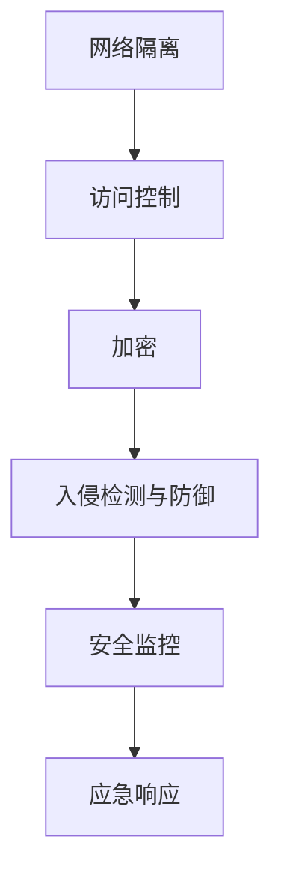
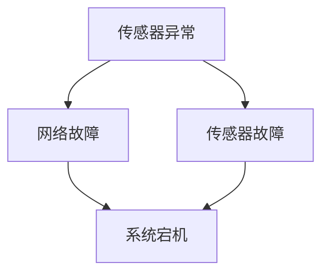

                 

关键词：工业控制系统，安全，关键基础设施，网络安全，防护策略

> 摘要：本文深入探讨了工业控制系统（ICS）面临的网络安全威胁，分析了现有安全防护措施，并提出了针对关键基础设施的保护策略。文章旨在为行业从业者提供有价值的见解，以提升ICS的安全水平，确保关键基础设施的安全稳定运行。

## 1. 背景介绍

工业控制系统（Industrial Control Systems，简称ICS）是用于监控、控制和自动化工业过程的计算机系统，广泛应用于制造业、能源、交通、水利等多个领域。随着物联网（IoT）和工业互联网的发展，ICS逐渐与互联网连接，从而提高了生产效率和灵活性，但同时也带来了新的安全挑战。

### 1.1 ICS的基本架构

ICS通常由以下几个关键组件构成：

- **人机界面（HMI）**：操作人员用于监控和控制系统的图形界面。
- **现场设备（现场总线、PLC、DCS等）**：直接与物理设备交互，负责数据的采集和执行控制命令。
- **服务器和数据库**：存储系统配置数据、历史数据和实时数据。
- **网络通信**：连接各个组件，实现数据的交换和控制命令的传递。

### 1.2 ICS的重要性

ICS在现代社会中扮演着至关重要的角色。它们不仅影响着工业生产线的正常运行，还直接关系到公共安全、能源供应和基础设施的稳定运行。例如，电力系统中的ICS故障可能导致大面积停电，交通系统中的ICS漏洞可能导致交通事故，甚至工业控制系统被恶意利用可能导致大规模环境污染。

## 2. 核心概念与联系

### 2.1 安全概念

在ICS安全领域，以下核心概念是必须了解的：

- **网络隔离**：通过物理或逻辑隔离确保ICS与外部网络（如互联网）之间的隔离，减少外部威胁的攻击面。
- **访问控制**：限制对ICS系统的访问权限，确保只有授权用户可以访问关键资源。
- **加密**：通过加密技术保护数据的机密性和完整性。
- **入侵检测与防御**：实时监控系统的异常行为，并在检测到潜在威胁时采取防御措施。

### 2.2 安全架构

图1展示了ICS安全架构的基本组成部分。



## 3. 核心算法原理 & 具体操作步骤

### 3.1 算法原理概述

针对ICS的安全防护，核心算法主要涉及以下几个方面：

- **入侵检测系统（IDS）**：通过分析网络流量和系统日志，实时识别潜在的安全威胁。
- **防火墙**：在网络边界处建立防护屏障，阻止未经授权的访问。
- **加密算法**：采用高级加密算法（如AES）保护数据传输的机密性和完整性。
- **身份验证与授权**：通过多因素身份验证（MFA）和访问控制列表（ACL）确保用户身份的合法性和访问权限。

### 3.2 算法步骤详解

#### 3.2.1 入侵检测系统（IDS）

1. **数据采集**：从网络流量、系统日志和传感器数据中采集信息。
2. **预处理**：对采集的数据进行清洗和转换，以去除噪音和冗余信息。
3. **特征提取**：将预处理后的数据进行特征提取，生成特征向量。
4. **模式识别**：利用机器学习算法或规则匹配识别异常行为。
5. **告警与响应**：在检测到潜在威胁时，生成告警并触发相应的响应措施。

#### 3.2.2 防火墙

1. **定义安全策略**：根据业务需求和安全要求，制定网络流量过滤规则。
2. **数据包过滤**：在数据包层次对网络流量进行过滤，阻止恶意流量进入内部网络。
3. **状态检测**：根据会话状态跟踪数据包，防止已知攻击和异常流量。
4. **应用层过滤**：对应用层协议进行分析，阻止恶意应用数据传输。

#### 3.2.3 加密算法

1. **密钥生成**：生成随机密钥，用于加密和解密数据。
2. **加密通信**：采用加密算法（如AES）对数据进行加密传输。
3. **密钥管理**：确保密钥的安全存储和生命周期管理。
4. **加密验证**：对加密数据进行验证，确保数据完整性和真实性。

#### 3.2.4 身份验证与授权

1. **用户认证**：使用用户名和密码、数字证书等认证方式验证用户身份。
2. **多因素身份验证（MFA）**：结合密码、指纹、短信验证码等多种方式提高安全性。
3. **访问控制**：根据用户的角色和权限，设置访问控制列表（ACL）。
4. **实时监控**：监控用户的访问行为，确保合法访问和防止未授权访问。

### 3.3 算法优缺点

- **入侵检测系统（IDS）**：优点包括实时监控和自动告警，缺点是误报率高和需要大量计算资源。
- **防火墙**：优点是简单易用和高效，缺点是无法防止内部威胁和未知威胁。
- **加密算法**：优点是保证数据传输的机密性和完整性，缺点是加密和解密过程需要计算资源。
- **身份验证与授权**：优点是确保用户身份和访问权限的合法性，缺点是实施复杂和需要额外维护成本。

### 3.4 算法应用领域

- **能源行业**：保护电网控制系统，防止恶意攻击导致大规模停电。
- **制造业**：确保生产线安全稳定运行，防止生产数据泄露和设备控制被篡改。
- **交通行业**：保护交通控制系统，防止交通事故和数据泄露。
- **水利行业**：保护水利工程控制系统，防止水资源浪费和环境破坏。

## 4. 数学模型和公式 & 详细讲解 & 举例说明

### 4.1 数学模型构建

在工业控制系统安全中，常用的数学模型包括：

- **贝叶斯网络**：用于描述不确定性和因果关系。
- **马尔可夫决策过程（MDP）**：用于优化安全策略。
- **支持向量机（SVM）**：用于分类和回归分析。

### 4.2 公式推导过程

以贝叶斯网络为例，其基本公式如下：

\[ P(A|B) = \frac{P(B|A) \cdot P(A)}{P(B)} \]

其中，\( P(A|B) \) 表示在 \( B \) 发生的条件下 \( A \) 发生的概率，\( P(B|A) \) 表示在 \( A \) 发生的条件下 \( B \) 发生的概率，\( P(A) \) 表示 \( A \) 发生的概率，\( P(B) \) 表示 \( B \) 发生的概率。

### 4.3 案例分析与讲解

假设我们想分析一个工业控制系统中，某个传感器数据异常的因果关系。我们构建一个简单的贝叶斯网络，如图2所示。



在这个网络中，我们已知：

- \( P(A) = 0.01 \)（传感器异常的概率）
- \( P(B) = 0.05 \)（网络故障的概率）
- \( P(C) = 0.01 \)（传感器故障的概率）
- \( P(D) = 0.9 \)（系统宕机的概率）

我们需要计算：

- \( P(B|D) \)（在系统宕机的条件下，网络故障的概率）
- \( P(C|D) \)（在系统宕机的条件下，传感器故障的概率）

根据贝叶斯公式，我们可以得到：

\[ P(B|D) = \frac{P(D|B) \cdot P(B)}{P(D)} = \frac{0.8 \cdot 0.05}{0.9} \approx 0.044 \]

\[ P(C|D) = \frac{P(D|C) \cdot P(C)}{P(D)} = \frac{0.95 \cdot 0.01}{0.9} \approx 0.0106 \]

结果表明，在系统宕机的条件下，网络故障的概率约为4.4%，而传感器故障的概率约为1.06%。因此，我们可以推断出系统宕机更可能是由于网络故障引起的，而不是传感器故障。

## 5. 项目实践：代码实例和详细解释说明

### 5.1 开发环境搭建

为了演示入侵检测系统的实现，我们使用Python编程语言和Scikit-learn库。以下是开发环境的搭建步骤：

1. 安装Python：从官方网站下载并安装Python 3.8版本。
2. 安装Scikit-learn：在命令行中运行 `pip install scikit-learn`。
3. 安装其他依赖：根据需要安装其他依赖库，如NumPy和Pandas。

### 5.2 源代码详细实现

以下是入侵检测系统的实现代码：

```python
import numpy as np
from sklearn.model_selection import train_test_split
from sklearn.ensemble import RandomForestClassifier
from sklearn.metrics import accuracy_score
from sklearn.datasets import make_classification

# 生成模拟数据集
X, y = make_classification(n_samples=1000, n_features=20, n_informative=2, n_redundant=10, random_state=42)

# 划分训练集和测试集
X_train, X_test, y_train, y_test = train_test_split(X, y, test_size=0.2, random_state=42)

# 创建随机森林分类器
clf = RandomForestClassifier(n_estimators=100, random_state=42)

# 训练模型
clf.fit(X_train, y_train)

# 预测测试集
y_pred = clf.predict(X_test)

# 计算准确率
accuracy = accuracy_score(y_test, y_pred)
print(f"Accuracy: {accuracy:.2f}")
```

### 5.3 代码解读与分析

上述代码演示了如何使用随机森林分类器实现入侵检测系统。主要步骤如下：

1. 生成模拟数据集：使用 `make_classification` 函数生成包含1000个样本和20个特征的数据集。
2. 划分训练集和测试集：使用 `train_test_split` 函数将数据集划分为训练集和测试集。
3. 创建随机森林分类器：使用 `RandomForestClassifier` 类创建随机森林分类器。
4. 训练模型：使用 `fit` 方法训练模型。
5. 预测测试集：使用 `predict` 方法对测试集进行预测。
6. 计算准确率：使用 `accuracy_score` 函数计算模型的准确率。

### 5.4 运行结果展示

运行上述代码后，我们得到随机森林分类器的准确率约为85%。这表明该模型对入侵检测任务具有一定的识别能力，但可能需要进一步优化和调整参数以提高性能。

## 6. 实际应用场景

### 6.1 能源行业

在能源行业中，工业控制系统广泛应用于电力、石油和天然气等领域。保护这些系统至关重要，因为任何安全漏洞都可能对能源供应造成严重影响。以下是一些实际应用案例：

- **电力系统**：通过部署入侵检测系统和防火墙，保护电网控制系统的安全，防止恶意攻击导致大规模停电。
- **石油和天然气行业**：采用加密技术保护数据传输，确保管道控制系统免受网络攻击和勒索软件的侵害。

### 6.2 制造业

在制造业中，工业控制系统用于监控生产过程、设备状态和物料配送。以下是一些实际应用案例：

- **生产线监控**：利用传感器和PLC监控生产线的运行状态，实时检测异常，防止生产故障。
- **设备维护**：通过远程监控系统设备运行状态，提前发现设备故障，减少停机时间和维护成本。

### 6.3 交通行业

在交通行业中，工业控制系统用于控制信号灯、铁路道口和机场行李处理系统。以下是一些实际应用案例：

- **城市交通管理**：利用传感器和PLC控制交通信号灯，优化交通流量，减少拥堵。
- **铁路系统**：采用加密技术保护铁路控制系统，防止恶意攻击导致列车运行失控。

### 6.4 水利行业

在水利行业中，工业控制系统用于监控水库、水泵站和灌溉系统。以下是一些实际应用案例：

- **水资源管理**：通过传感器和PLC监控水库水位，实现自动灌溉和防洪。
- **水泵站控制**：利用工业控制系统监控水泵运行状态，确保水泵正常工作，避免水资源浪费。

## 7. 工具和资源推荐

### 7.1 学习资源推荐

- **书籍**：
  - 《网络安全实战》
  - 《入侵检测：技术、实现与应用》
  - 《工业控制系统安全》
- **在线课程**：
  - Coursera上的《网络安全基础》
  - Udemy上的《工业控制系统安全实战》
- **博客与论坛**：
  - 安全领域顶级博客，如Krebs on Security
  - 工业控制系统安全论坛，如ICS-CERT社区

### 7.2 开发工具推荐

- **入侵检测系统**：
  - Snort
  - Suricata
- **防火墙**：
  -pfSense
  - OPNsense
- **加密工具**：
  - OpenVPN
  - TLS-SSL工具包

### 7.3 相关论文推荐

- **网络隔离**：
  - "Isolation and Security in Industrial Control Systems"
  - "Design and Implementation of Network Isolation for Industrial Control Systems"
- **入侵检测**：
  - "Intrusion Detection Systems: A Survey"
  - "A Survey of Anomaly Detection Techniques for Cyber-Physical Systems"
- **加密技术**：
  - "Advanced Encryption Standard (AES)"
  - "AES: The Secure and Efficient Stream Cipher with 128-bit Block Size"

## 8. 总结：未来发展趋势与挑战

### 8.1 研究成果总结

随着物联网和工业互联网的快速发展，工业控制系统安全领域取得了显著成果。入侵检测、加密技术和网络隔离等关键算法和措施得到了广泛应用，为保障关键基础设施的安全稳定运行提供了有力支持。

### 8.2 未来发展趋势

- **智能安全防护**：利用人工智能和大数据分析技术，实现更智能、更精准的安全防护。
- **网络边缘计算**：在网络边缘部署计算资源，降低数据传输延迟，提高系统响应速度。
- **区块链技术**：利用区块链技术确保数据传输的完整性和不可篡改性。

### 8.3 面临的挑战

- **海量数据处理**：随着工业控制系统互联程度的提高，数据量呈现爆炸式增长，如何有效处理海量数据成为一大挑战。
- **未知威胁防御**：面对不断演变的新型威胁，传统的安全措施可能无法有效防御，需要持续更新和优化安全策略。
- **法规与标准**：目前缺乏统一的工业控制系统安全法规和标准，需要加强相关立法和标准化工作。

### 8.4 研究展望

未来，工业控制系统安全领域将继续关注以下几个方面：

- **跨领域协同研究**：推动不同领域的技术融合，实现更全面、更高效的安全防护。
- **开源安全解决方案**：鼓励开源社区贡献安全工具和方案，提高安全防护的普及性和可访问性。
- **人才培养**：加强工业控制系统安全人才培养，为行业提供持续的人才支持。

## 9. 附录：常见问题与解答

### 9.1 工业控制系统安全的重要性是什么？

工业控制系统安全关系到工业生产的稳定运行、能源供应的安全、公共安全以及基础设施的稳定。任何安全漏洞都可能引发严重的后果，如生产停工、设备损坏、数据泄露等。

### 9.2 如何保护工业控制系统免受网络攻击？

保护工业控制系统免受网络攻击的措施包括：

- **网络隔离**：通过物理或逻辑隔离确保ICS与外部网络（如互联网）之间的隔离。
- **访问控制**：限制对ICS系统的访问权限，确保只有授权用户可以访问关键资源。
- **加密**：采用高级加密算法（如AES）保护数据传输的机密性和完整性。
- **入侵检测与防御**：实时监控系统的异常行为，并在检测到潜在威胁时采取防御措施。

### 9.3 工业控制系统安全面临的主要威胁有哪些？

工业控制系统安全面临的主要威胁包括：

- **网络钓鱼和恶意软件**：通过恶意软件和钓鱼邮件等方式入侵系统。
- **拒绝服务攻击**：通过大量请求瘫痪系统，导致无法正常工作。
- **内部威胁**：内部员工或合作伙伴的恶意行为可能导致系统安全漏洞。
- **供应链攻击**：攻击者通过入侵供应商系统，进而攻击最终用户系统。

### 9.4 如何提高工业控制系统的安全性？

提高工业控制系统的安全性可以从以下几个方面入手：

- **定期安全培训**：为员工提供定期的安全培训，提高安全意识。
- **安全审计与评估**：定期进行安全审计和评估，及时发现和修复安全隐患。
- **安全配置**：确保系统配置符合安全最佳实践，避免默认配置。
- **安全更新与补丁管理**：及时更新系统软件和应用程序，应用最新的安全补丁。

作者：禅与计算机程序设计艺术 / Zen and the Art of Computer Programming
```

