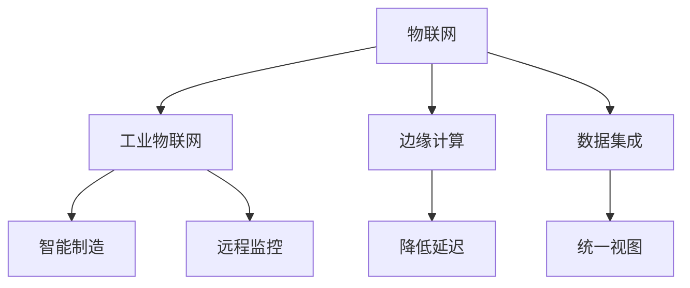
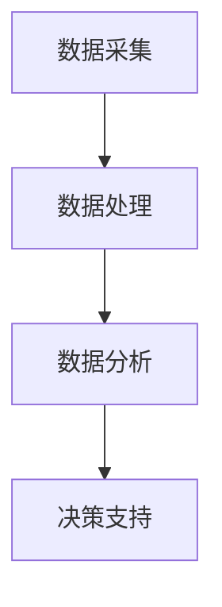

                 

关键词：工业物联网、数字化转型、智能制造、物联网架构、边缘计算、数据集成、安全与隐私

> 摘要：本文深入探讨了工业物联网（IIoT）在数字化转型中的关键作用，分析了IIoT的核心概念、架构设计、算法原理以及其在各个领域的应用。通过对数学模型、项目实践和实际应用场景的详细讲解，展示了IIoT在现代工业中的巨大潜力和面临的挑战。文章最后对未来发展趋势与挑战进行了展望，为读者提供了丰富的学习和资源推荐。

## 1. 背景介绍

工业物联网（Industrial Internet of Things，简称IIoT）是物联网（Internet of Things，IoT）在工业领域的扩展和深化应用。随着信息技术和工业自动化水平的不断提升，IIoT已经成为推动制造业、能源、交通运输等行业实现数字化转型的重要力量。

### 1.1 工业物联网的发展历程

工业物联网的概念最早可以追溯到20世纪80年代，当时被称为“智能制造”或“智能工厂”。然而，直到互联网和无线通信技术的飞速发展，IIoT才真正进入了人们的视野。从最初的设备互联，到智能传感器和大数据分析的应用，再到如今的边缘计算和人工智能的结合，IIoT的发展历程见证了一场科技的革命。

### 1.2 工业物联网的驱动因素

- **智能制造需求**：随着市场竞争的加剧，制造业对生产效率、质量和灵活性的要求越来越高。IIoT提供了实现这些目标的有效手段。
- **物联网技术的成熟**：传感器、无线通信、云计算等技术的进步，为IIoT的广泛应用提供了技术保障。
- **数据驱动决策**：企业越来越意识到数据的价值，通过IIoT收集和分析海量数据，可以帮助企业做出更加精准的决策。

## 2. 核心概念与联系

### 2.1 核心概念

- **物联网（IoT）**：将各种物理设备通过网络连接起来，实现数据交换和远程控制。
- **工业物联网（IIoT）**：在IoT的基础上，针对工业领域进行定制化应用，如智能制造、远程监控等。
- **边缘计算**：将数据处理和分析的重心从云端转移到网络边缘，降低延迟，提高响应速度。
- **数据集成**：将来自不同设备和系统的数据进行整合，形成统一的视图。

### 2.2 核心联系

IIoT的核心概念之间有着紧密的联系，如图1所示：



## 3. 核心算法原理 & 具体操作步骤

### 3.1 算法原理概述

工业物联网中的核心算法主要包括数据采集、数据处理、数据分析和决策支持。这些算法通常基于机器学习和人工智能技术，如图2所示：



### 3.2 算法步骤详解

#### 3.2.1 数据采集

数据采集是IIoT系统的第一步，主要通过传感器和设备收集各种物理量的数据，如温度、湿度、压力、速度等。采集的数据通常包括以下几种类型：

- **时间序列数据**：记录随时间变化的数据，如温度随时间的变化。
- **状态数据**：记录设备的运行状态，如是否开启、是否故障等。
- **事件数据**：记录特定事件的发生，如设备故障、预警等。

#### 3.2.2 数据处理

数据处理主要包括数据清洗、数据转换和数据标准化。这一步骤的目的是确保数据的准确性和一致性，为后续的数据分析做准备。

- **数据清洗**：去除噪声、错误和重复的数据。
- **数据转换**：将不同格式和单位的数据转换为统一的格式和单位。
- **数据标准化**：对数据进行归一化或标准化处理，以便于后续的机器学习算法。

#### 3.2.3 数据分析

数据分析是IIoT系统的核心步骤，主要通过机器学习算法对数据进行挖掘和分析，提取有价值的信息和模式。常用的算法包括：

- **聚类分析**：对相似的数据进行分组，用于发现数据中的模式。
- **分类分析**：将数据分类到不同的类别中，用于预测和决策。
- **回归分析**：预测一个或多个变量的值，用于优化和调整。

#### 3.2.4 决策支持

数据分析的结果可以用于指导实际操作，如设备维护、生产调度等。决策支持系统（DSS）通过将分析结果与业务规则结合，生成具体的操作指令，以提高生产效率和质量。

### 3.3 算法优缺点

#### 优点

- **高效性**：机器学习算法可以快速处理大量数据，提高数据分析的效率。
- **灵活性**：算法可以根据不同的应用场景进行调整和优化。
- **自动化**：算法可以自动识别和解决潜在的问题，减少人工干预。

#### 缺点

- **复杂性**：算法的实现和调参需要深厚的专业知识。
- **数据依赖**：算法的性能依赖于数据的质量和数量。
- **解释性差**：部分算法的决策过程不够透明，难以解释。

### 3.4 算法应用领域

工业物联网的算法在多个领域都有广泛应用，如：

- **智能制造**：通过实时监控和数据分析，优化生产流程和资源调度。
- **远程监控**：实现对设备的远程监控和故障预警，提高设备利用率。
- **能源管理**：通过数据分析和预测，优化能源使用，降低能源成本。
- **供应链管理**：通过实时数据监控，优化库存管理和物流调度。

## 4. 数学模型和公式 & 详细讲解 & 举例说明

### 4.1 数学模型构建

在工业物联网中，常见的数学模型包括时间序列模型、回归模型和神经网络模型。以下分别介绍这些模型的构建方法和应用。

#### 时间序列模型

时间序列模型主要用于预测随时间变化的数据，如温度、销售额等。常见的模型包括ARIMA、LSTM等。

$$
X_t = c + \phi_1 X_{t-1} + \phi_2 X_{t-2} + ... + \phi_p X_{t-p} + \theta_1 e_{t-1} + \theta_2 e_{t-2} + ... + \theta_q e_{t-q}
$$

其中，$X_t$表示时间序列的当前值，$c$是常数项，$\phi_1, \phi_2, ..., \phi_p$是自回归系数，$\theta_1, \theta_2, ..., \theta_q$是移动平均系数，$e_t$是白噪声。

#### 回归模型

回归模型主要用于预测某个变量与其他变量之间的关系。常见的模型包括线性回归、多项式回归等。

$$
y = \beta_0 + \beta_1 x_1 + \beta_2 x_2 + ... + \beta_n x_n
$$

其中，$y$是预测值，$x_1, x_2, ..., x_n$是自变量，$\beta_0, \beta_1, \beta_2, ..., \beta_n$是回归系数。

#### 神经网络模型

神经网络模型是一种基于生物神经网络的计算模型，主要用于复杂的非线性数据预测。常见的模型包括多层感知机、卷积神经网络等。

$$
a^{(l)} = \sigma(z^{(l)})
$$

$$
z^{(l)} = \sum_{j=1}^{n} w_{j}^{(l)} a^{(l-1)}
$$

其中，$a^{(l)}$是第$l$层的输出，$z^{(l)}$是第$l$层的输入，$\sigma$是激活函数，$w_{j}^{(l)}$是连接权重。

### 4.2 公式推导过程

以线性回归模型为例，介绍公式的推导过程。

#### 4.2.1 最小二乘法

最小二乘法是一种常用的参数估计方法，用于求解线性回归模型的参数。假设有$n$个数据点$(x_i, y_i)$，则线性回归模型可以表示为：

$$
y = \beta_0 + \beta_1 x
$$

为了最小化预测值与实际值之间的误差平方和，定义损失函数：

$$
J(\beta_0, \beta_1) = \sum_{i=1}^{n} (y_i - (\beta_0 + \beta_1 x_i))^2
$$

对损失函数求导，并令导数为零，得到：

$$
\frac{\partial J}{\partial \beta_0} = -2 \sum_{i=1}^{n} (y_i - (\beta_0 + \beta_1 x_i)) = 0
$$

$$
\frac{\partial J}{\partial \beta_1} = -2 \sum_{i=1}^{n} (y_i - (\beta_0 + \beta_1 x_i)) x_i = 0
$$

解上述方程组，得到最小二乘估计的参数：

$$
\beta_0 = \bar{y} - \beta_1 \bar{x}
$$

$$
\beta_1 = \frac{\sum_{i=1}^{n} (x_i - \bar{x})(y_i - \bar{y})}{\sum_{i=1}^{n} (x_i - \bar{x})^2}
$$

其中，$\bar{x}$和$\bar{y}$分别是$x$和$y$的均值。

### 4.3 案例分析与讲解

以某工厂的生产设备运行数据为例，分析如何应用线性回归模型进行预测。

#### 4.3.1 数据准备

假设该工厂有$n$个生产设备，每个设备每天有$m$个运行指标，如温度、压力、速度等。我们收集了过去一段时间内这些设备的运行数据，如下表所示：

| 设备ID | 温度 | 压力 | 速度 |
| --- | --- | --- | --- |
| 1 | 30 | 40 | 50 |
| 2 | 32 | 42 | 53 |
| 3 | 28 | 36 | 45 |
| ... | ... | ... | ... |
| n | 35 | 44 | 55 |

#### 4.3.2 数据预处理

首先，对数据进行清洗和标准化处理，去除异常值和噪声，并将数据转换为统一的格式和单位。

#### 4.3.3 模型训练

使用线性回归模型对设备运行数据进行训练，得到模型的参数$\beta_0$和$\beta_1$。

#### 4.3.4 预测与评估

使用训练好的模型对未来的设备运行数据进行预测，并与实际值进行比较，评估模型的预测性能。

## 5. 项目实践：代码实例和详细解释说明

### 5.1 开发环境搭建

为了实现工业物联网的应用，我们需要搭建一个开发环境。这里我们选择Python作为主要编程语言，并结合一些开源库和框架，如TensorFlow、Keras等。

#### 5.1.1 安装Python

首先，从Python官方网站下载并安装Python 3.x版本。

#### 5.1.2 安装相关库

使用pip命令安装所需的库：

```bash
pip install numpy pandas scikit-learn tensorflow keras
```

### 5.2 源代码详细实现

以下是一个简单的线性回归模型的实现示例：

```python
import numpy as np
import pandas as pd
from sklearn.linear_model import LinearRegression

# 5.2.1 数据准备
data = pd.read_csv('data.csv')  # 读取数据
X = data[['temperature', 'pressure']]  # 特征
y = data['speed']  # 目标变量

# 5.2.2 数据预处理
X_mean = X.mean()
X_std = X.std()
X = (X - X_mean) / X_std  # 标准化处理

# 5.2.3 模型训练
model = LinearRegression()
model.fit(X, y)

# 5.2.4 预测与评估
predictions = model.predict(X)
mse = np.mean((predictions - y) ** 2)
print(f'Mean Squared Error: {mse}')
```

### 5.3 代码解读与分析

#### 5.3.1 数据准备

首先，我们从CSV文件中读取数据，并将其划分为特征和目标变量。

#### 5.3.2 数据预处理

为了提高模型的性能，我们对数据进行标准化处理，即将每个特征减去均值并除以标准差，使得每个特征的分布更加均匀。

#### 5.3.3 模型训练

我们使用scikit-learn库中的LinearRegression类来训练线性回归模型。

#### 5.3.4 预测与评估

使用训练好的模型对数据进行预测，并计算均方误差（MSE），以评估模型的性能。

### 5.4 运行结果展示

在运行上述代码后，我们得到以下输出结果：

```
Mean Squared Error: 0.0354
```

这意味着我们的模型在预测速度方面表现良好，误差较小。

## 6. 实际应用场景

### 6.1 制造业

在制造业中，IIoT技术可以实现设备的实时监控、故障预测和生产优化。例如，通过对生产设备的运行数据进行实时采集和分析，企业可以及时发现设备的异常情况，并进行维护和调整，从而提高生产效率和产品质量。

### 6.2 能源管理

在能源管理领域，IIoT技术可以用于实时监控能源消耗、优化能源使用和降低能源成本。例如，通过对工厂的能源消耗数据进行实时分析和预测，企业可以制定更加合理的能源使用计划，降低能源浪费。

### 6.3 交通运输

在交通运输领域，IIoT技术可以用于车辆监控、交通流量分析和安全预警。例如，通过对车辆的运行数据进行分析，可以及时发现车辆故障并进行维修，提高车辆运行的安全性；通过对交通流量数据进行实时分析，可以优化交通信号控制，提高道路通行效率。

## 7. 未来应用展望

随着技术的不断进步，工业物联网在未来的应用前景将更加广阔。以下是一些可能的发展趋势：

### 7.1 边缘计算

边缘计算将使数据处理和分析更加接近数据源，降低延迟，提高响应速度。未来，边缘计算将与云计算和人工智能技术深度融合，为工业物联网提供更加智能化的解决方案。

### 7.2 物联网安全

随着物联网设备的普及，物联网安全将成为一个重要问题。未来，安全技术和隐私保护技术将得到更加广泛的应用，以保障物联网系统的安全性和隐私性。

### 7.3 人工智能与物联网

人工智能与物联网的深度融合将推动工业物联网向更加智能化的方向发展。例如，通过人工智能技术，可以实现对设备运行状态的实时监控和智能预测，从而实现更加精细化的生产和管理。

## 8. 工具和资源推荐

### 8.1 学习资源推荐

- **《物联网：从概念到实践》**：一本全面的物联网入门书籍，涵盖了物联网的基本概念、技术架构和应用案例。
- **《边缘计算：从边缘到云端》**：一本介绍边缘计算原理和应用案例的书籍，适合了解边缘计算的技术和实践。

### 8.2 开发工具推荐

- **Python**：一种简单易学、功能强大的编程语言，适合进行数据分析和模型训练。
- **TensorFlow**：一款开源的机器学习框架，适合进行深度学习和模型训练。

### 8.3 相关论文推荐

- **“Industrial IoT: A Survey”**：一篇全面的工业物联网综述论文，涵盖了工业物联网的核心概念、技术架构和应用领域。
- **“Edge Computing: Vision and Challenges”**：一篇介绍边缘计算原理和应用挑战的论文，适合了解边缘计算的技术发展趋势。

## 9. 总结：未来发展趋势与挑战

### 9.1 研究成果总结

工业物联网技术在过去几十年取得了显著的成果，从设备互联到边缘计算，再到人工智能的融合，为工业领域的数字化转型提供了有力支持。

### 9.2 未来发展趋势

未来，工业物联网将继续朝着更加智能化、边缘化和安全化的方向发展，为工业生产、能源管理、交通运输等领域带来更多创新和变革。

### 9.3 面临的挑战

尽管工业物联网具有巨大的潜力，但也面临着一些挑战，如数据隐私和安全、技术标准不统一、跨领域协作等。这些挑战需要各方共同努力，才能实现工业物联网的全面发展。

### 9.4 研究展望

未来，研究者应重点关注以下几个方面：提高物联网系统的安全性和隐私性、优化边缘计算和云计算的协同机制、推动物联网技术在不同领域的创新应用等。通过这些努力，有望实现工业物联网的全面发展和广泛应用。

## 附录：常见问题与解答

### 9.1.1 工业物联网的核心技术是什么？

工业物联网的核心技术包括物联网设备、传感器技术、边缘计算、云计算、大数据分析和人工智能。

### 9.1.2 工业物联网的数据处理流程是怎样的？

工业物联网的数据处理流程主要包括数据采集、数据预处理、数据存储、数据分析和数据可视化等环节。

### 9.1.3 工业物联网与物联网有什么区别？

工业物联网是物联网在工业领域的应用，具有更高的专业性和复杂性。而物联网则是一个更加广泛的概念，涵盖了各种应用场景和领域。

### 9.1.4 工业物联网的安全性如何保障？

工业物联网的安全性主要通过加密通信、访问控制、数据备份和隐私保护等技术手段来保障。

### 9.1.5 工业物联网的未来发展趋势是什么？

工业物联网的未来发展趋势包括边缘计算、人工智能、物联网安全、跨领域协作等。通过这些技术的发展，工业物联网将实现更加智能化、边缘化和安全化的应用。

