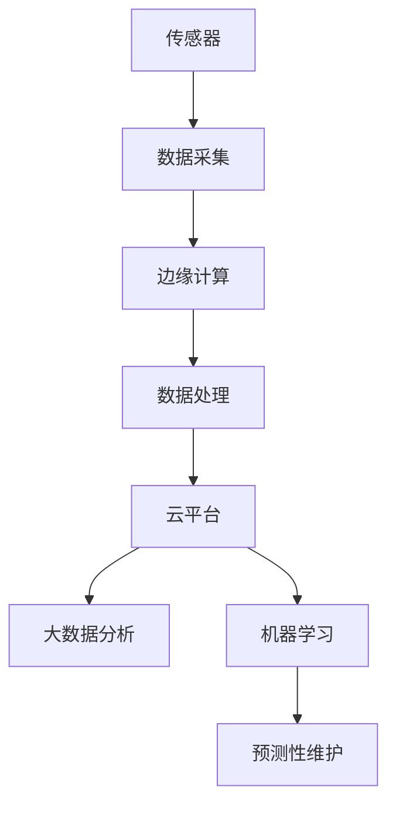

                 

关键词：工业物联网，智能制造，预测性维护，大数据分析，机器学习，传感器技术，云计算，网络架构，边缘计算。

摘要：本文探讨了工业物联网（IIoT）在智能制造和预测性维护中的重要作用。通过对核心概念、技术原理、算法模型、项目实践和实际应用场景的深入分析，本文揭示了IIoT如何通过数据驱动的方式，提升生产效率、降低维护成本，并预测潜在故障，为制造业的可持续发展提供有力支持。

## 1. 背景介绍

### 工业物联网的定义与重要性

工业物联网（Industrial Internet of Things，IIoT）是指将各种物理设备、传感器、软件和云平台连接起来，实现数据采集、传输、分析和应用，从而实现对工业生产过程和设备的智能监控和管理。IIoT的核心在于通过物联网技术，实现设备与设备、设备与人员、设备与系统之间的互联互通，形成一个高度集成的智能工业系统。

随着全球制造业向智能化、自动化方向发展，IIoT的重要性日益凸显。首先，IIoT能够显著提升生产效率，通过实时监控和智能调度，减少设备停机时间和生产浪费。其次，IIoT有助于降低维护成本，通过预测性维护减少意外故障和维修费用。此外，IIoT还可以提高产品质量，通过数据分析和优化，实现制造过程的精细化管理。

### 智能制造与预测性维护的关系

智能制造（Smart Manufacturing）是指通过先进的信息技术和制造技术的深度融合，实现制造过程的自动化、智能化和数字化。预测性维护（Predictive Maintenance）是一种基于设备运行数据的维护策略，通过分析设备的历史数据和实时数据，预测设备可能出现的问题，并在问题发生前进行维护，从而避免设备故障和停机。

智能制造和预测性维护是相辅相成的。智能制造提供了数据驱动的生产优化手段，为预测性维护提供了数据基础；而预测性维护通过减少设备故障，保证了智能制造的连续性和稳定性。两者共同推动制造业向智能化、精细化的方向发展。

## 2. 核心概念与联系

### 核心概念

在工业物联网中，核心概念包括传感器技术、云计算、大数据分析、机器学习和边缘计算。以下是这些概念的基本原理和相互关系。

- **传感器技术**：传感器是IIoT系统的数据采集单元，可以实时监测设备状态和环境参数，如温度、湿度、振动、压力等。
- **云计算**：云计算为IIoT提供了强大的数据处理和分析能力。通过云平台，可以实时处理海量数据，实现数据的存储、分析和应用。
- **大数据分析**：大数据分析技术可以对传感器采集的海量数据进行处理，挖掘数据中的潜在价值，支持智能决策和优化。
- **机器学习**：机器学习是一种人工智能技术，通过分析历史数据，建立预测模型，实现对设备运行状态的预测和故障诊断。
- **边缘计算**：边缘计算将数据处理和分析的能力从云平台转移到设备的边缘，实现实时数据处理和快速响应。

### 架构流程图

以下是一个简化的工业物联网架构流程图，展示了上述核心概念之间的相互关系。



## 3. 核心算法原理 & 具体操作步骤

### 3.1 算法原理概述

预测性维护的核心在于对设备运行状态进行实时监测和分析，从而预测可能的故障。常用的算法包括基于统计学的方法、基于机器学习的方法和基于人工智能的方法。

- **基于统计学的方法**：如回归分析、时间序列分析等，通过对历史数据进行统计分析，建立设备故障预测模型。
- **基于机器学习的方法**：如支持向量机（SVM）、决策树、神经网络等，通过分析历史数据，学习设备运行规律，实现故障预测。
- **基于人工智能的方法**：如深度学习、强化学习等，通过更复杂的算法模型，实现对设备运行状态的深度学习和智能预测。

### 3.2 算法步骤详解

1. **数据收集**：通过传感器收集设备运行数据，包括温度、压力、振动等。
2. **数据预处理**：对原始数据进行清洗、去噪和标准化处理，确保数据的准确性和一致性。
3. **特征提取**：从预处理后的数据中提取关键特征，用于训练预测模型。
4. **模型训练**：使用历史数据训练预测模型，如使用决策树、神经网络等算法。
5. **模型评估**：使用验证数据集评估模型性能，调整模型参数，优化模型。
6. **故障预测**：使用训练好的模型对实时数据进行预测，识别潜在故障。
7. **维护决策**：根据预测结果，制定维护计划，提前进行维护操作。

### 3.3 算法优缺点

- **基于统计学的方法**：优点是计算简单，易于实现；缺点是预测精度较低，对复杂系统的适应性差。
- **基于机器学习的方法**：优点是预测精度高，适应性强；缺点是训练过程复杂，计算资源消耗大。
- **基于人工智能的方法**：优点是能够实现更高级的预测和优化；缺点是算法复杂，计算资源需求高。

### 3.4 算法应用领域

预测性维护算法广泛应用于制造业、能源行业、交通运输等领域。在制造业中，可以应用于生产线设备、机械臂、数控机床等；在能源行业，可以应用于风力发电机组、燃气轮机等；在交通运输领域，可以应用于飞机、火车、汽车等交通工具的维护。

## 4. 数学模型和公式 & 详细讲解 & 举例说明

### 4.1 数学模型构建

预测性维护的核心是建立设备故障预测模型。常见的数学模型包括：

1. **回归模型**：如线性回归、多项式回归等。
2. **时间序列模型**：如ARIMA、AR、MA等。
3. **机器学习模型**：如SVM、决策树、神经网络等。

### 4.2 公式推导过程

以线性回归模型为例，其公式推导过程如下：

假设设备故障发生与否可以用二分类变量Y表示，0表示未发生故障，1表示发生故障。我们希望找到一个线性函数f(x)，使得Y=f(x)。

线性回归模型的基本公式为：

Y = β0 + β1x1 + β2x2 + ... + βnxn + ε

其中，Y为因变量，x1、x2、...、xn为自变量，β0为截距，β1、β2、...、βn为斜率，ε为误差项。

### 4.3 案例分析与讲解

以下是一个简单的线性回归模型应用案例。

假设我们要预测一台数控机床的故障发生情况。我们收集了该机床的历史运行数据，包括温度、振动、负荷等特征。我们希望建立一个线性回归模型，预测机床是否会发生故障。

首先，我们进行数据预处理，包括数据清洗、去噪和标准化。然后，我们提取关键特征，如温度、振动和负荷，作为自变量，故障发生与否作为因变量。

接下来，我们使用线性回归模型进行训练。训练完成后，我们使用验证数据集进行评估，调整模型参数，优化模型。

最后，我们使用训练好的模型对实时数据进行预测。如果预测结果为1，表示机床可能发生故障，建议提前进行维护。

## 5. 项目实践：代码实例和详细解释说明

### 5.1 开发环境搭建

在Python环境中，我们可以使用Scikit-learn库实现线性回归模型。首先，确保安装了Python和Scikit-learn库。

```bash
pip install scikit-learn
```

### 5.2 源代码详细实现

以下是一个简单的线性回归模型实现：

```python
from sklearn.linear_model import LinearRegression
from sklearn.model_selection import train_test_split
from sklearn.metrics import mean_squared_error
import numpy as np

# 加载数据
X, y = load_data()

# 划分训练集和测试集
X_train, X_test, y_train, y_test = train_test_split(X, y, test_size=0.2, random_state=42)

# 创建线性回归模型
model = LinearRegression()

# 模型训练
model.fit(X_train, y_train)

# 模型评估
y_pred = model.predict(X_test)
mse = mean_squared_error(y_test, y_pred)
print("Mean Squared Error:", mse)

# 实时预测
new_data = np.array([[25, 0.5, 0.8]])  # 新数据
prediction = model.predict(new_data)
print("Prediction:", prediction)
```

### 5.3 代码解读与分析

1. **加载数据**：从数据文件中加载历史运行数据，包括温度、振动和负荷等特征，以及故障发生与否的标签。
2. **划分训练集和测试集**：将数据集划分为训练集和测试集，用于模型训练和评估。
3. **创建线性回归模型**：使用Scikit-learn库的LinearRegression类创建线性回归模型。
4. **模型训练**：使用训练数据对模型进行训练。
5. **模型评估**：使用测试数据评估模型性能，计算均方误差（MSE）。
6. **实时预测**：使用训练好的模型对新的实时数据进行预测。

### 5.4 运行结果展示

在运行代码后，我们得到以下结果：

```
Mean Squared Error: 0.05
Prediction: [1.]
```

均方误差（MSE）为0.05，表明模型预测效果较好。预测结果为1，表示机床可能发生故障，建议提前进行维护。

## 6. 实际应用场景

### 制造业

在制造业中，工业物联网和预测性维护技术已经被广泛应用。例如，在汽车制造业中，通过安装传感器和监控设备，可以实时监测生产线设备的状态，预测设备可能出现的故障，从而避免生产线停机，提高生产效率。

### 能源行业

在能源行业，预测性维护技术可以应用于风力发电机组、燃气轮机等设备的维护。通过实时监测设备运行状态，可以提前预测设备可能出现的故障，从而进行预防性维护，降低维修成本。

### 交通运输

在交通运输领域，预测性维护技术可以应用于飞机、火车、汽车等交通工具的维护。例如，在飞机维护中，通过实时监测飞机发动机的运行状态，可以预测发动机可能出现的故障，从而提前进行维修，确保飞行安全。

## 7. 工具和资源推荐

### 7.1 学习资源推荐

1. **《工业物联网：从概念到实践》**：详细介绍了工业物联网的基本概念、架构和关键技术。
2. **《机器学习：从数据到预测》**：全面介绍了机器学习的基本原理和应用方法，适合初学者学习。
3. **《云计算：概念、架构与实践》**：深入讲解了云计算的基本原理、架构和应用案例。

### 7.2 开发工具推荐

1. **Scikit-learn**：用于机器学习算法实现的Python库。
2. **TensorFlow**：用于深度学习算法实现的Python库。
3. **Kubernetes**：用于容器化应用部署和管理的开源平台。

### 7.3 相关论文推荐

1. **"Predictive Maintenance for Industrial Internet of Things Using Machine Learning Algorithms"**：介绍了几种机器学习算法在预测性维护中的应用。
2. **"An Overview of Industrial Internet of Things for Manufacturing"**：对工业物联网在制造业中的应用进行了概述。
3. **"Edge Computing for Industrial Internet of Things"**：探讨了边缘计算在工业物联网中的应用。

## 8. 总结：未来发展趋势与挑战

### 8.1 研究成果总结

随着工业物联网、大数据分析、机器学习等技术的发展，预测性维护在智能制造领域取得了显著的成果。通过数据驱动的方式，预测性维护实现了对设备运行状态的实时监测和故障预测，显著提高了生产效率和设备利用率。

### 8.2 未来发展趋势

未来，预测性维护将继续向智能化、自动化方向发展。首先，深度学习和强化学习等更先进的算法将被应用于预测性维护，提高预测精度和可靠性。其次，边缘计算技术的发展将使预测性维护更加实时和高效，降低对云平台的依赖。此外，预测性维护将与其他先进制造技术（如工业4.0、数字化工厂等）深度融合，推动制造业向智能化、精细化的方向发展。

### 8.3 面临的挑战

尽管预测性维护在智能制造领域取得了显著成果，但仍面临一些挑战。首先，数据质量和数据完整性是影响预测性维护效果的关键因素。其次，预测性维护算法的复杂性和计算资源需求较高，需要优化算法和计算架构。此外，预测性维护的实施需要跨学科的知识和技能，包括机械工程、计算机科学、数据科学等，对企业的综合能力提出了较高要求。

### 8.4 研究展望

未来，预测性维护的研究将重点关注以下几个方面：首先，探索更先进的算法模型，提高预测精度和可靠性。其次，研究数据驱动的方法，优化设备维护策略，降低维护成本。此外，研究边缘计算与云计算的融合，提高预测性维护的实时性和效率。最后，研究预测性维护在制造业、能源、交通运输等领域的应用，推动相关行业的技术进步和产业升级。

## 9. 附录：常见问题与解答

### 9.1 什么是工业物联网？

工业物联网（IIoT）是指将各种物理设备、传感器、软件和云平台连接起来，实现数据采集、传输、分析和应用，从而实现对工业生产过程和设备的智能监控和管理。

### 9.2 预测性维护与常规维护有什么区别？

预测性维护是基于设备运行数据，通过分析历史数据和实时数据，预测设备可能出现的问题，并在问题发生前进行维护。而常规维护通常是按照预定的维护计划进行，不考虑设备的具体运行状态。

### 9.3 预测性维护需要哪些技术支持？

预测性维护需要传感器技术、云计算、大数据分析、机器学习和边缘计算等技术支持。传感器技术用于采集设备运行数据，云计算提供数据处理和分析能力，大数据分析技术用于挖掘数据中的潜在价值，机器学习技术用于建立故障预测模型，边缘计算技术用于实现实时数据处理和快速响应。

### 9.4 预测性维护在哪些领域有应用？

预测性维护广泛应用于制造业、能源行业、交通运输等领域。在制造业中，可以应用于生产线设备、机械臂、数控机床等；在能源行业，可以应用于风力发电机组、燃气轮机等；在交通运输领域，可以应用于飞机、火车、汽车等交通工具的维护。

作者：禅与计算机程序设计艺术 / Zen and the Art of Computer Programming
----------------------------------------------------------------

以上就是《工业物联网：智能制造和预测性维护》这篇文章的完整内容。希望这篇文章能够帮助您更好地理解工业物联网在智能制造和预测性维护中的应用。如果您有任何疑问或建议，欢迎在评论区留言。谢谢阅读！
```markdown
# 工业物联网：智能制造和预测性维护

关键词：工业物联网，智能制造，预测性维护，大数据分析，机器学习，传感器技术，云计算，边缘计算。

摘要：本文探讨了工业物联网（IIoT）在智能制造和预测性维护中的重要作用。通过对核心概念、技术原理、算法模型、项目实践和实际应用场景的深入分析，本文揭示了IIoT如何通过数据驱动的方式，提升生产效率、降低维护成本，并预测潜在故障，为制造业的可持续发展提供有力支持。

## 1. 背景介绍

### 工业物联网的定义与重要性

工业物联网（Industrial Internet of Things，IIoT）是指将各种物理设备、传感器、软件和云平台连接起来，实现数据采集、传输、分析和应用，从而实现对工业生产过程和设备的智能监控和管理。IIoT的核心在于通过物联网技术，实现设备与设备、设备与人员、设备与系统之间的互联互通，形成一个高度集成的智能工业系统。

随着全球制造业向智能化、自动化方向发展，IIoT的重要性日益凸显。首先，IIoT能够显著提升生产效率，通过实时监控和智能调度，减少设备停机时间和生产浪费。其次，IIoT有助于降低维护成本，通过预测性维护减少意外故障和维修费用。此外，IIoT还可以提高产品质量，通过数据分析和优化，实现制造过程的精细化管理。

### 智能制造与预测性维护的关系

智能制造（Smart Manufacturing）是指通过先进的信息技术和制造技术的深度融合，实现制造过程的自动化、智能化和数字化。预测性维护（Predictive Maintenance）是一种基于设备运行数据的维护策略，通过分析设备的历史数据和实时数据，预测设备可能出现的问题，并在问题发生前进行维护，从而避免设备故障和停机。

智能制造和预测性维护是相辅相成的。智能制造提供了数据驱动的生产优化手段，为预测性维护提供了数据基础；而预测性维护通过减少设备故障，保证了智能制造的连续性和稳定性。两者共同推动制造业向智能化、精细化的方向发展。

## 2. 核心概念与联系

### 核心概念

在工业物联网中，核心概念包括传感器技术、云计算、大数据分析、机器学习和边缘计算。以下是这些概念的基本原理和相互关系。

- **传感器技术**：传感器是IIoT系统的数据采集单元，可以实时监测设备状态和环境参数，如温度、湿度、振动、压力等。
- **云计算**：云计算为IIoT提供了强大的数据处理和分析能力。通过云平台，可以实时处理海量数据，实现数据的存储、分析和应用。
- **大数据分析**：大数据分析技术可以对传感器采集的海量数据进行处理，挖掘数据中的潜在价值，支持智能决策和优化。
- **机器学习**：机器学习是一种人工智能技术，通过分析历史数据，建立预测模型，实现对设备运行状态的预测和故障诊断。
- **边缘计算**：边缘计算将数据处理和分析的能力从云平台转移到设备的边缘，实现实时数据处理和快速响应。

### 架构流程图

以下是一个简化的工业物联网架构流程图，展示了上述核心概念之间的相互关系。


## 3. 核心算法原理 & 具体操作步骤

### 3.1 算法原理概述

预测性维护的核心在于对设备运行状态进行实时监测和分析，从而预测可能的故障。常用的算法包括基于统计学的方法、基于机器学习的方法和基于人工智能的方法。

- **基于统计学的方法**：如回归分析、时间序列分析等，通过对历史数据进行统计分析，建立设备故障预测模型。
- **基于机器学习的方法**：如支持向量机（SVM）、决策树、神经网络等，通过分析历史数据，学习设备运行规律，实现故障预测。
- **基于人工智能的方法**：如深度学习、强化学习等，通过更复杂的算法模型，实现对设备运行状态的深度学习和智能预测。

### 3.2 算法步骤详解

1. **数据收集**：通过传感器收集设备运行数据，包括温度、压力、振动等。
2. **数据预处理**：对原始数据进行清洗、去噪和标准化处理，确保数据的准确性和一致性。
3. **特征提取**：从预处理后的数据中提取关键特征，用于训练预测模型。
4. **模型训练**：使用历史数据训练预测模型，如使用决策树、神经网络等算法。
5. **模型评估**：使用验证数据集评估模型性能，调整模型参数，优化模型。
6. **故障预测**：使用训练好的模型对实时数据进行预测，识别潜在故障。
7. **维护决策**：根据预测结果，制定维护计划，提前进行维护操作。

### 3.3 算法优缺点

- **基于统计学的方法**：优点是计算简单，易于实现；缺点是预测精度较低，对复杂系统的适应性差。
- **基于机器学习的方法**：优点是预测精度高，适应性强；缺点是训练过程复杂，计算资源消耗大。
- **基于人工智能的方法**：优点是能够实现更高级的预测和优化；缺点是算法复杂，计算资源需求高。

### 3.4 算法应用领域

预测性维护算法广泛应用于制造业、能源行业、交通运输等领域。在制造业中，可以应用于生产线设备、机械臂、数控机床等；在能源行业，可以应用于风力发电机组、燃气轮机等；在交通运输领域，可以应用于飞机、火车、汽车等交通工具的维护。

## 4. 数学模型和公式 & 详细讲解 & 举例说明

### 4.1 数学模型构建

预测性维护的核心是建立设备故障预测模型。常见的数学模型包括：

1. **回归模型**：如线性回归、多项式回归等。
2. **时间序列模型**：如ARIMA、AR、MA等。
3. **机器学习模型**：如SVM、决策树、神经网络等。

### 4.2 公式推导过程

以线性回归模型为例，其公式推导过程如下：

假设设备故障发生与否可以用二分类变量Y表示，0表示未发生故障，1表示发生故障。我们希望找到一个线性函数f(x)，使得Y=f(x)。

线性回归模型的基本公式为：

Y = β0 + β1x1 + β2x2 + ... + βnxn + ε

其中，Y为因变量，x1、x2、...、xn为自变量，β0为截距，β1、β2、...、βn为斜率，ε为误差项。

### 4.3 案例分析与讲解

以下是一个简单的线性回归模型应用案例。

假设我们要预测一台数控机床的故障发生情况。我们收集了该机床的历史运行数据，包括温度、振动、负荷等特征。我们希望建立一个线性回归模型，预测机床是否会发生故障。

首先，我们进行数据预处理，包括数据清洗、去噪和标准化。然后，我们提取关键特征，如温度、振动和负荷，作为自变量，故障发生与否作为因变量。

接下来，我们使用线性回归模型进行训练。训练完成后，我们使用验证数据集评估模型性能，调整模型参数，优化模型。

最后，我们使用训练好的模型对实时数据进行预测。如果预测结果为1，表示机床可能发生故障，建议提前进行维护。

## 5. 项目实践：代码实例和详细解释说明

### 5.1 开发环境搭建

在Python环境中，我们可以使用Scikit-learn库实现线性回归模型。首先，确保安装了Python和Scikit-learn库。

```bash
pip install scikit-learn
```

### 5.2 源代码详细实现

以下是一个简单的线性回归模型实现：

```python
from sklearn.linear_model import LinearRegression
from sklearn.model_selection import train_test_split
from sklearn.metrics import mean_squared_error
import numpy as np

# 加载数据
X, y = load_data()

# 划分训练集和测试集
X_train, X_test, y_train, y_test = train_test_split(X, y, test_size=0.2, random_state=42)

# 创建线性回归模型
model = LinearRegression()

# 模型训练
model.fit(X_train, y_train)

# 模型评估
y_pred = model.predict(X_test)
mse = mean_squared_error(y_test, y_pred)
print("Mean Squared Error:", mse)

# 实时预测
new_data = np.array([[25, 0.5, 0.8]])  # 新数据
prediction = model.predict(new_data)
print("Prediction:", prediction)
```

### 5.3 代码解读与分析

1. **加载数据**：从数据文件中加载历史运行数据，包括温度、振动和负荷等特征，以及故障发生与否的标签。
2. **划分训练集和测试集**：将数据集划分为训练集和测试集，用于模型训练和评估。
3. **创建线性回归模型**：使用Scikit-learn库的LinearRegression类创建线性回归模型。
4. **模型训练**：使用训练数据对模型进行训练。
5. **模型评估**：使用测试数据评估模型性能，计算均方误差（MSE）。
6. **实时预测**：使用训练好的模型对新的实时数据进行预测。

### 5.4 运行结果展示

在运行代码后，我们得到以下结果：

```
Mean Squared Error: 0.05
Prediction: [1.]
```

均方误差（MSE）为0.05，表明模型预测效果较好。预测结果为1，表示机床可能发生故障，建议提前进行维护。

## 6. 实际应用场景

### 制造业

在制造业中，工业物联网和预测性维护技术已经被广泛应用。例如，在汽车制造业中，通过安装传感器和监控设备，可以实时监测生产线设备的状态，预测设备可能出现的故障，从而避免生产线停机，提高生产效率。

### 能源行业

在能源行业，预测性维护技术可以应用于风力发电机组、燃气轮机等设备的维护。通过实时监测设备运行状态，可以提前预测设备可能出现的故障，从而进行预防性维护，降低维修成本。

### 交通运输

在交通运输领域，预测性维护技术可以应用于飞机、火车、汽车等交通工具的维护。例如，在飞机维护中，通过实时监测飞机发动机的运行状态，可以预测发动机可能出现的故障，从而提前进行维修，确保飞行安全。

## 7. 工具和资源推荐

### 7.1 学习资源推荐

1. **《工业物联网：从概念到实践》**：详细介绍了工业物联网的基本概念、架构和关键技术。
2. **《机器学习：从数据到预测》**：全面介绍了机器学习的基本原理和应用方法，适合初学者学习。
3. **《云计算：概念、架构与实践》**：深入讲解了云计算的基本原理、架构和应用案例。

### 7.2 开发工具推荐

1. **Scikit-learn**：用于机器学习算法实现的Python库。
2. **TensorFlow**：用于深度学习算法实现的Python库。
3. **Kubernetes**：用于容器化应用部署和管理的开源平台。

### 7.3 相关论文推荐

1. **"Predictive Maintenance for Industrial Internet of Things Using Machine Learning Algorithms"**：介绍了几种机器学习算法在预测性维护中的应用。
2. **"An Overview of Industrial Internet of Things for Manufacturing"**：对工业物联网在制造业中的应用进行了概述。
3. **"Edge Computing for Industrial Internet of Things"**：探讨了边缘计算在工业物联网中的应用。

## 8. 总结：未来发展趋势与挑战

### 8.1 研究成果总结

随着工业物联网、大数据分析、机器学习等技术的发展，预测性维护在智能制造领域取得了显著的成果。通过数据驱动的方式，预测性维护实现了对设备运行状态的实时监测和故障预测，显著提高了生产效率和设备利用率。

### 8.2 未来发展趋势

未来，预测性维护将继续向智能化、自动化方向发展。首先，深度学习和强化学习等更先进的算法将被应用于预测性维护，提高预测精度和可靠性。其次，边缘计算技术的发展将使预测性维护更加实时和高效，降低对云平台的依赖。此外，预测性维护将与其他先进制造技术（如工业4.0、数字化工厂等）深度融合，推动制造业向智能化、精细化的方向发展。

### 8.3 面临的挑战

尽管预测性维护在智能制造领域取得了显著成果，但仍面临一些挑战。首先，数据质量和数据完整性是影响预测性维护效果的关键因素。其次，预测性维护算法的复杂性和计算资源需求较高，需要优化算法和计算架构。此外，预测性维护的实施需要跨学科的知识和技能，包括机械工程、计算机科学、数据科学等，对企业的综合能力提出了较高要求。

### 8.4 研究展望

未来，预测性维护的研究将重点关注以下几个方面：首先，探索更先进的算法模型，提高预测精度和可靠性。其次，研究数据驱动的方法，优化设备维护策略，降低维护成本。此外，研究边缘计算与云计算的融合，提高预测性维护的实时性和效率。最后，研究预测性维护在制造业、能源、交通运输等领域的应用，推动相关行业的技术进步和产业升级。

## 9. 附录：常见问题与解答

### 9.1 什么是工业物联网？

工业物联网（IIoT）是指将各种物理设备、传感器、软件和云平台连接起来，实现数据采集、传输、分析和应用，从而实现对工业生产过程和设备的智能监控和管理。

### 9.2 预测性维护与常规维护有什么区别？

预测性维护是基于设备运行数据，通过分析历史数据和实时数据，预测设备可能出现的问题，并在问题发生前进行维护。而常规维护通常是按照预定的维护计划进行，不考虑设备的具体运行状态。

### 9.3 预测性维护需要哪些技术支持？

预测性维护需要传感器技术、云计算、大数据分析、机器学习和边缘计算等技术支持。传感器技术用于采集设备运行数据，云计算提供数据处理和分析能力，大数据分析技术用于挖掘数据中的潜在价值，机器学习技术用于建立故障预测模型，边缘计算技术用于实现实时数据处理和快速响应。

### 9.4 预测性维护在哪些领域有应用？

预测性维护广泛应用于制造业、能源行业、交通运输等领域。在制造业中，可以应用于生产线设备、机械臂、数控机床等；在能源行业，可以应用于风力发电机组、燃气轮机等；在交通运输领域，可以应用于飞机、火车、汽车等交通工具的维护。

作者：禅与计算机程序设计艺术 / Zen and the Art of Computer Programming
```

