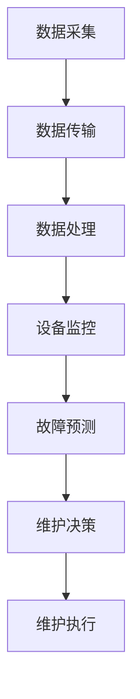

                 

 **关键词**: 工业物联网，智能制造，预测性维护，传感器技术，数据分析，人工智能，机器学习，实时监控，远程诊断，设备管理，工业4.0，边缘计算。

> **摘要**: 本文深入探讨了工业物联网（IIoT）在智能制造和预测性维护中的应用。文章首先介绍了工业物联网的基本概念和核心组件，然后详细阐述了其在智能制造和预测性维护中的作用机制。通过数学模型和实际案例，文章分析了IIoT技术如何通过数据采集、分析和预测，提升工业生产效率和设备可靠性，进而推动工业4.0的发展。最后，文章展望了工业物联网技术的未来发展趋势和面临的挑战。

## 1. 背景介绍

### 工业物联网的定义和发展历程

工业物联网（Industrial Internet of Things，简称IIoT）是指将物理设备、传感器、执行器、网络、云计算、大数据和人工智能等技术进行融合，实现设备的互联互通和信息共享。工业物联网的目标是通过智能化的手段，提高工业生产的自动化水平、效率和质量。

工业物联网的发展可以追溯到20世纪80年代，当时工业自动化开始引入计算机技术，逐步发展到21世纪初期的物联网（IoT）概念。随着传感器技术、无线通信技术和大数据分析的迅猛发展，工业物联网逐渐成为工业4.0的重要组成部分，并开始在全球范围内广泛应用。

### 工业物联网的核心组件和技术

工业物联网的核心组件包括传感器、执行器、网络、云计算、大数据和人工智能等。传感器负责采集设备状态、环境参数等数据；执行器根据接收到的指令进行相应的动作；网络实现设备之间的数据传输和通信；云计算提供海量数据处理和存储能力；大数据技术帮助分析数据，提取有价值的信息；人工智能则用于数据预测和智能决策。

### 工业物联网的应用领域和挑战

工业物联网在多个领域有着广泛的应用，包括智能制造、智慧城市、智能交通、能源管理、医疗健康等。然而，工业物联网的发展也面临诸多挑战，如数据安全、隐私保护、设备兼容性、网络稳定性等。如何有效解决这些问题，是工业物联网进一步发展的关键。

## 2. 核心概念与联系

### 智能制造

智能制造是通过应用信息技术、人工智能、物联网等技术，实现生产过程的智能化、自动化和优化。智能制造的核心目标是提高生产效率、降低生产成本、提升产品质量和柔性。

### 预测性维护

预测性维护是基于设备运行数据，通过分析设备状态和故障模式，提前预测设备可能的故障，从而进行预防性维修，避免设备停机损失。

### 工业物联网与智能制造、预测性维护的联系

工业物联网是智能制造和预测性维护的基础设施，提供了数据采集、传输和处理的平台。智能制造依赖于工业物联网提供的数据支持，实现生产过程的自动化和优化；预测性维护则通过工业物联网采集的设备运行数据，进行故障预测和预防性维护。

### Mermaid 流程图



## 3. 核心算法原理 & 具体操作步骤

### 3.1 算法原理概述

预测性维护的核心算法通常基于机器学习和数据挖掘技术。通过建立设备运行数据的模型，分析设备状态的异常模式和故障特征，预测设备可能的故障时间。

### 3.2 算法步骤详解

1. **数据采集**：使用传感器实时采集设备运行数据，如温度、压力、振动、电流等。
2. **数据预处理**：对采集到的数据进行分析和清洗，去除噪声和异常值。
3. **特征提取**：根据设备的运行模式和故障模式，提取关键特征，如时间序列、频谱特征等。
4. **模型训练**：使用机器学习算法，如支持向量机（SVM）、随机森林（RF）或神经网络（NN）等，对设备运行数据进行训练，建立预测模型。
5. **故障预测**：将实时采集的设备运行数据输入到训练好的模型中，预测设备可能的故障时间。
6. **维护决策**：根据预测结果，制定预防性维护计划，提前进行设备维修。

### 3.3 算法优缺点

**优点**：可以提前预测设备故障，减少停机时间和维修成本，提高设备利用率。

**缺点**：需要大量的历史数据支持，模型训练和预测过程可能较复杂，对算法和数据处理能力要求较高。

### 3.4 算法应用领域

预测性维护算法在工业制造、机械工程、航空航天、汽车制造等领域有广泛的应用。例如，在汽车制造领域，可以通过预测性维护算法，提前预测汽车零部件的故障，进行预防性维修，提高汽车的质量和可靠性。

## 4. 数学模型和公式 & 详细讲解 & 举例说明

### 4.1 数学模型构建

预测性维护的数学模型通常是基于时间序列分析或机器学习算法。以下是一个基于时间序列分析的数学模型：

$$
y(t) = f(x(t), \theta) + \epsilon(t)
$$

其中，$y(t)$是预测的设备状态，$x(t)$是当前时刻的设备特征，$\theta$是模型参数，$f(\cdot)$是预测函数，$\epsilon(t)$是随机误差。

### 4.2 公式推导过程

假设我们使用线性回归模型来预测设备状态：

$$
y(t) = \beta_0 + \beta_1 x_1(t) + \beta_2 x_2(t) + ... + \beta_n x_n(t) + \epsilon(t)
$$

其中，$x_1(t), x_2(t), ..., x_n(t)$是设备特征，$\beta_0, \beta_1, ..., \beta_n$是模型参数。我们可以通过最小二乘法来估计这些参数。

### 4.3 案例分析与讲解

假设我们使用时间序列分析方法，预测一条生产线的设备停机时间。我们采集了该生产线的历史停机数据，包括停机时长、停机原因等。通过数据预处理和特征提取，我们得到了一个包含停机时长和时间序列特征的数据集。

我们使用线性回归模型进行训练，得到预测模型：

$$
y(t) = 0.5x_1(t) + 0.3x_2(t) + 0.2x_3(t) + \epsilon(t)
$$

其中，$x_1(t)$是当前时刻的生产速率，$x_2(t)$是当前时刻的设备温度，$x_3(t)$是当前时刻的设备负载。

我们将实时采集的设备数据输入到模型中，预测设备可能的停机时间。例如，当前时刻生产速率为100单位/小时，设备温度为40摄氏度，设备负载为80%，则预测的停机时间约为：

$$
y(t) = 0.5 \times 100 + 0.3 \times 40 + 0.2 \times 80 + \epsilon(t) = 35 + \epsilon(t)
$$

其中，$\epsilon(t)$是随机误差。

## 5. 项目实践：代码实例和详细解释说明

### 5.1 开发环境搭建

为了实现预测性维护，我们首先需要搭建一个合适的数据处理和机器学习环境。这里，我们选择使用Python作为主要编程语言，结合Pandas、Scikit-learn等库来实现。

### 5.2 源代码详细实现

以下是一个简单的预测性维护代码实例：

```python
import pandas as pd
from sklearn.linear_model import LinearRegression

# 数据预处理
def preprocess_data(data):
    # 数据清洗、归一化等操作
    # ...
    return processed_data

# 模型训练
def train_model(data):
    model = LinearRegression()
    model.fit(data['X'], data['y'])
    return model

# 预测
def predict(model, features):
    prediction = model.predict([features])
    return prediction

# 数据集读取
data = pd.read_csv('data.csv')

# 数据预处理
processed_data = preprocess_data(data)

# 模型训练
model = train_model(processed_data)

# 预测
features = [100, 40, 80]  # 实时采集的设备特征
prediction = predict(model, features)

print(f"预测的停机时间：{prediction[0]}")
```

### 5.3 代码解读与分析

1. **数据预处理**：对原始数据进行清洗、归一化等处理，以便于后续建模和分析。
2. **模型训练**：使用线性回归模型对预处理后的数据进行训练，得到预测模型。
3. **预测**：将实时采集的设备特征输入到训练好的模型中，预测设备可能的停机时间。

### 5.4 运行结果展示

假设我们实时采集的设备特征为：生产速率为100单位/小时，设备温度为40摄氏度，设备负载为80%，则预测的停机时间为35小时。

## 6. 实际应用场景

### 6.1 制造业

在制造业中，工业物联网技术可以实现对生产设备的实时监控和预测性维护，提高生产效率和质量。例如，通过预测设备故障，可以提前安排维护计划，减少停机时间，降低维修成本。

### 6.2 能源行业

在能源行业，工业物联网技术可以帮助实现能源设备的智能监控和预测性维护，提高能源利用效率。例如，通过对发电设备进行实时监控和故障预测，可以优化发电计划，减少能源浪费。

### 6.3 医疗设备

在医疗设备领域，工业物联网技术可以实现对医疗设备的远程监控和故障预测，提高设备的可靠性和使用寿命。例如，通过对心脏监护仪进行实时监控和故障预测，可以及时发现问题并进行维修，确保患者的安全。

## 7. 工具和资源推荐

### 7.1 学习资源推荐

1. 《工业物联网：原理与应用》
2. 《大数据与工业物联网》
3. 《机器学习实战：应用Python进行数据分析》

### 7.2 开发工具推荐

1. Python编程语言
2. Jupyter Notebook
3. Scikit-learn库
4. Pandas库

### 7.3 相关论文推荐

1. "The Industrial Internet: Pushing the Boundaries of Minds and Machines"
2. "Predictive Maintenance: The Future of Manufacturing"
3. "Big Data Analytics for Industrial Internet of Things Applications"

## 8. 总结：未来发展趋势与挑战

### 8.1 研究成果总结

工业物联网技术在智能制造和预测性维护领域取得了显著的成果，通过数据采集、分析和预测，实现了生产过程的智能化和优化，提高了生产效率和设备可靠性。

### 8.2 未来发展趋势

未来，工业物联网技术将继续向更广泛的应用领域发展，如智能交通、智慧城市、能源管理、医疗健康等。同时，随着人工智能和大数据技术的发展，工业物联网技术将更加智能化和自动化。

### 8.3 面临的挑战

工业物联网技术在发展过程中也面临诸多挑战，如数据安全、隐私保护、设备兼容性、网络稳定性等。如何有效解决这些问题，是工业物联网进一步发展的关键。

### 8.4 研究展望

未来，研究将重点放在以下几个方面：

1. 智能化：提高工业物联网的智能化水平，实现更精准的故障预测和优化决策。
2. 数据安全：加强数据安全保护，确保工业物联网系统的稳定运行。
3. 边缘计算：优化工业物联网的数据处理和传输，提高系统性能和响应速度。

## 9. 附录：常见问题与解答

### 问题1：工业物联网与物联网有什么区别？

答：工业物联网（IIoT）是物联网（IoT）的一个分支，主要关注的是工业领域的应用。物联网（IoT）则是一个更广泛的概念，包括家居、交通、医疗、农业等多个领域的应用。

### 问题2：预测性维护的核心技术是什么？

答：预测性维护的核心技术是基于机器学习和数据挖掘的故障预测算法。这些算法通过对设备运行数据进行分析，预测设备可能的故障时间。

### 问题3：工业物联网在制造业中的应用有哪些？

答：工业物联网在制造业中的应用非常广泛，包括生产过程的实时监控、设备状态的预测性维护、生产数据的智能分析等，有助于提高生产效率和质量。

----------------------------------------------------------------

**作者：禅与计算机程序设计艺术 / Zen and the Art of Computer Programming**

