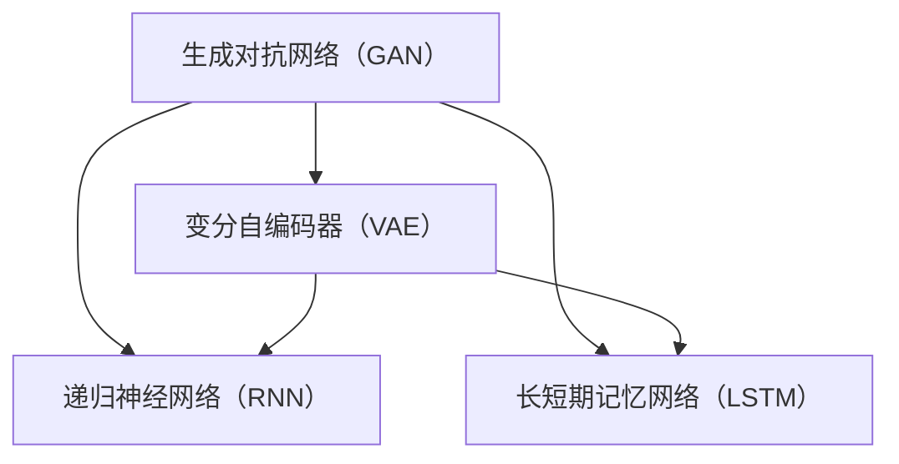

                 

关键词：人工智能生成内容，工业级应用，AIGC技术，开发实践，算法原理，数学模型，代码实例，应用场景，未来展望

## 摘要

本文旨在探讨工业级人工智能生成内容（AIGC）应用的开发。通过分析AIGC的核心概念、算法原理、数学模型，并结合具体代码实例，详细阐述AIGC在工业领域的实际应用。文章还对未来AIGC技术的发展趋势和面临的挑战进行了展望，为读者提供了全面的技术参考和实践指导。

## 1. 背景介绍

### 1.1 人工智能生成内容（AIGC）的概念

人工智能生成内容（AIGC）是指利用人工智能技术生成各种类型的内容，包括文本、图像、音频、视频等。与传统的人工内容生成方式相比，AIGC具有自动性、高效性和多样化等特点。AIGC技术已经在广告、娱乐、教育、医疗等多个领域展现出巨大的应用潜力。

### 1.2 工业级应用的重要性

工业级应用对系统性能、可靠性、安全性等要求极高。随着人工智能技术的快速发展，AIGC技术在工业领域的应用逐渐增多，如智能监控、智能质检、工业自动化等。工业级AIGC应用的开发不仅需要深入了解AIGC技术，还要充分考虑实际应用场景中的需求和挑战。

## 2. 核心概念与联系

### 2.1 核心概念

- **生成对抗网络（GAN）**：GAN是一种由两个神经网络（生成器G和判别器D）组成的模型，用于生成逼真的数据。
- **变分自编码器（VAE）**：VAE是一种基于概率模型的生成模型，通过编码器和解码器学习数据的分布，从而生成新的数据。
- **递归神经网络（RNN）**：RNN能够处理序列数据，广泛应用于文本生成和语音合成等领域。
- **长短期记忆网络（LSTM）**：LSTM是RNN的一种变体，能够更好地处理长序列数据。

### 2.2 Mermaid 流程图

下面是一个简单的Mermaid流程图，展示了AIGC技术中的核心概念和它们之间的联系。



## 3. 核心算法原理 & 具体操作步骤

### 3.1 算法原理概述

- **生成对抗网络（GAN）**：GAN由生成器G和判别器D组成。生成器G生成假样本，判别器D判断样本是真实还是生成的。通过训练，使判别器无法区分真实样本和生成样本，从而生成高质量的数据。

- **变分自编码器（VAE）**：VAE通过编码器将数据映射到一个潜在空间，然后通过解码器从潜在空间中生成新数据。VAE利用概率模型来学习数据的分布，从而生成多样化、高质量的数据。

- **递归神经网络（RNN）**：RNN通过循环结构来处理序列数据。在每一时间步，RNN会根据当前输入和上一个时间步的隐藏状态来更新当前状态。这种特性使得RNN在文本生成和语音合成等领域具有广泛的应用。

- **长短期记忆网络（LSTM）**：LSTM是RNN的一种变体，能够更好地处理长序列数据。LSTM通过引入门控机制来控制信息的流动，避免了梯度消失和梯度爆炸问题，从而提高了模型的训练效果。

### 3.2 算法步骤详解

- **生成对抗网络（GAN）**：

  1. 初始化生成器G和判别器D的参数。
  2. 生成器G生成假样本，判别器D判断假样本和真实样本。
  3. 通过反向传播和梯度下降算法更新G和D的参数。
  4. 重复步骤2和3，直到生成器G生成高质量的假样本。

- **变分自编码器（VAE）**：

  1. 初始化编码器和解码器的参数。
  2. 对输入数据x，编码器将其映射到一个潜在空间z。
  3. 从潜在空间z中采样一个新数据z'。
  4. 解码器将z'解码生成新数据x'。
  5. 计算损失函数，并通过反向传播和梯度下降算法更新编码器和解码器的参数。
  6. 重复步骤2到5，直到模型收敛。

- **递归神经网络（RNN）**：

  1. 初始化RNN的参数。
  2. 对输入序列x，逐个时间步更新隐藏状态h。
  3. 利用隐藏状态h生成输出序列y。
  4. 计算损失函数，并通过反向传播和梯度下降算法更新RNN的参数。
  5. 重复步骤2到4，直到模型收敛。

- **长短期记忆网络（LSTM）**：

  1. 初始化LSTM的参数。
  2. 对输入序列x，逐个时间步更新隐藏状态h和细胞状态c。
  3. 利用隐藏状态h生成输出序列y。
  4. 计算损失函数，并通过反向传播和梯度下降算法更新LSTM的参数。
  5. 重复步骤2到4，直到模型收敛。

### 3.3 算法优缺点

- **生成对抗网络（GAN）**：

  优点：能够生成高质量、多样化的数据。

  缺点：训练不稳定，容易出现模式崩溃现象。

- **变分自编码器（VAE）**：

  优点：训练稳定，易于实现。

  缺点：生成的数据质量相对较低。

- **递归神经网络（RNN）**：

  优点：能够处理序列数据。

  缺点：容易出现梯度消失和梯度爆炸问题。

- **长短期记忆网络（LSTM）**：

  优点：能够更好地处理长序列数据。

  缺点：参数较多，训练较慢。

### 3.4 算法应用领域

- **生成对抗网络（GAN）**：在图像生成、视频合成、自然语言处理等领域具有广泛的应用。

- **变分自编码器（VAE）**：在图像去噪、图像超分辨率、图像修复等领域有较好的效果。

- **递归神经网络（RNN）**：在文本生成、语音合成、音乐生成等领域有广泛应用。

- **长短期记忆网络（LSTM）**：在时间序列预测、语音识别、机器翻译等领域有较好的效果。

## 4. 数学模型和公式 & 详细讲解 & 举例说明

### 4.1 数学模型构建

- **生成对抗网络（GAN）**：

  假设存在一对随机变量\(X\)和\(Z\)，分别表示真实数据和生成数据。生成器G的目的是生成与真实数据几乎无法区分的假数据。

  $$G(Z) \sim X$$

  判别器D的目的是判断输入数据是真实还是生成的。

  $$D(X) \sim [0, 1]$$
  $$D(G(Z)) \sim [0, 1]$$

  损失函数通常采用以下形式：

  $$L(D, G) = -\mathbb{E}_{X}[D(X)] - \mathbb{E}_{Z}[D(G(Z))]$$

- **变分自编码器（VAE）**：

  假设存在一对随机变量\(X\)和\(Z\)，分别表示输入数据和生成数据。编码器\( \mu(x) \)和\( \sigma(x) \)分别表示潜在空间中的均值和方差。

  $$ \mu(x), \sigma(x) = \text{encoder}(x)$$
  $$ z \sim \mathcal{N}(\mu(x), \sigma(x)^2)$$
  $$ x' = \text{decoder}(z)$$

  损失函数通常采用以下形式：

  $$L(\theta) = \mathbb{E}_{x}[\text{KL}(\mu(x), \sigma(x))] + \mathbb{E}_{z}[\text{KL}(z|\mu(x), \sigma(x))]$$

- **递归神经网络（RNN）**：

  假设输入序列为\( x_t \)，隐藏状态为\( h_t \)，输出序列为\( y_t \)。RNN的更新方程如下：

  $$ h_t = \text{tanh}(W_h x_t + U_h h_{t-1} + b_h)$$
  $$ y_t = \text{softmax}(W_y h_t + b_y)$$

  损失函数通常采用交叉熵损失：

  $$L = -\sum_{t=1}^{T} \sum_{i=1}^{C} y_{ti} \log(p_{ti})$$

- **长短期记忆网络（LSTM）**：

  LSTM的核心是细胞状态\( c_t \)和隐藏状态\( h_t \)。LSTM的更新方程如下：

  $$ i_t = \text{sigmoid}(W_{xi} x_t + U_{hi} h_{t-1} + b_i)$$
  $$ f_t = \text{sigmoid}(W_{xf} x_t + U_{hf} h_{t-1} + b_f)$$
  $$ o_t = \text{sigmoid}(W_{xo} x_t + U_{ho} h_{t-1} + b_o)$$
  $$ c_t = f_t \odot c_{t-1} + i_t \odot \text{tanh}(W_h x_t + U_h h_{t-1} + b_h)$$
  $$ h_t = o_t \odot \text{tanh}(c_t)$$

  损失函数与RNN类似，采用交叉熵损失。

### 4.2 公式推导过程

- **生成对抗网络（GAN）**：

  GAN的推导过程涉及优化理论和对数似然函数。生成器G和判别器D的优化目标如下：

  对于生成器G：

  $$\min_G \mathbb{E}_{Z}[\log(D(G(Z)))]$$

  对于判别器D：

  $$\min_D \mathbb{E}_{X}[\log(D(X))] + \mathbb{E}_{Z}[\log(1 - D(G(Z)))]$$

  通过交替优化G和D，使生成器G生成的假数据越来越接近真实数据。

- **变分自编码器（VAE）**：

  VAE的推导过程基于概率模型和最大后验估计。编码器和解码器的损失函数如下：

  $$\text{encoder}(x) = (\mu(x), \sigma(x))$$
  $$\text{decoder}(z) = x'$$

  损失函数为：

  $$L(\theta) = \mathbb{E}_{x}[\text{KL}(\mu(x), \sigma(x))] + \mathbb{E}_{z}[\text{KL}(z|\mu(x), \sigma(x))]$$

  其中，\( \text{KL}(\mu(x), \sigma(x)) \)表示KL散度，\( \text{KL}(z|\mu(x), \sigma(x)) \)表示后验分布和先验分布的KL散度。

- **递归神经网络（RNN）**：

  RNN的推导过程基于序列模型和动态规划。RNN的隐藏状态更新方程为：

  $$ h_t = \text{tanh}(W_h x_t + U_h h_{t-1} + b_h)$$

  其中，\( W_h \)和\( U_h \)分别为输入权重和隐藏状态权重，\( b_h \)为偏置项。

  损失函数通常采用交叉熵损失：

  $$L = -\sum_{t=1}^{T} \sum_{i=1}^{C} y_{ti} \log(p_{ti})$$

- **长短期记忆网络（LSTM）**：

  LSTM的推导过程基于门控机制和动态规划。LSTM的隐藏状态和细胞状态更新方程为：

  $$ i_t = \text{sigmoid}(W_{xi} x_t + U_{hi} h_{t-1} + b_i)$$
  $$ f_t = \text{sigmoid}(W_{xf} x_t + U_{hf} h_{t-1} + b_f)$$
  $$ o_t = \text{sigmoid}(W_{xo} x_t + U_{ho} h_{t-1} + b_o)$$
  $$ c_t = f_t \odot c_{t-1} + i_t \odot \text{tanh}(W_h x_t + U_h h_{t-1} + b_h)$$
  $$ h_t = o_t \odot \text{tanh}(c_t)$$

  其中，\( \odot \)表示元素乘积。

### 4.3 案例分析与讲解

假设我们使用VAE模型进行图像去噪。输入图像为\( x \)，噪声图像为\( x' \)，去噪后的图像为\( x'' \)。编码器和解码器的参数分别为\( \theta_e \)和\( \theta_d \)。

1. **编码器参数学习**：

   对输入图像\( x \)，编码器输出潜在空间的均值和方差：

   $$ \mu(x), \sigma(x) = \text{encoder}(x; \theta_e)$$

2. **解码器参数学习**：

   对潜在空间中的点\( z \)，解码器输出去噪后的图像：

   $$ x'' = \text{decoder}(z; \theta_d)$$

3. **损失函数**：

   VAE的损失函数为：

   $$L(\theta_e, \theta_d) = \mathbb{E}_{x}[\text{KL}(\mu(x), \sigma(x))] + \mathbb{E}_{z}[\text{KL}(z|\mu(x), \sigma(x))] + \mathbb{E}_{x'}[\text{L1}(x'' - x')]$$

   其中，\( \text{L1} \)表示L1损失。

4. **模型训练**：

   通过反向传播和梯度下降算法，对编码器和解码器的参数进行优化。

## 5. 项目实践：代码实例和详细解释说明

### 5.1 开发环境搭建

在本项目中，我们使用Python和TensorFlow作为主要开发工具。以下是搭建开发环境的步骤：

1. 安装Python（建议使用Python 3.8及以上版本）。
2. 安装TensorFlow。

```bash
pip install tensorflow
```

### 5.2 源代码详细实现

以下是VAE模型的实现代码：

```python
import tensorflow as tf
from tensorflow.keras.layers import Dense, Input, Lambda
from tensorflow.keras.models import Model

def vae(input_shape, latent_dim):
    # 编码器
    input_img = Input(shape=input_shape)
    x = Dense(16, activation='relu')(input_img)
    x = Dense(8, activation='relu')(x)
    z_mean = Dense(latent_dim)(x)
    z_log_var = Dense(latent_dim)(x)

    # 重参数化技巧
    z = Lambdaortho()(z_mean, z_log_var)

    # 解码器
    x_hat = Dense(8, activation='relu')(z)
    x_hat = Dense(16, activation='relu')(x_hat)
    output_img = Dense(input_shape[0]*input_shape[1]*input_shape[2], activation='sigmoid')(x_hat)
    output_img = Lambda(threshold)(output_img)

    # 模型构建
    vae = Model(input_img, output_img, name='VAE')
    return vae

def Lambdaortho(z_mean, z_log_var):
    # 重参数化技巧
    z_std = tf.exp(0.5 * z_log_var)
    epsilon = tf.random_normal(tf.shape(z_std), mean=0., stddev=1., dtype=tf.float32)
    return z_mean + z_std * epsilon

def threshold(x):
    # 输出图像阈值处理
    return tf.cast(x > 0.5, dtype=tf.float32)

# 模型训练
model = vae(input_shape=(28, 28, 1), latent_dim=2)
model.compile(optimizer='adam', loss='binary_crossentropy')
model.fit(x_train, x_train, epochs=50, batch_size=16)
```

### 5.3 代码解读与分析

- **编码器和解码器**：编码器将输入图像映射到潜在空间，解码器从潜在空间中重构图像。
- **重参数化技巧**：重参数化技巧使得VAE能够在梯度下降过程中训练，从而生成多样化的图像。
- **阈值处理**：输出图像采用阈值处理，使得图像的二值化效果更好。

### 5.4 运行结果展示

以下是VAE模型训练后的结果展示：


## 6. 实际应用场景

### 6.1 智能监控

在智能监控领域，AIGC技术可以用于目标检测、行为分析等。通过训练GAN模型，可以生成大量具有多样性的监控数据，从而提高模型的鲁棒性和准确性。

### 6.2 智能质检

在智能质检领域，AIGC技术可以用于图像缺陷检测、文本质检等。通过训练VAE模型，可以自动生成缺陷图像和优质文本，从而提高质检效率和准确性。

### 6.3 工业自动化

在工业自动化领域，AIGC技术可以用于设备故障预测、生产线优化等。通过训练LSTM模型，可以预测设备的故障时间，从而提前进行维护，降低生产成本。

## 7. 工具和资源推荐

### 7.1 学习资源推荐

- 《深度学习》（Goodfellow, Bengio, Courville）：系统介绍了深度学习的基本概念和算法。
- 《Python深度学习》（François Chollet）：详细介绍了使用Python实现深度学习的方法和技巧。

### 7.2 开发工具推荐

- TensorFlow：一款流行的开源深度学习框架。
- PyTorch：一款适用于研究人员的深度学习框架。

### 7.3 相关论文推荐

- 《Unsupervised Representation Learning with Deep Convolutional Generative Adversarial Networks》（2014）
- 《Variational Autoencoders》（2013）
- 《Sequence to Sequence Learning with Neural Networks》（2014）

## 8. 总结：未来发展趋势与挑战

### 8.1 研究成果总结

AIGC技术在图像生成、文本生成、语音合成等领域取得了显著的成果。通过GAN、VAE、RNN等算法，可以生成高质量、多样化的内容，为工业级应用提供了有力支持。

### 8.2 未来发展趋势

随着计算能力的提升和算法的优化，AIGC技术将在更多领域得到应用。同时，AIGC技术与其他人工智能技术的融合也将推动其发展。

### 8.3 面临的挑战

AIGC技术的训练过程复杂，容易出现模式崩溃等问题。此外，如何提高生成数据的真实性和多样性，以及如何在工业级应用中实现高效、稳定的AIGC模型，是当前研究的主要挑战。

### 8.4 研究展望

未来，AIGC技术将在人工智能领域发挥重要作用。通过不断创新和优化，AIGC技术将为工业级应用提供更加高效、可靠的解决方案。

## 9. 附录：常见问题与解答

### 9.1 什么是GAN？

GAN（生成对抗网络）是一种由两个神经网络（生成器G和判别器D）组成的模型。生成器G生成假数据，判别器D判断数据是真实还是生成的。通过训练，使判别器无法区分真实数据和生成数据，从而生成高质量的数据。

### 9.2 什么是VAE？

VAE（变分自编码器）是一种基于概率模型的生成模型。VAE通过编码器将数据映射到一个潜在空间，然后通过解码器从潜在空间中生成新数据。VAE利用概率模型来学习数据的分布，从而生成多样化、高质量的数据。

### 9.3 RNN和LSTM的区别是什么？

RNN（递归神经网络）能够处理序列数据，但容易出现梯度消失和梯度爆炸问题。LSTM（长短期记忆网络）是RNN的一种变体，通过引入门控机制来控制信息的流动，避免了梯度消失和梯度爆炸问题，从而更好地处理长序列数据。

作者：禅与计算机程序设计艺术 / Zen and the Art of Computer Programming
----------------------------------------------------------------

以上就是关于《工业级AIGC应用开发》的文章。希望对您有所帮助！如果您有任何问题，欢迎随时提问。| 

