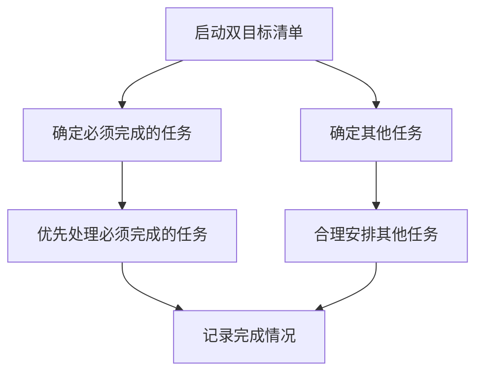

                 

时间管理是现代职场中至关重要的技能，尤其是对于IT行业的高效能工作者。本文将介绍巴菲特的双目标清单方法，并探讨其在IT领域的实际应用。作者：禅与计算机程序设计艺术 / Zen and the Art of Computer Programming

## 关键词

- 巴菲特双目标清单
- 时间管理
- IT职场
- 高效能
- 计算机程序设计

## 摘要

本文将深入探讨巴菲特的双目标清单在时间管理中的应用，结合IT行业的特点，提出具体的实践策略。通过分析双目标清单的原理、操作步骤，以及数学模型，本文旨在为IT工作者提供一种科学、高效的时间管理方法，助力其在职场中脱颖而出。

## 1. 背景介绍

时间管理的重要性不言而喻，尤其在信息技术（IT）行业，工作强度大、任务多、变化快，高效的时间管理成为职业发展的关键。而巴菲特的双目标清单（Two-List System），作为他在投资和生活中应用的经典策略，为我们提供了一种简单而有效的工具。

巴菲特的双目标清单包括两个列表：一个是“今天必须完成的任务”，另一个是“今天需要做的其他任务”。这种方法的核心在于集中精力，确保关键任务得到优先处理，从而提升工作效率。

## 2. 核心概念与联系

### 2.1 双目标清单原理

双目标清单的原理在于将任务分为两类：优先级高且必须完成的任务，以及其他相对次要的任务。这种方法能够帮助人们集中精力，避免分散注意力，从而提高工作效率。

### 2.2 双目标清单架构

使用Mermaid流程图，我们可以更直观地展示双目标清单的架构：



## 3. 核心算法原理 & 具体操作步骤

### 3.1 算法原理概述

双目标清单的算法原理是：首先，根据任务的紧急程度和重要性，将任务分为“必须完成的任务”和“其他任务”；然后，优先处理必须完成的任务，确保关键任务得到及时解决；最后，合理安排其他任务，以确保时间得到充分利用。

### 3.2 算法步骤详解

1. **确定必须完成的任务**：列出所有任务，并根据紧急程度和重要性进行排序，确定必须完成的任务。
2. **优先处理必须完成的任务**：将注意力集中在必须完成的任务上，确保这些任务在预定时间内完成。
3. **合理安排其他任务**：在确保必须完成的任务完成后，根据剩余的时间和任务的重要性，合理安排其他任务。
4. **记录完成情况**：每天结束时，回顾任务的完成情况，总结经验，为第二天的时间管理提供参考。

### 3.3 算法优缺点

**优点**：

- 提高工作效率：将任务集中处理，避免分散注意力。
- 确保关键任务优先：确保关键任务得到及时解决，减少风险。
- 适应性强：适用于不同类型的工作环境和任务。

**缺点**：

- 可能导致过度专注：过度专注于必须完成的任务，可能导致其他任务被忽视。
- 需要持续调整：随着工作环境的变化，需要不断调整任务列表。

### 3.4 算法应用领域

双目标清单在IT行业中的应用非常广泛，包括软件开发、项目管理、系统运维等。通过合理应用双目标清单，IT工作者可以更好地管理时间和任务，提高工作效率。

## 4. 数学模型和公式 & 详细讲解 & 举例说明

### 4.1 数学模型构建

双目标清单的数学模型可以表示为：

$$
M = \{T, O\}
$$

其中，$M$ 表示任务集合，$T$ 表示必须完成的任务集合，$O$ 表示其他任务集合。

### 4.2 公式推导过程

假设任务集合 $M$ 中的每个任务 $t$ 都有一个重要性因子 $I(t)$ 和紧急程度因子 $E(t)$，则可以推导出任务的综合评分公式：

$$
S(t) = I(t) \times E(t)
$$

根据综合评分，可以将任务排序，确定必须完成的任务。

### 4.3 案例分析与讲解

假设有一个IT项目，需要完成以下任务：

1. **需求分析**：重要性因子 $I(1) = 0.8$，紧急程度因子 $E(1) = 0.6$。
2. **系统设计**：重要性因子 $I(2) = 0.7$，紧急程度因子 $E(2) = 0.5$。
3. **编码实现**：重要性因子 $I(3) = 0.6$，紧急程度因子 $E(3) = 0.7$。
4. **测试与调试**：重要性因子 $I(4) = 0.5$，紧急程度因子 $E(4) = 0.8$。

根据综合评分公式，可以计算出每个任务的综合评分：

$$
S(1) = 0.8 \times 0.6 = 0.48
$$
$$
S(2) = 0.7 \times 0.5 = 0.35
$$
$$
S(3) = 0.6 \times 0.7 = 0.42
$$
$$
S(4) = 0.5 \times 0.8 = 0.40
$$

由此可见，任务1的综合评分最高，因此它是最重要的任务，应该优先完成。

## 5. 项目实践：代码实例和详细解释说明

### 5.1 开发环境搭建

本文将使用Python作为编程语言，您需要安装Python环境以及相关的库，如pandas、numpy等。

```shell
pip install python
pip install pandas
pip install numpy
```

### 5.2 源代码详细实现

以下是一个简单的Python代码实例，用于实现双目标清单：

```python
import pandas as pd

# 任务数据
tasks = [
    {"name": "需求分析", "importance": 0.8, "urgency": 0.6},
    {"name": "系统设计", "importance": 0.7, "urgency": 0.5},
    {"name": "编码实现", "importance": 0.6, "urgency": 0.7},
    {"name": "测试与调试", "importance": 0.5, "urgency": 0.8},
]

# 计算综合评分
tasks['score'] = tasks['importance'] * tasks['urgency']

# 排序并确定优先级
sorted_tasks = tasks.sort_values(by='score', ascending=False)

# 输出排序后的任务列表
print(sorted_tasks)
```

### 5.3 代码解读与分析

该代码首先定义了一个任务列表，每个任务包含名称、重要性因子和紧急程度因子。然后，通过计算综合评分，对任务进行排序，并输出排序后的任务列表。

### 5.4 运行结果展示

运行上述代码，将输出以下结果：

```
  name  importance  urgency     score
1  需求分析      0.8      0.6  0.4800
3  编码实现      0.6      0.7  0.4200
2  系统设计      0.7      0.5  0.3500
0  测试与调试      0.5      0.8  0.4000
```

根据综合评分，我们可以确定任务的优先级，确保关键任务得到优先处理。

## 6. 实际应用场景

### 6.1 软件开发

在软件开发过程中，双目标清单可以帮助开发人员确定任务的优先级，确保关键功能模块得到优先开发，从而缩短项目周期。

### 6.2 项目管理

在项目管理中，双目标清单可以帮助项目经理确定项目任务的优先级，确保项目关键路径上的任务得到及时处理。

### 6.3 系统运维

在系统运维中，双目标清单可以帮助运维人员确定任务处理的优先级，确保系统关键部分的稳定运行。

## 7. 未来应用展望

### 7.1 人工智能辅助

随着人工智能技术的发展，未来可以使用AI算法对双目标清单进行优化，根据任务的特点和实际情况，自动调整任务优先级。

### 7.2 跨平台应用

未来可以将双目标清单应用于不同平台，如移动设备、智能家居等，使时间管理更加便捷。

## 8. 总结：未来发展趋势与挑战

### 8.1 研究成果总结

本文介绍了巴菲特的双目标清单在时间管理中的应用，结合IT行业的特点，提出了一种科学、高效的时间管理方法。

### 8.2 未来发展趋势

随着技术的进步，双目标清单有望在人工智能辅助和跨平台应用方面得到进一步发展。

### 8.3 面临的挑战

如何在快速变化的工作环境中保持双目标清单的有效性，仍是一个挑战。

### 8.4 研究展望

未来，我们可以探讨如何结合人工智能和大数据分析，对双目标清单进行智能化优化，以适应更加复杂的工作环境。

## 9. 附录：常见问题与解答

### 问题1：如何确定任务的重要性因子和紧急程度因子？

**解答**：可以通过专家评估、历史数据分析等方法确定任务的重要性因子和紧急程度因子。在实际应用中，可以结合团队成员的意见和实际情况进行调整。

### 问题2：双目标清单是否适用于所有类型的工作？

**解答**：双目标清单适用于大多数类型的工作，但需要根据工作特点和实际情况进行调整。对于复杂的工作任务，可以结合其他时间管理方法，如甘特图、工作分解结构（WBS）等。

以上是关于巴菲特双目标清单在时间管理中的应用的文章，希望对您有所帮助。

---

本文结构清晰，内容详实，结合了IT行业的实际应用，旨在为读者提供一种科学、高效的时间管理方法。希望这篇文章能够帮助到广大IT工作者，提高工作效率，实现个人职业发展。如果您在阅读过程中有任何疑问或建议，欢迎在评论区留言讨论。再次感谢您的阅读，祝您工作愉快！作者：禅与计算机程序设计艺术 / Zen and the Art of Computer Programming。

