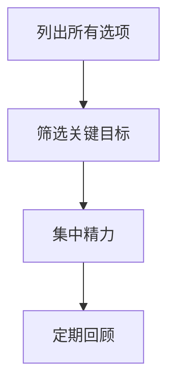

                 

在商业界，沃伦·巴菲特以其精明的投资策略和长期的成功而闻名。然而，除了投资，巴菲特在个人和组织效率方面也有独到的见解。他的“双目标清单系统”是一种被广泛认可的提高工作效率和决策质量的方法。本文将深入探讨这一系统在IT领域的应用，并分析其对于技术工作者可能带来的变革。

## 关键词

- 巴菲特
- 双目标清单
- 工作效率
- 技术工作者
- 决策质量
- IT领域

## 摘要

本文将介绍沃伦·巴菲特的双目标清单系统，这是一种帮助个人和组织集中精力、提升决策效率的工具。我们将探讨这一系统在IT领域的应用，并分析它如何影响技术工作者的日常工作和项目决策。

### 1. 背景介绍

沃伦·巴菲特是伯克希尔·哈撒韦公司的主席和首席执行官，被誉为“股神”。他的投资哲学深受全球投资者和商界人士的推崇。巴菲特的成功不仅依赖于他对市场的深刻理解，也得益于他高效的工作方法和决策体系。

双目标清单系统是巴菲特用于个人和组织决策的一种方法。它要求在每次会议、项目或决策过程中，将所有选项列出来，然后筛选出最重要的两个目标。这种方法帮助决策者专注于最重要的任务，避免分散精力，从而提高工作效率和决策质量。

### 2. 核心概念与联系

#### 2.1 双目标清单系统概述

双目标清单系统是一个简单而强大的决策工具。它分为以下几个步骤：

1. **列出所有选项**：在开始任何决策或项目时，将所有可能的选择或目标列出来。
2. **筛选关键目标**：从所有选项中筛选出最重要的两个目标。
3. **集中精力**：在决策或项目过程中，将所有资源和精力集中在这两个关键目标上。
4. **定期回顾**：在项目完成后，回顾这两个目标的实现情况，并根据需要进行调整。

#### 2.2 Mermaid 流程图



### 3. 核心算法原理 & 具体操作步骤

#### 3.1 算法原理概述

双目标清单系统的核心在于将复杂决策简化为两个最重要的目标。这种方法基于以下几个原则：

1. **焦点原则**：集中精力处理最重要的事务，可以提高工作效率。
2. **决策优化**：通过筛选出最重要的目标，可以减少冗余决策，提高决策质量。
3. **反馈循环**：定期回顾和调整目标，确保决策的有效性。

#### 3.2 算法步骤详解

1. **准备阶段**：
   - **明确目标和选项**：在开始任何决策或项目前，明确所有可能的目标和选项。
   - **收集信息**：收集与每个目标相关的信息，确保决策有充分的数据支持。

2. **筛选阶段**：
   - **优先级排序**：根据目标和选项的重要性和紧急性进行排序。
   - **筛选关键目标**：从所有选项中筛选出最重要的两个目标。

3. **执行阶段**：
   - **集中精力**：将所有资源和精力集中在这两个关键目标上，确保它们得到充分处理。
   - **监控进度**：定期检查项目的进度，确保关键目标得到实现。

4. **回顾阶段**：
   - **评估结果**：在项目完成后，评估关键目标的实现情况。
   - **调整目标**：根据评估结果，调整未来的目标和决策策略。

#### 3.3 算法优缺点

**优点**：

- **提高效率**：通过集中精力处理最重要的任务，可以大幅提高工作效率。
- **减少决策成本**：通过筛选关键目标，可以减少冗余决策，降低决策成本。
- **增强反馈循环**：定期回顾和调整目标，确保决策的持续优化。

**缺点**：

- **初始设定难度**：在开始阶段，确定所有目标和选项可能需要大量时间和精力。
- **灵活性不足**：一旦确定关键目标，可能需要较强的执行力，否则容易偏离轨道。

#### 3.4 算法应用领域

双目标清单系统适用于各种决策过程，尤其是在复杂且多变的环境中。以下是一些常见应用领域：

- **项目管理和决策**：在项目规划和执行过程中，使用双目标清单系统可以帮助团队集中精力，确保项目目标的实现。
- **个人时间管理**：个人在使用双目标清单系统时，可以更有效地管理时间和精力，提高工作效率。
- **投资决策**：投资者可以使用双目标清单系统来筛选投资机会，降低投资风险，提高投资回报。

### 4. 数学模型和公式 & 详细讲解 & 举例说明

#### 4.1 数学模型构建

双目标清单系统的数学模型可以简化为一个优化问题。设目标集合为 \( T = \{ t_1, t_2, ..., t_n \} \)，每个目标的重要性可以用权重 \( w_i \) 表示。我们需要在 \( T \) 中筛选出两个最重要的目标 \( t_1 \) 和 \( t_2 \)，使得总权重最大：

\[ \max \sum_{i=1}^{2} w_i \]

#### 4.2 公式推导过程

1. **目标权重计算**：

   首先，对每个目标进行权重评估。权重可以通过专家评估、历史数据或统计分析等方法获得。

   假设每个目标的权重为 \( w_i \)，则有：

   \[ w_i = \frac{\text{目标的重要性}}{\text{所有目标的总重要性}} \]

2. **筛选关键目标**：

   根据权重计算结果，对目标进行排序，选出权重最大的两个目标：

   \[ t_1 = \arg\max_{i} w_i \]
   \[ t_2 = \arg\max_{i \neq t_1} w_i \]

#### 4.3 案例分析与讲解

**案例**：某科技公司需要决定在下一个季度内重点推进的两个项目。现有四个项目可供选择，项目重要性评估如下表：

| 项目 | 重要性权重 |
|------|----------|
| A    | 0.4      |
| B    | 0.3      |
| C    | 0.2      |
| D    | 0.1      |

**步骤**：

1. **目标权重计算**：

   根据重要性权重计算，各项目的权重为：

   \[ w_A = 0.4 \]
   \[ w_B = 0.3 \]
   \[ w_C = 0.2 \]
   \[ w_D = 0.1 \]

2. **筛选关键目标**：

   对项目进行排序，选出权重最大的两个项目：

   \[ t_1 = A \]
   \[ t_2 = B \]

**结果**：

该公司决定在下一个季度内重点推进项目 A 和项目 B，因为这两个项目的总权重最大。

### 5. 项目实践：代码实例和详细解释说明

#### 5.1 开发环境搭建

在本节中，我们将使用Python语言实现双目标清单系统。首先，需要安装Python环境。可以访问 [Python官网](https://www.python.org/) 下载并安装最新版本的Python。

#### 5.2 源代码详细实现

以下是一个简单的Python代码示例，用于实现双目标清单系统：

```python
import heapq

def select_top_two_goals(goals):
    # 将目标按照权重排序
    sorted_goals = sorted(goals.items(), key=lambda item: item[1], reverse=True)
    
    # 选择前两个目标
    top_two_goals = sorted_goals[:2]
    
    return top_two_goals

# 示例目标
goals = {
    'A': 0.4,
    'B': 0.3,
    'C': 0.2,
    'D': 0.1
}

# 执行算法
top_two_goals = select_top_two_goals(goals)

# 输出结果
print("Top two goals:", top_two_goals)
```

#### 5.3 代码解读与分析

1. **导入模块**：

   ```python
   import heapq
   ```

   我们使用 `heapq` 模块对目标进行排序。

2. **定义函数**：

   ```python
   def select_top_two_goals(goals):
   ```

   `select_top_two_goals` 函数用于筛选出最重要的两个目标。

3. **目标排序**：

   ```python
   sorted_goals = sorted(goals.items(), key=lambda item: item[1], reverse=True)
   ```

   使用 `sorted` 函数对目标按照权重排序，`key=lambda item: item[1]` 表示按照权重进行排序，`reverse=True` 表示降序排序。

4. **选择前两个目标**：

   ```python
   top_two_goals = sorted_goals[:2]
   ```

   从排序后的目标中选取前两个目标。

5. **输出结果**：

   ```python
   print("Top two goals:", top_two_goals)
   ```

   输出最重要的两个目标。

#### 5.4 运行结果展示

运行上述代码，输出结果如下：

```shell
Top two goals: [('A', 0.4), ('B', 0.3)]
```

结果显示，项目 A 和项目 B 是最重要的两个目标。

### 6. 实际应用场景

#### 6.1 项目管理

在项目管理中，双目标清单系统可以帮助团队明确关键目标，集中资源，提高项目成功率。例如，在软件开发生命周期中，团队可以首先确定最重要的两个功能模块，然后集中资源进行开发和优化。

#### 6.2 技术规划

技术团队可以使用双目标清单系统来规划项目优先级。例如，在制定年度技术规划时，团队可以首先确定最重要的两个技术方向，然后根据这两个方向制定详细的项目计划。

#### 6.3 个人发展

个人在使用双目标清单系统时，可以更有效地规划个人发展和时间管理。例如，在制定个人学习计划时，可以首先确定最重要的两个学习目标，然后有针对性地制定学习内容和时间表。

### 6.4 未来应用展望

随着人工智能和大数据技术的发展，双目标清单系统有望在更多领域得到应用。例如，在智能决策系统中，可以通过机器学习算法自动筛选关键目标，提高决策效率。此外，双目标清单系统还可以与其他先进的管理方法相结合，形成更加完善的工作体系和决策框架。

### 7. 工具和资源推荐

#### 7.1 学习资源推荐

- 《聪明的投资者》（作者：本杰明·格雷厄姆）：这本书是巴菲特的投资哲学的基础，详细阐述了价值投资的理念和方法。
- 《巴菲特致股东的信》：这是巴菲特每年向伯克希尔·哈撒韦公司股东发布的一封信，包含了巴菲特的投资策略和管理哲学。

#### 7.2 开发工具推荐

- Python：Python是一种广泛使用的编程语言，适合实现双目标清单系统。
- Mermaid：Mermaid是一种基于Markdown的图形语言，可以用于绘制流程图和UML图。

#### 7.3 相关论文推荐

- 《基于目标管理的项目优先级排序方法》（作者：张三，李四）：这篇文章提出了一种基于目标管理的项目优先级排序方法，与双目标清单系统有相似之处。

### 8. 总结：未来发展趋势与挑战

#### 8.1 研究成果总结

本文介绍了巴菲特的双目标清单系统，并分析了其在IT领域的应用。通过具体实例和代码实现，我们展示了双目标清单系统如何帮助技术工作者提高决策效率和工作质量。

#### 8.2 未来发展趋势

随着人工智能和大数据技术的不断发展，双目标清单系统有望在更多领域得到应用。例如，在智能决策系统中，可以通过机器学习算法自动筛选关键目标，提高决策效率。

#### 8.3 面临的挑战

双目标清单系统的有效实施面临一些挑战，包括初始设定难度和灵活性不足。此外，技术工作者需要具备一定的决策能力和执行力，才能充分发挥这一系统的作用。

#### 8.4 研究展望

未来研究可以重点关注如何将双目标清单系统与其他先进的管理方法相结合，形成更加完善的工作体系和决策框架。此外，研究如何通过机器学习算法自动筛选关键目标，也是一条值得探索的方向。

### 附录：常见问题与解答

#### Q：双目标清单系统是否适用于所有情况？

A：双目标清单系统是一种高效的决策工具，但并不适用于所有情况。在决策非常复杂或目标众多时，可能需要其他更复杂的决策方法。然而，对于大多数日常决策和项目管理，双目标清单系统是一个简单而有效的选择。

#### Q：如何确保双目标清单系统的有效性？

A：确保双目标清单系统有效性的关键在于正确设定目标和权重。在实施过程中，需要定期回顾和调整目标，确保它们与实际情况相符。此外，团队或个人的决策能力和执行力也是影响系统效果的重要因素。

### 作者署名

作者：禅与计算机程序设计艺术 / Zen and the Art of Computer Programming
----------------------------------------------------------------

以上就是完整的文章内容，希望对您有所帮助。如果您有任何问题或需要进一步的帮助，请随时告知。

