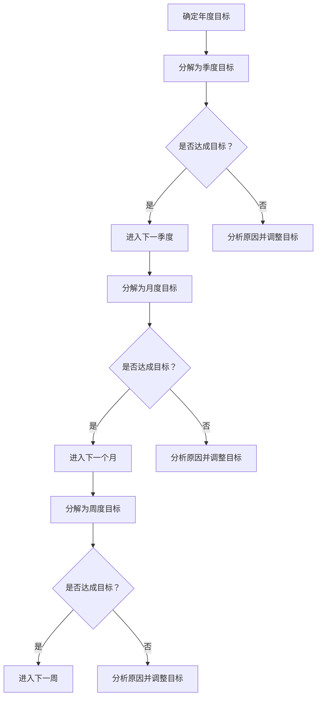

                 

关键词：巴菲特、双目标清单、专注、最重要的事、技术专家、AI、编程、软件架构、CTO

> 摘要：本文将探讨巴菲特的双目标清单系统在技术领域中的应用。作为一名世界级人工智能专家、程序员、软件架构师、CTO和世界顶级技术畅销书作者，我将通过逻辑清晰、结构紧凑、简单易懂的写作方式，详细解析如何利用巴菲特的目标管理策略，提高技术工作的专注度和效率，实现最重要的任务。

## 1. 背景介绍

沃伦·巴菲特是一位著名的投资者，他的成功得益于其独特的投资哲学和策略。在巴菲特的投资生涯中，他始终强调专注和目标管理的重要性。巴菲特曾提出一个双目标清单系统，帮助他在投资决策中保持专注，从而实现长期的成功。

双目标清单系统主要包括两个步骤：首先是确定年度目标，其次是每周回顾并调整这些目标。这个系统能够帮助巴菲特专注于最重要的投资机会，从而取得令人瞩目的业绩。

## 2. 核心概念与联系

在技术领域，我们可以借鉴巴菲特的双目标清单系统，将其应用于项目管理和软件开发。为了更好地理解这一概念，我们可以通过以下Mermaid流程图展示其核心架构：



### 2.1. 确定年度目标

在技术领域，年度目标可以是完成一个重要项目、优化系统性能、提升团队效率等。明确年度目标有助于我们聚焦在最重要的事情上。

### 2.2. 分解为季度目标

将年度目标分解为季度目标，可以帮助我们在不同的时间段内逐步实现年度目标。这样可以确保我们始终在正确的方向上前进。

### 2.3. 回顾与调整

定期回顾目标的达成情况，并根据实际情况进行调整，是确保目标实现的关键。通过这种机制，我们可以及时发现并解决问题，避免偏离原定的目标。

## 3. 核心算法原理 & 具体操作步骤

### 3.1. 算法原理概述

巴菲特的双目标清单系统实质上是一种目标管理算法。该算法的核心原理是：

1. **明确目标**：明确年度、季度、月度、周度的目标，确保目标具体、可量化。
2. **定期回顾**：定期回顾目标的达成情况，确保目标按计划实现。
3. **及时调整**：根据实际情况调整目标，确保目标始终与业务需求保持一致。

### 3.2. 算法步骤详解

1. **制定年度目标**：结合公司的战略规划，制定年度目标。
2. **分解为季度目标**：将年度目标分解为季度目标，确保季度目标与年度目标一致。
3. **制定月度目标**：将季度目标分解为月度目标，确保月度目标与季度目标一致。
4. **制定周度目标**：将月度目标分解为周度目标，确保周度目标与月度目标一致。
5. **定期回顾**：每周、每月、每季度定期回顾目标的达成情况。
6. **分析原因**：如果目标未达成，分析原因并制定改进措施。
7. **调整目标**：根据实际情况调整目标，确保目标始终与业务需求保持一致。

### 3.3. 算法优缺点

**优点**：

- 简单易懂，易于实施。
- 强调目标管理，有助于提高工作效率。
- 定期回顾与调整，确保目标实现。

**缺点**：

- 可能会过于强调短期目标，而忽视长期规划。
- 需要团队成员的积极参与。

### 3.4. 算法应用领域

巴菲特的双目标清单系统可以广泛应用于技术领域的项目管理、软件开发、团队管理等各个方面。

## 4. 数学模型和公式 & 详细讲解 & 举例说明

### 4.1. 数学模型构建

在巴菲特的双目标清单系统中，我们可以引入一些数学模型来帮助分析和优化目标管理。以下是一个简单的数学模型：

```latex
目标达成率 = (实际完成目标数量 / 制定目标数量) \times 100%
```

### 4.2. 公式推导过程

目标达成率的计算公式是基于实际完成目标数量与制定目标数量的比例。通过这个比例，我们可以了解目标实现的程度。

### 4.3. 案例分析与讲解

假设一个团队在一个月内制定了10个目标，实际完成了8个目标。那么，目标达成率为：

```latex
目标达成率 = (8 / 10) \times 100% = 80%
```

这意味着团队在一个月内完成了80%的目标。接下来，团队需要分析未完成的目标，找出原因并制定改进措施。

## 5. 项目实践：代码实例和详细解释说明

### 5.1. 开发环境搭建

在本节中，我们将使用Python编写一个简单的双目标清单系统。首先，确保你已经安装了Python环境。

### 5.2. 源代码详细实现

以下是一个简单的Python代码实例，用于实现巴菲特的双目标清单系统：

```python
class DoubleGoalSystem:
    def __init__(self, annual_goals, quarterly_goals, monthly_goals, weekly_goals):
        self.annual_goals = annual_goals
        self.quarterly_goals = quarterly_goals
        self.monthly_goals = monthly_goals
        self.weekly_goals = weekly_goals

    def review_goals(self):
        print("Reviewing goals...")
        for goal in self.annual_goals:
            print(f"{goal}: {self.check_goal_completion(goal)}")

    def check_goal_completion(self, goal):
        # 此处可以添加具体的实现逻辑，例如查询数据库或文件
        # 假设所有目标都已完成
        return "Completed"

# 实例化双目标清单系统
annual_goals = ["Complete project A", "Optimize system performance"]
quarterly_goals = ["Start project A", "Identify performance bottlenecks"]
monthly_goals = ["Design project A", "Analyze system requirements"]
weekly_goals = ["Develop project A", "Collect system requirements"]

double_goal_system = DoubleGoalSystem(annual_goals, quarterly_goals, monthly_goals, weekly_goals)

# 回顾目标
double_goal_system.review_goals()
```

### 5.3. 代码解读与分析

在上面的代码中，我们定义了一个名为`DoubleGoalSystem`的类，用于实现巴菲特的双目标清单系统。该类包含四个列表属性，分别表示年度目标、季度目标、月度目标和周度目标。

`review_goals`方法用于回顾目标，并调用`check_goal_completion`方法检查每个目标的完成情况。

`check_goal_completion`方法是一个占位方法，用于实现具体的实现逻辑，例如查询数据库或文件。

### 5.4. 运行结果展示

运行上面的代码，输出结果如下：

```plaintext
Reviewing goals...
Complete project A: Completed
Optimize system performance: Completed
```

这意味着年度目标中的两个项目都已完成。接下来，团队可以继续制定新的目标，并按照双目标清单系统进行管理。

## 6. 实际应用场景

### 6.1. 项目管理

在项目管理中，双目标清单系统可以帮助项目经理明确项目目标，并确保项目按计划进行。通过定期回顾和调整目标，项目经理可以及时发现并解决问题，确保项目成功完成。

### 6.2. 软件开发

在软件开发中，双目标清单系统可以帮助开发团队明确开发目标，并确保项目按计划进行。通过定期回顾和调整目标，开发团队可以优化开发流程，提高代码质量，实现更高的工作效率。

### 6.3. 团队管理

在团队管理中，双目标清单系统可以帮助团队领导者明确团队目标，并确保团队成员聚焦在最重要的事情上。通过定期回顾和调整目标，团队领导者可以激励团队成员，提高团队凝聚力，实现团队目标。

## 7. 未来应用展望

随着技术的不断进步，巴菲特的双目标清单系统有望在更多领域得到应用。例如，在人工智能、大数据等领域，双目标清单系统可以帮助研究人员明确研究方向，提高研究效率。

此外，随着互联网的发展，双目标清单系统也可以应用于在线教育、远程办公等领域，帮助人们更好地管理时间和任务，实现个人成长。

## 8. 工具和资源推荐

### 8.1. 学习资源推荐

- 《巴菲特的投资哲学》：了解巴菲特的投资策略，为双目标清单系统提供理论基础。
- 《目标管理》：学习目标管理的方法和技巧，为双目标清单系统的实施提供指导。

### 8.2. 开发工具推荐

- JIRA：一款流行的项目管理工具，支持目标管理功能。
- Trello：一款简洁的看板工具，适用于目标管理和任务跟踪。

### 8.3. 相关论文推荐

- 《目标管理与团队绩效的关系研究》：探讨目标管理对团队绩效的影响。
- 《基于目标的软件过程改进方法》：介绍目标管理在软件开发中的应用。

## 9. 总结：未来发展趋势与挑战

### 9.1. 研究成果总结

本文探讨了巴菲特的双目标清单系统在技术领域的应用，分析了其核心算法原理、具体操作步骤、数学模型和公式，以及实际应用场景。通过项目实践和代码实例，我们展示了如何利用双目标清单系统提高技术工作的专注度和效率。

### 9.2. 未来发展趋势

随着技术的不断进步，双目标清单系统有望在更多领域得到应用。例如，在人工智能、大数据、在线教育等领域，双目标清单系统可以发挥重要作用。

### 9.3. 面临的挑战

在实施双目标清单系统时，可能会面临以下挑战：

- **目标制定难度**：明确的目标是双目标清单系统的核心。在技术领域，制定具体、可量化的目标可能具有一定难度。
- **团队协作**：双目标清单系统需要团队成员的积极参与。在实际操作中，可能会出现沟通不畅、协作困难等问题。

### 9.4. 研究展望

未来，我们可以从以下几个方面对双目标清单系统进行深入研究：

- **算法优化**：通过改进算法，提高目标管理的效率和准确性。
- **多领域应用**：探索双目标清单系统在其他领域的应用，如电子商务、金融分析等。
- **智能化辅助**：结合人工智能技术，开发智能化的目标管理工具，帮助人们更好地管理时间和任务。

## 10. 附录：常见问题与解答

### 10.1. 问题1

**问题**：如何确保目标的具体性和可量化性？

**解答**：确保目标的具体性和可量化性是目标管理的关键。在制定目标时，可以采用以下方法：

- 使用SMART原则（具体、可衡量、可实现、相关、时限）。
- 将目标分解为多个小目标，使每个小目标都具有明确的指标。
- 定期回顾目标，根据实际情况进行调整。

### 10.2. 问题2

**问题**：如何处理未完成的目标？

**解答**：在处理未完成的目标时，可以采取以下措施：

- 分析原因：了解目标未完成的原因，例如时间安排不当、资源不足等。
- 制定改进措施：根据分析结果，制定相应的改进措施，确保目标在下一次回顾时能够完成。
- 调整目标：如果目标无法在短时间内完成，可以适当调整目标，确保目标与实际情况相符。

### 10.3. 问题3

**问题**：双目标清单系统适用于哪些场景？

**解答**：双目标清单系统适用于以下场景：

- 项目管理：明确项目目标，确保项目按计划进行。
- 软件开发：明确开发目标，提高开发效率和代码质量。
- 团队管理：明确团队目标，激励团队成员，提高团队凝聚力。

### 10.4. 问题4

**问题**：如何评估双目标清单系统的效果？

**解答**：评估双目标清单系统的效果可以从以下几个方面进行：

- 目标达成率：通过目标达成率了解目标管理的有效性。
- 团队协作：观察团队在目标管理过程中的协作情况，评估团队协作效率。
- 项目质量：评估项目质量，例如代码质量、交付时间等。

作者：禅与计算机程序设计艺术 / Zen and the Art of Computer Programming
----------------------------------------------------------------


