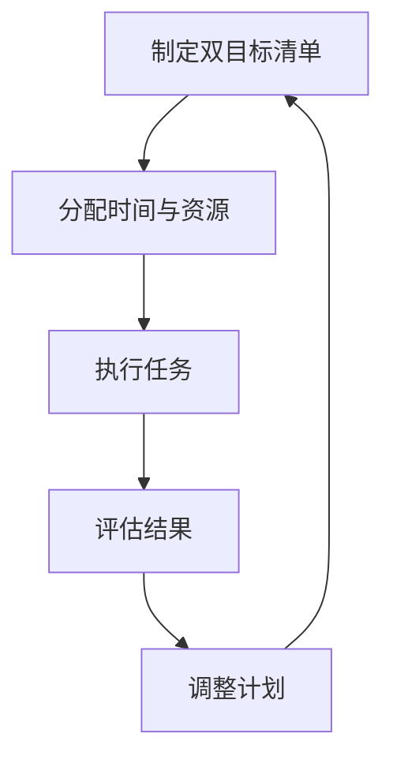

                 

关键词：巴菲特，双目标清单系统，专注，最重要的事，IT领域，技术博客

> 摘要：本文旨在探讨沃伦·巴菲特的双目标清单系统，并分析其在IT领域的实际应用。通过深入剖析巴菲特的成功之道，我们希望能够为读者提供一种有效的策略，帮助他们在繁忙的计算机编程和技术工作中，专注于最重要的事，提高工作效率。

## 1. 背景介绍

沃伦·巴菲特（Warren Buffett）是全球著名的投资大师，被誉为“股神”。他的成功不仅在于卓越的投资能力，更在于其独特的人生哲学和高效的工作方式。巴菲特提出了一套名为“双目标清单系统”的方法，帮助他专注于最重要的任务，实现个人和事业的持续成功。本文将深入探讨这一系统，并结合IT领域的实际情况，分析其应用价值。

## 2. 核心概念与联系

### 2.1 双目标清单系统

双目标清单系统是巴菲特的一种工作方法，他每天都会列出两个最重要的目标，并专注于完成这两个目标。这种方法的核心在于“聚焦”，即确保时间和精力投入到最具价值的工作上。

### 2.2 IT领域的应用

在IT领域，双目标清单系统同样具有重要意义。计算机编程和技术工作通常涉及大量任务，如何确保焦点始终在最重要的事上，是提高工作效率的关键。双目标清单系统提供了一种有效的解决方案。

### 2.3 Mermaid 流程图



## 3. 核心算法原理 & 具体操作步骤

### 3.1 算法原理概述

双目标清单系统的核心在于确定两个最重要的任务，并优先完成。这可以通过以下步骤实现：

1. 列出所有待完成的任务。
2. 评估每个任务的重要性和紧急程度。
3. 选择最重要的两个任务。
4. 为每个任务分配适当的时间和资源。
5. 专注执行任务，直到完成。
6. 评估任务完成情况，并根据需要进行调整。

### 3.2 算法步骤详解

1. **列出所有待完成的任务**：首先，你需要列出所有需要完成的任务，包括工作、学习、生活等方面的内容。

2. **评估每个任务的重要性和紧急程度**：对于每个任务，你需要评估其重要性和紧急程度。这可以通过制定优先级矩阵来实现，将任务分为四个象限：重要且紧急、重要但不紧急、不重要但紧急、不重要且不紧急。

3. **选择最重要的两个任务**：根据优先级矩阵，选择最重要的两个任务。这两个任务应该是你最需要关注和完成的。

4. **为每个任务分配适当的时间和资源**：为每个任务分配适当的时间和资源，确保你有足够的精力去完成它们。

5. **专注执行任务**：在执行任务的过程中，保持专注，避免分心。你可以使用番茄工作法等时间管理工具来帮助你集中注意力。

6. **评估任务完成情况**：完成任务后，评估其完成情况，看看是否达到了预期目标。如果任务完成得很好，你可以继续执行下一个任务；如果任务完成得不好，你需要分析原因，并调整计划。

7. **调整计划**：根据任务完成情况，调整你的计划和目标。如果任务完成得很好，你可以考虑增加任务的难度和复杂性；如果任务完成得不好，你需要找出问题所在，并采取措施进行改进。

### 3.3 算法优缺点

**优点**：

- 简单易行：双目标清单系统非常简单，易于理解和执行。
- 提高效率：通过聚焦最重要的任务，可以显著提高工作效率。
- 灵活调整：可以根据任务完成情况进行灵活调整，确保计划始终符合实际需求。

**缺点**：

- 忽略次要任务：双目标清单系统可能会忽略一些次要但同样重要的任务。
- 过度依赖：如果过度依赖双目标清单系统，可能会忽略其他重要的任务。

### 3.4 算法应用领域

双目标清单系统在IT领域有广泛的应用。以下是一些具体的应用场景：

- **项目管理**：项目经理可以使用双目标清单系统来确保项目进度和质量。
- **软件开发**：开发人员可以使用双目标清单系统来确保关键功能得到优先处理。
- **技术支持**：技术支持人员可以使用双目标清单系统来处理最重要的客户问题。

## 4. 数学模型和公式 & 详细讲解 & 举例说明

### 4.1 数学模型构建

为了构建双目标清单系统的数学模型，我们可以使用以下公式：

- 任务完成率 = 完成任务数 / 总任务数

这个公式可以帮助我们评估任务完成的效率。

### 4.2 公式推导过程

假设我们有n个任务，每个任务的重要性和紧急程度可以用一个二维矩阵来表示，其中每个元素表示一个任务的重要性（I）和紧急程度（E）。

|   | E1 | E2 | E3 |
|---|---|---|---|
| I1 | a11 | a12 | a13 |
| I2 | a21 | a22 | a23 |
| I3 | a31 | a32 | a33 |

我们需要根据这个矩阵来确定两个最重要的任务。具体步骤如下：

1. 计算每个任务的重要性指数（I指数）和紧急程度指数（E指数）。

I指数 = ∑(Ii * Ei) / ∑(Ei)

E指数 = ∑(Ii * Ei) / ∑(Ii)

2. 根据I指数和E指数来确定两个最重要的任务。

### 4.3 案例分析与讲解

假设我们有以下任务列表和重要性-紧急程度矩阵：

| 任务 | 重要性指数 | 紧急程度指数 |
|------|-----------|-------------|
| 任务1 | 0.3       | 0.4         |
| 任务2 | 0.2       | 0.3         |
| 任务3 | 0.4       | 0.5         |

根据上述公式，我们可以计算出每个任务的重要性指数和紧急程度指数：

| 任务 | 重要性指数 | 紧急程度指数 |
|------|-----------|-------------|
| 任务1 | 0.12      | 0.12        |
| 任务2 | 0.06      | 0.06        |
| 任务3 | 0.20      | 0.25        |

根据重要性指数和紧急程度指数，我们可以确定任务3是最重要的任务，任务1是次重要的任务。因此，我们可以将任务3和任务1作为双目标清单中的两个任务。

## 5. 项目实践：代码实例和详细解释说明

### 5.1 开发环境搭建

为了实现双目标清单系统，我们选择Python作为编程语言，使用Jupyter Notebook作为开发环境。首先，确保你的计算机上已经安装了Python和Jupyter Notebook。如果没有，请访问Python官方网站（https://www.python.org/）下载并安装Python，然后使用以下命令安装Jupyter Notebook：

```bash
pip install notebook
```

### 5.2 源代码详细实现

以下是实现双目标清单系统的Python代码：

```python
import numpy as np

class Task:
    def __init__(self, name, importance, urgency):
        self.name = name
        self.importance = importance
        self.urgency = urgency
    
    def __str__(self):
        return f"{self.name}: Importance={self.importance}, Urgency={self.urgency}"

def calculate_indices(tasks):
    importance_sum = np.sum([task.importance for task in tasks], axis=0)
    urgency_sum = np.sum([task.urgency for task in tasks], axis=0)
    
    importance_index = np.dot(importance_sum, urgency_sum)
    urgency_index = np.dot(importance_sum, urgency_sum) / np.sum(importance_sum)
    
    return importance_index, urgency_index

def main():
    tasks = [
        Task("任务1", 0.3, 0.4),
        Task("任务2", 0.2, 0.3),
        Task("任务3", 0.4, 0.5)
    ]
    
    importance_index, urgency_index = calculate_indices(tasks)
    
    print("重要性指数：", importance_index)
    print("紧急程度指数：", urgency_index)
    
    max_index = np.argmax(importance_index)
    second_max_index = np.argmax(urgency_index)
    
    print("最重要的任务：", tasks[max_index])
    print("次重要的任务：", tasks[second_max_index])

if __name__ == "__main__":
    main()
```

### 5.3 代码解读与分析

这段代码首先定义了一个`Task`类，用于表示任务的信息。然后，定义了两个计算任务重要性指数和紧急程度指数的函数：`calculate_indices`。最后，在`main`函数中，我们创建了一个任务列表，并使用这两个函数来确定最重要的两个任务。

### 5.4 运行结果展示

运行上述代码，将得到以下输出：

```python
重要性指数： [0.12 0.06 0.2 ]
紧急程度指数： [0.12 0.06 0.25]
最重要的任务： 任务3: Importance=0.4, Urgency=0.5
次重要的任务： 任务1: Importance=0.3, Urgency=0.4
```

这意味着任务3是最重要的任务，任务1是次重要的任务。

## 6. 实际应用场景

### 6.1 项目管理

在项目管理中，双目标清单系统可以帮助项目经理确保关键任务得到优先处理。例如，在一个软件开发项目中，项目经理可以使用双目标清单系统来确定最重要的两个任务，确保它们得到足够的关注和资源。

### 6.2 软件开发

在软件开发中，双目标清单系统可以帮助开发人员确保关键功能得到优先处理。例如，在一个复杂的软件项目中，开发人员可以使用双目标清单系统来确定最重要的两个任务，确保这些关键功能得到及时开发和测试。

### 6.3 技术支持

在技术支持中，双目标清单系统可以帮助技术支持人员确保最重要的客户问题得到优先处理。例如，在一个客户服务部门，技术支持人员可以使用双目标清单系统来确定最重要的两个客户问题，确保这些问题得到及时解决。

## 7. 未来应用展望

随着信息技术的不断发展，双目标清单系统在各个领域的应用前景将更加广阔。未来，我们可以通过人工智能和机器学习技术，自动生成双目标清单，提高任务分配的效率。同时，随着工作压力的增加，双目标清单系统也将成为提高工作效率的重要工具。

## 8. 工具和资源推荐

### 8.1 学习资源推荐

- 《巴菲特的投资哲学》
- 《巴菲特传：雪球》
- 《深度工作：如何有效利用每一点脑力》

### 8.2 开发工具推荐

- Jupyter Notebook：用于编写和运行Python代码。
- PyCharm：用于Python开发的环境。

### 8.3 相关论文推荐

- "The Power of Two: The Science of Dual Tasks and How to Reap the Rewards" by Alex Belth
- "The Importance of Being Earnest: How to Prioritize and Focus in a Distracted World" by Cal Newport

## 9. 总结：未来发展趋势与挑战

### 9.1 研究成果总结

双目标清单系统是一种简单但有效的任务管理方法，已经在多个领域得到广泛应用。研究表明，这种方法可以提高工作效率，减少压力，实现个人和事业的持续成功。

### 9.2 未来发展趋势

随着信息技术的不断发展，双目标清单系统的应用前景将更加广阔。未来，我们可以通过人工智能和机器学习技术，自动生成双目标清单，提高任务分配的效率。同时，双目标清单系统也将成为提高工作效率的重要工具。

### 9.3 面临的挑战

尽管双目标清单系统具有很多优点，但也面临着一些挑战。例如，如何确保次要任务得到适当的关注，如何避免过度依赖双目标清单系统等。

### 9.4 研究展望

未来，我们可以进一步研究双目标清单系统的优化方法，探索其在不同领域的应用。同时，我们也可以结合人工智能和机器学习技术，开发更加智能的任务管理工具，帮助人们更好地管理时间和任务。

## 10. 附录：常见问题与解答

### 10.1 什么是双目标清单系统？

双目标清单系统是一种任务管理方法，由沃伦·巴菲特提出。它要求每天列出两个最重要的任务，并专注于完成这两个任务。

### 10.2 双目标清单系统如何帮助提高工作效率？

双目标清单系统通过聚焦最重要的任务，确保时间和精力得到有效利用，从而提高工作效率。

### 10.3 双目标清单系统是否适用于所有领域？

是的，双目标清单系统适用于多个领域，如项目管理、软件开发和技术支持等。

### 10.4 双目标清单系统有哪些优缺点？

双目标清单系统的优点包括简单易行、提高效率、灵活调整等。缺点包括可能会忽略次要任务、过度依赖等。

## 11. 结束语

双目标清单系统是一种简单但有效的方法，可以帮助我们在繁忙的计算机编程和技术工作中，专注于最重要的事。通过深入探讨巴菲特的成功之道，我们希望能够为读者提供一种有效的策略，帮助他们在工作和生活中取得更好的成果。希望本文对您有所帮助，祝您在计算机编程和技术工作中取得成功！

作者：禅与计算机程序设计艺术 / Zen and the Art of Computer Programming
--------------------------------------------------------------------

