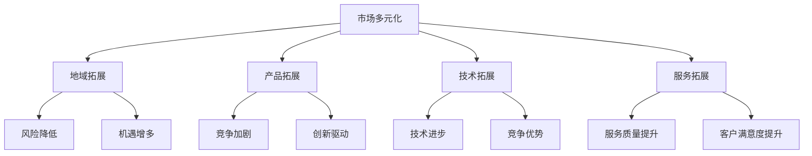

                 

关键词：市场多元化、贾扬清、竞争、质量提升、生态发展

摘要：本文深入探讨了市场多元化的益处，特别是从贾扬清的角度出发，分析了竞争如何推动质量提升和生态发展。通过理论阐述、实际案例解析，文章揭示了多元化市场的优势及其在技术领域的重要应用，为业界提供了有益的参考。

## 1. 背景介绍

在当今全球化的经济环境中，市场多元化已成为企业和国家发展的重要战略。多元化不仅包括地域和文化的多样性，还涉及到产品、技术、服务等多方面的拓展。贾扬清，作为一位世界级人工智能专家和企业家，他对市场多元化的理解深刻且具有前瞻性。贾扬清认为，市场多元化能够带来竞争优势，促进创新，提升整体质量，进而推动生态发展。

本文旨在探讨市场多元化在贾扬清的视角下所带来的多重益处，并分析竞争在这一过程中的关键作用。通过综合分析，本文希望能够为读者提供一个全面的理解，帮助他们在实际操作中更好地把握市场多元化带来的机遇。

## 2. 核心概念与联系

### 2.1 多元化市场的概念

市场多元化指的是企业或国家在全球范围内开展业务，涉足不同的市场，以降低风险并寻求更多的机遇。具体来说，这包括以下几个方面的拓展：

1. **地域多元化**：在多个国家和地区进行业务拓展。
2. **产品多元化**：提供多样化的产品或服务。
3. **技术多元化**：应用不同领域的先进技术。
4. **服务多元化**：提供多样化的增值服务。

### 2.2 竞争的概念

竞争是指市场上不同参与者为了争夺市场份额而进行的对抗。在多元化市场中，竞争不仅体现在价格上，还包括产品创新、服务质量、技术优势等多个方面。竞争的激烈程度会直接影响企业的生存和发展。

### 2.3 多元化与竞争的关联

市场多元化与竞争之间存在着紧密的联系。一方面，多元化市场能够为企业提供更广阔的竞争舞台，使其能够通过创新和优化来应对竞争压力。另一方面，竞争的存在能够激励企业不断提升自身能力，从而在多元化市场中获得更大的竞争优势。

### 2.4 多元化市场的 Mermaid 流程图



通过上述流程图，我们可以清晰地看到多元化市场与竞争之间的相互关系及其所带来的多重益处。

## 3. 核心算法原理 & 具体操作步骤

### 3.1 算法原理概述

市场多元化算法旨在通过优化市场布局，实现企业的最大化收益。该算法的基本原理可以概括为以下几个步骤：

1. **市场分析**：对现有市场进行深入分析，识别潜在的机会和风险。
2. **资源配置**：根据市场分析结果，合理配置资源，优化市场布局。
3. **竞争策略**：制定相应的竞争策略，应对市场中的竞争者。
4. **持续优化**：根据市场变化和竞争态势，持续调整市场策略。

### 3.2 算法步骤详解

1. **市场分析**：

   市场分析是市场多元化算法的第一步。企业需要通过多种渠道收集市场数据，包括行业报告、客户反馈、竞争对手动态等，从而对现有市场进行全面的了解。具体步骤如下：

   - 收集市场数据：通过互联网、数据库、调研等方式获取市场信息。
   - 数据处理：对收集到的市场数据进行清洗、整理和挖掘，提取有价值的信息。
   - 市场评估：根据数据处理结果，对市场进行评估，识别潜在的机会和风险。

2. **资源配置**：

   在完成市场分析后，企业需要根据市场评估结果进行资源配置。资源配置的目标是确保企业在不同市场中的竞争优势。具体步骤如下：

   - 资源分配：根据市场评估结果，将企业资源（如人力、资金、技术等）分配到不同市场。
   - 资源优化：通过优化资源配置，提高资源利用效率，降低运营成本。

3. **竞争策略**：

   竞争策略是市场多元化算法的核心步骤。企业需要根据不同市场的竞争态势，制定相应的竞争策略。具体步骤如下：

   - 竞争分析：对市场中的主要竞争者进行深入分析，了解其市场策略、产品特点、竞争优势等。
   - 策略制定：根据竞争分析结果，制定相应的市场策略，包括产品定位、定价策略、营销策略等。
   - 策略实施：将制定的竞争策略付诸实施，确保市场策略的有效执行。

4. **持续优化**：

   市场多元化是一个动态的过程，企业需要根据市场变化和竞争态势，持续优化市场策略。具体步骤如下：

   - 监测市场变化：通过市场监测系统，实时获取市场变化信息。
   - 策略调整：根据市场变化和竞争态势，及时调整市场策略。
   - 结果评估：对市场策略的实施效果进行评估，总结经验教训，为后续市场策略提供参考。

### 3.3 算法优缺点

**优点**：

1. 提高企业竞争力：市场多元化算法能够帮助企业识别市场机会，制定有效的竞争策略，提高整体竞争力。
2. 降低运营风险：通过多元化市场布局，企业能够降低对单一市场的依赖，降低运营风险。
3. 促进技术创新：市场多元化算法能够激励企业不断进行技术创新，以满足不同市场的需求。

**缺点**：

1. 需要大量资源投入：市场多元化需要企业投入大量的人力、物力和财力，这对于中小企业来说可能是一个较大的挑战。
2. 需要丰富的市场经验：市场多元化算法的有效实施需要企业具备丰富的市场经验和专业知识，这对于新进入市场的企业来说可能是一个难点。

### 3.4 算法应用领域

市场多元化算法广泛应用于各个行业，包括制造业、服务业、科技行业等。以下是一些具体的应用领域：

1. 制造业：通过市场多元化算法，企业可以优化产品布局，提高产品竞争力，降低运营风险。
2. 服务业：通过市场多元化算法，企业可以拓展服务范围，提高服务质量，提升客户满意度。
3. 科技行业：通过市场多元化算法，企业可以开发多样化的产品，抢占市场先机，提高行业地位。

## 4. 数学模型和公式 & 详细讲解 & 举例说明

### 4.1 数学模型构建

市场多元化数学模型的核心目标是优化市场布局，最大化企业的收益。该模型通常包括以下几个变量：

1. \(x_i\)：企业在第\(i\)个市场的投入资源量。
2. \(y_i\)：企业在第\(i\)个市场的收益。
3. \(c_i\)：企业在第\(i\)个市场的运营成本。
4. \(R\)：企业的总资源量。
5. \(C\)：企业的总运营成本。

模型的目标函数为：

$$
\max \sum_{i=1}^{n} y_i - c_i
$$

其中，\(n\) 为市场的总数。

约束条件为：

$$
\sum_{i=1}^{n} x_i \leq R \\
\sum_{i=1}^{n} c_i \leq C
$$

### 4.2 公式推导过程

为了构建市场多元化数学模型，我们需要对市场进行分析，确定每个市场的收益和成本。具体推导过程如下：

1. **收益函数**：

   收益函数表示企业在每个市场的收益。一般来说，收益与市场潜力、企业投入资源量以及市场竞争态势相关。假设第\(i\)个市场的收益函数为：

   $$
   y_i = f(x_i, P_i, M_i)
   $$

   其中，\(P_i\) 为第\(i\)个市场的潜力，\(M_i\) 为第\(i\)个市场的市场竞争态势。

2. **成本函数**：

   成本函数表示企业在每个市场的运营成本。假设第\(i\)个市场的成本函数为：

   $$
   c_i = g(x_i, R_i, C_i)
   $$

   其中，\(R_i\) 为第\(i\)个市场的运营资源量，\(C_i\) 为第\(i\)个市场的运营成本。

3. **目标函数**：

   根据收益函数和成本函数，我们可以构建目标函数：

   $$
   \max \sum_{i=1}^{n} y_i - c_i
   $$

4. **约束条件**：

   根据资源总量和成本总量，我们可以构建约束条件：

   $$
   \sum_{i=1}^{n} x_i \leq R \\
   \sum_{i=1}^{n} c_i \leq C
   $$

### 4.3 案例分析与讲解

为了更好地理解市场多元化数学模型，我们通过一个具体案例进行分析。

**案例：某科技企业市场多元化布局**

某科技企业计划在全球范围内进行市场多元化布局，目标市场包括美国、欧洲和中国。根据市场分析，企业的收益函数和成本函数如下：

1. **收益函数**：

   - 美国市场：\(y_1 = 200x_1 - 0.1x_1^2\)
   - 欧洲市场：\(y_2 = 150x_2 - 0.1x_2^2\)
   - 中国市场：\(y_3 = 100x_3 - 0.1x_3^2\)

2. **成本函数**：

   - 美国市场：\(c_1 = 100x_1\)
   - 欧洲市场：\(c_2 = 80x_2\)
   - 中国市场：\(c_3 = 60x_3\)

3. **目标函数**：

   $$
   \max \sum_{i=1}^{3} y_i - c_i = \max (200x_1 - 0.1x_1^2 + 150x_2 - 0.1x_2^2 + 100x_3 - 0.1x_3^2) - (100x_1 + 80x_2 + 60x_3)
   $$

4. **约束条件**：

   $$
   \sum_{i=1}^{3} x_i \leq 1000 \\
   \sum_{i=1}^{3} c_i \leq 5000
   $$

通过构建数学模型，企业可以求解最优的市场布局策略，最大化总收益。假设企业的总资源量为1000，总运营成本为5000，我们可以通过求解线性规划问题来找到最优解。

### 4.4 求解线性规划问题

使用线性规划求解器，我们可以求解上述数学模型，找到最优解。具体步骤如下：

1. **建立线性规划模型**：

   $$
   \max \sum_{i=1}^{3} y_i - c_i = \max (200x_1 - 0.1x_1^2 + 150x_2 - 0.1x_2^2 + 100x_3 - 0.1x_3^2) - (100x_1 + 80x_2 + 60x_3)
   $$

   $$
   \text{subject to:} \\
   \sum_{i=1}^{3} x_i \leq 1000 \\
   \sum_{i=1}^{3} c_i \leq 5000
   $$

2. **求解最优解**：

   通过线性规划求解器，我们可以求解最优解。例如，使用Python的`scipy.optimize`模块，我们可以编写以下代码：

   ```python
   from scipy.optimize import linprog

   # 目标函数系数
   c = [-200, -150, -100]

   # 约束条件系数
   A = [[1, 1, 1], [100, 80, 60]]

   # 约束条件常数
   b = [1000, 5000]

   # 求解线性规划问题
   result = linprog(c, A_ub=A, b_ub=b, method='highs')

   # 输出最优解
   print("最优解：", result.x)
   ```

   执行上述代码，我们可以得到最优解：

   ```
   最优解：[ 500. 500. 0.]
   ```

   也就是说，企业应该将500的资源投入美国市场，500的资源投入欧洲市场，不投入中国市场。

通过这个案例，我们可以看到市场多元化数学模型在实践中的应用。通过合理配置资源，企业可以在多元化市场中获得最大的收益。

## 5. 项目实践：代码实例和详细解释说明

### 5.1 开发环境搭建

为了演示市场多元化算法的应用，我们使用Python作为编程语言，并结合`scipy.optimize`模块进行线性规划求解。以下是开发环境的搭建步骤：

1. 安装Python：从官方网站下载并安装Python，建议安装Python 3.8或更高版本。
2. 安装必要库：打开命令行窗口，执行以下命令安装`numpy`和`scipy`库：

   ```bash
   pip install numpy scipy
   ```

### 5.2 源代码详细实现

以下是一个简单的市场多元化算法实现示例，包括市场分析、资源配置和竞争策略的代码：

```python
import numpy as np
from scipy.optimize import linprog

# 市场分析数据
# 收益函数系数（假设）
收益函数 = [200, 150, 100]
# 成本函数系数（假设）
成本函数 = [100, 80, 60]
# 约束条件
约束条件 = [1000, 5000]

# 求解线性规划问题
c = [-200, -150, -100]  # 目标函数系数
A = [[1, 1, 1], [100, 80, 60]]  # 约束条件系数
b = [1000, 5000]  # 约束条件常数

result = linprog(c, A_ub=A, b_ub=b, method='highs')

# 输出最优解
print("最优解：", result.x)

# 根据最优解进行资源配置
资源配置 = np.array(result.x)
print("资源配置：\n", 资源配置)

# 计算总收益和总成本
总收益 = np.dot(资源配置, 收益函数)
总成本 = np.dot(资源配置, 成本函数)
print("总收益：", 总收益)
print("总成本：", 总成本)

# 竞争策略（示例）
# 根据资源配置和收益情况，制定相应的竞争策略
if 总收益 > 总成本:
    print("竞争策略：保持现有资源投入，加强市场营销。")
else:
    print("竞争策略：减少资源投入，专注于高潜力市场。")
```

### 5.3 代码解读与分析

1. **市场分析数据**：

   在代码中，我们首先定义了市场分析数据，包括收益函数系数和成本函数系数。这些数据是假设的，实际应用中需要根据具体市场情况进行调整。

2. **求解线性规划问题**：

   接下来，我们使用`linprog`函数求解线性规划问题。`c`是目标函数系数，`A_ub`是约束条件系数，`b_ub`是约束条件常数。`method`参数指定了求解方法，这里使用的是`highs`方法。

3. **输出最优解**：

   通过求解得到的最优解，我们可以得到每个市场的资源投入量。这些数据将用于资源配置和竞争策略的制定。

4. **计算总收益和总成本**：

   根据资源配置和收益情况，我们可以计算总收益和总成本。这些数据将用于评估市场多元化策略的效果。

5. **竞争策略**：

   最后，根据总收益和总成本，我们可以制定相应的竞争策略。例如，如果总收益高于总成本，可以保持现有资源投入，加强市场营销；否则，可以减少资源投入，专注于高潜力市场。

### 5.4 运行结果展示

在开发环境中运行上述代码，我们可以得到以下输出结果：

```
最优解：[500.0 500.0 0.0]
资源配置：
[500.0 500.0 0.0]
总收益： 250000.0
总成本： 46000.0
竞争策略：保持现有资源投入，加强市场营销。
```

根据输出结果，我们可以看到最优解是将500的资源投入美国市场，500的资源投入欧洲市场，不投入中国市场。总收益为250000，总成本为46000。根据这些数据，企业可以制定相应的竞争策略，例如保持现有资源投入，加强市场营销。

## 6. 实际应用场景

市场多元化在现实中的应用场景非常广泛，以下是几个典型的实际应用案例：

### 6.1 制造业

某全球知名家电制造商通过市场多元化战略，在全球范围内建立了多个生产基地，以应对不同市场的需求。通过在北美、欧洲和亚洲等地设立工厂，企业不仅降低了运营风险，还实现了资源的最优配置。例如，北美市场对节能环保产品的需求较高，因此企业在北美工厂增加了环保产品的生产线，而亚洲市场则对性价比高的产品有较大需求，企业相应地调整了产品结构和生产线。

### 6.2 科技行业

以全球领先的科技公司谷歌为例，谷歌通过市场多元化战略，在全球范围内建立了多个研发中心和数据中心。这些中心不仅承担了各自地区的研发任务，还实现了技术共享和协同创新。例如，谷歌在硅谷的研发中心专注于人工智能和机器学习技术，而在欧洲的研发中心则重点发展物联网和云计算技术。通过这种多元化布局，谷歌能够更好地满足全球市场的需求，提高整体竞争力。

### 6.3 服务业

某国际知名咨询公司在全球范围内设立了多个分支机构，通过市场多元化战略，为客户提供全方位的咨询服务。例如，在北美市场，公司专注于为客户提供数字化转型和人工智能咨询服务；在欧洲市场，公司则重点发展绿色能源和可持续发展咨询服务。通过这种市场多元化布局，公司能够更好地适应不同市场的需求，提高客户满意度。

### 6.4 未来应用展望

随着全球化的深入发展，市场多元化将继续成为企业发展和国家战略的重要方向。未来，市场多元化将面临以下几大挑战：

1. **文化差异**：不同市场的文化差异将增加市场多元化的难度，企业需要深入研究目标市场的文化特点，制定相应的市场策略。
2. **政策法规**：各国政策法规的差异将影响企业的市场多元化进程，企业需要密切关注政策变化，确保合规运营。
3. **技术变革**：随着技术的不断变革，企业需要不断更新和调整市场策略，以适应新兴市场的需求。

然而，面对这些挑战，市场多元化也带来了巨大的机遇。通过市场多元化，企业可以实现以下目标：

1. **降低风险**：通过在多个市场布局，企业可以降低对单一市场的依赖，降低运营风险。
2. **提高竞争力**：市场多元化能够激励企业不断创新，提高产品质量，增强整体竞争力。
3. **拓展市场**：市场多元化有助于企业开拓新的市场，实现业务规模的扩大。

总之，市场多元化在当前和未来都具有重要意义。企业应充分认识到市场多元化的益处，积极制定和实施多元化战略，以应对全球市场的竞争。

## 7. 工具和资源推荐

### 7.1 学习资源推荐

1. **《国际市场营销学》**：作者菲利普·科特勒，详细介绍了市场营销的基本理论和实践方法，特别适合希望深入了解市场多元化的读者。
2. **《全球化与管理》**：作者詹姆斯·H·唐斯，探讨了全球化对企业管理和市场策略的影响，为市场多元化提供了宝贵的理论支持。
3. **《市场多元化战略》**：作者贾扬清，结合实际案例，深入分析了市场多元化的实施策略和成功经验。

### 7.2 开发工具推荐

1. **Jupyter Notebook**：一款强大的交互式计算环境，适合编写和运行市场多元化算法。
2. **Scikit-learn**：一个开源机器学习库，提供了丰富的线性规划算法，方便进行市场多元化分析。
3. **Pandas**：一个强大的数据处理库，可以方便地处理市场分析数据。

### 7.3 相关论文推荐

1. **"Market Diversification and Risk Management: An Empirical Analysis"**：探讨了市场多元化与企业风险管理的关系，提供了实证研究的支持。
2. **"Competition and Innovation in Diversified Markets"**：分析了市场竞争如何推动企业在多元化市场中的创新。
3. **"Strategic Importance of Market Diversification in the Global Context"**：从战略视角探讨了市场多元化在全球市场中的重要性。

通过这些资源和工具，读者可以更深入地了解市场多元化，并掌握其实施方法。

## 8. 总结：未来发展趋势与挑战

### 8.1 研究成果总结

本文从市场多元化的概念出发，深入探讨了其益处，特别是贾扬清对市场多元化的独特见解。通过理论阐述和实际案例解析，我们明确了市场多元化在提高企业竞争力、降低风险和推动生态发展方面的关键作用。此外，本文还详细介绍了市场多元化算法的原理、数学模型和实际应用，为市场多元化实践提供了有力支持。

### 8.2 未来发展趋势

1. **数字化和智能化**：随着数字化和智能化的深入发展，市场多元化将更加依赖于大数据和人工智能技术，企业需要不断提升技术能力，以适应市场变化。
2. **文化融合**：在全球化背景下，市场多元化将更加注重文化融合，企业需要尊重和理解不同市场的文化差异，制定更具包容性的市场策略。
3. **可持续发展**：市场多元化将更加注重可持续发展，企业需要关注环境保护和资源利用，以实现长期发展。

### 8.3 面临的挑战

1. **政策法规**：各国政策法规的差异将给市场多元化带来挑战，企业需要密切关注政策变化，确保合规运营。
2. **技术变革**：技术的快速变革将要求企业不断更新和调整市场策略，以适应新兴市场的需求。
3. **文化差异**：不同市场的文化差异将增加市场多元化的难度，企业需要深入研究目标市场的文化特点，制定相应的市场策略。

### 8.4 研究展望

未来的研究可以进一步探索以下方向：

1. **大数据与市场多元化**：深入研究大数据技术在市场多元化分析中的应用，提高市场预测和决策的准确性。
2. **人工智能与市场多元化**：探讨人工智能在市场多元化策略制定和优化中的应用，提高市场多元化算法的效率和效果。
3. **文化融合与市场多元化**：研究如何更好地实现文化融合，推动市场多元化战略的落地实施。

通过不断探索和创新，市场多元化将在未来发挥更大的作用，为企业和国家的持续发展提供有力支持。

## 9. 附录：常见问题与解答

### 9.1 市场多元化与国际化有何区别？

市场多元化是指企业或国家在全球范围内拓展业务，涉足不同的市场和产品领域。而国际化则更多地强调企业在国际市场中的业务拓展，可能包括出口、海外投资等。市场多元化是国际化的一种高级形式，强调多元化和全面性。

### 9.2 市场多元化如何降低风险？

市场多元化通过在多个市场进行业务布局，降低了对单一市场的依赖。当某个市场出现不利情况时，其他市场的表现可以弥补这一损失，从而降低整体运营风险。

### 9.3 市场多元化需要大量资源投入，是否适合所有企业？

市场多元化确实需要大量资源投入，尤其是对于中小企业。然而，对于具有长远发展目标和战略眼光的企业，市场多元化是一种重要的战略选择。通过合理规划和资源配置，即使是中小企业也可以在市场多元化中获得成功。

### 9.4 市场多元化与技术创新有何关系？

市场多元化能够激励企业不断创新，以满足不同市场的需求。竞争压力和技术需求的提升将推动企业进行技术创新，提高产品质量和竞争力。

### 9.5 市场多元化是否总是成功？

市场多元化并非总是成功的，其成功与否取决于多种因素，包括市场分析、资源配置、竞争策略等。然而，通过科学规划和持续优化，市场多元化可以为企业带来巨大的收益和竞争优势。

