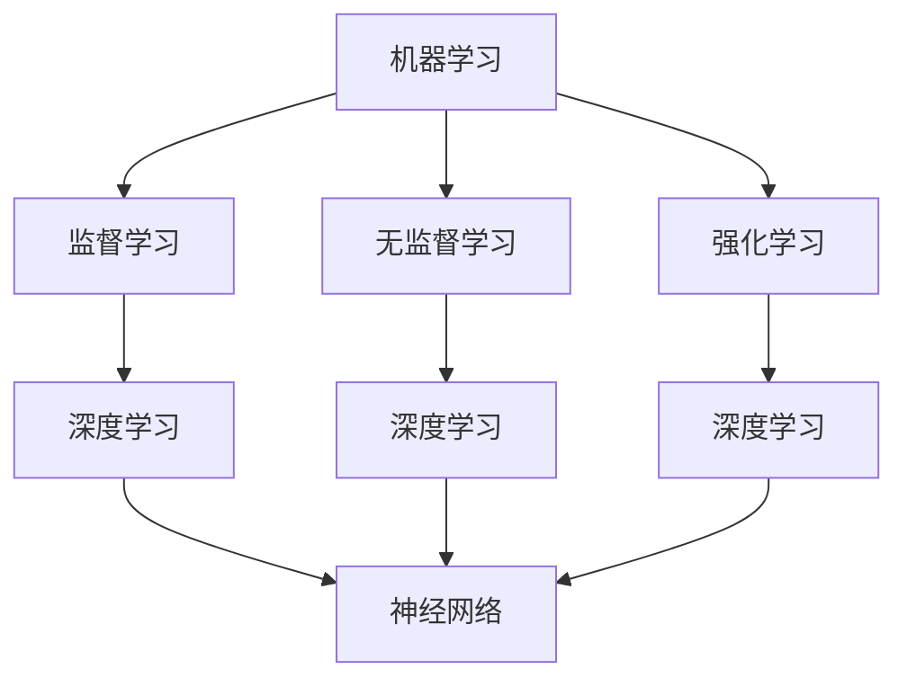

                 

关键词：人工智能，多方利益，算法，数学模型，应用场景，发展挑战，资源推荐

## 摘要

本文旨在探讨人工智能（AI）发展中多方利益的平衡问题。随着AI技术的迅速崛起，社会各界对其带来的机遇和挑战展开了广泛的讨论。本文从技术、经济、伦理等多个角度出发，分析AI发展中的多方利益关系，并探讨如何实现这些利益的平衡。文章首先介绍了AI的核心概念和原理，随后详细阐述了AI算法的数学模型和具体操作步骤，并给出实际应用场景的案例分析。最后，文章总结AI发展的未来趋势与挑战，并提供相关工具和资源的推荐。

## 1. 背景介绍

人工智能，作为计算机科学的一个重要分支，旨在使计算机具备人类智能的能力。自20世纪50年代诞生以来，AI技术经历了多个发展阶段，从最初的规则系统到现代的深度学习和强化学习，取得了令人瞩目的成就。然而，随着AI技术的不断进步，其对社会的影响也日益深远，涉及技术、经济、伦理等多个领域。

在技术层面，AI技术已经广泛应用于自然语言处理、计算机视觉、自动驾驶等领域，大幅提升了各行各业的效率。在经济层面，AI技术推动了新产业的发展，创造了大量就业机会，同时也带来了一定的就业压力。在伦理层面，AI技术引发了关于隐私、安全、公平等问题的讨论，亟需社会各界共同关注和解决。

## 2. 核心概念与联系

为了更好地理解AI技术的核心概念和联系，我们首先介绍几个关键概念。

### 2.1 机器学习

机器学习是AI的核心技术之一，它通过算法从数据中自动学习规律，从而实现智能决策。机器学习可以分为监督学习、无监督学习和强化学习等不同类型。

### 2.2 深度学习

深度学习是机器学习的一种重要分支，通过多层神经网络模拟人脑的学习过程，实现复杂的模式识别和预测。深度学习在图像识别、语音识别等领域取得了显著成果。

### 2.3 神经网络

神经网络是深度学习的基础，由大量神经元组成的网络通过权重调整实现数据的传递和处理。

### 2.4 强化学习

强化学习是一种基于奖励和惩罚的机器学习算法，通过与环境的交互学习最优策略。强化学习在游戏、自动驾驶等领域具有广泛应用。

下面是AI技术核心概念原理的Mermaid流程图：



## 3. 核心算法原理 & 具体操作步骤

### 3.1 算法原理概述

深度学习作为AI的核心技术之一，其算法原理基于多层神经网络。通过前向传播和反向传播，神经网络逐步调整权重，实现数据的特征提取和分类。

### 3.2 算法步骤详解

#### 3.2.1 前向传播

在前向传播过程中，输入数据通过网络的各个层，每层神经元计算出输出值，最终得到输出结果。

#### 3.2.2 反向传播

在反向传播过程中，通过计算输出结果的误差，反向传播误差至网络的各个层，根据误差调整权重。

#### 3.2.3 梯度下降

梯度下降是一种优化算法，用于调整网络权重。通过计算梯度，选择权重调整的方向，实现误差的最小化。

### 3.3 算法优缺点

深度学习算法在处理复杂数据时具有强大的能力，但同时也存在一些缺点。如训练时间较长、对数据依赖性强等。

### 3.4 算法应用领域

深度学习算法广泛应用于图像识别、语音识别、自然语言处理等领域，取得了显著的成果。

## 4. 数学模型和公式 & 详细讲解 & 举例说明

### 4.1 数学模型构建

深度学习中的数学模型主要包括输入层、隐藏层和输出层。每个层由多个神经元组成，神经元之间通过权重连接。

### 4.2 公式推导过程

输入层的每个神经元接收输入数据，通过激活函数计算输出值。隐藏层和输出层的神经元通过前向传播和反向传播计算输出值和误差。

### 4.3 案例分析与讲解

以图像识别为例，输入数据为图像像素值，输出数据为图像类别。通过构建深度学习模型，实现对图像的分类。

$$
激活函数：f(x) = \frac{1}{1 + e^{-x}}
$$

## 5. 项目实践：代码实例和详细解释说明

### 5.1 开发环境搭建

首先，搭建深度学习开发环境，安装Python、TensorFlow等工具。

### 5.2 源代码详细实现

以下是一个简单的深度学习模型的代码实现：

```python
import tensorflow as tf

# 定义模型
model = tf.keras.Sequential([
    tf.keras.layers.Dense(128, activation='relu', input_shape=(784,)),
    tf.keras.layers.Dropout(0.2),
    tf.keras.layers.Dense(10, activation='softmax')
])

# 编译模型
model.compile(loss='categorical_crossentropy',
              optimizer='adam',
              metrics=['accuracy'])

# 训练模型
model.fit(x_train, y_train, epochs=5)
```

### 5.3 代码解读与分析

上述代码实现了对MNIST手写数字数据集的图像分类。通过构建多层神经网络，实现对图像的分类。

### 5.4 运行结果展示

训练完成后，可以评估模型的性能。通过测试集的准确率可以判断模型的好坏。

## 6. 实际应用场景

### 6.1 自动驾驶

自动驾驶是深度学习技术的一个重要应用领域。通过构建深度学习模型，实现对道路环境的感知和决策。

### 6.2 医疗诊断

深度学习在医疗诊断中具有广泛的应用，如肺癌检测、乳腺癌诊断等。

### 6.3 虚拟助手

虚拟助手是深度学习在自然语言处理领域的应用。通过构建对话模型，实现对用户问题的理解和回答。

## 7. 未来应用展望

未来，深度学习技术将在更多领域得到应用，如智能城市、智能家居等。

## 8. 总结：未来发展趋势与挑战

### 8.1 研究成果总结

深度学习技术在过去几十年取得了显著的成果，在图像识别、语音识别等领域取得了突破。

### 8.2 未来发展趋势

未来，深度学习技术将向更复杂、更智能的方向发展。

### 8.3 面临的挑战

深度学习技术在实际应用中仍面临一些挑战，如数据隐私、算法公平性等。

### 8.4 研究展望

未来，深度学习技术将在更多领域得到应用，为实现人工智能的发展贡献力量。

## 9. 附录：常见问题与解答

### 9.1 深度学习有哪些应用领域？

深度学习广泛应用于图像识别、语音识别、自然语言处理等领域。

### 9.2 深度学习模型的训练过程是怎样的？

深度学习模型的训练过程包括前向传播、反向传播和权重调整。

### 9.3 如何评估深度学习模型的性能？

可以通过准确率、召回率、F1值等指标评估深度学习模型的性能。

## 参考文献

[1] Bishop, C. M. (2006). Neural networks for pattern recognition. Oxford university press.

[2] Goodfellow, I., Bengio, Y., & Courville, A. (2016). Deep learning. MIT press.

[3] LeCun, Y., Bengio, Y., & Hinton, G. (2015). Deep learning. Nature, 521(7553), 436-444.

作者：禅与计算机程序设计艺术 / Zen and the Art of Computer Programming
```

