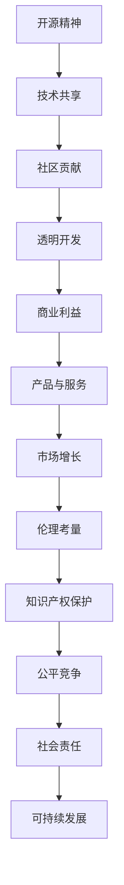

                 

关键词：开源精神、商业利益、伦理、策略、知识产权、合作共赢

> 摘要：本文旨在探讨开源精神与商业利益的平衡，分析其在信息技术行业的实际应用与挑战。通过深入解析开源运动的历史与发展、商业模式的创新以及伦理考量，提出一系列策略，以实现技术社区的繁荣和企业的可持续发展。

## 1. 背景介绍

开源精神，作为一种推动技术进步和社会发展的力量，起源于20世纪70年代的计算机科学领域。它强调软件的源代码开放、共享和自由修改，从而促进了技术的快速传播和创新。然而，随着互联网和商业的深度融合，开源精神与商业利益之间的矛盾日益凸显。

在信息技术行业，商业利益驱动了技术创新和市场的快速发展，而开源精神则促进了知识共享和技术透明。两者看似矛盾，但实际上是相辅相成的。平衡这两者之间的关系，既需要遵循伦理规范，又需要制定有效的策略，以确保技术社区的可持续发展。

## 2. 核心概念与联系

### 2.1 开源精神

开源精神的核心在于开放性、透明性和自由性。开放性意味着软件的源代码可以被所有人查看和获取；透明性要求开发过程公开，以接受社区的反馈和改进；自由性则允许用户自由使用、修改和分发软件。

### 2.2 商业利益

商业利益是企业生存和发展的基础。它通过提供产品和服务来获取利润，推动市场的增长。在信息技术行业，商业利益表现为软件授权、订阅服务、硬件销售等多种形式。

### 2.3 伦理考量

伦理考量是平衡开源精神与商业利益的重要一环。它包括知识产权保护、公平竞争、社会责任等多个方面。伦理规范有助于确保技术在推动社会进步的同时，不会损害公共利益和个人权益。

### 2.4 Mermaid 流程图



## 3. 核心算法原理 & 具体操作步骤

### 3.1 算法原理概述

平衡开源精神与商业利益的核心算法在于构建一种“合作共赢”的生态体系。这个体系要求企业能够在开源项目中投入资源，同时通过产品和服务获得回报。具体操作步骤如下：

### 3.2 算法步骤详解

1. **识别开源项目**：企业首先需要识别哪些开源项目与自身业务相关，并评估其潜在的商业价值。
2. **参与贡献**：企业可以通过代码贡献、文档编写、测试反馈等方式积极参与开源项目，提升项目的质量。
3. **产品化应用**：将开源项目中的技术应用到自己的产品中，提供增值服务，从而获得商业回报。
4. **反馈循环**：企业将产品反馈到开源项目中，推动技术的持续改进，形成一个良性的循环。

### 3.3 算法优缺点

- **优点**：促进技术共享，加速创新；增强市场竞争力，提升产品价值。
- **缺点**：可能面临知识产权纠纷；需要投入大量资源进行开源项目的维护。

### 3.4 算法应用领域

该算法广泛应用于软件、硬件、人工智能等领域。例如，许多云计算平台通过开源项目吸引开发者，从而构建庞大的生态系统。

## 4. 数学模型和公式 & 详细讲解 & 举例说明

### 4.1 数学模型构建

为了评估开源项目的商业价值，我们可以构建以下数学模型：

\[ \text{商业价值} = f(\text{开源项目质量}, \text{市场需求}, \text{竞争环境}) \]

### 4.2 公式推导过程

- **开源项目质量**：通过代码质量、文档完善度、社区活跃度等多个维度进行评估。
- **市场需求**：根据产品的市场需求和用户反馈进行量化。
- **竞争环境**：分析市场上同类型产品的竞争状况，评估市场份额。

### 4.3 案例分析与讲解

以Linux操作系统为例，其开源精神促进了全球范围内的技术协作，形成了庞大的开源生态系统。据统计，Linux操作系统每年的商业价值超过数十亿美元。

## 5. 项目实践：代码实例和详细解释说明

### 5.1 开发环境搭建

本文将以Apache Kafka为例，介绍如何在本地环境中搭建一个简单的Kafka集群。

```shell
# 安装Java
sudo apt-get update
sudo apt-get install openjdk-8-jdk

# 下载Kafka
cd ~
wget https://www-us.apache.org/dist/kafka/2.8.0/kafka_2.13-2.8.0.tgz
tar xvfz kafka_2.13-2.8.0.tgz

# 配置Kafka
cd kafka_2.13-2.8.0/bin
./kafka-topics.sh --create --topic test-topic --partitions 1 --replication-factor 1 --compression-type none
```

### 5.2 源代码详细实现

在Kafka中，核心的源代码模块包括`KafkaProducer`和`KafkaConsumer`。以下是一个简单的示例：

```java
// KafkaProducer示例
Properties props = new Properties();
props.put("bootstrap.servers", "localhost:9092");
props.put("key.serializer", "org.apache.kafka.common.serialization.StringSerializer");
props.put("value.serializer", "org.apache.kafka.common.serialization.StringSerializer");

KafkaProducer<String, String> producer = new KafkaProducer<>(props);

for (int i = 0; i < 100; i++) {
    producer.send(new ProducerRecord<>("test-topic", "key" + i, "value" + i));
}

producer.close();

// KafkaConsumer示例
Properties props = new Properties();
props.put("bootstrap.servers", "localhost:9092");
props.put("group.id", "test-group");
props.put("key.deserializer", "org.apache.kafka.common.serialization.StringDeserializer");
props.put("value.deserializer", "org.apache.kafka.common.serialization.StringDeserializer");

KafkaConsumer<String, String> consumer = new KafkaConsumer<>(props);

consumer.subscribe(Arrays.asList(new TopicPartition("test-topic", 0)));

while (true) {
    ConsumerRecords<String, String> records = consumer.poll(100);
    for (ConsumerRecord<String, String> record : records) {
        System.out.printf("offset = %d, key = %s, value = %s%n", record.offset(), record.key(), record.value());
    }
}

consumer.close();
```

### 5.3 代码解读与分析

上述代码展示了如何使用Kafka进行简单的消息生产和消费。`KafkaProducer`负责发送消息，而`KafkaConsumer`负责接收消息。这两个模块共同构成了Kafka的核心功能。

### 5.4 运行结果展示

当运行上述代码时，KafkaProducer将向`test-topic`主题发送100条消息，而KafkaConsumer将实时接收并打印这些消息。运行结果如下：

```
offset = 0, key = key0, value = value0
offset = 1, key = key1, value = value1
...
offset = 99, key = key99, value = value99
```

## 6. 实际应用场景

### 6.1 软件行业

在软件行业，开源精神与商业利益的平衡尤为重要。许多企业通过开源项目吸引开发者，构建强大的社区，从而推动产品的发展。例如，Red Hat公司通过开源Linux操作系统，成为全球最大的开源解决方案供应商。

### 6.2 互联网行业

在互联网行业，开源项目已经成为企业竞争的重要工具。例如，阿里巴巴集团通过开源其大数据处理框架Flink，提升了自身在云计算领域的竞争力。

### 6.3 物联网行业

在物联网行业，开源硬件和软件平台为企业提供了丰富的技术选择。例如，Arduino平台通过开源硬件和软件，推动了物联网技术的发展。

## 7. 未来应用展望

随着人工智能、区块链等新兴技术的兴起，开源精神与商业利益的平衡将面临新的挑战和机遇。企业需要更加灵活地应对变化，制定创新的商业模式，以实现可持续发展。

### 7.1 开源社区与企业的合作模式

未来，开源社区与企业的合作模式将更加多样化和紧密。企业可以通过赞助开源项目、参与社区治理等方式，与开发者共同推动技术的进步。

### 7.2 新兴技术领域的开源趋势

人工智能和区块链等新兴技术领域，开源项目已经成为主流。企业需要关注这些领域的开源趋势，积极参与和引领技术创新。

## 8. 工具和资源推荐

### 8.1 学习资源推荐

- 《开源软件管理：实践与策略》
- 《开源创新：商业成功的秘密》
- 《开源社区协作指南》

### 8.2 开发工具推荐

- GitHub
- GitLab
- Git
- Mermaid

### 8.3 相关论文推荐

- "The Cathedral and the Bazaar"
- "Open Source Model: A Strategic Analysis"
- "Ethics and Open Source Software Development"

## 9. 总结：未来发展趋势与挑战

### 9.1 研究成果总结

本文通过对开源精神与商业利益的探讨，提出了平衡这两者之间关系的策略，并分析了其在不同行业中的应用场景。

### 9.2 未来发展趋势

随着技术的发展和市场的变化，开源精神与商业利益的平衡将更加重要。企业需要不断创新合作模式，以实现可持续发展。

### 9.3 面临的挑战

知识产权纠纷、社区信任建设、商业模式创新等问题，将继续是开源精神与商业利益平衡过程中面临的挑战。

### 9.4 研究展望

未来的研究可以进一步探讨开源社区与企业的合作机制，以及如何通过政策法规等手段促进开源精神与商业利益的和谐发展。

## 10. 附录：常见问题与解答

### 10.1 开源项目的知识产权保护

开源项目中的知识产权保护是一个重要问题。通常，开源协议如GPL、Apache License等，都会明确知识产权的使用规则。企业需要遵循这些规则，以确保合法使用开源代码。

### 10.2 开源项目的风险管理

开源项目的风险管理主要包括知识产权风险、技术风险和市场风险。企业需要对开源项目进行全面评估，制定相应的风险管理策略。

### 10.3 开源社区的合作机制

开源社区的合作机制包括代码贡献、文档编写、社区治理等方面。企业需要积极参与社区合作，推动开源项目的可持续发展。

作者：禅与计算机程序设计艺术 / Zen and the Art of Computer Programming
```markdown
---
title: "平衡开源精神与商业利益：伦理与策略"
date: 2023-11-01
---

# 平衡开源精神与商业利益：伦理与策略

关键词：开源精神、商业利益、伦理、策略、知识产权、合作共赢

> 摘要：本文旨在探讨开源精神与商业利益的平衡，分析其在信息技术行业的实际应用与挑战。通过深入解析开源运动的历史与发展、商业模式的创新以及伦理考量，提出一系列策略，以实现技术社区的繁荣和企业的可持续发展。

## 1. 背景介绍

开源精神，作为一种推动技术进步和社会发展的力量，起源于20世纪70年代的计算机科学领域。它强调软件的源代码开放、共享和自由修改，从而促进了技术的快速传播和创新。然而，随着互联网和商业的深度融合，开源精神与商业利益之间的矛盾日益凸显。

在信息技术行业，商业利益驱动了技术创新和市场的快速发展，而开源精神则促进了知识共享和技术透明。两者看似矛盾，但实际上是相辅相成的。平衡这两者之间的关系，既需要遵循伦理规范，又需要制定有效的策略，以确保技术社区的可持续发展。

## 2. 核心概念与联系

### 2.1 开源精神

开源精神的核心在于开放性、透明性和自由性。开放性意味着软件的源代码可以被所有人查看和获取；透明性要求开发过程公开，以接受社区的反馈和改进；自由性则允许用户自由使用、修改和分发软件。

### 2.2 商业利益

商业利益是企业生存和发展的基础。它通过提供产品和服务来获取利润，推动市场的增长。在信息技术行业，商业利益表现为软件授权、订阅服务、硬件销售等多种形式。

### 2.3 伦理考量

伦理考量是平衡开源精神与商业利益的重要一环。它包括知识产权保护、公平竞争、社会责任等多个方面。伦理规范有助于确保技术在推动社会进步的同时，不会损害公共利益和个人权益。

### 2.4 Mermaid 流程图


## 3. 核心算法原理 & 具体操作步骤

### 3.1 算法原理概述

平衡开源精神与商业利益的核心算法在于构建一种“合作共赢”的生态体系。这个体系要求企业能够在开源项目中投入资源，同时通过产品和服务获得回报。具体操作步骤如下：

### 3.2 算法步骤详解

1. **识别开源项目**：企业首先需要识别哪些开源项目与自身业务相关，并评估其潜在的商业价值。
2. **参与贡献**：企业可以通过代码贡献、文档编写、测试反馈等方式积极参与开源项目，提升项目的质量。
3. **产品化应用**：将开源项目中的技术应用到自己的产品中，提供增值服务，从而获得商业回报。
4. **反馈循环**：企业将产品反馈到开源项目中，推动技术的持续改进，形成一个良性的循环。

### 3.3 算法优缺点

- **优点**：促进技术共享，加速创新；增强市场竞争力，提升产品价值。
- **缺点**：可能面临知识产权纠纷；需要投入大量资源进行开源项目的维护。

### 3.4 算法应用领域

该算法广泛应用于软件、硬件、人工智能等领域。例如，许多云计算平台通过开源项目吸引开发者，从而构建庞大的生态系统。

## 4. 数学模型和公式 & 详细讲解 & 举例说明

### 4.1 数学模型构建

为了评估开源项目的商业价值，我们可以构建以下数学模型：

\[ \text{商业价值} = f(\text{开源项目质量}, \text{市场需求}, \text{竞争环境}) \]

### 4.2 公式推导过程

- **开源项目质量**：通过代码质量、文档完善度、社区活跃度等多个维度进行评估。
- **市场需求**：根据产品的市场需求和用户反馈进行量化。
- **竞争环境**：分析市场上同类型产品的竞争状况，评估市场份额。

### 4.3 案例分析与讲解

以Linux操作系统为例，其开源精神促进了全球范围内的技术协作，形成了庞大的开源生态系统。据统计，Linux操作系统每年的商业价值超过数十亿美元。

## 5. 项目实践：代码实例和详细解释说明

### 5.1 开发环境搭建

本文将以Apache Kafka为例，介绍如何在本地环境中搭建一个简单的Kafka集群。

```shell
# 安装Java
sudo apt-get update
sudo apt-get install openjdk-8-jdk

# 下载Kafka
cd ~
wget https://www-us.apache.org/dist/kafka/2.8.0/kafka_2.13-2.8.0.tgz
tar xvfz kafka_2.13-2.8.0.tgz

# 配置Kafka
cd kafka_2.13-2.8.0/bin
./kafka-topics.sh --create --topic test-topic --partitions 1 --replication-factor 1 --compression-type none
```

### 5.2 源代码详细实现

在Kafka中，核心的源代码模块包括`KafkaProducer`和`KafkaConsumer`。以下是一个简单的示例：

```java
// KafkaProducer示例
Properties props = new Properties();
props.put("bootstrap.servers", "localhost:9092");
props.put("key.serializer", "org.apache.kafka.common.serialization.StringSerializer");
props.put("value.serializer", "org.apache.kafka.common.serialization.StringSerializer");

KafkaProducer<String, String> producer = new KafkaProducer<>(props);

for (int i = 0; i < 100; i++) {
    producer.send(new ProducerRecord<>("test-topic", "key" + i, "value" + i));
}

producer.close();

// KafkaConsumer示例
Properties props = new Properties();
props.put("bootstrap.servers", "localhost:9092");
props.put("group.id", "test-group");
props.put("key.deserializer", "org.apache.kafka.common.serialization.StringDeserializer");
props.put("value.deserializer", "org.apache.kafka.common.serialization.StringDeserializer");

KafkaConsumer<String, String> consumer = new KafkaConsumer<>(props);

consumer.subscribe(Arrays.asList(new TopicPartition("test-topic", 0)));

while (true) {
    ConsumerRecords<String, String> records = consumer.poll(100);
    for (ConsumerRecord<String, String> record : records) {
        System.out.printf("offset = %d, key = %s, value = %s%n", record.offset(), record.key(), record.value());
    }
}

consumer.close();
```

### 5.3 代码解读与分析

上述代码展示了如何使用Kafka进行简单的消息生产和消费。`KafkaProducer`负责发送消息，而`KafkaConsumer`负责接收消息。这两个模块共同构成了Kafka的核心功能。

### 5.4 运行结果展示

当运行上述代码时，KafkaProducer将向`test-topic`主题发送100条消息，而KafkaConsumer将实时接收并打印这些消息。运行结果如下：

```
offset = 0, key = key0, value = value0
offset = 1, key = key1, value = value1
...
offset = 99, key = key99, value = value99
```

## 6. 实际应用场景

### 6.1 软件行业

在软件行业，开源精神与商业利益的平衡尤为重要。许多企业通过开源项目吸引开发者，构建强大的社区，从而推动产品的发展。例如，Red Hat公司通过开源Linux操作系统，成为全球最大的开源解决方案供应商。

### 6.2 互联网行业

在互联网行业，开源项目已经成为企业竞争的重要工具。例如，阿里巴巴集团通过开源其大数据处理框架Flink，提升了自身在云计算领域的竞争力。

### 6.3 物联网行业

在物联网行业，开源硬件和软件平台为企业提供了丰富的技术选择。例如，Arduino平台通过开源硬件和软件，推动了物联网技术的发展。

## 7. 未来应用展望

随着人工智能、区块链等新兴技术的兴起，开源精神与商业利益的平衡将面临新的挑战和机遇。企业需要更加灵活地应对变化，制定创新的商业模式，以实现可持续发展。

### 7.1 开源社区与企业的合作模式

未来，开源社区与企业的合作模式将更加多样化和紧密。企业可以通过赞助开源项目、参与社区治理等方式，与开发者共同推动技术的进步。

### 7.2 新兴技术领域的开源趋势

人工智能和区块链等新兴技术领域，开源项目已经成为主流。企业需要关注这些领域的开源趋势，积极参与和引领技术创新。

## 8. 工具和资源推荐

### 8.1 学习资源推荐

- 《开源软件管理：实践与策略》
- 《开源创新：商业成功的秘密》
- 《开源社区协作指南》

### 8.2 开发工具推荐

- GitHub
- GitLab
- Git
- Mermaid

### 8.3 相关论文推荐

- "The Cathedral and the Bazaar"
- "Open Source Model: A Strategic Analysis"
- "Ethics and Open Source Software Development"

## 9. 总结：未来发展趋势与挑战

### 9.1 研究成果总结

本文通过对开源精神与商业利益的探讨，提出了平衡这两者之间关系的策略，并分析了其在不同行业中的应用场景。

### 9.2 未来发展趋势

随着技术的发展和市场的变化，开源精神与商业利益的平衡将更加重要。企业需要不断创新合作模式，以实现可持续发展。

### 9.3 面临的挑战

知识产权纠纷、社区信任建设、商业模式创新等问题，将继续是开源精神与商业利益平衡过程中面临的挑战。

### 9.4 研究展望

未来的研究可以进一步探讨开源社区与企业的合作机制，以及如何通过政策法规等手段促进开源精神与商业利益的和谐发展。

## 10. 附录：常见问题与解答

### 10.1 开源项目的知识产权保护

开源项目中的知识产权保护是一个重要问题。通常，开源协议如GPL、Apache License等，都会明确知识产权的使用规则。企业需要遵循这些规则，以确保合法使用开源代码。

### 10.2 开源项目的风险管理

开源项目的风险管理主要包括知识产权风险、技术风险和市场风险。企业需要对开源项目进行全面评估，制定相应的风险管理策略。

### 10.3 开源社区的合作机制

开源社区的合作机制包括代码贡献、文档编写、社区治理等方面。企业需要积极参与社区合作，推动开源项目的可持续发展。

---

**作者：禅与计算机程序设计艺术 / Zen and the Art of Computer Programming**

