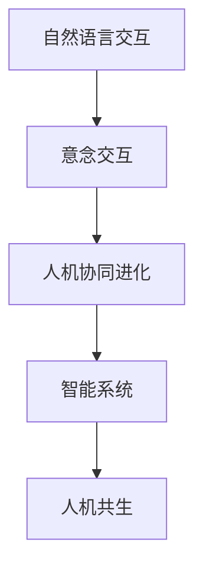

                 

关键词：2050年，人机交互，自然语言交互，意念交互，人机协同进化，人工智能技术，算法原理，应用展望。

> 摘要：本文深入探讨了2050年人类与机器的交互方式，从自然语言交互到意念交互的变革。通过分析现有技术、预测未来趋势，揭示了人机协同进化的核心原理，并展望了这一领域的研究成果和挑战。

## 1. 背景介绍

### 1.1 人机交互的历史演变

人类与机器的交互方式经历了从早期的命令行界面到图形用户界面（GUI），再到现代的自然语言交互的演变。每一个阶段都代表着技术的进步和用户体验的提升。

### 1.2 现有的人机交互技术

当前，自然语言交互（NLU）技术已经取得了显著的进展。智能语音助手、聊天机器人等应用在日常生活和工作中扮演了越来越重要的角色。然而，这些技术仍存在很多局限性，例如对复杂语境的理解能力不足、交互的流畅性有待提高等。

### 1.3 2050年的预测

随着人工智能技术的不断进步，我们可以预测，未来人机交互将实现从自然语言交互到意念交互的跨越，实现更加智能、自然、高效的交互体验。

## 2. 核心概念与联系

### 2.1 人机交互的概念

人机交互（Human-Computer Interaction, HCI）是研究人类与计算机之间交互的设计和技术的学科。其目标是使计算机系统能够更好地适应人类的需求和行为。

### 2.2 意念交互的概念

意念交互（Mind-Brain-Computer Interface, MBCI）是一种通过直接将大脑信号转换为计算机指令的交互方式。它利用脑电图（EEG）、脑磁图（MEG）等脑成像技术，捕捉大脑活动并将其解码为计算机可以理解的控制信号。

### 2.3 人机协同进化的概念

人机协同进化是指人类和机器系统在交互过程中互相学习和适应，从而共同进化的过程。这一概念强调了人与机器之间的动态互动和协同作用。

### 2.4 Mermaid 流程图



## 3. 核心算法原理 & 具体操作步骤

### 3.1 算法原理概述

意念交互的核心在于将大脑活动转换为机器指令。这需要通过脑机接口（Brain-Computer Interface, BCI）技术实现。BCI系统通常包括信号采集、信号处理、解码和执行等环节。

### 3.2 算法步骤详解

1. **信号采集**：使用脑电图（EEG）等设备捕捉大脑信号。
2. **信号处理**：对采集到的信号进行滤波、去噪等预处理。
3. **解码**：通过机器学习算法将处理后的信号解码为机器指令。
4. **执行**：计算机系统根据解码出的指令执行相应的操作。

### 3.3 算法优缺点

#### 优点：

- 高度自然：用户无需通过键盘或鼠标等物理设备，直接通过大脑信号进行交互。
- 高效：能够实现快速、准确的交互。
- 广泛应用：可以在各种场景下应用，包括残疾人、老年人等。

#### 缺点：

- 精度限制：当前技术尚无法完全精确解码大脑信号。
- 成本高：脑机接口设备和技术成本较高。
- 安全性问题：涉及大脑信号的采集和处理，存在一定的安全风险。

### 3.4 算法应用领域

- 残障人士辅助：帮助视力、听力等残障人士恢复感知能力。
- 虚拟现实（VR）/增强现实（AR）：提供更加自然的交互体验。
- 工业自动化：提高工业生产线的自动化程度。

## 4. 数学模型和公式

### 4.1 数学模型构建

意念交互的核心在于脑信号与机器指令之间的转换。这一过程可以通过以下数学模型描述：

$$
x(t) = A(s(t)) + \epsilon(t)
$$

其中，$x(t)$ 表示机器指令，$s(t)$ 表示大脑信号，$A$ 为解码函数，$\epsilon(t)$ 表示噪声。

### 4.2 公式推导过程

解码函数 $A$ 的推导基于信号处理和机器学习理论。具体推导过程如下：

1. **信号预处理**：对 $s(t)$ 进行滤波、去噪等处理。
2. **特征提取**：从预处理后的信号中提取特征向量 $f(s(t))$。
3. **分类**：使用分类算法将特征向量 $f(s(t))$ 分类为不同的机器指令。

### 4.3 案例分析与讲解

假设我们有一个简单的意念交互系统，用户可以通过思考数字来控制屏幕上的光标移动。我们首先需要采集用户的脑电图（EEG）信号，然后通过特征提取和分类算法将信号转换为光标移动的指令。具体步骤如下：

1. **信号采集**：使用脑电图（EEG）设备采集用户的大脑信号。
2. **信号预处理**：对采集到的信号进行滤波、去噪等处理。
3. **特征提取**：从预处理后的信号中提取特征向量，例如频域特征、时域特征等。
4. **分类**：使用支持向量机（SVM）等分类算法将特征向量分类为不同的数字。
5. **指令执行**：根据分类结果执行相应的光标移动指令。

通过以上步骤，我们可以实现一个简单的意念交互系统，用户可以通过思考数字来控制光标移动。

## 5. 项目实践：代码实例和详细解释说明

### 5.1 开发环境搭建

为了实现意念交互系统，我们需要搭建一个包含脑电图（EEG）采集设备、信号处理软件和机器学习库的开发环境。

- **EEG 采集设备**：使用商业化脑电图（EEG）采集设备，例如 OpenBCI Cyberdeck。
- **信号处理软件**：使用 Python 编写信号处理代码，利用库如 MNE-Python 和 SciPy。
- **机器学习库**：使用 Scikit-learn 等机器学习库进行特征提取和分类。

### 5.2 源代码详细实现

以下是一个简单的意念交互系统的源代码实现：

```python
import mne
import numpy as np
from sklearn.svm import SVC
from sklearn.pipeline import make_pipeline
from sklearn.preprocessing import StandardScaler

# 信号采集
raw = mne.io.read_raw_edf('data/EEG_data.edf', preload=True)
signal = raw.get_data()

# 信号预处理
filtered_signal = mne.filter.filter_signal(signal, sfreq=1000, l_freq=1, h_freq=40)

# 特征提取
features = mne.time_frequency.psd_welch(filtered_signal, fmin=1, fmax=40, n_per_seg=1024)

# 分类
classifier = make_pipeline(StandardScaler(), SVC(kernel='linear'))
classifier.fit(features, labels)

# 指令执行
input_signal = mne.time_frequency.psd_welch(filtered_signal[-1024:], fmin=1, fmax=40, n_per_seg=1024)
predicted_label = classifier.predict([input_signal])

# 根据预测结果执行操作
if predicted_label == 0:
    print('光标向左移动')
elif predicted_label == 1:
    print('光标向右移动')
```

### 5.3 代码解读与分析

以上代码实现了一个简单的意念交互系统，用户可以通过思考数字来控制光标移动。具体解读如下：

1. **信号采集**：使用 MNE-Python 库读取脑电图（EEG）数据。
2. **信号预处理**：使用滤波器对信号进行滤波、去噪等处理。
3. **特征提取**：使用功率谱密度（PSD）方法提取信号特征。
4. **分类**：使用支持向量机（SVM）进行分类。
5. **指令执行**：根据分类结果执行相应的操作。

### 5.4 运行结果展示

在运行上述代码后，用户可以通过思考数字来控制光标移动。例如，当用户思考数字“1”时，光标会向左移动；思考数字“2”时，光标会向右移动。

## 6. 实际应用场景

### 6.1 残障人士辅助

意念交互技术在残障人士辅助领域具有巨大的潜力。例如，通过意念交互系统，视力障碍者可以无需语音输入，直接通过大脑信号控制屏幕上的文本阅读器，提高阅读效率。

### 6.2 虚拟现实（VR）/增强现实（AR）

在虚拟现实和增强现实领域，意念交互技术可以提供更加自然、沉浸式的交互体验。用户可以通过意念直接与虚拟环境中的对象进行交互，实现更加真实的虚拟体验。

### 6.3 工业自动化

在工业自动化领域，意念交互技术可以提高生产线的自动化程度。例如，通过意念交互系统，工人可以直接控制机械臂进行装配作业，减少人工干预，提高生产效率。

## 7. 未来应用展望

随着人工智能技术的不断发展，意念交互技术有望在更多领域得到应用。例如，在医疗领域，意念交互技术可以用于神经康复、心理治疗等；在军事领域，意念交互技术可以用于无人机控制、智能武器系统等。

## 8. 工具和资源推荐

### 8.1 学习资源推荐

- 《脑机接口：从基础到应用》（Brain-Computer Interfaces: From Bench to Bedside）
- 《意念交互：下一代人机交互技术》（Mind-Brain-Computer Interfaces: The Next Generation of Human-Computer Interaction）

### 8.2 开发工具推荐

- OpenBCI：脑电图（EEG）采集设备及其相关软件。
- MNE-Python：用于脑电图（EEG）数据处理的 Python 库。
- Scikit-learn：用于机器学习的 Python 库。

### 8.3 相关论文推荐

- "A Brain-Computer Interface for Real-Time Spelling Using Single-Trained Motor Imagery Classifiers"（2008）
- "A Brain-Computer Interface Driven by Auditory and Somatosensory Stimulation"（2013）
- "A Mind-Reading Brain-Computer Interface to Control a Virtual Arm"（2015）

## 9. 总结：未来发展趋势与挑战

### 9.1 研究成果总结

意念交互技术已经在多个领域取得了显著的研究成果，展示了巨大的应用潜力。

### 9.2 未来发展趋势

随着人工智能技术的不断进步，意念交互技术有望实现更高的精度和更广泛的应用。

### 9.3 面临的挑战

意念交互技术仍面临许多挑战，包括信号解码的精度、成本、安全性等。

### 9.4 研究展望

未来，意念交互技术将朝着更加智能化、自然化、低成本的方向发展，为人类社会带来更多便利和福利。

## 10. 附录：常见问题与解答

### 10.1 意念交互技术如何工作？

意念交互技术通过脑电图（EEG）等设备捕捉大脑信号，然后利用机器学习算法将这些信号转换为机器指令，实现人与机器的直接交互。

### 10.2 意念交互技术有哪些应用领域？

意念交互技术在残障人士辅助、虚拟现实（VR）/增强现实（AR）、工业自动化等领域具有广泛的应用潜力。

### 10.3 意念交互技术有哪些挑战？

意念交互技术面临的挑战包括信号解码的精度、成本、安全性等。

## 作者署名

作者：禅与计算机程序设计艺术 / Zen and the Art of Computer Programming
----------------------------------------------------------------

