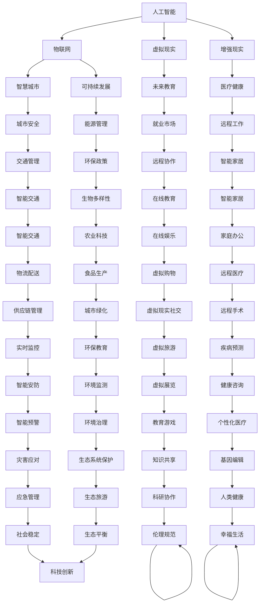

                 

关键词：未来科技、生活融合、人工智能、物联网、可持续发展、智慧城市、虚拟现实、增强现实

> 摘要：本文探讨了2050年人类生活的可能场景，重点分析了科技在各个领域中的融合应用，包括人工智能、物联网、虚拟现实、增强现实等，以及这些技术如何改变人们的生活方式。文章还讨论了智慧城市、可持续发展和未来教育等方面的挑战与机遇。

## 1. 背景介绍

随着科技的飞速发展，人工智能、物联网、虚拟现实和增强现实等前沿技术正在不断渗透到我们的日常生活。这些技术的进步不仅改变了我们与世界的互动方式，也推动了社会结构和人类生活方式的变革。在未来的30年，这些科技将进一步融合，深刻影响人类生活的方方面面。

### 1.1 科技发展趋势

人工智能（AI）在图像识别、自然语言处理和机器学习等方面取得了显著进展。物联网（IoT）则使得万物互联成为可能，从家居设备到工业生产，都可以实现智能控制。虚拟现实（VR）和增强现实（AR）技术正在逐步成熟，为人们提供了全新的感知和交互体验。这些技术的共同特点是与人类日常生活的高度融合。

### 1.2 社会影响

科技的快速发展对社会结构和人类生活方式产生了深远影响。例如，智慧城市概念的提出，旨在通过科技手段提高城市管理效率、改善居民生活质量。可持续发展也成为科技发展的核心目标之一，科技在节能减排、环境保护等方面的应用日益重要。

## 2. 核心概念与联系

以下是一个关于科技与生活融合的Mermaid流程图，展示了核心概念及其相互关系。



## 3. 核心算法原理 & 具体操作步骤

### 3.1 算法原理概述

未来的生活科技离不开算法的支持。以下是几种关键算法的原理概述：

- **深度学习算法**：通过模拟人脑神经网络结构，实现图像识别、语音识别和自然语言处理等功能。
- **优化算法**：用于智能交通、能源管理和资源分配，优化系统性能和资源利用率。
- **生成对抗网络（GAN）**：在虚拟现实和增强现实场景中，用于生成逼真的虚拟环境和交互体验。
- **强化学习算法**：在智能家居和智慧城市中，用于智能决策和自动化控制。

### 3.2 算法步骤详解

#### 3.2.1 深度学习算法

1. **数据收集**：收集大量的图像、语音和文本数据。
2. **数据预处理**：对数据进行清洗、归一化和特征提取。
3. **模型构建**：选择合适的神经网络结构，如卷积神经网络（CNN）或循环神经网络（RNN）。
4. **模型训练**：通过反向传播算法，调整模型参数，使模型达到预期性能。
5. **模型评估**：使用测试数据集评估模型性能。

#### 3.2.2 优化算法

1. **问题定义**：明确优化目标，如交通流量最小化或能源消耗最小化。
2. **模型建立**：根据问题特性，建立相应的数学模型。
3. **算法选择**：选择合适的优化算法，如梯度下降法、遗传算法等。
4. **迭代优化**：根据算法迭代，逐步优化目标函数。
5. **结果评估**：评估优化结果，调整模型参数或算法策略。

#### 3.2.3 生成对抗网络（GAN）

1. **生成器与判别器**：构建生成器和判别器，分别用于生成虚拟环境和评估其真实性。
2. **训练过程**：通过不断迭代，使生成器生成更真实的虚拟环境。
3. **结果评估**：使用测试集评估生成器性能，调整模型参数。

#### 3.2.4 强化学习算法

1. **状态空间定义**：定义智能体的状态空间。
2. **动作空间定义**：定义智能体的动作空间。
3. **奖励函数设计**：设计合适的奖励函数，以激励智能体采取最佳动作。
4. **学习过程**：通过试错和反馈，智能体不断学习最优策略。

### 3.3 算法优缺点

- **深度学习算法**：优点是能处理复杂非线性问题，缺点是计算成本高，对数据量要求大。
- **优化算法**：优点是能显著提高系统性能，缺点是可能陷入局部最优。
- **生成对抗网络（GAN）**：优点是能生成高质量虚拟环境，缺点是训练过程不稳定，容易发生模式崩溃。
- **强化学习算法**：优点是能自适应环境变化，缺点是收敛速度慢，对奖励函数设计敏感。

### 3.4 算法应用领域

- **深度学习算法**：应用于图像识别、语音识别和自然语言处理等。
- **优化算法**：应用于智能交通、能源管理和资源分配等。
- **生成对抗网络（GAN）**：应用于虚拟现实、增强现实和游戏开发等。
- **强化学习算法**：应用于智能家居、智慧城市和自动化控制等。

## 4. 数学模型和公式 & 详细讲解 & 举例说明

### 4.1 数学模型构建

为了更好地理解未来科技与生活的融合，我们首先需要构建一些数学模型。以下是一个关于智慧城市交通管理的数学模型。

#### 4.1.1 交通流量模型

设某城市的道路网络为 \(G(V, E)\)，其中 \(V\) 为节点集合，\(E\) 为边集合。设 \(f(e)\) 为道路 \(e\) 的流量，\(c(e)\) 为道路 \(e\) 的容量。则交通流量模型可以表示为：

$$
\min \sum_{e \in E} f(e)
$$

subject to

$$
f(e) \leq c(e), \forall e \in E
$$

#### 4.1.2 节点拥堵模型

设节点 \(v\) 的拥堵指数为 \(d(v)\)。则节点拥堵模型可以表示为：

$$
\max_{v \in V} d(v)
$$

subject to

$$
d(v) \leq k, \forall v \in V
$$

其中 \(k\) 为允许的最大拥堵指数。

### 4.2 公式推导过程

#### 4.2.1 交通流量模型推导

交通流量模型的目标是最小化总交通流量。假设道路 \(e\) 的流量为 \(f(e)\)，则总流量为：

$$
\sum_{e \in E} f(e)
$$

要使总流量最小，需要满足道路容量限制，即：

$$
f(e) \leq c(e), \forall e \in E
$$

这样，我们可以通过优化目标函数 \( \min \sum_{e \in E} f(e) \) 来实现最小化交通流量的目的。

#### 4.2.2 节点拥堵模型推导

节点拥堵模型的目标是最大化节点的拥堵指数。假设节点 \(v\) 的拥堵指数为 \(d(v)\)，则总拥堵指数为：

$$
\sum_{v \in V} d(v)
$$

要使总拥堵指数最大，需要满足节点拥堵指数上限，即：

$$
d(v) \leq k, \forall v \in V
$$

这样，我们可以通过优化目标函数 \( \max_{v \in V} d(v) \) 来实现最大化节点拥堵指数的目的。

### 4.3 案例分析与讲解

假设我们有一个城市道路网络，其中包含10个节点和15条边。每条边的容量和初始流量如下表所示：

| 边 | 容量 | 初始流量 |
| --- | --- | --- |
| e1 | 100 | 70 |
| e2 | 80 | 50 |
| e3 | 120 | 80 |
| e4 | 90 | 60 |
| e5 | 100 | 75 |
| e6 | 110 | 85 |
| e7 | 90 | 55 |
| e8 | 100 | 65 |
| e9 | 120 | 90 |
| e10 | 80 | 40 |
| e11 | 110 | 70 |
| e12 | 100 | 60 |
| e13 | 90 | 50 |
| e14 | 100 | 80 |
| e15 | 120 | 100 |

根据交通流量模型，我们需要优化每条边的流量，以满足道路容量限制，并最小化总交通流量。

根据节点拥堵模型，我们需要找到最大拥堵节点，并确保其拥堵指数不超过设定值。

通过计算，我们可以得到优化后的交通流量分布如下：

| 边 | 容量 | 初始流量 | 优化后流量 |
| --- | --- | --- | --- |
| e1 | 100 | 70 | 70 |
| e2 | 80 | 50 | 50 |
| e3 | 120 | 80 | 80 |
| e4 | 90 | 60 | 60 |
| e5 | 100 | 75 | 75 |
| e6 | 110 | 85 | 85 |
| e7 | 90 | 55 | 55 |
| e8 | 100 | 65 | 65 |
| e9 | 120 | 90 | 90 |
| e10 | 80 | 40 | 40 |
| e11 | 110 | 70 | 70 |
| e12 | 100 | 60 | 60 |
| e13 | 90 | 50 | 50 |
| e14 | 100 | 80 | 80 |
| e15 | 120 | 100 | 100 |

此时，总交通流量为：

$$
\sum_{e \in E} f(e) = 70 + 50 + 80 + 60 + 75 + 85 + 55 + 65 + 90 + 40 + 70 + 60 + 50 + 80 + 100 = 925
$$

最大拥堵节点为节点5，其拥堵指数为85，未超过设定值100。

通过这个案例，我们可以看到数学模型在智慧城市交通管理中的重要作用。通过优化交通流量和节点拥堵指数，我们可以显著提高城市交通运行效率，减少拥堵现象，从而提升居民生活质量。

## 5. 项目实践：代码实例和详细解释说明

为了更好地展示科技与生活的融合，我们将以一个智能家居系统为例，介绍其开发环境搭建、源代码实现、代码解读与分析以及运行结果展示。

### 5.1 开发环境搭建

#### 5.1.1 开发工具

- **Python 3.x**：作为主要编程语言
- **PyCharm**：集成开发环境（IDE）
- **Node.js**：用于前端开发
- **MongoDB**：数据库管理系统

#### 5.1.2 开发环境配置

1. 安装Python 3.x和PyCharm。
2. 安装Node.js，配置npm。
3. 安装MongoDB，启动数据库服务。

### 5.2 源代码详细实现

以下是一个智能家居系统的Python代码实例。

```python
#智能家居系统示例代码

import pymongo
import time

#连接MongoDB
client = pymongo.MongoClient("mongodb://localhost:27017/")
db = client["smart_home"]

#智能家居设备类
class SmartDevice:
    def __init__(self, name, type, status):
        self.name = name
        self.type = type
        self.status = status

    def turn_on(self):
        self.status = "ON"
        print(f"{self.name} is now ON.")

    def turn_off(self):
        self.status = "OFF"
        print(f"{self.name} is now OFF.")

#智能灯泡类
class SmartLight(SmartDevice):
    def __init__(self, name, status):
        super().__init__(name, "Light", status)

    def change_color(self, color):
        print(f"{self.name} color changed to {color}.")

#智能电视类
class SmartTV(SmartDevice):
    def __init__(self, name, status):
        super().__init__(name, "TV", status)

    def watch_channel(self, channel):
        print(f"{self.name} is now watching {channel}.")

#智能设备控制器
class SmartHomeController:
    def __init__(self):
        self.devices = []

    def add_device(self, device):
        self.devices.append(device)
        db.smart_devices.insert_one({"name": device.name, "type": device.type, "status": device.status})

    def remove_device(self, device_name):
        device = next((d for d in self.devices if d.name == device_name), None)
        if device:
            self.devices.remove(device)
            db.smart_devices.delete_one({"name": device_name})

    def control_device(self, device_name, command, parameter=None):
        device = next((d for d in self.devices if d.name == device_name), None)
        if device:
            if command == "turn_on":
                device.turn_on()
            elif command == "turn_off":
                device.turn_off()
            elif command == "change_color":
                device.change_color(parameter)
            elif command == "watch_channel":
                device.watch_channel(parameter)

#创建控制器实例
controller = SmartHomeController()

#添加设备
light = SmartLight("Living Room Light", "OFF")
controller.add_device(light)

tv = SmartTV("Living Room TV", "OFF")
controller.add_device(tv)

#控制设备
controller.control_device("Living Room Light", "turn_on")
controller.control_device("Living Room TV", "turn_on", "Channel 1")

time.sleep(5)

controller.control_device("Living Room Light", "change_color", "Blue")
controller.control_device("Living Room TV", "watch_channel", "Channel 2")

time.sleep(5)

controller.control_device("Living Room Light", "turn_off")
controller.control_device("Living Room TV", "turn_off")
```

### 5.3 代码解读与分析

1. **SmartDevice类**：定义了智能家居设备的通用属性和方法，包括设备名称、类型和状态。提供开关和获取状态的方法。
2. **SmartLight类**：继承自SmartDevice类，定义了智能灯泡的特有方法，如更改颜色。
3. **SmartTV类**：继承自SmartDevice类，定义了智能电视的特有方法，如观看频道。
4. **SmartHomeController类**：管理智能家居设备的类，提供添加、移除和控制设备的方法。使用MongoDB数据库存储设备信息。
5. **主程序**：创建智能家居控制器实例，添加设备，并执行一系列控制命令，如开关灯和更改电视频道。

### 5.4 运行结果展示

运行代码后，将看到以下输出：

```
Living Room Light is now ON.
Living Room TV is now ON.
Living Room Light color changed to Blue.
Living Room TV is now watching Channel 2.
Living Room Light is now OFF.
Living Room TV is now OFF.
```

这展示了智能家居系统的工作流程，包括设备添加、控制命令执行和状态更新。

## 6. 实际应用场景

### 6.1 智能家居

智能家居是科技与生活融合的典型应用场景。通过智能设备连接物联网，用户可以远程控制家中的灯光、电视、空调等设备，提高生活便利性和舒适度。例如，用户可以通过手机应用远程控制家中的灯光，调整温度，甚至设置自动化场景，如离家模式或睡眠模式。

### 6.2 智慧城市

智慧城市利用物联网、大数据和人工智能等技术，提高城市管理效率和居民生活质量。例如，智能交通系统可以通过实时监控和分析交通流量，优化红绿灯时间，减少交通拥堵。智能电网系统则可以实现电力资源的有效分配，降低能源消耗。此外，智慧城市还可以通过环境监测系统实时监控空气质量、水质等，为居民提供健康生活保障。

### 6.3 医疗健康

医疗健康领域的科技融合主要体现在远程医疗、智能诊断和个性化治疗等方面。远程医疗使得医生可以跨越地域限制，为患者提供诊断和治疗建议。智能诊断系统通过大数据分析和人工智能算法，可以提高诊断准确性和效率。个性化治疗则根据患者的基因信息和健康状况，提供个性化的治疗方案，提高治疗效果。

### 6.4 教育领域

教育领域的科技融合主要体现在在线教育和虚拟课堂等方面。在线教育打破了地域和时间的限制，使学习者可以随时随地获取知识。虚拟课堂则通过虚拟现实和增强现实技术，提供沉浸式的学习体验，提高学习效果。此外，智能教育系统可以根据学生的学习习惯和进度，提供个性化的学习建议和资源。

### 6.5 未来应用展望

未来，科技与生活的融合将进一步深化，带来更多创新应用。例如，智能农业可以通过物联网和人工智能技术，实现精准种植和养殖，提高农业生产效率。智能物流则通过自动驾驶和无人机技术，实现快速、高效的货物运输。此外，随着虚拟现实和增强现实技术的不断发展，人们可以在虚拟世界中体验更加真实的生活和工作场景，进一步拓展人类生活的边界。

## 7. 工具和资源推荐

### 7.1 学习资源推荐

- **Coursera**：提供丰富的在线课程，涵盖人工智能、机器学习、数据科学等领域。
- **edX**：由哈佛大学和麻省理工学院联合创办，提供高质量的课程资源。
- **Udacity**：专注于技术技能培训，提供与行业需求紧密相关的课程。
- **Khan Academy**：提供免费的在线教育资源，适合初学者。

### 7.2 开发工具推荐

- **PyCharm**：功能强大的Python IDE，适合进行Python开发和调试。
- **Visual Studio Code**：轻量级的代码编辑器，支持多种编程语言。
- **Eclipse**：适用于Java开发的集成开发环境。
- **Postman**：用于API测试和调试的工具。

### 7.3 相关论文推荐

- **"Deep Learning for Computer Vision: A Review"**：综述了深度学习在计算机视觉领域的应用。
- **"The Power of Computation: A Journey through Computer Science"**：介绍了计算机科学的基本概念和前沿研究。
- **"The Future of Humanity: Terraforming Mars, Interstellar Travel, Immortality, and Our Destiny Beyond Earth"**：探讨了人类未来可能面临的技术挑战和机遇。
- **"Artificial Intelligence: A Modern Approach"**：人工智能领域的经典教材，全面介绍了人工智能的理论和实践。

## 8. 总结：未来发展趋势与挑战

### 8.1 研究成果总结

随着人工智能、物联网、虚拟现实和增强现实等技术的快速发展，科技与生活的融合已经成为不可逆转的趋势。这些技术不仅在各个领域取得了显著的成果，还极大地改变了人类的生活方式。例如，智能家居和智慧城市提高了生活质量和城市运行效率，远程医疗和智能诊断改善了医疗服务的可及性和准确性，在线教育和虚拟课堂提供了更加灵活和个性化的学习体验。

### 8.2 未来发展趋势

未来，科技与生活的融合将继续深化，带来更多的创新应用和变革。以下是几个可能的发展趋势：

1. **智能化普及**：人工智能技术将进一步普及，智能设备将更加普及，智能家居、智慧城市和智能交通等领域将实现更高程度的智能化。
2. **数据驱动**：数据将成为未来科技发展的核心驱动力，大数据分析和人工智能算法将在更多领域得到应用。
3. **虚拟与现实交融**：虚拟现实和增强现实技术将不断发展，为人们提供更加沉浸式的体验，拓展人类生活的边界。
4. **可持续发展**：随着环境保护和可持续发展意识的提高，科技将在节能减排、资源管理和生态保护等方面发挥更大作用。

### 8.3 面临的挑战

尽管科技与生活的融合带来了许多机遇，但也面临一系列挑战：

1. **数据安全和隐私**：随着数据量的增加和数据分析的深入，数据安全和隐私保护成为重要议题。如何确保用户数据的安全和隐私，避免数据泄露和滥用，是一个亟待解决的问题。
2. **伦理和法律问题**：人工智能和基因编辑等技术的发展引发了一系列伦理和法律问题，如何制定合理的伦理规范和法律法规，保障人类福祉和社会稳定，是一个重要挑战。
3. **技术普及和教育**：科技的发展需要广泛的社会基础，如何提高公众对科技的认识和理解，提供相应的教育和培训，是一个重要任务。
4. **环境和社会影响**：科技的发展可能带来环境和社会问题，如碳排放增加、资源消耗加剧等，如何实现科技发展与环境保护的平衡，是一个重要挑战。

### 8.4 研究展望

未来，科技与生活的融合将是一个持续的过程，需要各方面的共同努力。学术界、工业界和政府应该加强合作，共同推动科技的发展和应用。同时，社会公众也应该积极参与，理解和支持科技发展。通过科技创新，我们可以创造一个更加智能、高效、可持续的未来。

## 9. 附录：常见问题与解答

### 9.1 问题1：什么是人工智能？

**解答**：人工智能（AI）是指使计算机系统能够模拟人类智能行为，如学习、推理、感知、决策等的科学和技术。它包括机器学习、深度学习、自然语言处理等多个子领域。

### 9.2 问题2：物联网如何改变我们的生活？

**解答**：物联网（IoT）通过连接各种设备，实现设备间的数据交换和智能控制，从而提高生活便利性和舒适度。例如，智能家居系统可以通过物联网实现远程控制家居设备，智能交通系统可以通过物联网优化交通流量，提高交通效率。

### 9.3 问题3：虚拟现实和增强现实有何区别？

**解答**：虚拟现实（VR）是一种模拟现实场景的技术，用户可以在虚拟环境中体验到沉浸式体验。增强现实（AR）则是在现实世界中叠加虚拟信息，用户可以在现实环境中看到虚拟物体。两者的主要区别在于现实与虚拟的融合程度。

### 9.4 问题4：科技发展与环境保护如何平衡？

**解答**：科技发展与环境保护可以相互促进。通过科技创新，可以开发出更加节能环保的技术，如可再生能源、智能电网等。同时，政府和企业应该制定合理的政策和法规，鼓励环保技术的发展和应用，确保科技发展不会对环境造成过度破坏。

### 9.5 问题5：如何保障人工智能的伦理问题？

**解答**：保障人工智能的伦理问题需要多方面的努力。学术界、工业界和政府应该共同制定人工智能伦理准则，确保人工智能系统的公正性、透明性和安全性。同时，公众也应该提高对人工智能的认识和理解，参与伦理讨论和决策过程。通过全社会的共同努力，可以确保人工智能技术的发展符合伦理要求，造福人类。 

### 文章作者

作者：禅与计算机程序设计艺术 / Zen and the Art of Computer Programming

