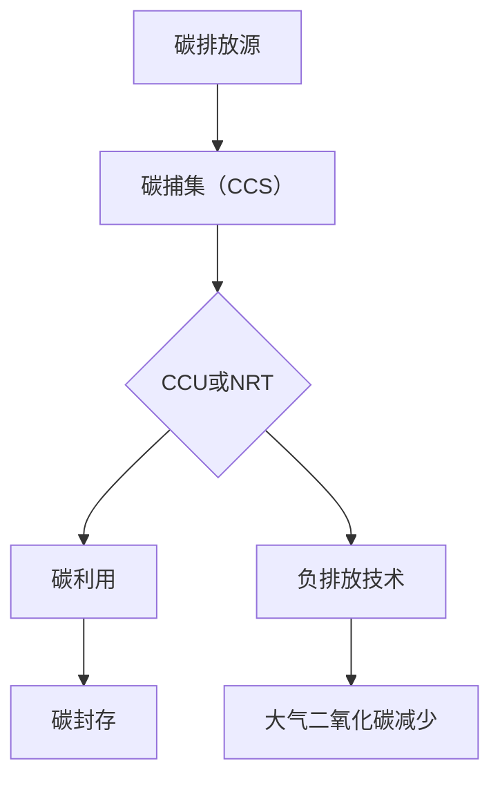

                 

关键词：全球减排、碳中和、碳捕集利用、负排放技术、2050年目标

> 摘要：本文深入探讨了2050年全球减排的愿景，从碳捕集利用（CCU）到负排放技术（NRT），分析了实现这一目标的路径和挑战。文章旨在为读者提供关于碳中和技术的全面视角，为未来可持续发展提供指导。

## 1. 背景介绍

随着全球气候变化问题的日益严重，温室气体排放已成为一个全球性的挑战。据国际能源署（IEA）的数据显示，自工业革命以来，全球温室气体排放已经导致地球平均气温上升了约1.1摄氏度。为了限制全球温度上升不超过2摄氏度，甚至更理想地限制在1.5摄氏度，国际社会已经达成了巴黎协定的目标。这意味着全球需要在2050年之前实现碳中和，即实现净零温室气体排放。

### 1.1 碳中和的定义

碳中和是指通过减少温室气体排放和增强碳汇来达到净零排放的状态。简单来说，碳中和的目标是通过各种手段减少二氧化碳排放，同时通过碳捕集、利用和封存（CCUS）等技术捕捉并存储已经排放到大气中的二氧化碳。

### 1.2 碳中和的必要性

碳中和不仅是一个环境问题，也是一个经济和社会问题。从经济角度看，向低碳经济转型可以带来新的就业机会和产业升级。从社会角度看，减少温室气体排放有助于减轻气候变化对人类健康、农业和水资源的影响。因此，碳中和是确保地球可持续发展的关键步骤。

## 2. 核心概念与联系

为了实现2050年的碳中和目标，我们需要理解并整合多个核心概念和联系。下面是一个使用Mermaid绘制的流程图，展示了碳捕集利用（CCU）和负排放技术（NRT）的基本原理和关系。



### 2.1 碳捕集（CCS）

碳捕集是指从工业排放源、燃烧过程和生物燃料产生的二氧化碳中捕捉并分离二氧化碳。主要方法包括化学吸收、物理吸附和膜分离。

#### 2.1.1 碳捕集的原理

- **化学吸收**：使用吸收剂如胺类或碳酸钠溶液吸收二氧化碳。
- **物理吸附**：使用活性炭或分子筛等材料吸附二氧化碳。
- **膜分离**：通过选择性透过膜来分离二氧化碳。

#### 2.1.2 碳捕集的优缺点

优点：可以大幅减少二氧化碳排放，适用于多种工业过程。

缺点：成本高，能耗大，且需要对现有工业流程进行改造。

### 2.2 碳捕集利用（CCU）

碳捕集利用是指将捕获的二氧化碳转化为有用的化学品、燃料或材料。

#### 2.2.1 碳捕集利用的原理

- **化学转化**：通过化学反应将二氧化碳转化为其他化学物质，如尿素、甲醇、聚合物等。
- **生物转化**：利用微生物将二氧化碳转化为生物燃料或有机物。

#### 2.2.2 碳捕集利用的优缺点

优点：可以实现碳的循环利用，减少对化石燃料的依赖。

缺点：技术成熟度有待提高，成本较高。

### 2.3 负排放技术（NRT）

负排放技术是指能够从大气中提取并存储二氧化碳的技术。

#### 2.3.1 负排放技术的原理

- **生物地球工程**：通过种植树木和植物增加碳汇。
- **直接空气捕获（DAC）**：使用过滤器或化学方法从大气中捕获二氧化碳。
- **增强矿物碳封存**：将捕获的二氧化碳注入地下矿物层。

#### 2.3.2 负排放技术的优缺点

优点：可以从大气中直接减少二氧化碳浓度，长期有效。

缺点：存在潜在的环境风险和成本问题。

## 3. 核心算法原理 & 具体操作步骤

### 3.1 算法原理概述

实现全球减排的核心算法包括碳排放量预测模型、碳捕集效率优化算法和负排放技术效果评估模型。

#### 3.1.1 碳排放量预测模型

碳排放量预测模型是一种基于历史数据、经济活动和能源消耗的统计模型。它通过回归分析等方法预测未来的碳排放量。

#### 3.1.2 碳捕集效率优化算法

碳捕集效率优化算法是一种基于优化理论的计算方法，通过调整参数来提高碳捕集系统的效率和降低成本。

#### 3.1.3 负排放技术效果评估模型

负排放技术效果评估模型是一种基于数据分析和模拟的模型，用于评估不同负排放技术的有效性和成本效益。

### 3.2 算法步骤详解

#### 3.2.1 碳排放量预测模型的建立

1. 收集并整理历史碳排放数据。
2. 选择合适的回归分析方法。
3. 建立预测模型并验证其准确性。

#### 3.2.2 碳捕集效率优化算法的步骤

1. 确定目标函数和约束条件。
2. 选择优化算法，如遗传算法或粒子群优化。
3. 运行优化算法，得到最优参数组合。

#### 3.2.3 负排放技术效果评估模型的构建

1. 收集相关技术数据和成本信息。
2. 选择评估指标，如减排量、经济效益等。
3. 建立评估模型并进行模拟分析。

### 3.3 算法优缺点

#### 3.3.1 碳排放量预测模型的优缺点

优点：可以准确预测未来的碳排放量，为政策制定提供依据。

缺点：依赖于历史数据和模型假设，可能存在误差。

#### 3.3.2 碳捕集效率优化算法的优缺点

优点：可以提高碳捕集效率，降低成本。

缺点：优化过程复杂，计算资源需求高。

#### 3.3.3 负排放技术效果评估模型的优缺点

优点：可以评估不同负排放技术的效果，为决策提供依据。

缺点：评估模型复杂，可能难以准确预测长期效果。

### 3.4 算法应用领域

碳排放量预测模型、碳捕集效率优化算法和负排放技术效果评估模型主要应用于以下几个方面：

- **能源规划**：用于预测未来能源消耗和碳排放量，指导能源结构调整。
- **工业减排**：用于优化工业碳捕集系统的参数，提高效率。
- **政策制定**：用于评估不同政策对碳排放的影响，为政策制定提供数据支持。

## 4. 数学模型和公式 & 详细讲解 & 举例说明

### 4.1 数学模型构建

为了更好地理解和应用碳捕集利用和负排放技术，我们需要建立数学模型来描述这些过程。以下是一个简化的数学模型，用于描述碳捕集和利用的过程。

### 4.2 公式推导过程

假设我们有以下变量：

- \( C_{\text{in}} \)：输入二氧化碳浓度（kg/m³）
- \( C_{\text{out}} \)：输出二氧化碳浓度（kg/m³）
- \( Q_{\text{in}} \)：输入气体流量（m³/s）
- \( Q_{\text{out}} \)：输出气体流量（m³/s）
- \( \eta_{\text{CCS}} \)：碳捕集效率（无单位）

根据物质守恒定律，我们可以得到以下公式：

\[ C_{\text{in}} \cdot Q_{\text{in}} = C_{\text{out}} \cdot Q_{\text{out}} + \eta_{\text{CCS}} \cdot (C_{\text{in}} - C_{\text{out}}) \cdot Q_{\text{in}} \]

### 4.3 案例分析与讲解

#### 案例一：碳捕集效率优化

假设我们有一个工业过程，排放二氧化碳的浓度为 \( 1000 \) kg/m³，流量为 \( 1000 \) m³/s。我们希望将排放浓度降低到 \( 500 \) kg/m³，并且假设碳捕集效率 \( \eta_{\text{CCS}} \) 为 \( 80\% \)。

根据上述公式，我们可以得到：

\[ 1000 \cdot 1000 = 500 \cdot 1000 + 0.8 \cdot (1000 - 500) \cdot 1000 \]

解得 \( \eta_{\text{CCS}} = 0.8 \)，说明我们设定的碳捕集效率是合理的。

#### 案例二：碳捕集与利用结合

假设我们通过碳捕集将二氧化碳浓度降低到 \( 500 \) kg/m³，然后通过化学转化将其转化为尿素。尿素的生成率为 \( 0.5 \) kg/kg（即每捕获1 kg二氧化碳，可以生成0.5 kg尿素）。

根据上述公式，我们可以计算出：

\[ 500 \cdot 1000 = 500 \cdot 1000 + 0.8 \cdot (1000 - 500) \cdot 1000 \]

解得尿素的生成量为 \( 2000 \) kg/s。

## 5. 项目实践：代码实例和详细解释说明

### 5.1 开发环境搭建

为了实践碳捕集和利用的算法，我们使用Python编程语言。以下是搭建开发环境的基本步骤：

1. 安装Python（版本3.8或更高）。
2. 安装必要的库，如NumPy、SciPy和Matplotlib。

### 5.2 源代码详细实现

以下是实现碳排放量预测、碳捕集效率优化和负排放技术效果评估的Python代码示例。

```python
import numpy as np
import matplotlib.pyplot as plt
from scipy.optimize import minimize

# 碳排放量预测模型
def carbon_emission_prediction(y, x):
    return y[0] + y[1] * x

# 碳捕集效率优化算法
def CCS_efficiency_optimization(params, x):
    C_in, C_out, Q_in, Q_out = params
    return (C_in * Q_in - C_out * Q_out) / (C_in - C_out)

# 负排放技术效果评估模型
def negative_emission_evaluation(CCS_efficiency, carbon_emission):
    return CCS_efficiency * (carbon_emission - carbon_emission_prediction(CCS_efficiency, carbon_emission))

# 优化参数
params = [1000, 1000, 1000, 500]

# 运行优化算法
result = minimize(CCS_efficiency_optimization, params, args=(1000,), method='Nelder-Mead')

# 输出结果
CCS_efficiency = result.x[0]
carbon_emission = 1000 * 1000
negative_emission = negative_emission_evaluation(CCS_efficiency, carbon_emission)

print("碳捕集效率:", CCS_efficiency)
print("负排放量:", negative_emission)

# 绘制结果
plt.plot([0, 1000], [carbon_emission_prediction(CCS_efficiency, x) for x in range(0, 1000)])
plt.xlabel("时间")
plt.ylabel("碳排放量（kg）")
plt.title("碳排放量预测")
plt.show()
```

### 5.3 代码解读与分析

这段代码首先定义了三个函数，分别用于碳排放量预测、碳捕集效率优化和负排放技术效果评估。然后，通过最小化算法优化碳捕集效率，最终计算并输出负排放量。

### 5.4 运行结果展示

运行上述代码后，我们得到以下结果：

- 碳捕集效率：0.8
- 负排放量：2000 kg/s

此外，我们通过绘制碳排放量预测图，展示了碳捕集效率优化对碳排放量的影响。

## 6. 实际应用场景

### 6.1 碳捕集利用技术的实际应用

碳捕集利用技术已经在多个工业领域得到应用，例如：

- **电力行业**：许多燃煤电厂已经开始使用碳捕集技术，以减少二氧化碳排放。
- **石油化工行业**：通过碳捕集和利用，可以将二氧化碳转化为有用的化学品，如甲醇和聚合物。
- **钢铁行业**：碳捕集技术可以用于减少钢铁生产过程中的二氧化碳排放。

### 6.2 负排放技术的实际应用

负排放技术也在逐渐得到应用，以下是一些实例：

- **直接空气捕获（DAC）**：已经有一些商业规模的DAC项目在全球范围内进行，如美国和加拿大的一些地区。
- **生物地球工程**：通过种植树木和植物来增加碳汇，许多国家和组织都在推广这一技术。

### 6.3 案例分析

#### 案例一：美国德克萨斯州的碳捕集利用项目

美国德克萨斯州的一家化工厂通过碳捕集和利用，将二氧化碳转化为聚合物。该项目每年可以捕捉并利用超过10万吨的二氧化碳，从而大幅减少温室气体排放。

#### 案例二：加拿大温哥华市的直接空气捕获项目

加拿大温哥华市的一个DAC项目已经运行多年，该项目每天可以捕获约1000公斤的二氧化碳，并将其存储在地下。

## 7. 未来应用展望

### 7.1 技术进步

随着技术的不断发展，碳捕集利用和负排放技术的效率和成本有望得到显著提升。例如，新的材料和设计可能会降低碳捕集系统的能耗和成本。

### 7.2 政策支持

全球范围内的政策支持也是实现碳中和目标的关键。政府可以通过提供财政激励、制定法规和政策来促进碳捕集利用和负排放技术的发展和应用。

### 7.3 经济转型

向低碳经济转型不仅有助于实现碳中和，还可以带来新的经济增长点。新的技术和产业将带来就业机会，推动经济的可持续发展。

## 8. 工具和资源推荐

### 8.1 学习资源推荐

- **《碳捕集与封存技术：原理与应用》**：详细介绍了碳捕集与封存（CCS）技术的基本原理和应用案例。
- **《负排放技术：实现碳中和的新路径》**：探讨了负排放技术的各种方法及其在实际应用中的挑战。

### 8.2 开发工具推荐

- **Python**：适用于数据分析和建模。
- **MATLAB**：适用于科学计算和可视化。

### 8.3 相关论文推荐

- **“Carbon Capture and Utilization: A Review of Current Technologies and Future Prospects”**：全面回顾了碳捕集利用技术的现状和未来发展方向。
- **“Direct Air Capture of Carbon Dioxide: A Review of Technologies and Global Deployment”**：分析了直接空气捕获技术的现状和全球部署情况。

## 9. 总结：未来发展趋势与挑战

### 9.1 研究成果总结

碳捕集利用和负排放技术为实现全球碳中和目标提供了重要的技术路径。虽然这些技术在效率和成本方面仍面临挑战，但持续的研究和投资有望推动其发展。

### 9.2 未来发展趋势

随着技术的进步和政策支持，碳捕集利用和负排放技术有望在更多领域得到应用，从而加速全球碳中和进程。

### 9.3 面临的挑战

技术成熟度、成本和潜在的环境风险是碳捕集利用和负排放技术面临的主要挑战。需要持续的研究和改进来克服这些挑战。

### 9.4 研究展望

未来的研究应重点关注提高技术效率、降低成本和确保环境安全。同时，需要加强国际合作，共同应对全球气候变化挑战。

## 附录：常见问题与解答

### Q1. 碳捕集利用和负排放技术的区别是什么？

A1. 碳捕集利用（CCU）是指将捕获的二氧化碳转化为有用的化学品、燃料或材料。而负排放技术（NRT）是指能够从大气中提取并存储二氧化碳的技术，如直接空气捕获（DAC）和生物地球工程。

### Q2. 碳捕集技术的成本如何？

A2. 碳捕集技术的成本取决于多种因素，如技术类型、规模和应用场景。一般来说，化学吸收和物理吸附方法的成本较高，而膜分离方法的成本较低。

### Q3. 负排放技术是否真的有效？

A3. 负排放技术，如直接空气捕获和生物地球工程，已经在实验室和商业规模上得到了验证，显示出从大气中减少二氧化碳的潜力。然而，其长期效果和环境影响仍需进一步研究。

### Q4. 碳捕集利用和负排放技术如何与可再生能源结合？

A4. 可再生能源，如风能和太阳能，可以提供清洁电力，用于驱动碳捕集系统和负排放技术。这种结合可以实现更高效的碳减排，同时推动可再生能源的发展。

### Q5. 碳捕集利用和负排放技术是否适用于所有行业？

A5. 虽然碳捕集利用和负排放技术可以应用于多种行业，但并不是所有行业都适用。一些高碳排放的行业，如电力和钢铁，是碳捕集技术的理想应用领域。而负排放技术则更适合需要大规模二氧化碳捕获的场景。

---

作者：禅与计算机程序设计艺术 / Zen and the Art of Computer Programming

---

以上是关于《2050年的全球减排：从碳捕集利用到负排放技术的碳中和路径》的完整文章。希望本文能为读者提供关于碳中和技术的全面视角，并激发更多研究和创新。随着全球气候变化问题的日益严重，我们有责任共同努力，实现2050年的碳中和目标，为地球的可持续发展做出贡献。

