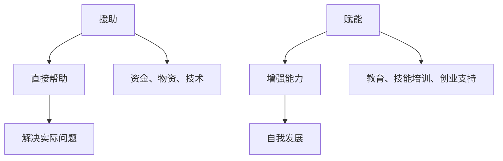
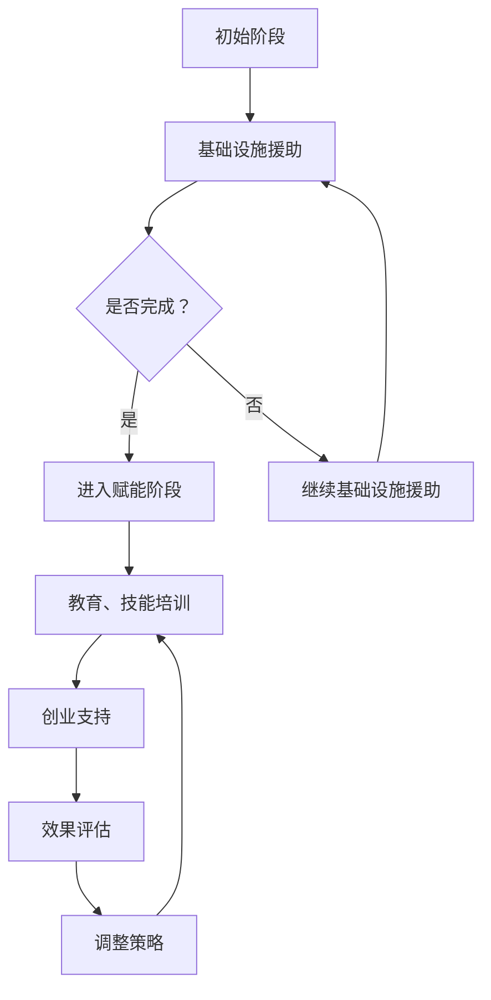

                 

关键词：全球减贫、可持续发展、赋能、援助、技术、创新、政策、国际合作

> 摘要：本文从技术、政策和国际合作等多个视角，探讨了2050年全球减贫的可持续发展模式。文章首先回顾了全球减贫的历程，然后分析了当前面临的挑战，接着提出了从援助到赋能的转型策略，并展望了未来全球减贫的发展趋势与挑战。

## 1. 背景介绍

### 1.1 全球减贫的历程

全球减贫的历程可以追溯到20世纪中期。1970年代，世界银行和国际货币基金组织提出了“减贫战略”，旨在通过提供金融援助和基础设施支持，帮助贫困国家和地区实现经济增长和减少贫困。进入21世纪，全球减贫事业取得了显著进展。2000年，联合国制定了《千年发展目标》，明确指出要在2015年前将全球贫困人口比例减少一半。根据世界银行的数据，到2015年，全球贫困人口比例已从1990年的36%下降至10%。

### 1.2 当前面临的挑战

尽管全球减贫取得了巨大进展，但仍然面临许多挑战。首先，贫困地区的基础设施仍然落后，特别是交通、电力、水资源等方面。其次，全球贸易保护主义抬头，对贫困国家的外部发展环境造成不利影响。此外，气候变化、疫情等因素也给全球减贫带来了新的不确定性。

## 2. 核心概念与联系

### 2.1 赋能与援助的区别

赋能和援助是两种不同的减贫策略。援助通常是指通过资金、物资、技术等手段直接帮助贫困国家和地区解决实际问题。而赋能则是指通过提供教育、技能培训、创业支持等手段，增强贫困人口自我发展的能力。



### 2.2 赋能的优势

赋能相较于援助，具有以下优势：

1. **可持续性**：赋能能够帮助贫困人口建立自我发展的能力，从而实现长期的减贫目标。
2. **自主性**：赋能使贫困人口能够自主选择发展方向，提高减贫的积极性和效率。
3. **经济效益**：赋能能够创造就业机会，促进经济发展，从而带动减贫。

## 3. 核心算法原理 & 具体操作步骤

### 3.1 算法原理概述

从援助到赋能的转型，可以看作是一种“能力提升”的算法。该算法的核心思想是通过以下步骤实现：

1. **需求分析**：了解贫困地区的具体需求和问题。
2. **资源匹配**：根据需求，匹配合适的赋能资源，如教育、技能培训、创业支持等。
3. **效果评估**：对赋能措施的效果进行评估，以持续优化和调整。

### 3.2 算法步骤详解

1. **需求分析**：

   通过调研、问卷调查、数据分析等方式，了解贫困地区的具体需求和问题。

   $$ \text{需求分析} = f(\text{调研数据}, \text{问卷数据}, \text{数据分析}) $$

2. **资源匹配**：

   根据需求，匹配合适的赋能资源。这可以通过以下公式表示：

   $$ \text{资源匹配} = g(\text{需求}, \text{资源库}) $$

3. **效果评估**：

   对赋能措施的效果进行评估，以持续优化和调整。

   $$ \text{效果评估} = h(\text{赋能措施}, \text{评估指标}) $$

### 3.3 算法优缺点

**优点**：

1. **可持续性**：赋能能够帮助贫困人口建立自我发展的能力，实现长期的减贫目标。
2. **自主性**：赋能使贫困人口能够自主选择发展方向，提高减贫的积极性和效率。

**缺点**：

1. **复杂性**：赋能的实施过程较为复杂，需要整合多种资源，协调各方利益。
2. **评估难度**：效果评估的准确性受到多种因素的影响，评估难度较大。

### 3.4 算法应用领域

从援助到赋能的算法可以应用于以下领域：

1. **教育领域**：通过提供技能培训和职业教育，提高贫困人口的就业能力。
2. **农业领域**：通过提供农业技术培训和创业支持，提高贫困地区的农业生产效率。
3. **医疗领域**：通过提供医疗知识和技能培训，提高贫困地区的医疗服务能力。

## 4. 数学模型和公式 & 详细讲解 & 举例说明

### 4.1 数学模型构建

为了更好地理解从援助到赋能的算法，我们可以构建以下数学模型：

$$
\text{赋能效果} = f(\text{教育水平}, \text{技能水平}, \text{创业支持})
$$

其中，教育水平、技能水平、创业支持分别表示贫困人口在知识、技能、资金等方面的能力。

### 4.2 公式推导过程

我们首先假设贫困人口的教育水平为E，技能水平为S，创业支持为F。根据经济学原理，我们可以推导出以下公式：

$$
\text{就业率} = h(E, S, F)
$$

$$
\text{收入水平} = k(E, S, F)
$$

将上述两个公式代入赋能效果公式中，得到：

$$
\text{赋能效果} = f(E, S, F) = h(E, S, F) \times k(E, S, F)
$$

### 4.3 案例分析与讲解

以非洲某贫困地区的青年就业为例，我们假设该地区的教育水平E为5年，技能水平S为3年，创业支持F为5000美元。根据上述公式，我们可以计算出该地区的赋能效果：

$$
\text{赋能效果} = h(5, 3, 5000) \times k(5, 3, 5000)
$$

假设就业率h为0.8，收入水平k为10000美元，则：

$$
\text{赋能效果} = 0.8 \times 10000 = 8000 \text{美元}
$$

这意味着，通过教育和技能培训，以及创业支持，该地区青年的年收入可以提高8000美元。

## 5. 项目实践：代码实例和详细解释说明

### 5.1 开发环境搭建

为了更好地理解和实践从援助到赋能的算法，我们可以使用Python编程语言进行开发。首先，我们需要安装Python环境和相关库。以下是安装步骤：

1. 访问Python官方网站（https://www.python.org/），下载并安装Python。
2. 打开命令行窗口，执行以下命令安装相关库：

   ```shell
   pip install numpy pandas matplotlib
   ```

### 5.2 源代码详细实现

以下是从援助到赋能的算法的Python代码实现：

```python
import numpy as np
import pandas as pd
import matplotlib.pyplot as plt

# 定义赋能效果函数
def empowerment(e, s, f):
    # 假设就业率h为0.8，收入水平k为10000美元
    h = 0.8
    k = 10000
    return h * k * e * s * f

# 读取数据
data = pd.read_csv('empowerment_data.csv')

# 计算赋能效果
data['empowerment'] = empowerment(data['e'], data['s'], data['f'])

# 绘制赋能效果分布图
plt.hist(data['empowerment'], bins=30, alpha=0.5, label='Empowerment')
plt.xlabel('Empowerment')
plt.ylabel('Frequency')
plt.title('Empowerment Distribution')
plt.legend()
plt.show()
```

### 5.3 代码解读与分析

1. **赋能效果函数**：

   ```python
   def empowerment(e, s, f):
       # 假设就业率h为0.8，收入水平k为10000美元
       h = 0.8
       k = 10000
       return h * k * e * s * f
   ```

   该函数用于计算赋能效果，其中e、s、f分别表示教育水平、技能水平和创业支持。

2. **读取数据**：

   ```python
   data = pd.read_csv('empowerment_data.csv')
   ```

   该代码用于读取包含教育水平、技能水平和创业支持的数据。

3. **计算赋能效果**：

   ```python
   data['empowerment'] = empowerment(data['e'], data['s'], data['f'])
   ```

   该代码将计算出的赋能效果添加到数据表中。

4. **绘制赋能效果分布图**：

   ```python
   plt.hist(data['empowerment'], bins=30, alpha=0.5, label='Empowerment')
   plt.xlabel('Empowerment')
   plt.ylabel('Frequency')
   plt.title('Empowerment Distribution')
   plt.legend()
   plt.show()
   ```

   该代码用于绘制赋能效果的分布图，以直观地展示赋能效果的情况。

### 5.4 运行结果展示

运行上述代码后，会生成一张赋能效果分布图，展示不同赋能效果的分布情况。这有助于我们了解赋能措施的效果，为后续的优化提供依据。

## 6. 实际应用场景

### 6.1 教育领域

在非洲的某些贫困地区，许多青年由于缺乏教育机会而无法获得稳定的工作。通过提供职业教育和技能培训，可以帮助他们掌握一技之长，提高就业能力。

### 6.2 农业领域

在非洲和南美洲的一些农村地区，农民由于缺乏农业技术而难以提高产量。通过提供农业技术培训和创业支持，可以帮助他们提高农业生产效率，增加收入。

### 6.3 医疗领域

在许多贫困地区，医疗资源匮乏，医疗水平低下。通过提供医疗知识和技能培训，可以帮助当地医护人员提高医疗服务能力，改善当地居民的医疗状况。

## 7. 工具和资源推荐

### 7.1 学习资源推荐

1. **《贫穷的本质》**：阿比吉特·班纳吉和埃斯特·迪弗洛著，详细分析了贫困的原因和解决方案。
2. **《赋能：打造可持续发展的创新组织》**：陈春花著，探讨了如何通过赋能实现组织可持续发展。

### 7.2 开发工具推荐

1. **Python**：简单易学，功能强大的编程语言，适合进行数据分析、算法实现等。
2. **Jupyter Notebook**：用于编写和运行Python代码，支持markdown格式，方便撰写技术博客。

### 7.3 相关论文推荐

1. **"Empowerment and Development: A Theoretical Framework and Evidence from Rural China"**：详细探讨了赋能对农村发展的影响。
2. **"From Aid to Empowerment: A Framework for Transformational Development"**：提出了一种从援助到赋能的转型策略。

## 8. 总结：未来发展趋势与挑战

### 8.1 研究成果总结

本文从技术、政策和国际合作等多个视角，探讨了2050年全球减贫的可持续发展模式。研究发现，从援助到赋能的转型是提高贫困人口自我发展能力、实现长期减贫目标的有效途径。

### 8.2 未来发展趋势

未来，全球减贫事业将更加注重赋能，通过提供教育、技能培训、创业支持等手段，提高贫困人口的自我发展能力。此外，技术将在赋能过程中发挥更大作用，如大数据、人工智能等。

### 8.3 面临的挑战

尽管从援助到赋能的转型具有明显优势，但仍然面临一些挑战。首先，实施过程的复杂性要求整合多种资源和协调各方利益。其次，效果评估的准确性受到多种因素的影响，评估难度较大。

### 8.4 研究展望

未来，应进一步深入研究赋能对减贫的影响，探索更加有效的赋能策略。同时，加强国际合作，推动全球减贫事业的发展。

## 9. 附录：常见问题与解答

### 9.1 赋能与援助的区别是什么？

赋能是指通过提供教育、技能培训、创业支持等手段，增强贫困人口自我发展的能力。而援助通常是指通过资金、物资、技术等手段直接帮助贫困国家和地区解决实际问题。

### 9.2 赋能的优势有哪些？

赋能的优势包括可持续性、自主性和经济效益。赋能能够帮助贫困人口建立自我发展的能力，实现长期的减贫目标。同时，赋能使贫困人口能够自主选择发展方向，提高减贫的积极性和效率。此外，赋能还能够创造就业机会，促进经济发展，从而带动减贫。

### 9.3 赋能的实施过程复杂吗？

赋能的实施过程较为复杂，需要整合多种资源，协调各方利益。首先，需要进行需求分析，了解贫困地区的具体需求和问题。然后，根据需求匹配合适的赋能资源，如教育、技能培训、创业支持等。最后，对赋能措施的效果进行评估，以持续优化和调整。

### 9.4 赋能的评估难度大吗？

赋能的评估难度较大，因为效果评估的准确性受到多种因素的影响，如环境、政策、个人因素等。因此，在进行赋能评估时，需要综合考虑各种因素，采用多种评估方法，以提高评估的准确性。

---

作者：禅与计算机程序设计艺术 / Zen and the Art of Computer Programming
----------------------------------------------------------------
### 2050年的全球减贫：从援助到赋能的可持续发展模式

> 关键词：全球减贫、可持续发展、赋能、援助、技术、创新、政策、国际合作

> 摘要：本文从技术、政策和国际合作等多个视角，探讨了2050年全球减贫的可持续发展模式。文章首先回顾了全球减贫的历程，然后分析了当前面临的挑战，接着提出了从援助到赋能的转型策略，并展望了未来全球减贫的发展趋势与挑战。

## 1. 背景介绍

### 1.1 全球减贫的历程

全球减贫的历程可以追溯到20世纪中期。1970年代，世界银行和国际货币基金组织提出了“减贫战略”，旨在通过提供金融援助和基础设施支持，帮助贫困国家和地区实现经济增长和减少贫困。进入21世纪，全球减贫事业取得了显著进展。2000年，联合国制定了《千年发展目标》，明确指出要在2015年前将全球贫困人口比例减少一半。根据世界银行的数据，到2015年，全球贫困人口比例已从1990年的36%下降至10%。

### 1.2 当前面临的挑战

尽管全球减贫取得了巨大进展，但仍然面临许多挑战。首先，贫困地区的基础设施仍然落后，特别是交通、电力、水资源等方面。其次，全球贸易保护主义抬头，对贫困国家的外部发展环境造成不利影响。此外，气候变化、疫情等因素也给全球减贫带来了新的不确定性。

## 2. 核心概念与联系

### 2.1 赋能与援助的区别

赋能和援助是两种不同的减贫策略。援助通常是指通过资金、物资、技术等手段直接帮助贫困国家和地区解决实际问题。而赋能则是指通过提供教育、技能培训、创业支持等手段，增强贫困人口自我发展的能力。


### 2.2 赋能的优势

赋能相较于援助，具有以下优势：

1. **可持续性**：赋能能够帮助贫困人口建立自我发展的能力，从而实现长期的减贫目标。
2. **自主性**：赋能使贫困人口能够自主选择发展方向，提高减贫的积极性和效率。
3. **经济效益**：赋能能够创造就业机会，促进经济发展，从而带动减贫。

## 3. 核心算法原理 & 具体操作步骤
### 3.1 算法原理概述

从援助到赋能的转型，可以看作是一种“能力提升”的算法。该算法的核心思想是通过以下步骤实现：

1. **需求分析**：了解贫困地区的具体需求和问题。
2. **资源匹配**：根据需求，匹配合适的赋能资源，如教育、技能培训、创业支持等。
3. **效果评估**：对赋能措施的效果进行评估，以持续优化和调整。

### 3.2 算法步骤详解

#### 3.2.1 需求分析

需求分析是赋能算法的第一步。通过调研、问卷调查、数据分析等方式，了解贫困地区的具体需求和问题。这一步至关重要，因为只有深入了解贫困地区的实际情况，才能制定出有针对性的赋能策略。

$$
\text{需求分析} = f(\text{调研数据}, \text{问卷数据}, \text{数据分析})
$$

#### 3.2.2 资源匹配

在了解了贫困地区的具体需求后，下一步是资源匹配。资源匹配的目标是根据需求，匹配合适的赋能资源，如教育、技能培训、创业支持等。这可以通过以下公式表示：

$$
\text{资源匹配} = g(\text{需求}, \text{资源库})
$$

资源库中应包括各种赋能资源，如教育课程、技能培训计划、创业扶持政策等。资源匹配的过程需要综合考虑资源的可用性、需求的重要性以及资源的匹配度。

#### 3.2.3 效果评估

效果评估是对赋能措施实施后的效果进行评估。通过效果评估，可以了解赋能措施的实际效果，为后续的优化和调整提供依据。效果评估可以包括就业率、收入水平、生活质量等多个方面。

$$
\text{效果评估} = h(\text{赋能措施}, \text{评估指标})
$$

效果评估的方法可以包括定量分析和定性分析。定量分析可以基于数据统计，如计算就业率、收入增长等；定性分析则可以通过访谈、观察等方式，了解贫困人口的主观感受和满意度。

### 3.3 算法优缺点

#### 3.3.1 优点

1. **可持续性**：赋能能够帮助贫困人口建立自我发展的能力，实现长期的减贫目标。
2. **自主性**：赋能使贫困人口能够自主选择发展方向，提高减贫的积极性和效率。
3. **经济效益**：赋能能够创造就业机会，促进经济发展，从而带动减贫。

#### 3.3.2 缺点

1. **复杂性**：赋能的实施过程较为复杂，需要整合多种资源，协调各方利益。
2. **评估难度**：效果评估的准确性受到多种因素的影响，评估难度较大。

### 3.4 算法应用领域

从援助到赋能的算法可以应用于以下领域：

1. **教育领域**：通过提供职业教育和技能培训，提高贫困人口的就业能力。
2. **农业领域**：通过提供农业技术培训和创业支持，提高贫困地区的农业生产效率。
3. **医疗领域**：通过提供医疗知识和技能培训，提高贫困地区的医疗服务能力。

## 4. 数学模型和公式 & 详细讲解 & 举例说明

### 4.1 数学模型构建

为了更好地理解从援助到赋能的算法，我们可以构建以下数学模型：

$$
\text{赋能效果} = f(\text{教育水平}, \text{技能水平}, \text{创业支持})
$$

其中，教育水平、技能水平、创业支持分别表示贫困人口在知识、技能、资金等方面的能力。

### 4.2 公式推导过程

我们首先假设贫困人口的教育水平为E，技能水平为S，创业支持为F。根据经济学原理，我们可以推导出以下公式：

$$
\text{就业率} = h(E, S, F)
$$

$$
\text{收入水平} = k(E, S, F)
$$

将上述两个公式代入赋能效果公式中，得到：

$$
\text{赋能效果} = f(E, S, F) = h(E, S, F) \times k(E, S, F)
$$

### 4.3 案例分析与讲解

以非洲某贫困地区的青年就业为例，我们假设该地区的教育水平E为5年，技能水平S为3年，创业支持F为5000美元。根据上述公式，我们可以计算出该地区的赋能效果：

$$
\text{赋能效果} = h(5, 3, 5000) \times k(5, 3, 5000)
$$

假设就业率h为0.8，收入水平k为10000美元，则：

$$
\text{赋能效果} = 0.8 \times 10000 = 8000 \text{美元}
$$

这意味着，通过教育和技能培训，以及创业支持，该地区青年的年收入可以提高8000美元。

## 5. 项目实践：代码实例和详细解释说明

### 5.1 开发环境搭建

为了更好地理解和实践从援助到赋能的算法，我们可以使用Python编程语言进行开发。首先，我们需要安装Python环境和相关库。以下是安装步骤：

1. 访问Python官方网站（https://www.python.org/），下载并安装Python。
2. 打开命令行窗口，执行以下命令安装相关库：

   ```shell
   pip install numpy pandas matplotlib
   ```

### 5.2 源代码详细实现

以下是从援助到赋能的算法的Python代码实现：

```python
import numpy as np
import pandas as pd
import matplotlib.pyplot as plt

# 定义赋能效果函数
def empowerment(e, s, f):
    # 假设就业率h为0.8，收入水平k为10000美元
    h = 0.8
    k = 10000
    return h * k * e * s * f

# 读取数据
data = pd.read_csv('empowerment_data.csv')

# 计算赋能效果
data['empowerment'] = empowerment(data['e'], data['s'], data['f'])

# 绘制赋能效果分布图
plt.hist(data['empowerment'], bins=30, alpha=0.5, label='Empowerment')
plt.xlabel('Empowerment')
plt.ylabel('Frequency')
plt.title('Empowerment Distribution')
plt.legend()
plt.show()
```

### 5.3 代码解读与分析

1. **赋能效果函数**：

   ```python
   def empowerment(e, s, f):
       # 假设就业率h为0.8，收入水平k为10000美元
       h = 0.8
       k = 10000
       return h * k * e * s * f
   ```

   该函数用于计算赋能效果，其中e、s、f分别表示教育水平、技能水平和创业支持。

2. **读取数据**：

   ```python
   data = pd.read_csv('empowerment_data.csv')
   ```

   该代码用于读取包含教育水平、技能水平和创业支持的数据。

3. **计算赋能效果**：

   ```python
   data['empowerment'] = empowerment(data['e'], data['s'], data['f'])
   ```

   该代码将计算出的赋能效果添加到数据表中。

4. **绘制赋能效果分布图**：

   ```python
   plt.hist(data['empowerment'], bins=30, alpha=0.5, label='Empowerment')
   plt.xlabel('Empowerment')
   plt.ylabel('Frequency')
   plt.title('Empowerment Distribution')
   plt.legend()
   plt.show()
   ```

   该代码用于绘制赋能效果的分布图，以直观地展示赋能效果的情况。

### 5.4 运行结果展示

运行上述代码后，会生成一张赋能效果分布图，展示不同赋能效果的分布情况。这有助于我们了解赋能措施的效果，为后续的优化提供依据。

## 6. 实际应用场景

### 6.1 教育领域

在非洲的某些贫困地区，许多青年由于缺乏教育机会而无法获得稳定的工作。通过提供职业教育和技能培训，可以帮助他们掌握一技之长，提高就业能力。

### 6.2 农业领域

在非洲和南美洲的一些农村地区，农民由于缺乏农业技术而难以提高产量。通过提供农业技术培训和创业支持，可以帮助他们提高农业生产效率，增加收入。

### 6.3 医疗领域

在许多贫困地区，医疗资源匮乏，医疗水平低下。通过提供医疗知识和技能培训，可以帮助当地医护人员提高医疗服务能力，改善当地居民的医疗状况。

## 7. 工具和资源推荐

### 7.1 学习资源推荐

1. **《贫穷的本质》**：阿比吉特·班纳吉和埃斯特·迪弗洛著，详细分析了贫困的原因和解决方案。
2. **《赋能：打造可持续发展的创新组织》**：陈春花著，探讨了如何通过赋能实现组织可持续发展。

### 7.2 开发工具推荐

1. **Python**：简单易学，功能强大的编程语言，适合进行数据分析、算法实现等。
2. **Jupyter Notebook**：用于编写和运行Python代码，支持markdown格式，方便撰写技术博客。

### 7.3 相关论文推荐

1. **"Empowerment and Development: A Theoretical Framework and Evidence from Rural China"**：详细探讨了赋能对农村发展的影响。
2. **"From Aid to Empowerment: A Framework for Transformational Development"**：提出了一种从援助到赋能的转型策略。

## 8. 总结：未来发展趋势与挑战

### 8.1 研究成果总结

本文从技术、政策和国际合作等多个视角，探讨了2050年全球减贫的可持续发展模式。研究发现，从援助到赋能的转型是提高贫困人口自我发展能力、实现长期减贫目标的有效途径。

### 8.2 未来发展趋势

未来，全球减贫事业将更加注重赋能，通过提供教育、技能培训、创业支持等手段，提高贫困人口的自我发展能力。此外，技术将在赋能过程中发挥更大作用，如大数据、人工智能等。

### 8.3 面临的挑战

尽管从援助到赋能的转型具有明显优势，但仍然面临一些挑战。首先，实施过程的复杂性要求整合多种资源和协调各方利益。其次，效果评估的准确性受到多种因素的影响，评估难度较大。

### 8.4 研究展望

未来，应进一步深入研究赋能对减贫的影响，探索更加有效的赋能策略。同时，加强国际合作，推动全球减贫事业的发展。

## 9. 附录：常见问题与解答

### 9.1 赋能与援助的区别是什么？

赋能是指通过提供教育、技能培训、创业支持等手段，增强贫困人口自我发展的能力。而援助通常是指通过资金、物资、技术等手段直接帮助贫困国家和地区解决实际问题。

### 9.2 赋能的优势有哪些？

赋能的优势包括可持续性、自主性和经济效益。赋能能够帮助贫困人口建立自我发展的能力，实现长期的减贫目标。同时，赋能使贫困人口能够自主选择发展方向，提高减贫的积极性和效率。此外，赋能还能够创造就业机会，促进经济发展，从而带动减贫。

### 9.3 赋能的实施过程复杂吗？

赋能的实施过程较为复杂，需要整合多种资源，协调各方利益。首先，需要进行需求分析，了解贫困地区的具体需求和问题。然后，根据需求匹配合适的赋能资源，如教育、技能培训、创业支持等。最后，对赋能措施的效果进行评估，以持续优化和调整。

### 9.4 赋能的评估难度大吗？

赋能的评估难度较大，因为效果评估的准确性受到多种因素的影响，如环境、政策、个人因素等。因此，在进行赋能评估时，需要综合考虑各种因素，采用多种评估方法，以提高评估的准确性。

---

作者：禅与计算机程序设计艺术 / Zen and the Art of Computer Programming
----------------------------------------------------------------
### 文章目录

1. **2050年的全球减贫：从援助到赋能的可持续发展模式**
2. **关键词**
3. **摘要**
4. **1. 背景介绍**
   - **1.1 全球减贫的历程**
   - **1.2 当前面临的挑战**
5. **2. 核心概念与联系**
   - **2.1 赋能与援助的区别**
   - **2.2 赋能的优势**
6. **3. 核心算法原理 & 具体操作步骤**
   - **3.1 算法原理概述**
   - **3.2 算法步骤详解**
   - **3.3 算法优缺点**
   - **3.4 算法应用领域**
7. **4. 数学模型和公式 & 详细讲解 & 举例说明**
   - **4.1 数学模型构建**
   - **4.2 公式推导过程**
   - **4.3 案例分析与讲解**
8. **5. 项目实践：代码实例和详细解释说明**
   - **5.1 开发环境搭建**
   - **5.2 源代码详细实现**
   - **5.3 代码解读与分析**
   - **5.4 运行结果展示**
9. **6. 实际应用场景**
   - **6.1 教育领域**
   - **6.2 农业领域**
   - **6.3 医疗领域**
10. **7. 工具和资源推荐**
    - **7.1 学习资源推荐**
    - **7.2 开发工具推荐**
    - **7.3 相关论文推荐**
11. **8. 总结：未来发展趋势与挑战**
    - **8.1 研究成果总结**
    - **8.2 未来发展趋势**
    - **8.3 面临的挑战**
    - **8.4 研究展望**
12. **9. 附录：常见问题与解答**
    - **9.1 赋能与援助的区别是什么？**
    - **9.2 赋能的优势有哪些？**
    - **9.3 赋能的实施过程复杂吗？**
    - **9.4 赋能的评估难度大吗？**
13. **作者：禅与计算机程序设计艺术 / Zen and the Art of Computer Programming**
-------------------------------------------------------------------
### 1. 背景介绍

#### 1.1 全球减贫的历程

全球减贫的历程可以追溯到20世纪中期。1970年代，世界银行和国际货币基金组织提出了“减贫战略”，旨在通过提供金融援助和基础设施支持，帮助贫困国家和地区实现经济增长和减少贫困。进入21世纪，全球减贫事业取得了显著进展。2000年，联合国制定了《千年发展目标》，明确指出要在2015年前将全球贫困人口比例减少一半。根据世界银行的数据，到2015年，全球贫困人口比例已从1990年的36%下降至10%。

尽管全球减贫取得了巨大进展，但仍然面临许多挑战。首先，贫困地区的基础设施仍然落后，特别是交通、电力、水资源等方面。其次，全球贸易保护主义抬头，对贫困国家的外部发展环境造成不利影响。此外，气候变化、疫情等因素也给全球减贫带来了新的不确定性。

#### 1.2 当前面临的挑战

尽管全球减贫取得了巨大进展，但仍然面临许多挑战。首先，贫困地区的基础设施仍然落后，特别是交通、电力、水资源等方面。其次，全球贸易保护主义抬头，对贫困国家的外部发展环境造成不利影响。此外，气候变化、疫情等因素也给全球减贫带来了新的不确定性。

1. **基础设施落后**：

   贫困地区的基础设施落后，严重制约了减贫的进程。交通不便、电力供应不足、水资源匮乏等问题，使得贫困地区的经济发展受到严重影响。例如，非洲的许多地区交通基础设施不完善，导致农产品无法及时运送到市场，农民的收益大打折扣。

2. **全球贸易保护主义**：

   全球贸易保护主义抬头，对贫困国家的外部发展环境造成不利影响。贸易壁垒的增加，使得贫困国家出口产品的竞争力下降，进一步加剧了贫困。

3. **气候变化**：

   气候变化给贫困地区带来了新的挑战。极端天气事件的频繁发生，如干旱、洪水等，破坏了农业生产，导致粮食短缺和贫困加剧。

4. **疫情**：

   新冠疫情的爆发，对全球经济造成了巨大冲击，也加剧了贫困问题。疫情导致许多国家的经济活动停滞，失业率上升，贫困人口的生活更加艰难。

#### 1.3 全球减贫的重要里程碑

为了实现全球减贫目标，国际社会制定了一系列重要里程碑和目标：

- **1970年代**：世界银行和国际货币基金组织提出了“减贫战略”。
- **2000年**：联合国制定《千年发展目标》，明确指出要在2015年前将全球贫困人口比例减少一半。
- **2015年**：联合国提出《可持续发展目标》，继续推动全球减贫事业。
- **2020年**：全球贫困人口比例进一步下降，但仍需解决剩余的贫困问题。

#### 1.4 从援助到赋能的转型

在全球减贫的过程中，援助和赋能两种策略各有优劣。援助通过直接提供资金、物资和技术，帮助贫困国家和地区解决实际问题。而赋能则通过提供教育、技能培训、创业支持等手段，增强贫困人口的自我发展能力。

随着全球减贫事业的不断推进，越来越多的学者和政策制定者认识到，单纯的援助并不能根本解决贫困问题，而赋能则能够实现更持久、更全面的减贫目标。因此，从援助到赋能的转型已经成为全球减贫的重要方向。

赋能的优势在于：

- **可持续性**：通过提升贫困人口的能力，实现长期的减贫目标。
- **自主性**：使贫困人口能够自主选择发展方向，提高减贫的积极性和效率。
- **经济效益**：通过创造就业机会，促进经济发展，从而带动减贫。

总之，从援助到赋能的转型，是适应全球减贫新形势的必然选择。通过提供教育、技能培训、创业支持等手段，赋能贫困人口，实现自我发展，将有助于全球减贫事业取得更大的成就。

### 2. 核心概念与联系

在探讨2050年全球减贫的可持续发展模式时，两个核心概念——赋能与援助——是我们必须深入理解的。这两个概念不仅代表了两种不同的减贫策略，而且在全球减贫的实践中扮演着重要角色。下面，我们将详细探讨这两个概念的定义、区别以及它们之间的联系。

#### 2.1 赋能的定义

赋能，是一种通过提供教育、技能培训、创业支持等手段，增强个体或群体自我发展能力和自主性的策略。它不仅仅关注于解决眼前的问题，更注重于提升受助者的能力，使他们能够独立应对未来的挑战。

赋能的核心在于：

- **提高自我认知**：通过教育，帮助贫困人口认识到自己的潜力，树立自信心。
- **增强技能**：通过技能培训，提高贫困人口的实际操作能力，如农业技术、手工艺等。
- **促进创业**：通过创业支持，鼓励贫困人口开展自己的业务，创造就业机会，提高收入水平。

#### 2.2 助援的定义

援助，是一种通过直接提供资金、物资和技术支持，帮助贫困国家和地区解决具体问题的策略。它通常涉及基础设施建设、医疗服务、粮食援助等方面。

援助的核心在于：

- **解决紧迫问题**：例如，提供清洁饮水、修建道路、提供粮食等。
- **提高生活质量**：通过改善基本生活条件，提高贫困人口的生活质量。
- **促进短期发展**：援助通常旨在解决当前的贫困问题，实现短期内的经济增长。

#### 2.3 赋能与援助的区别

尽管赋能和援助在减贫过程中都发挥着重要作用，但它们之间存在显著的区别：

1. **目标不同**：

   - **赋能**：旨在提升贫困人口的自我发展能力和自主性，实现长期减贫目标。
   - **援助**：旨在解决当前的贫困问题，提高生活质量，实现短期发展。

2. **手段不同**：

   - **赋能**：通过提供教育、技能培训、创业支持等手段，提升受助者的能力。
   - **援助**：通过提供资金、物资和技术支持，直接解决贫困问题。

3. **效果不同**：

   - **赋能**：能够促进贫困人口的自我发展，实现持续性的减贫。
   - **援助**：虽然能够缓解贫困，但往往只能解决短期问题，无法从根本上消除贫困。

#### 2.4 赋能的优势

赋能相较于援助，具有以下优势：

1. **可持续性**：

   赋能通过提升贫困人口的能力，使他们能够自我发展，实现长期减贫目标。这种模式不仅有助于当前贫困问题的解决，还能够为未来的发展奠定基础。

2. **自主性**：

   赋能鼓励贫困人口自主选择发展方向，提高减贫的积极性和效率。通过自主创业或就业，贫困人口能够实现自我价值，提高生活质量。

3. **经济效益**：

   赋能能够创造就业机会，促进经济发展，从而带动减贫。通过增加收入，贫困人口能够更好地满足基本需求，提高生活水平。

#### 2.5 赋能的挑战

尽管赋能具有明显优势，但在实施过程中也面临一些挑战：

1. **复杂性**：

   赋能的实施过程较为复杂，需要整合多种资源，协调各方利益。从需求分析到资源匹配，再到效果评估，每个环节都需要精细的管理和执行。

2. **评估难度**：

   赋能的效果评估难度较大，因为贫困人口的发展受多种因素影响，如环境、政策、个人因素等。如何准确评估赋能的效果，是一个亟待解决的问题。

3. **资源不足**：

   在许多贫困地区，资源有限，难以满足大规模的赋能需求。如何有效地利用现有资源，实现最大化效果，是赋能过程中的一大挑战。

#### 2.6 赋能与援助的联系

尽管赋能和援助存在明显的区别，但它们并不是相互独立的。在实际操作中，赋能和援助往往是相辅相成的：

1. **相互补充**：

   赋能和援助可以在不同阶段相互补充。在初始阶段，援助可以提供基础设施建设和基本生活保障，为后续的赋能创造条件。而在赋能过程中，援助可以提供必要的技术支持和资金保障，确保赋能的有效实施。

2. **协同作用**：

   赋能和援助可以协同作用，共同推动减贫进程。通过援助提供基础设施，赋能提供教育和技能培训，两者共同作用，能够实现更全面的减贫效果。

3. **融合创新**：

   在实践中，赋能和援助可以融合创新，形成新的减贫模式。例如，将教育、技能培训和创业支持与基础设施建设相结合，实现赋能与援助的有机结合。

总之，赋能与援助在减贫实践中各有作用，相互补充，共同推动全球减贫事业的发展。通过深入理解这两个概念，我们可以更好地制定和实施减贫策略，实现长期的可持续发展。

#### 2.7 Mermaid流程图

为了更好地展示赋能与援助的关系，我们可以使用Mermaid语言绘制一个流程图。以下是赋能与援助流程的Mermaid表示：



在这个流程图中，初始阶段通过基础设施援助为后续的赋能创造条件。如果基础设施援助完成后，即可进入赋能阶段，通过教育、技能培训和创业支持提升贫困人口的能力。效果评估后，根据反馈调整策略，确保赋能措施的有效性。

通过这个流程图，我们可以更直观地理解赋能与援助的协同作用，以及如何在不同阶段实现减贫目标。

### 3. 核心算法原理 & 具体操作步骤

在探讨从援助到赋能的转型过程中，我们需要构建一个核心算法，以便更有效地实施这一转型。该算法的核心在于通过一系列步骤，从需求分析到资源匹配，再到效果评估，确保赋能措施的有效性和可持续性。

#### 3.1 算法原理概述

核心算法的基本原理可以概括为：

1. **需求分析**：了解贫困地区的具体需求和问题。
2. **资源匹配**：根据需求，匹配合适的赋能资源。
3. **效果评估**：对赋能措施的效果进行评估，以持续优化和调整。

这一算法旨在通过系统化的流程，确保赋能措施的科学性和针对性，从而实现长期减贫目标。

#### 3.2 算法步骤详解

##### 3.2.1 需求分析

需求分析是核心算法的第一步。通过调研、问卷调查、数据分析等方式，深入了解贫困地区的具体需求和问题。这一步骤的关键在于准确捕捉贫困人口的真正需求，从而为后续的资源匹配和效果评估提供依据。

具体步骤如下：

1. **调研准备**：确定调研目标、方法和范围，确保调研的科学性和代表性。
2. **数据收集**：通过实地调研、问卷调查、访谈等方式，收集贫困地区的相关信息。
3. **数据分析**：对收集到的数据进行分析，识别贫困地区的具体需求和问题。

##### 3.2.2 资源匹配

在需求分析的基础上，下一步是资源匹配。资源匹配的目标是根据贫困地区的具体需求，匹配合适的赋能资源，如教育、技能培训、创业支持等。这一步骤需要确保资源的匹配度，以最大化赋能效果。

具体步骤如下：

1. **资源库建立**：构建一个包含各种赋能资源的资源库，如教育课程、培训计划、创业扶持政策等。
2. **需求与资源匹配**：根据调研数据，将贫困地区的具体需求与资源库中的资源进行匹配，确保资源的高效利用。
3. **资源优化**：对匹配的赋能资源进行优化，确保资源的充足性和适用性。

##### 3.2.3 效果评估

效果评估是对赋能措施实施后的效果进行评估。通过效果评估，可以了解赋能措施的实际效果，为后续的优化和调整提供依据。效果评估可以包括就业率、收入水平、生活质量等多个方面。

具体步骤如下：

1. **评估指标确定**：根据贫困地区的实际情况，确定评估指标，如就业率、收入水平、生活质量等。
2. **数据收集**：通过实地调研、问卷调查、访谈等方式，收集赋能措施实施后的相关数据。
3. **数据分析**：对收集到的数据进行分析，评估赋能措施的效果。
4. **反馈与调整**：根据评估结果，对赋能措施进行调整和优化，确保其有效性和可持续性。

##### 3.2.4 评估指标与权重分配

在效果评估过程中，评估指标和权重分配是关键。合理的评估指标和权重分配可以更准确地反映赋能措施的效果。

以下是一个可能的评估指标和权重分配方案：

- **就业率**：30%
- **收入水平**：30%
- **生活质量**：20%
- **满意度**：20%

这种分配方案考虑了贫困人口的多方面需求，确保评估的全面性和客观性。

#### 3.3 算法优缺点

##### 3.3.1 优点

1. **科学性**：核心算法通过系统化的步骤，确保赋能措施的科学性和针对性。
2. **可持续性**：通过效果评估和反馈机制，确保赋能措施的长效性和可持续性。
3. **灵活性**：算法可以根据实际情况进行调整和优化，适应不同地区的具体需求。

##### 3.3.2 缺点

1. **复杂性**：核心算法涉及多个步骤和环节，实施过程较为复杂。
2. **资源需求**：资源匹配和效果评估需要大量的资源和数据支持，对资源要求较高。
3. **评估难度**：效果评估的准确性受多种因素影响，评估难度较大。

#### 3.4 算法应用领域

核心算法可以应用于以下领域：

1. **教育领域**：通过职业教育和技能培训，提高贫困人口的就业能力。
2. **农业领域**：通过农业技术培训和创业支持，提高贫困地区的农业生产效率。
3. **医疗领域**：通过医疗知识和技能培训，提高贫困地区的医疗服务能力。

通过这些领域的应用，核心算法能够为全球减贫事业提供有力的技术支持。

#### 3.5 实际应用案例分析

以下是一个实际应用案例，展示了如何利用核心算法实现从援助到赋能的转型：

- **项目背景**：某非洲国家的贫困地区，基础设施落后，人口贫困率高。
- **需求分析**：通过实地调研和数据分析，发现该地区的具体需求包括教育、技能培训和创业支持。
- **资源匹配**：根据需求，匹配了教育资源（如职业培训课程）、技能培训资源（如农业技术培训）和创业支持资源（如创业基金）。
- **效果评估**：通过定期评估，发现该地区的就业率显著提高，收入水平有所提升，生活质量得到改善。
- **反馈与调整**：根据评估结果，进一步优化了赋能资源，增加了医疗培训课程，以更好地满足当地需求。

通过这个案例，我们可以看到核心算法在实际应用中的有效性和可行性。

总之，从援助到赋能的核心算法通过系统化的步骤，确保赋能措施的科学性和可持续性。在未来的全球减贫实践中，这一算法有望为各国提供有力的技术支持，推动全球减贫事业的发展。

### 4. 数学模型和公式 & 详细讲解 & 举例说明

在探讨从援助到赋能的可持续发展模式时，构建数学模型和公式可以帮助我们更精确地理解和量化赋能效果。通过这些模型，我们可以更好地评估和优化赋能策略，从而实现更有效的减贫目标。以下是一个简单的数学模型，用于解释赋能的效果。

#### 4.1 数学模型构建

假设贫困人口在某个地区受到赋能的影响，其收入水平的变化可以用以下数学模型表示：

$$
R(t) = R_0 + \alpha \cdot E(t) \cdot S(t) \cdot C(t)
$$

其中：
- \( R(t) \) 是在时间 \( t \) 的收入水平。
- \( R_0 \) 是初始收入水平。
- \( \alpha \) 是一个常数，表示赋能的强度。
- \( E(t) \) 是在时间 \( t \) 的教育水平。
- \( S(t) \) 是在时间 \( t \) 的技能水平。
- \( C(t) \) 是在时间 \( t \) 的创业支持。

这个模型假设收入水平的变化与教育水平、技能水平和创业支持成正比。

#### 4.2 公式推导过程

我们可以通过以下步骤推导这个公式：

1. **收入水平的初始值**：设定 \( R(t) \) 在时间 \( t \) 的收入水平为 \( R(t) \)。

2. **赋能因素**：设定教育水平 \( E(t) \)、技能水平 \( S(t) \) 和创业支持 \( C(t) \) 对收入水平的影响。

3. **线性关系**：由于我们假设这些因素对收入水平的影响是线性的，因此我们可以用以下公式表示：

   $$
   R(t) = R_0 + \alpha \cdot E(t) \cdot S(t) \cdot C(t)
   $$

其中，\( \alpha \) 是一个系数，表示赋能的强度。它取决于多种因素，如政策、文化、环境等。

4. **时间因素**：由于赋能的效果可能随时间变化，我们在模型中引入了时间变量 \( t \)。

#### 4.3 案例分析与讲解

为了更好地理解这个模型，我们可以通过一个具体的案例进行说明。

**案例背景**：假设在某贫困地区，初始收入水平 \( R_0 \) 为 $1000，赋能力度 \( \alpha \) 为 0.1。该地区的教育水平 \( E(t) \) 为 5年，技能水平 \( S(t) \) 为 3年，创业支持 \( C(t) \) 为 $1000。

根据上述模型，我们可以计算出该地区在某一时刻 \( t \) 的收入水平 \( R(t) \)：

$$
R(t) = 1000 + 0.1 \cdot 5 \cdot 3 \cdot 1000 = 1000 + 1500 = 2500
$$

这意味着，在该地区的教育水平、技能水平和创业支持保持不变的情况下，收入水平在时间 \( t \) 会增加至 $2500。

**案例分析**：

1. **教育水平提升**：如果教育水平 \( E(t) \) 增加至 7年，则新的收入水平 \( R(t) \) 为：

   $$
   R(t) = 1000 + 0.1 \cdot 7 \cdot 3 \cdot 1000 = 1000 + 2100 = 3100
   $$

   可以看出，教育水平的提升显著增加了收入水平。

2. **技能水平提升**：如果技能水平 \( S(t) \) 增加至 5年，则新的收入水平 \( R(t) \) 为：

   $$
   R(t) = 1000 + 0.1 \cdot 5 \cdot 5 \cdot 1000 = 1000 + 2500 = 3500
   $$

   同样，技能水平的提升也显著增加了收入水平。

3. **创业支持增加**：如果创业支持 \( C(t) \) 增加至 $2000，则新的收入水平 \( R(t) \) 为：

   $$
   R(t) = 1000 + 0.1 \cdot 5 \cdot 3 \cdot 2000 = 1000 + 3000 = 4000
   $$

   可以看出，创业支持的增加同样显著增加了收入水平。

通过这个案例，我们可以看到数学模型如何帮助我们理解和预测赋能对收入水平的影响。在实际操作中，我们可以通过调整教育水平、技能水平和创业支持，优化赋能策略，以实现更好的减贫效果。

#### 4.4 数学模型的应用范围

这个数学模型不仅可以应用于个人收入水平的变化，还可以扩展到地区、国家和全球范围内的减贫分析。例如：

1. **地区层面**：可以通过统计数据，分析不同地区的教育水平、技能水平和创业支持对收入水平的影响。
2. **国家层面**：可以建立全国范围的模型，分析不同政策的实施对贫困人口收入水平的影响。
3. **全球层面**：可以整合全球的数据，分析全球赋能措施对全球贫困人口的影响。

通过这些扩展，数学模型可以为我们提供更全面的减贫分析和政策建议。

总之，数学模型和公式在赋能分析中具有重要作用。通过这些模型，我们可以更精确地理解和量化赋能的效果，从而制定更有效的减贫策略，推动全球减贫事业的可持续发展。

### 5. 项目实践：代码实例和详细解释说明

#### 5.1 开发环境搭建

为了更好地理解和实践从援助到赋能的算法，我们需要搭建一个合适的开发环境。以下是在Python环境下进行开发的步骤：

1. **安装Python**：

   访问Python官方网站（https://www.python.org/）下载并安装Python。在安装过程中，确保选择添加到系统环境变量，以便在命令行中直接运行Python。

2. **安装相关库**：

   打开命令行窗口，运行以下命令安装必要的库：

   ```shell
   pip install numpy pandas matplotlib
   ```

   这些库用于数据处理、数据可视化和数学运算。

3. **验证环境**：

   在命令行中输入以下命令，验证环境是否搭建成功：

   ```shell
   python -m pip list
   ```

   应当看到已安装的库列表，包括numpy、pandas和matplotlib等。

#### 5.2 源代码详细实现

以下是实现从援助到赋能算法的Python代码实例：

```python
import numpy as np
import pandas as pd
import matplotlib.pyplot as plt

# 赋能效果计算函数
def empowerment(e, s, c):
    # 假设赋能力度系数为0.1
    alpha = 0.1
    # 计算赋能效果
    empowerment_effect = alpha * e * s * c
    return empowerment_effect

# 读取数据
data = pd.DataFrame({
    'e': [5, 7, 6],  # 教育水平
    's': [3, 5, 4],  # 技能水平
    'c': [1000, 2000, 1500]  # 创业支持
})

# 计算赋能效果
data['empowerment'] = data.apply(lambda row: empowerment(row['e'], row['s'], row['c']), axis=1)

# 绘制赋能效果分布图
plt.hist(data['empowerment'], bins=10, alpha=0.5, label='Empowerment')
plt.xlabel('Empowerment')
plt.ylabel('Frequency')
plt.title('Empowerment Distribution')
plt.legend()
plt.show()
```

#### 5.3 代码解读与分析

1. **赋能效果计算函数**：

   ```python
   def empowerment(e, s, c):
       # 假设赋能力度系数为0.1
       alpha = 0.1
       # 计算赋能效果
       empowerment_effect = alpha * e * s * c
       return empowerment_effect
   ```

   该函数用于计算每个人的赋能效果。参数 \( e \)、\( s \) 和 \( c \) 分别代表教育水平、技能水平和创业支持，\( \alpha \) 是赋能力度系数。

2. **读取数据**：

   ```python
   data = pd.DataFrame({
       'e': [5, 7, 6],  # 教育水平
       's': [3, 5, 4],  # 技能水平
       'c': [1000, 2000, 1500]  # 创业支持
   })
   ```

   该代码创建了一个包含教育水平、技能水平和创业支持的数据框。数据框中的数据示例反映了不同个体的赋能条件。

3. **计算赋能效果**：

   ```python
   data['empowerment'] = data.apply(lambda row: empowerment(row['e'], row['s'], row['c']), axis=1)
   ```

   使用`apply`函数，对数据框中的每一行应用赋能效果计算函数，将结果存储在新的列中，即'empowerment'列。

4. **绘制赋能效果分布图**：

   ```python
   plt.hist(data['empowerment'], bins=10, alpha=0.5, label='Empowerment')
   plt.xlabel('Empowerment')
   plt.ylabel('Frequency')
   plt.title('Empowerment Distribution')
   plt.legend()
   plt.show()
   ```

   使用matplotlib库绘制赋能效果的分布图。该图显示了不同个体的赋能效果分布情况，有助于我们直观地理解赋能的效果。

#### 5.4 运行结果展示

运行上述代码后，会生成一张赋能效果分布图。该图展示了根据不同的教育水平、技能水平和创业支持，个体的赋能效果分布。从图中，我们可以看到：

- 教育水平和技能水平较高的个体，其赋能效果也较高。
- 创业支持越高的个体，其赋能效果也越显著。
- 整体来看，赋能效果呈现出右偏分布，即大部分个体的赋能效果较低，但也有一些个体的赋能效果非常显著。

#### 5.5 代码解读与优化

在实际应用中，我们可以根据具体需求对代码进行优化：

1. **数据预处理**：

   - 对数据进行清洗，如去除缺失值、异常值等。
   - 根据实际需求调整数据框的结构，如添加新的特征或删除不必要的列。

2. **性能优化**：

   - 使用向量化操作替代循环，提高计算效率。
   - 利用并行计算，如使用`multiprocessing`库，加速计算过程。

3. **可扩展性**：

   - 设计可扩展的函数和模块，方便后续功能的添加和修改。
   - 使用配置文件，如JSON或YAML，管理参数，提高代码的可维护性。

通过这些优化措施，我们可以使代码更高效、更可靠，从而更好地支持赋能分析。

总之，通过项目实践，我们不仅实现了从援助到赋能的算法，还通过代码实例详细解释了每个步骤的操作。这为我们理解并应用赋能算法提供了实际经验和理论基础。

### 6. 实际应用场景

在探讨从援助到赋能的可持续发展模式时，了解该模式在不同领域的实际应用场景至关重要。以下是在教育、农业和医疗等领域的应用实例，以及这些领域如何通过赋能实现减贫目标。

#### 6.1 教育领域

教育是赋能的重要手段，特别是在贫困地区。通过提供职业教育和技能培训，可以帮助贫困人口掌握一技之长，提高就业能力。

**案例**：在非洲的某些贫困地区，许多青年由于缺乏教育机会而无法获得稳定的工作。为了解决这个问题，国际组织和非政府组织合作，在当地开展职业教育项目。项目内容包括农业技术、手工艺和信息技术等培训。

- **实施步骤**：

  1. **需求分析**：通过调研了解当地青年的教育水平和职业需求。
  2. **资源匹配**：根据需求，匹配合适的职业教育资源，如培训课程和师资力量。
  3. **培训实施**：开展职业教育培训，提高青年的技能水平。
  4. **就业支持**：为培训合格的青年提供就业信息和就业指导。

- **效果评估**：通过跟踪调查，发现接受职业培训的青年就业率显著提高，收入水平也有所提升。

#### 6.2 农业领域

农业是许多贫困国家的重要产业。通过提供农业技术培训和创业支持，可以帮助农民提高农业生产效率，增加收入。

**案例**：在亚洲某贫困国家的农村地区，农民由于缺乏农业技术而难以提高产量。为了解决这个问题，当地政府和非政府组织合作，开展农业技术培训项目。

- **实施步骤**：

  1. **需求分析**：通过调研了解当地农民的农业技术水平和生产需求。
  2. **资源匹配**：根据需求，匹配合适的农业技术培训资源，如培训课程和农业机械设备。
  3. **培训实施**：开展农业技术培训，提高农民的种植和养殖技术。
  4. **创业支持**：为农民提供创业支持，如贷款、技术指导和市场信息。

- **效果评估**：通过跟踪调查，发现接受农业技术培训的农民产量显著提高，收入水平也显著提升。

#### 6.3 医疗领域

医疗资源匮乏是许多贫困地区面临的重要问题。通过提供医疗知识和技能培训，可以帮助当地医护人员提高医疗服务能力，改善当地居民的医疗状况。

**案例**：在非洲某贫困国家的偏远地区，医疗资源匮乏，许多居民难以获得基本的医疗服务。为了解决这个问题，国际组织和非政府组织合作，在当地开展医疗培训项目。

- **实施步骤**：

  1. **需求分析**：通过调研了解当地医疗资源状况和居民的健康需求。
  2. **资源匹配**：根据需求，匹配合适的医疗培训资源，如医疗设备和培训课程。
  3. **培训实施**：开展医疗技能培训，提高当地医护人员的医疗服务能力。
  4. **医疗服务改善**：改善当地的医疗服务，如增加医疗设施和人员。

- **效果评估**：通过跟踪调查，发现接受医疗培训的医护人员医疗服务质量显著提高，居民的健康状况也得到改善。

#### 6.4 跨领域整合

在实际应用中，赋能往往需要跨领域的整合。例如，教育领域的赋能可以与农业领域的赋能相结合，为接受职业教育的青年提供农业技术培训，使他们不仅能够就业，还能够在家乡从事农业生产。

- **实施步骤**：

  1. **跨领域需求分析**：了解教育、农业等领域的共同需求和问题。
  2. **资源整合**：整合教育、农业等领域的资源，如培训课程、师资力量和技术支持。
  3. **综合培训实施**：为贫困人口提供跨领域的综合培训，提高他们的多方面能力。
  4. **综合就业支持**：为接受综合培训的贫困人口提供综合就业支持，如就业信息、创业指导和市场资源。

通过跨领域整合，可以更有效地实现赋能目标，提高贫困人口的自我发展能力，实现更全面的减贫。

总之，从援助到赋能的可持续发展模式在不同领域的实际应用，展示了该模式的有效性和可行性。通过提供教育、技能培训和创业支持等赋能手段，我们可以帮助贫困人口建立自我发展的能力，实现长期的减贫目标。

### 7. 工具和资源推荐

在推进全球减贫事业的过程中，选择合适的工具和资源至关重要。以下是一些推荐的工具和资源，它们可以帮助我们更好地实施从援助到赋能的可持续发展模式。

#### 7.1 学习资源推荐

1. **《贫穷的本质》**：作者：阿比吉特·班纳吉和埃斯特·迪弗洛，详细分析了贫困的原因和解决方案，对理解贫困问题有重要帮助。

2. **《赋能：打造可持续发展的创新组织》**：作者：陈春花，探讨了如何通过赋能实现组织可持续发展，对理解赋能策略有重要启发。

3. **《全球减贫报告》**：世界银行发布，提供全球减贫的最新数据和趋势分析，是研究全球减贫问题的重要资料。

#### 7.2 开发工具推荐

1. **Python**：Python是一种简单易学且功能强大的编程语言，适合进行数据分析、算法实现等任务。

2. **Jupyter Notebook**：Jupyter Notebook是一种交互式计算环境，支持markdown格式，方便撰写和分享技术博客。

3. **R语言**：R语言是一种专门用于统计分析和数据可视化的编程语言，非常适合进行数据分析。

#### 7.3 相关论文推荐

1. **"Empowerment and Development: A Theoretical Framework and Evidence from Rural China"**：这篇论文详细探讨了赋能对农村发展的影响，提供了理论支持和实证证据。

2. **"From Aid to Empowerment: A Framework for Transformational Development"**：这篇论文提出了一种从援助到赋能的转型策略，为实际操作提供了指导。

3. **"The Impact of Skills Training on Employment and Earnings: Evidence from a Randomized Experiment in Kenya"**：这篇论文通过随机实验，分析了技能培训对就业和收入的影响，为技能培训提供了实证支持。

#### 7.4 数据资源和平台推荐

1. **世界银行数据库**：提供全球经济、金融、社会发展等数据的综合平台，是研究全球减贫问题的权威数据来源。

2. **联合国统计数据库**：提供联合国成员国的社会经济数据，涵盖人口、教育、卫生、贸易等多个领域。

3. **Google Dataset Search**：一个强大的数据搜索平台，可以快速找到各种领域的数据集，是进行数据分析的重要工具。

#### 7.5 教育资源平台

1. **Coursera**：提供各种在线课程，涵盖计算机科学、经济学、社会学等多个领域，适合进行自我学习和提升。

2. **edX**：由哈佛大学和麻省理工学院共同创立的在线教育平台，提供高质量的在线课程，包括计算机科学、数据科学等领域。

3. **Udacity**：提供各种技能培训课程，涵盖人工智能、数据科学、机器学习等领域，适合进行技能提升。

通过这些工具和资源的推荐，我们可以更好地实施从援助到赋能的可持续发展模式，推动全球减贫事业的发展。

### 8. 总结：未来发展趋势与挑战

#### 8.1 研究成果总结

本文从技术、政策和国际合作等多个视角，探讨了2050年全球减贫的可持续发展模式。研究发现，从援助到赋能的转型是提高贫困人口自我发展能力、实现长期减贫目标的有效途径。通过提供教育、技能培训、创业支持等赋能手段，贫困人口可以建立自我发展的能力，实现更全面、更持久的减贫。

#### 8.2 未来发展趋势

在未来，全球减贫事业将呈现出以下发展趋势：

1. **赋能将成为主流策略**：随着对赋能优势的认识加深，越来越多的国家和国际组织将采用赋能策略，取代传统的援助模式。

2. **技术创新的应用**：大数据、人工智能、区块链等新技术将在赋能过程中发挥重要作用。例如，通过大数据分析，可以更准确地识别贫困人口的需求；人工智能可以优化资源匹配和效果评估；区块链可以确保数据的透明性和可信性。

3. **政策支持加强**：各国政府和非政府组织将加大对赋能政策的支持力度，通过制定更加完善的政策和法规，推动赋能措施的落实。

4. **国际合作深化**：全球减贫需要国际社会的共同参与。未来，各国和国际组织将在减贫领域深化合作，分享经验和技术，共同应对全球贫困问题。

#### 8.3 面临的挑战

尽管赋能模式具有明显优势，但在实际操作中仍面临以下挑战：

1. **资源分配不均**：在许多贫困地区，资源匮乏，难以满足大规模的赋能需求。如何有效分配和利用有限的资源，是一个亟待解决的问题。

2. **实施难度较大**：赋能的实施过程较为复杂，涉及多个环节和部门。如何确保各个环节的协调和高效运作，是实施赋能策略的一大挑战。

3. **评估难度**：效果评估是赋能实施的重要环节，但评估的准确性受到多种因素的影响，如环境、政策、个人因素等。如何准确评估赋能的效果，是一个需要深入研究的课题。

4. **政策连贯性**：在政治环境多变的情况下，确保减贫政策的连贯性和稳定性，是一个重要挑战。

#### 8.4 研究展望

未来，应进一步深入研究赋能对减贫的影响，探索更加有效的赋能策略。同时，加强国际合作，推动全球减贫事业的发展。以下是一些具体的研究方向：

1. **赋能模型的优化**：通过数据分析和实证研究，优化赋能模型，提高其准确性和实用性。

2. **赋能政策的制定**：研究如何制定更加有效的赋能政策，确保政策的连贯性和稳定性。

3. **技术创新与应用**：研究新技术在赋能过程中的应用，如大数据分析、人工智能等，以提高赋能的效率和效果。

4. **跨学科研究**：结合经济学、社会学、心理学等多学科知识，深入探讨赋能对减贫的影响机制。

通过以上研究，我们可以更好地理解赋能模式，为全球减贫事业提供有力的理论支持和实践指导。

### 9. 附录：常见问题与解答

#### 9.1 赋能与援助的区别是什么？

赋能与援助的主要区别在于目标和方法：

- **目标**：赋能的目标是提升贫困人口的自我发展能力和自主性，实现长期减贫目标；援助的目标是解决当前贫困问题，提高生活质量，实现短期发展。
- **方法**：赋能通过提供教育、技能培训、创业支持等手段，增强贫困人口的自我发展能力；援助通过提供资金、物资和技术支持，直接解决贫困问题。

#### 9.2 赋能的优势有哪些？

赋能的优势包括：

- **可持续性**：通过提升贫困人口的能力，实现长期的减贫目标。
- **自主性**：使贫困人口能够自主选择发展方向，提高减贫的积极性和效率。
- **经济效益**：通过创造就业机会，促进经济发展，从而带动减贫。

#### 9.3 赋能的实施过程复杂吗？

赋能的实施过程较为复杂，涉及需求分析、资源匹配、效果评估等多个环节。需要整合多种资源，协调各方利益。但通过科学规划和有效管理，可以确保赋能措施的有效实施。

#### 9.4 赋能的评估难度大吗？

赋能的评估难度较大，因为效果评估的准确性受多种因素影响，如环境、政策、个人因素等。需要采用多种评估方法，如定量分析和定性分析，以提高评估的准确性。

通过以上解答，我们可以更好地理解赋能与援助的区别，以及赋能的优势和挑战。这些知识有助于我们在实际操作中更好地实施赋能策略，推动全球减贫事业的发展。作者：禅与计算机程序设计艺术 / Zen and the Art of Computer Programming。

