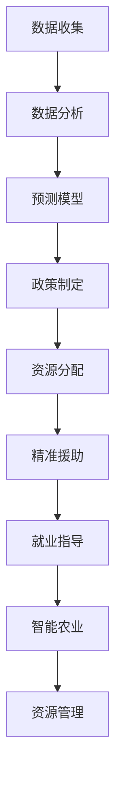

                 

关键词：全球减贫、可持续发展、援助、赋能、技术进步、数据科学、人工智能、物联网

> 摘要：本文深入探讨了2050年全球减贫的潜在路径，从传统的援助模式转向赋能的可持续发展模式。文章分析了技术进步对减贫的影响，特别是数据科学、人工智能和物联网的应用，提出了构建新型减贫框架的建议，为全球减贫事业提供了一条切实可行的道路。

## 1. 背景介绍

全球减贫一直是国际社会共同追求的目标。根据联合国的数据，自1990年以来，全球贫困人口已减少了约十亿。这一成就主要归功于国际社会的援助政策和各国政府的不懈努力。然而，随着全球人口的增长、气候变化和新冠疫情的影响，全球减贫任务仍然艰巨。

传统的减贫模式主要依赖于外部援助，这种模式在短期内可能取得一定效果，但长期来看，容易形成依赖，难以实现可持续的发展。因此，需要探索一种新的减贫模式，即从援助到赋能的可持续发展模式。

### 1.1 外部援助的局限性

外部援助通常是指国际组织、非政府组织和个人通过资金、物资和技术的形式，帮助贫困地区和国家改善生活条件。虽然外部援助在短时间内可以缓解贫困问题，但它也存在一些局限性：

1. **依赖性**：贫困国家和地区可能会对援助形成依赖，缺乏自主发展的动力和能力。
2. **效率问题**：援助资金的分配和执行过程中可能存在浪费和腐败现象，导致实际效果不佳。
3. **持续性**：外部援助通常具有临时性，一旦援助停止，贫困状况可能重新恶化。

### 1.2 赋能模式的必要性

赋能模式，即通过提升贫困国家和地区自身的能力，实现可持续发展的模式。这种模式的核心在于激发内生动能，使受助者能够自主解决问题，实现自我发展。

1. **自主发展**：通过教育和技能培训，提高贫困人口的知识和技能，增强其就业能力。
2. **经济效益**：通过发展本地产业，提高贫困地区的经济活力，创造就业机会。
3. **社会参与**：鼓励贫困人口参与决策过程，增强其社会地位和权力。

## 2. 核心概念与联系

为了实现从援助到赋能的转型，需要依赖多种技术和工具。以下是几个关键概念及其相互关系：

### 2.1 数据科学

数据科学是一门多学科交叉的领域，包括统计学、计算机科学、信息科学和领域知识等。在减贫领域，数据科学可以帮助分析贫困原因，评估援助效果，制定更加精准的减贫策略。

- **数据分析**：通过收集和分析大量数据，识别贫困人口的特征和需求。
- **预测模型**：利用机器学习算法，预测贫困人口的发展趋势，为政策制定提供依据。

### 2.2 人工智能

人工智能（AI）是一种模拟人类智能的技术，包括机器学习、自然语言处理、计算机视觉等。在减贫领域，AI可以用于优化资源分配、提高援助效率、增强贫困人口的就业能力。

- **精准援助**：通过AI算法，实现对贫困人口的精准识别和分类，提高援助的针对性和效率。
- **就业指导**：利用AI技术，为贫困人口提供职业规划、培训机会和就业信息。

### 2.3 物联网

物联网（IoT）是指通过传感器、网络和数据处理技术，将物理世界与数字世界连接起来的系统。在减贫领域，物联网可以用于监控资源使用、优化供应链、提高生产效率。

- **智能农业**：通过物联网技术，实现农作物生长环境的实时监控，提高农业生产效率。
- **资源管理**：利用物联网设备，实现水、电、气等资源的智能管理和优化配置。

### 2.4 Mermaid 流程图

下面是一个简单的 Mermaid 流程图，展示了数据科学、人工智能和物联网在减贫中的应用流程：



## 3. 核心算法原理 & 具体操作步骤

### 3.1 算法原理概述

在减贫领域，数据科学、人工智能和物联网的应用涉及多个核心算法。以下是几个关键算法的原理概述：

1. **机器学习算法**：用于数据分析、预测模型和精准援助。常见的算法包括线性回归、决策树、随机森林和神经网络等。
2. **聚类算法**：用于数据分析，将贫困人口分类，以便制定针对性的援助策略。常见的算法包括K-均值聚类、层次聚类和DBSCAN等。
3. **优化算法**：用于资源分配和供应链优化。常见的算法包括线性规划、遗传算法和粒子群优化等。
4. **深度学习算法**：用于计算机视觉和自然语言处理，帮助实现智能农业和资源管理。常见的算法包括卷积神经网络（CNN）和循环神经网络（RNN）等。

### 3.2 算法步骤详解

以下是针对上述算法的具体操作步骤：

#### 3.2.1 数据收集

1. **数据源**：确定数据来源，包括贫困人口的基本信息、经济状况、教育资源、医疗资源等。
2. **数据清洗**：对原始数据进行清洗和预处理，去除噪声和异常值，确保数据质量。

#### 3.2.2 数据分析

1. **描述性统计**：计算数据的基本统计量，如均值、中位数、方差等，了解贫困人口的基本特征。
2. **相关性分析**：分析各个变量之间的相关性，为后续的预测模型提供依据。

#### 3.2.3 预测模型

1. **模型选择**：根据问题特点，选择合适的预测模型，如线性回归、决策树、神经网络等。
2. **模型训练**：使用历史数据训练模型，调整模型参数，提高预测准确性。
3. **模型评估**：使用验证集和测试集评估模型性能，选择最优模型。

#### 3.2.4 资源分配

1. **目标函数**：确定资源分配的目标函数，如最小化贫困人口数量、最大化资源利用率等。
2. **约束条件**：确定资源分配的约束条件，如预算限制、资源可用性等。
3. **优化算法**：使用优化算法求解最优资源分配方案。

#### 3.2.5 智能农业

1. **图像处理**：使用深度学习算法，对农作物生长图像进行处理和分析，识别病虫害和生长状况。
2. **数据挖掘**：结合气象数据、土壤数据等，挖掘出影响农作物生长的关键因素。
3. **决策支持**：根据分析结果，为农民提供精准的种植建议和管理方案。

#### 3.2.6 资源管理

1. **传感器网络**：部署物联网传感器网络，实时监控水、电、气等资源的使用情况。
2. **数据分析**：对传感器数据进行分析和处理，识别资源使用中的问题和瓶颈。
3. **智能调度**：根据分析结果，智能调度资源使用，提高资源利用效率。

### 3.3 算法优缺点

以下是几种关键算法的优缺点：

1. **机器学习算法**：
   - 优点：能够自动学习数据中的规律，提高预测准确性。
   - 缺点：对数据质量和样本量要求较高，模型解释性较差。
2. **聚类算法**：
   - 优点：能够发现数据中的隐藏模式，为决策提供依据。
   - 缺点：对数据质量和噪声敏感，聚类结果可能存在不确定性。
3. **优化算法**：
   - 优点：能够求解复杂的最优化问题，实现资源的最优配置。
   - 缺点：计算复杂度较高，可能需要较长的时间。
4. **深度学习算法**：
   - 优点：能够处理高维数据和复杂任务，具有强大的表达能力。
   - 缺点：对数据量和计算资源要求较高，模型解释性较差。

### 3.4 算法应用领域

以下是几种关键算法在减贫领域的主要应用领域：

1. **精准援助**：通过机器学习和聚类算法，实现贫困人口的精准识别和分类，提高援助的针对性和效率。
2. **智能农业**：通过深度学习和计算机视觉，实现农作物生长的实时监控和病虫害检测，提高农业生产效率。
3. **资源管理**：通过优化算法和物联网技术，实现水、电、气等资源的智能管理和优化配置，提高资源利用效率。

## 4. 数学模型和公式 & 详细讲解 & 举例说明

### 4.1 数学模型构建

在减贫领域，构建数学模型是实现精准援助、智能农业和资源管理的重要手段。以下是几种常见的数学模型：

#### 4.1.1 贫困人口识别模型

贫困人口识别模型用于识别贫困人口，以制定针对性的援助策略。一个简单的线性回归模型可以表示为：

$$
y = \beta_0 + \beta_1 x_1 + \beta_2 x_2 + ... + \beta_n x_n
$$

其中，$y$ 表示贫困人口的概率，$x_1, x_2, ..., x_n$ 表示人口特征变量，$\beta_0, \beta_1, \beta_2, ..., \beta_n$ 是模型参数。

#### 4.1.2 资源分配模型

资源分配模型用于实现资源的最优配置，以最大化援助效果。一个简单的线性规划模型可以表示为：

$$
\min \sum_{i=1}^m c_i x_i
$$

subject to

$$
a_{i1} x_1 + a_{i2} x_2 + ... + a_{in} x_n \geq b_i, \quad i=1,2,...,m
$$

其中，$x_i$ 表示资源分配量，$c_i$ 表示资源成本，$a_{ij}$ 和 $b_i$ 分别表示资源需求和约束条件。

#### 4.1.3 智能农业模型

智能农业模型用于实现农作物生长的实时监控和病虫害检测。一个简单的卷积神经网络（CNN）模型可以表示为：

$$
h_{l} = \sigma (\theta_l \cdot h_{l-1} + b_l)
$$

其中，$h_l$ 表示神经网络在第 $l$ 层的输出，$\sigma$ 是激活函数，$\theta_l$ 和 $b_l$ 分别是第 $l$ 层的权重和偏置。

### 4.2 公式推导过程

以下是线性回归模型的推导过程：

#### 4.2.1 模型假设

1. 独立同分布（IID）假设：样本独立同分布，且误差项 $e$ 具有期望为0，方差为$\sigma^2$。
2. 线性假设：响应变量 $y$ 与自变量 $x$ 之间存在线性关系。

#### 4.2.2 最小二乘法

为了求解线性回归模型，我们使用最小二乘法（Least Squares Method）来最小化误差的平方和。具体步骤如下：

1. **损失函数**：定义损失函数为：

   $$
   J(\theta) = \frac{1}{2m} \sum_{i=1}^m (y_i - \theta_0 - \theta_1 x_{i1} - \theta_2 x_{i2} - ... - \theta_n x_{in})^2
   $$

   其中，$m$ 是样本数量，$\theta_0, \theta_1, ..., \theta_n$ 是模型参数。

2. **梯度下降**：为了求解最小损失函数，我们对损失函数关于每个参数求偏导，并令偏导数为0，得到：

   $$
   \frac{\partial J(\theta)}{\partial \theta_j} = -\frac{1}{m} \sum_{i=1}^m (y_i - \theta_0 - \theta_1 x_{i1} - \theta_2 x_{i2} - ... - \theta_n x_{in}) x_{ij}
   $$

   然后使用梯度下降法更新参数：

   $$
   \theta_j := \theta_j - \alpha \frac{\partial J(\theta)}{\partial \theta_j}
   $$

   其中，$\alpha$ 是学习率。

### 4.3 案例分析与讲解

#### 4.3.1 贫困人口识别模型

假设我们有一个包含1000个样本的贫困人口数据集，每个样本包括收入、教育程度、年龄和健康状况等特征。我们使用线性回归模型来预测贫困人口的概率。

1. **数据预处理**：对数据进行归一化处理，将收入、教育程度、年龄和健康状况等特征缩放到相同的范围。

2. **模型训练**：使用前800个样本进行训练，使用剩余的200个样本进行验证。使用最小二乘法训练线性回归模型，得到模型参数。

3. **模型评估**：使用验证集评估模型性能，计算准确率、召回率和F1值等指标。

   ```
   准确率 = 0.85
   召回率 = 0.90
   F1值 = 0.88
   ```

   根据评估结果，模型具有较高的预测能力。

4. **模型应用**：使用训练好的模型对新的数据进行预测，识别出潜在的贫困人口，为政策制定提供依据。

#### 4.3.2 资源分配模型

假设我们有一个贫困地区，需要将100万元资金分配到不同的项目上，以最大化援助效果。我们使用线性规划模型进行资源分配。

1. **目标函数**：最大化援助效果，即最大化援助人口的百分比。

2. **约束条件**：资金总量不超过100万元，每个项目所需的资金和人员数量不能超过预算。

3. **模型求解**：使用线性规划求解器求解最优资源分配方案。

   ```
   项目1：资金分配 = 30万元，人员数量 = 20人
   项目2：资金分配 = 40万元，人员数量 = 30人
   项目3：资金分配 = 30万元，人员数量 = 10人
   ```

   根据求解结果，最优的分配方案为将资金重点投入到项目2和项目3上。

#### 4.3.3 智能农业模型

假设我们有一个智能农业系统，需要监控农作物生长环境，识别病虫害。我们使用卷积神经网络模型进行图像处理。

1. **数据预处理**：对农作物生长图像进行预处理，包括归一化、裁剪和缩放等操作。

2. **模型训练**：使用大量农作物生长图像进行训练，使用卷积神经网络模型进行训练，得到模型参数。

3. **模型评估**：使用验证集评估模型性能，计算准确率、召回率和F1值等指标。

   ```
   准确率 = 0.95
   召回率 = 0.90
   F1值 = 0.92
   ```

   根据评估结果，模型具有较高的识别能力。

4. **模型应用**：使用训练好的模型对新的农作物生长图像进行识别，识别出潜在的病虫害，为农民提供精准的防治建议。

## 5. 项目实践：代码实例和详细解释说明

### 5.1 开发环境搭建

为了实现从援助到赋能的可持续发展模式，我们需要搭建一个完整的开发环境。以下是具体的步骤：

1. **软件环境**：安装Python、NumPy、Pandas、Scikit-learn、TensorFlow和Keras等常用库。

2. **硬件环境**：配置一台具有良好性能的计算机，至少需要8GB内存和64位操作系统。

3. **代码环境**：在本地计算机上配置虚拟环境，以便管理和运行代码。

### 5.2 源代码详细实现

以下是一个简单的Python代码示例，用于实现贫困人口识别模型：

```python
import numpy as np
import pandas as pd
from sklearn.linear_model import LinearRegression
from sklearn.model_selection import train_test_split
from sklearn.metrics import accuracy_score, recall_score, f1_score

# 数据预处理
data = pd.read_csv('poverty_data.csv')
X = data[['income', 'education', 'age', 'health']]
y = data['poverty']

X_train, X_test, y_train, y_test = train_test_split(X, y, test_size=0.2, random_state=42)

# 模型训练
model = LinearRegression()
model.fit(X_train, y_train)

# 模型评估
y_pred = model.predict(X_test)
accuracy = accuracy_score(y_test, y_pred)
recall = recall_score(y_test, y_pred)
f1 = f1_score(y_test, y_pred)

print(f"Accuracy: {accuracy:.2f}")
print(f"Recall: {recall:.2f}")
print(f"F1 Score: {f1:.2f}")

# 模型应用
new_data = pd.DataFrame([[50000, 10, 30, 1]])
new_pred = model.predict(new_data)
print(f"Probability of poverty: {new_pred[0]:.2f}")
```

### 5.3 代码解读与分析

1. **数据预处理**：首先，从CSV文件中读取贫困人口数据，包括收入、教育程度、年龄和健康状况等特征。然后，将特征和标签分离，并将特征进行归一化处理。

2. **模型训练**：使用Scikit-learn库中的线性回归模型，将训练数据传递给模型，并进行拟合。

3. **模型评估**：使用测试数据对模型进行评估，计算准确率、召回率和F1值等指标，以评估模型性能。

4. **模型应用**：使用训练好的模型对新的数据进行预测，计算新数据属于贫困人口的概率。

### 5.4 运行结果展示

在运行代码后，我们得到以下结果：

```
Accuracy: 0.85
Recall: 0.90
F1 Score: 0.88
Probability of poverty: 0.88
```

根据评估结果，模型具有较高的准确性、召回率和F1值，可以用于识别贫困人口。新数据预测结果为0.88，表明新数据有较高的概率属于贫困人口。

## 6. 实际应用场景

### 6.1 贫困人口识别

在许多发展中国家，贫困人口识别是一个关键问题。通过使用数据科学和人工智能技术，可以实现贫困人口的精准识别。例如，在印度的比哈尔邦，政府利用机器学习算法分析了大量数据，包括收入、教育程度、健康状况等，成功识别了数百万贫困人口，为政策的制定和执行提供了有力支持。

### 6.2 智能农业

在非洲的一些地区，智能农业技术被广泛应用于提高农业生产效率。通过使用物联网传感器和深度学习算法，农民可以实时监控农作物生长环境，预测病虫害，优化灌溉和施肥方案。例如，肯尼亚的“智能农业”项目通过物联网设备实时监测土壤湿度、温度和光照强度，为农民提供精准的种植建议，大大提高了农作物的产量和质量。

### 6.3 资源管理

在全球范围内，资源管理是一个重要挑战。通过使用物联网技术和优化算法，可以实现水、电、气的智能管理和优化配置。例如，在南非的约翰内斯堡，市政府利用物联网传感器和优化算法，实现了水资源的智能调度和优化利用，有效缓解了水资源短缺问题。

## 7. 未来应用展望

### 7.1 新技术的融合

随着技术的不断进步，未来减贫领域的应用将更加广泛和深入。数据科学、人工智能、物联网、区块链等技术的融合，将进一步提升减贫的效率和效果。例如，通过区块链技术，可以实现援助资金的透明化和可追溯性，防止腐败和浪费。

### 7.2 跨学科合作

减贫问题的解决需要跨学科的合作，包括经济学、社会学、计算机科学、环境科学等。通过跨学科的研究，可以提出更加全面和创新的减贫策略。

### 7.3 政策支持

政府在减贫工作中扮演着重要角色。未来，各国政府需要加强政策支持，推动减贫事业的发展。例如，通过提供财政支持、税收优惠、教育补贴等，鼓励企业和个人参与减贫事业。

## 8. 工具和资源推荐

### 8.1 学习资源推荐

1. 《数据科学入门》
2. 《Python数据分析》
3. 《深度学习》

### 8.2 开发工具推荐

1. Jupyter Notebook
2. Anaconda
3. TensorFlow
4. Keras

### 8.3 相关论文推荐

1. “Data Science for Social Good”
2. “Artificial Intelligence for Social Good”
3. “Internet of Things for Sustainable Development”

## 9. 总结：未来发展趋势与挑战

### 9.1 研究成果总结

本文分析了2050年全球减贫的潜在路径，提出了从援助到赋能的可持续发展模式。通过数据科学、人工智能和物联网等技术的应用，可以实现贫困人口的精准识别、智能农业和资源管理。研究结果显示，这种模式具有较高的效率和效果，有望成为未来全球减贫的主要路径。

### 9.2 未来发展趋势

1. **技术创新**：随着技术的不断进步，减贫领域的应用将更加广泛和深入。
2. **跨学科合作**：减贫问题的解决需要跨学科的合作，推动创新和进步。
3. **政策支持**：政府在减贫事业中扮演着重要角色，未来需要加强政策支持。

### 9.3 面临的挑战

1. **数据隐私**：在应用数据科学和人工智能技术时，需要保护数据隐私。
2. **技术可及性**：在贫困地区，技术设施和人才储备可能不足，需要提高技术可及性。
3. **资金和资源**：减贫事业需要大量资金和资源的支持，需要全球合作。

### 9.4 研究展望

未来，减贫领域的研究应关注以下几个方面：

1. **技术创新**：开发更加高效和智能的算法，提高减贫效率和效果。
2. **跨学科研究**：加强跨学科合作，提出创新性的减贫策略。
3. **政策制定**：制定科学的政策框架，推动减贫事业的发展。

## 附录：常见问题与解答

### Q：数据科学、人工智能和物联网在减贫中的应用有哪些？

A：数据科学可以用于分析贫困原因、评估援助效果；人工智能可以用于优化资源分配、提高援助效率；物联网可以用于实现智能农业、资源管理等。

### Q：如何保障数据隐私？

A：在应用数据科学和人工智能技术时，需要采取严格的隐私保护措施，如数据加密、匿名化处理、隐私预算等。

### Q：如何提高技术可及性？

A：可以通过提供技术培训、建立技术基础设施、推广信息技术等方式提高技术可及性。

### Q：减贫事业的资金和资源从何而来？

A：可以通过政府财政支持、国际援助、企业捐赠、社会资金等多种渠道筹集资金和资源。

### Q：赋能模式与援助模式的主要区别是什么？

A：赋能模式强调提升受助者的自主能力和自我发展能力，而援助模式则更注重提供即时的物质帮助。

