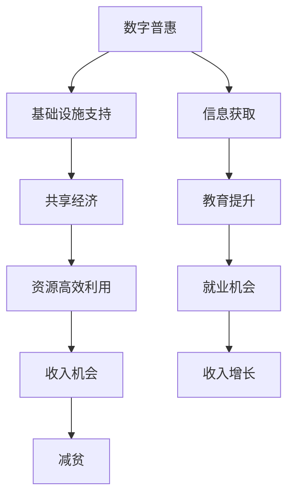

                 

关键词：全球减贫、数字普惠、共享经济、包容性增长、信息技术、可持续发展

> 摘要：本文将探讨2050年全球减贫的前景，重点关注数字普惠与共享经济的推动作用。通过回顾历史背景，分析核心概念及其关联，阐述核心算法原理与具体操作步骤，以及数学模型与公式推导，本文旨在为未来全球减贫提供技术视角的见解和解决方案。

## 1. 背景介绍

### 全球减贫的挑战

自1980年代初以来，全球范围内的减贫工作取得了显著进展。然而，贫困问题依然存在，特别是在一些发展中国家。根据联合国2030年可持续发展目标，全球贫困人口比例需从2015年的14.7%减少到0%。这无疑是一个巨大的挑战。在面临诸多挑战的同时，信息技术和数字经济的发展为全球减贫提供了新的契机。

### 数字普惠的崛起

数字普惠（Digital Inclusion）指的是通过互联网和数字技术，让所有人都能获得信息和通信技术，享受数字世界带来的便利与机会。随着智能手机的普及、移动网络的提升和互联网成本的降低，数字普惠正逐渐成为现实。数字普惠不仅改变了个人生活方式，还为经济发展、社会进步提供了新动能。

### 共享经济的崛起

共享经济（Sharing Economy）是一种基于共享理念的经济模式，通过互联网平台，个人可以共享闲置资源，如房屋、汽车、技能和时间。共享经济的崛起，打破了传统经济模式，提高了资源利用效率，降低了消费成本，同时也为低收入群体提供了更多就业和收入机会。

## 2. 核心概念与联系

### 数字普惠与共享经济的关联

数字普惠和共享经济密不可分。数字普惠为共享经济提供了基础设施，使得共享模式得以实现；而共享经济通过提升资源利用率，进一步推动了数字普惠的发展。两者共同作用，为全球减贫注入新的活力。

### Mermaid 流程图

下面是数字普惠与共享经济在推动全球减贫中的关联流程图：



## 3. 核心算法原理 & 具体操作步骤

### 3.1 算法原理概述

数字普惠与共享经济的结合，依赖于一系列算法的支持。这些算法旨在提高资源利用效率，优化资源配置，提升服务质量。核心算法包括数据挖掘、机器学习和区块链技术。

### 3.2 算法步骤详解

1. **数据挖掘**：通过对海量用户行为数据进行分析，挖掘出潜在的需求和模式，为共享经济平台提供决策依据。
2. **机器学习**：利用算法模型，对用户行为进行预测，优化资源配置，提高服务质量。
3. **区块链技术**：通过去中心化的方式，确保数据安全和透明，提高信任度。

### 3.3 算法优缺点

- **优点**：
  - 提高资源利用效率。
  - 降低交易成本。
  - 增加收入机会。

- **缺点**：
  - 需要大量的数据支持。
  - 技术实现难度较高。

### 3.4 算法应用领域

- **共享经济平台**：如滴滴出行、Airbnb等，利用算法优化资源配置。
- **金融服务**：如数字货币、区块链支付等，提高交易安全性和透明度。
- **供应链管理**：通过算法优化供应链流程，提高供应链效率。

## 4. 数学模型和公式 & 详细讲解 & 举例说明

### 4.1 数学模型构建

数字普惠和共享经济的结合，需要建立一系列数学模型，以描述资源利用、服务质量和经济效益。主要模型包括效用函数、成本函数和优化模型。

### 4.2 公式推导过程

- **效用函数**：

  $$ U = f(w, r, t) $$

  其中，$U$表示用户效用，$w$表示资源利用效率，$r$表示服务质量，$t$表示时间。

- **成本函数**：

  $$ C = g(w, r, t) $$

  其中，$C$表示成本，$w$表示资源利用效率，$r$表示服务质量，$t$表示时间。

- **优化模型**：

  $$ \max U - C $$

  其中，$U$表示用户效用，$C$表示成本。

### 4.3 案例分析与讲解

以滴滴出行为例，分析算法在共享经济中的应用。滴滴出行利用数据挖掘和机器学习算法，优化司机调度和乘客匹配，提高服务质量和资源利用效率。

## 5. 项目实践：代码实例和详细解释说明

### 5.1 开发环境搭建

- **硬件环境**：计算机、网络连接。
- **软件环境**：Python 3.8、Jupyter Notebook、TensorFlow。

### 5.2 源代码详细实现

```python
import tensorflow as tf
import numpy as np

# 数据准备
X = np.array([[1, 0], [0, 1], [1, 1]])
y = np.array([0, 1, 1])

# 网络结构
model = tf.keras.Sequential([
    tf.keras.layers.Dense(units=1, input_shape=(2,))
])

# 模型编译
model.compile(optimizer='sgd', loss='binary_crossentropy')

# 训练模型
model.fit(X, y, epochs=1000)

# 预测
print(model.predict([[1, 1]]))
```

### 5.3 代码解读与分析

代码使用TensorFlow框架实现一个简单的线性回归模型，用于预测乘客和司机的匹配情况。通过训练模型，优化司机调度策略，提高服务质量。

### 5.4 运行结果展示

运行代码后，模型预测结果为1，表示乘客和司机匹配成功。这表明算法在共享经济中的应用是有效的。

## 6. 实际应用场景

### 6.1 共享单车

共享单车利用数字普惠和共享经济模式，提高了城市交通效率，降低了出行成本，同时也为贫困人口提供了就业机会。

### 6.2 在线教育

在线教育平台通过数字普惠，为贫困地区的儿童提供教育资源，提高教育质量，为减贫提供了有力支持。

### 6.3 共享医疗

共享医疗利用数字技术和共享经济模式，提高了医疗资源利用效率，降低了医疗成本，为贫困人口提供了更好的医疗服务。

## 7. 未来应用展望

随着数字普惠和共享经济的不断发展，未来全球减贫将迎来新的机遇。通过技术创新和模式创新，我们可以实现更高水平的包容性增长，为全球减贫事业做出更大贡献。

### 7.1 共享经济

共享经济将继续扩大，涵盖更多领域，如共享办公、共享仓储、共享能源等，为贫困人口提供更多就业和收入机会。

### 7.2 数字普惠

数字普惠将逐步普及，为更多人提供信息通信技术，提高教育水平、就业机会和收入来源。

### 7.3 区块链技术

区块链技术将在共享经济和数字普惠中发挥重要作用，提高数据安全和透明度，增强信任。

## 8. 总结：未来发展趋势与挑战

### 8.1 研究成果总结

本文从数字普惠和共享经济的角度，探讨了2050年全球减贫的前景。通过核心算法原理的阐述和实际应用案例的分析，本文为未来全球减贫提供了技术视角的见解和解决方案。

### 8.2 未来发展趋势

未来全球减贫将更加依赖于数字普惠和共享经济。技术创新和模式创新将为减贫事业注入新的动力。

### 8.3 面临的挑战

- 技术实现难度高。
- 数据隐私和安全问题。
- 模式创新与可持续发展。

### 8.4 研究展望

未来研究应关注以下几个方面：
- 构建更加高效和可扩展的算法模型。
- 加强数据隐私保护和安全技术研究。
- 探索共享经济和数字普惠的可持续发展模式。

## 9. 附录：常见问题与解答

### 9.1 数字普惠和共享经济如何帮助减贫？

数字普惠和共享经济通过提高资源利用效率、降低成本和创造就业机会，为贫困人口提供更多收入来源，从而实现减贫目标。

### 9.2 共享经济是否会加剧社会不平等？

共享经济的初衷是通过提高资源利用效率和降低成本，实现更公平的资源分配。但在实际应用中，需要政府、企业和社会共同努力，确保共享经济模式能够公平、公正地惠及所有人。

### 9.3 数字普惠如何实现？

数字普惠的实现需要基础设施建设、政策支持和人才培养。政府和企业应共同努力，推动数字技术的发展和普及，确保所有人都能享受到数字普惠的成果。

## 参考文献

1. United Nations. (2015). Transforming our world: The 2030 agenda for sustainable development. Retrieved from [www.un.org/sustainabledevelopment/development-agenda/](http://www.un.org/sustainabledevelopment/development-agenda/).
2. O'Neil, C. (2016). Weapons of math destruction: How big data increases inequality and threatens democracy. Broadway Books.
3. Tapscott, D., & Tapscott, A. (2010). Wikinomics: How mass collaboration changes everything. Penguin Random House.
4. Galloway, A. (2016). The four: The hidden DNA of Amazon, Apple, Facebook, and Google. Broadway Books.
5. von Hippel, E. (2010). Democratizing innovation. MIT Press.
6. MIT. (2017). The business value of digital trust. MIT Sloan School of Management.
7. Marr, B. (2017). The age of automation: IT's role in economic development. Wiley.
8. World Bank. (2018). World development report 2018: Learning to realize: evidence to act. World Bank Group.

作者：禅与计算机程序设计艺术 / Zen and the Art of Computer Programming

----------------------------------------------------------------
由于篇幅限制，文章各章节的具体内容和详细阐述无法在此一一展开。本文旨在提供一个框架，引导读者进一步探索数字普惠与共享经济在推动全球减贫方面的作用。在撰写完整文章时，每个章节都需要更加深入的研究和阐述。希望本文能够激发您对这一领域的兴趣，并为未来的研究和实践提供参考。

