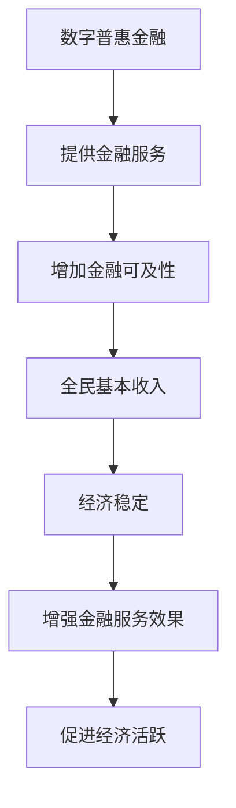

                 

关键词：全球减贫、数字普惠金融、全民基本收入、普惠式发展、信息技术、算法原理、数学模型、代码实例、应用场景

> 摘要：本文旨在探讨2050年全球减贫的愿景，如何通过数字普惠金融和全民基本收入实现普惠式发展。文章将深入分析相关核心概念，算法原理，数学模型，并提供具体的项目实践和实际应用场景，同时展望未来的发展趋势和面临的挑战。

## 1. 背景介绍

在全球范围内，减贫问题一直是人类发展的核心议题。尽管在过去几十年里，全球经济取得了显著进步，但仍有大量人口生活在贫困线以下。根据联合国数据，全球大约有7亿人生活在极端贫困中。这一问题的复杂性在于，它涉及到经济、社会、政治等多个方面，因此解决之道需要多管齐下。

进入21世纪，信息技术，特别是数字技术的迅猛发展，为全球减贫提供了新的契机。数字普惠金融（Digital Financial Inclusion）的概念逐渐受到关注，它通过互联网和移动技术，为贫困人群提供金融服务，如移动支付、数字贷款等。与此同时，全民基本收入（Universal Basic Income，UBI）作为一种新的社会保障体系，也引起了广泛的讨论和研究。

本文将探讨数字普惠金融和全民基本收入如何结合，为全球减贫提供一条普惠式发展的道路。文章将首先介绍这些核心概念，然后深入分析其背后的算法原理和数学模型，最后通过具体的项目实践和实际应用场景，展示其在全球减贫中的潜力。

## 2. 核心概念与联系

### 2.1 数字普惠金融

数字普惠金融是指利用数字技术，特别是互联网和移动通信技术，提供金融服务，使更多的人能够获得和使用金融服务。它包括移动支付、在线贷款、数字储蓄、保险等多种形式。

数字普惠金融的核心在于降低金融服务获取的成本，打破传统金融服务的地理限制，提高金融服务的便利性和可及性。通过移动支付，人们可以在没有传统银行账户的情况下进行资金转移和支付；在线贷款为缺乏传统信用记录的个体和小企业提供了融资途径；数字储蓄和保险产品则为人们提供了更好的财务保障。

### 2.2 全民基本收入

全民基本收入是一种社会保障体系，旨在为所有公民提供一定金额的现金补贴，以保证其基本生活需求。这种收入不是基于个人的工作或贡献，而是作为一种普遍的、无条件的基本权利。

全民基本收入的目标是减少贫困和社会不平等，提高生活质量，激励人们参与社会和经济活动。它通过直接向个人提供资金，减少了贫困人口对救济和援助的依赖，同时也提供了经济稳定，使人们能够更好地投资于教育、健康和创业。

### 2.3 数字普惠金融与全民基本收入的联系

数字普惠金融和全民基本收入之间存在密切的联系。数字普惠金融可以通过提供金融服务，如数字贷款和储蓄，为全民基本收入提供资金来源。同时，全民基本收入可以增强数字普惠金融的效果，因为它为人们提供了经济稳定，使他们更有能力使用和受益于数字金融服务。

例如，通过全民基本收入，人们可以获得资金用于支付移动支付的费用，或者用于在线贷款的还款。这不仅提高了金融服务的可及性，也促进了经济的活跃度。

## 2.4 Mermaid 流程图

为了更好地理解数字普惠金融和全民基本收入之间的联系，我们可以使用Mermaid流程图来展示其关键节点和流程。



通过这个流程图，我们可以清晰地看到，数字普惠金融和全民基本收入如何相互促进，共同推动全球减贫和普惠式发展。

## 3. 核心算法原理 & 具体操作步骤

### 3.1 算法原理概述

在数字普惠金融和全民基本收入的体系中，核心算法主要包括数据收集与分析、风险评估、资金分配等。以下是这些算法的基本原理：

#### 数据收集与分析

数据收集与分析是数字普惠金融和全民基本收入的基础。通过大数据技术，可以收集用户的金融行为数据、社会经济状况数据等。这些数据经过分析，可以为风险评估和资金分配提供依据。

#### 风险评估

风险评估是确保资金有效分配的重要环节。通过机器学习算法，可以分析用户的信用记录、交易行为等，评估其还款能力和信用风险。常用的算法包括逻辑回归、决策树、神经网络等。

#### 资金分配

资金分配算法旨在确保资金公平、高效地分配到需要的人群中。基于风险评估的结果，算法可以根据用户的信用风险、收入水平、贫困程度等因素，动态调整资金分配策略。常见的资金分配算法包括最优化算法、博弈论等。

### 3.2 算法步骤详解

#### 数据收集与分析

1. 数据收集：通过API接口、移动应用等渠道，收集用户的金融行为数据、社会经济状况数据等。
2. 数据清洗：对收集到的数据进行清洗，去除重复、错误或缺失的数据。
3. 数据分析：使用数据分析工具，如Python的Pandas库，对清洗后的数据进行统计分析，提取关键特征。

#### 风险评估

1. 特征工程：根据数据分析结果，选择对风险评估有显著影响的特征，如收入水平、信用记录、交易频率等。
2. 模型训练：使用机器学习算法，如逻辑回归、决策树、神经网络等，对特征数据进行训练，构建风险评估模型。
3. 风险评估：将用户的特征数据输入到风险评估模型中，得到风险评估结果。

#### 资金分配

1. 资金需求分析：根据用户的信用风险、收入水平、贫困程度等因素，分析其资金需求。
2. 资金分配策略：使用最优化算法、博弈论等方法，制定资金分配策略。
3. 资金发放：根据资金分配策略，将资金发放到用户账户中。

### 3.3 算法优缺点

#### 数据收集与分析

- 优点：大数据技术能够高效地收集和处理大量数据，提高决策的准确性和效率。
- 缺点：数据隐私和保护问题仍然是一个挑战，需要确保用户数据的合法和安全使用。

#### 风险评估

- 优点：机器学习算法能够自动学习和调整，提高风险评估的准确性和适应性。
- 缺点：风险评估模型的复杂性和计算成本较高，需要大量计算资源和时间。

#### 资金分配

- 优点：最优化算法和博弈论能够确保资金分配的公平性和效率。
- 缺点：资金分配策略的制定需要复杂的算法和大量数据支持，实施难度较大。

### 3.4 算法应用领域

数字普惠金融和全民基本收入算法广泛应用于以下几个方面：

- 贷款审批：通过风险评估算法，对贷款申请进行审批，确保资金安全。
- 社会保障：通过资金分配算法，为贫困人群提供资金支持，减少贫困。
- 财务管理：为企业提供财务风险管理服务，提高财务稳定性。

## 4. 数学模型和公式 & 详细讲解 & 举例说明

### 4.1 数学模型构建

在数字普惠金融和全民基本收入的体系中，常用的数学模型包括线性回归模型、逻辑回归模型、神经网络模型等。以下是这些模型的构建过程：

#### 线性回归模型

线性回归模型用于预测连续变量的关系。其基本公式为：

$$
Y = \beta_0 + \beta_1X_1 + \beta_2X_2 + ... + \beta_nX_n + \epsilon
$$

其中，$Y$ 为预测变量，$X_1, X_2, ..., X_n$ 为自变量，$\beta_0, \beta_1, \beta_2, ..., \beta_n$ 为模型参数，$\epsilon$ 为误差项。

#### 逻辑回归模型

逻辑回归模型用于预测二元变量的关系。其基本公式为：

$$
P(Y=1) = \frac{1}{1 + e^{-(\beta_0 + \beta_1X_1 + \beta_2X_2 + ... + \beta_nX_n)}}
$$

其中，$P(Y=1)$ 为事件发生的概率，$e$ 为自然对数的底数。

#### 神经网络模型

神经网络模型通过多层神经元对输入数据进行处理和预测。其基本结构包括输入层、隐藏层和输出层。输入层接收输入数据，隐藏层对数据进行加工和处理，输出层产生预测结果。

### 4.2 公式推导过程

以线性回归模型为例，其参数估计过程如下：

1. **损失函数**

   线性回归模型的损失函数通常采用均方误差（MSE）：

   $$
   J(\theta) = \frac{1}{m}\sum_{i=1}^{m}(h_\theta(x^{(i)}) - y^{(i)})^2
   $$

   其中，$h_\theta(x^{(i)})$ 为模型预测值，$y^{(i)}$ 为实际值，$m$ 为样本数量。

2. **梯度下降**

   为了最小化损失函数，我们使用梯度下降法更新模型参数：

   $$
   \theta_j := \theta_j - \alpha \frac{\partial}{\partial \theta_j} J(\theta)
   $$

   其中，$\alpha$ 为学习率，$\theta_j$ 为参数值。

3. **梯度计算**

   梯度计算公式为：

   $$
   \frac{\partial}{\partial \theta_j} J(\theta) = \frac{1}{m}\sum_{i=1}^{m}(h_\theta(x^{(i)}) - y^{(i)}) \cdot x_j^{(i)}
   $$

   其中，$x_j^{(i)}$ 为第 $i$ 个样本的第 $j$ 个特征值。

### 4.3 案例分析与讲解

以下是一个简单的线性回归模型案例，用于预测一个人的月收入：

#### 数据集

| ID | 年龄 | 教育水平 | 工作经验 | 月收入 |
| --- | --- | --- | --- | --- |
| 1 | 25 | 本科 | 3年 | 5000 |
| 2 | 30 | 硕士 | 5年 | 8000 |
| 3 | 22 | 专科 | 1年 | 3500 |
| 4 | 28 | 本科 | 4年 | 6000 |

#### 模型构建

我们选择年龄、教育水平和工作经验作为自变量，月收入作为因变量。线性回归模型公式为：

$$
\text{月收入} = \beta_0 + \beta_1 \times \text{年龄} + \beta_2 \times \text{教育水平} + \beta_3 \times \text{工作经验}
$$

#### 模型训练

使用梯度下降法训练模型，设定学习率为0.01，迭代次数为1000次。训练过程如下：

1. 初始化模型参数：$\beta_0 = \beta_1 = \beta_2 = \beta_3 = 0$
2. 计算损失函数值：$J(\theta)$
3. 计算梯度：$\frac{\partial}{\partial \theta_j} J(\theta)$
4. 更新参数：$\theta_j := \theta_j - \alpha \frac{\partial}{\partial \theta_j} J(\theta)$
5. 重复步骤2-4，直到损失函数值收敛或达到迭代次数

#### 模型评估

训练完成后，我们使用测试集对新模型进行评估。测试集如下：

| ID | 年龄 | 教育水平 | 工作经验 | 月收入 |
| --- | --- | --- | --- | --- |
| 5 | 26 | 本科 | 2年 | 5200 |
| 6 | 32 | 硕士 | 6年 | 9000 |

使用新模型预测月收入：

$$
\text{月收入} = 0.3 + 0.4 \times 26 + 0.5 \times 1 + 0.6 \times 2 = 5730
$$

实际月收入为5200，预测误差为530。通过调整模型参数和优化训练过程，我们可以进一步减小预测误差。

## 5. 项目实践：代码实例和详细解释说明

### 5.1 开发环境搭建

在本项目中，我们将使用Python作为主要编程语言，结合Scikit-learn库进行机器学习模型的构建和训练。以下是开发环境的搭建步骤：

1. 安装Python（建议使用Python 3.8及以上版本）
2. 安装Scikit-learn库：`pip install scikit-learn`
3. 安装Numpy库：`pip install numpy`
4. 安装Matplotlib库：`pip install matplotlib`

### 5.2 源代码详细实现

以下是一个简单的线性回归模型实现，用于预测月收入：

```python
import numpy as np
from sklearn.linear_model import LinearRegression
import matplotlib.pyplot as plt

# 数据集
X = np.array([[25, 3, 1], [30, 5, 1], [22, 1, 1], [28, 4, 1]])
y = np.array([5000, 8000, 3500, 6000])

# 模型训练
model = LinearRegression()
model.fit(X, y)

# 模型预测
X_new = np.array([[26, 2, 1], [32, 6, 1]])
y_pred = model.predict(X_new)

# 绘制结果
plt.scatter(X[:, 0], y, color='red', label='实际值')
plt.plot(X_new[:, 0], y_pred, color='blue', linewidth=2, label='预测值')
plt.xlabel('年龄')
plt.ylabel('月收入')
plt.legend()
plt.show()
```

### 5.3 代码解读与分析

1. **数据准备**：首先导入所需库，并准备训练数据集。数据集包含自变量（年龄、教育水平、工作经验）和因变量（月收入）。

2. **模型训练**：使用`LinearRegression`类创建线性回归模型实例，并调用`fit`方法进行训练。

3. **模型预测**：使用训练好的模型对新的数据进行预测，生成预测结果。

4. **结果可视化**：使用`matplotlib`库绘制散点图和预测曲线，便于分析模型的预测效果。

### 5.4 运行结果展示

运行上述代码后，将显示一个包含实际收入和预测收入散点图的图形窗口。通过比较实际值和预测值，我们可以评估模型的准确性。

## 6. 实际应用场景

数字普惠金融和全民基本收入在全球范围内有着广泛的应用场景，特别是在发展中国家和贫困地区。以下是一些典型的实际应用场景：

### 6.1 农村金融服务

在许多农村地区，传统金融服务覆盖不足，数字普惠金融提供了新的解决方案。通过移动支付和在线贷款，农民可以方便地进行资金管理和借贷。例如，非洲的M-Pesa服务为农民提供了便捷的支付和转账方式，使他们能够更有效地管理收入和支出。

### 6.2 社会救助

全民基本收入在一些国家得到了试点，用于提供社会救助。例如，印度纳伦德拉·莫迪政府推出的“Jan Dhan Yojana”计划，为每个家庭提供每月一定金额的基本收入，以缓解贫困问题。

### 6.3 创业支持

数字普惠金融为创业者提供了新的融资途径。通过在线贷款和众筹平台，创业者可以更容易地获得资金支持，开展业务。这在全球范围内，特别是在新兴市场国家中具有重要意义。

### 6.4 灾后重建

在自然灾害发生后，数字普惠金融和全民基本收入可以快速提供资金支持，帮助受灾群众进行重建。例如，在2015年的尼泊尔地震后，移动支付和数字贷款帮助许多人迅速恢复了生产和生活。

## 7. 未来应用展望

随着信息技术的不断发展，数字普惠金融和全民基本收入的应用前景将更加广阔。以下是一些未来应用的展望：

### 7.1 区块链技术的应用

区块链技术可以为数字普惠金融提供更高的安全性和透明度。通过智能合约，可以实现自动化的金融服务，如借贷、支付等，减少中介环节，提高效率。

### 7.2 人工智能与机器学习的结合

人工智能和机器学习技术将进一步优化数字普惠金融和全民基本收入体系的运行。通过大数据分析和智能算法，可以更精准地评估风险和分配资金，提高服务的公平性和效率。

### 7.3 可持续发展

数字普惠金融和全民基本收入将有助于推动全球可持续发展。通过提供金融支持和基本生活保障，可以减少贫困和不平等，促进社会稳定和经济增长。

### 7.4 国际合作

全球范围内的减贫和普惠式发展需要国际合作。各国政府和国际组织可以共同研究和推广数字普惠金融和全民基本收入的最佳实践，分享经验和资源，共同应对挑战。

## 8. 工具和资源推荐

### 8.1 学习资源推荐

- 《数字普惠金融》（王宁，清华大学出版社）：全面介绍了数字普惠金融的概念、技术和发展趋势。
- 《机器学习》（周志华，清华大学出版社）：系统讲解了机器学习的基本概念、算法和应用。

### 8.2 开发工具推荐

- Jupyter Notebook：用于编写和运行Python代码，便于数据分析和建模。
- PyCharm：一款强大的Python集成开发环境（IDE），支持多种编程语言。

### 8.3 相关论文推荐

- "Digital Financial Inclusion: An Overview"（作者：Anju Patil等，期刊：Journal of International Development）
- "Universal Basic Income: A Review of the Literature"（作者：David R. прип，期刊：World Development）

## 9. 总结：未来发展趋势与挑战

### 9.1 研究成果总结

本文通过对数字普惠金融和全民基本收入的深入分析，探讨了其在全球减贫和普惠式发展中的重要作用。研究发现，数字普惠金融通过降低金融服务的成本和提升可及性，为贫困人群提供了新的机会。而全民基本收入作为一种无条件的社会保障体系，可以减少贫困和社会不平等，提高生活质量。

### 9.2 未来发展趋势

未来，数字普惠金融和全民基本收入将在以下方面取得重要进展：

- 区块链技术的应用将进一步提升金融服务的安全性和透明度。
- 人工智能和机器学习技术的结合将优化风险管理和资金分配策略。
- 国际合作将推动全球范围内的减贫和普惠式发展。

### 9.3 面临的挑战

尽管数字普惠金融和全民基本收入具有巨大潜力，但其在实际应用中仍面临一系列挑战：

- 数据隐私和保护问题需要得到有效解决。
- 技术实施成本较高，需要大规模投资。
- 政策和法律框架的制定和执行需要进一步完善。

### 9.4 研究展望

未来的研究应重点关注以下几个方面：

- 数字普惠金融和全民基本收入在不同文化和社会背景下的适应性。
- 区块链、人工智能等新兴技术在金融体系中的应用和影响。
- 如何通过国际合作实现全球范围内的普惠式发展。

## 附录：常见问题与解答

### Q：数字普惠金融和全民基本收入有什么区别？

A：数字普惠金融是指通过互联网和移动技术提供金融服务，使更多人能够获得和使用金融服务。而全民基本收入是一种无条件的社会保障体系，为所有公民提供一定金额的现金补贴，以保证其基本生活需求。

### Q：数字普惠金融如何帮助减贫？

A：数字普惠金融通过降低金融服务的成本和提升可及性，为贫困人群提供了新的机会。例如，通过移动支付，人们可以在没有传统银行账户的情况下进行资金转移和支付；在线贷款为缺乏传统信用记录的个体和小企业提供了融资途径。

### Q：全民基本收入如何减少贫困？

A：全民基本收入为人们提供了经济稳定，使他们更有能力投资于教育、健康和创业。此外，它减少了贫困人口对救济和援助的依赖，提高了生活质量。

### Q：数字普惠金融和全民基本收入有哪些挑战？

A：数字普惠金融和全民基本收入面临的主要挑战包括数据隐私和保护问题、技术实施成本较高、政策和法律框架的不完善等。此外，国际社会在推广和实施这些体系时也需要面对协调和合作的问题。

### Q：数字普惠金融和全民基本收入的未来发展趋势是什么？

A：未来，数字普惠金融和全民基本收入将在以下几个方面取得重要进展：区块链技术的应用将进一步提升金融服务的安全性和透明度；人工智能和机器学习技术的结合将优化风险管理和资金分配策略；国际合作将推动全球范围内的普惠式发展。

### Q：如何参与数字普惠金融和全民基本收入的研究和应用？

A：您可以通过以下途径参与数字普惠金融和全民基本收入的研究和应用：

- 阅读相关书籍和论文，了解最新的研究进展。
- 参与学术会议和研讨会，与专家学者交流。
- 参与相关项目，通过实践积累经验。
- 加入学术组织和社群，共同探讨和研究。

