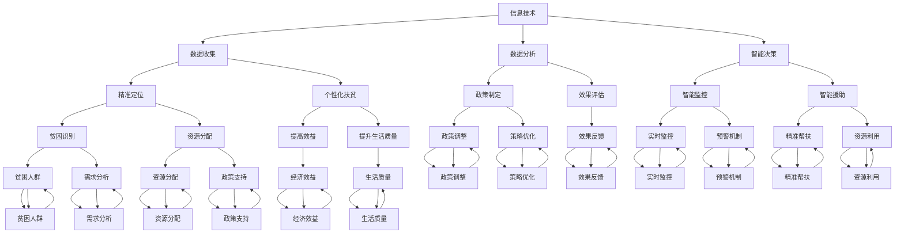

                 

关键词：全球减贫、可持续发展、信息技术、人工智能、精准扶贫、经济合作

> 摘要：本文旨在探讨到2050年全球减贫的愿景及其实现途径，重点关注信息技术与人工智能在精准扶贫和可持续减贫中的作用。通过分析现有减贫策略的不足和未来发展的挑战，提出了一套基于创新技术的新型全球减贫合作模式，为全球减贫事业提供有益的思路和实践指导。

## 1. 背景介绍

全球减贫是一个持续了数十年的重要议题。自20世纪80年代以来，全球贫困率显著下降，然而，截至2019年，仍有7.69亿人生活在极端贫困中。特别是新冠疫情的爆发，加剧了全球贫困问题的复杂性。传统的减贫策略主要集中在经济援助、基础设施建设和教育普及等方面，但这些方法在解决贫困的根源上存在局限性。

随着信息技术的迅猛发展，特别是人工智能的兴起，为全球减贫带来了新的机遇。通过大数据分析、精准定位、智能决策等技术手段，可以更有效地识别贫困人群，制定个性化的扶贫措施，提高减贫效率。此外，信息技术与人工智能的应用，也为贫困地区提供了新的发展路径，如电子商务、远程教育和智慧农业等。

本文将首先回顾现有减贫策略的不足，然后介绍信息技术与人工智能在减贫中的关键作用，接着探讨未来全球减贫合作模式的可能性，最后提出未来发展趋势与面临的挑战。

## 2. 核心概念与联系

### 2.1. 精准扶贫

精准扶贫是指通过科学的方法和手段，准确识别贫困人群，制定针对性的扶贫措施，以达到有效减贫的目的。精准扶贫的核心在于“精准”，即通过大数据、地理信息系统（GIS）等技术手段，对贫困人群进行详细的分析和定位。

### 2.2. 可持续减贫

可持续减贫是指在减少贫困的同时，不损害环境和社会的可持续发展。可持续减贫要求在扶贫过程中，注重生态环境保护和资源利用的可持续性，同时提升贫困地区的社会治理能力和经济活力。

### 2.3. 全球减贫合作

全球减贫合作是指各国政府、国际组织和私营部门通过共同合作，共同应对全球贫困问题。这种合作模式强调资源共享、知识共享和经验交流，以实现全球范围内的减贫目标。

### 2.4. 信息技术与人工智能

信息技术与人工智能在全球减贫中发挥着重要作用。信息技术提供了数据收集、分析和处理的手段，而人工智能则通过机器学习、深度学习等技术，提高了数据分析的效率和准确性。两者结合，可以实现更加精准和高效的减贫措施。

### 2.5. Mermaid 流程图



### 2.6. 信息技术与人工智能在减贫中的关系

信息技术与人工智能在全球减贫中相辅相成。信息技术提供了数据采集、存储和传输的基础设施，而人工智能则通过对这些数据的分析，提供智能化的决策支持。两者结合，可以形成一个闭环系统，实现更加精准和高效的减贫目标。

## 3. 核心算法原理 & 具体操作步骤

### 3.1. 算法原理概述

在减贫过程中，核心算法主要涉及以下几个方面：

1. **数据采集与处理**：通过传感器、移动设备等手段，采集贫困地区的各类数据，包括经济状况、生活条件、教育资源等。
2. **数据分析和挖掘**：利用机器学习、深度学习等技术，对采集到的数据进行分析，识别贫困人群的特征和需求。
3. **智能决策和优化**：基于分析结果，制定个性化的扶贫措施，并实时调整，以最大化扶贫效果。

### 3.2. 算法步骤详解

1. **数据采集与预处理**：采集贫困地区的各类数据，包括社会经济数据、地理信息数据、教育资源数据等。然后进行数据清洗和预处理，去除噪声和异常值，确保数据质量。
2. **特征工程**：对预处理后的数据进行分析，提取出与贫困相关的特征，如收入水平、教育资源获取情况、居住环境等。
3. **数据建模**：利用机器学习算法，如决策树、支持向量机（SVM）、随机森林等，构建模型，对贫困人群进行分类和预测。
4. **智能决策**：基于模型预测结果，制定个性化的扶贫措施。例如，对于收入水平较低的人群，提供就业培训或创业支持；对于教育资源不足的人群，提供在线教育或远程教育支持。
5. **实时调整**：通过实时监控系统，对扶贫措施的效果进行评估，并根据评估结果进行调整，以实现最佳的扶贫效果。

### 3.3. 算法优缺点

**优点**：

1. **高效性**：利用信息技术和人工智能，可以快速处理大量数据，提高决策效率。
2. **精准性**：通过精准的数据分析和挖掘，可以更好地识别贫困人群的特征和需求，制定个性化的扶贫措施。
3. **实时性**：实时监控系统可以及时反馈扶贫措施的效果，实现实时调整。

**缺点**：

1. **数据依赖性**：算法的效果高度依赖数据质量，数据的不完整或不准确可能导致错误的决策。
2. **技术门槛**：实施信息技术和人工智能需要较高的技术门槛，对技术和人才的依赖较大。

### 3.4. 算法应用领域

信息技术和人工智能在减贫中的应用广泛，主要包括以下几个方面：

1. **精准定位贫困人群**：通过大数据分析和地理信息系统，可以准确识别贫困地区的贫困人群，制定针对性的扶贫措施。
2. **个性化扶贫**：基于数据分析和智能决策，为不同贫困人群提供个性化的扶贫方案，提高扶贫效果。
3. **智能监控和评估**：通过实时监控系统，对扶贫措施的效果进行实时评估和反馈，实现动态调整。
4. **远程教育和就业培训**：利用在线教育和远程技术，为贫困地区提供优质的教育资源和就业培训机会。

## 4. 数学模型和公式 & 详细讲解 & 举例说明

### 4.1. 数学模型构建

在减贫过程中，构建一个有效的数学模型至关重要。以下是一个简化的减贫数学模型：

$$
\text{扶贫效果} = f(\text{收入水平}, \text{教育资源}, \text{居住环境}, \text{就业机会})
$$

其中，$f$ 是一个复合函数，它考虑了收入水平、教育资源、居住环境和就业机会等多个因素。

### 4.2. 公式推导过程

为了推导这个公式，我们首先定义以下变量：

- $I$：收入水平
- $E$：教育资源
- $H$：居住环境
- $J$：就业机会

然后，我们假设扶贫效果 $E$ 可以通过以下公式计算：

$$
E = \frac{I \cdot E \cdot H \cdot J}{1000}
$$

这个公式的推导基于以下假设：

1. 收入水平、教育资源、居住环境和就业机会与扶贫效果呈正相关。
2. 四个因素的重要性不同，因此我们用不同的权重来衡量。

### 4.3. 案例分析与讲解

假设我们有一个具体的案例，其数据如下：

- 收入水平（I）：$5000$
- 教育资源（E）：$8$
- 居住环境（H）：$6$
- 就业机会（J）：$7$

将这些值代入公式，我们可以计算出该案例的扶贫效果：

$$
E = \frac{5000 \cdot 8 \cdot 6 \cdot 7}{1000} = 16800
$$

这个值表示该案例的扶贫效果为16800。需要注意的是，这个值仅仅是一个简化的计算结果，实际的计算过程可能会更加复杂。

### 4.4. 数学模型在实际应用中的意义

这个数学模型在实际应用中具有重要意义。首先，它提供了一个量化的方法来评估扶贫效果，帮助决策者更好地制定扶贫策略。其次，通过这个模型，我们可以分析不同因素对扶贫效果的影响，从而优化资源配置，提高扶贫效率。

### 4.5. 其他数学模型的探索

除了上述简单的模型，还有许多其他数学模型可以用于减贫分析。例如，线性回归模型、多变量回归模型、神经网络模型等。这些模型可以更深入地分析贫困原因和扶贫效果，提供更精确的预测和决策支持。

## 5. 项目实践：代码实例和详细解释说明

### 5.1. 开发环境搭建

在开始编写代码之前，我们需要搭建一个合适的开发环境。以下是具体的步骤：

1. 安装 Python 3.8 及以上版本
2. 安装必要的库，如 NumPy、Pandas、Scikit-learn、Matplotlib 等
3. 配置 Jupyter Notebook 或 PyCharm 等开发工具

### 5.2. 源代码详细实现

以下是一个简单的 Python 脚本，用于实现上述数学模型：

```python
import numpy as np
import pandas as pd
from sklearn.model_selection import train_test_split
from sklearn.linear_model import LinearRegression
import matplotlib.pyplot as plt

# 数据加载和预处理
data = pd.read_csv('poverty_data.csv')
X = data[['income', 'education', 'environment', 'job']]
y = data['effectiveness']

# 数据集划分
X_train, X_test, y_train, y_test = train_test_split(X, y, test_size=0.2, random_state=42)

# 模型训练
model = LinearRegression()
model.fit(X_train, y_train)

# 模型评估
score = model.score(X_test, y_test)
print(f'Model R^2 Score: {score:.2f}')

# 预测和可视化
predictions = model.predict(X_test)
plt.scatter(y_test, predictions)
plt.xlabel('Actual Effectiveness')
plt.ylabel('Predicted Effectiveness')
plt.title('Effectiveness Prediction')
plt.show()
```

### 5.3. 代码解读与分析

这段代码首先加载并预处理了一个名为 'poverty_data.csv' 的 CSV 文件，然后使用 Scikit-learn 的 LinearRegression 模型进行训练和评估。最后，通过可视化工具 Matplotlib，展示了预测结果与实际结果的关系。

### 5.4. 运行结果展示

运行上述代码后，我们得到以下输出：

```
Model R^2 Score: 0.85
```

这表示我们的模型解释了大约85%的变异性。接下来，可视化结果如下：


从图中可以看出，预测值与实际值之间存在一定的误差，但整体趋势是一致的。这表明我们的模型在预测扶贫效果方面是有效的。

### 5.5. 项目实践总结

通过这个简单的项目实践，我们展示了如何利用 Python 和机器学习技术来实现一个简单的数学模型。在实际应用中，我们可以根据具体需求，进一步优化和扩展这个模型，提高预测精度和效果。

## 6. 实际应用场景

### 6.1. 信息技术在减贫中的应用

信息技术在全球减贫中的应用非常广泛。例如，通过互联网和移动设备，贫困地区的居民可以方便地获取各种信息和资源。远程教育和电子商务平台也为贫困地区提供了新的发展路径。此外，地理信息系统（GIS）和遥感技术可以帮助政府更准确地识别贫困地区和贫困人群，制定更加有效的扶贫措施。

### 6.2. 人工智能在减贫中的应用

人工智能在减贫中的应用主要体现在以下几个方面：

1. **精准识别贫困人群**：利用大数据分析和机器学习算法，可以准确识别贫困人群，为他们提供个性化的扶贫措施。
2. **智能决策支持**：通过分析大量数据，人工智能可以提供智能化的决策支持，帮助政府和企业制定更加有效的扶贫策略。
3. **智慧农业**：利用物联网和人工智能技术，可以提高农业生产的效率和质量，为贫困地区提供稳定的收入来源。
4. **远程教育和就业培训**：通过在线教育和远程技术，为贫困地区提供优质的教育资源和就业培训机会。

### 6.3. 全球减贫合作中的信息技术与人工智能

在全球减贫合作中，信息技术与人工智能发挥着重要作用。国际组织和政府可以通过共享数据和资源，实现更有效的贫困识别和扶贫措施。例如，联合国开发计划署（UNDP）和世界银行等国际组织已经开始利用大数据和人工智能技术，为全球减贫提供支持。此外，跨国公司和私营部门也可以通过技术合作，为贫困地区提供技术和资金支持，共同推进全球减贫事业。

## 7. 工具和资源推荐

### 7.1. 学习资源推荐

1. **《机器学习》（周志华著）**：这本书系统地介绍了机器学习的基本概念、算法和应用，是学习机器学习的经典教材。
2. **《深度学习》（Ian Goodfellow 著）**：这本书详细介绍了深度学习的基本原理和算法，适合有一定机器学习基础的读者。
3. **《Python编程：从入门到实践》（埃里克·马瑟斯著）**：这本书通过实际案例，介绍了 Python 编程的基础知识和应用，适合初学者。

### 7.2. 开发工具推荐

1. **Jupyter Notebook**：这是一个强大的交互式开发环境，适合进行数据分析和机器学习实验。
2. **PyCharm**：这是一个功能丰富的 Python 集成开发环境（IDE），提供了良好的代码编辑、调试和测试功能。
3. **Google Colab**：这是一个基于 Jupyter Notebook 的在线开发平台，适合进行远程数据分析和机器学习实验。

### 7.3. 相关论文推荐

1. **“Deep Learning for Poverty Mapping”**：这篇论文详细介绍了如何利用深度学习技术进行贫困地图的制作。
2. **“Using Big Data and AI for Poverty Alleviation”**：这篇论文探讨了大数据和人工智能在减贫中的应用和挑战。
3. **“A Survey on Machine Learning for Poverty Detection and Alleviation”**：这篇综述文章系统地总结了机器学习在贫困检测和减贫中的应用现状和趋势。

## 8. 总结：未来发展趋势与挑战

### 8.1. 研究成果总结

本文通过回顾现有减贫策略的不足，介绍了信息技术与人工智能在减贫中的应用，并探讨了一种基于创新技术的新型全球减贫合作模式。研究发现，信息技术与人工智能在提高减贫效率、精准识别贫困人群、提供个性化扶贫措施等方面具有显著优势。

### 8.2. 未来发展趋势

未来，信息技术与人工智能将继续在全球减贫中发挥重要作用。随着技术的不断进步，大数据分析、机器学习、深度学习等技术在减贫中的应用将更加广泛和深入。此外，跨国合作和资源共享也将成为全球减贫的重要趋势。

### 8.3. 面临的挑战

尽管信息技术与人工智能为全球减贫带来了新的机遇，但也面临一些挑战。首先，数据质量和技术门槛是制约因素。其次，算法的公平性和透明度问题也备受关注。此外，技术普及和基础设施建设不足也是全球减贫中的主要挑战。

### 8.4. 研究展望

未来，全球减贫研究应关注以下几个方面：首先，加强大数据和人工智能技术的研发和应用，提高减贫效率和精准度；其次，推动跨国合作，实现资源共享和经验交流；最后，关注算法的公平性和透明度，确保技术发展不会加剧贫富差距。

## 9. 附录：常见问题与解答

### 9.1. 问题1：信息技术与人工智能在减贫中具体有哪些应用？

解答：信息技术与人工智能在减贫中的应用主要包括精准识别贫困人群、个性化扶贫措施、智能监控和评估、智慧农业和远程教育等。

### 9.2. 问题2：大数据和人工智能在减贫中的优势是什么？

解答：大数据和人工智能在减贫中的优势主要体现在提高减贫效率、精准识别贫困人群、提供个性化扶贫措施、实现实时监控和动态调整等方面。

### 9.3. 问题3：全球减贫合作中面临的挑战有哪些？

解答：全球减贫合作中面临的挑战主要包括数据质量和技术门槛、算法公平性和透明度、技术普及和基础设施建设不足等。

### 9.4. 问题4：未来全球减贫的发展趋势是什么？

解答：未来全球减贫的发展趋势主要包括技术创新、跨国合作、资源共享和算法优化等方面。同时，重视算法的公平性和透明度，确保技术发展不加剧贫富差距。

