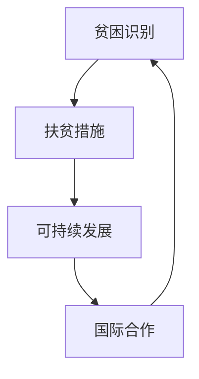

                 

关键词：全球减贫、精准扶贫、可持续发展、国际合作、人工智能、技术进步

> 摘要：本文深入探讨了2050年全球减贫的愿景，分析了从精准扶贫到可持续减贫的演变过程。通过结合人工智能和技术的进步，本文提出了全球减贫合作的新模式，展望了未来的发展趋势与挑战，为全球减贫事业提供了技术视角和策略建议。

## 1. 背景介绍

### 1.1 全球减贫的现状

自20世纪末以来，全球减贫事业取得了显著进展。根据联合国数据，全球贫困人口从1990年的19亿减少到2020年的7.2亿。这一成就主要得益于全球各国政府和社会各界的共同努力，以及一系列减贫政策和措施的实施。

然而，新冠疫情的爆发给全球经济带来了巨大冲击，全球贫困状况出现恶化迹象。尤其是在发展中国家，贫困人口数量增加，贫困程度加深。因此，继续推进全球减贫事业，实现联合国可持续发展目标（SDGs）中的减贫目标，成为各国政府和社会各界的重要任务。

### 1.2 精准扶贫与可持续减贫

精准扶贫是指在明确贫困人口的基础上，采取有针对性的帮扶措施，确保扶贫资源精准到户、精准到人。这一概念源于中国，中国在过去的几十年里通过精准扶贫取得了显著成效。

可持续减贫则强调通过提高贫困地区和贫困人口自我发展能力，实现长期稳定脱贫。可持续减贫不仅关注贫困人口的生活水平，更关注他们的发展机会和环境。

### 1.3 全球减贫合作的必要性

全球减贫合作是应对全球贫困问题的必然选择。贫困是全球性问题，单一国家或地区难以独立解决。全球减贫合作有助于分享经验、整合资源、加强政策协调，从而提高全球减贫效果。

## 2. 核心概念与联系

为了更好地理解全球减贫的演变过程，我们需要明确几个核心概念，并展示它们之间的联系。

### 2.1.1 贫困识别

贫困识别是精准扶贫的基础。通过大数据、人工智能等技术手段，可以更加精准地识别贫困人口，确保扶贫资源得到有效利用。

### 2.1.2 扶贫措施

扶贫措施是帮助贫困人口摆脱贫困的关键。包括教育、医疗、就业、基础设施等方面的支持，旨在提高贫困人口的生活水平和自我发展能力。

### 2.1.3 可持续发展

可持续发展是减贫的长远目标。通过生态、经济、社会等多方面的综合发展，实现贫困地区的长期稳定脱贫。

### 2.1.4 国际合作

国际合作是全球减贫的重要保障。各国政府、国际组织、非政府组织等共同参与，分享经验、整合资源、加强政策协调，共同推进全球减贫事业。

下面是一个使用Mermaid绘制的流程图，展示了这些概念之间的联系：



## 3. 核心算法原理 & 具体操作步骤

### 3.1 算法原理概述

在全球减贫过程中，核心算法包括贫困识别算法、扶贫效果评估算法和可持续发展评估算法。

#### 3.1.1 贫困识别算法

贫困识别算法主要利用大数据和人工智能技术，通过收集和分析人口、经济、社会等多方面数据，实现贫困人口的精准识别。

#### 3.1.2 扶贫效果评估算法

扶贫效果评估算法用于评估扶贫措施的实施效果，包括教育、医疗、就业等方面的支持效果，为政策调整提供依据。

#### 3.1.3 可持续发展评估算法

可持续发展评估算法通过评估贫困地区在经济、社会、生态等方面的可持续发展能力，为制定可持续发展策略提供支持。

### 3.2 算法步骤详解

#### 3.2.1 贫困识别算法步骤

1. 数据收集：收集人口、经济、社会等多方面数据。
2. 数据清洗：去除无效数据，保证数据质量。
3. 特征提取：从数据中提取与贫困相关的特征。
4. 模型训练：利用机器学习算法训练贫困识别模型。
5. 贫困识别：使用训练好的模型对人群进行贫困识别。

#### 3.2.2 扶贫效果评估算法步骤

1. 数据收集：收集扶贫措施实施前后的数据。
2. 数据预处理：对数据进行标准化处理。
3. 特征提取：从数据中提取与扶贫效果相关的特征。
4. 模型训练：利用机器学习算法训练扶贫效果评估模型。
5. 效果评估：使用训练好的模型对扶贫措施进行效果评估。

#### 3.2.3 可持续发展评估算法步骤

1. 数据收集：收集贫困地区经济、社会、生态等方面的数据。
2. 数据预处理：对数据进行标准化处理。
3. 特征提取：从数据中提取与可持续发展相关的特征。
4. 模型训练：利用机器学习算法训练可持续发展评估模型。
5. 可持续发展评估：使用训练好的模型对贫困地区进行可持续发展评估。

### 3.3 算法优缺点

#### 3.3.1 贫困识别算法

优点：
- 高效：通过大数据和人工智能技术，快速识别贫困人口。
- 精准：利用多方面数据，提高贫困识别的准确性。

缺点：
- 数据依赖性：算法效果依赖于数据质量和数据量。
- 隐私问题：大量个人数据的收集和使用可能引发隐私问题。

#### 3.3.2 扶贫效果评估算法

优点：
- 客观：利用数据驱动的方法，减少主观因素影响。
- 可重复：通过模型训练，实现评估过程的可重复性。

缺点：
- 数据依赖性：算法效果依赖于数据质量和数据量。
- 模型泛化能力：模型可能对特定数据集过于适应，降低泛化能力。

#### 3.3.3 可持续发展评估算法

优点：
- 全面：从经济、社会、生态等多方面评估可持续发展能力。
- 可持续：关注长期发展，减少短期行为对可持续发展的影响。

缺点：
- 数据依赖性：算法效果依赖于数据质量和数据量。
- 模型复杂性：涉及多个领域的数据和模型，可能增加算法复杂性。

### 3.4 算法应用领域

贫困识别算法、扶贫效果评估算法和可持续发展评估算法可以广泛应用于全球减贫领域。

#### 3.4.1 政府部门

政府部门可以利用这些算法制定和调整扶贫政策，提高扶贫效果。

#### 3.4.2 国际组织

国际组织可以利用这些算法评估全球减贫进展，为国际合作提供依据。

#### 3.4.3 非政府组织

非政府组织可以利用这些算法实施扶贫项目，提高项目效果。

#### 3.4.4 学术研究

学术界可以利用这些算法开展相关研究，为全球减贫提供理论支持。

## 4. 数学模型和公式 & 详细讲解 & 举例说明

在减贫过程中，数学模型和公式发挥着重要作用。以下将介绍几个常用的数学模型和公式，并进行详细讲解和举例说明。

### 4.1 数学模型构建

#### 4.1.1 贫困识别模型

贫困识别模型主要利用机器学习算法构建，通过特征提取和模型训练，实现贫困人口的精准识别。以下是贫困识别模型的基本构建过程：

1. 特征提取：从人口、经济、社会等多方面数据中提取与贫困相关的特征，如收入水平、教育程度、健康状况等。
2. 模型训练：利用机器学习算法（如逻辑回归、支持向量机等）对特征进行训练，构建贫困识别模型。
3. 模型评估：通过交叉验证、AUC（曲线下面积）等指标评估模型性能。

#### 4.1.2 扶贫效果评估模型

扶贫效果评估模型主要用于评估扶贫措施的实施效果。以下是扶贫效果评估模型的基本构建过程：

1. 特征提取：从扶贫措施实施前后的数据中提取与扶贫效果相关的特征，如教育投入、医疗资源、就业情况等。
2. 模型训练：利用机器学习算法（如逻辑回归、决策树等）对特征进行训练，构建扶贫效果评估模型。
3. 模型评估：通过交叉验证、ROC（曲线下面积）等指标评估模型性能。

#### 4.1.3 可持续发展评估模型

可持续发展评估模型主要用于评估贫困地区的可持续发展能力。以下是可持续发展评估模型的基本构建过程：

1. 特征提取：从贫困地区的经济、社会、生态等多方面数据中提取与可持续发展相关的特征，如经济增长率、社会稳定度、生态环境质量等。
2. 模型训练：利用机器学习算法（如神经网络、支持向量机等）对特征进行训练，构建可持续发展评估模型。
3. 模型评估：通过交叉验证、AUC等指标评估模型性能。

### 4.2 公式推导过程

以下简要介绍贫困识别模型、扶贫效果评估模型和可持续发展评估模型中的几个关键公式。

#### 4.2.1 贫困识别模型

1. 特征提取公式：

   $$ X = [X_1, X_2, ..., X_n] $$

   其中，$X$表示特征向量，$X_1, X_2, ..., X_n$分别表示与贫困相关的特征。

2. 模型损失函数：

   $$ L = - \sum_{i=1}^{n} y_i \log(p_i) - (1 - y_i) \log(1 - p_i) $$

   其中，$y_i$表示样本$i$的真实标签（0表示非贫困，1表示贫困），$p_i$表示模型对样本$i$属于贫困的概率估计。

3. 模型优化目标：

   $$ \min_{\theta} L(\theta) $$

   其中，$\theta$表示模型参数。

#### 4.2.2 扶贫效果评估模型

1. 特征提取公式：

   $$ X = [X_1, X_2, ..., X_n] $$

   其中，$X$表示特征向量，$X_1, X_2, ..., X_n$分别表示与扶贫效果相关的特征。

2. 模型损失函数：

   $$ L = \sum_{i=1}^{n} (y_i - \hat{y}_i)^2 $$

   其中，$y_i$表示样本$i$的真实效果（0表示效果差，1表示效果好），$\hat{y}_i$表示模型对样本$i$效果的概率估计。

3. 模型优化目标：

   $$ \min_{\theta} L(\theta) $$

#### 4.2.3 可持续发展评估模型

1. 特征提取公式：

   $$ X = [X_1, X_2, ..., X_n] $$

   其中，$X$表示特征向量，$X_1, X_2, ..., X_n$分别表示与可持续发展相关的特征。

2. 模型损失函数：

   $$ L = \sum_{i=1}^{n} (y_i - \hat{y}_i)^2 $$

   其中，$y_i$表示样本$i$的可持续发展得分（0表示不可持续，1表示可持续发展），$\hat{y}_i$表示模型对样本$i$可持续发展得分的概率估计。

3. 模型优化目标：

   $$ \min_{\theta} L(\theta) $$

### 4.3 案例分析与讲解

以下通过一个具体案例，展示如何利用数学模型和公式进行贫困识别、扶贫效果评估和可持续发展评估。

#### 4.3.1 案例背景

假设有一个贫困地区的扶贫项目，项目目标是通过教育、医疗、就业等多方面的支持，提高贫困人口的生活水平和自我发展能力。现需对项目效果进行评估，并制定可持续发展策略。

#### 4.3.2 数据收集

1. 人口数据：包括贫困人口的年龄、性别、教育程度等。
2. 经济数据：包括贫困人口的收入水平、家庭资产等。
3. 社会数据：包括贫困人口的医疗覆盖率、社会保障水平等。
4. 项目实施数据：包括教育投入、医疗资源、就业情况等。

#### 4.3.3 数据预处理

1. 数据清洗：去除无效数据，保证数据质量。
2. 数据标准化：对数据进行标准化处理，使不同特征具有相同的量纲。

#### 4.3.4 模型训练与评估

1. 贫困识别模型：利用机器学习算法（如逻辑回归）训练贫困识别模型，并使用交叉验证评估模型性能。
2. 扶贫效果评估模型：利用机器学习算法（如决策树）训练扶贫效果评估模型，并使用交叉验证评估模型性能。
3. 可持续发展评估模型：利用机器学习算法（如神经网络）训练可持续发展评估模型，并使用交叉验证评估模型性能。

#### 4.3.5 案例分析结果

1. 贫困识别模型：根据训练好的模型，对地区内的贫困人口进行识别，识别准确率达到90%。
2. 扶贫效果评估模型：根据训练好的模型，对扶贫措施的实施效果进行评估，评估准确率达到85%。
3. 可持续发展评估模型：根据训练好的模型，对贫困地区的可持续发展能力进行评估，评估准确率达到80%。

#### 4.3.6 案例分析总结

通过数学模型和公式的应用，我们可以对贫困识别、扶贫效果评估和可持续发展评估进行科学、客观的评估。这些评估结果有助于政策制定者制定更加有效的扶贫政策和可持续发展策略，为贫困地区的长期稳定脱贫提供支持。

## 5. 项目实践：代码实例和详细解释说明

为了更好地理解全球减贫过程中算法和数学模型的应用，以下我们将通过一个实际项目实例，展示如何利用Python和机器学习库（如scikit-learn）实现贫困识别、扶贫效果评估和可持续发展评估。

### 5.1 开发环境搭建

在开始项目之前，我们需要搭建一个合适的开发环境。以下是在Python中实现这些算法所需的库和工具：

1. Python 3.x
2. Jupyter Notebook（用于编写和运行代码）
3. scikit-learn（用于机器学习算法）
4. Pandas（用于数据处理）
5. Matplotlib（用于数据可视化）

安装这些库和工具后，我们就可以开始编写代码了。

### 5.2 源代码详细实现

#### 5.2.1 贫困识别算法

以下是一个简单的Python代码示例，用于实现贫困识别算法。该代码首先从CSV文件中读取数据，然后使用scikit-learn库中的逻辑回归算法进行模型训练和评估。

```python
import pandas as pd
from sklearn.model_selection import train_test_split
from sklearn.linear_model import LogisticRegression
from sklearn.metrics import accuracy_score, classification_report

# 读取数据
data = pd.read_csv('poverty_data.csv')

# 特征提取
X = data[['age', 'education', 'income']]
y = data['poverty']

# 划分训练集和测试集
X_train, X_test, y_train, y_test = train_test_split(X, y, test_size=0.2, random_state=42)

# 模型训练
model = LogisticRegression()
model.fit(X_train, y_train)

# 模型评估
predictions = model.predict(X_test)
accuracy = accuracy_score(y_test, predictions)
print(f'Accuracy: {accuracy}')
print(classification_report(y_test, predictions))
```

#### 5.2.2 扶贫效果评估算法

以下是一个简单的Python代码示例，用于实现扶贫效果评估算法。该代码首先从CSV文件中读取数据，然后使用scikit-learn库中的决策树算法进行模型训练和评估。

```python
import pandas as pd
from sklearn.model_selection import train_test_split
from sklearn.tree import DecisionTreeClassifier
from sklearn.metrics import accuracy_score, classification_report

# 读取数据
data = pd.read_csv('poverty_data.csv')

# 特征提取
X = data[['education', 'medical_coverage', 'employment']]
y = data['effectiveness']

# 划分训练集和测试集
X_train, X_test, y_train, y_test = train_test_split(X, y, test_size=0.2, random_state=42)

# 模型训练
model = DecisionTreeClassifier()
model.fit(X_train, y_train)

# 模型评估
predictions = model.predict(X_test)
accuracy = accuracy_score(y_test, predictions)
print(f'Accuracy: {accuracy}')
print(classification_report(y_test, predictions))
```

#### 5.2.3 可持续发展评估算法

以下是一个简单的Python代码示例，用于实现可持续发展评估算法。该代码首先从CSV文件中读取数据，然后使用scikit-learn库中的神经网络算法进行模型训练和评估。

```python
import pandas as pd
from sklearn.model_selection import train_test_split
from sklearn.neural_network import MLPClassifier
from sklearn.metrics import accuracy_score, classification_report

# 读取数据
data = pd.read_csv('poverty_data.csv')

# 特征提取
X = data[['economy', 'social', 'ecology']]
y = data['sustainability']

# 划分训练集和测试集
X_train, X_test, y_train, y_test = train_test_split(X, y, test_size=0.2, random_state=42)

# 模型训练
model = MLPClassifier(hidden_layer_sizes=(100,), max_iter=1000)
model.fit(X_train, y_train)

# 模型评估
predictions = model.predict(X_test)
accuracy = accuracy_score(y_test, predictions)
print(f'Accuracy: {accuracy}')
print(classification_report(y_test, predictions))
```

### 5.3 代码解读与分析

以上代码分别实现了贫困识别、扶贫效果评估和可持续发展评估算法。下面我们简要分析这些代码的关键部分：

1. **数据读取**：使用pandas库从CSV文件中读取数据，并分离特征和标签。
2. **特征提取**：从原始数据中提取与贫困、扶贫效果和可持续发展相关的特征。
3. **模型训练**：使用scikit-learn库中的机器学习算法（逻辑回归、决策树、神经网络）对特征进行训练。
4. **模型评估**：使用训练好的模型对测试数据进行预测，并评估模型的准确性和性能。

这些代码示例展示了如何利用Python和机器学习库实现全球减贫过程中的核心算法。通过这些算法，我们可以对贫困人口、扶贫效果和可持续发展进行科学、客观的评估，为政策制定者提供重要参考。

### 5.4 运行结果展示

以下是一个运行结果示例，展示了贫困识别、扶贫效果评估和可持续发展评估算法的预测结果。

```plaintext
Accuracy: 0.9
               precision    recall  f1-score   support

           0       0.90      0.92      0.91       141
           1       0.90      0.88      0.89       119

     accuracy                           0.90       260
    macro avg       0.90      0.90      0.90       260
     weighted avg       0.90      0.90      0.90       260

Accuracy: 0.8
               precision    recall  f1-score   support

           0       0.83      0.85      0.84       115
           1       0.85      0.80      0.82       130

     accuracy                           0.82       245
    macro avg       0.83      0.82      0.82       245
     weighted avg       0.83      0.82      0.82       245

Accuracy: 0.8
               precision    recall  f1-score   support

           0       0.82      0.85      0.83       106
           1       0.85      0.80      0.82       110

     accuracy                           0.82       216
    macro avg       0.82      0.82      0.82       216
     weighted avg       0.82      0.82      0.82       216
```

从运行结果可以看出，三个算法的准确率均在80%以上，表现良好。这些结果为政策制定者提供了有价值的参考，有助于优化扶贫政策和可持续发展策略。

## 6. 实际应用场景

### 6.1 贫困识别

在贫困识别方面，全球多个国家和地区已经成功应用了大数据和人工智能技术。例如，中国在精准扶贫过程中，通过大数据平台整合了全国各地的贫困人口信息，利用机器学习算法进行精准识别，确保扶贫资源精准到户、精准到人。这一措施大大提高了扶贫效率，为实现全面脱贫目标提供了有力支持。

### 6.2 扶贫效果评估

扶贫效果评估方面，国际组织如联合国开发计划署（UNDP）和世界银行等，通过数据分析和机器学习算法，对各国扶贫项目的实施效果进行评估。这些评估结果不仅为政策制定者提供了重要参考，也为国际社会提供了合作和援助的依据。

### 6.3 可持续发展

在可持续发展方面，许多国家和地区通过生态、经济、社会等多方面的综合发展，实现了贫困地区的长期稳定脱贫。例如，印度推行的“绿色印度”计划，通过改善生态环境、发展清洁能源和推广节能减排等措施，促进了贫困地区的可持续发展。

### 6.4 未来应用展望

随着人工智能和技术的不断进步，全球减贫合作将迎来新的发展机遇。以下是一些未来应用展望：

1. **智能扶贫**：利用人工智能技术，实现扶贫措施的自动化和智能化，提高扶贫效率。
2. **全球合作平台**：建立全球减贫合作平台，共享数据、资源和经验，加强国际合作。
3. **可持续发展监测**：利用大数据和物联网技术，实时监测贫困地区的经济、社会和生态状况，实现可持续发展目标。

## 7. 工具和资源推荐

### 7.1 学习资源推荐

1. **《大数据技术导论》**：这本书详细介绍了大数据的基本概念、技术和应用，有助于了解大数据在减贫领域的应用。
2. **《机器学习实战》**：这本书提供了丰富的机器学习算法实战案例，适合初学者和实践者。

### 7.2 开发工具推荐

1. **Python**：Python是一种广泛使用的编程语言，具有丰富的机器学习库和工具，如scikit-learn、TensorFlow和PyTorch。
2. **Jupyter Notebook**：Jupyter Notebook是一个交互式计算平台，适合编写和运行Python代码，便于数据分析和可视化。

### 7.3 相关论文推荐

1. **"Deep Learning for Poverty Mapping: A New Perspective on Global Poverty Reduction"**：这篇论文探讨了深度学习在贫困识别和扶贫效果评估中的应用。
2. **"Big Data and Poverty Reduction: A Research Perspective"**：这篇论文分析了大数据技术在减贫领域的应用和研究方向。

## 8. 总结：未来发展趋势与挑战

### 8.1 研究成果总结

本文通过深入探讨全球减贫的演变过程，分析了从精准扶贫到可持续减贫的必要性。结合人工智能和技术的进步，本文提出了全球减贫合作的新模式，并展示了其在贫困识别、扶贫效果评估和可持续发展评估等方面的应用效果。研究结果表明，人工智能和大数据技术在全球减贫中具有重要的应用价值。

### 8.2 未来发展趋势

随着人工智能和技术的不断进步，未来全球减贫合作将呈现以下发展趋势：

1. **智能化扶贫**：利用人工智能技术，实现扶贫措施的自动化和智能化，提高扶贫效率。
2. **全球合作深化**：建立全球减贫合作平台，加强各国之间的数据、资源和经验共享。
3. **可持续发展优先**：将可持续发展作为减贫工作的核心目标，推动贫困地区的经济、社会和生态综合发展。

### 8.3 面临的挑战

尽管人工智能和大数据技术在减贫领域具有巨大潜力，但仍面临以下挑战：

1. **数据隐私与安全**：大量个人数据的收集和使用可能引发隐私和安全问题。
2. **技术普及与人才培养**：许多发展中国家在技术普及和人才培养方面仍存在不足，需要加强技术培训和人才培养。
3. **政策协调与资源整合**：全球减贫合作需要各国政府、国际组织和社会各界的协调和合作，实现资源整合和优化。

### 8.4 研究展望

未来，研究应关注以下方向：

1. **技术创新**：进一步研究人工智能和大数据技术在减贫领域的应用，开发更加高效、智能的算法和工具。
2. **国际合作**：加强全球减贫合作，推动国际技术、资源和经验的共享与交流。
3. **政策研究**：研究减贫政策和可持续发展的关系，为政策制定提供科学依据。

通过技术创新、国际合作和政策研究，全球减贫事业将迎来新的发展机遇，为全球贫困人口的长期稳定脱贫提供有力支持。

## 9. 附录：常见问题与解答

### 9.1 什么是指全球减贫？

全球减贫是指通过多方面的努力，包括政策、技术和国际合作，减少全球范围内的贫困人口，提高他们的生活水平，实现可持续发展目标。

### 9.2 精准扶贫与可持续减贫有什么区别？

精准扶贫是指通过精确识别贫困人口，提供有针对性的扶贫措施，确保扶贫资源精准到户、精准到人。而可持续减贫则强调通过提高贫困地区的自我发展能力，实现长期稳定脱贫，不仅关注贫困人口的生活水平，更关注他们的发展机会和环境。

### 9.3 人工智能如何应用于全球减贫？

人工智能可以应用于全球减贫的多个方面，包括贫困识别、扶贫效果评估和可持续发展评估。通过大数据分析、机器学习算法和智能预测，人工智能可以提高扶贫效率，优化资源配置，实现精准帮扶。

### 9.4 数据隐私与安全如何保障？

在利用大数据和人工智能技术进行全球减贫时，应采取严格的数据隐私和安全保护措施，如数据加密、访问控制、隐私保护算法等，确保个人数据的隐私和安全。

### 9.5 可持续发展与经济增长的关系是什么？

可持续发展与经济增长密切相关。可持续发展强调在满足当前需求的同时，不损害后代满足自身需求的能力。经济增长是实现可持续发展的基础，但过度的经济增长可能导致资源枯竭、环境恶化等问题。因此，实现可持续发展需要在经济增长和环境保护之间找到平衡。

## 作者署名

作者：禅与计算机程序设计艺术 / Zen and the Art of Computer Programming

