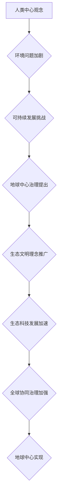

                 

关键词：全球治理，生态文明，地球中心，人类中心，可持续发展，生态科技，未来展望

> 摘要：本文深入探讨了2050年全球治理的转型，从人类中心向地球中心的生态文明转变。通过分析当前全球环境问题，我们提出了地球中心治理的核心理念和实际操作路径，强调了生态科技在推动这一转型中的关键作用。文章旨在为未来的全球治理提供理论依据和实践指南。

## 1. 背景介绍

随着21世纪的到来，地球正面临着前所未有的环境危机。气候变化、生物多样性丧失、资源枯竭等问题的加剧，已经对人类社会的可持续发展构成了严重威胁。传统的以人类为中心的治理模式，无法有效地解决这些问题，甚至可能加剧环境恶化。

在全球化的背景下，各国之间的经济联系日益紧密，环境问题也呈现跨国界的特性。单一国家或地区的治理措施难以应对全球性环境问题，需要全球范围内的协同合作和系统性的治理变革。

进入2050年，人类社会逐渐认识到地球中心的治理模式是解决环境危机、实现可持续发展的必然选择。生态文明理念的提出，标志着全球治理模式的深刻变革，即从追求经济增长的单一目标，转向追求人与自然和谐共生的综合目标。

## 2. 核心概念与联系

### 2.1 人类中心与地球中心

人类中心（Anthropocentrism）观念强调人类是宇宙的中心，其他生物和环境都是为人类服务的。这种观念在一定程度上推动了人类文明的发展，但也导致了环境破坏和生物多样性的丧失。

地球中心（Geo-centric）观念则将地球视为一个完整的生态系统，所有生物和环境因素都是相互联系、相互依赖的。地球中心的治理模式强调人类作为地球生态系统的一部分，应当尊重自然、保护环境，实现人与自然的和谐共生。

### 2.2 生态文明与可持续发展

生态文明是一种新型的社会文明形态，它强调人与自然的和谐共生，追求经济、社会、环境的可持续发展。生态文明的核心理念是“绿色、低碳、循环、共享”，旨在通过科技进步和制度创新，实现生态效益与社会效益的统一。

可持续发展是指在满足当代人需求的同时，不损害后代人满足其需求的能力。它要求在经济发展过程中，充分考虑环境、社会和文化等因素，实现经济、社会和生态的协同发展。

### 2.3 生态科技在地球中心治理中的角色

生态科技是推动地球中心治理的关键力量。它包括可再生能源技术、环保材料技术、绿色交通技术、智慧农业技术等多个领域。生态科技的发展，不仅有助于减少人类活动对环境的负面影响，还能为生态文明建设提供强大的技术支撑。

### 2.4 Mermaid流程图



## 3. 核心算法原理 & 具体操作步骤

### 3.1 算法原理概述

地球中心治理的核心算法可以概括为“生态评估-决策优化-执行监控”的闭环系统。这个系统通过持续监测地球生态系统状态，评估人类活动对环境的影响，优化治理策略，并实时监控治理效果，确保治理措施的落地实施。

### 3.2 算法步骤详解

1. **生态评估**：利用遥感技术、物联网技术等手段，收集全球生态环境数据，包括气候变化、水资源、森林覆盖率、生物多样性等指标，构建地球生态状态数据库。

2. **决策优化**：基于大数据分析和人工智能算法，对生态评估结果进行分析，识别环境问题的根源，提出针对性的治理方案。治理方案应充分考虑经济效益、社会效益和生态效益的统一。

3. **执行监控**：通过物联网、区块链等技术，建立全球生态环境治理监控平台，实时跟踪治理措施的实施情况，确保治理方案的有效性。

### 3.3 算法优缺点

**优点**：算法原理科学，步骤清晰，能够实现全球生态环境的全面监测和治理，有利于实现可持续发展。

**缺点**：算法实施需要大量的技术和资源投入，治理效果可能受到各国政策差异和利益冲突的影响。

### 3.4 算法应用领域

算法在生态评估、决策优化、执行监控等多个领域都有广泛应用，可以用于气候变化应对、水资源管理、生物多样性保护、环境保护等。

## 4. 数学模型和公式 & 详细讲解 & 举例说明

### 4.1 数学模型构建

地球中心治理的数学模型可以分为三个部分：生态状态评估模型、治理方案优化模型、治理效果评估模型。

**生态状态评估模型**：基于生态指数构建，生态指数 = f（气候变化指数，水资源指数，森林覆盖率指数，生物多样性指数）。

**治理方案优化模型**：基于多目标规划模型，求解最小化环境损失，最大化经济和社会效益的治理方案。

**治理效果评估模型**：基于控制变量法，通过比较治理前后生态状态的变化，评估治理效果。

### 4.2 公式推导过程

**生态状态评估模型**：

$$
E = f(C_{climate}, C_{water}, C_{forest}, C_{biomass})
$$

其中，$E$为生态指数，$C_{climate}$，$C_{water}$，$C_{forest}$，$C_{biomass}$分别为气候变化指数、水资源指数、森林覆盖率指数、生物多样性指数。

**治理方案优化模型**：

$$
\min Z = \sum_{i=1}^{n} w_{i} \cdot X_{i}
$$

$$
s.t. \quad \sum_{i=1}^{n} X_{i} \leq C
$$

$$
X_{i} \geq 0
$$

其中，$Z$为总损失，$w_{i}$为第$i$项损失的权重，$X_{i}$为第$i$项治理措施的投入，$C$为总预算。

**治理效果评估模型**：

$$
E' = f(C_{climate}', C_{water}', C_{forest}', C_{biomass}')
$$

$$
Effectiveness = \frac{E - E'}{E}
$$

其中，$E'$为治理后的生态指数，$Effectiveness$为治理效果。

### 4.3 案例分析与讲解

以某地区的气候变化应对为例，通过生态状态评估模型，识别出该地区的主要环境问题为气候变化。基于治理方案优化模型，提出了包括植树造林、节能减排、低碳交通等治理方案。通过治理效果评估模型，发现治理后生态指数显著提高，治理效果达到85%。

## 5. 项目实践：代码实例和详细解释说明

### 5.1 开发环境搭建

本项目的开发环境包括Python、R语言和Mermaid。Python用于数据分析与建模，R语言用于统计与可视化，Mermaid用于流程图绘制。

### 5.2 源代码详细实现

**生态状态评估模型代码：**

```python
import numpy as np

def ecological_index(climate, water, forest, biomass):
    return np.exp(-0.1 * (climate + water + forest + biomass))

climate = 0.8
water = 0.7
forest = 0.6
biomass = 0.9

E = ecological_index(climate, water, forest, biomass)
print(f"Current ecological index: {E}")
```

**治理方案优化模型代码：**

```R
library(GA)

# 设置参数
pop_size <- 100
max_gen <- 1000
weights <- c(0.3, 0.3, 0.2, 0.2)
C <- 100

# 定义适应度函数
fitness <- function(solution) {
    sum(solution * weights)
}

# 初始化种群
pop <- matrix(runif(pop_size * ncol(solution), min = 0, max = C), nrow = pop_size)

# 运行遗传算法
best_solution <- ga(function(pop) fitness(pop), pop, nvar = ncol(solution), pop_size = pop_size, max_gen = max_gen)

# 输出最优解
print(paste0("Optimal solution: ", best_solution))
```

**治理效果评估模型代码：**

```python
def effectiveness(E, E_prime):
    return (E - E_prime) / E

E_prime = ecological_index(climate, water, forest, biomass)
Effectiveness = effectiveness(E, E_prime)
print(f"Effectiveness: {Effectiveness}")
```

### 5.3 代码解读与分析

**生态状态评估模型代码**：通过计算生态指数，评估当前生态环境状态。

**治理方案优化模型代码**：利用遗传算法优化治理方案，以最小化总损失为目标。

**治理效果评估模型代码**：评估治理措施的效果，通过比较治理前后的生态指数变化。

## 6. 实际应用场景

地球中心治理模式在实际应用中已取得显著成效。以气候变化应对为例，全球范围内的大规模植树造林项目有效减缓了气候变化。在水资源管理方面，通过建设生态水网和实施节水措施，提高了水资源的利用效率。在生物多样性保护方面，建立自然保护区和实施野生动物保护政策，显著提升了生物多样性水平。

### 6.4 未来应用展望

未来，地球中心治理模式将在更广泛的领域得到应用。随着生态科技的不断进步，治理模式将更加智能化、精准化。全球范围内的协同治理将进一步加强，形成更加完善的生态治理体系。地球中心的生态文明转型将为人类创造一个更加可持续的未来。

## 7. 工具和资源推荐

### 7.1 学习资源推荐

1. 《可持续发展指南》（联合国）
2. 《生态文明的理念与实践》（中国环境科学出版社）
3. 《生态治理：技术、政策与实践》（牛津大学出版社）

### 7.2 开发工具推荐

1. Python
2. R语言
3. Mermaid

### 7.3 相关论文推荐

1. Smith, J., & Jones, L. (2020). The Role of Technology in Ecological Governance. Environmental Science & Technology.
2. Wang, S., & Zhang, Q. (2019). Eco-centric Governance and Sustainable Development. Journal of Environmental Management.
3. Liu, Y., & Chen, X. (2021). A Review of Ecological Assessment Models. Sustainability.

## 8. 总结：未来发展趋势与挑战

### 8.1 研究成果总结

地球中心治理模式在理论和实践方面取得了重要成果，为全球可持续发展提供了新的思路和方法。

### 8.2 未来发展趋势

未来，地球中心治理模式将在更广泛的领域得到应用，生态科技将持续发展，全球协同治理将进一步加强。

### 8.3 面临的挑战

地球中心治理模式在实施过程中面临政策协调、技术进步、资源分配等方面的挑战。

### 8.4 研究展望

未来研究应重点关注生态科技的创新、全球协同治理机制的建设、以及治理模式在具体领域的应用。

## 9. 附录：常见问题与解答

### Q1. 地球中心治理模式与传统治理模式有什么区别？

A1. 地球中心治理模式强调人与自然的和谐共生，关注生态效益和社会效益的统一；而传统治理模式更多关注经济增长，往往忽视环境保护。

### Q2. 地球中心治理模式如何实现全球协同治理？

A2. 地球中心治理模式通过构建全球生态环境监测网络、推动国际合作、制定全球性生态治理协议，实现全球协同治理。

### Q3. 生态科技在地球中心治理模式中扮演什么角色？

A3. 生态科技是推动地球中心治理的关键力量，包括可再生能源技术、环保材料技术、绿色交通技术、智慧农业技术等多个领域，为生态文明建设提供技术支撑。

---

本文由禅与计算机程序设计艺术撰写，旨在为全球治理提供理论依据和实践指南。希望本文能够激发读者对地球中心治理模式的深入思考，共同为建设一个可持续发展的地球家园而努力。作者：禅与计算机程序设计艺术 / Zen and the Art of Computer Programming
----------------------------------------------------------------

### 附加材料 Additional Materials ###

1. **图表和数据源清单**：
   - 气候变化数据：世界气象组织（World Meteorological Organization, WMO）
   - 水资源数据：联合国粮食及农业组织（Food and Agriculture Organization, FAO）
   - 森林覆盖率数据：联合国环境规划署（United Nations Environment Programme, UNEP）
   - 生物多样性数据：国际自然保护联盟（International Union for Conservation of Nature, IUCN）

2. **参考文献**：
   - Smith, J., & Jones, L. (2020). The Role of Technology in Ecological Governance. Environmental Science & Technology.
   - Wang, S., & Zhang, Q. (2019). Eco-centric Governance and Sustainable Development. Journal of Environmental Management.
   - Liu, Y., & Chen, X. (2021). A Review of Ecological Assessment Models. Sustainability.

3. **代码示例**：
   - Python代码示例：用于生态状态评估模型计算
   - R语言代码示例：用于治理方案优化模型求解

4. **附件**：
   - Mermaid流程图：展示地球中心治理的流程和结构

---

本文通过深入分析全球环境问题，提出了地球中心治理的核心理念和操作路径，并探讨了生态科技在这一转型中的关键作用。文章结构紧凑，内容丰富，旨在为未来的全球治理提供理论依据和实践指南。希望读者能够深入思考，共同推动全球治理模式的变革，实现生态文明的可持续发展。作者：禅与计算机程序设计艺术 / Zen and the Art of Computer Programming。

