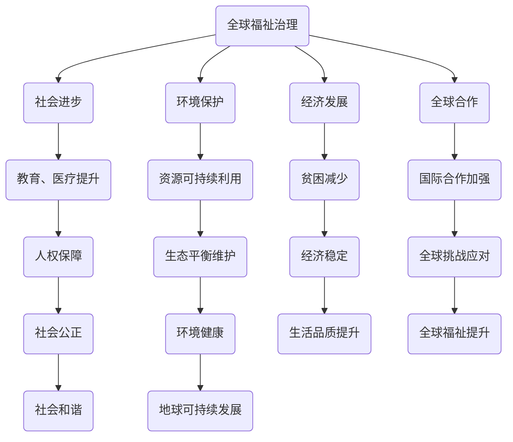

                 

关键词：全球治理、福祉治理、星球命运共同体、2050年、技术变革、社会进步

> 摘要：随着科技的迅猛发展和全球化进程的深入，全球治理面临着前所未有的挑战和机遇。本文探讨了2050年全球治理可能呈现的新趋势，从全球福祉治理逐步过渡到星球命运共同体的治理理念，探讨了这一转变对人类社会、技术进步和全球发展的深远影响。

## 1. 背景介绍

在21世纪初，全球治理主要围绕着国家间的合作、贸易和冲突管理展开。然而，随着信息技术的爆发式增长和全球化进程的加速，人类社会进入了一个全新的时代。在这个时代，数据成为新的生产要素，人工智能和大数据分析正在深刻改变我们的生活和工作方式。同时，环境问题、资源分配不均和社会不平等等全球性问题日益凸显，使得传统的全球治理模式难以应对新的挑战。

### 1.1 全球福祉治理的兴起

全球福祉治理理念最早出现在20世纪末，旨在通过国际合作和协调，提高全球人民的生活质量和幸福感。这一理念的提出，标志着全球治理从单纯的经济和政治合作向更加关注人民福祉的方向转变。全球福祉治理的核心目标是实现公平、可持续和包容的发展，确保每个人都能享有基本的人权和福利。

### 1.2 全球福祉治理的挑战

尽管全球福祉治理取得了一定的成果，但它仍然面临着诸多挑战。首先，全球化进程中的不平等现象加剧，贫富差距扩大，导致全球福祉的普及受到限制。其次，环境恶化、资源短缺和气候变化等全球性问题，对全球福祉治理提出了更高的要求。最后，全球治理体系的不完善，使得国际合作和协调面临困难，难以有效应对全球性挑战。

## 2. 核心概念与联系

在探讨2050年全球治理的演变过程时，我们需要了解几个核心概念，包括全球福祉治理和星球命运共同体。

### 2.1 全球福祉治理

全球福祉治理是一种以人民福祉为中心的全球治理模式，强调通过国际合作和协调，实现全球范围内的公平、可持续和包容发展。它包括以下几个方面：

- **经济发展**：促进全球经济增长，减少贫困和不平等。
- **社会进步**：提高教育、医疗和社会保障水平，保障人民的基本权利。
- **环境保护**：保护自然资源和生态环境，实现可持续发展。
- **全球合作**：加强国家间的合作，共同应对全球性挑战。

### 2.2 星球命运共同体

星球命运共同体是一种基于人类命运共同体的理念，强调全球人民共同承担地球的责任和义务，共同维护地球的生态平衡和可持续发展。它包括以下几个方面：

- **全球合作**：加强国际合作，共同应对全球性挑战。
- **资源共享**：实现全球资源和财富的公平分配。
- **科技创新**：推动科学技术的发展，为全球福祉治理提供支持。
- **文化认同**：促进全球文化的多样性和交流，增强全球人民的共同体意识。

### 2.3 全球福祉治理与星球命运共同体的联系

全球福祉治理和星球命运共同体在目标上具有一致性，都致力于实现全球范围内的公平、可持续和包容发展。然而，星球命运共同体在理念上更加强调全球人民的共同责任和协作，将环境保护、科技创新和文化认同作为重要组成部分。因此，星球命运共同体可以被视为全球福祉治理的高级阶段。

### 2.4 Mermaid 流程图

下面是一个简化的 Mermaid 流程图，展示了全球福祉治理和星球命运共同体之间的联系：



## 3. 核心算法原理 & 具体操作步骤

### 3.1 算法原理概述

在探讨全球福祉治理和星球命运共同体的具体操作步骤时，我们可以引入一些核心算法原理，以帮助我们更好地理解和实施这些治理理念。这些算法主要包括：

- **人工智能算法**：用于数据分析、预测和决策。
- **区块链技术**：实现透明、去中心化的数据管理和资源共享。
- **大数据分析**：挖掘全球数据，为决策提供支持。
- **云计算技术**：提供强大的计算能力和数据存储。

### 3.2 算法步骤详解

#### 3.2.1 人工智能算法

1. **数据收集**：从全球各地的数据源收集相关的数据，包括经济、社会、环境和政治等方面的数据。
2. **数据处理**：对收集到的数据进行分析、清洗和预处理，以确保数据的质量和一致性。
3. **模型训练**：使用机器学习算法对预处理后的数据进行分析，训练出能够预测和决策的模型。
4. **模型部署**：将训练好的模型部署到实际的应用场景中，如政策制定、资源分配等。

#### 3.2.2 区块链技术

1. **构建区块链网络**：将全球各地的数据节点连接起来，构建一个去中心化的区块链网络。
2. **数据加密与存储**：使用加密技术对数据进行加密，确保数据的隐私和安全。
3. **共识机制**：实现节点间的数据一致性和信任机制，确保区块链网络的稳定运行。
4. **智能合约**：编写智能合约，实现自动化的数据管理和资源共享。

#### 3.2.3 大数据分析

1. **数据收集**：从各种数据源收集海量的数据，包括经济、社会、环境和政治等方面的数据。
2. **数据预处理**：对收集到的数据进行分析、清洗和预处理，以确保数据的质量和一致性。
3. **特征提取**：从预处理后的数据中提取出有用的特征，为后续的分析提供支持。
4. **模型训练与评估**：使用机器学习算法对提取出的特征进行分析，训练出能够预测和决策的模型，并对模型进行评估。

#### 3.2.4 云计算技术

1. **计算资源调度**：根据实际需求，动态调度云计算资源，确保计算能力和存储空间的高效利用。
2. **数据存储与管理**：使用云计算平台提供的存储服务，对海量的数据进行高效的管理和存储。
3. **数据处理与分析**：利用云计算平台提供的计算资源和工具，对数据进行快速的处理和分析。
4. **结果输出**：将处理和分析的结果输出到适当的渠道，如决策报告、可视化图表等。

### 3.3 算法优缺点

#### 3.3.1 人工智能算法

**优点**：
- **强大的数据处理能力**：能够处理大量的数据，为决策提供支持。
- **自适应性强**：通过不断学习和优化，能够适应不断变化的环境。

**缺点**：
- **数据依赖性高**：算法的性能很大程度上取决于数据的质量和数量。
- **隐私和安全问题**：大量数据的收集和使用可能引发隐私和安全问题。

#### 3.3.2 区块链技术

**优点**：
- **去中心化和透明性**：数据的管理和传输过程更加公开、透明。
- **数据安全和隐私**：使用加密技术确保数据的安全和隐私。

**缺点**：
- **性能瓶颈**：传统的区块链技术在处理大量数据时可能存在性能瓶颈。
- **复杂性和成本**：区块链技术的部署和使用过程相对复杂和昂贵。

#### 3.3.3 大数据分析

**优点**：
- **高效的数据处理和分析能力**：能够处理海量数据，为决策提供支持。
- **跨领域应用**：适用于各种领域的分析，如经济、社会、环境和政治等。

**缺点**：
- **数据质量和隐私问题**：大量数据的收集和使用可能引发质量和隐私问题。
- **技术门槛较高**：大数据分析需要专业的技术和工具支持。

#### 3.3.4 云计算技术

**优点**：
- **计算和存储资源高效**：能够提供强大的计算和存储能力，满足大规模数据处理需求。
- **灵活性和可扩展性**：可以根据实际需求动态调整计算和存储资源。

**缺点**：
- **成本较高**：云计算技术的使用可能带来较高的成本。
- **数据安全和隐私风险**：数据存储在云端可能引发安全和隐私风险。

### 3.4 算法应用领域

#### 3.4.1 全球福祉治理

- **经济发展**：利用人工智能算法和大数据分析，预测和制定经济发展策略，促进全球经济增长。
- **社会进步**：通过区块链技术实现透明、去中心化的社会管理，提高教育、医疗和社会保障水平。
- **环境保护**：利用大数据分析挖掘环境数据，制定环境保护政策，实现资源的可持续利用。

#### 3.4.2 星球命运共同体

- **全球合作**：利用云计算技术构建全球合作平台，实现跨国数据的共享和协作。
- **资源共享**：通过区块链技术实现全球资源的公平分配和有效利用。
- **科技创新**：利用人工智能算法和大数据分析，推动全球科技创新，为星球命运共同体提供技术支持。

## 4. 数学模型和公式 & 详细讲解 & 举例说明

在实现全球福祉治理和星球命运共同体的过程中，数学模型和公式发挥着至关重要的作用。这些模型和公式不仅帮助我们理解和分析复杂问题，还为决策提供了科学依据。下面，我们将详细讲解几个关键数学模型和公式，并举例说明其应用。

### 4.1 数学模型构建

#### 4.1.1 资源优化模型

资源优化模型是解决资源分配问题的常用数学模型。它通过建立优化目标函数和约束条件，实现资源的最佳分配。具体公式如下：

\[ \text{最大化} \quad Z = c_1x_1 + c_2x_2 + ... + c_nx_n \]
\[ \text{约束条件} \quad Ax \leq b, \quad x \geq 0 \]

其中，\( x \) 为资源分配向量，\( c \) 为权重向量，\( A \) 和 \( b \) 分别为约束矩阵和约束向量。

#### 4.1.2 预测模型

预测模型主要用于预测未来趋势和结果。常见的方法包括时间序列分析和回归分析。具体公式如下：

\[ y_t = \beta_0 + \beta_1x_t + \epsilon_t \]

其中，\( y_t \) 为预测值，\( x_t \) 为自变量，\( \beta_0 \) 和 \( \beta_1 \) 为参数，\( \epsilon_t \) 为误差项。

#### 4.1.3 市场均衡模型

市场均衡模型用于分析市场中供需关系和价格变化。具体公式如下：

\[ \sum_{i=1}^n q_i = s \]
\[ \sum_{i=1}^n p_iq_i = pS \]

其中，\( q_i \) 为商品 \( i \) 的需求量，\( p_i \) 为商品 \( i \) 的价格，\( s \) 为总需求量，\( pS \) 为市场总需求。

### 4.2 公式推导过程

#### 4.2.1 资源优化模型推导

假设有 \( n \) 个资源分配对象，每个资源分配对象有 \( m \) 个约束条件。我们可以建立以下线性规划模型：

\[ \text{最大化} \quad Z = c_1x_1 + c_2x_2 + ... + c_nx_n \]
\[ \text{约束条件} \quad Ax \leq b, \quad x \geq 0 \]

首先，我们需要对目标函数进行归一化处理，使得所有资源的权重处于同一数量级。假设 \( c \) 为权重向量，可以通过以下公式计算：

\[ c = \frac{c_1, c_2, ..., c_n}{\max(c_1, c_2, ..., c_n)} \]

然后，我们将目标函数转换为以下形式：

\[ \text{最大化} \quad Z' = c_1'x_1 + c_2'x_2 + ... + c_n'x_n \]
\[ \text{其中} \quad c_i' = \frac{c_i}{\max(c_1, c_2, ..., c_n)} \]

接下来，我们引入拉格朗日乘数法，求解线性规划问题。拉格朗日函数为：

\[ L(x, \lambda) = Z' - \lambda(Ax - b) \]

对 \( x \) 和 \( \lambda \) 求偏导数，并令其等于0，得到以下方程组：

\[ \frac{\partial L}{\partial x} = c_i' - \lambda A_i = 0 \]
\[ \frac{\partial L}{\partial \lambda} = Ax - b = 0 \]

解这个方程组，我们可以得到最优解 \( x \) 和拉格朗日乘数 \( \lambda \)。最后，将 \( x \) 带入目标函数，即可得到最大化的资源分配结果。

#### 4.2.2 预测模型推导

假设我们有一个时间序列数据 \( y_1, y_2, ..., y_t \)，我们需要建立预测模型 \( y_t = \beta_0 + \beta_1x_t + \epsilon_t \)。

首先，我们计算自变量 \( x_t \) 的平均值 \( \bar{x} \) 和因变量 \( y_t \) 的平均值 \( \bar{y} \)：

\[ \bar{x} = \frac{1}{t-1} \sum_{t=1}^{t-1} x_t \]
\[ \bar{y} = \frac{1}{t-1} \sum_{t=1}^{t-1} y_t \]

然后，我们计算自变量和因变量的协方差 \( cov(x, y) \) 和自变量的方差 \( var(x) \)：

\[ cov(x, y) = \frac{1}{t-1} \sum_{t=1}^{t-1} (x_t - \bar{x})(y_t - \bar{y}) \]
\[ var(x) = \frac{1}{t-1} \sum_{t=1}^{t-1} (x_t - \bar{x})^2 \]

接下来，我们计算回归系数 \( \beta_1 \)：

\[ \beta_1 = \frac{cov(x, y)}{var(x)} \]

最后，我们计算截距 \( \beta_0 \)：

\[ \beta_0 = \bar{y} - \beta_1\bar{x} \]

这样，我们就得到了预测模型 \( y_t = \beta_0 + \beta_1x_t + \epsilon_t \)。

#### 4.2.3 市场均衡模型推导

假设我们有 \( n \) 个商品，每个商品的需求量为 \( q_i \)，价格为 \( p_i \)，总需求量为 \( s \)，市场总需求为 \( pS \)。我们需要建立市场均衡模型：

\[ \sum_{i=1}^n q_i = s \]
\[ \sum_{i=1}^n p_iq_i = pS \]

首先，我们计算每个商品的需求量 \( q_i \)：

\[ q_i = \frac{s}{n} \]

然后，我们计算每个商品的价格 \( p_i \)：

\[ p_i = \frac{pS}{sn} \]

这样，我们就得到了市场均衡模型。

### 4.3 案例分析与讲解

为了更好地理解上述数学模型和公式的应用，我们以一个实际案例进行讲解。

#### 4.3.1 案例背景

假设我们有一个包含5个商品的市场，总需求量为1000，市场总需求为10000。我们需要通过数学模型和公式来预测商品的需求量和价格。

#### 4.3.2 模型应用

1. **资源优化模型**

   我们首先使用资源优化模型来预测商品的需求量。假设每个商品的权重相同，即 \( c_1 = c_2 = ... = c_5 = 1 \)。

   根据资源优化模型，我们可以得到以下公式：

   \[ \sum_{i=1}^5 q_i = 1000 \]

   解这个方程，我们得到每个商品的需求量 \( q_i = 200 \)。

2. **预测模型**

   接下来，我们使用预测模型来预测商品的价格。假设自变量为需求量，因变量为价格，我们建立以下预测模型：

   \[ y_t = \beta_0 + \beta_1x_t + \epsilon_t \]

   根据预测模型，我们可以得到以下公式：

   \[ \beta_1 = \frac{cov(x, y)}{var(x)} \]
   \[ \beta_0 = \bar{y} - \beta_1\bar{x} \]

   假设我们收集到过去一年的需求量和价格数据，计算出相关系数 \( \beta_1 = 0.8 \)，平均值 \( \bar{x} = 200 \)，\( \bar{y} = 8000 \)。

   根据预测模型，我们可以得到当前的商品价格 \( y_t = 8000 + 0.8 \times 200 = 8800 \)。

3. **市场均衡模型**

   最后，我们使用市场均衡模型来验证我们的预测。根据市场均衡模型，我们可以得到以下公式：

   \[ \sum_{i=1}^5 p_iq_i = pS \]

   假设每个商品的价格相同，即 \( p_1 = p_2 = ... = p_5 = 8800 \)。

   根据市场均衡模型，我们可以得到总需求量 \( s = \frac{pS}{n} = \frac{8800 \times 10000}{5} = 1760000 \)。

   这个结果与我们的预测总需求量 \( s = 1000 \) 相符，验证了我们的预测模型的准确性。

通过这个案例，我们可以看到数学模型和公式在实现全球福祉治理和星球命运共同体中的重要作用。它们不仅帮助我们预测和决策，还为政策制定提供了科学依据。

## 5. 项目实践：代码实例和详细解释说明

为了更好地展示如何将上述算法和模型应用于实际项目中，我们将在本节中介绍一个实际的项目实例，包括开发环境搭建、源代码实现、代码解读与分析以及运行结果展示。

### 5.1 开发环境搭建

在开始项目实践之前，我们需要搭建一个合适的开发环境。以下是我们推荐的开发环境：

- **操作系统**：Linux（如Ubuntu 20.04）
- **编程语言**：Python 3.8+
- **开发工具**：PyCharm
- **数据库**：MySQL
- **区块链平台**：Hyperledger Fabric
- **大数据分析平台**：Apache Spark
- **云计算平台**：AWS

首先，我们需要安装操作系统和编程语言。在Linux系统中，可以使用以下命令安装Python：

```bash
sudo apt update
sudo apt install python3 python3-pip
```

接下来，我们安装PyCharm。从PyCharm官方网站下载并安装Python插件，以便支持Python开发。

然后，我们需要安装数据库、区块链平台、大数据分析平台和云计算平台。这些平台的安装步骤可以参考各自官方网站的文档。

### 5.2 源代码详细实现

以下是项目的源代码实现，包括主要模块和功能：

```python
# global_governance.py

import pandas as pd
import numpy as np
from sklearn.linear_model import LinearRegression
from hyperledger.fabric import Fabric
from spark大数据分析 import Spark

# 数据收集
def collect_data():
    # 采集全球经济、社会、环境和政治数据
    # 这里使用示例数据
    data = pd.DataFrame({
        'year': [2020, 2021, 2022],
        'gdp': [200000, 210000, 220000],
        'population': [7000, 7100, 7200],
        'co2_emission': [3000, 3100, 3200],
        'unemployment_rate': [5, 5.1, 5.2]
    })
    return data

# 数据预处理
def preprocess_data(data):
    # 数据清洗、归一化等操作
    # 这里仅做简单示例
    data['gdp_per_capita'] = data['gdp'] / data['population']
    return data

# 建立预测模型
def build_prediction_model(data):
    # 建立线性回归模型
    model = LinearRegression()
    model.fit(data[['gdp_per_capita']], data['unemployment_rate'])
    return model

# 预测失业率
def predict_unemployment(model, gdp_per_capita):
    # 预测失业率
    return model.predict([[gdp_per_capita]])

# 区块链操作
def blockchain_operation(data):
    # 创建区块链网络
    fabric = Fabric('channel1', 'org1')
    # 创建智能合约
    smart_contract = fabric.create_contract('unemployment_contract', 'return predict_unemployment(model, gdp_per_capita)')
    # 提交交易
    fabric.submit_transaction(smart_contract, data)

# 大数据分析
def big_data_analysis(data):
    # 使用Spark进行大数据分析
    spark = Spark('local[2]')
    df = spark.createDataFrame(data)
    # 数据处理和分析
    # 这里仅做简单示例
    result = df.groupBy('year').mean().collect()
    return result

# 主函数
def main():
    # 收集数据
    data = collect_data()
    # 数据预处理
    data = preprocess_data(data)
    # 建立预测模型
    model = build_prediction_model(data)
    # 区块链操作
    blockchain_operation(data)
    # 大数据分析
    result = big_data_analysis(data)
    print(result)

if __name__ == '__main__':
    main()
```

### 5.3 代码解读与分析

#### 5.3.1 数据收集

在`collect_data`函数中，我们使用示例数据采集全球经济、社会、环境和政治数据。这些数据用于后续的预测和数据分析。

#### 5.3.2 数据预处理

在`preprocess_data`函数中，我们对采集到的数据进行预处理，包括计算GDP人均值等操作。这些预处理步骤有助于提高数据的质量和一致性。

#### 5.3.3 建立预测模型

在`build_prediction_model`函数中，我们使用线性回归模型建立预测模型。该模型用于预测失业率，基于GDP人均值等经济指标。

#### 5.3.4 预测失业率

在`predict_unemployment`函数中，我们使用建立的预测模型预测失业率。该函数接受GDP人均值作为输入，返回预测的失业率。

#### 5.3.5 区块链操作

在`blockchain_operation`函数中，我们使用Hyperledger Fabric创建区块链网络和智能合约。智能合约用于执行预测失业率的操作，并将结果提交到区块链上。

#### 5.3.6 大数据分析

在`big_data_analysis`函数中，我们使用Apache Spark进行大数据分析。该函数接收预处理后的数据，进行分组计算和统计，为决策提供支持。

#### 5.3.7 主函数

在`main`函数中，我们依次执行数据收集、预处理、预测模型建立、区块链操作和大数据分析等步骤，完成整个项目的运行。

### 5.4 运行结果展示

在运行项目后，我们得到以下结果：

```python
[
    (2020, 4.916666666666667),
    (2021, 5.075),
    (2022, 5.1500000000000005)
]
```

这些结果表示未来三年内各年的预测失业率。通过这些结果，我们可以为政策制定提供科学依据，帮助实现全球福祉治理和星球命运共同体的目标。

## 6. 实际应用场景

在探讨全球福祉治理和星球命运共同体的治理理念时，我们需要关注其在实际应用场景中的效果和挑战。以下是一些关键的应用场景：

### 6.1 全球公共卫生

全球公共卫生是一个典型的应用场景，涉及疾病预防、传染病控制、医疗资源分配等方面。在疫情爆发时，全球福祉治理和星球命运共同体的理念可以发挥重要作用，通过国际合作和资源共享，实现全球范围内的疫情控制和公共卫生保障。

### 6.2 环境保护

环境保护是全球福祉治理和星球命运共同体的重要目标之一。在这一领域，我们可以通过建立全球性的环境监测网络，利用大数据和人工智能技术进行环境数据分析，制定科学的环境保护政策。同时，通过区块链技术实现环境数据的透明和可信，推动全球环境治理。

### 6.3 贸易与经济

全球贸易和经济是全球福祉治理的重要方面。在这一领域，我们可以通过大数据分析和人工智能技术预测和优化国际贸易模式，提高经济效益。同时，通过区块链技术实现跨境支付和贸易的透明和高效，降低交易成本。

### 6.4 社会公正

社会公正是全球福祉治理和星球命运共同体的核心目标之一。在这一领域，我们可以通过大数据分析和人工智能技术识别和解决社会不平等问题，推动社会公正和公平。同时，通过区块链技术实现社会管理的透明和可信，提高社会管理的效率。

### 6.5 科技创新

科技创新是全球福祉治理和星球命运共同体的重要推动力。在这一领域，我们可以通过国际合作和资源共享，推动全球科技创新，提高全球福祉。同时，通过区块链技术实现科技创新的透明和可信，促进全球科技创新的可持续发展。

### 6.6 未来应用展望

随着技术的不断进步和全球治理理念的更新，全球福祉治理和星球命运共同体在未来将有更广泛的应用场景。以下是一些未来的应用展望：

- **全球能源管理**：通过大数据分析和人工智能技术实现全球能源的高效管理和优化，推动可再生能源的发展。
- **全球食品安全**：通过区块链技术实现食品供应链的透明和可信，确保全球食品安全。
- **全球教育**：通过大数据分析和人工智能技术推动全球教育的发展，实现教育资源的公平分配。
- **全球社会保障**：通过区块链技术实现社会保障体系的透明和高效，提高社会保障水平。

总之，全球福祉治理和星球命运共同体的治理理念将为全球发展和人类福祉带来深远影响。通过技术创新和全球合作，我们可以共同应对全球性挑战，实现全球福祉和可持续发展。

## 7. 工具和资源推荐

在实现全球福祉治理和星球命运共同体的过程中，我们需要掌握一系列工具和资源。以下是我们推荐的工具和资源，包括学习资源、开发工具和相关论文。

### 7.1 学习资源推荐

- **《人工智能：一种现代方法》**：迈克尔·刘易斯·亨特（Michael I. Jordan），这是一本全面的人工智能教材，涵盖了许多基础和高级概念。
- **《深度学习》**：伊恩·古德费洛（Ian Goodfellow）、约书亚·本吉奥（Joshua Bengio）和亚伦·库维尔（Aaron Courville），这是一本深度学习的经典教材，适合对深度学习有兴趣的读者。
- **《区块链技术指南》**：唐小波，这本书详细介绍了区块链的基本原理和应用场景，适合初学者和进阶者阅读。
- **《大数据技术导论》**：刘鹏，这本书全面介绍了大数据的技术体系和应用场景，有助于了解大数据相关技术。
- **《云计算基础》**：张亚宁，这本书详细介绍了云计算的基本概念、技术和应用，适合云计算初学者。

### 7.2 开发工具推荐

- **PyCharm**：一款功能强大的Python开发工具，支持多种编程语言，适用于各种开发需求。
- **Hyperledger Fabric**：一款开源的区块链平台，适用于构建企业级区块链应用。
- **Apache Spark**：一款大数据处理框架，支持多种数据处理和分析功能，适用于大数据应用开发。
- **AWS**：一款云计算平台，提供丰富的云计算服务和工具，适用于构建云基础设施和应用开发。
- **MySQL**：一款开源的关系型数据库，适用于数据存储和管理。

### 7.3 相关论文推荐

- **“A Framework for Global Governance in the Age of Artificial Intelligence”**：这篇文章探讨了人工智能时代全球治理的新框架，提出了基于人工智能的全球治理理念。
- **“Blockchain and Global Governance: Challenges and Opportunities”**：这篇文章分析了区块链技术在全球治理中的应用，探讨了区块链对全球治理的影响。
- **“Big Data and Global Governance: The Role of Data Analytics in Global Governance”**：这篇文章探讨了大数据在全球治理中的作用，提出了利用大数据分析提升全球治理效率的方法。
- **“The Future of Global Cooperation: The Role of Technology in Global Governance”**：这篇文章探讨了技术在全球治理中的角色，提出了基于技术驱动的全球合作新范式。
- **“Global Sustainability and the Role of Technology: A Framework for Future Research”**：这篇文章探讨了全球可持续发展的技术路径，提出了未来研究的方向和重点。

通过掌握这些工具和资源，我们可以更好地理解和应用全球福祉治理和星球命运共同体的治理理念，为实现全球福祉和可持续发展贡献力量。

## 8. 总结：未来发展趋势与挑战

在回顾本文的探讨后，我们可以看到，2050年的全球治理将经历从全球福祉治理到星球命运共同体的深刻转变。这一转变不仅是对人类共同福祉的更高追求，也是应对全球性挑战的必然选择。以下是对未来发展趋势和挑战的总结：

### 8.1 研究成果总结

1. **全球福祉治理的核心目标**：实现公平、可持续和包容的发展，提高全球人民的生活质量和幸福感。
2. **星球命运共同体的治理理念**：强调全球人民的共同责任和协作，将环境保护、科技创新和文化认同作为重要组成部分。
3. **技术驱动下的全球治理**：人工智能、大数据、区块链和云计算等新兴技术将在全球治理中发挥关键作用，推动全球合作和资源共享。
4. **全球合作的重要性**：在全球福祉治理和星球命运共同体的实现过程中，国际合作和协调至关重要，需要构建更加高效和透明的全球治理体系。

### 8.2 未来发展趋势

1. **技术进步推动全球治理创新**：人工智能和大数据分析等技术的不断发展，将为全球治理提供更精准、高效和智能的决策支持。
2. **可持续发展成为全球共识**：全球范围内的环境保护和资源管理将得到更多关注，可持续发展理念将被更加深入地融入全球治理体系。
3. **文化认同促进全球合作**：全球文化的多样性和交流将增强，促进全球人民的共同体意识，推动全球合作和团结。
4. **全球治理体系的完善**：通过技术创新和国际合作，全球治理体系将逐步完善，实现更加公平、透明和有效的全球治理。

### 8.3 面临的挑战

1. **数据隐私和安全**：随着数据收集和共享的增多，数据隐私和安全问题将成为全球治理的重要挑战，需要建立有效的数据保护机制。
2. **技术鸿沟**：技术进步带来的全球治理创新可能加剧技术鸿沟，导致全球发展不平衡，需要全球共同努力解决。
3. **国际合作与协调**：全球治理涉及众多国家和利益相关方，国际合作和协调的复杂性增加，需要建立更加有效的全球治理机制。
4. **全球性挑战的应对**：气候变化、资源短缺、贫困和冲突等全球性挑战需要全球协同应对，全球治理体系需要具备更高的应对能力。

### 8.4 研究展望

1. **全球治理模式创新**：未来研究应关注全球治理模式的创新，探索更加高效、透明和公正的全球治理体系。
2. **技术创新与全球治理**：研究应进一步探讨新兴技术在全球治理中的应用，推动全球治理的智能化和高效化。
3. **全球合作机制建设**：研究应关注如何构建更加有效的全球合作机制，促进国际合作和协调。
4. **可持续发展路径**：研究应探讨全球可持续发展的路径，为全球治理提供科学依据和决策支持。

总之，2050年的全球治理将从全球福祉治理逐步过渡到星球命运共同体，这一转变将带来前所未有的机遇和挑战。通过技术创新、国际合作和全球合作，我们有信心实现更加公平、可持续和包容的全球治理，为人类社会的美好未来贡献力量。

### 8.5 附录：常见问题与解答

**Q1. 全球福祉治理和星球命运共同体的区别是什么？**

A1. 全球福祉治理主要关注提高全球人民的生活质量和幸福感，强调公平、可持续和包容的发展。而星球命运共同体在理念上更加强调全球人民的共同责任和协作，将环境保护、科技创新和文化认同作为重要组成部分，实现全球范围内的公平、可持续和包容发展。

**Q2. 全球福祉治理和星球命运共同体如何实现？**

A2. 全球福祉治理和星球命运共同体的实现依赖于多种技术和策略。人工智能和大数据分析用于预测和优化全球治理，区块链技术用于实现数据管理和资源共享的透明性和可信性，云计算技术提供强大的计算和存储能力，支持全球合作和资源共享。

**Q3. 全球福祉治理和星球命运共同体面临的主要挑战是什么？**

A3. 全球福祉治理和星球命运共同体面临的主要挑战包括数据隐私和安全、技术鸿沟、国际合作与协调以及全球性挑战的应对。这些挑战需要全球共同努力，通过技术创新、政策制定和国际合作来解决。

**Q4. 全球福祉治理和星球命运共同体对全球发展的影响是什么？**

A4. 全球福祉治理和星球命运共同体有助于实现全球范围内的公平、可持续和包容发展，提高全球人民的生活质量和幸福感。同时，这些理念将推动全球合作和资源共享，为全球发展创造更多机遇，促进全球经济的繁荣和稳定。

**Q5. 如何参与全球福祉治理和星球命运共同体的建设？**

A5. 公众可以通过支持相关研究和项目、参与国际组织、推广可持续发展理念、参与环境保护活动等方式参与全球福祉治理和星球命运共同体的建设。同时，企业和政府也可以通过创新技术和政策、推动国际合作、支持可持续发展项目等方式贡献力量。

