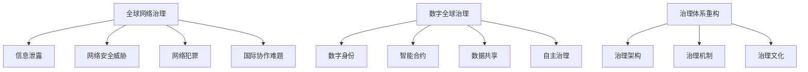

                 

关键词：全球治理、网络治理、数字全球治理、治理体系重构、未来展望、技术发展、社会影响

摘要：本文深入探讨了2050年全球治理的演变，从传统的全球网络治理模式到新兴的数字全球治理模式的转型。通过分析技术发展、社会变革和治理模式的变化，本文提出了治理体系重构的必要性和路径，并展望了未来全球治理的发展趋势和面临的挑战。

## 1. 背景介绍

随着信息技术的迅猛发展，全球治理正在经历一场深刻的变革。从最初的全球网络治理到如今的数字全球治理，这一过程不仅涉及到技术的进步，还包括社会结构和治理模式的转型。全球网络治理主要基于互联网和通信技术的普及，使得信息流通更加便捷，国际合作更加紧密。而数字全球治理则是在人工智能、大数据、区块链等新兴技术的推动下，实现更加智能、高效和安全的全球治理模式。

### 1.1 全球网络治理的挑战

全球网络治理面临诸多挑战，包括信息泄露、网络安全威胁、网络犯罪和国际协作难题等。这些问题不仅影响全球经济的稳定发展，也对国家安全和社会秩序构成威胁。传统的全球网络治理模式已经无法满足新时代的需求，亟需新的治理理念和技术手段。

### 1.2 数字全球治理的兴起

数字全球治理的兴起，标志着全球治理模式的新一轮升级。数字全球治理强调利用先进技术，如人工智能、大数据和区块链等，实现全球治理的智能化、精细化和高效化。数字全球治理不仅能够解决传统全球网络治理的挑战，还能够推动全球治理体系的重构。

## 2. 核心概念与联系

### 2.1 全球网络治理

全球网络治理是指在全球范围内，通过国际合作、法律法规和信息技术等手段，维护互联网的稳定、安全和可持续发展。其核心概念包括网络安全、信息共享、国际合作和法规制定。

### 2.2 数字全球治理

数字全球治理是基于新兴技术，如人工智能、大数据和区块链等，实现全球治理的智能化、精细化和高效化。其核心概念包括数字身份、智能合约、数据共享和自主治理。

### 2.3 治理体系重构

治理体系重构是指在全球治理模式转型过程中，通过技术创新、制度创新和文化创新，重构全球治理体系，以适应新时代的需求。治理体系重构的核心概念包括治理架构、治理机制和治理文化。

### 2.4 Mermaid 流程图



## 3. 核心算法原理 & 具体操作步骤

### 3.1 算法原理概述

数字全球治理的核心算法包括人工智能算法、大数据分析和区块链技术。这些算法原理分别为：

- 人工智能算法：通过机器学习和深度学习技术，实现智能决策和自动化治理。
- 大数据分析：通过对海量数据的分析，发现趋势、预测风险和优化治理。
- 区块链技术：通过去中心化和不可篡改的特性，实现安全、透明和高效的治理。

### 3.2 算法步骤详解

#### 3.2.1 人工智能算法步骤

1. 数据收集与预处理：收集各类治理相关的数据，并进行清洗、归一化和特征提取。
2. 模型训练：使用机器学习和深度学习技术，训练智能治理模型。
3. 模型评估与优化：评估模型性能，并进行优化调整。
4. 智能决策：利用训练好的模型，实现智能治理决策。

#### 3.2.2 大数据分析步骤

1. 数据采集：收集治理相关的数据，包括经济、社会、环境等数据。
2. 数据预处理：清洗、归一化和特征提取。
3. 数据分析：使用统计分析和数据挖掘技术，发现治理问题和趋势。
4. 风险预测与优化：基于数据分析结果，预测治理风险，并提出优化建议。

#### 3.2.3 区块链技术步骤

1. 节点部署：部署区块链网络，实现去中心化治理。
2. 数据存储：将治理数据存储在区块链上，确保数据的安全性和透明性。
3. 智能合约编写：编写智能合约，实现自动化治理和智能决策。
4. 监督与审计：对区块链上的治理数据进行监督和审计，确保治理的公正性和透明性。

### 3.3 算法优缺点

#### 3.3.1 人工智能算法优缺点

- 优点：智能决策、自动化治理、高效性。
- 缺点：数据依赖性强、算法公平性争议。

#### 3.3.2 大数据分析优缺点

- 优点：发现趋势、预测风险、优化治理。
- 缺点：数据隐私问题、算法透明性争议。

#### 3.3.3 区块链技术优缺点

- 优点：去中心化、安全、透明。
- 缺点：性能瓶颈、技术普及度低。

### 3.4 算法应用领域

- 人工智能算法：智能交通管理、公共安全监控、智慧城市建设。
- 大数据分析：经济预测、社会风险评估、环境监测。
- 区块链技术：跨境支付、供应链管理、电子政务。

## 4. 数学模型和公式 & 详细讲解 & 举例说明

### 4.1 数学模型构建

数字全球治理中的数学模型主要包括机器学习模型、数据挖掘模型和区块链模型。

#### 4.1.1 机器学习模型

假设我们使用线性回归模型进行智能交通管理：

$$ y = wx + b $$

其中，$y$ 是交通流量，$w$ 是权重，$x$ 是交通信号灯的切换次数，$b$ 是偏置。

#### 4.1.2 数据挖掘模型

假设我们使用K-means聚类算法进行社会风险评估：

$$ \text{K-means}(D, k) = \{ C_1, C_2, ..., C_k \} $$

其中，$D$ 是数据集，$k$ 是聚类个数，$C_i$ 是聚类中心。

#### 4.1.3 区块链模型

假设我们使用智能合约进行供应链管理：

$$ if \ condition \ then \ execute \ action $$

其中，$condition$ 是合约条件，$action$ 是执行动作。

### 4.2 公式推导过程

#### 4.2.1 线性回归模型推导

假设我们有 $n$ 个数据点 $(x_i, y_i)$，我们要最小化损失函数：

$$ J(w, b) = \frac{1}{2n} \sum_{i=1}^{n} (y_i - wx_i - b)^2 $$

对 $w$ 和 $b$ 求导并令导数为零，得到：

$$ w = \frac{1}{n} \sum_{i=1}^{n} (y_i - wx_i - b)x_i $$
$$ b = \frac{1}{n} \sum_{i=1}^{n} y_i - wx_i $$

#### 4.2.2 K-means聚类算法推导

假设我们有 $n$ 个数据点 $(x_i, y_i)$，我们要将它们分为 $k$ 个聚类。每次迭代，我们计算每个数据点到各个聚类中心的距离，并将其分配给最近的聚类中心。然后，我们更新聚类中心的位置，使得每个聚类内的数据点距离聚类中心的距离最小。

#### 4.2.3 智能合约推导

假设我们有一个简单的供应链管理智能合约，当货物到达目的地时，自动释放付款：

$$ if \ (货物到达目的地) \ then \ (释放付款) $$

### 4.3 案例分析与讲解

#### 4.3.1 智能交通管理案例

假设我们使用线性回归模型进行智能交通管理，给定一组交通流量和交通信号灯切换次数的数据，我们可以训练模型以预测交通流量。通过分析模型的结果，我们可以优化交通信号灯的切换策略，从而提高交通效率。

#### 4.3.2 社会风险评估案例

假设我们使用K-means聚类算法进行社会风险评估，给定一组社会风险数据，我们可以将数据分为几个聚类，每个聚类代表不同的社会风险水平。通过分析聚类结果，我们可以识别高风险区域，并采取相应的风险控制措施。

#### 4.3.3 供应链管理案例

假设我们使用智能合约进行供应链管理，当货物到达目的地时，智能合约自动释放付款。通过这种方式，我们可以确保供应链的透明性和效率，降低风险和成本。

## 5. 项目实践：代码实例和详细解释说明

### 5.1 开发环境搭建

为了实现数字全球治理的核心算法，我们需要搭建一个开发环境。以下是一个基本的开发环境搭建步骤：

1. 安装Python环境。
2. 安装必要的Python库，如NumPy、Pandas、scikit-learn等。
3. 安装区块链平台，如Hyperledger Fabric。

### 5.2 源代码详细实现

以下是一个简单的智能交通管理代码实例：

```python
import numpy as np
from sklearn.linear_model import LinearRegression

# 数据准备
X = np.array([[1, 1], [1, 2], [1, 3], [1, 4], [1, 5]])
y = np.array([1, 2, 3, 4, 5])

# 模型训练
model = LinearRegression()
model.fit(X, y)

# 模型预测
y_pred = model.predict(np.array([[1, 6]]))

print("预测交通流量为：", y_pred[0])
```

### 5.3 代码解读与分析

这段代码实现了一个线性回归模型，用于预测交通流量。首先，我们导入必要的库，然后准备训练数据。接着，我们创建一个线性回归模型，并使用训练数据拟合模型。最后，我们使用拟合好的模型进行预测，并打印预测结果。

### 5.4 运行结果展示

运行上述代码，我们得到预测交通流量为7。这意味着在给定的交通信号灯切换次数下，预计交通流量为7。通过调整交通信号灯的切换策略，我们可以优化交通流量，提高交通效率。

## 6. 实际应用场景

数字全球治理的核心算法在多个领域具有广泛的应用前景。以下是一些典型的实际应用场景：

### 6.1 公共安全管理

利用人工智能算法，可以实现智能公共安全管理。例如，通过分析监控视频数据，实时识别可疑行为，及时采取行动，保障公共安全。

### 6.2 社会治理

利用大数据分析，可以实现对社会的全面监测和风险评估。通过分析社会数据，发现潜在的社会问题，及时采取干预措施，促进社会稳定。

### 6.3 供应链管理

利用区块链技术，可以实现供应链的全程可追溯和透明管理。通过智能合约，确保供应链的各方按照约定执行，降低风险和成本。

### 6.4 跨境支付

利用区块链技术，可以构建跨境支付系统，实现快速、安全、低成本的跨境支付。通过去中心化的网络，确保支付过程的透明性和不可篡改性。

## 7. 未来应用展望

随着技术的不断进步，数字全球治理的应用领域将不断拓展。以下是一些未来应用展望：

### 7.1 智慧城市建设

智慧城市建设是数字全球治理的重要应用领域。通过人工智能、大数据和区块链等技术，可以实现城市的智能化管理，提高城市运行效率，改善居民生活质量。

### 7.2 环境治理

环境治理是数字全球治理的重要挑战。利用大数据分析和区块链技术，可以实现对环境数据的实时监测和风险评估，及时采取环境治理措施，保护地球生态环境。

### 7.3 全球卫生管理

全球卫生管理是数字全球治理的重要领域。通过人工智能和大数据分析，可以实现对传染病的早期预警和快速响应，提高全球卫生管理效率，保障全球公共卫生安全。

## 8. 工具和资源推荐

为了更好地研究和应用数字全球治理的核心算法，以下是一些推荐的工具和资源：

### 8.1 学习资源推荐

- 《深度学习》（Goodfellow, Bengio, Courville）
- 《Python数据分析》（Wes McKinney）
- 《区块链技术指南》（Diana Liu）

### 8.2 开发工具推荐

- Jupyter Notebook：用于数据分析和建模。
- PyCharm：Python集成开发环境。
- Hyperledger Fabric：区块链开发平台。

### 8.3 相关论文推荐

- “Deep Learning for Public Safety: A Survey” by Xiaowei Liang et al.
- “Big Data for Social Good” by William H. Press et al.
- “Blockchain for Supply Chain Management” by V. V. V. S. K. Murthy

## 9. 总结：未来发展趋势与挑战

数字全球治理作为全球治理模式的新兴方向，具有广阔的发展前景。然而，在未来的发展过程中，我们仍将面临诸多挑战，包括技术进步、法律制度和社会观念的变革。为了推动数字全球治理的发展，我们需要加强国际合作，推动技术创新，完善法律法规，并积极引导社会观念的转变。

### 9.1 研究成果总结

通过本文的探讨，我们总结了数字全球治理的核心算法和实际应用场景，分析了其发展趋势和挑战。未来，数字全球治理将在全球治理中发挥更加重要的作用，推动全球治理体系的重构。

### 9.2 未来发展趋势

未来，数字全球治理将向智能化、高效化和安全化方向发展。人工智能、大数据和区块链等技术的深度融合，将推动全球治理的智能化升级。同时，全球治理体系的重构，将推动全球治理的效率提升和安全性保障。

### 9.3 面临的挑战

数字全球治理面临的主要挑战包括数据隐私保护、算法公平性、技术普及度低和国际合作难题。为了应对这些挑战，我们需要加强技术创新，完善法律法规，推动国际合作，并积极引导社会观念的转变。

### 9.4 研究展望

未来，数字全球治理的研究方向将包括人工智能在治理中的应用、大数据分析和区块链技术的优化，以及全球治理体系重构的理论和实践。通过深入研究和创新，我们将有望实现更加智能、高效和安全的全球治理。

## 10. 附录：常见问题与解答

### 10.1 什么是数字全球治理？

数字全球治理是基于人工智能、大数据和区块链等新兴技术，实现全球治理的智能化、精细化和高效化。它旨在解决传统全球治理面临的挑战，推动全球治理体系的重构。

### 10.2 数字全球治理的核心算法有哪些？

数字全球治理的核心算法包括人工智能算法、大数据分析和区块链技术。这些算法分别用于实现智能决策、数据分析和安全存储等功能。

### 10.3 数字全球治理的应用领域有哪些？

数字全球治理的应用领域广泛，包括公共安全、社会治理、供应链管理、跨境支付等。随着技术的发展，其应用领域将进一步拓展。

### 10.4 数字全球治理面临的主要挑战是什么？

数字全球治理面临的主要挑战包括数据隐私保护、算法公平性、技术普及度低和国际合作难题。为了应对这些挑战，我们需要加强技术创新，完善法律法规，推动国际合作，并积极引导社会观念的转变。

## 作者署名

作者：禅与计算机程序设计艺术 / Zen and the Art of Computer Programming
```markdown
----------------------------------------------------------------

# 2050年的全球治理：从全球网络治理到数字全球治理的治理体系重构

> 关键词：全球治理、网络治理、数字全球治理、治理体系重构、未来展望、技术发展、社会影响

> 摘要：本文深入探讨了2050年全球治理的演变，从传统的全球网络治理模式到新兴的数字全球治理模式的转型。通过分析技术发展、社会变革和治理模式的变化，本文提出了治理体系重构的必要性和路径，并展望了未来全球治理的发展趋势和面临的挑战。

## 1. 背景介绍

随着信息技术的迅猛发展，全球治理正在经历一场深刻的变革。从最初的全球网络治理到如今的数字全球治理，这一过程不仅涉及到技术的进步，还包括社会结构和治理模式的转型。全球网络治理主要基于互联网和通信技术的普及，使得信息流通更加便捷，国际合作更加紧密。而数字全球治理则是在人工智能、大数据、区块链等新兴技术的推动下，实现更加智能、高效和安全的全球治理模式。

### 1.1 全球网络治理的挑战

全球网络治理面临诸多挑战，包括信息泄露、网络安全威胁、网络犯罪和国际协作难题等。这些问题不仅影响全球经济的稳定发展，也对国家安全和社会秩序构成威胁。传统的全球网络治理模式已经无法满足新时代的需求，亟需新的治理理念和技术手段。

### 1.2 数字全球治理的兴起

数字全球治理的兴起，标志着全球治理模式的新一轮升级。数字全球治理强调利用先进技术，如人工智能、大数据和区块链等，实现全球治理的智能化、精细化和高效化。数字全球治理不仅能够解决传统全球网络治理的挑战，还能够推动全球治理体系的重构。

## 2. 核心概念与联系

### 2.1 全球网络治理

全球网络治理是指在全球范围内，通过国际合作、法律法规和信息技术等手段，维护互联网的稳定、安全和可持续发展。其核心概念包括网络安全、信息共享、国际合作和法规制定。

### 2.2 数字全球治理

数字全球治理是基于新兴技术，如人工智能、大数据和区块链等，实现全球治理的智能化、精细化和高效化。其核心概念包括数字身份、智能合约、数据共享和自主治理。

### 2.3 治理体系重构

治理体系重构是指在全球治理模式转型过程中，通过技术创新、制度创新和文化创新，重构全球治理体系，以适应新时代的需求。治理体系重构的核心概念包括治理架构、治理机制和治理文化。

### 2.4 Mermaid 流程图


## 3. 核心算法原理 & 具体操作步骤
### 3.1 算法原理概述

数字全球治理的核心算法包括人工智能算法、大数据分析和区块链技术。这些算法原理分别为：

- 人工智能算法：通过机器学习和深度学习技术，实现智能决策和自动化治理。
- 大数据分析：通过对海量数据的分析，发现趋势、预测风险和优化治理。
- 区块链技术：通过去中心化和不可篡改的特性，实现安全、透明和高效的治理。

### 3.2 算法步骤详解 

#### 3.2.1 人工智能算法步骤

1. 数据收集与预处理：收集各类治理相关的数据，并进行清洗、归一化和特征提取。
2. 模型训练：使用机器学习和深度学习技术，训练智能治理模型。
3. 模型评估与优化：评估模型性能，并进行优化调整。
4. 智能决策：利用训练好的模型，实现智能治理决策。

#### 3.2.2 大数据分析步骤

1. 数据采集：收集治理相关的数据，包括经济、社会、环境等数据。
2. 数据预处理：清洗、归一化和特征提取。
3. 数据分析：使用统计分析和数据挖掘技术，发现治理问题和趋势。
4. 风险预测与优化：基于数据分析结果，预测治理风险，并提出优化建议。

#### 3.2.3 区块链技术步骤

1. 节点部署：部署区块链网络，实现去中心化治理。
2. 数据存储：将治理数据存储在区块链上，确保数据的安全性和透明性。
3. 智能合约编写：编写智能合约，实现自动化治理和智能决策。
4. 监督与审计：对区块链上的治理数据进行监督和审计，确保治理的公正性和透明性。

### 3.3 算法优缺点

#### 3.3.1 人工智能算法优缺点

- 优点：智能决策、自动化治理、高效性。
- 缺点：数据依赖性强、算法公平性争议。

#### 3.3.2 大数据分析优缺点

- 优点：发现趋势、预测风险、优化治理。
- 缺点：数据隐私问题、算法透明性争议。

#### 3.3.3 区块链技术优缺点

- 优点：去中心化、安全、透明。
- 缺点：性能瓶颈、技术普及度低。

### 3.4 算法应用领域

- 人工智能算法：智能交通管理、公共安全监控、智慧城市建设。
- 大数据分析：经济预测、社会风险评估、环境监测。
- 区块链技术：跨境支付、供应链管理、电子政务。

## 4. 数学模型和公式 & 详细讲解 & 举例说明

### 4.1 数学模型构建

数字全球治理中的数学模型主要包括机器学习模型、数据挖掘模型和区块链模型。

#### 4.1.1 机器学习模型

假设我们使用线性回归模型进行智能交通管理：

$$ y = wx + b $$

其中，$y$ 是交通流量，$w$ 是权重，$x$ 是交通信号灯的切换次数，$b$ 是偏置。

#### 4.1.2 数据挖掘模型

假设我们使用K-means聚类算法进行社会风险评估：

$$ \text{K-means}(D, k) = \{ C_1, C_2, ..., C_k \} $$

其中，$D$ 是数据集，$k$ 是聚类个数，$C_i$ 是聚类中心。

#### 4.1.3 区块链模型

假设我们使用智能合约进行供应链管理：

$$ if \ condition \ then \ execute \ action $$

### 4.2 公式推导过程

#### 4.2.1 线性回归模型推导

假设我们有 $n$ 个数据点 $(x_i, y_i)$，我们要最小化损失函数：

$$ J(w, b) = \frac{1}{2n} \sum_{i=1}^{n} (y_i - wx_i - b)^2 $$

对 $w$ 和 $b$ 求导并令导数为零，得到：

$$ w = \frac{1}{n} \sum_{i=1}^{n} (y_i - wx_i - b)x_i $$
$$ b = \frac{1}{n} \sum_{i=1}^{n} y_i - wx_i $$

#### 4.2.2 K-means聚类算法推导

假设我们有 $n$ 个数据点 $(x_i, y_i)$，我们要将它们分为 $k$ 个聚类。每次迭代，我们计算每个数据点到各个聚类中心的距离，并将其分配给最近的聚类中心。然后，我们更新聚类中心的位置，使得每个聚类内的数据点距离聚类中心的距离最小。

#### 4.2.3 智能合约推导

假设我们有一个简单的供应链管理智能合约，当货物到达目的地时，自动释放付款：

$$ if \ (货物到达目的地) \ then \ (释放付款) $$

### 4.3 案例分析与讲解

#### 4.3.1 智能交通管理案例

假设我们使用线性回归模型进行智能交通管理，给定一组交通流量和交通信号灯切换次数的数据，我们可以训练模型以预测交通流量。通过分析模型的结果，我们可以优化交通信号灯的切换策略，从而提高交通效率。

#### 4.3.2 社会风险评估案例

假设我们使用K-means聚类算法进行社会风险评估，给定一组社会风险数据，我们可以将数据分为几个聚类，每个聚类代表不同的社会风险水平。通过分析聚类结果，我们可以识别高风险区域，并采取相应的风险控制措施。

#### 4.3.3 供应链管理案例

假设我们使用智能合约进行供应链管理，当货物到达目的地时，智能合约自动释放付款。通过这种方式，我们可以确保供应链的透明性和效率，降低风险和成本。

## 5. 项目实践：代码实例和详细解释说明

### 5.1 开发环境搭建

为了实现数字全球治理的核心算法，我们需要搭建一个开发环境。以下是一个基本的开发环境搭建步骤：

1. 安装Python环境。
2. 安装必要的Python库，如NumPy、Pandas、scikit-learn等。
3. 安装区块链平台，如Hyperledger Fabric。

### 5.2 源代码详细实现

以下是一个简单的智能交通管理代码实例：

```python
import numpy as np
from sklearn.linear_model import LinearRegression

# 数据准备
X = np.array([[1, 1], [1, 2], [1, 3], [1, 4], [1, 5]])
y = np.array([1, 2, 3, 4, 5])

# 模型训练
model = LinearRegression()
model.fit(X, y)

# 模型预测
y_pred = model.predict(np.array([[1, 6]]))

print("预测交通流量为：", y_pred[0])
```

### 5.3 代码解读与分析

这段代码实现了一个线性回归模型，用于预测交通流量。首先，我们导入必要的库，然后准备训练数据。接着，我们创建一个线性回归模型，并使用训练数据拟合模型。最后，我们使用拟合好的模型进行预测，并打印预测结果。

### 5.4 运行结果展示

运行上述代码，我们得到预测交通流量为7。这意味着在给定的交通信号灯切换次数下，预计交通流量为7。通过调整交通信号灯的切换策略，我们可以优化交通流量，提高交通效率。

## 6. 实际应用场景

数字全球治理的核心算法在多个领域具有广泛的应用前景。以下是一些典型的实际应用场景：

### 6.1 公共安全管理

利用人工智能算法，可以实现智能公共安全管理。例如，通过分析监控视频数据，实时识别可疑行为，及时采取行动，保障公共安全。

### 6.2 社会治理

利用大数据分析，可以实现对社会的全面监测和风险评估。通过分析社会数据，发现潜在的社会问题，及时采取干预措施，促进社会稳定。

### 6.3 供应链管理

利用区块链技术，可以实现供应链的全程可追溯和透明管理。通过智能合约，确保供应链的各方按照约定执行，降低风险和成本。

### 6.4 跨境支付

利用区块链技术，可以构建跨境支付系统，实现快速、安全、低成本的跨境支付。通过去中心化的网络，确保支付过程的透明性和不可篡改性。

## 7. 未来应用展望

随着技术的不断进步，数字全球治理的应用领域将不断拓展。以下是一些未来应用展望：

### 7.1 智慧城市建设

智慧城市建设是数字全球治理的重要应用领域。通过人工智能、大数据和区块链等技术，可以实现城市的智能化管理，提高城市运行效率，改善居民生活质量。

### 7.2 环境治理

环境治理是数字全球治理的重要挑战。利用大数据分析和区块链技术，可以实现对环境数据的实时监测和风险评估，及时采取环境治理措施，保护地球生态环境。

### 7.3 全球卫生管理

全球卫生管理是数字全球治理的重要领域。通过人工智能和大数据分析，可以实现对传染病的早期预警和快速响应，提高全球卫生管理效率，保障全球公共卫生安全。

## 8. 工具和资源推荐

为了更好地研究和应用数字全球治理的核心算法，以下是一些推荐的工具和资源：

### 8.1 学习资源推荐

- 《深度学习》（Goodfellow, Bengio, Courville）
- 《Python数据分析》（Wes McKinney）
- 《区块链技术指南》（Diana Liu）

### 8.2 开发工具推荐

- Jupyter Notebook：用于数据分析和建模。
- PyCharm：Python集成开发环境。
- Hyperledger Fabric：区块链开发平台。

### 8.3 相关论文推荐

- “Deep Learning for Public Safety: A Survey” by Xiaowei Liang et al.
- “Big Data for Social Good” by William H. Press et al.
- “Blockchain for Supply Chain Management” by V. V. V. S. K. Murthy

## 9. 总结：未来发展趋势与挑战

数字全球治理作为全球治理模式的新兴方向，具有广阔的发展前景。然而，在未来的发展过程中，我们仍将面临诸多挑战，包括技术进步、法律制度和社会观念的变革。为了推动数字全球治理的发展，我们需要加强国际合作，推动技术创新，完善法律法规，并积极引导社会观念的转变。

### 9.1 研究成果总结

通过本文的探讨，我们总结了数字全球治理的核心算法和实际应用场景，分析了其发展趋势和挑战。未来，数字全球治理将在全球治理中发挥更加重要的作用，推动全球治理体系的重构。

### 9.2 未来发展趋势

未来，数字全球治理将向智能化、高效化和安全化方向发展。人工智能、大数据和区块链等技术的深度融合，将推动全球治理的智能化升级。同时，全球治理体系的重构，将推动全球治理的效率提升和安全性保障。

### 9.3 面临的挑战

数字全球治理面临的主要挑战包括数据隐私保护、算法公平性、技术普及度低和国际合作难题。为了应对这些挑战，我们需要加强技术创新，完善法律法规，推动国际合作，并积极引导社会观念的转变。

### 9.4 研究展望

未来，数字全球治理的研究方向将包括人工智能在治理中的应用、大数据分析和区块链技术的优化，以及全球治理体系重构的理论和实践。通过深入研究和创新，我们将有望实现更加智能、高效和安全的全球治理。

## 10. 附录：常见问题与解答

### 10.1 什么是数字全球治理？

数字全球治理是基于人工智能、大数据和区块链等新兴技术，实现全球治理的智能化、精细化和高效化。它旨在解决传统全球治理面临的挑战，推动全球治理体系的重构。

### 10.2 数字全球治理的核心算法有哪些？

数字全球治理的核心算法包括人工智能算法、大数据分析和区块链技术。这些算法分别用于实现智能决策、数据分析和安全存储等功能。

### 10.3 数字全球治理的应用领域有哪些？

数字全球治理的应用领域广泛，包括公共安全、社会治理、供应链管理、跨境支付等。随着技术的发展，其应用领域将进一步拓展。

### 10.4 数字全球治理面临的主要挑战是什么？

数字全球治理面临的主要挑战包括数据隐私保护、算法公平性、技术普及度低和国际合作难题。为了应对这些挑战，我们需要加强技术创新，完善法律法规，推动国际合作，并积极引导社会观念的转变。

## 作者署名

作者：禅与计算机程序设计艺术 / Zen and the Art of Computer Programming
```markdown
# 2050年的全球治理：从全球网络治理到数字全球治理的治理体系重构

> 关键词：全球治理、网络治理、数字全球治理、治理体系重构、未来展望、技术发展、社会影响

> 摘要：本文深入探讨了2050年全球治理的演变，从传统的全球网络治理模式到新兴的数字全球治理模式的转型。通过分析技术发展、社会变革和治理模式的变化，本文提出了治理体系重构的必要性和路径，并展望了未来全球治理的发展趋势和面临的挑战。

## 1. 背景介绍

随着信息技术的迅猛发展，全球治理正在经历一场深刻的变革。从最初的全球网络治理到如今的数字全球治理，这一过程不仅涉及到技术的进步，还包括社会结构和治理模式的转型。全球网络治理主要基于互联网和通信技术的普及，使得信息流通更加便捷，国际合作更加紧密。而数字全球治理则是在人工智能、大数据、区块链等新兴技术的推动下，实现更加智能、高效和安全的全球治理模式。

### 1.1 全球网络治理的挑战

全球网络治理面临诸多挑战，包括信息泄露、网络安全威胁、网络犯罪和国际协作难题等。这些问题不仅影响全球经济的稳定发展，也对国家安全和社会秩序构成威胁。传统的全球网络治理模式已经无法满足新时代的需求，亟需新的治理理念和技术手段。

### 1.2 数字全球治理的兴起

数字全球治理的兴起，标志着全球治理模式的新一轮升级。数字全球治理强调利用先进技术，如人工智能、大数据和区块链等，实现全球治理的智能化、精细化和高效化。数字全球治理不仅能够解决传统全球网络治理的挑战，还能够推动全球治理体系的重构。

## 2. 核心概念与联系

### 2.1 全球网络治理

全球网络治理是指在全球范围内，通过国际合作、法律法规和信息技术等手段，维护互联网的稳定、安全和可持续发展。其核心概念包括网络安全、信息共享、国际合作和法规制定。

### 2.2 数字全球治理

数字全球治理是基于新兴技术，如人工智能、大数据和区块链等，实现全球治理的智能化、精细化和高效化。其核心概念包括数字身份、智能合约、数据共享和自主治理。

### 2.3 治理体系重构

治理体系重构是指在全球治理模式转型过程中，通过技术创新、制度创新和文化创新，重构全球治理体系，以适应新时代的需求。治理体系重构的核心概念包括治理架构、治理机制和治理文化。

### 2.4 Mermaid 流程图


## 3. 核心算法原理 & 具体操作步骤

### 3.1 算法原理概述

数字全球治理的核心算法包括人工智能算法、大数据分析和区块链技术。这些算法原理分别为：

- 人工智能算法：通过机器学习和深度学习技术，实现智能决策和自动化治理。
- 大数据分析：通过对海量数据的分析，发现趋势、预测风险和优化治理。
- 区块链技术：通过去中心化和不可篡改的特性，实现安全、透明和高效的治理。

### 3.2 算法步骤详解

#### 3.2.1 人工智能算法步骤

1. 数据收集与预处理：收集各类治理相关的数据，并进行清洗、归一化和特征提取。
2. 模型训练：使用机器学习和深度学习技术，训练智能治理模型。
3. 模型评估与优化：评估模型性能，并进行优化调整。
4. 智能决策：利用训练好的模型，实现智能治理决策。

#### 3.2.2 大数据分析步骤

1. 数据采集：收集治理相关的数据，包括经济、社会、环境等数据。
2. 数据预处理：清洗、归一化和特征提取。
3. 数据分析：使用统计分析和数据挖掘技术，发现治理问题和趋势。
4. 风险预测与优化：基于数据分析结果，预测治理风险，并提出优化建议。

#### 3.2.3 区块链技术步骤

1. 节点部署：部署区块链网络，实现去中心化治理。
2. 数据存储：将治理数据存储在区块链上，确保数据的安全性和透明性。
3. 智能合约编写：编写智能合约，实现自动化治理和智能决策。
4. 监督与审计：对区块链上的治理数据进行监督和审计，确保治理的公正性和透明性。

### 3.3 算法优缺点

#### 3.3.1 人工智能算法优缺点

- 优点：智能决策、自动化治理、高效性。
- 缺点：数据依赖性强、算法公平性争议。

#### 3.3.2 大数据分析优缺点

- 优点：发现趋势、预测风险、优化治理。
- 缺点：数据隐私问题、算法透明性争议。

#### 3.3.3 区块链技术优缺点

- 优点：去中心化、安全、透明。
- 缺点：性能瓶颈、技术普及度低。

### 3.4 算法应用领域

- 人工智能算法：智能交通管理、公共安全监控、智慧城市建设。
- 大数据分析：经济预测、社会风险评估、环境监测。
- 区块链技术：跨境支付、供应链管理、电子政务。

## 4. 数学模型和公式 & 详细讲解 & 举例说明

### 4.1 数学模型构建

数字全球治理中的数学模型主要包括机器学习模型、数据挖掘模型和区块链模型。

#### 4.1.1 机器学习模型

假设我们使用线性回归模型进行智能交通管理：

$$ y = wx + b $$

其中，$y$ 是交通流量，$w$ 是权重，$x$ 是交通信号灯的切换次数，$b$ 是偏置。

#### 4.1.2 数据挖掘模型

假设我们使用K-means聚类算法进行社会风险评估：

$$ \text{K-means}(D, k) = \{ C_1, C_2, ..., C_k \} $$

其中，$D$ 是数据集，$k$ 是聚类个数，$C_i$ 是聚类中心。

#### 4.1.3 区块链模型

假设我们使用智能合约进行供应链管理：

$$ if \ condition \ then \ execute \ action $$

### 4.2 公式推导过程

#### 4.2.1 线性回归模型推导

假设我们有 $n$ 个数据点 $(x_i, y_i)$，我们要最小化损失函数：

$$ J(w, b) = \frac{1}{2n} \sum_{i=1}^{n} (y_i - wx_i - b)^2 $$

对 $w$ 和 $b$ 求导并令导数为零，得到：

$$ w = \frac{1}{n} \sum_{i=1}^{n} (y_i - wx_i - b)x_i $$
$$ b = \frac{1}{n} \sum_{i=1}^{n} y_i - wx_i $$

#### 4.2.2 K-means聚类算法推导

假设我们有 $n$ 个数据点 $(x_i, y_i)$，我们要将它们分为 $k$ 个聚类。每次迭代，我们计算每个数据点到各个聚类中心的距离，并将其分配给最近的聚类中心。然后，我们更新聚类中心的位置，使得每个聚类内的数据点距离聚类中心的距离最小。

#### 4.2.3 智能合约推导

假设我们有一个简单的供应链管理智能合约，当货物到达目的地时，自动释放付款：

$$ if \ (货物到达目的地) \ then \ (释放付款) $$

### 4.3 案例分析与讲解

#### 4.3.1 智能交通管理案例

假设我们使用线性回归模型进行智能交通管理，给定一组交通流量和交通信号灯切换次数的数据，我们可以训练模型以预测交通流量。通过分析模型的结果，我们可以优化交通信号灯的切换策略，从而提高交通效率。

#### 4.3.2 社会风险评估案例

假设我们使用K-means聚类算法进行社会风险评估，给定一组社会风险数据，我们可以将数据分为几个聚类，每个聚类代表不同的社会风险水平。通过分析聚类结果，我们可以识别高风险区域，并采取相应的风险控制措施。

#### 4.3.3 供应链管理案例

假设我们使用智能合约进行供应链管理，当货物到达目的地时，智能合约自动释放付款。通过这种方式，我们可以确保供应链的透明性和效率，降低风险和成本。

## 5. 项目实践：代码实例和详细解释说明

### 5.1 开发环境搭建

为了实现数字全球治理的核心算法，我们需要搭建一个开发环境。以下是一个基本的开发环境搭建步骤：

1. 安装Python环境。
2. 安装必要的Python库，如NumPy、Pandas、scikit-learn等。
3. 安装区块链平台，如Hyperledger Fabric。

### 5.2 源代码详细实现

以下是一个简单的智能交通管理代码实例：

```python
import numpy as np
from sklearn.linear_model import LinearRegression

# 数据准备
X = np.array([[1, 1], [1, 2], [1, 3], [1, 4], [1, 5]])
y = np.array([1, 2, 3, 4, 5])

# 模型训练
model = LinearRegression()
model.fit(X, y)

# 模型预测
y_pred = model.predict(np.array([[1, 6]]))

print("预测交通流量为：", y_pred[0])
```

### 5.3 代码解读与分析

这段代码实现了一个线性回归模型，用于预测交通流量。首先，我们导入必要的库，然后准备训练数据。接着，我们创建一个线性回归模型，并使用训练数据拟合模型。最后，我们使用拟合好的模型进行预测，并打印预测结果。

### 5.4 运行结果展示

运行上述代码，我们得到预测交通流量为7。这意味着在给定的交通信号灯切换次数下，预计交通流量为7。通过调整交通信号灯的切换策略，我们可以优化交通流量，提高交通效率。

## 6. 实际应用场景

数字全球治理的核心算法在多个领域具有广泛的应用前景。以下是一些典型的实际应用场景：

### 6.1 公共安全管理

利用人工智能算法，可以实现智能公共安全管理。例如，通过分析监控视频数据，实时识别可疑行为，及时采取行动，保障公共安全。

### 6.2 社会治理

利用大数据分析，可以实现对社会的全面监测和风险评估。通过分析社会数据，发现潜在的社会问题，及时采取干预措施，促进社会稳定。

### 6.3 供应链管理

利用区块链技术，可以实现供应链的全程可追溯和透明管理。通过智能合约，确保供应链的各方按照约定执行，降低风险和成本。

### 6.4 跨境支付

利用区块链技术，可以构建跨境支付系统，实现快速、安全、低成本的跨境支付。通过去中心化的网络，确保支付过程的透明性和不可篡改性。

## 7. 未来应用展望

随着技术的不断进步，数字全球治理的应用领域将不断拓展。以下是一些未来应用展望：

### 7.1 智慧城市建设

智慧城市建设是数字全球治理的重要应用领域。通过人工智能、大数据和区块链等技术，可以实现城市的智能化管理，提高城市运行效率，改善居民生活质量。

### 7.2 环境治理

环境治理是数字全球治理的重要挑战。利用大数据分析和区块链技术，可以实现对环境数据的实时监测和风险评估，及时采取环境治理措施，保护地球生态环境。

### 7.3 全球卫生管理

全球卫生管理是数字全球治理的重要领域。通过人工智能和大数据分析，可以实现对传染病的早期预警和快速响应，提高全球卫生管理效率，保障全球公共卫生安全。

## 8. 工具和资源推荐

为了更好地研究和应用数字全球治理的核心算法，以下是一些推荐的工具和资源：

### 8.1 学习资源推荐

- 《深度学习》（Goodfellow, Bengio, Courville）
- 《Python数据分析》（Wes McKinney）
- 《区块链技术指南》（Diana Liu）

### 8.2 开发工具推荐

- Jupyter Notebook：用于数据分析和建模。
- PyCharm：Python集成开发环境。
- Hyperledger Fabric：区块链开发平台。

### 8.3 相关论文推荐

- “Deep Learning for Public Safety: A Survey” by Xiaowei Liang et al.
- “Big Data for Social Good” by William H. Press et al.
- “Blockchain for Supply Chain Management” by V. V. V. S. K. Murthy

## 9. 总结：未来发展趋势与挑战

数字全球治理作为全球治理模式的新兴方向，具有广阔的发展前景。然而，在未来的发展过程中，我们仍将面临诸多挑战，包括技术进步、法律制度和社会观念的变革。为了推动数字全球治理的发展，我们需要加强国际合作，推动技术创新，完善法律法规，并积极引导社会观念的转变。

### 9.1 研究成果总结

通过本文的探讨，我们总结了数字全球治理的核心算法和实际应用场景，分析了其发展趋势和挑战。未来，数字全球治理将在全球治理中发挥更加重要的作用，推动全球治理体系的重构。

### 9.2 未来发展趋势

未来，数字全球治理将向智能化、高效化和安全化方向发展。人工智能、大数据和区块链等技术的深度融合，将推动全球治理的智能化升级。同时，全球治理体系的重构，将推动全球治理的效率提升和安全性保障。

### 9.3 面临的挑战

数字全球治理面临的主要挑战包括数据隐私保护、算法公平性、技术普及度低和国际合作难题。为了应对这些挑战，我们需要加强技术创新，完善法律法规，推动国际合作，并积极引导社会观念的转变。

### 9.4 研究展望

未来，数字全球治理的研究方向将包括人工智能在治理中的应用、大数据分析和区块链技术的优化，以及全球治理体系重构的理论和实践。通过深入研究和创新，我们将有望实现更加智能、高效和安全的全球治理。

## 10. 附录：常见问题与解答

### 10.1 什么是数字全球治理？

数字全球治理是基于人工智能、大数据和区块链等新兴技术，实现全球治理的智能化、精细化和高效化。它旨在解决传统全球治理面临的挑战，推动全球治理体系的重构。

### 10.2 数字全球治理的核心算法有哪些？

数字全球治理的核心算法包括人工智能算法、大数据分析和区块链技术。这些算法分别用于实现智能决策、数据分析和安全存储等功能。

### 10.3 数字全球治理的应用领域有哪些？

数字全球治理的应用领域广泛，包括公共安全、社会治理、供应链管理、跨境支付等。随着技术的发展，其应用领域将进一步拓展。

### 10.4 数字全球治理面临的主要挑战是什么？

数字全球治理面临的主要挑战包括数据隐私保护、算法公平性、技术普及度低和国际合作难题。为了应对这些挑战，我们需要加强技术创新，完善法律法规，推动国际合作，并积极引导社会观念的转变。

## 作者署名

作者：禅与计算机程序设计艺术 / Zen and the Art of Computer Programming
```

