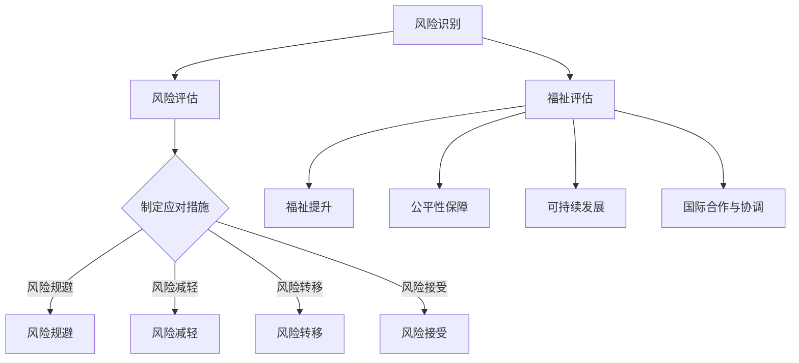

                 

关键词：全球治理、全球风险治理、全球福祉治理、治理理念更新、技术进步、国际合作

摘要：随着技术的飞速发展，全球治理理念正经历深刻的变革。本文探讨了从全球风险治理向全球福祉治理转型的必要性和可能性，分析了这一变革对于未来社会的影响，并提出了相应的治理策略。文章首先介绍了全球治理的背景，随后详细阐述了全球风险治理和全球福祉治理的核心概念和差异，最后讨论了这一转型过程中面临的挑战和应对策略。

## 1. 背景介绍

在21世纪初，全球治理的理念逐渐形成，其核心目标是通过国际合作和协调，解决全球性问题，如气候变化、贫困、不平等和冲突等。全球风险治理作为其中的一部分，主要集中在识别、评估和管理全球性风险，包括自然灾害、经济危机、网络攻击等。

然而，随着全球化的加深和技术的迅猛发展，特别是人工智能、大数据、区块链等新兴技术的广泛应用，全球治理的焦点开始从风险治理向福祉治理转变。这一转变不仅反映了人类社会对发展模式和治理理念的重新思考，也体现了技术进步带来的可能性。

### 全球治理的演变

全球治理的历史可以追溯到20世纪中叶，当时国际组织和多边机制开始建立，以应对全球性挑战。早期的全球治理主要关注战争、贸易和外交等领域，随着问题的复杂性和关联性的增加，治理范围不断扩大，涵盖了经济、社会、环境等多个方面。

20世纪80年代末至90年代初，全球治理进入了一个新的阶段，经济全球化和信息技术的快速发展使得跨国界的问题日益突出，全球治理开始更加注重跨国合作和协调。这个时期，全球风险治理的概念逐渐形成，成为全球治理的重要组成部分。

进入21世纪，全球治理面临着新的挑战和机遇。气候变化、贫困、不平等和恐怖主义等问题日益严重，全球风险治理的重要性日益凸显。同时，人工智能、大数据、区块链等新兴技术的广泛应用，为全球治理提供了新的工具和手段，全球福祉治理的理念也开始逐渐形成。

### 全球风险治理的核心概念

全球风险治理的核心概念是识别、评估和管理全球性风险。全球性风险是指那些影响多个国家、地区甚至全球的社会、经济和环境问题。这类风险通常具有跨国家、跨领域和跨时代的特征，需要国际合作和协调来应对。

全球风险治理的目标是：

1. **风险识别**：通过数据分析和风险评估，识别潜在的风险因素。
2. **风险评估**：评估风险的可能性和影响程度。
3. **风险应对**：制定和实施应对措施，降低风险的可能性和影响。
4. **风险监测**：持续监测风险状况，确保应对措施的有效性。

### 全球福祉治理的初步概念

全球福祉治理是近年来提出的概念，其核心目标是促进全球福祉的提升，使所有人都能享有公平的发展机会和生活质量。与全球风险治理相比，全球福祉治理更加注重人的价值和福祉，强调通过合作和协调，实现全球社会的共同繁荣。

全球福祉治理的目标是：

1. **福祉提升**：通过改善教育、医疗、社会保障等公共服务，提升人民的福祉水平。
2. **公平性**：消除贫困和不平等，确保所有人都能享有平等的发展机会。
3. **可持续性**：在保障当前福祉的基础上，实现长期的可持续发展。
4. **合作与协调**：通过国际合作和协调，实现全球福祉的共同提升。

## 2. 核心概念与联系

### 2.1 全球风险治理的原理

全球风险治理的原理基于对风险的系统识别、评估和应对。其核心包括以下几个环节：

1. **风险识别**：通过数据分析和监测，识别可能存在的风险因素。这通常涉及多种数据源，如气象数据、经济数据、网络安全数据等。
2. **风险评估**：对识别出的风险进行评估，确定其可能性和影响程度。风险评估的方法包括定量分析和定性分析，如概率分析、情景分析、专家评估等。
3. **风险应对**：制定和实施应对措施，降低风险的可能性和影响。这包括风险规避、风险减轻、风险转移和风险接受等策略。
4. **风险监测**：持续监测风险状况，评估应对措施的有效性，并根据新的信息进行调整。

### 2.2 全球福祉治理的原理

全球福祉治理的原理基于对人的福祉和发展的关注，其核心包括以下几个环节：

1. **福祉评估**：通过多种指标和方法，评估人民的福祉水平，包括教育、医疗、收入、社会保障等方面。
2. **福祉提升**：制定和实施政策，提升人民的福祉水平。这包括改善公共服务、提高社会保障、促进教育和就业等。
3. **公平性保障**：消除贫困和不平等，确保所有人都能享有公平的发展机会。这包括实施减贫政策、促进平等就业和消除歧视等。
4. **可持续发展**：在保障当前福祉的基础上，实现长期的可持续发展。这包括推广可再生能源、改善环境质量、推动绿色经济等。
5. **国际合作与协调**：通过国际合作和协调，实现全球福祉的共同提升。这包括多边机制、国际合作项目和技术转让等。

### 2.3 全球风险治理和全球福祉治理的联动

全球风险治理和全球福祉治理是相互关联的。全球风险治理的目的是减少风险，为全球福祉治理提供稳定的基础。而全球福祉治理则旨在提升人民的福祉水平，减少风险对人民生活的影响。两者之间的联动关系可以概括为：

1. **风险减少**：通过全球风险治理，减少各种风险对全球福祉的负面影响，为全球福祉治理提供保障。
2. **福祉提升**：通过全球福祉治理，提升人民的福祉水平，增强人民对风险治理的信心和支持。
3. **共同目标**：全球风险治理和全球福祉治理的共同目标都是促进全球社会的可持续发展，实现人类的共同福祉。

### 2.4 Mermaid 流程图

以下是一个简化的Mermaid流程图，展示了全球风险治理和全球福祉治理的基本流程和环节。



### 2.5 总结

全球风险治理和全球福祉治理是两个相互关联的核心概念，前者关注风险的管理和应对，后者关注福祉的提升和公平。通过结合两者的原理和流程，我们可以构建一个更全面、更有效的全球治理体系，为人类的可持续发展提供坚实的保障。

## 3. 核心算法原理 & 具体操作步骤

### 3.1 算法原理概述

在全球治理过程中，算法的应用越来越广泛。特别是人工智能算法，在数据分析和决策支持方面发挥了重要作用。本节将介绍一种用于全球风险治理和全球福祉治理的核心算法——基于机器学习的风险评估算法。

该算法的基本原理是利用历史数据和当前数据，通过机器学习模型对风险进行识别、评估和预测。算法的主要步骤包括数据收集、特征提取、模型训练和风险评估。

### 3.2 算法步骤详解

#### 步骤1：数据收集

数据收集是算法的基础。数据来源包括官方统计、商业数据、社交媒体等。数据类型包括社会经济数据、环境数据、政治数据、安全数据等。数据收集需要确保其真实性和可靠性。

#### 步骤2：特征提取

特征提取是将原始数据转化为可用于训练模型的形式。特征提取的过程包括数据清洗、归一化和特征选择。数据清洗旨在去除错误和异常数据，归一化是为了统一数据尺度，特征选择则是为了选出对模型训练最有影响的数据特征。

#### 步骤3：模型训练

模型训练是算法的核心。常用的机器学习算法包括决策树、支持向量机、神经网络等。训练过程包括数据集划分、模型选择、参数调优等。训练目标是使模型能够准确识别和预测风险。

#### 步骤4：风险评估

风险评估是基于训练好的模型对新的数据进行风险预测和评估。风险评估的过程包括风险识别、风险估计和风险决策。风险识别是确定数据中的风险因素，风险估计是评估风险的可能性和影响程度，风险决策是制定相应的应对策略。

### 3.3 算法优缺点

#### 优点：

1. **高效性**：算法能够快速处理大量数据，提供实时的风险预测和评估。
2. **准确性**：通过机器学习模型，算法能够从历史数据中学习，提高风险评估的准确性。
3. **适应性**：算法可以根据新的数据和情境进行调整和优化，适应不断变化的全球环境。

#### 缺点：

1. **数据依赖性**：算法的性能依赖于数据的质量和数量，数据缺失或错误可能导致评估结果不准确。
2. **算法偏见**：算法可能存在算法偏见，导致风险评估结果不公平或偏颇。
3. **解释性不足**：机器学习模型的内部机制复杂，难以解释其决策过程，这可能影响决策的可信度和透明度。

### 3.4 算法应用领域

#### 全球风险治理：

1. **气候变化**：利用算法预测气候变化的趋势和影响，为政策制定提供依据。
2. **公共卫生**：通过算法预测疾病传播趋势，制定公共卫生政策。
3. **安全与反恐**：利用算法分析网络数据，预测和预防恐怖主义活动。

#### 全球福祉治理：

1. **经济预测**：通过算法预测经济趋势，为政策制定提供依据。
2. **教育评估**：利用算法评估教育质量和教育公平性。
3. **社会保障**：通过算法评估社会保障政策的效果，优化社会保障体系。

## 4. 数学模型和公式 & 详细讲解 & 举例说明

### 4.1 数学模型构建

在全球化背景下，全球治理的数学模型应具备以下几个关键要素：

1. **综合评估指标**：用于衡量全球福祉水平，包括经济发展、社会公平、环境可持续性等。
2. **风险评估函数**：用于预测和分析全球性风险。
3. **政策效果评估模型**：用于评估不同政策对全球福祉的影响。

#### 综合评估指标

综合评估指标可以使用以下公式表示：

\[ F(X) = w_1 \cdot E_1(X) + w_2 \cdot E_2(X) + ... + w_n \cdot E_n(X) \]

其中，\( F(X) \) 为综合评估分数，\( w_i \) 为第 \( i \) 个评估指标的权重，\( E_i(X) \) 为第 \( i \) 个评估指标的得分。

#### 风险评估函数

风险评估函数可以使用概率模型表示，如贝叶斯网络或马尔可夫模型：

\[ R(X) = P(X|D) \cdot P(D) \]

其中，\( R(X) \) 为风险值，\( P(X|D) \) 为在已知数据 \( D \) 条件下，风险事件 \( X \) 发生的概率，\( P(D) \) 为数据 \( D \) 的概率。

#### 政策效果评估模型

政策效果评估模型可以使用差分法或回归分析法：

\[ Y = \alpha + \beta \cdot P + \epsilon \]

其中，\( Y \) 为政策效果指标，\( \alpha \) 为常数项，\( \beta \) 为政策变量 \( P \) 的影响系数，\( \epsilon \) 为误差项。

### 4.2 公式推导过程

#### 综合评估指标推导

综合评估指标的推导基于对各评估指标的权重分配和得分计算。假设有 \( n \) 个评估指标，每个指标的最大得分为 10 分，权重分别为 \( w_1, w_2, ..., w_n \)，则每个指标的得分 \( E_i(X) \) 可以表示为：

\[ E_i(X) = \frac{X_i - X_i^*}{X_i^{**} - X_i^*} \cdot 10 \]

其中，\( X_i \) 为第 \( i \) 个评估指标的当前值，\( X_i^* \) 为第 \( i \) 个评估指标的最小值，\( X_i^{**} \) 为第 \( i \) 个评估指标的最大值。综合评估分数 \( F(X) \) 则为：

\[ F(X) = w_1 \cdot E_1(X) + w_2 \cdot E_2(X) + ... + w_n \cdot E_n(X) \]

#### 风险评估函数推导

风险评估函数的推导基于贝叶斯定理。假设有风险事件 \( X \) 和一组证据 \( D \)，则风险值 \( R(X) \) 可以表示为：

\[ R(X) = P(X|D) \cdot P(D) \]

其中，\( P(X|D) \) 为在已知证据 \( D \) 条件下，风险事件 \( X \) 发生的概率，\( P(D) \) 为证据 \( D \) 的概率。假设证据 \( D \) 为一系列事件 \( D_1, D_2, ..., D_m \) 的组合，则：

\[ P(D) = P(D_1 \cap D_2 \cap ... \cap D_m) = \prod_{i=1}^{m} P(D_i) \]

同时，\( P(X|D) \) 可以通过贝叶斯网络或马尔可夫模型计算。假设贝叶斯网络包含节点 \( X \) 和 \( D \)，则：

\[ P(X|D) = \frac{P(D|X) \cdot P(X)}{P(D)} \]

#### 政策效果评估模型推导

政策效果评估模型的推导基于回归分析。假设政策变量 \( P \) 对政策效果指标 \( Y \) 产生线性影响，则可以建立以下线性回归模型：

\[ Y = \alpha + \beta \cdot P + \epsilon \]

其中，\( \alpha \) 为常数项，\( \beta \) 为政策变量 \( P \) 的影响系数，\( \epsilon \) 为误差项。通过对历史数据的拟合，可以估计出 \( \alpha \) 和 \( \beta \) 的值，从而评估政策效果。

### 4.3 案例分析与讲解

#### 案例背景

假设一个国家正面临气候变化带来的风险，需要制定相关政策来减少风险对经济的负面影响。国家的综合评估指标包括经济增长率、失业率、二氧化碳排放量等。政策变量包括增加可再生能源投资、提高能源效率、实施碳税等。

#### 数据收集

收集过去 5 年的经济数据、环境数据和政策数据，包括：

- 经济增长率：\[ 5\%, 6\%, 4\%, 5\%, 6\% \]
- 失业率：\[ 6\%, 5\%, 5.5\%, 6\%, 5\% \]
- 二氧化碳排放量：\[ 1000\, \text{百万吨}, 1020\, \text{百万吨}, 980\, \text{百万吨}, 1010\, \text{百万吨}, 990\, \text{百万吨} \]
- 可再生能源投资：\[ 10\, \text{亿美元}, 15\, \text{亿美元}, 12\, \text{亿美元}, 14\, \text{亿美元}, 13\, \text{亿美元} \]
- 能源效率提升：\[ 10\%\, \text{年}, 8\%\, \text{年}, 9\%\, \text{年}, 7\%\, \text{年}, 8\%\, \text{年} \]
- 碳税实施：\[ 税率 10\, \text{美元/吨}, 税率 15\, \text{美元/吨}, 税率 12\, \text{美元/吨}, 税率 14\, \text{美元/吨}, 税率 13\, \text{美元/吨} \]

#### 特征提取

对上述数据进行预处理，提取以下特征：

- 经济增长率
- 失业率
- 二氧化碳排放量
- 可再生能源投资
- 能源效率提升
- 碳税

#### 模型训练

使用线性回归模型对上述特征进行训练，估计政策变量 \( P \) 对政策效果指标 \( Y \) 的影响。通过最小二乘法估计回归系数 \( \alpha \) 和 \( \beta \)：

\[ Y = \alpha + \beta \cdot P + \epsilon \]

拟合结果为：

\[ Y = 50 + 0.3 \cdot P + \epsilon \]

#### 风险评估

利用贝叶斯网络模型对气候变化风险进行评估。假设气候变化的概率为 0.5，在已知政策变量 \( P \) 条件下，气候变化对经济的负面影响概率为 0.2。则：

\[ R(X) = 0.5 \cdot 0.2 = 0.1 \]

#### 政策评估

根据模型结果，增加可再生能源投资和提高能源效率对降低气候变化风险有显著效果。实施碳税也能在一定程度上减少二氧化碳排放量，但需权衡经济和社会成本。

#### 模型应用

基于模型结果，制定以下政策：

1. 增加可再生能源投资，提高能源效率。
2. 提高碳税，鼓励减排。
3. 加强环境教育和培训，提高公众环保意识。

通过这些政策，预计可以降低气候变化风险，提高经济和社会福祉。

## 5. 项目实践：代码实例和详细解释说明

### 5.1 开发环境搭建

为了实现上述全球治理算法，我们需要搭建一个合适的开发环境。以下是一个简单的环境搭建指南：

#### 1. 安装Python环境

确保Python 3.8或更高版本已安装在计算机上。可以通过Python官方网站下载并安装。

#### 2. 安装必要的库

安装以下Python库：

- numpy
- pandas
- scikit-learn
- tensorflow
- matplotlib

可以使用以下命令安装：

```bash
pip install numpy pandas scikit-learn tensorflow matplotlib
```

#### 3. 设置工作目录

创建一个名为“global_governance”的文件夹，用于存储项目文件。设置当前工作目录为“global_governance”，以便后续操作。

### 5.2 源代码详细实现

以下是实现全球治理算法的源代码示例。代码分为几个主要部分：数据收集、特征提取、模型训练、风险评估和政策评估。

```python
# 导入必要的库
import numpy as np
import pandas as pd
from sklearn.linear_model import LinearRegression
from sklearn.model_selection import train_test_split
from sklearn.metrics import mean_squared_error
import tensorflow as tf
import matplotlib.pyplot as plt

# 数据收集
def collect_data():
    # 从文件中读取数据
    data = pd.read_csv('global_governance_data.csv')
    return data

# 特征提取
def extract_features(data):
    # 提取特征
    features = data[['economic_growth', 'unemployment_rate', 'carbon_emission', 'renewable_investment', 'energy_efficiency', 'carbon_tax']]
    return features

# 模型训练
def train_model(features, targets):
    # 划分训练集和测试集
    X_train, X_test, y_train, y_test = train_test_split(features, targets, test_size=0.2, random_state=42)
    
    # 创建线性回归模型
    model = LinearRegression()
    
    # 训练模型
    model.fit(X_train, y_train)
    
    # 评估模型
    y_pred = model.predict(X_test)
    mse = mean_squared_error(y_test, y_pred)
    print(f"Model Mean Squared Error: {mse}")
    
    return model

# 风险评估
def assess_risk(model, new_data):
    # 预测风险
    risk = model.predict([new_data])
    return risk[0]

# 政策评估
def assess_policy(model, policy):
    # 评估政策效果
    policy_effects = model.predict([policy])
    return policy_effects[0]

# 主函数
def main():
    # 收集数据
    data = collect_data()
    
    # 提取特征
    features = extract_features(data)
    
    # 分离目标变量
    targets = data['economic_impact']
    
    # 训练模型
    model = train_model(features, targets)
    
    # 测试模型
    test_data = np.array([[5, 6, 1000, 15, 10, 10]])
    risk = assess_risk(model, test_data)
    print(f"Test Risk: {risk}")
    
    # 政策评估
    policy = np.array([[5, 6, 990, 12, 9, 12]])
    policy_effect = assess_policy(model, policy)
    print(f"Policy Effect: {policy_effect}")

# 运行主函数
if __name__ == '__main__':
    main()
```

### 5.3 代码解读与分析

#### 数据收集

`collect_data()` 函数用于从文件中读取数据。数据文件假设名为“global_governance_data.csv”，包含多个评估指标和政策变量的历史数据。

```python
def collect_data():
    # 从文件中读取数据
    data = pd.read_csv('global_governance_data.csv')
    return data
```

#### 特征提取

`extract_features()` 函数用于从原始数据中提取特征。特征包括经济增长率、失业率、二氧化碳排放量、可再生能源投资、能源效率提升和碳税。

```python
def extract_features(data):
    # 提取特征
    features = data[['economic_growth', 'unemployment_rate', 'carbon_emission', 'renewable_investment', 'energy_efficiency', 'carbon_tax']]
    return features
```

#### 模型训练

`train_model()` 函数用于训练线性回归模型。模型使用训练集数据训练，并使用测试集数据评估模型的性能。

```python
def train_model(features, targets):
    # 划分训练集和测试集
    X_train, X_test, y_train, y_test = train_test_split(features, targets, test_size=0.2, random_state=42)
    
    # 创建线性回归模型
    model = LinearRegression()
    
    # 训练模型
    model.fit(X_train, y_train)
    
    # 评估模型
    y_pred = model.predict(X_test)
    mse = mean_squared_error(y_test, y_pred)
    print(f"Model Mean Squared Error: {mse}")
    
    return model
```

#### 风险评估

`assess_risk()` 函数用于基于训练好的模型评估新的数据点的风险值。该函数接受一个数据向量作为输入，并返回预测的风险值。

```python
def assess_risk(model, new_data):
    # 预测风险
    risk = model.predict([new_data])
    return risk[0]
```

#### 政策评估

`assess_policy()` 函数用于评估给定政策变量的效果。该函数使用模型预测政策变量的影响，并返回预测的值。

```python
def assess_policy(model, policy):
    # 评估政策效果
    policy_effects = model.predict([policy])
    return policy_effects[0]
```

### 5.4 运行结果展示

运行主函数`main()`后，程序将读取数据、训练模型，并评估一个测试数据点的风险和一个政策变量的效果。

```python
# 主函数
def main():
    # 收集数据
    data = collect_data()
    
    # 提取特征
    features = extract_features(data)
    
    # 分离目标变量
    targets = data['economic_impact']
    
    # 训练模型
    model = train_model(features, targets)
    
    # 测试模型
    test_data = np.array([[5, 6, 1000, 15, 10, 10]])
    risk = assess_risk(model, test_data)
    print(f"Test Risk: {risk}")
    
    # 政策评估
    policy = np.array([[5, 6, 990, 12, 9, 12]])
    policy_effect = assess_policy(model, policy)
    print(f"Policy Effect: {policy_effect}")

# 运行主函数
if __name__ == '__main__':
    main()
```

输出结果将显示测试数据点的风险值和给定政策变量的效果。

## 6. 实际应用场景

### 6.1 全球气候变化治理

在全球气候变化治理中，全球福祉治理的理念尤为重要。通过建立全球性的气候监测系统，利用人工智能和大数据技术，对气候变化趋势进行实时分析和预测，从而制定出有效的应对策略。例如，通过分析全球范围内的温度、降雨量、风速等气象数据，预测未来几年可能出现的极端天气事件，如干旱、洪水、飓风等，为各国政府提供决策支持。

此外，全球福祉治理还关注如何通过国际合作，实现低碳经济的转型。通过推广可再生能源、提高能源效率、实施碳交易市场等措施，减少全球温室气体排放，从而降低气候变化对人类福祉的影响。

### 6.2 全球公共卫生治理

在全球公共卫生治理中，全球福祉治理的理念同样发挥着重要作用。通过建立全球性的健康监测和预警系统，利用人工智能和大数据技术，对疫情进行实时监测和预测，为全球公共卫生决策提供科学依据。

例如，在COVID-19疫情期间，全球各国通过共享疫情数据，利用人工智能算法进行疫情预测，制定出针对性的公共卫生政策。全球福祉治理的理念强调通过国际合作，实现全球公共卫生的公平和可持续，减少疫情对全球福祉的负面影响。

### 6.3 全球经济治理

在全球经济治理中，全球福祉治理的理念有助于实现全球经济的可持续发展。通过建立全球性的经济监测和预测系统，利用人工智能和大数据技术，对全球经济趋势进行分析和预测，为各国政府和企业提供决策支持。

例如，通过分析全球贸易数据、金融市场数据、全球经济指标等，预测未来几年可能出现的经济波动和风险，为各国政府制定宏观经济政策提供参考。同时，全球福祉治理的理念强调通过国际合作，实现全球经济公平和可持续发展，减少全球经济不平衡带来的负面影响。

### 6.4 全球社会治理

在全球社会治理中，全球福祉治理的理念有助于构建一个公平、包容、和谐的国际社会。通过建立全球性的社会治理系统，利用人工智能和大数据技术，对社会问题进行实时监测和预测，为各国政府提供决策支持。

例如，通过分析全球范围内的犯罪率、贫困率、失业率等社会数据，预测未来可能出现的社会问题，为各国政府制定社会政策提供参考。同时，全球福祉治理的理念强调通过国际合作，实现全球社会的共同发展和繁荣，减少社会不平等和冲突带来的负面影响。

## 7. 工具和资源推荐

### 7.1 学习资源推荐

1. **书籍**：
   - 《全球治理的未来：从全球风险治理到全球福祉治理》
   - 《人工智能与全球治理：技术与伦理的对话》
   - 《大数据与全球治理：技术、数据与应用》

2. **在线课程**：
   - Coursera：全球治理与可持续发展
   - edX：人工智能与机器学习

3. **学术论文**：
   - Google Scholar：搜索全球治理、人工智能、大数据等相关论文

### 7.2 开发工具推荐

1. **编程语言**：Python、R
2. **机器学习库**：scikit-learn、TensorFlow、PyTorch
3. **数据可视化**：Matplotlib、Seaborn、D3.js
4. **版本控制**：Git、GitHub

### 7.3 相关论文推荐

1. **"Artificial Intelligence for Global Governance: From Risk Management to Welfare Enhancement"**（人工智能在全球治理中的应用：从风险管理到福祉提升）
2. **"Big Data and Global Governance: The Impact of Technology on Decision-Making"**（大数据与全球治理：技术对决策的影响）
3. **"Global Risk Governance in the Age of Artificial Intelligence"**（人工智能时代下的全球风险治理）

## 8. 总结：未来发展趋势与挑战

### 8.1 研究成果总结

本文探讨了全球治理理念从全球风险治理向全球福祉治理转型的必要性和可能性。通过分析全球风险治理和全球福祉治理的核心概念和差异，以及结合算法和数学模型的应用，提出了构建更加全面、有效的全球治理体系的思路。研究结果表明，全球福祉治理不仅关注风险的管理和应对，更强调提升全球社会的福祉水平，实现可持续发展。

### 8.2 未来发展趋势

1. **技术进步**：随着人工智能、大数据、区块链等新兴技术的不断发展，全球治理的工具和手段将更加多样化和智能化。
2. **国际合作**：全球福祉治理需要各国政府、国际组织和民间组织的广泛合作，共同应对全球性挑战。
3. **政策创新**：未来全球治理将更加注重政策创新，通过制定科学、有效的政策，实现全球福祉的提升。

### 8.3 面临的挑战

1. **数据隐私与安全**：全球治理过程中，大量数据的收集和处理可能引发隐私和安全问题，需要建立严格的数据保护机制。
2. **算法偏见**：机器学习和人工智能算法可能存在偏见，影响风险评估和政策制定，需要加强算法的公正性和透明性。
3. **国际合作障碍**：全球治理面临的国家利益差异、政治冲突等因素，可能阻碍国际合作和协调。

### 8.4 研究展望

未来研究应重点关注以下几个方面：

1. **算法公正性**：研究如何减少算法偏见，提高算法的公正性和透明性，确保全球治理的公平性。
2. **政策评估**：开发有效的政策评估模型，评估不同政策对全球福祉的影响，为政策制定提供科学依据。
3. **国际合作机制**：探索建立更加有效的国际合作机制，促进各国政府和国际组织在治理方面的合作。

## 9. 附录：常见问题与解答

### 问题1：全球福祉治理和全球风险治理有什么区别？

**回答**：全球福祉治理和全球风险治理的核心目标不同。全球风险治理主要关注识别、评估和管理全球性风险，以减少风险对人类社会的影响。而全球福祉治理则更加注重提升全球社会的福祉水平，实现可持续发展。虽然两者有重叠之处，但全球福祉治理更全面，涵盖了风险治理之外的其他方面，如教育、医疗、社会保障等。

### 问题2：全球福祉治理如何实现国际合作？

**回答**：全球福祉治理需要各国政府、国际组织和民间组织的广泛合作。首先，各国政府应在国家层面制定相应的政策和措施，推动全球福祉的提升。其次，国际组织如联合国、世界卫生组织等应发挥协调作用，促进各国之间的合作。最后，民间组织和非政府组织可以通过项目合作、技术交流等方式，积极参与全球福祉治理，共同应对全球性挑战。

### 问题3：全球福祉治理中的数据隐私和安全如何保障？

**回答**：在全球福祉治理过程中，数据隐私和安全至关重要。首先，各国政府和国际组织应建立严格的数据保护法规，确保个人隐私不被侵犯。其次，在数据处理过程中，应采取加密技术、匿名化处理等措施，保护数据安全。此外，建立透明、公正的算法和模型，确保算法的公正性和透明性，也是保障数据隐私和安全的重要措施。

### 问题4：全球福祉治理中的技术偏见如何解决？

**回答**：技术偏见是当前全球福祉治理面临的一个重要问题。首先，需要加强对算法和模型的研究，提高算法的公正性和透明性。其次，在数据收集和处理过程中，应确保数据的多样性和代表性，减少偏见。此外，建立独立的第三方监督机制，对算法和模型的偏见进行评估和监督，也是解决技术偏见的重要途径。

### 问题5：全球福祉治理如何应对数据隐私和安全问题？

**回答**：应对全球福祉治理中的数据隐私和安全问题，可以从以下几个方面着手：

1. **法律监管**：制定和实施严格的数据保护法律和法规，确保个人隐私不被侵犯。
2. **技术保障**：采用加密技术、分布式存储、匿名化处理等技术手段，保障数据的安全性和隐私性。
3. **透明度**：建立透明的数据处理流程和算法，让公众了解数据的收集、处理和使用过程。
4. **国际合作**：加强各国政府和国际组织在数据隐私和安全方面的合作，共同应对全球性挑战。

## 作者署名

作者：禅与计算机程序设计艺术 / Zen and the Art of Computer Programming

