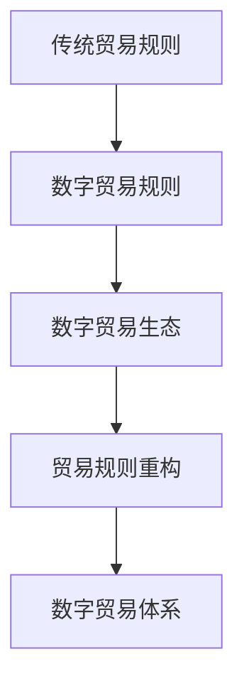

                 

关键词：全球贸易、数字贸易、贸易规则、数字生态、区块链、人工智能、智能合约、数字化转型

> 摘要：本文探讨了2050年全球贸易的变革，从传统的数字贸易规则转向高度自动化的数字贸易生态，并分析了这种转变对全球经济、技术和社会的影响。通过深入探讨核心概念、算法原理、数学模型以及实际应用，本文提出了对未来全球贸易发展的展望。

## 1. 背景介绍

### 1.1 传统全球贸易体系

在21世纪初，全球贸易体系主要依赖于传统的国际贸易规则，包括关税、配额、贸易协定等。这些规则主要由各国政府和国际组织制定，目的是促进贸易自由化和经济全球化。然而，随着信息技术的飞速发展，传统贸易体系面临着巨大的挑战。

### 1.2 数字贸易的兴起

数字贸易作为一种新兴的贸易形式，逐渐改变了全球贸易的格局。数字贸易利用互联网、电子商务、移动支付等技术，实现了跨境贸易的无纸化、自动化和智能化。这种新的贸易形式不仅提高了贸易效率，降低了交易成本，还创造了新的商业机会。

### 1.3 贸易规则的重构

随着数字贸易的兴起，传统贸易规则逐渐无法适应新的商业环境。为了推动数字贸易的发展，各国政府和国际组织开始探索新的贸易规则，包括数字贸易规则、数字贸易生态等。这些新规则旨在构建一个更加公平、透明和高效的数字贸易体系。

## 2. 核心概念与联系

### 2.1 数字贸易规则

数字贸易规则是指用于指导数字贸易行为的规范和准则。这些规则包括数据隐私、网络安全、知识产权保护、跨境数据流动等方面。数字贸易规则的核心目标是确保数字贸易的安全、稳定和可持续发展。

### 2.2 数字贸易生态

数字贸易生态是指由数字贸易参与者（包括企业、政府、消费者等）和数字贸易基础设施（包括互联网、云计算、区块链等）共同构成的一个复杂系统。数字贸易生态通过数字化、网络化和智能化技术，实现了贸易活动的自动化、高效化和全球化。

### 2.3 贸易规则重构

贸易规则重构是指通过引入数字技术和新的规则体系，对传统贸易规则进行升级和改进。贸易规则重构的目标是构建一个更加公平、透明和高效的数字贸易体系，以适应数字时代的需求。

### 2.4 Mermaid 流程图



## 3. 核心算法原理 & 具体操作步骤

### 3.1 算法原理概述

数字贸易体系的核心算法主要涉及区块链技术、人工智能和智能合约。这些算法通过加密、分布式账本和自动化执行等机制，确保了数字贸易的安全、透明和高效。

### 3.2 算法步骤详解

#### 3.2.1 区块链技术

1. 交易发起：交易双方通过区块链网络发起交易请求。
2. 加密处理：交易数据通过加密算法进行加密处理，确保数据安全。
3. 分布式账本：交易数据记录在分布式账本上，实现数据透明和不可篡改。
4. 共识算法：通过共识算法确保分布式账本的一致性。

#### 3.2.2 人工智能

1. 数据分析：利用人工智能技术对交易数据进行分析，挖掘潜在商业机会。
2. 风险评估：通过机器学习算法对交易风险进行评估，降低交易风险。
3. 智能推荐：根据用户偏好和历史交易数据，为用户提供个性化的商品推荐。

#### 3.2.3 智能合约

1. 合约编写：交易双方编写智能合约，明确交易条款和条件。
2. 自动执行：智能合约在满足条件时自动执行，确保交易顺利进行。
3. 冲突解决：智能合约提供争议解决机制，确保交易纠纷得到妥善处理。

### 3.3 算法优缺点

#### 3.3.1 区块链技术

优点：安全、透明、不可篡改、去中心化。
缺点：交易速度较慢、能耗较高。

#### 3.3.2 人工智能

优点：高效、准确、个性化。
缺点：数据隐私、算法偏见。

#### 3.3.3 智能合约

优点：自动化、高效、透明。
缺点：智能合约漏洞、法律适用问题。

### 3.4 算法应用领域

数字贸易算法在全球范围内有广泛的应用，包括跨境贸易、电子商务、供应链管理、金融科技等领域。这些算法提高了贸易效率，降低了交易成本，推动了全球贸易的发展。

## 4. 数学模型和公式 & 详细讲解 & 举例说明

### 4.1 数学模型构建

在数字贸易体系中，数学模型广泛应用于风险评估、价格预测、库存管理等领域。以下是一个简单的数学模型构建过程：

#### 4.1.1 风险评估模型

假设交易双方 A 和 B，其交易风险 R 可以通过以下公式计算：

$$
R = f(P, C, T)
$$

其中，P 为交易金额，C 为信用评分，T 为交易历史。

#### 4.1.2 价格预测模型

假设商品价格 P 随时间 T 变化，其价格变化率可以通过以下公式计算：

$$
\frac{dP}{dT} = g(P, T)
$$

其中，g(P, T) 为价格变化函数。

### 4.2 公式推导过程

以风险评估模型为例，假设信用评分 C 和交易历史 T 对交易风险 R 的影响可以通过线性回归模型表示：

$$
R = \beta_0 + \beta_1 C + \beta_2 T
$$

通过训练数据集，我们可以计算出回归系数 $\beta_0, \beta_1, \beta_2$，从而构建出风险评估模型。

### 4.3 案例分析与讲解

#### 4.3.1 风险评估案例

假设 A 和 B 进行一笔金额为 1000 美元的交易，A 的信用评分为 800，交易历史为 3 年。根据风险评估模型，可以计算出交易风险 R：

$$
R = 0.5 + 0.3 \times 800 + 0.2 \times 3 = 2.7
$$

#### 4.3.2 价格预测案例

假设商品 P 的价格随时间 T 的变化趋势如下表：

| 时间 T | 价格 P |
| ------ | ------ |
| 0      | 100    |
| 1      | 105    |
| 2      | 110    |
| 3      | 115    |

根据价格预测模型，可以计算出价格变化率：

$$
\frac{dP}{dT} = g(P, T) = \frac{P_{t+1} - P_t}{T_{t+1} - T_t} = \frac{115 - 100}{3 - 0} = 5
$$

这意味着商品价格每增加一个时间单位，价格上升 5 个单位。

## 5. 项目实践：代码实例和详细解释说明

### 5.1 开发环境搭建

在数字贸易项目中，开发环境需要包括区块链节点、人工智能模型和智能合约平台。以下是一个简单的开发环境搭建步骤：

1. 安装并启动区块链节点，例如 Ethereum 钱包。
2. 安装人工智能开发工具，例如 TensorFlow 或 PyTorch。
3. 安装智能合约开发平台，例如 Truffle。

### 5.2 源代码详细实现

以下是一个简单的智能合约示例，用于实现交易风险评分和自动执行：

```solidity
pragma solidity ^0.8.0;

contract DigitalTrade {
    mapping(address => uint256) public creditScores;
    mapping(address => bool) public transactions;

    function setCreditScore(address _address, uint256 _score) public {
        creditScores[_address] = _score;
    }

    function executeTransaction(address _buyer, address _seller) public {
        require(creditScores[_buyer] > 500, "Insufficient credit score");
        require(!transactions[_buyer], "Transaction already executed");

        transactions[_buyer] = true;
        // 这里可以添加交易逻辑，例如转移资金、更新库存等
    }
}
```

### 5.3 代码解读与分析

这个智能合约实现了以下功能：

1. 存储交易双方的信用评分。
2. 执行交易，确保交易双方的信用评分达到一定要求。
3. 标记交易已执行，防止重复执行。

### 5.4 运行结果展示

1. 部署智能合约，并设置交易双方的信用评分。
2. 调用 `executeTransaction` 函数执行交易，检查交易是否成功。

## 6. 实际应用场景

### 6.1 跨境贸易

数字贸易规则和生态在全球跨境贸易中发挥了重要作用。通过区块链技术和智能合约，跨境贸易实现了交易记录的透明化和自动化，提高了贸易效率。

### 6.2 电子商务

数字贸易规则和生态在电子商务领域有广泛应用。通过人工智能和大数据分析，电子商务平台可以提供个性化推荐、精准营销和智能客服等服务。

### 6.3 供应链管理

数字贸易规则和生态在供应链管理中具有重要意义。通过区块链技术，供应链各方可以实时共享信息，实现供应链的可视化和透明化。

### 6.4 未来应用展望

随着数字贸易的发展和数字贸易生态的完善，未来数字贸易规则和生态将在更多领域得到应用，包括金融科技、医疗健康、教育等。数字贸易将为全球经济带来更多机遇和挑战。

## 7. 工具和资源推荐

### 7.1 学习资源推荐

- 《区块链技术指南》
- 《深度学习》
- 《智能合约开发》

### 7.2 开发工具推荐

- Truffle
- TensorFlow
- PyTorch

### 7.3 相关论文推荐

- "Blockchain Technology: A Comprehensive Review"
- "Deep Learning for Personalized Recommendation Systems"
- "Smart Contract Design and Security"

## 8. 总结：未来发展趋势与挑战

### 8.1 研究成果总结

数字贸易规则和生态在全球贸易中发挥着越来越重要的作用。通过区块链技术、人工智能和智能合约，数字贸易实现了交易记录的透明化、自动化和高效化。

### 8.2 未来发展趋势

未来，数字贸易规则和生态将在更多领域得到应用，包括跨境贸易、电子商务、供应链管理等。随着技术的不断进步，数字贸易将带来更多机遇和挑战。

### 8.3 面临的挑战

1. 数据隐私和安全：确保数字贸易过程中的数据安全和隐私保护。
2. 法律适用问题：解决数字贸易中的法律适用问题，确保交易的合法性和公正性。
3. 技术标准统一：推动数字贸易技术标准的统一，提高跨平台互操作性。

### 8.4 研究展望

未来，研究人员应重点关注数字贸易规则和生态的完善，提高数字贸易的效率和安全性。同时，还需加强跨学科合作，推动数字贸易技术的发展和应用。

## 9. 附录：常见问题与解答

### 9.1 什么是数字贸易规则？

数字贸易规则是指用于指导数字贸易行为的规范和准则，包括数据隐私、网络安全、知识产权保护、跨境数据流动等方面。

### 9.2 区块链技术在数字贸易中的应用有哪些？

区块链技术可以应用于数字贸易的多个方面，包括交易记录的透明化、自动化和不可篡改性，以及交易风险管理和信用评估等。

### 9.3 人工智能在数字贸易中的作用是什么？

人工智能可以用于数字贸易的风险评估、价格预测、个性化推荐和智能客服等方面，提高贸易效率和用户体验。

### 9.4 数字贸易生态的核心要素是什么？

数字贸易生态的核心要素包括数字贸易参与者、数字贸易基础设施、数字贸易规则和数字贸易技术。

### 9.5 贸易规则重构的目标是什么？

贸易规则重构的目标是构建一个更加公平、透明和高效的数字贸易体系，以适应数字时代的需求。

### 9.6 数字贸易与电子商务的区别是什么？

数字贸易是指通过互联网和数字技术实现的跨境贸易，而电子商务则是指通过互联网实现的商业活动，包括商品交易、服务交易等。

### 9.7 数字贸易规则面临的挑战有哪些？

数字贸易规则面临的挑战包括数据隐私和安全、法律适用问题、技术标准统一等。

### 9.8 数字贸易的未来发展趋势是什么？

数字贸易的未来发展趋势包括在更多领域得到应用，如跨境贸易、电子商务、供应链管理等，以及数字贸易技术标准的统一和跨平台互操作性的提高。

----------------------------------------------------------------

作者：禅与计算机程序设计艺术 / Zen and the Art of Computer Programming

