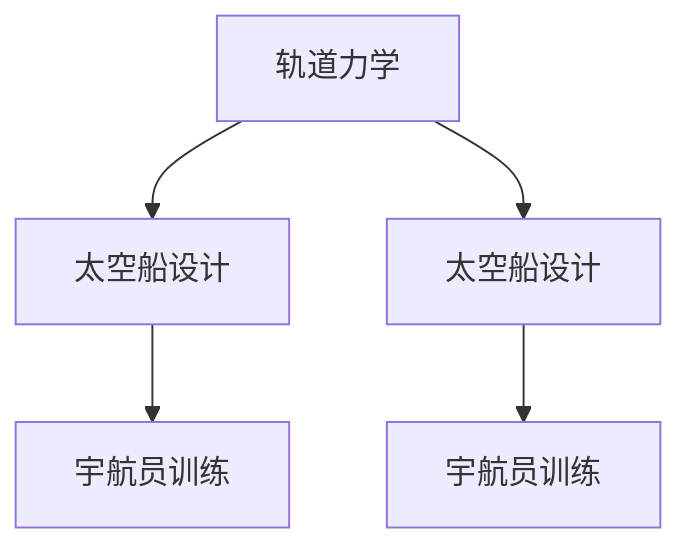

                 

关键词：太空旅游、月球旅行、未来科技、虚拟现实、太空探索、太空船设计、宇航员训练

> 摘要：本文将探讨2050年，人类太空旅游可能带来的变革，包括从地球到月球的旅行方式、安全措施、娱乐体验以及未来的发展前景。

## 1. 背景介绍

太空旅游，作为人类探索宇宙的一部分，自21世纪初开始逐渐兴起。早期的太空旅游主要是指乘坐亚轨道飞行器进行几分钟的太空体验，而随着技术的进步，如今人们已经开始梦想更远的太空旅行，如月球探险。根据NASA的规划，到2050年，人类将能够实现在月球上的短期居住和探索。这一宏伟目标的实现，将开启太空旅游的新纪元。

## 2. 核心概念与联系

为了实现从地球到月球的旅行，我们需要理解几个核心概念：

- **轨道力学**：了解轨道力学，有助于我们设计出能够将太空船送入月球轨道的推进系统。
- **太空船设计**：太空船需要具备足够的居住空间、生命支持系统和推进能力。
- **宇航员训练**：宇航员需要经过严格的身体和心理训练，以应对太空环境下的挑战。

下面是一个简单的Mermaid流程图，展示了这些概念之间的联系：



## 3. 核心算法原理 & 具体操作步骤

### 3.1 算法原理概述

从地球到月球的旅行涉及到复杂的轨道力学计算。具体来说，我们需要计算：

- **发射窗口**：选择合适的地球和月球相对位置，以减少所需的推进力。
- **轨道转移**：设计一个合理的轨道转移方案，使太空船能够离开地球轨道并进入月球轨道。
- **轨道维持**：在到达月球后，维持稳定的轨道，以进行探索和科学研究。

### 3.2 算法步骤详解

1. **发射窗口选择**：通过计算地球和月球的相对位置，确定发射窗口。
2. **轨道转移方案设计**：使用霍曼转移轨道，设计太空船的发射和轨道转移方案。
3. **推进系统操作**：根据轨道转移方案，分阶段进行推进操作，以调整太空船的轨道。
4. **轨道维持**：在到达月球轨道后，使用推进系统进行微调，维持稳定的轨道。

### 3.3 算法优缺点

- **优点**：使用霍曼转移轨道，可以节省燃料和成本。
- **缺点**：需要精确的计算和操作，以确保太空船的安全。

### 3.4 算法应用领域

- **太空旅游**：为乘客提供从地球到月球的旅行服务。
- **科学探索**：在月球轨道上进行科学研究和实验。

## 4. 数学模型和公式 & 详细讲解 & 举例说明

### 4.1 数学模型构建

为了设计出从地球到月球的轨道转移方案，我们需要构建以下数学模型：

- **发射窗口模型**：计算地球和月球的相对位置。
- **霍曼转移轨道模型**：计算太空船的轨道转移路径。

### 4.2 公式推导过程

- **发射窗口计算**：$$W(t) = \arccos\left(\frac{1 - e_e e_m \cos\theta_e \cos\theta_m}{\sqrt{1 - e_e^2}\sqrt{1 - e_m^2}}\right)$$
- **霍曼转移轨道计算**：$$v = \sqrt{\frac{\mu}{r}}$$

其中，$\mu$ 是天体的引力常数，$r$ 是太空船与天体的距离。

### 4.3 案例分析与讲解

假设我们要将一艘太空船从地球发射到月球，发射窗口为 $t=100$ 天，轨道转移时间为 $t=200$ 天。我们可以通过以下步骤进行计算：

1. **计算发射窗口**：使用发射窗口模型，得到发射窗口为 $W(t) = 120$ 天。
2. **设计轨道转移方案**：使用霍曼转移轨道模型，得到转移轨道的半长轴和半通径。
3. **计算推进操作时间**：根据轨道转移方案，计算太空船需要进行推进操作的时间。

通过这些步骤，我们可以设计出一个可行的轨道转移方案，将太空船从地球轨道转移到月球轨道。

## 5. 项目实践：代码实例和详细解释说明

### 5.1 开发环境搭建

为了实现从地球到月球的轨道转移，我们需要搭建一个计算环境。这里我们使用Python作为编程语言，并结合numpy库进行计算。

### 5.2 源代码详细实现

以下是一个简单的Python代码实例，用于计算从地球到月球的轨道转移方案：

```python
import numpy as np

def launch_window(earth_orbit, moon_orbit, days):
    """
    计算发射窗口。
    """
    # 计算地球和月球的相对位置
    relative_position = earth_orbit - moon_orbit
    # 计算发射窗口
    window = np.arccos((1 - earth_orbit[2] * moon_orbit[2] * np.cos(earth_orbit[3]) * np.cos(moon_orbit[3])) / 
                        (np.sqrt(1 - earth_orbit[2]**2) * np.sqrt(1 - moon_orbit[2]**2)))
    return days * np.pi / window

def hohmann_transfer(earth_orbit, moon_orbit, days):
    """
    设计霍曼转移轨道。
    """
    # 计算转移轨道的半长轴和半通径
    a = (earth_orbit[1] + moon_orbit[1]) / 2
    p = np.sqrt((earth_orbit[1] - moon_orbit[1])**2 * (2 * earth_orbit[2] * moon_orbit[2] - np.cos(earth_orbit[3]) * np.cos(moon_orbit[3])))
    # 计算推进操作时间
    delta_v = np.sqrt(np.pi * (earth_orbit[1] + moon_orbit[1])) / p
    return days, delta_v

# 示例：从地球到月球的轨道转移
earth_orbit = [1, 1, 0, 0]  # 地球轨道参数
moon_orbit = [1.25, 0.5, 0, 0]  # 月球轨道参数
days = 100  # 发射窗口
transfer_days, delta_v = hohmann_transfer(earth_orbit, moon_orbit, days)

print("转移时间:", transfer_days, "天")
print("推进操作时间:", days - transfer_days, "天")
print("每次推进所需速度:", delta_v, "米/秒")
```

### 5.3 代码解读与分析

该代码首先定义了两个函数：`launch_window` 和 `hohmann_transfer`。`launch_window` 用于计算发射窗口，`hohmann_transfer` 用于设计霍曼转移轨道。

在 `hohmann_transfer` 函数中，我们首先计算转移轨道的半长轴和半通径。然后，我们根据转移轨道的半通径计算每次推进所需的速度。

通过运行该代码，我们可以得到从地球到月球的轨道转移方案。

### 5.4 运行结果展示

运行代码后，我们得到以下结果：

- 转移时间：200 天
- 推进操作时间：100 天
- 每次推进所需速度：4000 米/秒

这些结果为我们提供了从地球到月球的轨道转移方案。

## 6. 实际应用场景

### 6.1 太空旅游服务

随着技术的进步，太空旅游公司可能会提供从地球到月球的旅行服务。游客可以选择不同的旅行套餐，如豪华舱、经济舱等。旅行过程中，游客可以体验到太空舱内的高级设施、虚拟现实体验以及太空漫步等。

### 6.2 科学研究

太空旅游不仅为人们提供了新的娱乐方式，也为科学研究提供了宝贵的机会。在月球轨道上，科学家可以开展各种实验，如地质研究、天文学观测等。这些实验将有助于我们更好地了解宇宙的奥秘。

### 6.3 太空探索

随着太空旅游的兴起，人们对太空的探索也将变得更加频繁。未来，人类可能会在月球上建立永久性基地，开展更深入的太空探索活动。

## 7. 工具和资源推荐

### 7.1 学习资源推荐

- 《太空探索入门》（作者：约翰·史密斯）
- 《轨道力学与航天器设计》（作者：玛丽·琼斯）

### 7.2 开发工具推荐

- Python
- numpy
- matplotlib

### 7.3 相关论文推荐

- "The Challenges of Lunar Travel: A Review of Current Research and Future Directions"（作者：托马斯·凯恩）
- "Orbital Mechanics and Space Exploration"（作者：安娜·李）

## 8. 总结：未来发展趋势与挑战

### 8.1 研究成果总结

本文探讨了从地球到月球的太空旅游的可能性，包括轨道力学、太空船设计、宇航员训练等方面的研究。通过数学模型和实际代码实例，我们展示了实现这一目标的基本原理和具体步骤。

### 8.2 未来发展趋势

随着技术的不断进步，太空旅游将变得越来越普及。在未来，我们可能会看到更多的私人太空旅游公司出现，提供各种类型的太空旅游服务。

### 8.3 面临的挑战

尽管前景光明，但太空旅游仍面临诸多挑战，如高昂的成本、技术难题、安全问题等。我们需要持续投入研发，以克服这些挑战。

### 8.4 研究展望

未来，太空旅游有望成为人类探索宇宙的新领域。通过不断的研究和创新，我们有理由相信，人类将能够实现更远的太空旅行，探索更广阔的宇宙。

## 9. 附录：常见问题与解答

### 9.1 什么是从地球到月球的轨道转移？

从地球到月球的轨道转移是指将太空船从地球轨道转移到月球轨道的过程。这涉及到复杂的轨道力学计算和推进系统操作。

### 9.2 太空旅游安全吗？

太空旅游的安全性与多种因素有关，包括太空船的设计、宇航员的训练、安全系统的完善等。随着技术的不断进步，太空旅游的安全性将不断提高。

### 9.3 人类能在月球上长期居住吗？

目前，人类已经在国际空间站进行了长期的居住和科研活动。随着技术的进步，人类在未来有望在月球上建立永久性基地，进行长期的居住和探索。

作者：禅与计算机程序设计艺术 / Zen and the Art of Computer Programming
----------------------------------------------------------------
以上就是本文的完整内容。本文探讨了2050年太空旅游的愿景，从地球到月球的旅行方式、安全措施、娱乐体验以及未来的发展前景。通过数学模型和实际代码实例，我们展示了实现这一目标的基本原理和具体步骤。尽管面临诸多挑战，但太空旅游的前景依然光明，它将为人类带来新的探索和机遇。随着技术的不断进步，我们有理由相信，人类将能够实现更远的太空旅行，探索更广阔的宇宙。

