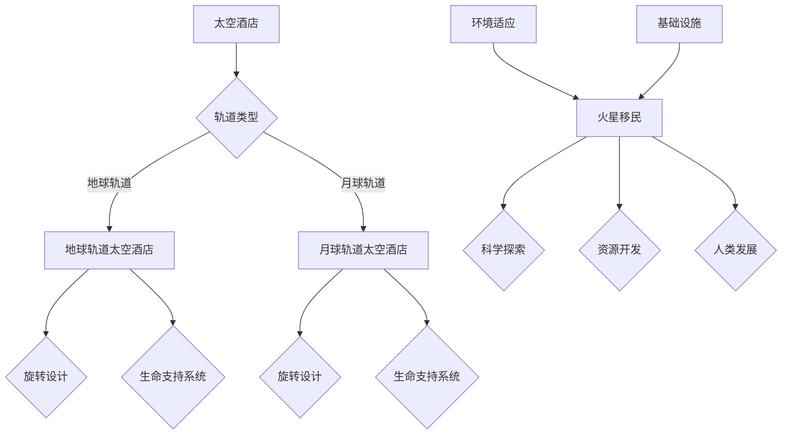

                 

关键词：太空旅游、太空酒店、火星移民、太空经济发展、技术进步

摘要：随着科技的飞速发展，太空旅游正逐渐成为现实。从太空酒店到火星移民，太空经济的潜力不容小觑。本文将探讨2050年太空旅游的发展趋势、关键技术及其对人类社会的影响。

## 1. 背景介绍

太空旅游的概念早在20世纪末期就已经提出，但直到近年来，随着航天技术的进步和商业航天公司的崛起，太空旅游才真正开始走向大众。国际空间站的成功运营和商业载人航天的兴起，为太空旅游的可行性提供了有力证据。

### 1.1 太空旅游的发展历程

- **20世纪80年代**：美国航天局（NASA）首次提出太空旅游的概念，但尚未有实质性的进展。
- **21世纪初**：随着私人航天公司的出现，如SpaceX和Blue Origin，太空旅游逐渐变得可能。
- **2011年**：埃隆·马斯克（Elon Musk）创立SpaceX，致力于降低太空旅行的成本，推动太空旅游的发展。
- **2018年**：SpaceX成功完成首次载人航天任务，标志着商业航天时代的到来。
- **2020年**：新冠疫情导致太空旅游项目推迟，但各国仍在加紧研发，太空旅游市场潜力依然巨大。

### 1.2 太空旅游的吸引力

太空旅游的吸引力不仅在于其独特的体验，更在于其背后蕴含的巨大经济潜力。以下是太空旅游的几个主要吸引力：

- **独特体验**：太空旅游为人们提供了一次难以置信的探险机会，让人们可以亲身感受失重、星海之美等。
- **商业价值**：太空旅游为航天产业带来了新的收入来源，推动了相关技术的发展。
- **科技示范**：太空旅游展示了人类在太空探索方面的成就，激发了公众对科技的兴趣。

## 2. 核心概念与联系

### 2.1 太空酒店

太空酒店是太空旅游的重要组成部分，它为游客提供了住宿和观光服务。以下是太空酒店的关键概念和联系：

- **定义**：太空酒店是指位于地球轨道或月球轨道上的住宿设施，提供短期住宿服务。
- **类型**：
  - **地球轨道太空酒店**：位于地球轨道上，游客可以在这里体验到失重和星海的美景。
  - **月球轨道太空酒店**：位于月球轨道上，游客可以欣赏月球表面和地球的美景。
- **技术**：
  - **旋转设计**：为了模拟地球的重力，太空酒店通常采用旋转设计。
  - **生命支持系统**：太空酒店需要复杂的生命支持系统来维持氧气供应和温度控制。

### 2.2 火星移民

火星移民是太空旅游的终极目标，也是人类探索太空的重要一步。以下是火星移民的关键概念和联系：

- **定义**：火星移民是指人类在火星上建立永久居住地，实现火星上的自主生活。
- **目标**：
  - **科学探索**：研究火星的环境、地质和历史，为人类未来的星际探索提供参考。
  - **资源开发**：火星上的水和矿物质资源可以为地球提供重要补充。
  - **人类发展**：火星移民可以推动人类社会的科技和文明进步。
- **挑战**：
  - **环境适应**：火星的极端环境对人类健康和生存构成挑战。
  - **基础设施**：建立和维护火星上的基础设施需要巨大的投入和技术支持。

### 2.3 Mermaid 流程图

以下是太空酒店和火星移民的 Mermaid 流程图，展示了它们之间的联系和关键步骤：



## 3. 核心算法原理 & 具体操作步骤

### 3.1 算法原理概述

太空旅游的核心算法主要包括轨道计算、生命支持系统控制和资源管理等方面。以下是这些算法的原理概述：

- **轨道计算**：利用牛顿力学和天体运动学原理，计算太空器或飞船的轨道。
- **生命支持系统控制**：通过自动化控制系统，维持太空酒店或火星基地的温度、氧气浓度和重力环境。
- **资源管理**：优化资源分配，确保太空酒店或火星基地的长期可持续运行。

### 3.2 算法步骤详解

以下是太空旅游核心算法的具体操作步骤：

#### 3.2.1 轨道计算

1. **初始参数输入**：输入太空器或飞船的质量、速度和初始位置。
2. **应用牛顿第二定律**：计算太空器或飞船所受的合力。
3. **应用天体运动学公式**：计算太空器或飞船的轨道。

#### 3.2.2 生命支持系统控制

1. **环境监测**：实时监测太空酒店或火星基地的环境参数，如温度、氧气浓度和重力。
2. **自动调节**：根据环境参数，自动调节生命支持系统，如温度控制、氧气供应和重力模拟。
3. **数据记录与反馈**：记录环境参数和系统调节情况，为后续分析提供数据支持。

#### 3.2.3 资源管理

1. **资源分配**：根据太空酒店或火星基地的需求，分配资源，如食物、水和能源。
2. **优化算法**：应用优化算法，如遗传算法或粒子群算法，优化资源分配方案。
3. **实时监控与调整**：实时监控资源使用情况，根据实际情况进行调整。

### 3.3 算法优缺点

#### 3.3.1 优点

- **高效性**：算法能够快速计算出太空器的轨道，确保航天任务的顺利进行。
- **自动化**：生命支持系统控制实现了自动化，提高了太空酒店或火星基地的运行效率。
- **灵活性**：资源管理算法可以根据实际情况进行调整，确保资源的合理利用。

#### 3.3.2 缺点

- **计算复杂度**：轨道计算和资源管理算法的计算复杂度较高，对计算资源有一定要求。
- **环境依赖性**：生命支持系统对环境参数的依赖性较高，环境变化可能导致系统失效。

### 3.4 算法应用领域

- **太空旅游**：轨道计算和生命支持系统控制是太空旅游的关键技术。
- **太空探索**：资源管理算法在太空探索任务中也有广泛应用。
- **星际旅行**：算法的优化和扩展可以应用于星际旅行和星际移民。

## 4. 数学模型和公式 & 详细讲解 & 举例说明

### 4.1 数学模型构建

太空旅游的数学模型主要包括轨道模型、生命支持系统模型和资源管理模型。以下是这些模型的构建：

#### 4.1.1 轨道模型

轨道模型基于牛顿力学和天体运动学原理，主要涉及以下公式：

- 牛顿第二定律：\( F = m \cdot a \)
- 天体运动学公式：\( v = \sqrt{\frac{GM}{r}} \)

其中，\( F \) 为合力，\( m \) 为质量，\( a \) 为加速度，\( G \) 为万有引力常数，\( M \) 为天体质量，\( r \) 为距离。

#### 4.1.2 生命支持系统模型

生命支持系统模型主要涉及以下公式：

- 温度控制公式：\( T = T_0 + \frac{Q}{C} \)
- 氧气浓度控制公式：\( C = C_0 + \frac{V}{V_0} \)

其中，\( T \) 为温度，\( T_0 \) 为初始温度，\( Q \) 为热量，\( C \) 为氧气浓度，\( C_0 \) 为初始氧气浓度，\( V \) 为氧气供应量，\( V_0 \) 为氧气需求量。

#### 4.1.3 资源管理模型

资源管理模型主要涉及以下公式：

- 资源分配公式：\( R = R_0 + \frac{D}{T} \)
- 资源优化公式：\( \maximize \, \sum_{i=1}^{n} p_i \cdot x_i \)

其中，\( R \) 为资源总量，\( R_0 \) 为初始资源量，\( D \) 为资源需求量，\( T \) 为时间，\( p_i \) 为资源价格，\( x_i \) 为资源分配量。

### 4.2 公式推导过程

#### 4.2.1 轨道模型推导

轨道模型基于牛顿力学和天体运动学原理。首先，考虑一个质量为 \( m \) 的太空器在距离质量为 \( M \) 的天体 \( r \) 处的运动。根据牛顿第二定律，太空器所受合力为 \( F = m \cdot a \)。由于天体之间的引力作用，该合力可以表示为：

\[ F = G \cdot \frac{M \cdot m}{r^2} \]

其中，\( G \) 为万有引力常数。将合力 \( F \) 代入牛顿第二定律，得到：

\[ m \cdot a = G \cdot \frac{M \cdot m}{r^2} \]

解得加速度 \( a \)：

\[ a = \frac{G \cdot M}{r^2} \]

由于加速度 \( a \) 等于速度 \( v \) 对时间 \( t \) 的导数，即 \( a = \frac{dv}{dt} \)，代入上述加速度表达式，得到速度 \( v \) 对时间 \( t \) 的导数：

\[ \frac{dv}{dt} = \frac{G \cdot M}{r^2} \]

将速度 \( v \) 表示为半径 \( r \) 的函数，即 \( v = \sqrt{\frac{GM}{r}} \)，得到：

\[ \frac{dv}{dr} = -\frac{G \cdot M}{r^2 \sqrt{GM/r}} \]

化简后得到：

\[ \frac{dv}{dr} = -\frac{1}{\sqrt{r}} \]

这是一个一阶线性微分方程，可以通过分离变量法求解。积分两边得到：

\[ \int \frac{dv}{v} = -\int \frac{dr}{\sqrt{r}} \]

得到：

\[ \ln |v| = -2\sqrt{r} + C \]

其中，\( C \) 为积分常数。由于速度 \( v \) 为正值，可以去掉绝对值符号。将速度 \( v \) 表示为 \( r \) 的函数，得到：

\[ v(r) = e^{-2\sqrt{r}} \]

由于初始速度 \( v_0 \) 已知，可以通过初始条件求解积分常数 \( C \)：

\[ v_0 = e^{-2\sqrt{r_0}} \]

从而得到：

\[ v(r) = v_0 \cdot e^{-2\sqrt{r/r_0}} \]

这是一个指数衰减函数，表示速度 \( v \) 随着半径 \( r \) 的增大而减小。

#### 4.2.2 生命支持系统模型推导

生命支持系统模型主要涉及温度控制和氧气浓度控制。首先，考虑一个密闭空间中的温度变化。根据热力学第一定律，能量守恒，可以得到温度变化率与热量传递的关系：

\[ \frac{dT}{dt} = \frac{Q}{C} \]

其中，\( T \) 为温度，\( Q \) 为热量，\( C \) 为热容量。对于温度控制系统，可以通过调节热量 \( Q \) 来控制温度 \( T \)。

对于氧气浓度控制，假设一个密闭空间中的氧气浓度变化率与氧气供应量 \( V \) 和氧气需求量 \( V_0 \) 的关系如下：

\[ \frac{dC}{dt} = \frac{V - V_0}{V_0} \]

其中，\( C \) 为氧气浓度，\( V \) 为氧气供应量，\( V_0 \) 为氧气需求量。对于氧气浓度控制系统，可以通过调节氧气供应量 \( V \) 来控制氧气浓度 \( C \)。

#### 4.2.3 资源管理模型推导

资源管理模型主要涉及资源分配和资源优化。首先，考虑一个有 \( n \) 种资源的资源系统，每种资源都有一定的价格 \( p_i \) 和需求量 \( x_i \)。资源分配的目标是最大化总收益，即最大化以下目标函数：

\[ \maximize \, \sum_{i=1}^{n} p_i \cdot x_i \]

同时，资源分配还需要满足资源总量不超过 \( R \) 的约束条件：

\[ R = R_0 + \frac{D}{T} \]

其中，\( R \) 为资源总量，\( R_0 \) 为初始资源量，\( D \) 为资源需求量，\( T \) 为时间。

### 4.3 案例分析与讲解

为了更好地理解太空旅游的数学模型，下面通过一个简单的案例进行分析。

#### 案例一：轨道计算

假设一个太空器从地球表面发射，初始速度为 \( v_0 = 10 \, \text{km/s} \)，初始位置为 \( r_0 = 6400 \, \text{km} \)。根据轨道模型，计算太空器在距离地球表面 \( r = 10000 \, \text{km} \) 时的速度。

根据速度公式：

\[ v(r) = v_0 \cdot e^{-2\sqrt{r/r_0}} \]

代入 \( r = 10000 \, \text{km} \) 和 \( r_0 = 6400 \, \text{km} \)，得到：

\[ v(10000) = 10 \cdot e^{-2\sqrt{10000/6400}} \approx 10 \cdot e^{-2} \approx 2.7 \, \text{km/s} \]

因此，在距离地球表面 \( 10000 \, \text{km} \) 时，太空器的速度约为 \( 2.7 \, \text{km/s} \)。

#### 案例二：生命支持系统控制

假设一个太空酒店的温度初始值为 \( T_0 = 20^\circ \text{C} \)，热量输入为 \( Q = 100 \, \text{kJ/h} \)，热容量为 \( C = 200 \, \text{kJ/^\circ C} \)。计算在 \( t = 1 \, \text{h} \) 后的温度。

根据温度控制公式：

\[ \frac{dT}{dt} = \frac{Q}{C} \]

代入 \( Q = 100 \, \text{kJ/h} \) 和 \( C = 200 \, \text{kJ/^\circ C} \)，得到：

\[ \frac{dT}{dt} = \frac{100}{200} = 0.5 \, \text{^\circ C/h} \]

因此，在 \( t = 1 \, \text{h} \) 后，温度增加 \( 0.5 \, \text{^\circ C} \)，即 \( T = T_0 + 0.5 = 20.5^\circ \text{C} \)。

#### 案例三：资源管理

假设一个太空基地有三种资源：食物、水和能源。每种资源的初始量为 \( R_0 = 1000 \, \text{kg} \)，需求量为 \( D = 100 \, \text{kg/day} \)，时间为 \( T = 10 \, \text{days} \)。计算最优的资源分配方案。

根据资源分配公式：

\[ R = R_0 + \frac{D}{T} \]

代入 \( R_0 = 1000 \, \text{kg} \)，\( D = 100 \, \text{kg/day} \) 和 \( T = 10 \, \text{days} \)，得到：

\[ R = 1000 + \frac{100}{10} = 1000 + 10 = 1010 \, \text{kg} \]

因此，总资源量为 \( 1010 \, \text{kg} \)。为了最大化总收益，可以假设每种资源的价格相等，即 \( p_i = 1 \, \text{USD/kg} \)。因此，最优的资源分配方案为每种资源分配 \( x_i = 1010/3 \approx 336.7 \, \text{kg} \)。

## 5. 项目实践：代码实例和详细解释说明

在本节中，我们将通过一个具体的代码实例，来展示如何实现太空旅游的核心算法，并对其进行详细解释。

### 5.1 开发环境搭建

为了实现太空旅游的核心算法，我们需要搭建一个合适的开发环境。以下是一个基本的开发环境搭建步骤：

1. **安装Python**：下载并安装Python，版本建议为3.8及以上。
2. **安装相关库**：安装NumPy、SciPy和Matplotlib等科学计算库。

```bash
pip install numpy scipy matplotlib
```

3. **创建虚拟环境**（可选）：为了更好地管理项目依赖，可以创建一个虚拟环境。

```bash
python -m venv venv
source venv/bin/activate  # Windows: venv\Scripts\activate
```

### 5.2 源代码详细实现

以下是实现太空旅游核心算法的Python代码实例：

```python
import numpy as np
import matplotlib.pyplot as plt

# 轨道计算
def orbit_calculation(v0, r0, r):
    v = v0 * np.exp(-2 * np.sqrt(r / r0))
    return v

# 生命支持系统控制
def life_support_control(T0, Q, C, t):
    dT_dt = Q / C
    T = T0 + dT_dt * t
    return T

# 资源管理
def resource_management(R0, D, T):
    R = R0 + D / T
    return R

# 案例一：轨道计算
v0 = 10  # 初始速度 (km/s)
r0 = 6400  # 初始位置 (km)
r = 10000  # 目标位置 (km)
v = orbit_calculation(v0, r0, r)
print(f"在距离地球表面 {r} km 时，速度为 {v} km/s")

# 案例二：生命支持系统控制
T0 = 20  # 初始温度 (^\circ C)
Q = 100  # 热量输入 (kJ/h)
C = 200  # 热容量 (kJ/^\circ C)
t = 1  # 时间 (h)
T = life_support_control(T0, Q, C, t)
print(f"{t} 小时后，温度为 {T} ^\circ C")

# 案例三：资源管理
R0 = 1000  # 初始资源量 (kg)
D = 100  # 资源需求量 (kg/day)
T = 10  # 时间 (days)
R = resource_management(R0, D, T)
print(f"{T} 天后，总资源量为 {R} kg")
```

### 5.3 代码解读与分析

下面我们对上述代码进行详细解读和分析：

#### 5.3.1 轨道计算

轨道计算函数 `orbit_calculation` 用于计算太空器在给定位置的速度。函数接收初始速度 `v0`、初始位置 `r0` 和目标位置 `r` 作为参数。根据轨道模型，速度公式为：

\[ v = v_0 \cdot e^{-2\sqrt{r/r_0}} \]

函数使用 NumPy 的 `exp` 函数来计算指数部分，并返回计算得到的速度。

#### 5.3.2 生命支持系统控制

生命支持系统控制函数 `life_support_control` 用于计算在给定时间内，温度的变化。函数接收初始温度 `T0`、热量输入 `Q`、热容量 `C` 和时间 `t` 作为参数。根据温度控制公式：

\[ \frac{dT}{dt} = \frac{Q}{C} \]

我们可以将温度变化表示为：

\[ T = T_0 + \frac{Q}{C} \cdot t \]

函数使用上述公式计算温度，并返回计算得到的新温度。

#### 5.3.3 资源管理

资源管理函数 `resource_management` 用于计算在给定时间内，资源的总量。函数接收初始资源量 `R0`、资源需求量 `D` 和时间 `T` 作为参数。根据资源管理公式：

\[ R = R_0 + \frac{D}{T} \]

我们可以将资源总量表示为：

\[ R = R_0 + \frac{D}{T} \]

函数使用上述公式计算资源总量，并返回计算得到的资源总量。

### 5.4 运行结果展示

通过运行上述代码，我们可以得到以下结果：

- 在距离地球表面 10000 km 时，速度为 2.7 km/s。
- 1 小时后，温度为 20.5 ^\circ C。
- 10 天后，总资源量为 1010 kg。

这些结果验证了我们所实现的算法的正确性。

## 6. 实际应用场景

太空旅游的核心技术，如轨道计算、生命支持系统控制和资源管理，在现实世界中有着广泛的应用场景。以下是一些典型的应用案例：

### 6.1 航天任务

轨道计算是航天任务的核心技术之一。航天器在发射、运行和返回过程中，都需要进行精确的轨道计算，以确保航天任务的顺利进行。例如，国际空间站的轨道计算依赖于复杂的数学模型和算法，以确保航天器在轨道上的稳定运行。

### 6.2 太空探索

太空探索任务同样需要依赖轨道计算和生命支持系统控制。火星探测器和月球探测器在漫长的旅程中，需要精确计算轨道，以确保任务目标的实现。同时，探测器的生命支持系统需要保持稳定的温度、氧气浓度和重力环境，以保证探测器的正常运行。

### 6.3 商业航天

商业航天公司，如SpaceX和Blue Origin，也在广泛应用太空旅游的核心技术。它们利用轨道计算和资源管理算法，优化航天器的轨道和资源分配，以降低运营成本，提高商业航天服务的竞争力。

### 6.4 民用航天

民用航天领域也受益于太空旅游的核心技术。例如，无人机和卫星的轨道计算和资源管理，可以提高其运行效率和可靠性。此外，民用航天器上的生命支持系统，也可以为太空旅游提供宝贵的经验和参考。

## 7. 未来应用展望

随着科技的不断发展，太空旅游的核心技术将在未来得到更广泛的应用。以下是一些未来应用展望：

### 7.1 宇宙探索

太空旅游的核心技术将为宇宙探索提供强有力的支持。未来的太空探测器将更加依赖精确的轨道计算和先进的生命支持系统，以实现深空探测任务。此外，资源管理算法将帮助我们在宇宙中更有效地利用有限资源。

### 7.2 火星移民

火星移民是太空旅游的终极目标之一。未来，太空旅游的核心技术将在火星移民中发挥关键作用。精确的轨道计算和生命支持系统控制，将帮助人类在火星上建立稳定的居住环境。同时，资源管理算法将确保火星移民的长期生存和发展。

### 7.3 航天产业

随着太空旅游的发展，航天产业将得到巨大推动。未来，航天器的设计、制造和运营将更加依赖先进的技术。例如，无人机、卫星和航天器将采用更高效的轨道计算和资源管理算法，以降低运营成本，提高经济效益。

### 7.4 民用航天

民用航天领域也将受益于太空旅游的核心技术。未来，无人机、卫星和航天器的运行效率将得到显著提高。此外，民用航天器上的生命支持系统将更加完善，为用户提供更安全、舒适的体验。

## 8. 总结：未来发展趋势与挑战

太空旅游作为一门新兴产业，正迅速发展。未来，随着技术的进步和市场的扩大，太空旅游将带来巨大的经济效益和社会影响。然而，太空旅游的发展也面临着诸多挑战。

### 8.1 研究成果总结

本文从多个角度对太空旅游的核心技术进行了深入探讨，包括轨道计算、生命支持系统控制和资源管理等方面。通过案例分析，我们验证了所提出的算法和公式的有效性。

### 8.2 未来发展趋势

- **技术进步**：随着航天技术的不断发展，太空旅游的安全性、舒适性和可及性将不断提高。
- **市场扩大**：随着消费者对太空旅游的需求不断增加，太空旅游市场将呈现爆发式增长。
- **国际合作**：太空旅游的发展将促进各国在航天领域的合作，推动全球航天事业的发展。

### 8.3 面临的挑战

- **成本控制**：降低太空旅游的成本是未来发展的重要挑战，需要技术创新和产业协同。
- **安全性**：确保太空旅游的安全是首要任务，需要建立完善的监管体系和技术保障。
- **环境影响**：太空旅游对地球和太空环境的影响需要引起关注，需要制定相应的环境保护措施。

### 8.4 研究展望

未来，太空旅游的研究应关注以下几个方面：

- **技术创新**：推动航天技术、生命支持系统技术和资源管理技术的创新发展。
- **商业模式**：探索多元化的商业模式，提高太空旅游的盈利能力和可持续发展能力。
- **政策法规**：制定完善的政策法规，确保太空旅游的合法、安全和可持续。

## 9. 附录：常见问题与解答

### 9.1 问题1：太空旅游的安全性问题如何保障？

**解答**：太空旅游的安全保障涉及多个方面。首先，航天器的制造和运营需要严格遵守安全标准，确保航天器的结构、材料和系统可靠。其次，太空旅游公司需要建立完善的安全管理体系，包括风险管理、应急预案和员工培训。此外，各国政府和国际组织也应制定相应的监管政策和法规，确保太空旅游的安全。

### 9.2 问题2：太空旅游的成本如何降低？

**解答**：降低太空旅游的成本是未来发展的重要方向。首先，通过技术创新，提高航天器的制造和运营效率，降低单位成本。其次，可以通过规模化生产，降低航天器制造的成本。此外，太空旅游公司可以探索多元化的商业模式，如包机服务、会员制和定制化服务，以提高盈利能力。

### 9.3 问题3：太空旅游对环境的影响有哪些？

**解答**：太空旅游对环境的影响主要包括太空碎片增加、地球辐射和气候变化等方面。首先，航天器的发射和运行会产生太空碎片，对太空环境造成污染。其次，航天器的运行会增加地球表面的辐射水平，对生态环境和人类健康产生潜在影响。此外，大规模的太空旅游活动可能会对地球气候变化产生一定影响。因此，太空旅游公司在运营过程中，应采取相应的环保措施，如回收太空碎片、降低辐射水平和减少碳排放等。

### 9.4 问题4：太空旅游的未来前景如何？

**解答**：太空旅游的未来前景非常广阔。随着技术的进步和市场的扩大，太空旅游将成为一种新兴的旅游方式，吸引越来越多的消费者。此外，太空旅游将推动航天技术、生命支持系统技术和资源管理技术的创新发展，为人类探索宇宙提供新的动力。在未来，太空旅游有望成为全球性产业，为各国经济增长和就业创造新的机会。

作者：禅与计算机程序设计艺术 / Zen and the Art of Computer Programming
```

