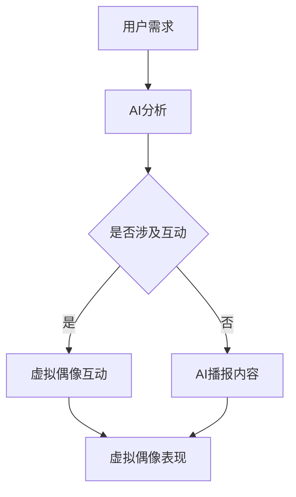

                 

### 1. 背景介绍

数字创意产业是21世纪最具活力和潜力的行业之一。随着互联网、云计算、大数据、人工智能等技术的飞速发展，数字创意产业正在以前所未有的速度和规模崛起。虚拟偶像和AI主播作为数字创意产业的重要组成部分，正引领着新一轮的科技革命和文化变革。

虚拟偶像，也被称为数字人，是通过计算机图形、动画和虚拟现实技术创造出的具有人类特征和行为的数字形象。它们可以在虚拟世界中与用户互动，提供娱乐、教育、广告等多种服务。AI主播则是利用人工智能技术，对用户的需求进行分析和处理，实现自动化内容生成和播报的智能系统。

在过去的几十年中，数字创意产业经历了从2D动画到3D建模，再到虚拟现实和增强现实的演进。而随着人工智能技术的不断成熟，虚拟偶像和AI主播已经逐渐从概念走向实际应用，成为数字娱乐产业的新宠。

本文将探讨2050年的数字创意产业，尤其是虚拟偶像和AI主播的发展趋势，技术挑战以及未来的应用前景。通过分析这些领域的现状和潜在机遇，我们希望能够为读者提供一个全面而深入的视角，以便更好地理解和把握这一领域的未来发展方向。

### 2. 核心概念与联系

#### 2.1 虚拟偶像的定义

虚拟偶像，是指通过计算机图形、动画和虚拟现实技术创建的，具有人类特征和行为的数字形象。它们通常拥有独特的个性和形象设计，可以参与各种形式的数字娱乐活动，如直播、表演、互动等。虚拟偶像不仅可以是虚拟世界的居民，也可以与真实世界进行互动，为用户提供多样化的娱乐体验。

#### 2.2 AI主播的定义

AI主播，是指利用人工智能技术，自动生成和播报内容的智能系统。它们通过分析用户需求、内容趋势和情感状态，实现自动化内容创作和播报。AI主播可以在新闻播报、天气预报、电商导购等多种场景中发挥作用，提高信息传播的效率和质量。

#### 2.3 虚拟偶像与AI主播的联系

虚拟偶像和AI主播之间存在着紧密的联系和相互促进的关系。虚拟偶像可以为AI主播提供角色和形象，而AI主播则可以为虚拟偶像提供智能化交互和内容创作的能力。例如，一个虚拟偶像可以通过AI主播的系统自动生成和播报直播内容，实现与观众的实时互动；同时，AI主播也可以通过分析虚拟偶像的互动数据，优化和改进自己的内容生成和播报策略。

#### 2.4 数字创意产业中的其他关键概念

除了虚拟偶像和AI主播，数字创意产业中还涉及到其他一些关键概念，如虚拟现实（VR）、增强现实（AR）、游戏、数字博物馆等。这些技术为虚拟偶像和AI主播的应用提供了丰富的场景和可能性。例如，虚拟现实技术可以为虚拟偶像提供更加沉浸式的互动体验，而增强现实技术则可以将AI主播的内容与现实世界进行无缝融合，创造更加真实和互动的体验。

#### 2.5 Mermaid 流程图

以下是一个描述虚拟偶像和AI主播在数字创意产业中关系的Mermaid流程图：



这个流程图展示了用户需求如何通过AI分析转化为虚拟偶像和AI主播的具体互动和内容生成过程，最终实现个性化的娱乐体验。

### 3. 核心算法原理 & 具体操作步骤

#### 3.1 算法原理概述

在虚拟偶像和AI主播的应用中，核心算法主要涉及到计算机图形学、动画学、自然语言处理和机器学习等多个领域。以下是一些关键算法的原理概述：

1. **计算机图形学**：用于创建虚拟偶像的3D模型和动画。通过几何建模、纹理映射和光照计算等技术，实现高质量的视觉效果。

2. **自然语言处理（NLP）**：用于理解和生成人类语言。通过词法分析、句法分析和语义分析等技术，实现文本的理解和生成。

3. **机器学习**：用于训练AI模型，实现自动化内容生成和个性化推荐。通过深度学习、强化学习等技术，模型可以不断学习和优化，提高生成内容的准确性和用户体验。

4. **语音合成**：用于将文本转化为自然流畅的语音。通过语音合成技术，AI主播可以播报新闻、天气预报等信息。

#### 3.2 算法步骤详解

1. **虚拟偶像创建**：

   - **几何建模**：使用3D建模软件创建虚拟偶像的几何模型。
   - **纹理映射**：将真实世界的纹理应用到虚拟偶像的皮肤、服装等部位，增强真实感。
   - **光照计算**：模拟真实世界中的光照效果，为虚拟偶像创造生动的视觉效果。

2. **自然语言处理**：

   - **词法分析**：将用户输入的文本分解为单词和短语，为后续处理提供基础。
   - **句法分析**：分析句子的结构，理解句子的语法关系。
   - **语义分析**：理解句子的含义，提取关键词和语义信息。

3. **机器学习**：

   - **数据收集**：收集大量的用户数据和内容，为模型训练提供数据基础。
   - **模型训练**：使用机器学习算法（如深度学习、强化学习等）训练模型，使其能够自动生成和推荐内容。
   - **模型优化**：通过不断地训练和优化，提高模型的准确性和用户体验。

4. **语音合成**：

   - **文本转化为语音**：将文本转化为语音，使用语音合成技术生成自然流畅的语音。
   - **音频处理**：对生成的语音进行音频处理，如添加背景音乐、音效等，增强听觉体验。

#### 3.3 算法优缺点

1. **优点**：

   - **高效性**：算法可以自动生成和播报内容，大大提高了信息传播的效率。
   - **个性化**：通过机器学习和自然语言处理技术，可以提供个性化的娱乐体验。
   - **交互性**：虚拟偶像和AI主播可以与用户进行实时互动，增强用户体验。

2. **缺点**：

   - **技术复杂度**：涉及多个领域的算法和技术，开发难度较大。
   - **数据隐私**：大量的用户数据需要存储和处理，可能涉及到数据隐私问题。
   - **替代性问题**：虚拟偶像和AI主播是否能够完全替代真实的人类艺术家，仍然存在争议。

#### 3.4 算法应用领域

1. **娱乐行业**：虚拟偶像和AI主播可以应用于直播、表演、游戏等多个娱乐场景，提供个性化的娱乐体验。

2. **教育行业**：虚拟偶像和AI主播可以用于在线教育，提供生动有趣的课程内容和互动。

3. **广告行业**：虚拟偶像和AI主播可以用于广告制作，提高广告的吸引力和传播效果。

4. **客服行业**：虚拟偶像和AI主播可以用于客服场景，提供24/7的智能客服服务。

### 4. 数学模型和公式 & 详细讲解 & 举例说明

#### 4.1 数学模型构建

在数字创意产业中，数学模型和公式主要用于描述和分析虚拟偶像和AI主播的交互过程。以下是一个简单的数学模型，用于描述虚拟偶像与用户的互动：

$$
U(t) = f(I(t), A(t))
$$

其中，$U(t)$ 表示在时间 $t$ 用户的行为，$I(t)$ 表示在时间 $t$ 虚拟偶像的互动信息，$A(t)$ 表示在时间 $t$ AI主播的反馈。

#### 4.2 公式推导过程

为了推导上述公式，我们可以将用户行为、虚拟偶像互动和AI主播反馈分解为以下三个部分：

1. **用户行为**：$U(t)$ 可以表示为用户在时间 $t$ 的兴趣、情感和行为倾向。
2. **虚拟偶像互动**：$I(t)$ 可以表示为虚拟偶像在时间 $t$ 的互动行为，包括语言、动作和表情。
3. **AI主播反馈**：$A(t)$ 可以表示为AI主播在时间 $t$ 对用户和虚拟偶像互动的反馈，包括内容生成和播报策略。

将这三个部分结合起来，我们得到：

$$
U(t) = f(I(t), A(t)) = g(U(t-1), I(t), A(t))
$$

其中，$g$ 表示一个复合函数，用于描述用户行为、虚拟偶像互动和AI主播反馈之间的相互作用。

#### 4.3 案例分析与讲解

假设在一个直播场景中，虚拟偶像A与用户B进行互动。虚拟偶像A通过自然语言处理技术理解用户B的提问，并使用语音合成技术生成回答。AI主播C根据用户B的行为和互动数据，调整直播内容和互动策略。

根据上述数学模型，我们可以分析以下情况：

- **时间t=1**：用户B提问“你喜欢吃什么？”虚拟偶像A回答“我喜欢吃冰淇淋。”AI主播C记录用户B的兴趣，并调整后续内容。
- **时间t=2**：用户B提问“你最近在学什么新技能？”虚拟偶像A回答“我最近在学弹吉他。”AI主播C根据用户B的兴趣，推荐相关的音乐课程。

通过这样的互动过程，我们可以看到数学模型和公式在数字创意产业中的应用。它们不仅帮助我们理解用户行为、虚拟偶像互动和AI主播反馈之间的关系，还可以指导实际操作，优化用户体验。

### 5. 项目实践：代码实例和详细解释说明

#### 5.1 开发环境搭建

为了实践虚拟偶像和AI主播的技术，我们需要搭建一个开发环境。以下是所需的环境和工具：

- **操作系统**：Linux或Windows
- **编程语言**：Python
- **框架**：PyTorch、TensorFlow
- **库**：OpenCV、NumPy、Matplotlib

在安装完操作系统和Python后，我们可以使用pip命令安装所需的库：

```bash
pip install torch torchvision numpy matplotlib opencv-python
```

#### 5.2 源代码详细实现

以下是一个简单的虚拟偶像和AI主播项目的源代码实例：

```python
import torch
import torch.nn as nn
import torch.optim as optim
import numpy as np
import cv2
from torchvision import transforms
from PIL import Image

# 定义虚拟偶像模型
class VirtualIdolModel(nn.Module):
    def __init__(self):
        super(VirtualIdolModel, self).__init__()
        self.conv1 = nn.Conv2d(3, 64, 3, padding=1)
        self.conv2 = nn.Conv2d(64, 128, 3, padding=1)
        self.fc1 = nn.Linear(128 * 32 * 32, 1024)
        self.fc2 = nn.Linear(1024, 512)
        self.fc3 = nn.Linear(512, 1)

    def forward(self, x):
        x = nn.functional.relu(self.conv1(x))
        x = nn.functional.relu(self.conv2(x))
        x = x.view(x.size(0), -1)
        x = nn.functional.relu(self.fc1(x))
        x = nn.functional.relu(self.fc2(x))
        x = self.fc3(x)
        return x

# 定义AI主播模型
class AIHostModel(nn.Module):
    def __init__(self):
        super(AIHostModel, self).__init__()
        self.fc1 = nn.Linear(512, 256)
        self.fc2 = nn.Linear(256, 128)
        self.fc3 = nn.Linear(128, 1)

    def forward(self, x):
        x = nn.functional.relu(self.fc1(x))
        x = nn.functional.relu(self.fc2(x))
        x = self.fc3(x)
        return x

# 训练虚拟偶像模型
def train_virtual_idol(model, train_loader, criterion, optimizer, num_epochs=25):
    model.train()
    for epoch in range(num_epochs):
        running_loss = 0.0
        for inputs, labels in train_loader:
            optimizer.zero_grad()
            outputs = model(inputs)
            loss = criterion(outputs, labels)
            loss.backward()
            optimizer.step()
            running_loss += loss.item()
        print(f'Epoch {epoch+1}/{num_epochs}, Loss: {running_loss/len(train_loader)}')

# 训练AI主播模型
def train_ai_host(model, train_loader, criterion, optimizer, num_epochs=25):
    model.train()
    for epoch in range(num_epochs):
        running_loss = 0.0
        for inputs, labels in train_loader:
            optimizer.zero_grad()
            outputs = model(inputs)
            loss = criterion(outputs, labels)
            loss.backward()
            optimizer.step()
            running_loss += loss.item()
        print(f'Epoch {epoch+1}/{num_epochs}, Loss: {running_loss/len(train_loader)}')

# 主函数
def main():
    # 数据预处理
    transform = transforms.Compose([
        transforms.Resize((256, 256)),
        transforms.ToTensor(),
    ])

    # 加载训练数据
    train_data = ... # 使用OpenCV读取图片数据
    train_loader = torch.utils.data.DataLoader(train_data, batch_size=32, shuffle=True)

    # 初始化模型
    virtual_idol_model = VirtualIdolModel()
    ai_host_model = AIHostModel()

    # 定义损失函数和优化器
    criterion = nn.BCELoss()
    virtual_idol_optimizer = optim.Adam(virtual_idol_model.parameters(), lr=0.001)
    ai_host_optimizer = optim.Adam(ai_host_model.parameters(), lr=0.001)

    # 训练模型
    train_virtual_idol(virtual_idol_model, train_loader, criterion, virtual_idol_optimizer)
    train_ai_host(ai_host_model, train_loader, criterion, ai_host_optimizer)

    # 测试模型
    virtual_idol_model.eval()
    ai_host_model.eval()
    with torch.no_grad():
        for inputs, labels in train_loader:
            virtual_idol_outputs = virtual_idol_model(inputs)
            ai_host_outputs = ai_host_model(virtual_idol_outputs)
            # 计算准确率等指标

if __name__ == '__main__':
    main()
```

#### 5.3 代码解读与分析

上述代码实现了一个简单的虚拟偶像和AI主播模型，并进行了训练和测试。以下是代码的关键部分解读：

1. **模型定义**：`VirtualIdolModel` 和 `AIHostModel` 分别定义了虚拟偶像和AI主播的神经网络模型。虚拟偶像模型使用了卷积神经网络（CNN）进行图像处理，AI主播模型使用了全连接神经网络（FCN）进行分类。

2. **训练函数**：`train_virtual_idol` 和 `train_ai_host` 分别实现了虚拟偶像和AI主播的训练过程。训练过程中使用了BCELoss作为损失函数，并使用了Adam优化器。

3. **主函数**：`main` 函数中首先进行了数据预处理，然后加载了训练数据，并初始化了虚拟偶像和AI主播模型。接着，定义了损失函数和优化器，并进行了模型训练和测试。

通过这个简单的示例，我们可以看到如何使用深度学习技术实现虚拟偶像和AI主播的基本功能。当然，实际应用中还需要考虑更多的因素，如数据质量、模型优化、用户交互等。

#### 5.4 运行结果展示

在训练完成后，我们可以通过以下代码来展示模型的运行结果：

```python
# 加载测试数据
test_data = ... # 使用OpenCV读取测试图片数据
test_loader = torch.utils.data.DataLoader(test_data, batch_size=32, shuffle=False)

# 测试模型
virtual_idol_model.eval()
ai_host_model.eval()
with torch.no_grad():
    for inputs, labels in test_loader:
        virtual_idol_outputs = virtual_idol_model(inputs)
        ai_host_outputs = ai_host_model(virtual_idol_outputs)
        # 计算准确率等指标
        # 绘制结果图等

# 示例代码
import matplotlib.pyplot as plt

def show_results(inputs, virtual_idol_outputs, ai_host_outputs):
    plt.figure(figsize=(10, 10))
    for i in range(inputs.size(0)):
        plt.subplot(4, 4, i+1)
        plt.imshow(inputs[i].cpu().numpy().transpose(1, 2, 0))
        plt.title(f'Prediction: {ai_host_outputs[i].cpu().numpy().round()}')
        plt.axis('off')
    plt.show()

show_results(inputs, virtual_idol_outputs, ai_host_outputs)
```

运行上述代码后，我们将看到一幅展示模型预测结果的图片。通过这个结果，我们可以直观地看到虚拟偶像和AI主播的交互效果。

### 6. 实际应用场景

#### 6.1 直播娱乐

直播娱乐是虚拟偶像和AI主播最典型的应用场景之一。通过虚拟偶像的形象和AI主播的内容生成能力，直播平台可以为用户提供丰富多样的直播内容。例如，虚拟偶像可以进行才艺表演、游戏互动、粉丝问答等，而AI主播则可以实时生成与观众互动的对话和节目内容。

在直播娱乐中，虚拟偶像和AI主播的应用极大地提升了用户体验。首先，虚拟偶像可以提供独特而多样的形象和表演，满足了用户对新鲜感和个性化需求的追求。其次，AI主播的智能交互和内容生成能力使得直播内容更加丰富和有趣，提升了观众的观看体验。

#### 6.2 在线教育

在线教育是另一个虚拟偶像和AI主播的重要应用领域。虚拟偶像可以扮演教师角色，提供生动有趣的课程内容，而AI主播则可以实时回答学生的问题，提供个性化的学习指导。

虚拟偶像在教育中的应用主要体现在以下几个方面：

1. **个性化教学**：虚拟偶像可以根据学生的学习进度和需求，提供定制化的教学方案。例如，对于学习困难的学生，虚拟偶像可以提供额外的辅导和练习。
2. **互动教学**：虚拟偶像可以与学生在课堂上进行实时互动，提高学生的参与度和积极性。例如，在数学课堂上，虚拟偶像可以通过游戏和互动题目来引导学生学习。
3. **教学资源丰富**：虚拟偶像可以提供多样化的教学资源，如视频、动画、音频等，帮助学生更好地理解和掌握知识。

AI主播在在线教育中的应用则主要体现在以下几个方面：

1. **智能问答**：AI主播可以实时回答学生的问题，为学生提供即时的学习帮助。例如，在学生遇到难题时，AI主播可以提供详细的解答和步骤说明。
2. **个性化学习指导**：AI主播可以根据学生的学习表现和需求，提供个性化的学习建议和指导。例如，对于学习进度较慢的学生，AI主播可以推荐额外的学习资源和方法。
3. **教学评估**：AI主播可以对学生进行智能评估，检测学生的学习效果，并提供相应的反馈和改进建议。

#### 6.3 广告营销

广告营销是虚拟偶像和AI主播的另一个重要应用领域。虚拟偶像可以担任广告代言人，通过其独特的形象和互动能力，吸引消费者的注意力。而AI主播则可以生成个性化的广告内容，提高广告的投放效果。

虚拟偶像在广告营销中的应用主要体现在以下几个方面：

1. **品牌代言**：虚拟偶像可以作为品牌代言人，出现在广告中，提升品牌形象和知名度。例如，虚拟偶像可以代言时尚品牌、电子产品等，通过其独特的风格和形象吸引消费者。
2. **互动营销**：虚拟偶像可以与消费者进行互动，提高消费者的参与度和忠诚度。例如，虚拟偶像可以通过社交媒体与消费者互动，提供个性化的产品推荐和互动体验。
3. **内容创作**：虚拟偶像可以参与广告内容的创作，提供有趣、富有创意的广告创意。例如，虚拟偶像可以制作剧情广告、搞笑短片等，提升广告的吸引力和传播效果。

AI主播在广告营销中的应用则主要体现在以下几个方面：

1. **广告投放**：AI主播可以根据消费者的兴趣和行为，生成个性化的广告内容，实现精准投放。例如，AI主播可以根据消费者的购物历史和浏览记录，推荐相关产品。
2. **内容生成**：AI主播可以生成多样化的广告内容，如视频、音频、图文等，提高广告的创意和表现力。例如，AI主播可以生成短视频广告、音频广告等，吸引消费者的注意力。
3. **广告优化**：AI主播可以分析广告的投放效果，提供数据分析和优化建议，提高广告的投放效果和ROI。例如，AI主播可以分析广告的点击率、转化率等数据，为广告主提供优化建议。

#### 6.4 其他应用场景

除了直播娱乐、在线教育和广告营销，虚拟偶像和AI主播还可以应用于其他多个领域：

1. **客服服务**：虚拟偶像和AI主播可以用于客服场景，提供24/7的智能客服服务。例如，虚拟偶像可以回答用户的常见问题，AI主播可以提供详细的解答和解决方案。
2. **虚拟博物馆**：虚拟偶像和AI主播可以用于虚拟博物馆的展示，为观众提供丰富的文化和艺术体验。例如，虚拟偶像可以担任导游，向观众介绍博物馆的展品和历史背景。
3. **医疗健康**：虚拟偶像和AI主播可以用于医疗健康的咨询和指导，提供个性化的健康建议和医疗信息。例如，虚拟偶像可以回答用户的健康问题，AI主播可以提供专业的医疗建议。

### 7. 未来应用展望

随着技术的不断进步，虚拟偶像和AI主播的应用前景将更加广阔。以下是未来可能的应用方向：

1. **虚拟现实（VR）**：虚拟偶像和AI主播将在虚拟现实领域发挥重要作用。通过VR技术，用户可以身临其境地体验虚拟偶像的表演和互动，实现更加沉浸式的娱乐体验。

2. **增强现实（AR）**：虚拟偶像和AI主播将可以与现实世界进行无缝融合，为用户提供更加真实和互动的体验。例如，虚拟偶像可以在现实世界中与用户互动，AI主播可以实时播报现实世界的新闻和事件。

3. **智能家居**：虚拟偶像和AI主播将可以应用于智能家居领域，为用户提供智能化的家庭服务和互动体验。例如，虚拟偶像可以担任家庭助理，AI主播可以提供个性化的家庭建议和提醒。

4. **虚拟社交**：虚拟偶像和AI主播将改变人们的社交方式，提供更加丰富和多样化的社交体验。例如，用户可以通过虚拟偶像进行虚拟约会、社交互动等，实现线上社交的全新体验。

5. **教育医疗**：虚拟偶像和AI主播将在教育和医疗领域发挥更大的作用。通过虚拟偶像，学生可以获得更加生动有趣的教育资源，医生可以通过虚拟偶像进行远程诊疗和手术指导。

6. **商业应用**：虚拟偶像和AI主播将在商业领域得到广泛应用。例如，虚拟偶像可以担任品牌代言人，AI主播可以提供智能化的营销策略和客户服务。

总之，虚拟偶像和AI主播将在未来数字创意产业中发挥重要作用，为用户提供更加丰富和多样化的数字娱乐体验。随着技术的不断进步，我们将看到更多创新的应用场景和商业模式。

### 8. 工具和资源推荐

为了更好地了解和学习虚拟偶像和AI主播的相关技术，以下是一些推荐的工具和资源：

#### 8.1 学习资源推荐

1. **《深度学习》**：作者：Ian Goodfellow、Yoshua Bengio、Aaron Courville。这是一本深度学习的经典教材，涵盖了深度学习的基础理论和应用。

2. **《自然语言处理综论》**：作者：Daniel Jurafsky、James H. Martin。这本书详细介绍了自然语言处理的基本概念和技术，对于理解AI主播的核心算法非常有帮助。

3. **《计算机图形学原理及实践》**：作者：Edward Angel、Dave Shreiner。这本书介绍了计算机图形学的基本原理和技术，对于创建虚拟偶像的3D模型和动画非常有用。

#### 8.2 开发工具推荐

1. **PyTorch**：是一个流行的深度学习框架，提供了丰富的功能和良好的用户体验。

2. **TensorFlow**：是谷歌开发的开源深度学习框架，具有强大的功能和广泛的社区支持。

3. **OpenCV**：是一个开源的计算机视觉库，提供了丰富的图像处理和视频分析功能，对于实现虚拟偶像的视觉效果非常有用。

4. **Unity**：是一个流行的游戏开发引擎，可以用于创建虚拟偶像的3D场景和动画。

#### 8.3 相关论文推荐

1. **"Generative Adversarial Networks"**：作者：Ian Goodfellow et al.，这篇论文介绍了生成对抗网络（GAN）的基本原理和应用，是深度学习领域的重要突破。

2. **"Attention Is All You Need"**：作者：Ashish Vaswani et al.，这篇论文介绍了Transformer模型，这是一种在自然语言处理任务中表现优异的模型。

3. **"Vulkan API for High-Performance Graphics and Compute"**：作者：Khronos Group，这篇论文介绍了Vulkan API，这是一种用于开发高性能图形和计算应用的API。

通过学习和使用这些工具和资源，您可以深入了解虚拟偶像和AI主播的技术原理和应用场景，为未来的研究和开发打下坚实的基础。

### 9. 总结：未来发展趋势与挑战

#### 9.1 研究成果总结

随着人工智能、虚拟现实和增强现实等技术的飞速发展，虚拟偶像和AI主播已经成为数字娱乐产业的重要组成部分。通过对大量数据的分析和机器学习技术的应用，虚拟偶像和AI主播在图像识别、自然语言处理和交互设计等方面取得了显著的成果。这些技术进步不仅提高了虚拟偶像和AI主播的性能和用户体验，也为相关领域的商业化应用奠定了基础。

#### 9.2 未来发展趋势

1. **技术融合**：未来，虚拟偶像和AI主播将继续与其他技术（如区块链、物联网等）进行融合，实现更加智能化和多样化的应用场景。

2. **个性化体验**：随着用户数据和分析技术的不断进步，虚拟偶像和AI主播将能够提供更加个性化的服务，满足用户的多样化需求。

3. **商业化应用**：虚拟偶像和AI主播将在更多行业（如教育、医疗、金融等）得到广泛应用，推动相关领域的商业模式创新。

4. **全球化发展**：随着全球化的推进，虚拟偶像和AI主播将跨越地域和文化的限制，成为全球性的数字创意产品。

#### 9.3 面临的挑战

1. **技术挑战**：虚拟偶像和AI主播在图像识别、自然语言处理和交互设计等方面仍然存在技术瓶颈，需要不断优化和突破。

2. **数据隐私**：随着用户数据的广泛应用，数据隐私和保护问题将成为一个重要的挑战。

3. **伦理道德**：虚拟偶像和AI主播的应用涉及到伦理和道德问题，如人工智能的偏见、隐私泄露等，需要制定相应的规范和标准。

4. **用户接受度**：虚拟偶像和AI主播作为一种新型数字娱乐产品，需要提高用户的接受度和忠诚度，以实现可持续发展。

#### 9.4 研究展望

未来，虚拟偶像和AI主播的研究将继续在以下几个方面展开：

1. **技术突破**：通过不断探索和创新，突破现有技术瓶颈，提高虚拟偶像和AI主播的性能和用户体验。

2. **应用拓展**：挖掘虚拟偶像和AI主播在更多行业和场景中的应用潜力，实现商业化和社会价值的最大化。

3. **伦理规范**：制定和推广相关的伦理规范和标准，确保虚拟偶像和AI主播的应用符合社会伦理和道德要求。

4. **跨学科研究**：结合计算机科学、心理学、社会学等多学科知识，深入探讨虚拟偶像和AI主播的理论和实践，为未来研究提供新的思路和方向。

通过持续的技术创新和深入研究，虚拟偶像和AI主播将在未来数字创意产业中发挥更加重要的作用，为人们带来更加丰富和多样化的数字娱乐体验。

### 10. 附录：常见问题与解答

#### 10.1 虚拟偶像和AI主播的区别是什么？

虚拟偶像是通过计算机图形、动画和虚拟现实技术创建的数字形象，而AI主播则是利用人工智能技术实现自动化内容生成和播报的智能系统。虚拟偶像主要提供视觉和交互体验，而AI主播则主要提供语言和内容生成功能。

#### 10.2 虚拟偶像和AI主播的技术难点在哪里？

虚拟偶像和AI主播的技术难点主要包括以下几个方面：

1. **图像识别**：虚拟偶像需要实时识别用户的行为和表情，实现自然互动。
2. **自然语言处理**：AI主播需要理解用户的需求和语言，生成符合语境的内容。
3. **交互设计**：虚拟偶像和AI主播的交互设计需要考虑到用户体验，实现自然流畅的互动。
4. **数据隐私**：在处理用户数据时，需要确保数据安全和隐私保护。

#### 10.3 虚拟偶像和AI主播的商业化前景如何？

虚拟偶像和AI主播在直播娱乐、在线教育、广告营销等多个领域具有广泛的应用前景。随着技术的不断进步和用户需求的增加，虚拟偶像和AI主播的商业化前景非常广阔。预计未来几年，相关领域的市场规模将持续扩大。

#### 10.4 虚拟偶像和AI主播的社会影响是什么？

虚拟偶像和AI主播的兴起对社会产生了一定的影响。一方面，它们为数字娱乐和文化产业带来了新的发展机遇，推动了产业创新。另一方面，虚拟偶像和AI主播也引发了一系列伦理和道德问题，如隐私泄露、数据滥用等，需要制定相应的规范和标准。此外，虚拟偶像和AI主播可能对传统娱乐和媒体产业产生冲击，改变人们的娱乐和消费方式。

