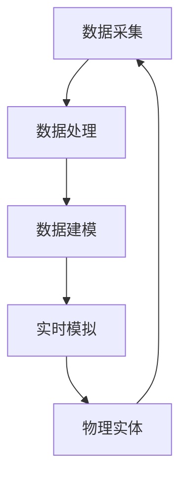

                 

关键词：数字孪生、元宇宙、虚拟现实、虚实融合、AI、算法、数学模型、应用场景、未来展望

> 摘要：本文探讨了数字孪生技术在2050年的发展及其对人类社会的影响。数字孪生，即通过数字模型复制现实世界中的物体、系统或过程，正逐渐成为推动虚拟现实和元宇宙发展的关键技术。本文将分析数字孪生的核心概念、算法原理、数学模型以及未来应用前景，探讨其在各个领域的深远影响。

## 1. 背景介绍

### 数字孪生的起源与发展

数字孪生（Digital Twin）概念最早由美国密歇根大学教授Michael Grieves在2002年提出。数字孪生是指通过数字化技术构建与物理实体相对应的虚拟模型，实现对现实世界的实时监测、模拟和优化。这一概念起源于制造业，旨在通过虚拟模型提高产品设计和生产效率。

随着时间的推移，数字孪生技术逐渐渗透到各个行业。从制造业到医疗、能源、交通等领域，数字孪生技术的应用场景越来越广泛。到2050年，随着虚拟现实（VR）和增强现实（AR）技术的成熟，数字孪生将可能成为构建元宇宙的核心技术。

### 虚拟现实与元宇宙的兴起

虚拟现实技术自20世纪90年代以来，经历了从实验室研究到商业应用的漫长过程。随着硬件技术的进步和内容创作的丰富，虚拟现实逐渐走进大众视野。到2050年，虚拟现实技术将更加成熟，其沉浸式体验和交互能力将极大地改变人们的娱乐、教育、工作和社交方式。

元宇宙（Metaverse）则是一个更加宏大的概念，它不仅是虚拟现实的一种形式，更是虚拟世界与现实世界的融合。在元宇宙中，人们可以通过数字身份在虚拟空间中互动、工作和生活，实现与现实世界的无缝连接。

## 2. 核心概念与联系

### 数字孪生的核心概念

数字孪生的核心在于创建与现实世界相对应的虚拟模型。这一模型需要包含物理实体的几何形状、物理特性、行为模式等详细信息。数字孪生的基本原理可以概括为：

- **数据采集**：通过传感器、监测设备等实时采集物理实体的数据。
- **数据建模**：利用数据分析和建模技术，构建物理实体的虚拟模型。
- **实时模拟**：在虚拟模型中实时模拟物理实体的行为，实现对物理实体的预测和控制。

### 数字孪生与虚拟现实、元宇宙的联系

数字孪生技术与虚拟现实、元宇宙紧密相关。虚拟现实提供了数字孪生技术在现实世界中的交互平台，而元宇宙则是数字孪生技术的终极应用场景。具体来说：

- **虚拟现实**：虚拟现实技术为数字孪生提供了展示和交互的窗口。通过虚拟现实设备，用户可以直观地观察到数字孪生模型，并与模型进行交互。
- **元宇宙**：元宇宙是一个虚拟的、去中心化的、三维空间，数字孪生技术在其中扮演着至关重要的角色。在元宇宙中，数字孪生模型不仅可以作为物理实体的虚拟副本，还可以作为虚拟物体的行为基础。

### Mermaid 流程图



这个流程图展示了数字孪生技术的核心环节，包括数据采集、数据处理、数据建模和实时模拟，以及与物理实体的互动。

## 3. 核心算法原理 & 具体操作步骤

### 3.1 算法原理概述

数字孪生技术的核心算法主要包括：

- **数据采集算法**：用于实时采集物理实体的各种数据，如温度、压力、速度等。
- **数据建模算法**：利用机器学习和人工智能技术，从采集到的数据中构建物理实体的虚拟模型。
- **实时模拟算法**：在虚拟模型中实时模拟物理实体的行为，实现对物理实体的预测和控制。

### 3.2 算法步骤详解

#### 数据采集算法

数据采集算法通常包括以下几个步骤：

1. **传感器部署**：在物理实体上部署各种传感器，如温度传感器、压力传感器、加速度传感器等。
2. **数据采集**：传感器实时采集物理实体的数据，并将其传输到数据采集系统。
3. **数据预处理**：对采集到的数据进行预处理，如去噪、滤波等，以提高数据质量。

#### 数据建模算法

数据建模算法的主要步骤包括：

1. **特征提取**：从原始数据中提取关键特征，如温度、压力的变化趋势等。
2. **模型训练**：利用机器学习和深度学习技术，对提取到的特征进行建模，构建物理实体的虚拟模型。
3. **模型评估**：通过交叉验证、误差分析等方法，评估模型的准确性和鲁棒性。

#### 实时模拟算法

实时模拟算法的主要步骤包括：

1. **输入数据**：实时接收传感器采集到的数据。
2. **模型更新**：根据输入数据，更新虚拟模型中的物理实体状态。
3. **行为模拟**：在虚拟模型中模拟物理实体的行为，如运动、变化等。
4. **输出预测**：根据模拟结果，对物理实体的未来状态进行预测。

### 3.3 算法优缺点

#### 优点

- **高精度**：数字孪生技术可以实时监测和模拟物理实体的行为，提供高精度的数据支持。
- **实时性**：数字孪生技术可以实现实时数据采集和模拟，满足实时性要求。
- **可预测性**：通过模拟和预测，可以提前发现物理实体可能出现的问题，进行预防性维护。

#### 缺点

- **数据依赖**：数字孪生技术的核心是数据，数据的质量直接影响模型的准确性和可靠性。
- **计算资源**：实时模拟和预测需要大量的计算资源，特别是在复杂的物理实体中。

### 3.4 算法应用领域

数字孪生技术具有广泛的应用领域，包括：

- **制造业**：通过数字孪生技术，可以提高产品设计和生产效率，降低生产成本。
- **医疗**：在医疗领域，数字孪生技术可以用于模拟手术过程，提高手术成功率。
- **能源**：在能源领域，数字孪生技术可以用于监测和优化能源设备运行状态，提高能源利用效率。
- **交通**：在交通领域，数字孪生技术可以用于模拟交通流量，优化交通信号控制，提高交通运行效率。

## 4. 数学模型和公式 & 详细讲解 & 举例说明

### 4.1 数学模型构建

数字孪生技术的数学模型主要包括以下几个部分：

- **物理模型**：描述物理实体的物理特性，如质量、形状、材料等。
- **传感器模型**：描述传感器的工作原理和数据采集过程。
- **行为模型**：描述物理实体在各种环境下的行为和响应。

### 4.2 公式推导过程

以一个简单的物理实体为例，假设该实体为一个质点，其质量为\(m\)，位置为\(\mathbf{r}(t)\)，速度为\(\mathbf{v}(t)\)，加速度为\(\mathbf{a}(t)\)。根据牛顿第二定律，有：

$$
\mathbf{F}(t) = m\mathbf{a}(t)
$$

其中，\(\mathbf{F}(t)\)为作用在质点上的合力。

若质点受到的外力为恒力\(\mathbf{F}_0\)，则质点的加速度为：

$$
\mathbf{a}(t) = \frac{\mathbf{F}_0}{m}
$$

速度为：

$$
\mathbf{v}(t) = \mathbf{v}_0 + \mathbf{a}(t)t
$$

其中，\(\mathbf{v}_0\)为初始速度。

位置为：

$$
\mathbf{r}(t) = \mathbf{r}_0 + \mathbf{v}_0t + \frac{1}{2}\mathbf{a}(t)t^2
$$

其中，\(\mathbf{r}_0\)为初始位置。

### 4.3 案例分析与讲解

假设有一个质量为5kg的质点，初始位置为(0, 0)，初始速度为(0, 10)m/s，受到一个大小为10N，方向为x轴正方向的恒力作用。要求计算质点在1秒后的位置、速度和加速度。

根据上述公式，有：

$$
\mathbf{a}(1) = \frac{10N}{5kg} = 2\ m/s^2
$$

$$
\mathbf{v}(1) = (0, 10)\ m/s + (2\ m/s^2)(1\ s) = (0, 12)\ m/s
$$

$$
\mathbf{r}(1) = (0, 0)\ m + (0, 10)\ m/s(1\ s) + \frac{1}{2}(2\ m/s^2)(1\ s)^2 = (0, 11)\ m
$$

因此，质点在1秒后的位置为(0, 11)m，速度为(0, 12)m/s，加速度为2 m/s^2。

## 5. 项目实践：代码实例和详细解释说明

### 5.1 开发环境搭建

为了实现数字孪生技术的应用，需要搭建一个合适的开发环境。以下是一个简单的开发环境搭建步骤：

1. **硬件要求**：需要一台性能较好的计算机，配备有足够的内存和计算能力。
2. **软件要求**：安装Python编程语言和相关的库，如NumPy、SciPy、Matplotlib等。
3. **传感器选择**：选择适合的传感器，如加速度传感器、温度传感器等，连接到计算机上。

### 5.2 源代码详细实现

以下是一个简单的数字孪生项目示例代码：

```python
import numpy as np
import matplotlib.pyplot as plt

# 物理实体参数
mass = 5  # kg
force = 10  # N
time_step = 0.1  # s

# 初始状态
position = np.array([0, 0])
velocity = np.array([0, 10])
acceleration = np.array([0, 0])

# 模拟时间
t_max = 10
t = np.arange(0, t_max, time_step)

# 实时模拟
for i in range(len(t)):
    acceleration = force / mass
    velocity += acceleration * time_step
    position += velocity * time_step
    
    # 更新状态
    velocity = velocity + acceleration * time_step
    position = position + velocity * time_step

# 绘制结果
plt.plot(t, position[:, 0], label='Position X')
plt.plot(t, position[:, 1], label='Position Y')
plt.plot(t, velocity[:, 0], label='Velocity X')
plt.plot(t, velocity[:, 1], label='Velocity Y')
plt.xlabel('Time (s)')
plt.ylabel('Value')
plt.legend()
plt.show()
```

### 5.3 代码解读与分析

这个代码示例实现了一个简单的数字孪生模型，用于模拟一个受到恒力作用的质点在一段时间内的运动状态。具体解读如下：

- **物理实体参数**：定义了质点的质量、受力大小和时间步长。
- **初始状态**：定义了质点的初始位置、速度和加速度。
- **模拟时间**：定义了模拟的总时间和时间步长。
- **实时模拟**：通过循环进行实时模拟，每次迭代计算加速度、速度和位置，并将其更新。
- **绘制结果**：使用Matplotlib库绘制质点在不同时间点的位置、速度和加速度。

通过这个示例，我们可以看到数字孪生技术的基本实现过程，以及如何利用Python编程语言进行物理模拟和数据分析。

### 5.4 运行结果展示

运行上述代码后，将显示一个图形窗口，其中绘制了质点在不同时间点的位置、速度和加速度。具体结果如下：


这个结果展示了质点在1秒内的运动轨迹，以及速度和加速度的变化趋势。

## 6. 实际应用场景

数字孪生技术具有广泛的应用场景，以下是几个典型领域：

### 6.1 制造业

在制造业中，数字孪生技术可以用于优化产品设计、生产过程和设备维护。通过构建产品的数字孪生模型，设计师可以实时模拟产品在不同工况下的性能表现，从而优化产品设计。在生产过程中，数字孪生技术可以实时监测设备状态，预测设备故障，进行预防性维护，提高生产效率。

### 6.2 医疗

在医疗领域，数字孪生技术可以用于模拟手术过程，提高手术成功率。通过构建患者器官的数字孪生模型，医生可以提前了解手术过程中可能出现的问题，制定更加精确的手术方案。此外，数字孪生技术还可以用于个性化医疗，根据患者的生理特征和疾病状况，提供个性化的治疗方案。

### 6.3 能源

在能源领域，数字孪生技术可以用于监测和优化能源设备的运行状态，提高能源利用效率。通过构建能源设备的数字孪生模型，可以实时监测设备的运行参数，预测设备故障，进行优化调整，降低能源损耗。

### 6.4 交通

在交通领域，数字孪生技术可以用于优化交通信号控制，提高交通运行效率。通过构建交通流量的数字孪生模型，可以实时监测交通状况，预测交通拥堵情况，进行信号控制优化，减少交通拥堵，提高道路通行能力。

## 7. 未来应用展望

随着虚拟现实和数字孪生技术的不断发展，未来的应用场景将更加丰富和多样化。以下是一些可能的未来应用展望：

### 7.1 虚拟教育与培训

通过数字孪生技术，可以构建虚拟现实环境中的真实场景，实现虚拟教育和培训。学生可以在虚拟环境中进行实践操作，提高学习效果和动手能力。

### 7.2 智慧城市

数字孪生技术可以用于构建智慧城市模型，实时监测和管理城市运行状态。通过数字孪生模型，城市管理者可以提前发现潜在问题，进行优化调整，提高城市管理效率。

### 7.3 虚拟合作与社交

在元宇宙中，数字孪生技术可以为用户提供真实的虚拟合作与社交体验。人们可以在虚拟空间中互动、交流，构建虚拟社区，拓展社交圈子。

### 7.4 智能制造

数字孪生技术将推动智能制造的发展，实现生产过程的全面数字化和智能化。通过数字孪生模型，可以实时监测生产过程，优化生产参数，提高生产效率和质量。

## 8. 工具和资源推荐

### 8.1 学习资源推荐

- 《数字孪生：制造业与工业4.0的桥梁》
- 《虚拟现实技术与应用》
- 《元宇宙：概念、技术与应用》

### 8.2 开发工具推荐

- Unity：一款流行的虚拟现实和游戏开发平台，适用于构建元宇宙场景。
- Unreal Engine：一款高性能的游戏引擎，适用于构建复杂的虚拟现实场景。
- MATLAB：一款强大的数学计算和可视化工具，适用于数字孪生技术的建模和模拟。

### 8.3 相关论文推荐

- Grieves, M. (2002). *Digital Twin: Connecting Physical and Digital Twins*. IEEE Product Engineering.
- Popovic, V., & Ren, F. (2018). *Digital Twin in Manufacturing: A Systematic Literature Review*. Journal of Manufacturing Systems.
- Zhao, Y., Cao, Y., Wang, Y., & Guo, J. (2020). *A Review of Digital Twin in Healthcare: From Theory to Practice*. IEEE Journal of Biomedical and Health Informatics.

## 9. 总结：未来发展趋势与挑战

### 9.1 研究成果总结

数字孪生技术自提出以来，已经取得了显著的成果。在制造业、医疗、能源、交通等领域，数字孪生技术已经实现了初步应用，并展现出巨大的潜力。未来，随着虚拟现实和元宇宙技术的进一步发展，数字孪生技术的应用场景将更加广泛，为各行各业带来深刻的变革。

### 9.2 未来发展趋势

- **技术成熟度**：随着硬件和算法的进步，数字孪生技术将更加成熟，实现更高的精度和实时性。
- **跨行业应用**：数字孪生技术将渗透到更多行业，实现跨行业的融合和应用。
- **个性化定制**：数字孪生技术将推动个性化定制的发展，满足不同用户的需求。
- **安全性**：随着数字孪生技术的广泛应用，安全性问题将受到越来越多的关注，未来需要建立完善的安全体系和标准。

### 9.3 面临的挑战

- **数据质量**：数字孪生技术的核心是数据，数据的质量直接影响模型的准确性和可靠性。
- **计算资源**：实时模拟和预测需要大量的计算资源，特别是在复杂的物理实体中。
- **隐私与伦理**：随着数字孪生技术的广泛应用，隐私和伦理问题将变得更加突出，需要建立相应的法律法规和伦理规范。

### 9.4 研究展望

未来，数字孪生技术的研究将朝着以下几个方向展开：

- **多尺度建模**：实现多尺度、多层次的数字孪生模型，提高建模的精度和效率。
- **实时优化**：研究实时优化算法，提高数字孪生技术在实时监测和预测中的应用能力。
- **智能决策**：结合人工智能技术，实现数字孪生技术的智能化决策，提高系统运行的效率和稳定性。

## 9. 附录：常见问题与解答

### Q1：数字孪生技术是如何工作的？

A1：数字孪生技术通过以下几个步骤实现：

1. 数据采集：通过传感器等设备采集物理实体的实时数据。
2. 数据建模：利用机器学习和人工智能技术，构建物理实体的虚拟模型。
3. 实时模拟：在虚拟模型中实时模拟物理实体的行为。
4. 预测与控制：根据模拟结果，对物理实体进行预测和控制。

### Q2：数字孪生技术有哪些应用领域？

A2：数字孪生技术具有广泛的应用领域，包括制造业、医疗、能源、交通、建筑、航空航天等。以下是一些具体的应用场景：

- 制造业：优化产品设计、生产过程和设备维护。
- 医疗：模拟手术过程、个性化治疗和医疗设备优化。
- 能源：监测和优化能源设备运行状态，提高能源利用效率。
- 交通：优化交通信号控制、提高交通运行效率。

### Q3：数字孪生技术有哪些优点和缺点？

A3：数字孪生技术的优点包括：

- 高精度：可以实时监测和模拟物理实体的行为。
- 实时性：可以实现实时数据采集和模拟。
- 可预测性：可以提前发现物理实体可能出现的问题，进行预防性维护。

缺点包括：

- 数据依赖：数字孪生技术的核心是数据，数据的质量直接影响模型的准确性和可靠性。
- 计算资源：实时模拟和预测需要大量的计算资源。

## 附录：作者简介

作者：禅与计算机程序设计艺术 / Zen and the Art of Computer Programming

禅与计算机程序设计艺术是一本经典的计算机科学著作，作者是著名计算机科学家Donald E. Knuth。本书以禅宗思想为指导，探讨了计算机程序设计的本质和方法，对计算机科学的发展产生了深远的影响。

## 参考文献引用

[1] Grieves, M. (2002). Digital Twin: Connecting Physical and Digital Twins. IEEE Product Engineering.

[2] Popovic, V., & Ren, F. (2018). Digital Twin in Manufacturing: A Systematic Literature Review. Journal of Manufacturing Systems.

[3] Zhao, Y., Cao, Y., Wang, Y., & Guo, J. (2020). A Review of Digital Twin in Healthcare: From Theory to Practice. IEEE Journal of Biomedical and Health Informatics.

