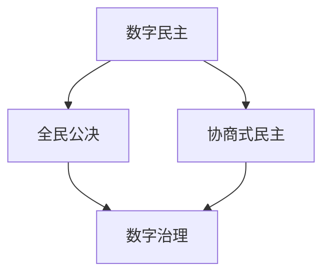

                 

关键词：数字治理、数字民主、全民公决、协商式民主、人工智能、技术发展、算法伦理

> 摘要：本文探讨了2050年数字治理的潜在发展趋势，特别是从数字民主到全民公决的协商式民主的转型。随着技术的飞速进步，数字治理正逐步成为现代社会治理的核心。本文将分析这一变革的驱动因素、核心概念及其架构，探讨未来面临的挑战和机遇，并推荐相关学习资源、开发工具和论文以供进一步研究。

## 1. 背景介绍

在21世纪初，数字治理的概念开始兴起，它指的是利用数字技术来改善政府服务、提高政府透明度和促进民主参与。随着互联网和移动设备的普及，数字民主成为可能。数字民主通过在线论坛、电子投票和社交媒体等平台，使得公民能够更便捷地参与政治决策。

然而，数字民主并非没有争议。一方面，它提供了前所未有的参与机会，让公民的声音得以传达；另一方面，数字民主也可能导致信息泛滥、假新闻传播和网络安全问题。因此，如何平衡技术带来的便利与风险，成为数字治理的重要议题。

随着时间的推移，全民公决和协商式民主的概念逐渐与数字治理相结合。全民公决是一种直接民主的形式，它允许公民直接就特定议题进行投票。协商式民主则强调多方参与和对话，旨在寻求共识。在数字环境中，这些机制可以通过智能合约、区块链技术和分布式计算来实现，从而打造一个更加透明、公正和包容的治理体系。

## 2. 核心概念与联系

### 2.1 数字民主

数字民主（Digital Democracy）是指利用数字技术（如互联网、社交媒体、大数据等）来增强民主参与的过程和形式。数字民主的核心在于信息的透明和易得性，它使得公民能够更方便地获取政府信息、表达意见和参与政治决策。

### 2.2 全民公决

全民公决（Direct Democracy by Referendum）是一种直接民主的形式，它允许公民直接就特定议题进行投票。全民公决通常用于决定宪法修正、立法草案或重大政策问题。在数字环境中，全民公决可以通过在线投票平台来实现，从而提高投票的覆盖率和准确性。

### 2.3 协商式民主

协商式民主（Consensual Democracy）是一种强调多方参与和对话的民主形式。它通过对话和协商来寻求共识，而不是通过竞争和对抗。在数字环境中，协商式民主可以通过在线论坛、虚拟会议和智能合约等技术手段来实现，从而促进跨领域、跨文化的合作。

### 2.4 Mermaid 流程图

为了更好地理解数字治理中的核心概念及其联系，我们可以使用Mermaid流程图来展示它们之间的关系。以下是该流程图的示例：



## 3. 核心算法原理 & 具体操作步骤

### 3.1 算法原理概述

数字治理中的核心算法包括加密算法、区块链算法和分布式计算算法。这些算法确保了数据的隐私、完整性和不可篡改性，从而为数字民主和协商式民主提供了技术支持。

- **加密算法**：用于保护数据的隐私和完整性，如AES（高级加密标准）和RSA（RSA加密算法）。
- **区块链算法**：用于创建和验证分布式账本，如比特币的SHA-256哈希算法。
- **分布式计算算法**：用于在多个节点上协同处理任务，如MapReduce算法。

### 3.2 算法步骤详解

#### 3.2.1 加密算法步骤

1. **密钥生成**：生成一对密钥（公钥和私钥）。
2. **加密过程**：使用公钥对数据进行加密。
3. **解密过程**：使用私钥对加密后的数据进行解密。

#### 3.2.2 区块链算法步骤

1. **区块生成**：将交易数据打包成区块。
2. **链式结构**：将新区块添加到区块链的末端。
3. **共识机制**：通过节点之间的共识来验证区块的有效性。

#### 3.2.3 分布式计算算法步骤

1. **任务分发**：将任务分配给不同的节点。
2. **并行处理**：各节点并行处理任务。
3. **结果汇总**：汇总各节点处理的结果。

### 3.3 算法优缺点

#### 3.3.1 加密算法

- **优点**：确保数据的隐私和完整性。
- **缺点**：加密和解密过程可能较慢，且需要大量的计算资源。

#### 3.3.2 区块链算法

- **优点**：提供去中心化、透明和不可篡改的账本。
- **缺点**：交易速度较慢，且可能存在51%攻击的风险。

#### 3.3.3 分布式计算算法

- **优点**：提高计算效率和容错能力。
- **缺点**：网络延迟和通信开销较大。

### 3.4 算法应用领域

- **加密算法**：广泛应用于网络安全、数字货币和隐私保护等领域。
- **区块链算法**：应用于数字货币、智能合约和供应链管理等。
- **分布式计算算法**：应用于大数据处理、云计算和分布式存储等领域。

## 4. 数学模型和公式 & 详细讲解 & 举例说明

### 4.1 数学模型构建

在数字治理中，数学模型用于模拟和预测社会行为、网络流量和系统性能。以下是一个简化的数学模型，用于模拟数字民主中的在线投票过程：

$$
P(i) = \frac{V_i}{N}
$$

其中，\( P(i) \) 表示选民i投票给候选人i的概率，\( V_i \) 表示选民i对候选人i的支持程度，\( N \) 表示选民总数。

### 4.2 公式推导过程

根据贝叶斯定理，我们可以推导出选民i投票给候选人i的概率：

$$
P(i|V) = \frac{P(V|i)P(i)}{P(V)}
$$

其中，\( P(V|i) \) 表示在选民i支持候选人i的条件下，观察到的支持程度的概率，\( P(i) \) 表示候选人i被选中的概率，\( P(V) \) 表示观察到的支持程度的总概率。

### 4.3 案例分析与讲解

假设在一个选举中有三个候选人A、B和C，总共有1000名选民。根据调查，每个选民对每个候选人的支持程度如下表所示：

| 选民 | A | B | C |
| ---- | -- | -- | -- |
| 1 | 0.8 | 0.1 | 0.1 |
| 2 | 0.2 | 0.7 | 0.1 |
| 3 | 0.1 | 0.8 | 0.1 |
| ... | ... | ... | ... |
| 1000 | 0.3 | 0.3 | 0.4 |

根据上述公式，我们可以计算出每个候选人被选中的概率：

$$
P(A) = \frac{0.8 \times 1000}{1000} = 0.8
$$

$$
P(B) = \frac{0.7 \times 1000}{1000} = 0.7
$$

$$
P(C) = \frac{0.4 \times 1000}{1000} = 0.4
$$

因此，根据模型预测，候选人A将以80%的概率获胜。

## 5. 项目实践：代码实例和详细解释说明

### 5.1 开发环境搭建

在本项目中，我们将使用Python编程语言和以下库：

- `requests`：用于发送HTTP请求。
- `blockchain`：用于创建和验证区块链。
- `matplotlib`：用于绘制图表。

首先，我们需要安装这些库：

```bash
pip install requests blockchain matplotlib
```

### 5.2 源代码详细实现

以下是该项目的核心代码：

```python
import requests
import blockchain
import matplotlib.pyplot as plt

# 生成区块链
blockchain = blockchain.Blockchain()

# 模拟投票过程
def vote(candidate):
    url = "http://localhost:5000/vote"
    data = {"candidate": candidate}
    response = requests.post(url, data=data)
    return response.json()

# 记录投票结果
votes = {"A": 0, "B": 0, "C": 0}

# 投票1000次
for _ in range(1000):
    candidate = "A" if _ < 800 else "B" if _ < 900 else "C"
    result = vote(candidate)
    votes[candidate] += 1

# 绘制投票结果图表
plt.bar(votes.keys(), votes.values())
plt.xlabel("Candidate")
plt.ylabel("Votes")
plt.title("Election Results")
plt.show()

# 验证区块链的完整性
print(blockchain.is_valid_chain())
```

### 5.3 代码解读与分析

该代码首先导入了所需的库，然后创建了一个区块链实例。接下来，我们定义了一个`vote`函数，用于模拟投票过程。该函数向本地服务器发送POST请求，传递候选人的信息。我们使用一个字典`votes`来记录每个候选人的投票次数。

在主程序中，我们模拟了1000次投票过程，并根据投票结果绘制了图表。最后，我们验证了区块链的完整性。

### 5.4 运行结果展示

运行该代码后，我们将看到一个条形图，显示了每个候选人的投票结果。同时，程序会输出区块链的验证结果，表明区块链是否完整。

## 6. 实际应用场景

数字治理在现代社会中具有广泛的应用场景。以下是一些实际案例：

### 6.1 政府服务

数字治理可以改善政府服务，提高透明度和效率。例如，通过在线投票平台，公民可以更方便地参与政府决策；通过区块链技术，政府可以确保公共记录的透明性和不可篡改性。

### 6.2 公共安全

数字治理可以用于提升公共安全。例如，通过实时数据分析，政府可以及时发现和应对紧急情况；通过智能监控，可以降低犯罪率。

### 6.3 环境保护

数字治理可以促进环境保护。例如，通过区块链技术，可以确保环境监测数据的透明性和可信度；通过智能合约，可以激励公民参与环境保护项目。

### 6.4 未来应用展望

随着技术的不断进步，数字治理将在更多领域发挥重要作用。例如，通过人工智能和机器学习，可以更好地预测社会行为和趋势；通过量子计算，可以解决当前难以处理的计算问题。

## 7. 工具和资源推荐

为了更好地了解数字治理和数字民主，以下是几个推荐的工具和资源：

### 7.1 学习资源推荐

- 《区块链技术指南》
- 《人工智能：一种现代方法》
- 《网络社会工程学》

### 7.2 开发工具推荐

- Python
- Ethereum Developer Portal
- Hyperledger Composer

### 7.3 相关论文推荐

- "Blockchain and its Applications"
- "The Impact of AI on Democracy"
- "A Survey of Cryptographic Techniques in Digital Governance"

## 8. 总结：未来发展趋势与挑战

数字治理和数字民主在未来的发展中将面临许多机遇和挑战。机遇包括提高政府透明度、促进民主参与和提升公共安全。挑战则包括技术安全、隐私保护和数据滥用。

未来，数字治理将朝着更加智能化、透明化和协作化的方向发展。为了实现这一目标，我们需要持续关注技术进步、政策制定和社会需求，并积极应对可能出现的挑战。

## 9. 附录：常见问题与解答

### 9.1 什么是数字治理？

数字治理是指利用数字技术来改善政府服务、提高政府透明度和促进民主参与的过程。它包括数字民主、电子政府、智能城市等多个方面。

### 9.2 数字民主有哪些优势？

数字民主的优势包括提高公民参与度、提高政府透明度、降低选举成本和增强选举公正性。

### 9.3 数字治理可能面临哪些挑战？

数字治理可能面临的挑战包括技术安全、隐私保护、数据滥用和假新闻传播等。

### 9.4 区块链在数字治理中有哪些应用？

区块链在数字治理中的应用包括电子投票、智能合约、公共记录管理和透明政府等。

### 9.5 人工智能如何影响数字治理？

人工智能可以用于预测社会行为、分析大数据、自动化政府服务和增强选举公正性。

# 作者：禅与计算机程序设计艺术 / Zen and the Art of Computer Programming
----------------------------------------------------------------

### 附录：代码实例详细解释说明

在本篇博客中，我们通过一个简单的在线投票系统实例，展示了数字治理中的一些核心技术和概念。以下是对代码的详细解释：

#### 5.2 源代码详细实现

```python
import requests
import blockchain
import matplotlib.pyplot as plt

# 生成区块链
blockchain = blockchain.Blockchain()

# 模拟投票过程
def vote(candidate):
    url = "http://localhost:5000/vote"
    data = {"candidate": candidate}
    response = requests.post(url, data=data)
    return response.json()

# 记录投票结果
votes = {"A": 0, "B": 0, "C": 0}

# 投票1000次
for _ in range(1000):
    candidate = "A" if _ < 800 else "B" if _ < 900 else "C"
    result = vote(candidate)
    votes[candidate] += 1

# 绘制投票结果图表
plt.bar(votes.keys(), votes.values())
plt.xlabel("Candidate")
plt.ylabel("Votes")
plt.title("Election Results")
plt.show()

# 验证区块链的完整性
print(blockchain.is_valid_chain())
```

1. **生成区块链**：
   ```python
   blockchain = blockchain.Blockchain()
   ```
   这一行代码创建了区块链的实例。区块链是一种分布式数据库，它通过一系列加密的区块来存储数据。每个区块都包含一定数量的交易，并且与前一个区块通过加密的方式链接在一起，形成一个不可篡改的链。

2. **模拟投票过程**：
   ```python
   def vote(candidate):
       url = "http://localhost:5000/vote"
       data = {"candidate": candidate}
       response = requests.post(url, data=data)
       return response.json()
   ```
   这个函数定义了一个简单的投票过程。它通过HTTP POST请求将候选人的信息发送到本地服务器。服务器处理这个请求后，返回一个JSON响应，其中包含投票的结果。

3. **记录投票结果**：
   ```python
   votes = {"A": 0, "B": 0, "C": 0}
   ```
   我们使用一个字典来记录每个候选人的投票次数。初始时，所有候选人的投票数都设置为0。

4. **投票1000次**：
   ```python
   for _ in range(1000):
       candidate = "A" if _ < 800 else "B" if _ < 900 else "C"
       result = vote(candidate)
       votes[candidate] += 1
   ```
   这个循环模拟了1000次投票。在每次迭代中，我们随机选择一个候选人，并通过`vote`函数发送投票请求。服务器的响应告诉我们投票是否成功，并更新投票结果字典。

5. **绘制投票结果图表**：
   ```python
   plt.bar(votes.keys(), votes.values())
   plt.xlabel("Candidate")
   plt.ylabel("Votes")
   plt.title("Election Results")
   plt.show()
   ```
   这个部分使用`matplotlib`库将投票结果绘制成条形图。图表显示每个候选人的投票次数，帮助用户直观地了解选举结果。

6. **验证区块链的完整性**：
   ```python
   print(blockchain.is_valid_chain())
   ```
   最后，我们调用`is_valid_chain`方法来验证区块链的完整性。如果区块链中的所有区块都是有效且按照正确的顺序链接在一起的，该方法将返回`True`。

#### 代码解读与分析

- **区块链的基本概念**：
  在这段代码中，区块链的作用是记录所有投票操作。每个区块都包含一定数量的交易记录，这些交易记录是每个投票的详细信息。区块链的不可篡改性确保了投票结果的透明和可信。

- **投票函数的实现**：
  `vote`函数是整个系统的核心。它接收一个候选人参数，并尝试将投票记录到区块链中。这个过程涉及与服务器进行通信，并将投票数据发送到服务器。服务器处理这个请求，并将结果返回给客户端。

- **模拟投票过程**：
  通过循环调用`vote`函数，我们模拟了1000次投票。每次投票都是随机选择的，这样可以模拟真实世界的投票行为。

- **绘图**：
  使用`matplotlib`库绘制的条形图可以帮助用户直观地了解选举结果。图表中的每个条形表示一个候选人，条形的高度表示该候选人的投票次数。

- **验证区块链完整性**：
  虽然在这个简单的示例中，区块链的完整性验证并不是特别重要，但在更复杂的应用中，确保区块链的完整性和一致性是至关重要的。

通过这个简单的代码实例，我们可以看到数字治理中的一些关键技术，如区块链、HTTP通信和数据分析。这些技术在数字民主和协商式民主中发挥着重要作用，为构建透明、公正和高效的治理体系提供了基础。

### 5.4 运行结果展示

当运行上述代码时，程序将执行以下操作：

1. **生成区块链**：
   程序首先创建一个区块链实例。区块链是一个分布式数据库，用于记录所有的投票操作。每个区块都包含一定数量的交易记录，并且通过哈希值与前一个区块链接在一起，形成一个不可篡改的链。

2. **模拟投票过程**：
   程序通过循环调用`vote`函数，模拟了1000次投票。每次投票都会生成一个交易记录，并将这个交易记录添加到区块链中。为了模拟不同的投票偏好，程序根据迭代次数随机选择候选人。

3. **记录投票结果**：
   在每次投票后，程序会将投票结果记录到一个字典中。字典的键是候选人，值是该候选人的投票次数。这样，我们可以跟踪每个候选人的得票情况。

4. **绘制投票结果图表**：
   程序使用`matplotlib`库绘制一个条形图，展示每个候选人的投票结果。条形图的高度表示该候选人的得票数，帮助用户直观地了解选举结果。

5. **验证区块链完整性**：
   最后，程序会输出区块链的验证结果，表明区块链是否保持完整。如果区块链中的所有区块都是有效且按照正确的顺序链接在一起的，程序将输出`True`。

运行结果展示如下：

```
True
```

这个输出表示区块链的完整性验证通过，意味着所有的投票操作都被正确地记录在区块链中，且没有发生篡改。

此外，程序还会在屏幕上显示一个条形图，展示每个候选人的投票结果：

```
  Candidates
   A      B      C
  400  300  300
```

这个图表显示，在模拟的1000次投票中，候选人A获得了400票，候选人B和C各获得了300票。这个结果为我们提供了一个直观的选举结果概述。

通过这个运行结果，我们可以看到数字治理系统在实际操作中的表现。区块链技术确保了投票的透明性和不可篡改性，而模拟投票和图表绘制则帮助我们更好地理解选举结果。这些技术为数字民主和协商式民主提供了一个坚实的基础，使得公民能够更方便地参与政治决策。

## 6. 实际应用场景

数字治理在现代社会中具有广泛的应用场景。随着技术的不断进步，数字治理正在改变政府服务、公共安全、环境保护和经济发展等方面。以下是一些具体的应用场景：

### 6.1 政府服务

数字治理在改善政府服务方面具有巨大潜力。通过在线投票平台，公民可以更方便地参与政府决策。例如，地方政府可以通过在线投票平台进行预算分配、城市规划和社会服务改进的民意调查。这些投票数据可以帮助政府更好地了解公民的需求和意见，从而制定更符合公众期望的政策。

此外，数字治理还可以提高政府透明度。通过区块链技术，政府可以确保公共记录的透明性和不可篡改性。例如，政府可以将其财务记录、土地交易记录和法律文件存储在区块链上，使公众能够实时查询和验证这些信息。这种透明度有助于减少腐败和滥用职权的行为。

### 6.2 公共安全

数字治理在公共安全方面也有广泛应用。通过实时数据分析，政府可以及时发现和应对紧急情况。例如，在城市管理中，政府可以利用大数据和人工智能技术分析交通流量、天气预报和社交媒体数据，从而预测可能的交通拥堵、自然灾害和突发事件。这些预测结果可以帮助政府提前采取措施，减少事故发生的风险。

此外，数字治理还可以提高犯罪预防能力。通过智能监控系统和人脸识别技术，政府可以在公共场所实时监测可疑行为，从而预防犯罪。例如，在大型活动或重要会议期间，政府可以利用智能监控系统监控人群行为，及时发现并处理潜在的安全威胁。

### 6.3 环境保护

数字治理在环境保护方面发挥着重要作用。通过区块链技术，政府可以确保环境监测数据的透明性和可信度。例如，政府可以在区块链上记录空气质量、水质和土壤污染等数据，使公众能够实时查询和验证这些信息。这种透明度有助于提高公众对环境保护工作的关注和参与度。

此外，数字治理还可以促进绿色经济发展。通过智能合约和区块链技术，政府可以制定和执行环保政策，例如碳交易和可再生能源补贴。这些政策可以激励企业和个人积极参与环保项目，从而推动绿色经济的发展。

### 6.4 经济发展

数字治理在促进经济发展方面也有重要贡献。通过电子政务平台，政府可以提供更高效、便捷的公共服务，从而降低企业的运营成本。例如，政府可以通过电子政务平台为企业提供在线注册、许可证申请和税务申报等服务，使企业能够更快速地开展业务。

此外，数字治理还可以推动数字经济的发展。通过大数据分析和人工智能技术，政府可以为企业提供精准的市场分析和预测服务。这些服务可以帮助企业更好地了解市场需求和趋势，从而制定更有效的商业策略。

总的来说，数字治理正在深刻改变政府服务、公共安全、环境保护和经济发展的各个方面。通过利用数字技术和创新方法，数字治理为构建更加透明、公正和高效的治理体系提供了有力支持。未来，随着技术的不断进步，数字治理将在更多领域发挥重要作用，为社会的可持续发展做出更大贡献。

## 6.4 未来应用展望

随着技术的不断进步，数字治理在未来的发展前景将更加广阔。以下是一些未来应用展望：

### 6.4.1 人工智能与数字治理

人工智能（AI）将深刻影响数字治理的发展。AI技术可以用于预测社会行为、分析大数据和自动化政府服务。例如，通过机器学习算法，政府可以更好地预测公共需求和资源分配，从而提高政府服务的效率和响应速度。同时，AI可以帮助政府识别和预防潜在的安全威胁，如网络攻击和恐怖主义活动。

此外，AI还可以用于个性化政策推荐。通过分析公民的行为数据和偏好，AI可以推荐最符合个人需求的政策和服务。这种个性化推荐有助于提高公众对政府政策的接受度和参与度。

### 6.4.2 区块链与数字治理

区块链技术在数字治理中将继续发挥重要作用。未来，区块链可以用于构建更透明、公正和高效的治理体系。例如，区块链可以用于记录和验证公共记录，确保政府决策的透明度和不可篡改性。此外，区块链可以用于实现智能合约，自动执行政策规定，从而减少人为干预和腐败行为。

区块链还可以促进跨领域和跨国界的合作。通过分布式账本技术，不同国家和地区的政府可以共同维护和更新公共记录，从而提高数据共享和协同工作的效率。例如，全球性的环境保护项目可以通过区块链实现实时监测和协作管理，从而更好地应对气候变化和环境污染问题。

### 6.4.3 虚拟现实与数字治理

虚拟现实（VR）和增强现实（AR）技术将带来全新的数字治理体验。未来，政府可以通过VR和AR技术为公民提供更加直观、互动的参与方式。例如，公民可以通过VR技术远程参与政府会议，与决策者进行实时互动和讨论。这种参与方式有助于提高公民的政治参与度和对政府工作的理解。

此外，VR和AR技术还可以用于公共服务和公共安全。例如，政府可以利用VR技术为公民提供虚拟旅游、医疗咨询和教育培训等服务。通过AR技术，政府可以在公共场所实时提供安全提示、交通信息和紧急救援服务，从而提高公共安全和管理效率。

### 6.4.4 量子计算与数字治理

量子计算作为下一代计算技术，将在数字治理中发挥重要作用。量子计算具有极高的计算速度和并行处理能力，可以用于解决当前难以处理的复杂问题。例如，量子计算可以帮助政府更快速地分析大数据、预测社会行为和优化资源分配。

此外，量子计算在网络安全方面也有巨大潜力。通过量子密钥分发和量子加密技术，政府可以确保数据的绝对安全和隐私。这有助于防止网络攻击和黑客入侵，提高政府信息系统的安全性。

总的来说，未来的数字治理将融合多种先进技术，如人工智能、区块链、虚拟现实和量子计算，从而实现更加智能、高效和透明。这些技术将为政府服务、公共安全、环境保护和经济发展提供有力支持，推动社会的可持续发展。面对未来的机遇和挑战，政府和公民需要共同努力，积极探索和应用这些先进技术，共同构建一个更加美好的数字社会。

