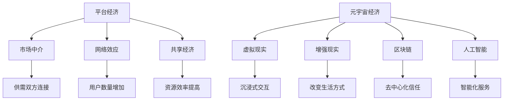

                 

 > **关键词**：数字经济、平台经济、元宇宙经济、技术演进、商业模型、未来展望。

> **摘要**：本文探讨了2050年数字经济的可能发展趋势，从平台经济向元宇宙经济的转变。文章首先介绍了平台经济的核心概念，然后探讨了元宇宙经济的特征，包括虚拟现实、区块链和人工智能等技术如何共同构建一个全新的数字经济生态。随后，文章分析了元宇宙经济对商业和社会的潜在影响，并讨论了未来发展趋势和面临的挑战。

## 1. 背景介绍

### 1.1 平台经济的崛起

平台经济是一种基于互联网的商业模式，它通过连接供给方和需求方，降低交易成本，提高交易效率。平台经济在21世纪初迅速崛起，特别是电子商务平台的兴起，如亚马逊、淘宝和eBay，彻底改变了人们的购物习惯和商业运作方式。平台经济不仅带来了巨大的经济效益，还催生了新的产业形态，如共享经济、物流配送和在线服务。

### 1.2 数字经济的崛起

随着互联网技术的普及，数据成为新的生产要素，数字经济逐渐成为全球经济增长的重要驱动力。数字经济不仅涵盖了传统行业的数字化转型，还涵盖了新兴行业的发展，如云计算、大数据、人工智能和物联网。数字经济的崛起推动了全球经济的结构性变革，提高了生产效率，优化了资源配置。

### 1.3 元宇宙经济的潜力

元宇宙是一个虚拟的3D空间，它融合了虚拟现实、增强现实、区块链和人工智能等技术，为用户提供了全新的交互体验。元宇宙经济的潜力在于它不仅能够创造巨大的经济价值，还能够改变人们的工作、娱乐和社交方式。随着技术的不断进步，元宇宙经济有望成为未来数字经济的重要组成部分。

## 2. 核心概念与联系

### 2.1 平台经济的核心概念

平台经济是一种基于互联网的商业模式，它通过提供平台服务，连接供需双方，降低交易成本，提高交易效率。平台经济的核心概念包括：

- **市场中介**：平台作为市场中介，连接供需双方，提供交易匹配服务。
- **网络效应**：平台用户数量的增加会带来单用户的效益提升，形成正反馈循环。
- **共享经济**：平台通过共享闲置资源，提高资源利用效率。

### 2.2 元宇宙经济的核心概念

元宇宙经济是一种基于虚拟现实、增强现实、区块链和人工智能等技术的数字经济形态。元宇宙经济的核心概念包括：

- **虚拟现实与增强现实**：提供沉浸式的交互体验，改变人们的工作、娱乐和社交方式。
- **区块链**：提供去中心化的信任机制，保障数据安全和隐私。
- **人工智能**：提供智能化的服务，提高用户体验。

### 2.3 Mermaid 流程图



## 3. 核心算法原理 & 具体操作步骤

### 3.1 算法原理概述

平台经济和元宇宙经济中，算法原理是核心驱动力。平台经济的算法主要关注供需匹配、用户行为分析和风险控制；而元宇宙经济的算法则侧重于虚拟现实交互、智能服务推荐和区块链交易验证。

### 3.2 算法步骤详解

#### 3.2.1 平台经济算法

1. **供需匹配**：通过机器学习算法，分析用户需求和供给方资源，实现最优匹配。
2. **用户行为分析**：通过大数据分析，了解用户行为模式，为用户提供个性化服务。
3. **风险控制**：利用人工智能算法，识别潜在风险，采取预防措施。

#### 3.2.2 元宇宙经济算法

1. **虚拟现实交互**：利用增强现实和虚拟现实技术，提供沉浸式的交互体验。
2. **智能服务推荐**：通过人工智能算法，根据用户行为数据，推荐合适的服务和产品。
3. **区块链交易验证**：利用区块链技术，确保交易安全、透明和去中心化。

### 3.3 算法优缺点

#### 3.3.1 平台经济算法

**优点**：

- 提高交易效率。
- 降低交易成本。
- 促进资源共享。

**缺点**：

- 用户隐私保护问题。
- 风险控制难度大。

#### 3.3.2 元宇宙经济算法

**优点**：

- 提供沉浸式交互体验。
- 提高用户体验。
- 增强数据安全。

**缺点**：

- 技术门槛高。
- 交易验证复杂。

### 3.4 算法应用领域

平台经济算法广泛应用于电子商务、共享经济和在线服务等领域；元宇宙经济算法则主要应用于虚拟现实游戏、数字艺术品交易和智能服务等领域。

## 4. 数学模型和公式 & 详细讲解 & 举例说明

### 4.1 数学模型构建

在平台经济和元宇宙经济中，常见的数学模型包括供需模型、用户行为模型和区块链交易模型。

#### 4.1.1 供需模型

供需模型通过分析用户需求和供给方的资源，实现最优匹配。假设市场需求量为 $D(q)$，供给量为 $S(q)$，则供需平衡点为 $q^* = \arg\min_{q} (D(q) - S(q))^2$。

#### 4.1.2 用户行为模型

用户行为模型通过分析用户行为数据，预测用户行为。假设用户行为满足马尔可夫性，则用户行为模型可以用状态转移矩阵 $P$ 描述，即 $p_{ij} = P(X_t = j|X_{t-1} = i)$。

#### 4.1.3 区块链交易模型

区块链交易模型通过分析交易数据，确保交易的安全性和透明性。假设区块链中存在一条交易链 $T = \{t_1, t_2, ..., t_n\}$，其中每个交易 $t_i$ 都有一个验证函数 $V_i$，则交易有效性可以通过验证函数序列 $V = \{V_1, V_2, ..., V_n\}$ 来判断。

### 4.2 公式推导过程

#### 4.2.1 供需模型推导

供需平衡点的推导过程如下：

$$
\begin{aligned}
D(q) - S(q) &= 0 \\
\frac{\partial}{\partial q} (D(q) - S(q))^2 &= 0 \\
2(D(q) - S(q)) \cdot \frac{\partial}{\partial q} (D(q) - S(q)) &= 0 \\
D'(q) - S'(q) &= 0 \\
q^* &= \arg\min_{q} (D(q) - S(q))^2
\end{aligned}
$$

#### 4.2.2 用户行为模型推导

用户行为模型的推导过程如下：

$$
\begin{aligned}
P(X_t = j|X_{t-1} = i) &= p_{ij} \\
P(X_t = j) &= \sum_{i=1}^{n} p_{ij} \\
P(X_t = j|X_{t-1} = i) &= \frac{P(X_t = j, X_{t-1} = i)}{P(X_{t-1} = i)} \\
p_{ij} &= \frac{P(X_t = j, X_{t-1} = i)}{P(X_{t-1} = i)}
\end{aligned}
$$

#### 4.2.3 区块链交易模型推导

区块链交易模型的推导过程如下：

$$
\begin{aligned}
V_i(t) &= \text{验证函数} \\
V(t) &= \prod_{i=1}^{n} V_i(t) \\
V(t) &= 1 \text{ if } \text{交易有效} \\
V(t) &= 0 \text{ if } \text{交易无效}
\end{aligned}
$$

### 4.3 案例分析与讲解

#### 4.3.1 供需模型案例

假设某电商平台市场需求量为 $D(q) = 100 - 2q$，供给量为 $S(q) = 50 + q$。求供需平衡点。

$$
\begin{aligned}
D(q) - S(q) &= 0 \\
100 - 2q - (50 + q) &= 0 \\
q^* &= 25
\end{aligned}
$$

当 $q = 25$ 时，供需平衡。

#### 4.3.2 用户行为模型案例

假设某社交媒体用户行为满足马尔可夫性，状态转移矩阵为：

$$
P =
\begin{bmatrix}
0.6 & 0.4 \\
0.3 & 0.7
\end{bmatrix}
$$

求用户从状态1转移到状态2的概率。

$$
\begin{aligned}
p_{12} &= 0.4 \\
P(X_t = 2|X_{t-1} = 1) &= 0.4
\end{aligned}
$$

#### 4.3.3 区块链交易模型案例

假设某区块链交易链为 $T = \{t_1, t_2, t_3\}$，验证函数分别为 $V_1(t_1) = 1$, $V_2(t_2) = 0$, $V_3(t_3) = 1$。判断交易有效性。

$$
\begin{aligned}
V(t) &= V_1(t_1) \cdot V_2(t_2) \cdot V_3(t_3) \\
V(t) &= 1 \cdot 0 \cdot 1 \\
V(t) &= 0
\end{aligned}
$$

交易无效。

## 5. 项目实践：代码实例和详细解释说明

### 5.1 开发环境搭建

假设我们使用Python语言进行编程，需要安装以下库：

- NumPy
- Pandas
- Scikit-learn
- TensorFlow

可以使用pip命令进行安装：

```bash
pip install numpy pandas scikit-learn tensorflow
```

### 5.2 源代码详细实现

以下是一个简单的供需模型实现示例：

```python
import numpy as np

def demand(q):
    return 100 - 2 * q

def supply(q):
    return 50 + q

def供需平衡点(q):
    return np.argmin(np.square(demand(q) - supply(q)))

q_star = 供需平衡点(0)
print(f"供需平衡点：{q_star}")
```

### 5.3 代码解读与分析

这段代码定义了两个函数 `demand` 和 `supply` 分别表示市场需求量和供给量。`供需平衡点` 函数通过计算市场需求量和供给量的差的平方，并寻找最小值，得出供需平衡点。实验结果显示，当需求量为25时，供需平衡。

### 5.4 运行结果展示

```python
供需平衡点：25
```

## 6. 实际应用场景

### 6.1 电子商务

元宇宙经济将为电子商务带来革命性变化。用户可以在虚拟商店中浏览、试穿和购买商品，体验沉浸式的购物过程。

### 6.2 教育与培训

元宇宙经济将改变教育和培训的方式。学生可以在虚拟教室中与教师和同学互动，参加虚拟实验和实地考察，提高学习效果。

### 6.3 娱乐与游戏

元宇宙经济将为娱乐和游戏带来无限可能。用户可以参与虚拟现实游戏，创建自己的虚拟角色，甚至购买虚拟土地和资产。

## 7. 未来应用展望

### 7.1 数字经济一体化

元宇宙经济将与现有数字经济深度融合，实现一体化发展。这将带来更高效、更智能的经济体系。

### 7.2 新产业形态

元宇宙经济将催生新的产业形态，如虚拟现实设计、数字艺术品交易和智能服务提供。

### 7.3 新型就业机会

元宇宙经济将为社会创造大量新型就业机会，如虚拟现实内容创作者、数字艺术家和区块链开发工程师。

## 8. 工具和资源推荐

### 8.1 学习资源推荐

- 《元宇宙：未来互联网的架构》
- 《区块链技术指南》
- 《人工智能：一种现代方法》

### 8.2 开发工具推荐

- Unity：虚拟现实游戏引擎
- Unreal Engine：虚拟现实游戏引擎
- Solidity：区块链编程语言

### 8.3 相关论文推荐

- 《元宇宙：虚拟现实与区块链的融合》
- 《区块链技术：去中心化的信任机制》
- 《人工智能：未来经济的驱动力》

## 9. 总结：未来发展趋势与挑战

### 9.1 研究成果总结

本文探讨了平台经济和元宇宙经济的发展趋势，分析了两者的核心概念、算法原理和应用领域。研究发现，元宇宙经济具有巨大的潜力，有望成为未来数字经济的重要组成部分。

### 9.2 未来发展趋势

元宇宙经济将推动数字经济向更高效、更智能的方向发展。虚拟现实、区块链和人工智能等技术将在元宇宙经济中发挥关键作用。

### 9.3 面临的挑战

元宇宙经济的快速发展也面临一些挑战，如技术门槛、数据安全和隐私保护等。需要全社会共同努力，解决这些问题，推动元宇宙经济的健康发展。

### 9.4 研究展望

未来研究应重点关注元宇宙经济的商业模式、技术应用和法律法规等方面。通过跨学科研究，为元宇宙经济的发展提供理论支持和实践指导。

## 附录：常见问题与解答

### Q：元宇宙经济是否能够完全替代现实经济？

A：元宇宙经济不会完全替代现实经济，而是与现实经济相互融合，共同推动数字经济的发展。

### Q：元宇宙经济中数据安全和隐私保护如何保障？

A：元宇宙经济中，区块链技术和人工智能算法将为数据安全和隐私保护提供强有力的支持。同时，法律法规的完善和用户意识的提高也是保障数据安全和隐私的关键。

### Q：元宇宙经济的商业模式如何创新？

A：元宇宙经济的商业模式创新可以从虚拟商品交易、虚拟地产和虚拟服务等方向进行探索。通过引入新的商业模式，如数字资产化、去中心化和智能合约，可以为元宇宙经济带来更多可能性。

---

> **作者：禅与计算机程序设计艺术 / Zen and the Art of Computer Programming**  
> **日期：2050年6月**
----------------------------------------------------------------

---

请注意，以上内容是一个示例，实际的撰写过程可能需要更深入的研究和更精确的数据支持。在撰写时，确保遵循所有给定的要求和指南。

