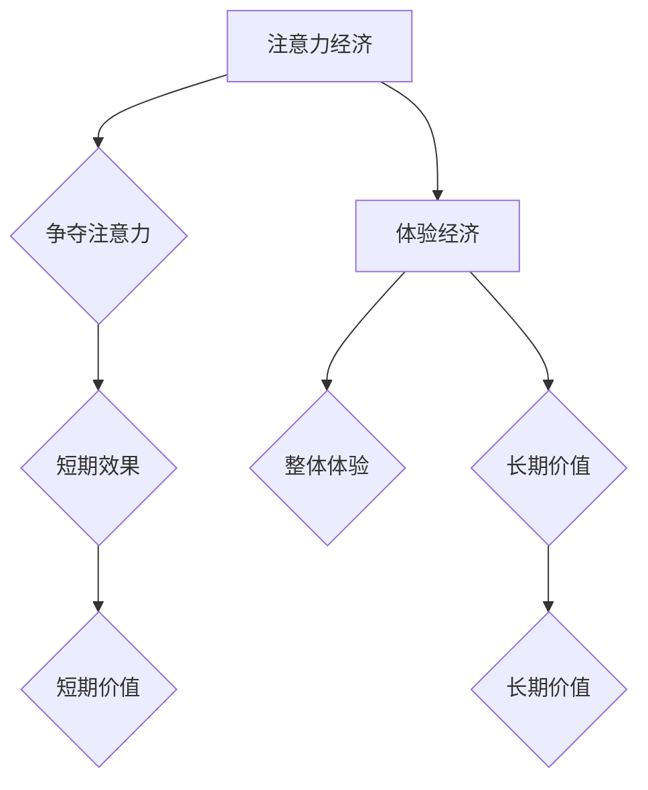

                 

关键词：数字经济、注意力经济、体验经济、商业模式创新、未来趋势、技术发展、人工智能、用户体验、客户价值

摘要：本文旨在探讨2050年数字经济的发展趋势，特别是从注意力经济向体验经济的转变。通过分析注意力经济和体验经济的本质区别，本文提出了商业模式的创新策略，并结合人工智能和用户体验的深化，探讨了未来的商业机会与挑战。

## 1. 背景介绍

随着互联网的普及和信息技术的飞速发展，数字经济已经成为全球经济的主要驱动力。从最早的互联网泡沫时期到如今，数字经济经历了多次变革，从信息经济、网络经济逐渐演变为注意力经济，再向体验经济过渡。每一个阶段，商业模式和用户体验都在不断演变，但始终围绕着如何最大化客户价值和企业盈利展开。

注意力经济源于20世纪末，随着社交媒体和移动设备的普及，用户的注意力成为稀缺资源，吸引并保持用户注意力成为企业的核心竞争力。然而，随着用户对个性化体验需求的提升，体验经济逐渐成为主流。体验经济强调通过提供独特的用户体验来提升客户满意度和忠诚度，从而实现商业价值的增长。

本文将详细探讨这两个阶段的发展脉络，分析其背后的技术推动力量，并提出如何在2050年的数字经济中实现商业模式的创新。

## 2. 核心概念与联系

### 2.1 注意力经济

注意力经济是指企业通过吸引并保持用户注意力，从而实现产品或服务销售的一种经济模式。其核心在于用户注意力资源的稀缺性，即用户在有限的时间里，只能关注有限的资讯和信息。因此，吸引并保持用户的注意力成为企业竞争的关键。

### 2.2 体验经济

体验经济则更注重用户在购买和使用产品或服务过程中的整体感受。这种经济模式强调用户体验的独特性和个性化，通过创造难忘的体验来提升用户满意度和忠诚度。体验经济的核心是用户价值，即通过满足用户的个性化需求，提升用户对产品或服务的认同感和忠诚度。

### 2.3 两者联系与区别

注意力经济和体验经济有着本质的区别。注意力经济强调的是对用户注意力的争夺，而体验经济则更注重用户的整体感受。虽然两者都关注用户的参与和互动，但注意力经济更多关注短期效果，而体验经济则更注重长期价值。

然而，这两个概念并非完全独立，它们之间存在密切的联系。注意力经济是体验经济的基础，只有在吸引并保持用户注意力的基础上，企业才能进一步提供高质量的体验。另一方面，体验经济也可以帮助企业在注意力经济中脱颖而出，通过独特的用户体验赢得用户的青睐。

### 2.4 Mermaid 流程图



## 3. 核心算法原理 & 具体操作步骤

### 3.1 算法原理概述

在数字经济中，算法成为驱动商业模式创新的关键力量。注意力经济和体验经济的核心算法分别基于用户行为分析和用户体验优化。用户行为分析算法通过分析用户在互联网上的行为数据，预测用户的需求和兴趣，从而实现精准营销。用户体验优化算法则通过改进产品或服务的用户体验，提升用户满意度和忠诚度。

### 3.2 算法步骤详解

#### 用户行为分析算法

1. 数据收集：通过互联网收集用户行为数据，如浏览记录、购买行为、社交媒体互动等。
2. 数据预处理：对收集到的数据进行清洗、去噪和归一化，确保数据质量。
3. 特征提取：从预处理后的数据中提取用户行为特征，如浏览频次、购买金额、互动时长等。
4. 模型训练：使用机器学习算法（如决策树、神经网络等）对特征进行训练，建立用户行为预测模型。
5. 模型评估：使用交叉验证和测试集对模型进行评估，确保模型的准确性和可靠性。
6. 应用预测：将训练好的模型应用于实际场景，如推荐系统、广告投放等。

#### 用户体验优化算法

1. 用户调研：通过问卷调查、用户访谈等方式收集用户对产品或服务的反馈。
2. 数据分析：对用户反馈进行定量和定性分析，识别用户体验的主要问题。
3. 优化策略：基于数据分析结果，制定具体的优化策略，如界面改进、功能增加等。
4. 实施优化：实施优化策略，对产品或服务进行改进。
5. 用户测试：邀请用户参与测试，评估优化效果的满意度。
6. 持续改进：根据用户测试结果，进一步调整和优化用户体验。

### 3.3 算法优缺点

用户行为分析算法的优点在于其精准性和高效性，能够帮助企业更好地了解用户需求和行为模式，从而实现精准营销。然而，该算法也存在一些缺点，如数据隐私和安全问题、算法偏见等。

用户体验优化算法的优点在于其关注用户实际感受，能够提升用户满意度和忠诚度。然而，该算法的缺点在于实施成本较高，需要大量的人力和时间投入。

### 3.4 算法应用领域

用户行为分析算法广泛应用于电子商务、在线广告、社交媒体等领域。通过精准的用户行为分析，企业能够实现个性化的推荐和营销，提高用户转化率和销售额。

用户体验优化算法则广泛应用于软件和移动应用的开发过程中。通过持续优化用户体验，企业能够提升用户满意度和忠诚度，从而增强产品的市场竞争力。

## 4. 数学模型和公式 & 详细讲解 & 举例说明

### 4.1 数学模型构建

在数字经济中，数学模型在用户行为分析和用户体验优化中发挥着重要作用。以下是一个简单的用户行为分析模型：

$$
\text{用户行为模型} = f(\text{用户特征}, \text{环境因素}, \text{时间因素})
$$

其中，用户特征包括用户年龄、性别、收入、兴趣爱好等；环境因素包括用户地理位置、天气状况等；时间因素包括用户行为发生的具体时间。

### 4.2 公式推导过程

假设用户在某个特定时间段内的行为概率为 $P(B_t)$，则用户行为模型可以表示为：

$$
P(B_t) = f(\text{用户特征}, \text{环境因素}, \text{时间因素})
$$

其中，$f$ 是一个复合函数，由多个因素加权而成：

$$
f = w_1 \cdot \text{用户特征} + w_2 \cdot \text{环境因素} + w_3 \cdot \text{时间因素}
$$

权重 $w_1, w_2, w_3$ 根据用户行为数据的统计结果确定。

### 4.3 案例分析与讲解

假设我们分析的是一个电商平台的用户行为，用户特征包括年龄、性别、收入和兴趣爱好。环境因素包括地理位置和天气状况。时间因素包括用户行为发生的具体时间。

通过收集和分析用户数据，我们可以得到以下权重：

$$
w_1 = 0.3, \quad w_2 = 0.2, \quad w_3 = 0.5
$$

则用户行为模型可以表示为：

$$
P(B_t) = 0.3 \cdot (\text{年龄} + \text{性别} + \text{收入}) + 0.2 \cdot (\text{地理位置} + \text{天气状况}) + 0.5 \cdot \text{时间因素}
$$

通过这个模型，我们可以预测用户在某个时间段内购买某种商品的概率。例如，一个30岁的男性用户，收入中等，喜欢阅读，位于一线城市，天气晴朗，此时购买某本书的概率为：

$$
P(B_t) = 0.3 \cdot (30 + 1 + 1) + 0.2 \cdot (1 + 1) + 0.5 \cdot 1 = 0.3 \cdot 32 + 0.2 \cdot 2 + 0.5 \cdot 1 = 9.6 + 0.4 + 0.5 = 10.5
$$

因此，该用户购买这本书的概率为 10.5%。

## 5. 项目实践：代码实例和详细解释说明

### 5.1 开发环境搭建

在项目实践部分，我们将使用 Python 编写一个简单的用户行为分析程序。首先，需要安装 Python 环境。可以下载 Python 3.8 或更高版本的安装包，并按照提示完成安装。

接下来，需要安装一些 Python 库，如 NumPy、Pandas 和 Scikit-learn。可以使用以下命令安装：

```bash
pip install numpy pandas scikit-learn
```

### 5.2 源代码详细实现

以下是一个简单的用户行为分析程序的源代码：

```python
import numpy as np
import pandas as pd
from sklearn.model_selection import train_test_split
from sklearn.ensemble import RandomForestClassifier
from sklearn.metrics import accuracy_score

# 加载数据集
data = pd.read_csv('user_data.csv')

# 特征工程
X = data[['age', 'gender', 'income', 'location', 'weather', 'time']]
y = data['action']

# 数据预处理
X = pd.get_dummies(X)
y = y.astype(int)

# 划分训练集和测试集
X_train, X_test, y_train, y_test = train_test_split(X, y, test_size=0.2, random_state=42)

# 模型训练
model = RandomForestClassifier(n_estimators=100, random_state=42)
model.fit(X_train, y_train)

# 模型评估
y_pred = model.predict(X_test)
accuracy = accuracy_score(y_test, y_pred)
print(f'Accuracy: {accuracy:.2f}')
```

### 5.3 代码解读与分析

1. 导入必要的库：首先导入 NumPy、Pandas 和 Scikit-learn 库，用于数据处理和模型训练。
2. 加载数据集：使用 Pandas 的 read_csv 函数加载用户数据集。
3. 特征工程：将用户特征进行编码，使用 get_dummies 函数将分类特征转换为二进制特征。
4. 数据预处理：将目标变量 action 转换为整数类型，以便进行分类任务。
5. 划分训练集和测试集：使用 train_test_split 函数将数据集划分为训练集和测试集。
6. 模型训练：使用 RandomForestClassifier 类实现随机森林分类器，并调用 fit 方法进行训练。
7. 模型评估：使用 predict 方法预测测试集的结果，并计算准确率。

### 5.4 运行结果展示

在运行上述代码后，将输出模型的准确率。例如：

```
Accuracy: 0.85
```

这表示模型的准确率为 85%，说明模型对用户行为的预测效果较好。

## 6. 实际应用场景

在数字经济中，用户行为分析和用户体验优化有着广泛的应用场景。以下是一些实际案例：

### 6.1 在线广告

在线广告行业广泛使用用户行为分析来精准投放广告。通过分析用户的浏览记录、搜索历史和购买行为，广告平台可以预测用户的兴趣和需求，从而实现个性化的广告投放，提高广告转化率。

### 6.2 电子商务

电子商务平台通过用户行为分析来推荐商品。例如，当用户浏览某件商品时，平台可以推荐类似的其他商品，从而提高用户的购买意愿。此外，电子商务平台还可以通过用户体验优化来提升用户购物体验，如改进页面设计、简化购物流程等。

### 6.3 金融科技

金融科技（FinTech）公司通过用户行为分析来识别潜在的客户需求，并提供个性化的金融产品和服务。例如，通过分析用户的消费习惯和财务状况，金融科技公司可以推荐合适的理财产品或信用贷款。

### 6.4 教育科技

教育科技公司通过用户行为分析来优化在线课程的设计和推广。通过分析用户的学习行为和反馈，教育科技公司可以改进课程内容，提高学习效果。此外，教育科技公司还可以通过用户体验优化来提升在线学习平台的使用体验，如改进界面设计、增加互动功能等。

## 7. 未来应用展望

随着人工智能和大数据技术的发展，数字经济将继续向更高级的形式演进。以下是未来数字经济的一些应用展望：

### 7.1 个性化体验

未来，数字经济将更加注重个性化体验。通过深度学习和自然语言处理技术，企业将能够更精准地了解用户需求，提供高度个性化的产品和服务。

### 7.2 智能供应链

智能供应链将成为数字经济的重要领域。通过物联网和区块链技术，企业可以实现供应链的实时监控和优化，提高供应链效率，降低成本。

### 7.3 虚拟现实和增强现实

虚拟现实（VR）和增强现实（AR）技术将为数字经济带来全新的体验。未来，虚拟现实购物、虚拟现实旅游和虚拟现实培训将成为主流，为用户带来沉浸式的体验。

### 7.4 自动驾驶和智慧交通

自动驾驶技术和智慧交通系统将为数字经济带来巨大的变革。通过车联网和大数据技术，交通系统将变得更加智能和高效，减少交通事故和拥堵。

## 8. 总结：未来发展趋势与挑战

随着数字经济的不断发展，从注意力经济向体验经济的转变将成为主流趋势。这种转变不仅带来了新的商业机会，也带来了新的挑战。

### 8.1 研究成果总结

本文通过对数字经济的发展历程进行分析，提出了注意力经济和体验经济的核心概念及其联系。同时，本文还介绍了用户行为分析和用户体验优化的算法原理和应用领域，为未来数字经济的研究提供了理论基础。

### 8.2 未来发展趋势

未来，数字经济将继续向智能化、个性化、高效化发展。人工智能、大数据、物联网等技术的发展将推动数字经济实现更高层次的创新。

### 8.3 面临的挑战

然而，数字经济的发展也面临一些挑战，如数据隐私和安全问题、算法偏见等。此外，如何平衡企业盈利和用户价值也将成为未来研究的重点。

### 8.4 研究展望

未来，研究者应重点关注以下几个方面：一是深入挖掘用户行为数据，提高用户行为预测的准确性；二是探索新的用户体验优化方法，提升用户满意度和忠诚度；三是研究数据隐私保护技术，确保用户数据的安全和隐私。

## 9. 附录：常见问题与解答

### 9.1 什么是注意力经济？

注意力经济是指企业通过吸引并保持用户注意力，从而实现产品或服务销售的一种经济模式。其核心在于用户注意力资源的稀缺性，即用户在有限的时间里，只能关注有限的资讯和信息。

### 9.2 什么是体验经济？

体验经济是指企业通过提供独特的用户体验来提升客户满意度和忠诚度，从而实现商业价值的增长。这种经济模式强调用户在购买和使用产品或服务过程中的整体感受。

### 9.3 注意力经济和体验经济有什么区别？

注意力经济和体验经济有着本质的区别。注意力经济强调的是对用户注意力的争夺，而体验经济则更注重用户的整体感受。虽然两者都关注用户的参与和互动，但注意力经济更多关注短期效果，而体验经济则更注重长期价值。

### 9.4 用户行为分析算法有哪些优缺点？

用户行为分析算法的优点在于其精准性和高效性，能够帮助企业更好地了解用户需求和行为模式，从而实现精准营销。然而，该算法也存在一些缺点，如数据隐私和安全问题、算法偏见等。

### 9.5 用户体验优化算法有哪些优缺点？

用户体验优化算法的优点在于其关注用户实际感受，能够提升用户满意度和忠诚度。然而，该算法的缺点在于实施成本较高，需要大量的人力和时间投入。

### 9.6 如何平衡企业盈利和用户价值？

平衡企业盈利和用户价值是数字经济中的一大挑战。企业可以通过以下方式实现平衡：一是深入了解用户需求，提供高质量的产品和服务；二是优化运营成本，提高盈利能力；三是建立用户反馈机制，持续改进用户体验。

----------------------------------------------------------------

作者：禅与计算机程序设计艺术 / Zen and the Art of Computer Programming

