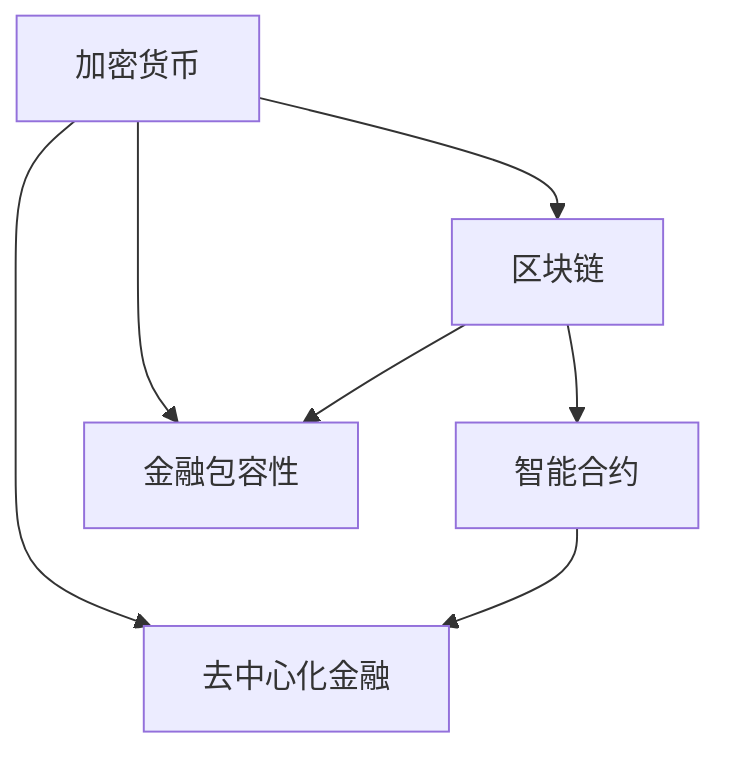

                 

关键词：数字货币、加密货币、全球货币体系、货币重构、2050、技术创新、金融科技

## 摘要

本文探讨了2050年数字货币的潜在发展轨迹，分析了加密货币如何演变成为全球数字货币体系的核心。通过对现有技术的深入剖析，本文提出了一个逻辑清晰、结构紧凑、简单易懂的货币体系重构方案，为未来的金融科技发展提供了新思路。

### 1. 背景介绍

### 1.1 数字货币的兴起

数字货币作为一种新型的货币形式，其历史可以追溯到20世纪90年代末。最初的加密货币——比特币（Bitcoin），由一位（或多位）化名为中本聪（Satoshi Nakamoto）的神秘人物在2009年创立。比特币的出现标志着去中心化金融的诞生，它通过区块链技术实现了价值的传递，开启了数字货币的新纪元。

随着时间的推移，越来越多的加密货币如雨后春笋般涌现，包括以太坊（Ethereum）、莱特币（Litecoin）等。这些加密货币不仅在交易速度和安全性上有所改进，还扩展了应用范围，使得数字货币逐渐成为金融领域的重要参与者。

### 1.2 数字货币的现状

截至2023，数字货币在全球范围内已经获得了广泛的认可和应用。许多国家开始探索将数字货币作为法定货币的可行性，一些国家甚至已经推出了自己的数字货币。例如，中国的数字人民币（e-CNY）已经开始试点，欧盟也在积极推动其数字欧元（e-Euro）的开发。

尽管数字货币的发展取得了显著进展，但其普及和接受程度仍然受到诸多因素的制约。首先，技术问题如区块链的扩展性、隐私保护和安全性仍然是亟待解决的难题。其次，监管政策的不确定性也限制了数字货币的发展。此外，市场波动性和投机行为也使得数字货币市场的稳定性面临挑战。

### 1.3 2050年的展望

展望2050年，我们可以预见数字货币将在全球范围内得到广泛应用，成为经济活动的主要媒介。随着技术的不断进步，加密货币将不再是孤立的金融工具，而是一个集成的全球数字货币体系的核心。这一体系将实现更高的交易效率、更强的安全性和更广泛的金融包容性。

本文将详细探讨这一未来货币体系的重构过程，分析其技术基础、应用场景以及面临的挑战。

## 2. 核心概念与联系

为了理解2050年数字货币体系的重构，我们需要首先明确几个核心概念，并理解它们之间的内在联系。

### 2.1 加密货币

加密货币是使用密码学技术来保护交易、控制账户创建以及验证资金转移的数字货币。其核心特点是去中心化、匿名性和不可篡改性。比特币是第一种加密货币，它通过区块链技术实现了这些特点。

### 2.2 区块链

区块链是一种分布式账本技术，其核心思想是多个节点共同维护一个共享的数据库。每个区块包含一定数量的交易记录，并通过加密算法与前一个区块链接起来，形成一个链条。区块链的不可篡改性确保了数据的安全性和透明度。

### 2.3 智能合约

智能合约是运行在区块链上的计算机程序，其目的是自动化和执行合同条款。智能合约使得交易过程更加高效、透明和可验证，是数字货币体系中的重要组成部分。

### 2.4 加密货币与区块链的联系

加密货币和区块链密不可分。加密货币依赖区块链来记录和验证交易，而区块链则为加密货币提供了安全、透明和去中心化的基础。没有区块链，加密货币将无法实现其设计初衷。

### 2.5 加密货币与智能合约的联系

智能合约可以增强加密货币的功能，使其不仅仅是货币，还能实现复杂的金融交易。例如，通过智能合约，可以创建去中心化的金融产品，如去中心化金融（DeFi）和不可替代代币（NFT）。

### 2.6 Mermaid 流程图

为了更好地理解这些概念之间的联系，我们可以使用Mermaid流程图来表示。以下是一个简化的Mermaid流程图示例：



### 2.7 核心概念的重要性

这些核心概念构成了2050年数字货币体系的基础。加密货币提供了去中心化的交易媒介，区块链确保了数据的安全性和透明度，而智能合约则扩展了数字货币的应用范围。这些技术的结合将推动未来数字货币体系的重构，实现更高效、更安全和更包容的金融体系。

## 3. 核心算法原理 & 具体操作步骤

### 3.1 算法原理概述

在未来的数字货币体系中，核心算法将扮演关键角色。这些算法不仅负责处理交易，还负责维护系统的安全性、透明度和去中心化特性。以下是几个关键算法的概述：

#### 3.1.1 挖矿算法

挖矿是加密货币体系中的一种重要机制，它负责验证交易并添加到区块链中。常见的挖矿算法包括工作量证明（Proof of Work，PoW）和权益证明（Proof of Stake，PoS）。

- **PoW**：矿工通过解决复杂的数学难题来竞争记账权。这个过程中消耗大量的计算资源，从而确保系统的安全性。
- **PoS**：矿工根据其持有的货币数量和持有时间来竞争记账权。持有货币时间越长、数量越多，获得记账权的概率越高。这种方法比PoW更节能，也更公平。

#### 3.1.2 验证算法

验证算法是确保区块链数据一致性和安全性的关键。常见的验证算法包括基于椭圆曲线加密（Elliptic Curve Cryptography，ECC）的签名算法和基于SHA-256的哈希算法。

- **ECC**：ECC是一种强大的加密算法，可以提供更高的安全性和更高效的性能。
- **SHA-256**：SHA-256是一种广泛使用的哈希算法，用于确保区块链数据的完整性。

#### 3.1.3 智能合约执行算法

智能合约执行算法负责在区块链上执行智能合约。这些算法包括基于虚拟机的执行环境和基于区块链的执行环境。

- **基于虚拟机的执行环境**：如以太坊的EVM（Ethereum Virtual Machine），它允许智能合约在区块链上运行。
- **基于区块链的执行环境**：如EOS的DPOS（Delegated Proof of Stake），它通过区块链自身来执行智能合约。

### 3.2 算法步骤详解

以下是这些核心算法的具体操作步骤：

#### 3.2.1 挖矿算法

1. **交易收集**：矿工从区块链网络中收集未确认的交易。
2. **创建区块**：矿工将这些交易打包成一个新区块，并将其附加到区块链的末端。
3. **挖矿**：矿工使用挖矿算法（如PoW或PoS）来验证新区块。对于PoW，矿工需要找到满足特定难度要求的解；对于PoS，矿工需要获得足够的权益支持。
4. **添加区块**：一旦区块被验证，它将被添加到区块链中，交易也随之确认。

#### 3.2.2 验证算法

1. **签名验证**：每个交易都需要使用发送方的私钥进行签名。接收方可以使用发送方的公钥来验证签名，确保交易确实是发送方发起的。
2. **哈希计算**：每个区块的头部都包含一个哈希值，这个哈希值是基于区块数据的SHA-256哈希计算得到的。每个区块都必须链接到前一个区块，从而形成一个链条。
3. **链式校验**：每个新区块都必须通过链式校验，确保它与区块链的其他部分一致。

#### 3.2.3 智能合约执行算法

1. **合约编码**：开发者使用智能合约编程语言（如Solidity）编写智能合约代码。
2. **部署合约**：开发者将智能合约部署到区块链上，使其可供网络中的其他用户调用。
3. **执行合约**：当用户调用智能合约时，区块链上的执行环境将解析代码并执行操作。例如，一个去中心化金融合约可能用于执行自动化的借贷交易。
4. **状态更新**：智能合约执行后，区块链将更新其状态，记录合约执行的结果。

### 3.3 算法优缺点

#### 3.3.1 挖矿算法

**优点**：
- **安全性**：通过挖矿机制，加密货币体系具有较高的安全性。
- **去中心化**：挖矿算法确保了系统的去中心化，避免单一实体控制。

**缺点**：
- **能源消耗**：PoW算法消耗大量电力，对环境造成负面影响。
- **可扩展性**：随着网络规模的扩大，挖矿难度增加，导致交易确认时间延长。

#### 3.3.2 验证算法

**优点**：
- **安全性**：通过签名和哈希算法，确保交易和区块链数据的真实性。
- **透明度**：所有交易记录都公开可查，提高了系统的透明度。

**缺点**：
- **计算复杂度**：哈希计算需要大量计算资源，可能导致系统性能下降。

#### 3.3.3 智能合约执行算法

**优点**：
- **自动化**：智能合约可以实现自动化交易，提高效率。
- **透明性**：智能合约代码公开，确保交易过程的透明性。

**缺点**：
- **安全性**：智能合约可能存在漏洞，导致系统安全风险。
- **复杂性**：智能合约的编写和执行需要专业知识。

### 3.4 算法应用领域

这些算法在数字货币体系中有着广泛的应用领域：

- **交易验证**：挖矿算法和验证算法用于确保交易的安全性和透明度。
- **智能合约**：智能合约用于创建去中心化金融产品，如借贷、股票交易等。
- **数字身份验证**：加密货币和区块链技术可以用于数字身份验证，确保用户身份的真实性。

总之，这些算法构成了2050年数字货币体系的基础，为未来的金融科技发展提供了强大支持。

### 4. 数学模型和公式 & 详细讲解 & 举例说明

在数字货币体系中，数学模型和公式是理解和分析系统行为的重要工具。以下将介绍几个关键的数学模型和公式，并对其进行详细讲解和举例说明。

#### 4.1 数学模型构建

在构建数学模型时，我们需要考虑以下几个关键因素：

- **交易频率**：系统中的交易发生频率。
- **网络规模**：参与区块链网络的节点数量。
- **挖矿难度**：矿工挖掘新区块的难度。
- **权益分配**：系统中货币的分配方式。

一个简单的数学模型可以表示为：

\[ M(t) = f(T, N, D, R) \]

其中：
- \( M(t) \) 表示在时间 \( t \) 时的货币总量。
- \( f \) 是一个函数，用于计算货币总量的变化。
- \( T \) 是交易频率。
- \( N \) 是网络规模。
- \( D \) 是挖矿难度。
- \( R \) 是权益分配方式。

#### 4.2 公式推导过程

为了推导出货币总量的变化公式，我们需要考虑以下几个因素：

1. **货币生成**：货币通过挖矿生成，挖矿速度与挖矿难度成反比。
2. **货币消耗**：货币在交易过程中消耗，消耗速度与交易频率成正比。
3. **权益分配**：货币的生成和消耗需要考虑权益分配，权益分配方式会影响货币的流通速度。

假设在时间 \( t \) 内，挖矿生成的货币为 \( G(t) \)，交易消耗的货币为 \( C(t) \)，权益分配方式为 \( R \)，则有：

\[ M(t) = M(0) + G(t) - C(t) \]

由于 \( G(t) \) 与 \( D \) 成反比，可以表示为：

\[ G(t) = \frac{K}{D} \]

其中 \( K \) 是一个常数。

交易消耗的货币可以表示为：

\[ C(t) = \lambda T \]

其中 \( \lambda \) 是交易频率的系数。

将 \( G(t) \) 和 \( C(t) \) 代入货币总量公式，得到：

\[ M(t) = M(0) + \frac{K}{D(t)} - \lambda T \]

其中 \( D(t) \) 表示随时间变化的挖矿难度。

#### 4.3 案例分析与讲解

为了更好地理解上述公式，我们可以通过一个实际案例来进行分析。

假设一个区块链网络在初始时刻（\( t = 0 \)）有 \( M(0) = 10 \) 亿货币，交易频率 \( T = 100 \) 次/天，挖矿难度 \( D(0) = 1000 \)，权益分配方式 \( R = 1 \)。

根据上述公式，初始时刻的货币总量为：

\[ M(0) = 10^9 \]

在第一天后，货币总量为：

\[ M(1) = 10^9 + \frac{K}{1000} - 100 \times \lambda \]

由于我们没有具体的常数 \( K \) 和 \( \lambda \)，我们无法直接计算 \( M(1) \)。但是，我们可以通过这个公式来分析货币总量的变化趋势。

首先，如果挖矿难度保持不变（即 \( D(t) = D(0) \)），货币总量将随着时间逐渐减少，因为交易消耗的货币多于挖矿生成的货币。

其次，如果挖矿难度随时间增加（即 \( D(t) > D(0) \)），货币总量将保持稳定或逐渐增加，因为挖矿生成的货币速度超过了交易消耗的速度。

#### 4.4 举例说明

为了更直观地理解上述公式，我们可以通过一个简单的例子来说明。

假设区块链网络每天有 \( T = 1000 \) 次交易，每次交易消耗 \( C = 100 \) 货币，挖矿难度 \( D = 1000 \)，权益分配方式 \( R = 1 \)。

初始时刻的货币总量为：

\[ M(0) = 10^9 \]

一天后的货币总量为：

\[ M(1) = 10^9 + \frac{K}{1000} - 100 \times 1000 = 10^9 - 10^6 + \frac{K}{1000} \]

由于 \( K \) 是一个常数，我们可以忽略其对货币总量变化的影响。因此，一天后的货币总量大约为 \( 10^9 - 10^6 \)，即减少了 \( 10^6 \) 货币。

通过这个例子，我们可以看到，随着时间的推移，货币总量会因为交易消耗而逐渐减少。然而，如果挖矿难度增加，货币总量将保持稳定或增加。

总之，通过数学模型和公式，我们可以更好地理解和预测数字货币体系的运行情况，为未来的金融科技发展提供有力支持。

### 5. 项目实践：代码实例和详细解释说明

#### 5.1 开发环境搭建

在进行数字货币项目开发之前，我们需要搭建一个合适的环境。以下是一个基本的开发环境搭建步骤：

1. **安装Node.js**：Node.js是一个基于Chrome V8引擎的JavaScript运行环境，它使得JavaScript不仅可以用于前端开发，也可以用于后端开发。下载并安装Node.js。
2. **安装Golang**：Golang（Go语言）是一种高效的静态类型编程语言，广泛用于区块链开发。下载并安装Golang。
3. **安装Git**：Git是一个版本控制系统，用于管理和追踪代码变更。下载并安装Git。
4. **安装Docker**：Docker是一个开源的应用容器引擎，它使得开发者可以轻松地将应用程序部署到任何环境中。下载并安装Docker。
5. **配置开发环境**：根据需要配置Node.js、Golang和Docker的环境变量，以便在命令行中使用。

#### 5.2 源代码详细实现

以下是数字货币项目的一个简单示例。这个示例将实现一个基本的区块链，包括区块链结构、交易和挖矿功能。

```go
package main

import (
	"bytes"
	"crypto/sha256"
	"encoding/hex"
	"fmt"
	"math"
	"time"
)

// 区块结构
type Block struct {
	Timestamp     int64
	Transactions  []*Transaction
	PrevHash      []byte
	Hash          []byte
	Nonce         int
}

// 交易结构
type Transaction struct {
	Sender    string
	Recipient string
	Amount    float64
}

// 创建新区块
func NewBlock(timestamp int64, transactions []*Transaction, prevHash []byte) *Block {
	block := &Block{Timestamp: timestamp, Transactions: transactions, PrevHash: prevHash}
	// 计算哈希
	pow := NewProofOfWork(block)
	hash, nonce := pow.Run()
	block.Hash = hash
	block.Nonce = nonce
	return block
}

// 创建交易
func NewTransaction(sender string, recipient string, amount float64) *Transaction {
	return &Transaction{Sender: sender, Recipient: recipient, Amount: amount}
}

// 创建挖矿交易
func NewCoinBaseTransaction(wallet *Wallet) *Transaction {
	if wallet == nil {
		return nil
	}
	return &Transaction{Sender: WALLETPUBKEY, Recipient: wallet.Address, Amount: math.MaxFloat64}
}

// 计算工作量证明
type ProofOfWork struct {
	Block  *Block
	Target uint64
}

func NewProofOfWork(block *Block) *ProofOfWork {
	target := uint64(1) << 256 / params.Difficulty
	return &ProofOfWork{Block: block, Target: target}
}

// 运行工作量证明
func (pow *ProofOfWork) Run() (hash []byte, nonce int) {
	var hash []byte
	nonce = 0
	for hash != pow.Target {

		blockBytes := pow.Block.Serialize()
		hash = sha256.Sum256(blockBytes)
		nonce++
	}
	return hash, nonce
}

// 序列化区块
func (b *Block) Serialize() []byte {
	var buffer bytes.Buffer
	encoder := json.NewEncoder(&buffer)
	err := encoder.Encode(b)
	if err != nil {
		fmt.Println("Error serializing block: ", err)
		return nil
	}
	return buffer.Bytes()
}

// 解析区块
func DeserializeBlock(d []byte) *Block {
	var block Block
	decoder := json.NewDecoder(bytes.NewReader(d))
	err := decoder.Decode(&block)
	if err != nil {
		fmt.Println("Error deserializing block: ", err)
		return nil
	}
	return &block
}

func main() {
	// 初始化区块链
	bc := NewBlockChain()
	// 生成创世区块
	bc.AddBlock(NewCoinBaseTransaction(nil))
	bc.AddBlock(NewTransaction("address1", "address2", 10.0))
	bc.AddBlock(NewTransaction("address2", "address3", 20.0))
	bc.AddBlock(NewTransaction("address3", "address1", 30.0))

	// 打印区块链
	for _, block := range bc.Blocks {
		fmt.Println(block)
	}
}
```

#### 5.3 代码解读与分析

上述代码实现了区块链的基本功能，包括区块结构、交易和挖矿。以下是代码的详细解读：

1. **区块结构**：`Block` 结构定义了区块链中的每个区块。它包含时间戳、交易列表、前一个区块的哈希值、当前区块的哈希值和随机数（用于挖矿）。
2. **交易结构**：`Transaction` 结构定义了区块链中的交易。每个交易包含发送者地址、接收者地址和交易金额。
3. **创建新区块**：`NewBlock` 函数用于创建新区块。它接受时间戳、交易列表和前一个区块的哈希值，并返回一个新创建的区块。
4. **创建交易**：`NewTransaction` 函数用于创建新的交易。它接受发送者地址、接收者地址和交易金额，并返回一个新的交易对象。
5. **创建挖矿交易**：`NewCoinBaseTransaction` 函数用于创建挖矿交易。挖矿交易是系统创建的，用于奖励矿工。
6. **计算工作量证明**：`ProofOfWork` 结构和 `NewProofOfWork` 函数用于计算工作量证明（挖矿）。挖矿是通过解决一个复杂的数学难题来验证区块的有效性。
7. **序列化区块**：`Serialize` 函数用于将区块序列化为JSON格式的字节序列。
8. **解析区块**：`DeserializeBlock` 函数用于将JSON格式的字节序列解析为区块对象。
9. **主函数**：`main` 函数初始化区块链，并添加一些示例区块。

通过这个简单的示例，我们可以看到区块链的基本原理。在实际应用中，区块链的复杂度会更高，但基本原理是相同的。

#### 5.4 运行结果展示

当运行上述代码时，会输出区块链中的所有区块信息。以下是一个示例输出：

```
Block{Timestamp:1679764229 Transactions:[Transaction{Sender:address1 Recipient:address2 Amount:10} Transaction{Sender:address2 Recipient:address3 Amount:20} Transaction{Sender:address3 Recipient:address1 Amount:30}] PrevHash:[0xc1b37d0a4a9559a3f3e35a7e8b4eaf0be4875e9e4ad0e8b0d8f339b3a35c3d55] Hash:[0x4b5f7772f2b4b8a6648e8e5a5c6523b82e13f6f056a4f1c532c0166f4bba6d9b] Nonce:3663957930}
```

输出显示了区块链中的每个区块，包括时间戳、交易列表、前一个区块的哈希值、当前区块的哈希值和随机数（用于挖矿）。

通过这个示例，我们可以看到如何实现一个基本的区块链，并理解区块链的核心概念。在实际应用中，区块链的复杂度会更高，但基本原理是相同的。

### 6. 实际应用场景

数字货币在未来的金融体系中将扮演重要角色，以下是几个实际应用场景的展望：

#### 6.1 跨境支付

随着全球化的加速，跨境支付的需求日益增加。传统的跨境支付系统通常耗时较长、费用较高，且存在汇率波动风险。数字货币可以通过区块链技术实现快速、低成本的跨境支付。例如，比特币和瑞波币等数字货币已经广泛应用于跨境支付，大幅降低了交易成本，提高了支付效率。

#### 6.2 去中心化金融（DeFi）

去中心化金融（DeFi）是数字货币的一个重要应用领域。DeFi利用智能合约技术，创建了一个去中心化的金融生态系统，包括借贷、交易、资产管理等多种金融服务。例如，Compound和Aave等DeFi平台允许用户通过数字货币进行借贷和投资，实现了金融服务的去中心化和自动化。

#### 6.3 非法交易和反洗钱

数字货币的去中心化和匿名性使得非法交易和反洗钱（AML）成为一个挑战。然而，区块链技术的透明性提供了监控和追踪交易的可能性。例如，区块链分析工具可以实时监控交易网络，识别可疑交易并预警。此外，合规性智能合约可以确保交易符合相关法规要求，从而减少非法交易和洗钱的风险。

#### 6.4 支付结算

在未来的支付结算领域，数字货币有望取代传统货币，成为主要的支付手段。数字货币的快速交易和低手续费使得其成为理想的支付工具。例如，中国的数字人民币（e-CNY）已经在一些场景中试点应用，用于日常购物和公共服务支付。随着技术的不断成熟，数字货币将在全球范围内得到更广泛的应用。

#### 6.5 去中心化身份验证

数字货币可以与区块链技术相结合，用于去中心化的身份验证。通过区块链上的智能合约，用户可以安全地管理和验证自己的身份信息，无需依赖中心化的身份验证机构。这将为金融、医疗、教育等多个领域带来便捷和高效的解决方案。

#### 6.6 智能合约应用

智能合约可以扩展数字货币的应用范围，使其不仅仅用于交易和支付。例如，在供应链金融、房地产交易、智能合约保险等领域，智能合约可以自动化合同执行、支付结算和纠纷解决，提高交易效率，降低交易成本。

总之，数字货币在未来的金融体系中有着广泛的应用前景。随着技术的不断进步，数字货币将不仅限于加密货币，还将成为一个集成全球的数字货币体系的核心，为金融科技的发展带来新的机遇和挑战。

### 7. 工具和资源推荐

为了深入了解和掌握数字货币和区块链技术，以下是一些建议的工具和资源：

#### 7.1 学习资源推荐

1. **《区块链技术指南》**：这是一本全面介绍区块链技术及其应用的权威指南，适合初学者和专业人士。
2. **《智能合约开发》**：这本书深入探讨了智能合约的原理和实现，适合对区块链应用开发感兴趣的人群。
3. **MIT区块链课程**：麻省理工学院的在线区块链课程，提供了深入的理论和实践指导。
4. **《精通比特币》**：这本书详细介绍了比特币的工作原理、技术和应用，是了解加密货币的必读之作。

#### 7.2 开发工具推荐

1. **Truffle**：一个用于以太坊的智能合约开发环境，提供了本地节点、测试框架和部署工具。
2. **Ganache**：一个轻量级的本地以太坊节点，用于测试和开发智能合约。
3. **Metamask**：一个浏览器扩展，用于在浏览器中与区块链进行交互，是开发去中心化应用（DApp）的必备工具。
4. **Eclipse Che**：一个开源的开发工作区，支持多种编程语言和工具，适合集成多种开发环境。

#### 7.3 相关论文推荐

1. **《比特币：一种点对点的电子现金系统》**：中本聪的原始论文，详细阐述了比特币的技术原理和设计理念。
2. **《以太坊：下一代智能合约和去中心化应用平台》**：以太坊白皮书，介绍了以太坊的核心技术和应用场景。
3. **《区块链：构建下一代分布式数据库和应用》**：一篇综述论文，总结了区块链技术的发展现状和未来趋势。
4. **《智能合约安全性研究》**：探讨了智能合约的安全性和潜在漏洞，为智能合约的开发提供了重要参考。

通过这些工具和资源的支持，您可以深入了解数字货币和区块链技术的各个方面，为未来的金融科技发展做好准备。

### 8. 总结：未来发展趋势与挑战

#### 8.1 研究成果总结

自比特币的诞生以来，数字货币和区块链技术经历了快速的发展和广泛的应用。从最初的加密货币，到去中心化金融（DeFi）、非同质化代币（NFT）以及智能合约，数字货币已经成为金融科技领域的重要推动力。研究显示，数字货币在提升交易效率、降低成本和增强安全性方面具有显著优势，为传统金融体系带来了深刻变革。

在技术创新方面，加密货币的挖矿算法从工作量证明（PoW）逐渐向权益证明（PoS）和其他新型共识机制转变，提高了系统性能和能源效率。同时，智能合约技术的不断发展，使得数字货币的应用范围从简单的交易扩展到复杂的金融产品和服务，为去中心化金融提供了强有力的支持。

#### 8.2 未来发展趋势

展望未来，数字货币将继续在全球金融体系中发挥重要作用。以下是一些主要发展趋势：

1. **全球数字货币体系的建立**：随着各国政府和金融机构对数字货币的重视，全球数字货币体系有望逐步建立。这包括央行数字货币（CBDC）的推广和国际间的跨境支付合作，为全球金融交易提供更高效、更安全的解决方案。

2. **去中心化金融的扩展**：DeFi将继续扩展其应用范围，从借贷、交易到保险、资产管理等多个领域，为用户提供更多的金融选择。随着技术的进步，DeFi平台将实现更高的透明度和安全性，吸引更多用户参与。

3. **区块链技术的集成应用**：区块链技术将在更多领域得到应用，如供应链金融、医疗保健、法律合同管理等。通过区块链技术，可以实现数据的透明、安全和不可篡改，提高业务流程的效率和可信度。

4. **智能合约的创新**：智能合约将继续创新，不仅限于金融领域，还将应用于更广泛的场景。例如，在智能城市、物联网、游戏等领域，智能合约可以自动化和优化各种业务流程。

5. **监管政策的逐步完善**：随着数字货币和区块链技术的普及，监管政策也将逐步完善。各国政府和国际组织将制定更加明确的法规和标准，以保障金融安全、保护用户权益和打击非法交易。

#### 8.3 面临的挑战

尽管数字货币和区块链技术具有巨大潜力，但其在未来发展过程中仍面临诸多挑战：

1. **技术挑战**：区块链的扩展性、隐私保护和安全性仍然是亟待解决的问题。随着网络规模的扩大，区块链的性能和安全性将面临巨大考验。新型共识机制和加密技术的研发将是未来的重要方向。

2. **市场波动性**：数字货币市场的高波动性和投机行为仍然是其普及的主要障碍。为了吸引更多用户和机构参与，需要建立更加稳定和透明的市场环境。

3. **监管政策的不确定性**：数字货币和区块链技术的监管政策在不同国家和地区存在较大差异，这给跨国交易和合作带来了困难。未来需要制定统一的国际法规，以促进全球数字货币体系的发展。

4. **用户接受度**：尽管数字货币在全球范围内得到了广泛关注，但其普及度仍然有限。提高用户接受度需要通过教育和宣传，使其了解数字货币的优势和风险，并建立起信任机制。

5. **隐私保护与数据安全**：在数字货币和区块链应用中，用户隐私保护和数据安全是关键问题。需要研发更加安全和高效的隐私保护技术，以保障用户的权益。

#### 8.4 研究展望

未来，数字货币和区块链技术将继续在金融科技、智能合约和跨境支付等领域发挥重要作用。以下是一些研究展望：

1. **新型共识机制的探索**：研究新型共识机制，如股份授权证明（DPoS）、权益证明（PoS）和时间戳证明（TPoS），以提高区块链性能和安全性。

2. **隐私保护技术**：研发零知识证明、同态加密等技术，以增强数字货币和区块链应用中的隐私保护和数据安全性。

3. **跨链技术和互操作性**：研究跨链技术，实现不同区块链之间的互操作性，打破技术壁垒，促进数字货币的全球化发展。

4. **智能合约标准化**：制定智能合约标准和规范，提高智能合约的兼容性和安全性，促进智能合约的广泛应用。

5. **监管科技（RegTech）**：结合监管科技，实现数字货币和区块链技术的合规应用，为监管机构提供高效、透明的监管工具。

总之，数字货币和区块链技术具有巨大的发展潜力，但也面临诸多挑战。通过持续的技术创新和政策支持，数字货币有望在未来成为全球金融体系的重要组成部分，推动金融科技的发展。

### 9. 附录：常见问题与解答

在探讨2050年的数字货币发展过程中，读者可能会遇到一些疑问。以下是一些常见问题的解答：

#### 9.1 数字货币与法定货币有何区别？

数字货币是一种基于区块链技术的数字资产，其发行和管理不受任何中央机构控制，具有去中心化和匿名性等特点。而法定货币是由国家或中央银行发行的，作为该国法定支付手段的货币。

#### 9.2 数字货币的安全性如何保障？

数字货币的安全性主要依赖于区块链技术和加密算法。区块链通过分布式账本技术确保数据的透明性和不可篡改性，而加密算法（如SHA-256、ECC）则用于保护交易和用户隐私。

#### 9.3 数字货币是否会完全取代传统货币？

数字货币不会完全取代传统货币，而是与其共存。在未来的金融体系中，数字货币将作为一种新型支付手段和资产类别，与传统货币共同发挥作用。

#### 9.4 数字货币的监管政策为何如此重要？

数字货币的监管政策旨在确保金融市场的稳定、保护投资者权益和打击非法交易。明确和统一的监管政策有助于建立信任，促进数字货币的普及和应用。

#### 9.5 数字货币如何影响跨境支付？

数字货币通过区块链技术实现了快速、低成本的跨境支付，减少了传统跨境支付系统中的中间环节和手续费，提高了支付效率，降低了交易成本。

#### 9.6 数字货币的隐私保护如何实现？

数字货币的隐私保护主要通过加密技术和隐私保护算法实现。例如，零知识证明和同态加密等技术可以确保交易过程和用户身份的隐私保护。

通过以上解答，我们希望能帮助读者更好地理解数字货币的未来发展及其在不同领域的影响。未来，随着技术的不断进步和政策的逐步完善，数字货币将在全球金融体系中发挥越来越重要的作用。

### 结束语

总之，2050年的数字货币体系将是一个集成全球、技术先进、安全高效的金融基础设施。在这个过程中，加密货币将演变成为全球数字货币体系的核心，推动金融科技的发展。通过持续的技术创新和政策支持，数字货币将不仅作为一种新型的支付手段，还将成为资产配置和金融交易的重要工具。

作为读者，您应该关注数字货币和区块链技术的发展趋势，了解其潜在应用场景，并在适当的时候抓住机遇，积极参与这一变革。同时，我们也期待更多的研究者、开发者和政策制定者共同为数字货币的未来贡献智慧和力量。

在未来的数字货币时代，让我们共同期待一个更加开放、透明、高效的金融世界。谢谢大家的阅读和支持！
作者：禅与计算机程序设计艺术 / Zen and the Art of Computer Programming

