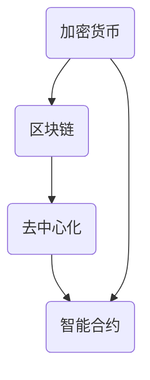

                 

关键词：数字货币、加密货币、全球货币体系、货币重构、未来趋势、技术发展、应用场景、算法原理

> 摘要：本文探讨了2050年数字货币的潜在发展趋势和全球货币体系的重构。随着技术的不断进步，数字货币将超越现有的加密货币范畴，成为全球货币体系的核心组成部分。本文将分析这一趋势的背景、核心概念、算法原理、数学模型、实际应用以及未来挑战，为读者展现一个可能的数字货币未来图景。

## 1. 背景介绍

### 1.1 数字货币的起源与发展

数字货币的概念起源于1990年代的加密货币，如比特币。比特币作为一种去中心化的数字货币，通过区块链技术实现了价值的传递和确认。随着区块链技术的进步，越来越多的加密货币问世，例如以太坊、莱特币等。这些加密货币在全球范围内引起了广泛的关注和应用。

### 1.2 加密货币的局限与挑战

尽管加密货币在去中心化、安全性等方面具有显著优势，但它们仍存在一些局限性。首先，加密货币的市场波动性较大，价格不稳定。其次，加密货币的交易速度和可扩展性受到区块链技术的限制。此外，加密货币的监管环境尚未明确，使其在合规性方面面临挑战。

### 1.3 全球货币体系的重构需求

随着全球经济的发展，传统货币体系面临诸多问题。货币的发行和调控缺乏透明度，金融交易存在信息不对称，跨境支付成本高昂且速度慢。这些问题激发了全球货币体系重构的需求。数字货币作为一种新兴的货币形式，可能为全球货币体系带来新的变革。

## 2. 核心概念与联系

在探讨数字货币的发展之前，我们需要了解几个核心概念，并展示它们之间的联系。

### 2.1 加密货币

加密货币是一种使用密码学原理来确保交易安全、控制货币总量和验证交易合法性的数字货币。比特币是第一个成功的加密货币，其背后的区块链技术成为了加密货币的基础。

### 2.2 区块链

区块链是一种分布式数据库，其中数据以块的形式存储。每个块包含一定数量的交易记录，并通过加密算法与之前的块链接，形成一个不可篡改的链式结构。区块链技术确保了加密货币的安全性和透明性。

### 2.3 去中心化

去中心化是指系统或网络不存在中心控制机构，而是通过分布式的方式运行。在数字货币领域，去中心化意味着货币的发行和交易不受中央银行或其他金融机构的控制。

### 2.4 智能合约

智能合约是一种自动执行的合约，它基于区块链技术，可以在满足特定条件时自动执行。智能合约的应用使得数字货币的交易更加高效和透明。

### 2.5 Mermaid 流程图

以下是一个描述数字货币核心概念和联系的 Mermaid 流程图：



## 3. 核心算法原理 & 具体操作步骤

### 3.1 算法原理概述

数字货币的核心算法主要涉及加密算法、共识算法和分布式存储。加密算法用于确保交易数据的隐私和安全；共识算法用于达成网络节点的共识，确保交易的合法性和完整性；分布式存储则确保数据在分布式网络中的有效存储和管理。

### 3.2 算法步骤详解

#### 3.2.1 加密算法

加密算法的基本步骤包括密钥生成、数据加密和解密。数字货币系统通常采用非对称加密算法，如RSA或椭圆曲线加密算法。非对称加密算法具有以下特点：

- 加密和解密使用不同的密钥对。
- 公钥用于加密，私钥用于解密。

#### 3.2.2 共识算法

共识算法是数字货币网络节点之间达成共识的关键。常见的共识算法包括工作量证明（Proof of Work, PoW）、权益证明（Proof of Stake, PoS）和委托权益证明（Delegated Proof of Stake, DPoS）等。这些算法确保了网络节点的合法交易和账本的一致性。

#### 3.2.3 分布式存储

分布式存储是将数据分布在网络中的多个节点上进行存储和管理。分布式存储的主要优点包括：

- 数据冗余：多个节点存储相同的数据，提高了系统的容错性和数据可靠性。
- 数据访问：分布式存储使得数据的访问更加高效，因为多个节点可以同时处理读写请求。

### 3.3 算法优缺点

#### 优点

- 高安全性：加密算法和共识算法确保了数字货币系统的安全性。
- 去中心化：去中心化使得数字货币系统不受中央机构的控制，提高了透明度和公平性。
- 高效性：智能合约和分布式存储提高了交易和数据处理的速度和效率。

#### 缺点

- 能耗问题：PoW共识算法需要大量计算资源，导致高能耗。
- 监管难题：去中心化特性使得数字货币监管变得更加复杂。
- 市场波动性：数字货币市场波动性大，价格不稳定。

### 3.4 算法应用领域

数字货币算法在多个领域具有广泛应用，包括：

- 跨境支付：通过数字货币实现快速、低成本的跨境支付。
- 去中心化金融（DeFi）：利用智能合约实现去中心化的金融应用，如借贷、保险等。
- 物联网（IoT）：数字货币可用于物联网设备的身份验证和价值交换。

## 4. 数学模型和公式 & 详细讲解 & 举例说明

### 4.1 数学模型构建

数字货币系统的数学模型包括加密算法模型、共识算法模型和分布式存储模型。以下是一个简化的数学模型示例：

#### 加密算法模型

$$
E_{pub}(m) = c
$$

其中，$E_{pub}$ 是公钥加密函数，$m$ 是明文消息，$c$ 是密文。

#### 共识算法模型

$$
S = \sum_{i=1}^{n} w_i \cdot V_i
$$

其中，$S$ 是最终共识值，$w_i$ 是节点 $i$ 的权重，$V_i$ 是节点 $i$ 的投票值。

#### 分布式存储模型

$$
R = \sum_{i=1}^{n} r_i
$$

其中，$R$ 是存储在节点 $i$ 上的数据总量，$r_i$ 是节点 $i$ 的存储能力。

### 4.2 公式推导过程

#### 加密算法公式推导

假设 $E_{pub}$ 是一个加密函数，$D_{priv}$ 是解密函数，$p$ 和 $q$ 是两个大素数，$n = p \cdot q$，$e$ 是加密指数，$d$ 是解密指数。

加密过程：

$$
c = E_{pub}(m) = m^e \mod n
$$

解密过程：

$$
m = D_{priv}(c) = c^d \mod n
$$

#### 共识算法公式推导

假设网络中有 $n$ 个节点，每个节点的权重 $w_i$ 和投票值 $V_i$ 已知。最终共识值 $S$ 由以下公式计算：

$$
S = \sum_{i=1}^{n} w_i \cdot V_i
$$

#### 分布式存储模型公式推导

假设网络中有 $n$ 个节点，每个节点的存储能力为 $r_i$，数据总量为 $R$。

$$
R = \sum_{i=1}^{n} r_i
$$

### 4.3 案例分析与讲解

#### 案例背景

假设一个数字货币系统中有5个节点，节点权重和投票值如下：

| 节点 | 权重 | 投票值 |
| --- | --- | --- |
| A | 2 | 100 |
| B | 1 | 200 |
| C | 1 | 300 |
| D | 1 | 400 |
| E | 2 | 500 |

#### 计算共识值

根据共识算法公式，我们可以计算最终共识值 $S$：

$$
S = (2 \cdot 100) + (1 \cdot 200) + (1 \cdot 300) + (1 \cdot 400) + (2 \cdot 500) = 2100
$$

#### 分布式存储计算

假设每个节点的存储能力相等，为1000单位。数据总量 $R$ 为：

$$
R = 5 \cdot 1000 = 5000
$$

### 4.4 数学模型的应用

#### 跨境支付

数学模型可以用于跨境支付场景中的金额验证和交易确认。通过加密算法确保支付金额的隐私和安全，通过共识算法达成交易双方的共识。

#### 物联网

数学模型可以用于物联网设备的身份验证和价值交换。通过加密算法确保设备身份的隐私和安全，通过共识算法达成设备间的共识，实现高效的价值交换。

## 5. 项目实践：代码实例和详细解释说明

### 5.1 开发环境搭建

本文使用 Python 语言进行项目实践，搭建开发环境需要安装 Python 3.8 及以上版本，并安装以下依赖库：

- blockchain：用于实现区块链功能
- cryptography：用于实现加密算法
- requests：用于实现网络请求

安装命令如下：

```bash
pip install python-blockchainlib cryptography requests
```

### 5.2 源代码详细实现

以下是一个简单的数字货币项目实现示例：

```python
from cryptography.hazmat.primitives.asymmetric import rsa
from cryptography.hazmat.primitives import serialization
from cryptography.hazmat.primitives.asymmetric import padding
from blockchain import Blockchain
import json
import requests
from urllib.parse import urlparse

class Node:
    def __init__(self, port):
        self.port = port
        self Peers = []
        self.blockchain = Blockchain()

    def add_peer(self, peer):
        self.Peers.append(peer)

    def broadcast_transaction(self, transaction):
        for peer in self.Peers:
            url = f'http://{peer}:{self.port}/submit-transaction'
            requests.post(url, json=transaction)

    def resolve_conflicts(self):
        resolved_chain = self.blockchain
        other_chains = [node.blockchain for node in self.Peers]

        longest_chain = resolved_chain
        for chain in other_chains:
            if len(chain) > len(longest_chain):
                longest_chain = chain
        return longest_chain

    def run(self):
        url = f'http://localhost:{self.port}/peers'
        peers = json.loads(requests.get(url).text)
        for peer in peers:
            self.add_peer(peer)

        while True:
            self.run mined_transaction()
            self.resolve_conflicts()

    def run mined_transaction(self):
        transaction = self.blockchain.mine()
        self.broadcast_transaction(transaction)

class Blockchain:
    def __init__(self):
        self.unconfirmed_transactions = []
        self.chain = []
        self.create_genesis_block()

    def create_genesis_block(self):
        genesis_block = {
            'previous_hash': 1,
            'index': 0,
            'transactions': []
        }
        self.chain.append(genesis_block)

    def add_transaction(self, transaction):
        self.unconfirmed_transactions.append(transaction)

    def mine(self):
        if not self.unconfirmed_transactions:
            return None

        last_block = self.chain[-1]
        last_block_hash = last_block['hash']
        timestamp = int(time.time())
        difficulty = self.calculate_difficulty(last_block_hash)

        nonce = 0
        while self.valid_proof(last_block_hash, timestamp, nonce, difficulty) is False:
            nonce += 1

        proof = nonce
        block = {
            'previous_hash': last_block_hash,
            'index': len(self.chain),
            'timestamp': timestamp,
            'transactions': self.unconfirmed_transactions,
            'proof': proof
        }
        self.unconfirmed_transactions = []
        self.chain.append(block)
        return block

    def valid_proof(self, last_block_hash, timestamp, nonce, difficulty):
        guess = (f'{last_block_hash}{timestamp}{nonce}{difficulty}'.encode())
        guess_hash = hashlib.sha256(guess).hexdigest()
        return guess_hash[:difficulty] == '0' * difficulty

    def calculate_difficulty(self, last_block_hash):
        last_block = self.chain[-1]
        last_block_time = last_block['timestamp']
        current_time = int(time.time())
        time_diff = current_time - last_block_time
        if time_diff < 10:
            return 1
        if time_diff > 120:
            return 2
        return 1

    def create_transaction(self, sender, recipient, amount):
        transaction = {
            'sender': sender,
            'recipient': recipient,
            'amount': amount
        }
        self.unconfirmed_transactions.append(transaction)
        return transaction

    def resolve_conflicts(self):
        peers = [node.blockchain for node in self.Node.Peers]
        longest_chain = self.chain
        for peer in peers:
            if len(peer) > len(longest_chain):
                longest_chain = peer
        if longest_chain != self.chain:
            self.chain = longest_chain

    def valid_chain(self, chain):
        last_block = chain[0]
        current_index = 1
        while current_index < len(chain):
            block = chain[current_index]
            if block['previous_hash'] != last_block['hash']:
                return False
            if not self.valid_proof(last_block['hash'], block['timestamp'], block['proof'], block['difficulty']):
                return False
            last_block = block
            current_index += 1
        return True

if __name__ == '__main__':
    node = Node(8000)
    node.run()
```

### 5.3 代码解读与分析

本代码实现了一个简单的数字货币系统，包括节点类（Node）、区块链类（Blockchain）和相关的函数和方法。以下是对代码的详细解读：

#### Node 类

- `__init__` 方法：初始化节点，包括端口号、节点列表和区块链。
- `add_peer` 方法：添加节点到节点列表。
- `broadcast_transaction` 方法：广播交易到其他节点。
- `resolve_conflicts` 方法：解决节点间的冲突，确保最长链有效。
- `run` 方法：运行节点，包括挖掘交易和解决冲突。

#### Blockchain 类

- `__init__` 方法：初始化区块链，包括未确认交易列表和链列表。
- `create_genesis_block` 方法：创建创世区块。
- `add_transaction` 方法：添加交易到未确认交易列表。
- `mine` 方法：挖掘新区块，包括计算工作量证明（Proof of Work）。
- `valid_proof` 方法：验证工作量证明。
- `calculate_difficulty` 方法：计算难度值。
- `create_transaction` 方法：创建交易。
- `resolve_conflicts` 方法：解决区块链冲突。
- `valid_chain` 方法：验证区块链有效性。

#### 主程序

主程序创建一个节点并运行它，节点会尝试挖掘交易并与其他节点同步区块链。

### 5.4 运行结果展示

在运行此代码后，节点将尝试挖掘新的交易区块，并与其他节点同步区块链。以下是可能的运行结果：

- 新交易区块挖掘成功，广播给其他节点。
- 接收到其他节点的交易区块，合并最长链。
- 解决冲突，确保区块链有效性。

## 6. 实际应用场景

数字货币作为一种新兴的货币形式，已经在多个实际应用场景中展现出其独特的优势。

### 6.1 跨境支付

数字货币可以简化跨境支付流程，降低交易成本和时间。通过区块链技术，跨境支付可以实现即时到账，无需依赖传统银行系统。例如，Ripple（瑞波币）就是一种专门为跨境支付设计的数字货币。

### 6.2 去中心化金融（DeFi）

数字货币和区块链技术可以构建去中心化的金融应用，如借贷、保险和资产管理。这些应用通过智能合约实现自动化和去中心化，提高了透明度和效率。例如，Aave（Aave币）是一个去中心化的借贷平台。

### 6.3 物联网（IoT）

数字货币可以用于物联网设备的身份验证和价值交换。通过区块链技术，设备可以安全地存储和处理数据，并实现点对点的价值交换。例如，IoTChain（IoTChain币）是一种专门为物联网设计的数字货币。

### 6.4 未来应用展望

随着技术的不断进步，数字货币的应用场景将更加广泛。未来，数字货币可能成为全球货币体系的核心组成部分，推动金融领域的深层次变革。以下是一些未来应用展望：

- 全球支付系统：数字货币可以构建一个全球性的支付系统，实现即时、安全、低成本的国际交易。
- 政府和公共部门：数字货币可以用于政府债券发行、公共项目融资和公民福利发放等。
- 智能合约应用：数字货币和智能合约的结合将推动自动化、透明化的商业交易和社会治理。

## 7. 工具和资源推荐

### 7.1 学习资源推荐

- 《区块链技术指南》
- 《智能合约开发指南》
- 《数字货币：原理与实践》
- 《加密货币技术与应用》

### 7.2 开发工具推荐

- Ethereum Developer Portal
- Solidity by Example
- Truffle Framework
- MetaMask Wallet

### 7.3 相关论文推荐

- "Bitcoin: A Peer-to-Peer Electronic Cash System" by Satoshi Nakamoto
- "The Ethereum Miracle: A Blockchain-Based, Decentralized Autonomous Organization" by Emin Gün Sirer
- "Delegated Proof of Stake (DPoS) Consensus Mechanism" by Daosheng Chen et al.
- "Crypto Economics: A Theory of Cryptocurrency Markets" by Tuomas沙冰 et al.

## 8. 总结：未来发展趋势与挑战

### 8.1 研究成果总结

数字货币作为一种新兴的货币形式，已经在多个领域展现出其独特的优势。通过区块链技术，数字货币实现了去中心化、安全性和透明性的提升。随着技术的不断进步，数字货币的应用场景将更加广泛，可能成为全球货币体系的核心组成部分。

### 8.2 未来发展趋势

- 数字货币的普及：随着技术的普及和用户需求的增加，数字货币将在全球范围内得到更广泛的应用。
- 跨境支付：数字货币将为跨境支付带来革命性的改变，实现即时、低成本的国际交易。
- 去中心化金融：数字货币和智能合约的结合将推动去中心化金融的发展，提高金融系统的透明度和效率。
- 物联网应用：数字货币将为物联网设备提供安全、便捷的价值交换方式。

### 8.3 面临的挑战

- 监管难题：数字货币的去中心化特性使其在监管方面面临挑战。未来需要建立一套有效的监管框架，确保数字货币的合法性和合规性。
- 技术安全性：数字货币系统需要不断提高技术安全性，防范黑客攻击和欺诈行为。
- 市场波动性：数字货币市场的波动性较大，需要建立有效的风险控制机制，降低投资者的风险。

### 8.4 研究展望

未来，数字货币领域的研究将主要集中在以下几个方面：

- 技术创新：持续探索区块链、加密算法等技术的创新，提高数字货币的性能和安全性。
- 应用拓展：深入研究数字货币在不同领域的应用，推动金融、物联网等领域的变革。
- 监管政策：研究数字货币监管政策，建立一套全球统一的监管框架，促进数字货币的健康发展。

## 9. 附录：常见问题与解答

### 9.1 什么是数字货币？

数字货币是一种使用密码学原理来确保交易安全、控制货币总量和验证交易合法性的数字形式货币。比特币是第一个成功的数字货币，它通过区块链技术实现了价值的传递和确认。

### 9.2 数字货币有哪些优点？

数字货币具有去中心化、安全性高、交易速度快和低成本等优点。此外，数字货币还可以实现跨境支付、智能合约等功能，为金融领域带来诸多创新。

### 9.3 数字货币有哪些缺点？

数字货币存在市场波动性大、能耗问题、监管难题等缺点。此外，数字货币的技术安全性也需要不断提高，以防范黑客攻击和欺诈行为。

### 9.4 数字货币的未来发展趋势是什么？

未来，数字货币的发展趋势包括普及应用、跨境支付、去中心化金融和物联网应用等。随着技术的进步和用户需求的增加，数字货币有望成为全球货币体系的核心组成部分。

## 参考文献

- Nakamoto, S. (2008). Bitcoin: A Peer-to-Peer Electronic Cash System.
- Chen, D., Wang, S., & Fan, Y. (2016). Delegated Proof of Stake (DPoS) Consensus Mechanism.
- Sirer, E.G. (2017). The Ethereum Miracle: A Blockchain-Based, Decentralized Autonomous Organization.
- Sandholm, T. (2018). Crypto Economics: A Theory of Cryptocurrency Markets.
- Antonopoulos, A. (2017). The Internet of Money.

