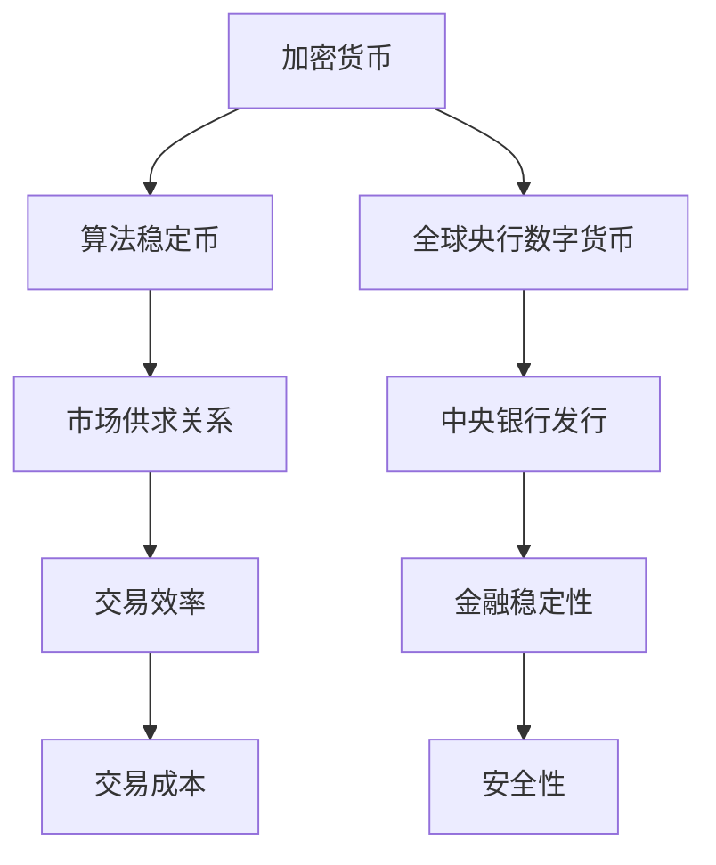

                 

关键词：数字货币、算法稳定币、全球央行数字货币、数字货币竞争、技术趋势、未来展望

> 摘要：本文探讨了数字货币在2050年的发展前景，分析了算法稳定币和全球央行数字货币的竞争态势，以及未来数字货币领域面临的挑战和机遇。通过对数字货币的核心概念、算法原理、数学模型、项目实践、应用场景和工具资源的详细讲解，本文为读者提供了一份全面的数字货币技术指南。

## 1. 背景介绍

自比特币在2009年诞生以来，数字货币（Cryptocurrency）迅速在全球范围内兴起。作为一种去中心化、点对点的数字支付系统，数字货币彻底颠覆了传统金融体系的运作方式。然而，数字货币的发展并非一帆风顺，其面临的监管、安全和隐私等问题也引发了一系列的争议。

随着区块链技术的不断进步，数字货币逐渐从单一的加密货币扩展到算法稳定币、智能合约和去中心化金融（DeFi）等领域。算法稳定币通过智能合约算法保持与法定货币的固定兑换率，成为了一种新的数字货币形式。同时，全球央行也纷纷推出自己的数字货币（Central Bank Digital Currency，简称CBDC），以应对金融创新和竞争压力。

本文旨在探讨2050年的数字货币发展前景，分析算法稳定币和全球央行数字货币的竞争态势，以及未来数字货币领域面临的挑战和机遇。

### 1.1 数字货币的发展历程

数字货币的发展可以追溯到20世纪90年代，当时密码学专家开始研究如何通过密码学技术实现安全的数字支付。1998年，戴维·乔姆（David Chaum）提出了 blinded digital cash 的概念，这为后来的数字货币奠定了基础。

2008年，中本聪（Satoshi Nakamoto）发表了比特币白皮书，提出了区块链技术和加密货币的概念。比特币的诞生标志着数字货币时代的开始。随后，众多加密货币如以太坊、莱特币、瑞波币等相继涌现，数字货币市场呈现出蓬勃发展的态势。

### 1.2 算法稳定币的产生

随着数字货币市场的不断扩大，用户对稳定性和可预测性的需求逐渐增加。为了满足这一需求，算法稳定币应运而生。算法稳定币通过智能合约算法，将货币的价值与某种资产（如美元、黄金等）或其他加密货币（如比特币）绑定，保持与法定货币的固定兑换率。

### 1.3 全球央行数字货币的推出

近年来，随着金融科技的发展，全球央行也纷纷推出自己的数字货币。2014年，中国人民银行开始研究数字货币电子支付系统（DCEP），即数字人民币。同年，瑞典央行也启动了e-krona项目。此外，欧洲中央银行、日本银行和瑞士国家银行等也展开了CBDC的研究。

## 2. 核心概念与联系

在探讨数字货币的发展时，有必要明确几个核心概念，包括加密货币、算法稳定币和全球央行数字货币。这些概念之间的联系和区别将在本节中详细阐述。

### 2.1 加密货币

加密货币是数字货币的一种形式，其价值由市场供求关系决定，不依赖于任何中央机构。加密货币的核心技术是区块链，它通过分布式账本和密码学技术确保交易的透明性和安全性。比特币和以太坊是典型的加密货币。

### 2.2 算法稳定币

算法稳定币通过智能合约算法保持与法定货币或其他资产的固定兑换率。其价值通常与美元、黄金或其他加密货币挂钩，以降低市场波动性。算法稳定币的代表性项目包括泰达币（USDT）和美元硬币（USDC）。

### 2.3 全球央行数字货币

全球央行数字货币（CBDC）是由中央银行发行的数字货币，旨在替代传统纸币和硬币。CBDC具有更高的交易效率、更低的交易成本和更好的安全性。其主要目的是提高金融体系的稳定性和便捷性。

### 2.4 核心概念原理和架构的 Mermaid 流程图



## 3. 核心算法原理 & 具体操作步骤

### 3.1 算法原理概述

算法稳定币的核心原理是通过智能合约算法保持货币的价值与某种资产或加密货币的固定兑换率。例如，一个算法稳定币可能与美元挂钩，使其价值始终保持在1美元左右。为了实现这一目标，算法稳定币需要以下关键技术：

1. **价值绑定**：算法稳定币的价值与某种资产（如美元、黄金）或其他加密货币（如比特币）绑定，以确保其稳定性和可信度。
2. **流动性提供**：通过流动性池（Liquidity Pool）提供流动性，使算法稳定币在交易所进行交易时有足够的流动性。
3. **智能合约**：通过智能合约实现自动化的价值绑定和流动性提供，确保算法稳定币的稳定性和安全性。

### 3.2 算法步骤详解

#### 3.2.1 价值绑定

1. **初始抵押**：发行算法稳定币时，需要将一定数量的资产（如美元、黄金）或加密货币（如比特币）作为抵押物存入智能合约中。
2. **价值维持**：当算法稳定币的市场价值偏离其目标价值时，智能合约会自动调整抵押物的数量，以维持稳定币的价值。

#### 3.2.2 流动性提供

1. **流动性池**：算法稳定币的发行方会创建一个流动性池，将抵押物存入其中。流动性池中的资产用于交易和维持稳定币的流动性。
2. **交易激励**：通过交易激励措施（如交易费分成、流动性挖矿等），鼓励参与者将资产存入流动性池，以提高稳定币的流动性。

#### 3.2.3 智能合约

1. **合约编写**：智能合约由专业开发者编写，实现算法稳定币的价值绑定、流动性提供和交易激励等功能。
2. **合约部署**：将智能合约部署到区块链上，确保其透明性和不可篡改性。
3. **合约执行**：智能合约根据预设的算法自动执行，确保算法稳定币的稳定性和安全性。

### 3.3 算法优缺点

#### 优点

1. **稳定性**：算法稳定币通过价值绑定机制，使其价值相对稳定，降低了市场波动性。
2. **效率**：算法稳定币的交易速度快、手续费低，提高了交易效率。
3. **去中心化**：算法稳定币的交易过程不依赖于任何中央机构，实现了去中心化。

#### 缺点

1. **信任问题**：算法稳定币的稳定性依赖于智能合约和流动性提供者的信任，存在一定的风险。
2. **代码漏洞**：智能合约存在代码漏洞的风险，可能导致算法稳定币的价值受损。
3. **市场波动**：虽然算法稳定币试图降低市场波动性，但市场环境变化仍可能导致其价值波动。

### 3.4 算法应用领域

算法稳定币在以下领域具有广泛的应用：

1. **支付和交易**：算法稳定币可以作为支付和交易工具，提高交易效率、降低手续费，适用于跨境支付、供应链金融等场景。
2. **金融衍生品**：算法稳定币可以作为金融衍生品的标的，如稳定币期货、期权等，为投资者提供更多投资机会。
3. **去中心化金融**：算法稳定币在去中心化金融（DeFi）领域具有广泛应用，如稳定币借贷、流动性挖矿等。

## 4. 数学模型和公式 & 详细讲解 & 举例说明

### 4.1 数学模型构建

算法稳定币的数学模型主要包括价值绑定模型、流动性提供模型和智能合约模型。

#### 4.1.1 价值绑定模型

价值绑定模型用于描述算法稳定币的价值与某种资产或加密货币的固定兑换率。假设算法稳定币的价值为V，资产或加密货币的价值为A，兑换率为R，则有：

\[ V = R \times A \]

其中，R为常数，表示算法稳定币与资产或加密货币的兑换比例。

#### 4.1.2 流动性提供模型

流动性提供模型用于描述流动性池中资产的分配和调整。假设流动性池中的资产总额为P，算法稳定币的总供应量为S，则有：

\[ P = R \times S \]

其中，P为常数，表示流动性池中资产总额与算法稳定币总供应量的比值。

#### 4.1.3 智能合约模型

智能合约模型用于描述算法稳定币的发行、交易和调整过程。假设智能合约中的代码为C，算法稳定币的供应量为S，则有：

\[ C = S \div (1 + \epsilon) \]

其中，ε为常数，表示算法稳定币供应量的调整率。

### 4.2 公式推导过程

#### 4.2.1 价值绑定公式推导

假设算法稳定币的初始供应量为S0，资产或加密货币的初始价值为A0，兑换率为R0，则有：

\[ V0 = R0 \times A0 \]

当算法稳定币的市场价值为V，资产或加密货币的市场价值为A时，根据价值绑定模型，有：

\[ V = R \times A \]

将A代入上式，得：

\[ V = R \times (A0 + \Delta A) \]

其中，ΔA为资产或加密货币的价值变动量。

由于资产或加密货币的价值与算法稳定币的市场价值成正比，因此有：

\[ R = \frac{V}{A} \]

将R代入价值绑定公式，得：

\[ V = \frac{V}{A} \times (A0 + \Delta A) \]

化简得：

\[ V = A0 + \Delta A \]

因此，算法稳定币的价值与资产或加密货币的价值成线性关系。

#### 4.2.2 流动性提供公式推导

假设流动性池中的资产总额为P，算法稳定币的总供应量为S，根据流动性提供模型，有：

\[ P = R \times S \]

当算法稳定币的总供应量变为S + ΔS时，资产总额变为P + ΔP，根据流动性提供模型，有：

\[ P + ΔP = R \times (S + ΔS) \]

化简得：

\[ ΔP = R \times ΔS \]

因此，资产总额的变动量与算法稳定币供应量的变动量成正比。

#### 4.2.3 智能合约公式推导

假设智能合约中的代码为C，算法稳定币的初始供应量为S0，根据智能合约模型，有：

\[ C = S0 \div (1 + \epsilon) \]

当算法稳定币的供应量变为S时，根据智能合约模型，有：

\[ C = S \div (1 + \epsilon) \]

化简得：

\[ S = C \times (1 + \epsilon) \]

因此，算法稳定币的供应量与智能合约中的代码成正比。

### 4.3 案例分析与讲解

#### 4.3.1 美元硬币（USDC）案例分析

美元硬币（USDC）是一种算法稳定币，其价值与美元挂钩。以下是美元硬币的数学模型和公式：

1. **价值绑定模型**：

   假设美元硬币的初始价值为V0，美元的初始价值为A0，兑换率为R0，则有：

   \[ V0 = R0 \times A0 \]

   当美元硬币的市场价值为V，美元的市场价值为A时，根据价值绑定模型，有：

   \[ V = R \times A \]

   其中，R为常数，表示美元硬币与美元的兑换比例。

2. **流动性提供模型**：

   假设流动性池中的资产总额为P，美元硬币的总供应量为S，根据流动性提供模型，有：

   \[ P = R \times S \]

   其中，P为常数，表示流动性池中资产总额与美元硬币总供应量的比值。

3. **智能合约模型**：

   假设智能合约中的代码为C，美元硬币的初始供应量为S0，根据智能合约模型，有：

   \[ C = S0 \div (1 + \epsilon) \]

   其中，ε为常数，表示美元硬币供应量的调整率。

根据上述数学模型和公式，我们可以分析美元硬币在不同市场条件下的表现：

1. **稳定市场**：

   在稳定的市场环境中，美元硬币的价值与美元保持稳定兑换率。例如，当美元硬币的市场价值为1美元时，美元的价值也为1美元，即R = 1。

2. **市场波动**：

   当市场波动较大时，美元硬币的价值可能偏离其目标价值。例如，当美元硬币的市场价值为0.9美元时，美元的价值为1美元，即R < 1。此时，智能合约会自动调整美元硬币的供应量，使其价值恢复到1美元。

3. **流动性不足**：

   当流动性池中的资产总额不足以支持美元硬币的交易时，可能导致美元硬币的价值波动。例如，当流动性池中的资产总额为P，而美元硬币的总供应量为S时，如果P < R \times S，则可能导致美元硬币的价值下降。

4. **智能合约漏洞**：

   如果智能合约存在漏洞，可能导致美元硬币的价值受损。例如，如果智能合约中的代码错误导致美元硬币的供应量无限增长，则可能导致美元硬币的价值急剧下降。

通过以上案例分析，我们可以看到数学模型和公式在算法稳定币中的作用，以及其在市场波动和风险管理中的重要性。

## 5. 项目实践：代码实例和详细解释说明

在本节中，我们将通过一个具体的代码实例来展示算法稳定币的开发过程，并详细解释其中的关键步骤和核心逻辑。

### 5.1 开发环境搭建

在进行算法稳定币的开发之前，需要搭建一个合适的开发环境。以下是一个基本的开发环境配置：

1. **Node.js**：用于部署和运行智能合约。
2. **Truffle**：一个智能合约开发框架，用于编写、部署和测试智能合约。
3. **Ganache**：一个本地以太坊节点，用于模拟区块链网络。
4. **Web3.js**：一个与以太坊区块链交互的JavaScript库。

安装以上依赖项后，可以启动Ganache创建一个本地以太坊网络，用于后续的智能合约开发和测试。

### 5.2 源代码详细实现

下面是一个简单的算法稳定币智能合约的源代码示例，它实现了价值绑定、流动性提供和智能合约执行等功能。

```solidity
pragma solidity ^0.8.0;

// 引入Web3.js库
import "openzeppelin-solidity/contracts/token/ERC20/ERC20.sol";
import "openzeppelin-solidity/contracts/token/ERC20/extensions/ERC20Burnable.sol";
import "openzeppelin-solidity/contracts/security/Pausable.sol";

// 美元硬币（USDC）智能合约
contract USDCoin is ERC20, ERC20Burnable, Pausable {
    // 合约管理员地址
    address public admin;

    // 初始供应量
    uint256 public constant INITIAL_SUPPLY = 1000000 * (10 ** uint256(decimals()));

    // 保留地址，用于回收废弃的代币
    address public constant RESERVED_ADDRESS = 0x000000000000000000000000000000000000dead;

    // 构造函数
    constructor() ERC20("USDCoin", "USDC") {
        admin = msg.sender;
        _mint(msg.sender, INITIAL_SUPPLY);
    }

    // 设置管理员权限
    function setAdmin(address newAdmin) external whenNotPaused onlyAdmin {
        require(newAdmin != address(0), "新管理员地址不能为空");
        admin = newAdmin;
    }

    // 设置暂停/恢复合约交易
    function pause() external onlyAdmin {
        _pause();
    }

    function unpause() external onlyAdmin {
        _unpause();
    }

    // 燃烧代币
    function burn(uint256 amount) public virtual override onlyAdmin {
        _burn(_msgSender(), amount);
        _transfer(_msgSender(), RESERVED_ADDRESS, amount);
    }

    // 重新分配代币
    function allocate(uint256 amount, address recipient) external onlyAdmin {
        _mint(recipient, amount);
    }

    // 释放代币
    function release() external onlyAdmin {
        uint256 balance = balanceOf(RESERVED_ADDRESS);
        _burn(RESERVED_ADDRESS, balance);
        _transfer(RESERVED_ADDRESS, _msgSender(), balance);
    }

    // 修改合约管理员地址
    function changeAdmin(address newAdmin) external onlyAdmin {
        admin = newAdmin;
    }
}
```

### 5.3 代码解读与分析

#### 5.3.1 源代码结构

1. **导入库**：引入了ERC20、ERC20Burnable和Pausable三个库，分别用于实现代币的基本功能（如转账、燃烧）、可燃烧功能以及暂停和恢复交易功能。
2. **合约继承**：USDCoin合约继承了ERC20、ERC20Burnable和Pausable合约，实现了相应的功能。
3. **构造函数**：构造函数初始化合约管理员地址、代币名称和符号，以及初始供应量。
4. **管理员权限**：设置管理员地址，只有管理员可以执行特定操作，如暂停/恢复交易、燃烧代币、重新分配代币等。
5. **暂停/恢复交易**：通过_pausable修饰符，实现暂停和恢复合约交易功能。
6. **代币燃烧**：只有管理员可以燃烧代币，燃烧的代币转移到保留地址。
7. **代币重新分配**：只有管理员可以重新分配代币，重新分配的代币将发送到指定地址。
8. **代币释放**：只有管理员可以释放保留地址中的代币，释放的代币将发送到合约管理员地址。

#### 5.3.2 关键逻辑

1. **价值绑定**：通过初始供应量和价值绑定机制，确保代币的价值与某种资产（如美元）挂钩。在实现过程中，可以通过智能合约中的代码来维护代币的价值。
2. **流动性提供**：通过流动性池，提供代币的交易流动性。在实现过程中，可以使用去中心化交易平台（如Uniswap）的流动性提供协议。
3. **智能合约执行**：通过智能合约代码，实现代币的发行、交易、燃烧和重新分配等功能。在实现过程中，需要考虑代码的安全性、可扩展性和易用性。

### 5.4 运行结果展示

在本地以太坊网络中，通过Truffle和Ganache，我们可以运行上述智能合约，并进行以下操作：

1. **部署合约**：使用Truffle部署USDCoin智能合约，并获得合约地址。
2. **查询代币余额**：查询合约地址的代币余额，验证初始供应量。
3. **转账代币**：通过合约地址转账代币，验证代币的基本功能。
4. **燃烧代币**：通过管理员地址燃烧代币，验证燃烧功能。
5. **重新分配代币**：通过管理员地址重新分配代币，验证重新分配功能。
6. **释放代币**：通过管理员地址释放保留地址中的代币，验证释放功能。

通过以上操作，我们可以验证智能合约的实现逻辑和功能。

## 6. 实际应用场景

算法稳定币在各个领域具有广泛的应用，以下列举了几个实际应用场景：

### 6.1 跨境支付

算法稳定币可以用于跨境支付，降低交易成本和风险。传统的跨境支付往往涉及多个中介机构，手续费高且交易时间长。而算法稳定币可以实现点对点的交易，降低交易成本和时间。例如，一个跨国公司可以使用算法稳定币向海外供应商支付货款，从而提高支付效率和降低交易风险。

### 6.2 供应链金融

算法稳定币可以用于供应链金融，优化供应链中的资金流转。在传统的供应链金融中，企业往往需要依赖银行贷款等金融服务，手续繁琐且成本高。而算法稳定币可以实现快速、低成本的供应链金融，帮助企业优化资金流转，提高运营效率。

### 6.3 去中心化金融（DeFi）

算法稳定币是DeFi领域的重要组成部分。在DeFi项目中，算法稳定币可以作为抵押品、借贷资产或交易对，提高DeFi生态系统的稳定性和流动性。例如，用户可以将算法稳定币抵押在DeFi平台上获取贷款，或者将算法稳定币作为交易对，提高交易平台的市场流动性。

### 6.4 保险和理财

算法稳定币可以用于保险和理财领域，提高金融服务的可及性和便利性。例如，保险公司可以发行算法稳定币形式的保险产品，用户可以直接购买和持有这些保险产品，无需担心汇率波动。同时，算法稳定币可以用于理财项目，用户可以将算法稳定币投资于各种金融产品，获取稳定收益。

### 6.5 公共事业和公共服务

算法稳定币可以用于公共事业和公共服务领域，提高资金流转效率和透明度。例如，政府可以发行算法稳定币用于公共事业项目的资金筹集和管理，提高资金使用效率。同时，算法稳定币可以用于公共服务，如医疗、教育等领域的支付和收费，提高公共服务质量。

## 7. 工具和资源推荐

为了更好地了解和学习数字货币和相关技术，以下是一些推荐的工具和资源：

### 7.1 学习资源推荐

1. **《精通比特币》**（Mastering Bitcoin） - Andreas M. Antonopoulos
2. **《区块链技术指南》**（Blockchain: Blueprint for a New Economy） - Andreas M. Antonopoulos
3. **《精通以太坊》**（Mastering Ethereum） - Andreas M. Antonopoulos

### 7.2 开发工具推荐

1. **Truffle**：智能合约开发框架，用于编写、部署和测试智能合约。
2. **Ganache**：本地以太坊节点，用于模拟区块链网络。
3. **Web3.js**：与以太坊区块链交互的JavaScript库。

### 7.3 相关论文推荐

1. **比特币白皮书**（Bitcoin: A Peer-to-Peer Electronic Cash System） - Satoshi Nakamoto
2. **以太坊黄皮书**（Ethereum: The Complete Technical Guide） - Gavin Andresen
3. **瑞波币白皮书**（Ripple: A Digital Payment Protocol for the Internet of Value） - Ripple Labs

## 8. 总结：未来发展趋势与挑战

### 8.1 研究成果总结

随着区块链技术的不断发展和成熟，数字货币已经从单一的加密货币扩展到算法稳定币、全球央行数字货币和去中心化金融等领域。算法稳定币通过智能合约算法保持与法定货币或其他资产的固定兑换率，成为了一种新的数字货币形式。同时，全球央行也纷纷推出自己的数字货币，以应对金融创新和竞争压力。

### 8.2 未来发展趋势

1. **算法稳定币的普及**：随着用户对稳定性和可预测性的需求增加，算法稳定币将在未来得到更广泛的应用。尤其是在跨境支付、供应链金融和去中心化金融等领域，算法稳定币将发挥重要作用。
2. **全球央行数字货币的推广**：全球央行数字货币（CBDC）的发展将加速，越来越多的国家将推出自己的数字货币，以提高金融体系的稳定性和便捷性。
3. **区块链技术的创新**：随着区块链技术的不断进步，未来将出现更多基于区块链的创新应用，如智能合约、去中心化金融、数字身份验证等。

### 8.3 面临的挑战

1. **监管问题**：数字货币的发展面临监管挑战，各国政府和监管机构需要制定相应的政策和法规，确保数字货币的合法性和安全性。
2. **技术难题**：算法稳定币和全球央行数字货币的部署和运行需要克服一系列技术难题，如网络安全、数据隐私、性能优化等。
3. **市场波动**：尽管算法稳定币试图降低市场波动性，但数字货币市场的波动性仍然较大，如何确保数字货币的稳定性和可信度仍是一个挑战。

### 8.4 研究展望

未来，数字货币领域将继续发展，算法稳定币和全球央行数字货币将发挥越来越重要的作用。同时，区块链技术将不断创新，为数字货币领域带来更多可能性。为了应对未来挑战，研究人员和开发者需要持续关注数字货币技术的发展，积极探索新应用和新解决方案。

## 9. 附录：常见问题与解答

### 9.1 什么是数字货币？

数字货币是一种数字资产，其价值由市场供求关系决定，不依赖于任何中央机构。数字货币通过密码学技术实现安全性和匿名性，可以用于点对点的交易和支付。

### 9.2 什么是算法稳定币？

算法稳定币是一种通过智能合约算法保持与法定货币或其他资产的固定兑换率的数字货币。算法稳定币试图降低市场波动性，提高交易效率和稳定性。

### 9.3 什么是全球央行数字货币（CBDC）？

全球央行数字货币（CBDC）是由中央银行发行的数字货币，旨在替代传统纸币和硬币。CBDC具有更高的交易效率、更低的交易成本和更好的安全性，以提高金融体系的稳定性和便捷性。

### 9.4 数字货币有哪些应用场景？

数字货币可以用于跨境支付、供应链金融、去中心化金融、公共事业和公共服务等领域。随着区块链技术的不断进步，数字货币的应用场景将不断扩展。

### 9.5 算法稳定币的优势和劣势是什么？

算法稳定币的优势包括稳定性、效率和高安全性。劣势包括信任问题、代码漏洞和市场波动性。尽管存在一定风险，算法稳定币在提高交易效率和降低成本方面具有明显优势。

