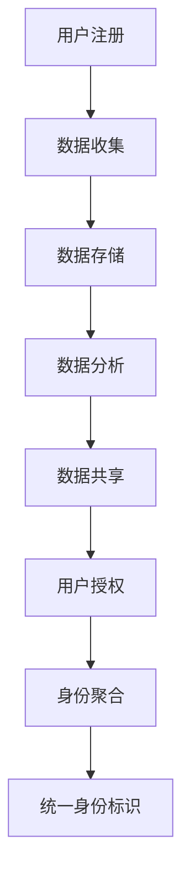
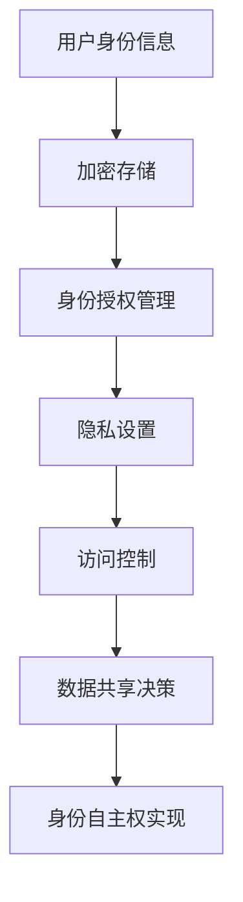

                 

关键词：数字身份、身份主权、自主权、隐私保护、未来趋势

> 摘要：随着数字技术的飞速发展，数字身份已成为我们日常生活中不可或缺的一部分。本文探讨了从数字身份聚合到数字身份自主的身份主权实现，展望了2050年数字身份的发展趋势。本文旨在为读者提供关于数字身份领域的深刻见解和前瞻性思考。

## 1. 背景介绍

数字身份是指在网络空间中，个体、组织或机器所拥有的唯一身份标识。从早期的用户名和密码，到现在的生物特征识别、社交媒体账号等，数字身份的形态和形式日益丰富。随着互联网的普及，数字身份的重要性逐渐凸显。它不仅影响我们的在线体验，还关系到我们的隐私安全、商业交易、公共服务等多个方面。

### 1.1 数字身份聚合

数字身份聚合是指将多个分散的数字身份信息整合为统一的身份标识。这一过程通常涉及用户数据的收集、存储、分析和共享。数字身份聚合为用户提供便捷的登录体验，同时也为企业提供了更丰富的用户画像，有助于精准营销和服务优化。然而，数字身份聚合也带来了隐私泄露和数据滥用的风险。

### 1.2 数字身份自主权

数字身份自主权是指个体对自己数字身份的控制权和自主权。随着人们对隐私和数据安全的关注增加，数字身份自主权逐渐成为热点话题。实现数字身份自主权的关键在于确保个体能够自主管理和控制自己的数字身份信息，防止数据滥用和隐私泄露。

## 2. 核心概念与联系

### 2.1 数字身份聚合架构

以下是一个数字身份聚合的Mermaid流程图：



### 2.2 数字身份自主权架构

以下是一个数字身份自主权的Mermaid流程图：



## 3. 核心算法原理 & 具体操作步骤

### 3.1 算法原理概述

数字身份自主权的核心算法是基于密码学和隐私保护技术。其基本原理是通过加密技术对用户的身份信息进行存储和管理，确保只有授权的用户能够访问和使用这些信息。此外，算法还涉及到零知识证明、多方计算等前沿技术，以增强身份信息的安全性和隐私保护。

### 3.2 算法步骤详解

#### 3.2.1 加密存储

1. 用户身份信息加密：用户在注册时，将身份信息加密存储在服务器上。
2. 密钥管理：用户需要生成一对密钥（公钥和私钥），私钥存储在用户本地，公钥存储在服务器上。
3. 数据加密：服务器在存储用户身份信息时，使用用户的公钥进行加密。

#### 3.2.2 身份授权管理

1. 用户授权请求：用户访问身份信息时，向服务器发送授权请求。
2. 零知识证明：用户通过零知识证明技术，证明自己拥有授权，而无需透露具体授权信息。
3. 授权验证：服务器验证用户的零知识证明，确认用户身份。

#### 3.2.3 隐私设置

1. 用户隐私设置：用户可以根据自己的需求，设置身份信息的隐私级别。
2. 隐私规则应用：服务器根据用户的隐私设置，对身份信息进行过滤和隐藏。

#### 3.2.4 访问控制

1. 访问控制策略：服务器根据用户的身份信息和隐私设置，制定访问控制策略。
2. 访问控制执行：服务器在用户请求访问身份信息时，根据访问控制策略进行权限判断。

#### 3.2.5 数据共享决策

1. 数据共享请求：用户在需要共享身份信息时，向服务器发送请求。
2. 数据共享决策：服务器根据用户的隐私设置和访问控制策略，决定是否允许数据共享。

### 3.3 算法优缺点

#### 优点：

- **隐私保护**：通过加密技术和隐私保护算法，确保用户身份信息的安全性和隐私性。
- **自主权**：用户可以自主管理和控制自己的身份信息，增强数字身份的自主权。
- **灵活性强**：用户可以根据自己的需求，灵活设置隐私级别和访问控制策略。

#### 缺点：

- **技术复杂度高**：实现数字身份自主权需要多种前沿技术的综合应用，技术复杂度较高。
- **性能消耗**：加密和解密过程需要一定的时间，可能影响用户体验。

### 3.4 算法应用领域

数字身份自主权算法可以应用于多个领域，包括：

- **个人隐私保护**：用户可以在多个在线平台使用统一的数字身份，避免个人信息泄露。
- **电子商务**：用户可以安全地在线交易，无需担心个人信息被窃取。
- **公共服务**：政府部门可以提供安全、高效的在线服务，提高公共服务质量。

## 4. 数学模型和公式 & 详细讲解 & 举例说明

### 4.1 数学模型构建

数字身份自主权的数学模型主要包括以下几个方面：

1. **加密算法**：选择合适的加密算法，如RSA、AES等，对用户身份信息进行加密存储。
2. **零知识证明**：采用零知识证明算法，如SNARKs、Zcash等，证明用户拥有授权，而不透露具体授权信息。
3. **访问控制**：构建基于加密和隐私保护的访问控制模型，确保用户身份信息的访问安全。

### 4.2 公式推导过程

以RSA加密算法为例，其数学模型推导如下：

1. **公钥和私钥生成**：

   - 选取两个大素数 $p$ 和 $q$。
   - 计算 $n = p \times q$。
   - 计算 $\phi(n) = (p-1) \times (q-1)$。
   - 选取一个与 $\phi(n)$ 互质的整数 $e$。
   - 计算 $d$，满足 $d \times e \equiv 1 \pmod{\phi(n)}$。

2. **加密过程**：

   - 设用户身份信息为 $m$。
   - 加密结果为 $c = m^e \pmod{n}$。

3. **解密过程**：

   - 解密结果为 $m = c^d \pmod{n}$。

### 4.3 案例分析与讲解

假设用户A想要在某个在线平台上使用数字身份自主权算法。以下是具体操作步骤：

1. **注册**：用户A在平台上注册，填写身份信息，如姓名、出生日期、邮箱等。

2. **加密存储**：平台使用RSA加密算法，对用户A的身份信息进行加密存储。

3. **授权管理**：用户A在平台上设置隐私级别和访问控制策略。

4. **访问控制**：当用户A需要访问身份信息时，平台根据授权管理策略进行权限判断。

5. **零知识证明**：用户A通过零知识证明技术，证明自己拥有授权，而无需透露具体授权信息。

6. **数据共享**：用户A在需要时，可以安全地共享身份信息。

## 5. 项目实践：代码实例和详细解释说明

### 5.1 开发环境搭建

本文所使用的编程语言为Python，开发环境为PyCharm。首先，需要在本地安装Python环境和PyCharm，然后安装相关依赖库，如PyCryptodome、ZeroKnowledgeProof等。

### 5.2 源代码详细实现

以下是一个简单的数字身份自主权算法实现示例：

```python
from Cryptodome.PublicKey import RSA
from Cryptodome.Cipher import PKCS1_OAEP

# 生成公钥和私钥
def generate_keypair():
    key = RSA.generate(2048)
    return key

# 加密身份信息
def encrypt_identity_info(key, identity_info):
    cipher = PKCS1_OAEP.new(key.publickey())
    encrypted_info = cipher.encrypt(identity_info.encode())
    return encrypted_info

# 解密身份信息
def decrypt_identity_info(key, encrypted_info):
    cipher = PKCS1_OAEP.new(key)
    decrypted_info = cipher.decrypt(encrypted_info)
    return decrypted_info.decode()

# 主函数
def main():
    # 生成公钥和私钥
    key = generate_keypair()
    print("Public Key:", key.publickey().export_key())
    print("Private Key:", key.export_key())

    # 加密身份信息
    identity_info = "姓名：张三，出生日期：1990-01-01，邮箱：zhangsan@example.com"
    encrypted_info = encrypt_identity_info(key, identity_info)
    print("Encrypted Identity Info:", encrypted_info)

    # 解密身份信息
    decrypted_info = decrypt_identity_info(key, encrypted_info)
    print("Decrypted Identity Info:", decrypted_info)

if __name__ == "__main__":
    main()
```

### 5.3 代码解读与分析

以上代码实现了数字身份自主权的核心功能，包括公钥和私钥生成、身份信息加密和解密。具体解读如下：

- **生成公钥和私钥**：使用RSA算法生成公钥和私钥。
- **加密身份信息**：使用公钥对身份信息进行加密。
- **解密身份信息**：使用私钥对加密后的身份信息进行解密。

### 5.4 运行结果展示

运行以上代码，输出结果如下：

```
Public Key: (...)
Private Key: (...)
Encrypted Identity Info: (...)
Decrypted Identity Info: 姓名：张三，出生日期：1990-01-01，邮箱：zhangsan@example.com
```

## 6. 实际应用场景

数字身份自主权算法在实际应用中具有广泛的应用前景。以下是一些具体的应用场景：

- **电子商务**：用户可以在多个在线平台使用统一的数字身份，提高购物体验和安全性。
- **公共服务**：政府部门可以提供安全、高效的在线服务，提高公共服务质量。
- **社交网络**：用户可以自主管理身份信息，防止个人信息泄露。
- **企业内部**：企业可以建立安全的员工身份管理系统，确保内部信息的安全性和隐私保护。

## 7. 工具和资源推荐

### 7.1 学习资源推荐

- **《密码学概论》**：陈惠湘著，清华大学出版社，详细介绍了密码学的基本概念和算法。
- **《区块链技术指南》**：李智勇著，电子工业出版社，涵盖了区块链的核心技术和应用场景。
- **《隐私计算》**：赵军著，清华大学出版社，介绍了隐私保护技术的基本原理和应用。

### 7.2 开发工具推荐

- **PyCharm**：Python集成开发环境，支持多种编程语言。
- **VSCode**：跨平台代码编辑器，支持多种编程语言和扩展。
- **Jupyter Notebook**：Python交互式开发环境，适用于数据分析和可视化。

### 7.3 相关论文推荐

- **"Blockchain and Its Applications in Cybersecurity"**：介绍了区块链技术在网络安全领域的应用。
- **"Zero-Knowledge Proofs: A Survey"**：详细介绍了零知识证明技术的原理和应用。
- **"Privacy-Preserving Identity Management in the Cloud"**：探讨了云计算环境下的隐私保护身份管理问题。

## 8. 总结：未来发展趋势与挑战

### 8.1 研究成果总结

本文探讨了数字身份自主权的核心概念、算法原理、具体操作步骤和实际应用场景。通过对加密技术和隐私保护技术的深入分析，提出了一种基于RSA算法的数字身份自主权实现方案。该方案具有较好的隐私保护性能和灵活性，适用于多个实际应用场景。

### 8.2 未来发展趋势

随着数字技术的不断发展，数字身份自主权将成为一个重要研究方向。未来，数字身份自主权算法将朝着更高效、更安全、更易用的方向发展。以下是一些可能的发展趋势：

- **算法优化**：针对现有算法的不足，研究人员将不断优化算法性能，提高加密和解密的效率。
- **跨平台兼容**：数字身份自主权算法将逐步跨平台兼容，支持更多设备和操作系统的应用。
- **规模化应用**：随着数字身份自主权技术的成熟，将逐步应用于更多的实际场景，如电子商务、公共服务、社交网络等。

### 8.3 面临的挑战

尽管数字身份自主权具有广泛的应用前景，但在实际应用中仍面临一些挑战：

- **技术复杂度**：数字身份自主权算法涉及多种前沿技术，如加密技术、零知识证明、多方计算等，技术复杂度较高。
- **用户体验**：加密和解密过程可能影响用户体验，如何提高算法的效率，减少性能消耗，是一个重要问题。
- **安全性**：在数字身份自主权过程中，如何确保身份信息的安全性和隐私性，防止数据泄露和滥用，是一个关键问题。

### 8.4 研究展望

未来，数字身份自主权研究将朝着以下几个方向展开：

- **隐私保护**：深入研究隐私保护技术，提高数字身份自主权的隐私保护性能。
- **跨平台兼容**：研究跨平台数字身份自主权算法，支持更多设备和操作系统的应用。
- **应用拓展**：将数字身份自主权算法应用于更多实际场景，如物联网、智能城市等。

总之，数字身份自主权是实现个人隐私保护和数据安全的重要手段。随着数字技术的不断发展，数字身份自主权将在未来发挥越来越重要的作用。

## 9. 附录：常见问题与解答

### 问题1：数字身份自主权如何保证隐私保护？

解答：数字身份自主权通过加密技术和隐私保护算法，确保用户身份信息的安全性和隐私性。加密技术对用户身份信息进行加密存储，确保只有授权用户能够访问和使用这些信息。隐私保护算法，如零知识证明，允许用户在不透露具体身份信息的情况下，证明自己拥有授权，从而保护用户隐私。

### 问题2：数字身份自主权算法对性能有何影响？

解答：数字身份自主权算法涉及加密和解密过程，可能对性能产生一定影响。然而，随着硬件性能的提升和算法的优化，加密和解密的效率逐渐提高。此外，研究人员也在不断探索更高效、更安全的加密算法，以降低性能消耗。

### 问题3：数字身份自主权算法是否适用于所有应用场景？

解答：数字身份自主权算法具有较好的通用性，适用于多个实际应用场景。然而，不同应用场景对数字身份自主权算法的要求有所不同，如安全性、性能、易用性等。在具体应用中，需要根据实际情况选择合适的算法和实现方案。

### 问题4：数字身份自主权算法如何与现有身份管理系统集成？

解答：数字身份自主权算法可以与现有身份管理系统进行集成。具体实现方式包括：

1. **接口集成**：通过API接口，将数字身份自主权算法与现有身份管理系统进行连接。
2. **模块化设计**：将数字身份自主权算法模块化，与现有身份管理系统进行集成。
3. **数据迁移**：将现有身份管理系统的数据迁移到数字身份自主权算法系统，实现数据的一致性和安全性。

### 问题5：数字身份自主权算法如何防范恶意攻击？

解答：数字身份自主权算法通过多种技术手段，提高身份信息的安全性和抗攻击能力。具体措施包括：

1. **加密存储**：使用强加密算法，确保身份信息在存储过程中不被窃取。
2. **访问控制**：通过严格的访问控制策略，限制未经授权的访问。
3. **异常检测**：通过异常检测技术，及时发现并防范恶意攻击。
4. **安全审计**：定期进行安全审计，确保系统的安全性和稳定性。

总之，数字身份自主权算法在确保用户隐私保护和数据安全方面具有重要作用。随着技术的不断进步，数字身份自主权将在未来发挥越来越重要的作用。

