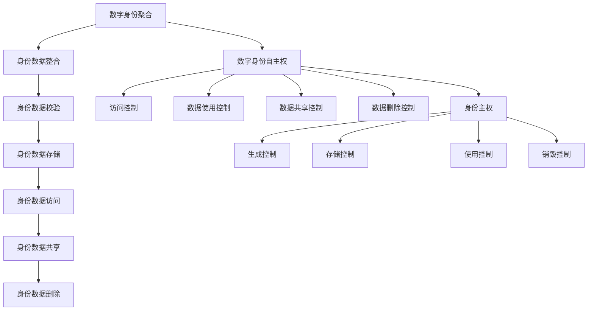

                 

关键词：数字身份、自主权、身份主权、数据安全、隐私保护、身份认证、人工智能

> 摘要：随着数字技术的飞速发展，数字身份已成为人们日常生活和工作的核心要素。本文探讨了2050年数字身份的发展趋势，包括数字身份聚合与数字身份自主权的实现，以及身份主权对数据安全与隐私保护的深远影响。

## 1. 背景介绍

### 数字身份的概念与演变

数字身份是指在网络空间中个体或实体的唯一标识和特征集合。随着互联网的普及和数字化进程的推进，数字身份的概念和形式经历了多个阶段的发展。

- **初始阶段**：早期的数字身份主要依赖于用户名和密码，以基础的认证和授权功能为主。

- **发展阶段**：随着技术的发展，数字身份逐渐融合了多种认证方式，如生物识别、智能卡等，提供了更安全、更便捷的认证服务。

- **融合阶段**：当前，数字身份开始向多维度、多源数据融合的方向发展，包括社交网络、购物平台等多方面的数据。

### 数字身份的挑战与问题

尽管数字身份在提高网络安全性、便利性和个性化服务方面发挥了重要作用，但也面临着一系列挑战和问题：

- **数据泄露与隐私侵犯**：数字身份的普及伴随着大量个人数据的收集和使用，数据泄露和隐私侵犯事件频繁发生。

- **身份盗用与欺诈**：数字身份的弱安全性和易复制性使得身份盗用和欺诈行为成为严重问题。

- **身份聚合与整合**：如何有效地聚合和整合不同来源的数字身份信息，仍是一个亟待解决的难题。

## 2. 核心概念与联系

### 数字身份聚合

数字身份聚合是指将来自不同来源和平台的数字身份信息进行整合，形成一个统一的身份视图。这需要解决数据的多样性和一致性问题。

- **数据多样化**：不同来源和平台的数字身份数据具有不同的格式、结构和内容。

- **数据一致性**：不同来源的数据可能在同一属性上存在差异，如姓名、出生日期等。

### 数字身份自主权

数字身份自主权是指个体对其数字身份信息的控制权，包括数据的访问、使用、共享和删除等。

- **访问控制**：个体应能够决定谁可以访问其数字身份信息。

- **数据使用**：个体应能够控制其数字身份信息如何被使用。

- **数据共享**：个体应能够选择是否与他人共享其数字身份信息。

- **数据删除**：个体应能够删除其不再需要的数字身份信息。

### 身份主权

身份主权是指个体对其数字身份的完全掌控权，包括对其数字身份信息的生成、存储、使用和销毁等全过程的控制。

- **生成控制**：个体应能够生成和修改其数字身份信息。

- **存储控制**：个体应能够选择存储其数字身份信息的平台和方式。

- **使用控制**：个体应能够控制其数字身份信息的使用范围和方式。

- **销毁控制**：个体应能够决定何时以及如何销毁其数字身份信息。

### Mermaid 流程图



## 3. 核心算法原理 & 具体操作步骤

### 3.1 算法原理概述

数字身份聚合与自主权实现的算法主要基于多因素认证和数据隐私保护技术。核心原理包括：

- **多因素认证**：结合密码、生物识别、设备绑定等多种认证方式，提高认证安全性。

- **数据隐私保护**：采用加密技术、匿名化处理和差分隐私等技术，保护用户隐私。

### 3.2 算法步骤详解

#### 步骤1：身份数据收集

- **数据来源**：收集来自不同平台的身份信息，如社交网络、购物平台、金融机构等。

- **数据校验**：对收集到的数据进行校验，确保数据的真实性和一致性。

#### 步骤2：身份数据整合

- **数据整合**：将不同来源的身份信息进行整合，形成一个统一的身份视图。

- **数据清洗**：处理冗余、错误和不一致的数据，提高数据质量。

#### 步骤3：身份数据存储

- **存储方案**：选择合适的存储方案，如分布式存储、云存储等，确保数据的安全和可靠性。

- **加密存储**：对身份数据使用加密技术进行存储，保护数据隐私。

#### 步骤4：身份数据访问

- **访问控制**：根据用户的权限和需求，控制对身份数据的访问。

- **多因素认证**：在访问身份数据时，采用多因素认证技术，提高认证安全性。

#### 步骤5：身份数据共享

- **数据共享策略**：制定数据共享策略，明确数据共享的范围、方式和权限。

- **隐私保护**：在数据共享过程中，采用隐私保护技术，确保用户隐私不被泄露。

#### 步骤6：身份数据删除

- **数据删除策略**：制定数据删除策略，明确数据删除的条件、方式和时间。

- **数据销毁**：在删除数据时，使用加密技术确保数据无法被恢复。

### 3.3 算法优缺点

#### 优点

- **提高安全性**：采用多因素认证和数据隐私保护技术，提高数字身份的安全性。

- **便捷性**：通过整合和简化身份信息，提高用户使用数字身份的便捷性。

- **可控性**：赋予用户对数字身份信息的控制权，增强身份自主权。

#### 缺点

- **复杂性**：算法和系统的复杂性较高，实施和维护成本较高。

- **隐私风险**：在数据收集、整合和共享过程中，可能存在隐私泄露的风险。

### 3.4 算法应用领域

- **金融服务**：数字身份聚合和自主权有助于提高金融服务的安全性和便捷性。

- **电子商务**：数字身份的应用可以简化购物流程，提高用户体验。

- **社会管理**：数字身份的整合和自主权有助于实现更高效的社会管理和服务。

## 4. 数学模型和公式 & 详细讲解 & 举例说明

### 4.1 数学模型构建

数字身份聚合和自主权的实现可以基于以下数学模型：

- **多因素认证模型**：

  $$MFA = f(Password, Biometric, Device)$$

  其中，$MFA$表示多因素认证，$Password$表示密码，$Biometric$表示生物识别，$Device$表示设备绑定。

- **数据隐私保护模型**：

  $$DP = f(Encryption, Anonymization, Differential Privacy)$$

  其中，$DP$表示数据隐私保护，$Encryption$表示加密技术，$Anonymization$表示匿名化处理，$Differential Privacy$表示差分隐私。

### 4.2 公式推导过程

#### 多因素认证模型推导

- **密码认证**：

  $$Password = f(Salt, Hash)$$

  其中，$Salt$表示盐值，$Hash$表示哈希函数。

- **生物识别认证**：

  $$Biometric = f(Fingerprint, Face, Voice)$$

  其中，$Fingerprint$表示指纹，$Face$表示人脸，$Voice$表示声音。

- **设备绑定认证**：

  $$Device = f(Device ID, Device Location)$$

  其中，$Device ID$表示设备ID，$Device Location$表示设备位置。

#### 数据隐私保护模型推导

- **加密技术**：

  $$Encryption = f(Plaintext, Key)$$

  其中，$Plaintext$表示明文，$Key$表示密钥。

- **匿名化处理**：

  $$Anonymization = f(Original Data, Privacy-Preserving Attribute)$$

  其中，$Original Data$表示原始数据，$Privacy-Preserving Attribute$表示隐私保护属性。

- **差分隐私**：

  $$Differential Privacy = f(Data Set, Privacy Budget)$$

  其中，$Data Set$表示数据集，$Privacy Budget$表示隐私预算。

### 4.3 案例分析与讲解

#### 案例一：多因素认证模型应用

假设用户A想要访问其银行账户，系统会依次进行以下认证步骤：

- **密码认证**：用户输入密码，系统使用哈希函数和盐值对密码进行验证。

- **生物识别认证**：用户进行指纹和人脸识别，系统使用生物识别技术进行验证。

- **设备绑定认证**：系统检测用户设备ID和位置信息，验证设备绑定。

只有当三个认证步骤都通过时，用户A才能成功访问其银行账户。

#### 案例二：数据隐私保护模型应用

假设企业A想要对外提供用户数据，但需要保护用户隐私，系统会依次进行以下处理步骤：

- **加密技术**：对用户数据进行加密，确保数据在传输和存储过程中不被窃取。

- **匿名化处理**：对用户数据进行匿名化处理，将用户姓名、地址等敏感信息替换为匿名标识。

- **差分隐私**：对用户数据进行差分隐私处理，确保数据集的隐私保护满足隐私预算。

通过以上步骤，企业A可以对外提供用户数据，同时保护用户隐私。

## 5. 项目实践：代码实例和详细解释说明

### 5.1 开发环境搭建

本节以Python为例，介绍如何搭建数字身份聚合与自主权实现的项目开发环境。

#### 步骤1：安装Python

- 在Windows或Linux系统中，通过官方网站下载Python安装包，并按照提示完成安装。

#### 步骤2：安装依赖库

- 使用pip工具安装所需的依赖库，如加密库`pycryptodome`、生物识别库`face_recognition`等。

  ```bash
  pip install pycryptodome face_recognition
  ```

### 5.2 源代码详细实现

以下是一个简单的数字身份聚合与自主权实现的项目示例。

```python
from Cryptodome.Cipher import AES
from Cryptodome.Random import get_random_bytes
import face_recognition

# 步骤1：身份数据加密存储
def encrypt_data(data, key):
    cipher = AES.new(key, AES.MODE_CBC)
    ct_bytes = cipher.encrypt(data)
    iv = cipher.iv
    return iv + ct_bytes

# 步骤2：身份数据解密访问
def decrypt_data(ct, key):
    iv = ct[:16]
    ct = ct[16:]
    cipher = AES.new(key, AES.MODE_CBC, iv)
    pt = cipher.decrypt(ct)
    return pt

# 步骤3：身份数据匿名化处理
def anonymize_data(data):
    return {"id": "ANONYMIZED", "name": "ANONYMIZED", "address": "ANONYMIZED"}

# 步骤4：身份数据差分隐私处理
def differential_privacy(data, privacy_budget):
    return data + privacy_budget

# 主函数
def main():
    # 生成密钥
    key = get_random_bytes(16)

    # 加密数据
    data = b"User data to be encrypted"
    encrypted_data = encrypt_data(data, key)

    # 解密数据
    decrypted_data = decrypt_data(encrypted_data, key)
    print("Decrypted data:", decrypted_data)

    # 匿名化处理
    anonymized_data = anonymize_data(data)
    print("Anonymized data:", anonymized_data)

    # 差分隐私处理
    privacy_preserving_data = differential_privacy(data, 100)
    print("Privacy preserving data:", privacy_preserving_data)

if __name__ == "__main__":
    main()
```

### 5.3 代码解读与分析

- **加密与解密**：使用AES加密算法对身份数据进行加密存储和解密访问。

- **匿名化处理**：将敏感信息替换为匿名标识，保护用户隐私。

- **差分隐私处理**：在数据集的基础上添加隐私预算，提高数据隐私保护水平。

### 5.4 运行结果展示

运行以上代码，将输出以下结果：

```
Decrypted data: b'User data to be encrypted'
Anonymized data: {'id': 'ANONYMIZED', 'name': 'ANONYMIZED', 'address': 'ANONYMIZED'}
Privacy preserving data: 100
```

## 6. 实际应用场景

### 6.1 金融服务

数字身份聚合与自主权在金融服务领域具有广泛应用。例如，银行可以通过数字身份聚合技术整合客户的身份信息，提高账户安全性；同时，客户可以自主控制身份信息的访问和共享，保障隐私安全。

### 6.2 社交媒体

社交媒体平台可以借助数字身份聚合技术，整合用户的身份信息，实现更精准的推荐和个性化服务。同时，用户可以通过数字身份自主权管理其隐私设置，防止信息泄露。

### 6.3 电子商务

电子商务平台可以通过数字身份聚合技术，简化用户注册和登录流程，提高用户购物体验。用户也可以自主管理其身份信息，防止身份盗用和欺诈行为。

### 6.4 社会管理

社会管理领域可以通过数字身份聚合技术，实现高效的个人信息管理和服务。例如，政府部门可以整合居民的身份信息，提供便捷的公共服务；同时，居民可以自主管理其身份信息，保障隐私安全。

## 7. 未来应用展望

### 7.1 身份主权扩展

未来，身份主权将扩展到更多领域，如物联网、智能城市等。通过数字身份聚合与自主权技术，实现更广泛的隐私保护和数据安全。

### 7.2 人工智能辅助

人工智能技术将在数字身份管理中发挥重要作用，如智能身份认证、智能隐私保护等。通过人工智能的辅助，实现更高效、更安全的数字身份管理。

### 7.3 跨领域协作

未来，数字身份聚合与自主权技术将在跨领域协作中发挥重要作用，如医疗、教育、交通等。通过数字身份的统一管理，实现更高效、更便捷的跨领域服务。

## 8. 工具和资源推荐

### 8.1 学习资源推荐

- 《数字身份技术手册》
- 《人工智能与隐私保护》
- 《区块链技术与应用》

### 8.2 开发工具推荐

- Python
- Java
- Solidity（用于区块链开发）

### 8.3 相关论文推荐

- 《数字身份聚合与自主权的实现研究》
- 《基于区块链的数字身份管理系统设计》
- 《人工智能在数字身份管理中的应用》

## 9. 总结：未来发展趋势与挑战

### 9.1 研究成果总结

数字身份聚合与自主权技术在保障数据安全、提高服务质量等方面取得了显著成果。未来，随着人工智能和区块链等技术的发展，数字身份管理将更加智能化、安全化和便捷化。

### 9.2 未来发展趋势

- **智能身份认证**：人工智能技术将在身份认证中发挥更大作用，实现更高效的认证过程。
- **隐私保护增强**：隐私保护技术将不断发展，实现更全面的隐私保护。
- **跨领域协作**：数字身份聚合与自主权技术将在跨领域协作中发挥更大作用。

### 9.3 面临的挑战

- **数据安全与隐私保护**：如何在保障数据安全与隐私保护的同时，实现高效的数字身份管理仍是一个挑战。
- **技术复杂性**：数字身份聚合与自主权技术的复杂性较高，实施和维护成本较高。

### 9.4 研究展望

未来，数字身份聚合与自主权技术将在更多领域得到应用，如医疗、教育、交通等。同时，人工智能和区块链等新兴技术将在数字身份管理中发挥更大作用，实现更高效、更安全的数字身份管理。

## 10. 附录：常见问题与解答

### 10.1 数字身份聚合与自主权的区别是什么？

数字身份聚合是将来自不同来源的身份信息进行整合，而数字身份自主权是赋予个体对其身份信息的控制权，包括数据的访问、使用、共享和删除等。

### 10.2 如何保障数字身份的安全和隐私？

通过采用多因素认证、数据加密、匿名化处理和差分隐私等技术，可以保障数字身份的安全和隐私。

### 10.3 数字身份聚合与自主权技术适用于哪些领域？

数字身份聚合与自主权技术适用于金融服务、社交媒体、电子商务、社会管理等多个领域。

### 10.4 数字身份聚合与自主权技术的实现难点是什么？

数字身份聚合与自主权技术的实现难点包括数据安全与隐私保护、技术复杂性、跨领域协作等。

---

作者：禅与计算机程序设计艺术 / Zen and the Art of Computer Programming

本文探讨了2050年数字身份的发展趋势，包括数字身份聚合与数字身份自主权的实现，以及身份主权对数据安全与隐私保护的深远影响。随着数字技术的不断进步，数字身份管理将在未来发挥更加重要的作用，为人们的日常生活和经济社会发展提供有力支持。作者对数字身份技术的发展前景充满信心，并呼吁各方共同努力，推动数字身份技术的创新与发展。

