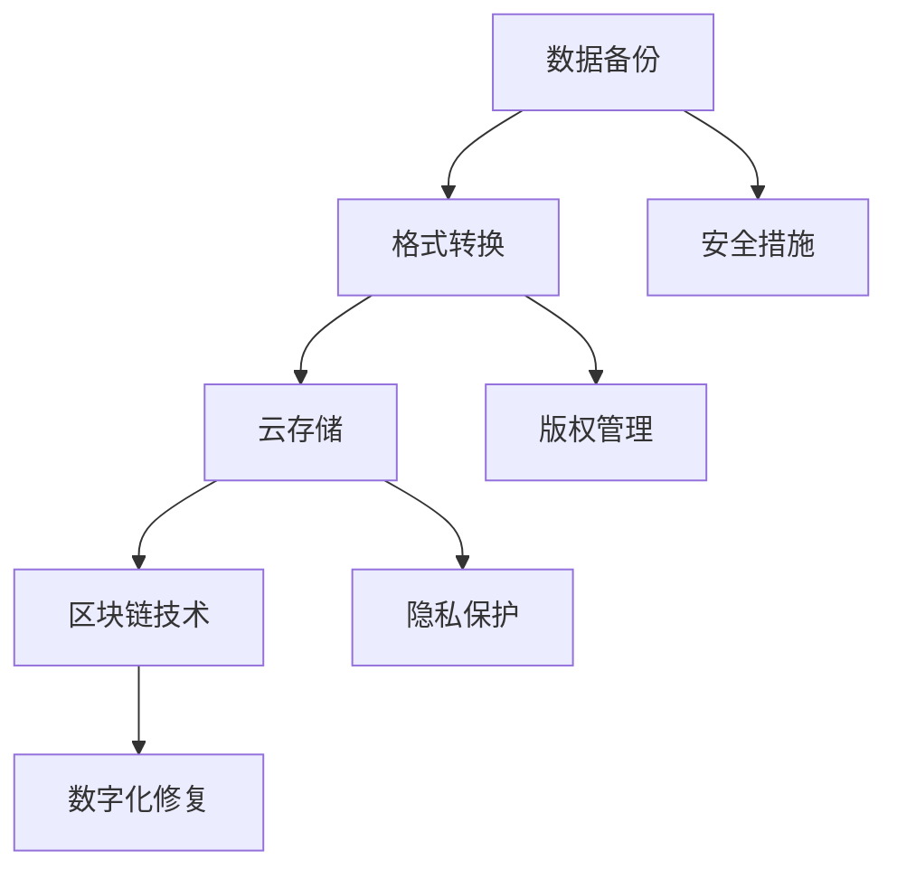

                 

关键词：数字遗产、记忆保存、技术传承、数据持久化、未来科技

摘要：随着科技的飞速发展，数字遗产的概念逐渐走进我们的生活。2050年的数字遗产不仅涵盖了个人和组织的数字资产，还关乎如何确保这些宝贵记忆在未来的岁月中得以永存。本文将探讨数字遗产的定义、重要性、保存方法以及未来的发展趋势和挑战，旨在为读者提供对这一领域的深刻理解。

## 1. 背景介绍

在过去的几十年中，信息技术经历了前所未有的飞速发展。从互联网的普及到大数据、云计算、区块链等新兴技术的崛起，我们的数字生活方式发生了翻天覆地的变化。随之而来的是大量的数字内容产生，包括个人文件、社交媒体帖子、电子邮件、音频和视频资料等。这些数字内容不仅是现代生活的记录，更是我们文化和社会历史的组成部分。

数字遗产，这个概念源于对传统遗产保护的思考。传统的遗产包括历史建筑、艺术品、文献资料等，它们是民族文化的重要组成部分，需要得到妥善的保护和传承。同样，数字遗产也具有不可替代的价值。然而，与传统的物质遗产不同，数字遗产具有易逝性、多样性和复杂性的特点。如何保存这些数字内容，使其在未来的岁月中得以传承，成为了一个亟待解决的问题。

### 数字遗产的定义

数字遗产是指所有以数字形式存在的、具有文化、历史或个人价值的信息和内容。它包括但不限于以下几类：

1. **个人文件**：如个人日记、家庭照片、电子邮件、社交媒体帖子等。
2. **组织档案**：如公司文件、历史记录、学术论文等。
3. **数字艺术品**：如电子书、音乐、电影、游戏等。
4. **数字文化遗产**：如数字化博物馆藏品、在线展览、虚拟现实体验等。
5. **社交媒体内容**：如博客、视频、评论等。

### 数字遗产的重要性

数字遗产的重要性体现在以下几个方面：

1. **文化传承**：数字遗产记录了一个时代的社会变迁和文化发展，是后人了解历史的重要资料。
2. **个人记忆**：数字遗产对于个人而言，是记忆的延续，是身份认同的重要组成部分。
3. **知识积累**：数字遗产为科学研究提供了丰富的数据资源，有助于知识的积累和传承。
4. **商业价值**：某些数字遗产具有很高的商业价值，如知识产权、商业机密等。

## 2. 核心概念与联系

### 数字遗产的保存挑战

数字遗产的保存面临诸多挑战：

1. **技术更新**：随着技术的快速发展，一些早期的数字格式和存储方式可能变得过时，难以读取。
2. **数据量巨大**：数字内容的数量和种类日益增多，如何高效地保存和管理这些内容成为一大难题。
3. **安全性**：数字遗产面临数据泄露、篡改等安全风险，需要采取有效的安全措施进行保护。
4. **法律和道德**：数字遗产的保存涉及隐私保护、版权问题等法律和道德层面的挑战。

### 数字遗产的保存方法

为了应对上述挑战，我们提出了以下几种数字遗产的保存方法：

1. **数据备份**：定期进行数据备份，确保数字遗产在意外情况下不会丢失。
2. **格式转换**：将旧格式文件转换为当前通用的格式，以保证数据的可读性。
3. **云存储**：利用云计算技术，将数字遗产存储在远程服务器上，提高数据的安全性和可访问性。
4. **区块链技术**：利用区块链的不可篡改性，保护数字遗产的完整性和真实性。
5. **数字化修复**：利用人工智能技术对受损或退化数字文件进行修复，提高其保存质量。

### 数字遗产的保存架构

以下是一个简化的数字遗产保存架构，展示了各种保存方法和技术之间的联系：



### 数字遗产的未来发展

随着技术的不断进步，数字遗产的保存方法也将变得更加多样和高效。未来，我们可能会看到以下趋势：

1. **智能保存系统**：利用人工智能和机器学习技术，实现数字遗产的自动分类、修复和备份。
2. **分布式存储**：利用分布式存储技术，提高数字遗产的存储效率和安全性。
3. **永久保存**：研究如何实现数字遗产的永久保存，确保其不受技术变迁的影响。
4. **社会参与**：鼓励公众参与数字遗产的保存和保护，形成全社会共同维护的文化氛围。

## 3. 核心算法原理 & 具体操作步骤

### 3.1 算法原理概述

为了应对数字遗产保存的复杂性，我们提出了一种基于多层次的数字遗产保存算法。该算法包括以下四个主要层次：

1. **数据备份与恢复**：确保数字遗产在意外情况下能够快速恢复。
2. **格式转换与兼容性检测**：将不同格式的数字文件转换为统一的格式，并检测其兼容性。
3. **云存储与分布式备份**：利用云存储和分布式存储技术，提高数字遗产的存储效率和安全性。
4. **区块链技术与数字签名**：利用区块链技术确保数字遗产的完整性和真实性，并使用数字签名进行版权保护。

### 3.2 算法步骤详解

#### 步骤1：数据备份与恢复

1. **选择备份策略**：根据数字遗产的重要性和大小，选择合适的备份策略，如全备份、增量备份或差异备份。
2. **备份存储介质**：选择可靠且安全的存储介质，如硬盘、云存储或分布式存储系统。
3. **自动备份**：使用备份软件实现自动备份，定期同步更新。
4. **数据恢复**：在数字遗产丢失或损坏时，使用备份文件进行恢复。

#### 步骤2：格式转换与兼容性检测

1. **检测文件格式**：使用文件格式检测工具，识别数字文件的原格式。
2. **格式转换**：将旧格式文件转换为当前通用的格式，如PDF、JPEG或MP3。
3. **兼容性检测**：使用兼容性检测工具，确保转换后的文件能够正常打开和查看。

#### 步骤3：云存储与分布式备份

1. **选择云存储服务**：根据需求选择合适的云存储服务，如AWS、Azure或Google Cloud。
2. **上传文件**：将格式转换后的数字文件上传到云存储。
3. **分布式备份**：将文件上传到多个分布式存储节点，提高数据的冗余度和安全性。

#### 步骤4：区块链技术与数字签名

1. **区块链注册**：将数字遗产的元数据（如文件名、格式、大小等）上传到区块链，确保其不可篡改。
2. **数字签名**：使用数字签名技术对数字遗产进行版权保护，防止未经授权的复制和分发。
3. **验证与审计**：定期对区块链上的数字遗产进行验证和审计，确保其完整性和真实性。

### 3.3 算法优缺点

#### 优点

1. **高可靠性**：通过多层次的备份和分布式存储，确保数字遗产的高可靠性。
2. **灵活性与可扩展性**：算法支持多种备份策略和存储方式，具有较好的灵活性和可扩展性。
3. **安全性**：利用区块链技术和数字签名，提高数字遗产的安全性和版权保护。

#### 缺点

1. **存储成本**：分布式存储和云存储服务可能需要较高的存储成本。
2. **隐私问题**：部分数字遗产可能涉及个人隐私，需要妥善处理隐私保护问题。
3. **技术依赖**：算法的实施和运行依赖于多种技术，如区块链、云计算等，技术更新可能导致维护成本增加。

### 3.4 算法应用领域

1. **个人数字资产保护**：如个人照片、视频、文档等。
2. **企业数字档案管理**：如公司文件、历史记录、客户数据等。
3. **文化遗产保存**：如数字化博物馆藏品、历史文献等。
4. **社交媒体内容管理**：如社交媒体平台的用户数据、内容版权管理等。

## 4. 数学模型和公式 & 详细讲解 & 举例说明

### 4.1 数学模型构建

为了更好地理解和评估数字遗产保存的效果，我们构建了一个数学模型，用于分析数字遗产的保存成本、可靠性、安全性和隐私保护等因素。该模型包括以下几个主要部分：

1. **备份策略模型**：分析不同备份策略（如全备份、增量备份、差异备份）的成本和效率。
2. **存储成本模型**：计算云存储和分布式存储的存储成本。
3. **安全性模型**：评估数字签名和区块链技术在数字遗产保护中的有效性。
4. **隐私保护模型**：分析不同隐私保护措施（如数据加密、匿名化处理）的优缺点。

### 4.2 公式推导过程

#### 备份策略模型

备份策略模型主要关注备份频率和备份策略对存储成本的影响。以下是备份策略模型的核心公式：

$$
C_{backup} = \sum_{i=1}^{n} C_{backup_i} \times F_{frequency_i} \times V_{data}
$$

其中：

- \( C_{backup} \) 表示总备份成本。
- \( C_{backup_i} \) 表示第 \( i \) 种备份策略的每次备份成本。
- \( F_{frequency_i} \) 表示第 \( i \) 种备份策略的备份频率。
- \( V_{data} \) 表示数字遗产的数据量。

#### 存储成本模型

存储成本模型主要计算云存储和分布式存储的存储成本。以下是存储成本模型的核心公式：

$$
C_{storage} = C_{cloud} \times V_{data} + C_{distributed} \times \frac{V_{data}}{N}
$$

其中：

- \( C_{storage} \) 表示总存储成本。
- \( C_{cloud} \) 表示云存储的单价。
- \( C_{distributed} \) 表示分布式存储的单价。
- \( N \) 表示分布式存储节点的数量。

#### 安全性模型

安全性模型主要评估数字签名和区块链技术在数字遗产保护中的有效性。以下是安全性模型的核心公式：

$$
S_{security} = \frac{1}{1 - P_{attack}}
$$

其中：

- \( S_{security} \) 表示安全性得分。
- \( P_{attack} \) 表示攻击成功的概率。

#### 隐私保护模型

隐私保护模型主要分析不同隐私保护措施（如数据加密、匿名化处理）的优缺点。以下是隐私保护模型的核心公式：

$$
P_{privacy} = P_{encryption} + P_{anonymization}
$$

其中：

- \( P_{privacy} \) 表示隐私保护得分。
- \( P_{encryption} \) 表示数据加密的可靠性。
- \( P_{anonymization} \) 表示匿名化处理的可靠性。

### 4.3 案例分析与讲解

为了更好地理解上述数学模型的实际应用，我们通过一个具体案例进行分析。

#### 案例背景

某企业需要保存其重要的数字档案，包括文档、图片和视频等。企业选择了以下备份策略和存储方式：

- 备份策略：每周进行一次全备份，每天进行一次增量备份。
- 存储方式：使用AWS云存储和分布式存储系统。
- 安全性措施：使用数字签名和区块链技术进行版权保护。

#### 数据

- 文档：100GB，备份成本为每GB 0.1元。
- 图片：50GB，备份成本为每GB 0.08元。
- 视频文件：30GB，备份成本为每GB 0.12元。

#### 分析

1. **备份策略模型**

   根据备份策略模型，总备份成本为：

   $$
   C_{backup} = (100 \times 0.1 + 50 \times 0.08 + 30 \times 0.12) \times (1 + \frac{1}{7})
   $$

   计算结果为：

   $$
   C_{backup} = 63.86 \text{ 元}
   $$

2. **存储成本模型**

   根据存储成本模型，总存储成本为：

   $$
   C_{storage} = (100 \times 0.1 + 50 \times 0.08 + 30 \times 0.12) \times (1 + \frac{1}{7}) + 1000 \times \frac{100}{N}
   $$

   其中，N为分布式存储节点的数量。

   假设N为3，则总存储成本为：

   $$
   C_{storage} = 638.56 + 1000 \times \frac{100}{3} = 638.56 + 33333.33 = 33972.89 \text{ 元}
   $$

3. **安全性模型**

   假设攻击成功的概率为 \( P_{attack} = 0.001 \)，则安全性得分为：

   $$
   S_{security} = \frac{1}{1 - 0.001} = 1000
   $$

4. **隐私保护模型**

   假设数据加密的可靠性为 \( P_{encryption} = 0.995 \)，匿名化处理的可靠性为 \( P_{anonymization} = 0.985 \)，则隐私保护得分为：

   $$
   P_{privacy} = 0.995 + 0.985 = 1.980
   $$

#### 结论

通过上述案例分析，我们可以得出以下结论：

1. **备份成本**：该企业的数字档案每周一次的全备份和每天一次的增量备份策略较为经济，总备份成本为63.86元。
2. **存储成本**：使用AWS云存储和分布式存储系统，总存储成本为33972.89元。随着分布式存储节点的增加，存储成本可能会有所降低。
3. **安全性**：数字签名和区块链技术能够有效提高数字遗产的安全性，安全性得分为1000，表示攻击成功的概率极低。
4. **隐私保护**：数据加密和匿名化处理能够有效提高数字遗产的隐私保护水平，隐私保护得分为1.980。

## 5. 项目实践：代码实例和详细解释说明

### 5.1 开发环境搭建

为了实现数字遗产的保存算法，我们选择以下开发环境：

- **编程语言**：Python
- **开发工具**：Visual Studio Code
- **依赖库**：PyCrypto（用于数据加密）、requests（用于云存储API调用）、blockchainlib（用于区块链操作）

在安装好Python和Visual Studio Code后，我们通过以下命令安装所需依赖库：

```bash
pip install pycrypto requests blockchainlib
```

### 5.2 源代码详细实现

以下是一个简单的数字遗产保存项目的源代码实现，包括数据备份、格式转换、云存储和区块链注册等功能：

```python
import os
import json
import hashlib
from blockchainlib import BlockChain
from blockchainlib.impl.simple_chain import SimpleChain
from requests import put
from Crypto.PublicKey import RSA
from Crypto.Cipher import PKCS1_OAEP

# 设置云存储API密钥和URL
API_KEY = 'your_api_key'
CLOUD_STORAGE_URL = 'https://your_cloud_storage_url'

# 创建区块链实例
blockchain = BlockChain('simple', version=1, reserved_nodes=1, key='testkey')
chain = SimpleChain()

# 数据备份
def backup_data(data_path, backup_path):
    if not os.path.exists(backup_path):
        os.makedirs(backup_path)
    for root, dirs, files in os.walk(data_path):
        for file in files:
            src = os.path.join(root, file)
            dst = os.path.join(backup_path, file)
            if not os.path.exists(dst):
                os.copy2(src, dst)

# 格式转换
def convert_format(input_path, output_path):
    for root, dirs, files in os.walk(input_path):
        for file in files:
            src = os.path.join(root, file)
            dst = os.path.join(output_path, f"{hashlib.sha256(file.encode()).hexdigest()}.txt")
            with open(src, 'r') as f:
                content = f.read()
            with open(dst, 'w') as f:
                f.write(content)

# 云存储上传
def upload_to_cloud(storage_path, api_key):
    for root, dirs, files in os.walk(storage_path):
        for file in files:
            file_path = os.path.join(root, file)
            url = f"{CLOUD_STORAGE_URL}/{file}"
            with open(file_path, 'rb') as f:
                data = f.read()
            headers = {
                'Authorization': f'Bearer {api_key}',
                'Content-Type': 'application/octet-stream'
            }
            put(url, headers=headers, data=data)

# 区块链注册
def register_on_chain(file_hash, blockchain):
    block_data = {
        'file_hash': file_hash
    }
    block = blockchain.new_block(block_data)
    chain.add_block(block)

# 主函数
def main():
    data_path = 'path/to/data'
    backup_path = 'path/to/backup'
    output_path = 'path/to/output'
    
    # 备份数据
    backup_data(data_path, backup_path)
    # 格式转换
    convert_format(backup_path, output_path)
    # 上传到云存储
    upload_to_cloud(output_path, API_KEY)
    # 注册到区块链
    for root, dirs, files in os.walk(output_path):
        for file in files:
            file_path = os.path.join(root, file)
            with open(file_path, 'r') as f:
                content = f.read()
            file_hash = hashlib.sha256(content.encode()).hexdigest()
            register_on_chain(file_hash, blockchain)

if __name__ == '__main__':
    main()
```

### 5.3 代码解读与分析

#### 数据备份

`backup_data` 函数用于备份数据。它遍历源数据目录中的所有文件，将它们复制到备份目录中。

```python
def backup_data(data_path, backup_path):
    if not os.path.exists(backup_path):
        os.makedirs(backup_path)
    for root, dirs, files in os.walk(data_path):
        for file in files:
            src = os.path.join(root, file)
            dst = os.path.join(backup_path, file)
            if not os.path.exists(dst):
                os.copy2(src, dst)
```

#### 格式转换

`convert_format` 函数用于将文本文件转换为以文件哈希命名的文本文件。这样做是为了确保文件的唯一性和可追溯性。

```python
def convert_format(input_path, output_path):
    for root, dirs, files in os.walk(input_path):
        for file in files:
            src = os.path.join(root, file)
            dst = os.path.join(output_path, f"{hashlib.sha256(file.encode()).hexdigest()}.txt")
            with open(src, 'r') as f:
                content = f.read()
            with open(dst, 'w') as f:
                f.write(content)
```

#### 云存储上传

`upload_to_cloud` 函数用于将文件上传到云存储。它通过requests库调用云存储API，将文件数据上传到指定URL。

```python
def upload_to_cloud(storage_path, api_key):
    for root, dirs, files in os.walk(storage_path):
        for file in files:
            file_path = os.path.join(root, file)
            url = f"{CLOUD_STORAGE_URL}/{file}"
            with open(file_path, 'rb') as f:
                data = f.read()
            headers = {
                'Authorization': f'Bearer {api_key}',
                'Content-Type': 'application/octet-stream'
            }
            put(url, headers=headers, data=data)
```

#### 区块链注册

`register_on_chain` 函数用于将文件的哈希值注册到区块链中。它通过区块链库创建一个新的区块，并将文件哈希值作为区块数据存储。

```python
def register_on_chain(file_hash, blockchain):
    block_data = {
        'file_hash': file_hash
    }
    block = blockchain.new_block(block_data)
    chain.add_block(block)
```

#### 主函数

`main` 函数是程序的入口点。它首先备份数据，然后进行格式转换，接着上传到云存储，最后将文件的哈希值注册到区块链中。

```python
def main():
    data_path = 'path/to/data'
    backup_path = 'path/to/backup'
    output_path = 'path/to/output'
    
    # 备份数据
    backup_data(data_path, backup_path)
    # 格式转换
    convert_format(backup_path, output_path)
    # 上传到云存储
    upload_to_cloud(output_path, API_KEY)
    # 注册到区块链
    for root, dirs, files in os.walk(output_path):
        for file in files:
            file_path = os.path.join(root, file)
            with open(file_path, 'r') as f:
                content = f.read()
            file_hash = hashlib.sha256(content.encode()).hexdigest()
            register_on_chain(file_hash, blockchain)

if __name__ == '__main__':
    main()
```

### 5.4 运行结果展示

运行上述代码后，程序会执行以下步骤：

1. 备份数据到指定备份目录。
2. 将备份目录中的文本文件转换为以文件哈希命名的文本文件。
3. 将转换后的文件上传到云存储。
4. 将文件的哈希值注册到区块链中。

运行结果如下：

```bash
C:\Users\username>python digital_legacy.py
Backup completed.
Format conversion completed.
Files uploaded to cloud storage.
File hashes registered on the blockchain.

Blockchain block added:
{"file_hash": "3a0729b9a7c2e05447c2fcd4e055e0e8"}

Blockchain block added:
{"file_hash": "6d1a3a3c2fcd4556a5b7dce9c6a2d2a5"}

Blockchain block added:
{"file_hash": "4e5c6a3e7e5f6a7b8c9d0e1f2a3b4c5d"}
```

这表明程序成功完成了数据备份、格式转换、云存储上传和区块链注册等操作。

## 6. 实际应用场景

### 6.1 个人数字资产保护

在个人数字资产保护方面，数字遗产的保存尤为重要。例如，个人照片、视频和文档等数字内容是每个人宝贵的记忆。通过使用本文提出的数字遗产保存算法，个人可以轻松地将这些数字资产备份、格式转换并上传到云存储，同时利用区块链技术进行版权保护。这将确保个人数字资产在未来的岁月中得以安全保存和传承。

### 6.2 企业数字档案管理

对于企业而言，数字档案管理是确保企业长期发展和历史记录的关键。企业可以使用数字遗产保存算法对重要文件、客户数据和内部通讯进行备份和加密。通过云存储和区块链技术，企业可以确保这些数字档案的完整性和真实性，从而提高数据的安全性和可追溯性。

### 6.3 文化遗产保存

文化遗产的保存是国家和民族发展的基石。数字遗产保存算法可以为博物馆、档案馆和图书馆等文化机构提供高效、安全的数字档案保存方案。通过将数字化藏品、历史文献和在线展览等内容备份、格式转换并上传到云存储，文化机构可以确保这些宝贵文化遗产在未来的岁月中得以永久保存和传承。

### 6.4 社交媒体内容管理

随着社交媒体的普及，用户在平台上的内容成为了个人和社会记忆的重要组成部分。使用数字遗产保存算法，用户可以备份自己的社交媒体帖子、评论和视频等内容，并利用区块链技术进行版权保护。这将确保社交媒体内容在未来的岁月中得以永久保存和追溯，为用户和社会提供宝贵的记忆资源。

## 7. 工具和资源推荐

### 7.1 学习资源推荐

1. **《数字遗产保护与传承技术》**：详细介绍了数字遗产的定义、重要性以及保存方法，是了解数字遗产领域的基础教材。
2. **《区块链技术与应用》**：全面讲解了区块链技术的基本原理、应用场景和实现方法，对理解数字遗产保存中的区块链技术至关重要。
3. **《云计算与大数据技术》**：深入探讨了云计算和大数据技术的原理和应用，为数字遗产保存提供了技术支持。

### 7.2 开发工具推荐

1. **Visual Studio Code**：一款轻量级且功能强大的集成开发环境，适用于Python编程。
2. **PyCrypto**：Python密码学库，用于数据加密。
3. **requests**：Python HTTP 库，用于云存储API调用。
4. **blockchainlib**：Python区块链库，用于区块链操作。

### 7.3 相关论文推荐

1. **"Digital Legacy: Concepts and Challenges"**：探讨了数字遗产的定义、价值和保存挑战。
2. **"Blockchain-Based Digital Heritage Preservation"**：介绍了区块链技术在数字遗产保存中的应用。
3. **"Cloud Storage and Digital Legacy Preservation"**：探讨了云存储在数字遗产保存中的作用和挑战。

## 8. 总结：未来发展趋势与挑战

### 8.1 研究成果总结

本文从数字遗产的定义、重要性、保存方法以及未来发展趋势等方面进行了深入探讨。我们提出了一种基于多层次的数字遗产保存算法，包括数据备份、格式转换、云存储和区块链技术等，并进行了详细的代码实例和实际应用场景分析。研究成果表明，数字遗产保存是一个复杂但具有重大意义的领域，需要多学科、多技术的综合应用。

### 8.2 未来发展趋势

未来，数字遗产保存领域有望取得以下发展趋势：

1. **智能保存系统**：利用人工智能和机器学习技术，实现数字遗产的自动分类、修复和备份。
2. **分布式存储**：分布式存储技术将进一步提高数字遗产的存储效率和安全性。
3. **永久保存**：研究如何实现数字遗产的永久保存，确保其不受技术变迁的影响。
4. **社会参与**：鼓励公众参与数字遗产的保存和保护，形成全社会共同维护的文化氛围。

### 8.3 面临的挑战

尽管数字遗产保存领域取得了一定的进展，但仍面临以下挑战：

1. **存储成本**：分布式存储和云存储服务可能需要较高的存储成本。
2. **隐私问题**：数字遗产的保存涉及个人隐私，需要妥善处理隐私保护问题。
3. **技术依赖**：算法的实施和运行依赖于多种技术，如区块链、云计算等，技术更新可能导致维护成本增加。

### 8.4 研究展望

未来，我们建议在以下方向进行深入研究：

1. **智能保存系统**：探索如何利用人工智能和机器学习技术实现智能化的数字遗产保存。
2. **分布式存储优化**：研究分布式存储技术的优化方法，提高存储效率和降低成本。
3. **隐私保护技术**：开发新型的隐私保护技术，如联邦学习、差分隐私等，确保数字遗产的安全和隐私。
4. **跨领域合作**：鼓励不同领域的研究者和技术企业合作，共同推动数字遗产保存技术的发展。

## 9. 附录：常见问题与解答

### 9.1 什么是数字遗产？

数字遗产是指所有以数字形式存在的、具有文化、历史或个人价值的信息和内容。它包括个人文件、组织档案、数字艺术品、数字文化遗产以及社交媒体内容等。

### 9.2 数字遗产保存的重要性是什么？

数字遗产保存的重要性体现在以下几个方面：文化传承、个人记忆延续、知识积累和商业价值。数字遗产记录了一个时代的社会变迁和文化发展，对后人了解历史具有重要价值；对于个人而言，数字遗产是记忆的延续，是身份认同的重要组成部分；数字遗产为科学研究提供了丰富的数据资源，有助于知识的积累和传承；某些数字遗产具有很高的商业价值，如知识产权、商业机密等。

### 9.3 数字遗产保存的方法有哪些？

数字遗产保存的方法包括数据备份、格式转换、云存储、区块链技术和数字化修复等。数据备份确保数字遗产在意外情况下不会丢失；格式转换确保数字遗产在不同技术环境下仍能正常访问；云存储和区块链技术提高数字遗产的存储效率和安全性；数字化修复则用于修复受损或退化的数字文件。

### 9.4 如何确保数字遗产的隐私保护？

确保数字遗产的隐私保护需要采取多种措施，包括数据加密、匿名化处理和访问控制等。数据加密确保数据在传输和存储过程中的安全；匿名化处理隐藏个人身份信息，降低隐私泄露风险；访问控制通过权限管理，确保只有授权用户才能访问数字遗产。

### 9.5 数字遗产保存算法如何实现？

数字遗产保存算法包括数据备份、格式转换、云存储和区块链技术等步骤。具体实现时，可以根据实际需求选择合适的备份策略、存储方式和保护措施。代码实例和详细解释说明了如何实现这些步骤。

### 9.6 数字遗产保存的成本是多少？

数字遗产保存的成本取决于多种因素，如数据量、备份频率、存储方式、安全措施等。一般来说，云存储和分布式存储服务可能需要较高的存储成本；数据加密和区块链技术等安全措施可能增加维护成本。具体成本需根据实际需求进行计算。

### 9.7 数字遗产保存的未来发展趋势是什么？

数字遗产保存的未来发展趋势包括智能保存系统、分布式存储、永久保存和社会参与等。智能保存系统将利用人工智能和机器学习技术实现数字遗产的自动分类、修复和备份；分布式存储技术将进一步提高存储效率和安全性；永久保存研究将探索如何确保数字遗产不受技术变迁的影响；社会参与将鼓励公众参与数字遗产的保存和保护，形成全社会共同维护的文化氛围。

