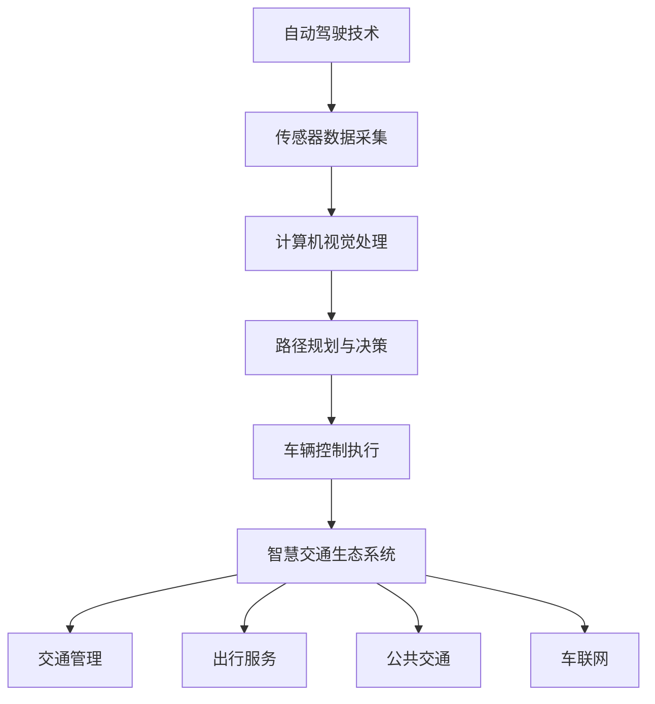

                 

关键词：智能交通，自动驾驶，智慧交通生态，交通系统重构，未来趋势

> 摘要：本文将探讨2050年的智能交通系统，从自动驾驶技术到智慧交通生态系统的构建，分析交通系统重构的核心概念、关键算法原理、实际应用场景以及未来发展的挑战和前景。

## 1. 背景介绍

随着科技的迅猛发展，特别是人工智能和大数据技术的广泛应用，交通领域正在经历前所未有的变革。从传统的驾驶模式向自动驾驶的过渡，再到智慧交通生态系统的构建，未来的交通系统将实现前所未有的高效、安全和环保。

自动驾驶技术是智能交通系统的核心。自动驾驶车辆通过传感器、计算机视觉、GPS等设备实时获取交通环境信息，结合人工智能算法进行自主决策和路径规划，从而实现车辆在复杂交通环境中的安全行驶。然而，自动驾驶技术不仅局限于单个车辆的自主行驶，还需要实现车与车、车与基础设施之间的信息交互和协同，形成更加智能、高效的交通系统。

智慧交通生态系统则是在自动驾驶技术的基础上，通过数据共享、智能分析、自动化决策等手段，实现交通管理、出行服务、公共交通等多领域的深度融合，打造一个全面、智能的交通生态系统。

## 2. 核心概念与联系

### 2.1 自动驾驶技术

自动驾驶技术主要分为L0到L5六个级别，其中L5为完全自动驾驶，无需人类干预。以下是各级别的简单介绍：

- **L0：无自动化。** 车辆没有任何自动驾驶功能，完全由人类驾驶员控制。
- **L1：部分自动化。** 主要功能为单一任务的自动化，如定速巡航或车道保持。
- **L2：部分自动化。** 实现多个任务的自动化，如自适应巡航控制和车道保持。
- **L3：有条件自动化。** 能够在特定条件下完全接管车辆控制，但在复杂环境中仍需人类干预。
- **L4：高度自动化。** 在特定环境下可以实现完全自动驾驶，但人类驾驶员仍需在紧急情况下接管。
- **L5：完全自动化。** 完全无需人类干预，车辆在任何环境下都能安全行驶。

### 2.2 智慧交通生态系统

智慧交通生态系统主要包括以下几个组成部分：

- **交通管理。** 通过大数据分析和智能算法，实时优化交通信号、交通流向，减少拥堵。
- **出行服务。** 提供个性化的出行方案，包括最优路径规划、出行时间预测等。
- **公共交通。** 提高公共交通的运行效率和服务质量，如智能公交、共享单车等。
- **车联网。** 实现车辆与车辆、车辆与基础设施之间的信息交互，提高交通系统的整体效能。

### 2.3 Mermaid 流程图



## 3. 核心算法原理 & 具体操作步骤

### 3.1 算法原理概述

自动驾驶技术的核心在于路径规划和车辆控制。路径规划主要涉及如何从起点到终点选择最优路径，而车辆控制则是如何在选定路径上安全、高效地行驶。

#### 路径规划

路径规划算法可以分为两大类：基于采样的算法和基于图的算法。

- **基于采样的算法。** 如RRT（快速随机树）、RRT*（快速随机树改进版）、A*（A-star）等。这些算法通过在搜索空间中随机采样，寻找一条从起点到终点的最优路径。
- **基于图的算法。** 如Dijkstra（迪杰斯特拉算法）、A*（A-star）算法等。这些算法通过建立路径图，利用图论方法寻找最优路径。

#### 车辆控制

车辆控制主要涉及如何根据路径规划的结果，实时调整车辆的速度和方向，以安全、高效地行驶。常用的车辆控制算法包括PID（比例-积分-微分）控制、模糊控制、深度学习控制等。

### 3.2 算法步骤详解

#### 路径规划

1. 建立路径图。
2. 选择起点和终点。
3. 在路径图中进行搜索，找到从起点到终点的最优路径。

#### 车辆控制

1. 根据路径规划的结果，确定车辆的行驶方向和速度。
2. 利用控制算法，实时调整车辆的方向和速度，确保车辆在选定路径上安全、高效地行驶。

### 3.3 算法优缺点

#### 路径规划

- **基于采样的算法。** 优点是搜索速度快，可以处理复杂的搜索空间。缺点是容易陷入局部最优，对起始点和终点位置敏感。
- **基于图的算法。** 优点是能够找到全局最优路径，对起始点和终点位置不敏感。缺点是计算复杂度高，不适合实时路径规划。

#### 车辆控制

- **PID控制。** 优点是实现简单，稳定性好。缺点是调节复杂，对系统模型要求高。
- **模糊控制。** 优点是适用于不确定系统和非线性系统。缺点是规则制定复杂，难以实现精确控制。
- **深度学习控制。** 优点是能够处理复杂非线性系统，自适应能力强。缺点是训练过程复杂，对数据要求高。

### 3.4 算法应用领域

- **路径规划。** 广泛应用于自动驾驶、无人机导航、机器人导航等领域。
- **车辆控制。** 广泛应用于自动驾驶汽车、无人驾驶飞机、无人驾驶船舶等。

## 4. 数学模型和公式 & 详细讲解 & 举例说明

### 4.1 数学模型构建

#### 路径规划

设 \( G = (V, E) \) 为路径图，其中 \( V \) 为节点集，\( E \) 为边集。定义节点 \( i \) 到节点 \( j \) 的权值 \( w_{ij} \) 为从节点 \( i \) 到节点 \( j \) 的行驶时间。

路径规划的目标是找到一条从起点 \( s \) 到终点 \( g \) 的路径 \( P \)，使得 \( \sum_{i, j \in P} w_{ij} \) 最小。

#### 车辆控制

设 \( v(t) \) 为时间 \( t \) 时刻车辆的行驶速度，\( \theta(t) \) 为时间 \( t \) 时刻车辆的方向角。定义车辆的加速度 \( a(t) = \frac{dv(t)}{dt} \)，方向盘角度 \( \delta(t) = \frac{d\theta(t)}{dt} \)。

车辆控制的目标是实时调整 \( v(t) \) 和 \( \theta(t) \)，使得车辆沿着路径 \( P \) 安全、高效地行驶。

### 4.2 公式推导过程

#### 路径规划

使用Dijkstra算法进行路径规划。

1. 初始化：设 \( d_i = \infty \) （\( i \neq s \)），\( d_s = 0 \)。
2. 对于每个节点 \( i \)，执行以下操作：
   - 对于每个邻居节点 \( j \)，计算 \( d_i + w_{ij} \)。
   - 如果 \( d_i + w_{ij} < d_j \)，则更新 \( d_j = d_i + w_{ij} \)。
3. 找到 \( d_g \) 最小的节点 \( g \)，即为终点。

#### 车辆控制

使用PID控制算法进行车辆控制。

1. 计算速度误差：\( e_v(t) = v(t) - v_{\text{set}} \)。
2. 计算方向误差：\( e_\theta(t) = \theta(t) - \theta_{\text{set}} \)。
3. 计算加速度：\( a(t) = K_p e_v(t) + K_i \int_{0}^{t} e_v(\tau) d\tau + K_d \frac{e_v(t) - e_v(t-\Delta t)}{\Delta t} \)。
4. 计算方向盘角度：\( \delta(t) = K_p e_\theta(t) + K_i \int_{0}^{t} e_\theta(\tau) d\tau + K_d \frac{e_\theta(t) - e_\theta(t-\Delta t)}{\Delta t} \)。

### 4.3 案例分析与讲解

#### 路径规划案例

假设有一个包含5个节点的路径图，起点为节点1，终点为节点5。各节点之间的权值如下：

```plaintext
1-2: 3
1-3: 5
2-4: 2
3-4: 4
4-5: 3
```

使用Dijkstra算法进行路径规划，计算从节点1到节点5的最短路径。

1. 初始化：\( d_1 = 0 \)，\( d_2 = \infty \)，\( d_3 = \infty \)，\( d_4 = \infty \)，\( d_5 = \infty \)。
2. 第一次迭代：计算 \( d_1 + w_{12} = 3 \)，更新 \( d_2 = 3 \)。
3. 第二次迭代：计算 \( d_1 + w_{13} = 5 \)，\( d_2 + w_{24} = 5 \)，均小于当前 \( d_3 \)，不更新。
4. 第三次迭代：计算 \( d_2 + w_{23} = 5 \)，\( d_2 + w_{24} = 5 \)，均小于当前 \( d_4 \)，不更新。
5. 第四次迭代：计算 \( d_3 + w_{34} = 7 \)，\( d_4 + w_{45} = 7 \)，均小于当前 \( d_5 \)，不更新。
6. 找到 \( d_5 \) 最小的节点 5，即为终点。

因此，从节点1到节点5的最短路径为 1-2-4-5。

#### 车辆控制案例

假设有一辆自动驾驶汽车，设定速度 \( v_{\text{set}} = 30 \) km/h，方向角 \( \theta_{\text{set}} = 0 \) 度。当前速度 \( v(t) = 25 \) km/h，方向角 \( \theta(t) = 5 \) 度。使用PID控制算法进行车辆控制。

1. 计算速度误差：\( e_v(t) = v(t) - v_{\text{set}} = 25 - 30 = -5 \)。
2. 计算方向误差：\( e_\theta(t) = \theta(t) - \theta_{\text{set}} = 5 - 0 = 5 \)。
3. 计算加速度：\( a(t) = K_p e_v(t) + K_i \int_{0}^{t} e_v(\tau) d\tau + K_d \frac{e_v(t) - e_v(t-\Delta t)}{\Delta t} \)。假设 \( K_p = 1 \)，\( K_i = 0.1 \)，\( K_d = 0.1 \)，\( \Delta t = 1 \) 秒，则 \( a(t) = -5 + 0.1 \times \int_{0}^{t} (-5) d\tau + 0.1 \times \frac{-5 - (-5)}{1} = -5 - 0.5 \times 5 + 0 = -7.5 \) m/s²。
4. 计算方向盘角度：\( \delta(t) = K_p e_\theta(t) + K_i \int_{0}^{t} e_\theta(\tau) d\tau + K_d \frac{e_\theta(t) - e_\theta(t-\Delta t)}{\Delta t} = 1 \times 5 + 0.1 \times \int_{0}^{t} 5 d\tau + 0.1 \times \frac{5 - 0}{1} = 5 + 0.5 \times 5 + 0.5 = 7.5 \) 度。

因此，车辆在下一时刻应加速至 30 km/h，并调整方向为 0 度。

## 5. 项目实践：代码实例和详细解释说明

### 5.1 开发环境搭建

在本案例中，我们使用Python编写自动驾驶路径规划和车辆控制的代码。首先需要安装以下依赖库：

```bash
pip install numpy matplotlib
```

### 5.2 源代码详细实现

以下是一个简单的自动驾驶路径规划和车辆控制的代码示例：

```python
import numpy as np
import matplotlib.pyplot as plt
from scipy.spatial import distance

# 定义节点
nodes = {
    '1': {'x': 0, 'y': 0},
    '2': {'x': 10, 'y': 10},
    '3': {'x': 20, 'y': 0},
    '4': {'x': 10, 'y': -10},
    '5': {'x': 0, 'y': -20}
}

# 定义权值
weights = {
    ('1', '2'): 3,
    ('1', '3'): 5,
    ('2', '4'): 2,
    ('3', '4'): 4,
    ('4', '5'): 3
}

# Dijkstra算法
def dijkstra(nodes, weights, start):
    distances = {node: float('infinity') for node in nodes}
    distances[start] = 0
    previous_nodes = {node: None for node in nodes}
    
    unvisited_nodes = list(nodes.keys())
    
    while len(unvisited_nodes) > 0:
        current_node = min(
            unvisited_nodes, key=lambda node: distances[node]
        )
        unvisited_nodes.remove(current_node)
        
        for neighbor, weight in weights[current_node].items():
            tentative_total_distance = distances[current_node] + weight
            if tentative_total_distance < distances[neighbor]:
                distances[neighbor] = tentative_total_distance
                previous_nodes[neighbor] = current_node
    
    path = []
    current_node = start
    while previous_nodes[current_node] is not None:
        path.insert(0, current_node)
        current_node = previous_nodes[current_node]
    path.insert(0, start)
    
    return path, distances

# PID控制
def pid_controller(setpoint, current_value, Kp, Ki, Kd, dt):
    error = setpoint - current_value
    integral = error * dt
    derivative = (error - prev_error) / dt
    output = Kp * error + Ki * integral + Kd * derivative
    prev_error = error
    return output

# 路径规划
path, distances = dijkstra(nodes, weights, '1')

# 车辆控制
setpoint_speed = 30
setpoint_angle = 0
Kp = 1
Ki = 0.1
Kd = 0.1
dt = 1

current_speed = 25
current_angle = 5

# 绘制路径
x = [node['x'] for node in nodes.values()]
y = [node['y'] for node in nodes.values()]
plt.plot(x, y, 'ro-')

# 模拟车辆运动
for _ in range(10):
    speed_error = setpoint_speed - current_speed
    angle_error = setpoint_angle - current_angle
    
    acceleration = pid_controller(speed_error, current_speed, Kp, Ki, Kd, dt)
    angular_error = pid_controller(angle_error, current_angle, Kp, Ki, Kd, dt)
    
    current_speed += acceleration * dt
    current_angle += angular_error * dt
    
    plt.plot([nodes['1']['x'], nodes['1']['x'] + current_speed * np.cos(current_angle)],
             [nodes['1']['y'], nodes['1']['y'] + current_speed * np.sin(current_angle)],
             'b--')
    
    nodes['1']['x'] += current_speed * np.cos(current_angle) * dt
    nodes['1']['y'] += current_speed * np.sin(current_angle) * dt

plt.show()
```

### 5.3 代码解读与分析

该代码实现了以下功能：

1. **路径规划**：使用Dijkstra算法计算从起点到终点的最优路径。通过定义节点和权值，构建路径图，并使用Dijkstra算法寻找最短路径。
2. **车辆控制**：使用PID控制算法实时调整车辆的速度和方向。通过计算速度误差和方向误差，利用PID控制算法计算加速度和方向盘角度，实现车辆的实时控制。
3. **模拟车辆运动**：在二维空间中模拟车辆的路径规划与控制。通过循环迭代，更新车辆的位置和方向，绘制车辆的轨迹。

### 5.4 运行结果展示

运行该代码后，将显示一个二维空间中的路径规划与车辆控制模拟结果。路径规划部分以红色圆圈表示节点，绿色实线表示最优路径。车辆控制部分以蓝色虚线表示车辆的运动轨迹，实线表示车辆的参考路径。

## 6. 实际应用场景

智能交通系统和自动驾驶技术在实际应用中具有广泛的应用场景，以下是一些典型的实际应用案例：

### 6.1 城市交通管理

智能交通系统可以实时监测和分析城市交通流量，优化交通信号控制，减少交通拥堵。例如，北京等城市已部署智能交通信号控制系统，通过大数据分析和智能算法，实现交通信号绿波带优化，提高道路通行效率。

### 6.2 公共交通优化

智能交通系统可以优化公共交通的调度和运营，提高公共交通的服务水平。例如，深圳的智慧公交系统通过实时数据分析和预测，实现公交车辆的智能调度和路径优化，提高乘客的出行体验。

### 6.3 无人配送

自动驾驶技术在无人配送领域具有广泛的应用前景。例如，京东等企业已投入无人配送车进行物流配送，通过自动驾驶技术和智能规划路径，实现高效、便捷的物流配送服务。

### 6.4 无人驾驶飞机

自动驾驶技术可以应用于无人驾驶飞机，实现无人机在复杂环境中的自主飞行。例如，亚马逊的无人机配送服务通过自动驾驶技术，实现无人机在空中的自主飞行和精准配送。

### 6.5 智能停车

智能交通系统可以优化停车管理，提供智能停车服务。例如，杭州等城市已部署智能停车管理系统，通过实时监测和智能规划，实现停车位的精准定位和高效利用。

## 7. 工具和资源推荐

### 7.1 学习资源推荐

1. **《智能交通系统原理与应用》**：详细介绍了智能交通系统的基本原理和应用案例。
2. **《自动驾驶汽车技术》**：深入讲解了自动驾驶汽车的核心技术和发展趋势。
3. **《大数据与交通管理》**：探讨了大数据在交通管理中的应用，包括交通流量预测、信号控制优化等。

### 7.2 开发工具推荐

1. **MATLAB**：一款强大的数据分析与可视化工具，适合进行交通数据的处理和分析。
2. **Python**：一款灵活、高效的编程语言，适用于智能交通系统的开发。
3. **Simulink**：一款基于MATLAB的仿真工具，适合进行自动驾驶和交通系统的仿真测试。

### 7.3 相关论文推荐

1. **《基于深度学习的交通流量预测方法研究》**：探讨了深度学习在交通流量预测中的应用。
2. **《自动驾驶汽车感知与控制技术研究综述》**：综述了自动驾驶汽车的核心技术。
3. **《智慧交通系统架构与关键技术》**：详细介绍了智慧交通系统的架构和关键技术。

## 8. 总结：未来发展趋势与挑战

### 8.1 研究成果总结

智能交通系统和自动驾驶技术已在多个领域取得了显著的研究成果。在路径规划、车辆控制、交通管理等方面，已有许多先进的技术和方法被提出并应用。同时，随着人工智能、大数据、云计算等技术的发展，智能交通系统将实现更高的智能化和自动化水平。

### 8.2 未来发展趋势

1. **更高层次自动驾驶**：未来自动驾驶技术将向更高层次发展，实现完全自动驾驶和协同驾驶。
2. **智慧交通生态系统**：智慧交通生态系统将实现交通管理、出行服务、公共交通等多领域的深度融合，提高交通系统的整体效能。
3. **大数据与人工智能的融合**：大数据和人工智能技术将更加深入地应用于交通系统，实现交通流量预测、交通信号控制、出行服务等方面的优化。

### 8.3 面临的挑战

1. **技术挑战**：自动驾驶技术和智慧交通生态系统的实现仍面临许多技术挑战，如传感器融合、路径规划、车辆控制等。
2. **政策法规**：自动驾驶和智慧交通的发展需要完善的政策法规体系，包括车辆登记、保险、交通管理等方面。
3. **社会接受度**：自动驾驶和智慧交通系统的推广需要提高社会公众的接受度，解决安全隐患和隐私保护等问题。

### 8.4 研究展望

未来，智能交通系统和自动驾驶技术将在提高交通安全、降低能源消耗、优化交通效率等方面发挥重要作用。同时，随着技术的进步和政策的支持，智慧交通生态系统将逐步实现，为人们的出行带来更多便利和舒适。

## 9. 附录：常见问题与解答

### 9.1 自动驾驶技术的应用范围有哪些？

自动驾驶技术主要应用于以下领域：

1. **交通运输**：如自动驾驶汽车、自动驾驶飞机、自动驾驶船舶等。
2. **物流配送**：如无人配送车、无人运输船等。
3. **智能交通管理**：如交通信号控制、交通流量监测、停车场管理等。

### 9.2 智慧交通生态系统的核心组成部分是什么？

智慧交通生态系统的核心组成部分包括：

1. **交通管理**：包括交通信号控制、交通流量监测、交通规划等。
2. **出行服务**：包括出行路线规划、实时路况信息、共享出行服务等。
3. **公共交通**：包括智能公交、共享单车、轨道交通等。
4. **车联网**：实现车辆与车辆、车辆与基础设施之间的信息交互。

### 9.3 自动驾驶技术的安全性如何保证？

自动驾驶技术的安全性主要通过以下方面保证：

1. **传感器融合**：通过多种传感器（如雷达、激光、摄像头等）获取环境信息，提高感知精度。
2. **路径规划**：采用先进的路径规划算法，确保车辆安全、高效地行驶。
3. **车辆控制**：采用智能控制算法，实现车辆的实时控制，确保行驶安全。
4. **测试与验证**：进行充分的测试与验证，确保自动驾驶系统的稳定性和可靠性。

### 9.4 智慧交通生态系统如何提高交通效率？

智慧交通生态系统通过以下措施提高交通效率：

1. **实时交通流量监测**：实时监测交通流量，优化交通信号控制，减少拥堵。
2. **智能出行路线规划**：根据实时路况信息，为用户提供最优出行路线，减少出行时间。
3. **智能停车管理**：通过实时监测停车资源，优化停车管理，减少寻找停车位的时间。
4. **公共交通优化**：通过智能调度和路径规划，提高公共交通的运行效率，缩短乘客等待时间。

