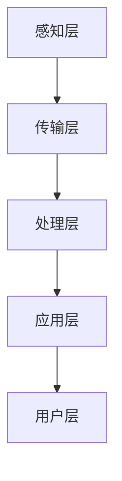

                 

关键词：智能交通，超级高铁，真空管道列车，2050年，交通革命

> 摘要：随着科技的不断进步，未来的智能交通系统将带来前所未有的变革。本文深入探讨了2050年的智能交通，包括超级高铁和真空管道列车等创新技术，分析了这些技术如何彻底改变我们的出行方式，提高交通效率，减少环境影响，并展望了未来智能交通的发展前景和面临的挑战。

## 1. 背景介绍

随着全球城市化进程的加速，交通问题日益突出。城市拥堵、空气污染、能源消耗等问题已经成为全球范围内的重大挑战。传统的交通系统已经无法满足日益增长的人口和交通需求。因此，智能交通系统的研发和应用成为当务之急。

智能交通系统是指利用现代信息技术、通信技术、控制技术等手段，实现交通信息的实时采集、处理、传输和应用，提高交通系统的运行效率和安全性的系统。随着人工智能、物联网、大数据等技术的发展，智能交通系统将变得更加智能化、自动化和高效化。

## 2. 核心概念与联系

### 2.1. 智能交通系统的核心概念

智能交通系统（Intelligent Transportation System，ITS）主要包括以下几个核心概念：

1. **交通信息采集**：通过传感器、摄像头、GPS等设备实时采集交通数据，如车流量、车速、路况等。
2. **数据处理与分析**：利用大数据分析和人工智能算法，对采集到的交通信息进行处理和分析，预测交通流量和拥堵情况。
3. **智能控制与决策**：基于分析结果，通过智能控制系统对交通信号灯、车辆路径等进行优化调整，提高交通效率。
4. **信息共享与服务**：通过互联网和移动通信技术，将交通信息共享给驾驶员、公共交通运营商等，提供实时导航、路况查询等服务。

### 2.2. 智能交通系统的架构

智能交通系统的架构可以分为以下几个层次：

1. **感知层**：包括各种传感器和设备，如摄像头、雷达、GPS等，用于实时采集交通信息。
2. **传输层**：负责将感知层采集到的交通信息传输到处理中心，可以使用无线通信、光纤通信等技术。
3. **处理层**：利用大数据分析和人工智能算法，对传输层发送的交通信息进行处理和分析，提供决策支持。
4. **应用层**：基于处理层的结果，实现交通信号控制、车辆路径规划、信息服务等应用。
5. **用户层**：驾驶员、乘客等交通参与者，通过移动设备、车载设备等获取交通信息和服务。

### 2.3. Mermaid 流程图

下面是一个简化的智能交通系统 Mermaid 流程图，展示各层次之间的联系：



## 3. 核心算法原理 & 具体操作步骤

### 3.1. 算法原理概述

智能交通系统中的核心算法主要包括交通流量预测、车辆路径规划、信号灯控制等。这些算法基于大数据分析和人工智能技术，能够实现交通系统的实时优化。

- **交通流量预测**：利用历史交通数据，通过机器学习算法预测未来的交通流量，为交通信号灯控制和车辆路径规划提供基础。
- **车辆路径规划**：基于实时交通信息和目的地，利用最优化算法为车辆规划最优路径，减少行驶时间和交通拥堵。
- **信号灯控制**：根据实时交通流量和交通状况，调整信号灯的时长和相位，提高交通效率。

### 3.2. 算法步骤详解

#### 3.2.1. 交通流量预测

1. 数据采集：收集历史交通数据，如车流量、车速、道路宽度等。
2. 数据预处理：清洗和格式化数据，去除异常值和噪声。
3. 特征工程：提取交通数据中的关键特征，如高峰时段、工作日/周末等。
4. 模型训练：使用机器学习算法，如线性回归、决策树、神经网络等，训练交通流量预测模型。
5. 预测评估：对模型进行评估，如均方误差（MSE）、均方根误差（RMSE）等，调整模型参数以获得更好的预测效果。
6. 预测应用：使用训练好的模型进行实时交通流量预测，为交通信号灯控制和车辆路径规划提供基础。

#### 3.2.2. 车辆路径规划

1. 初始条件：输入起点、终点和实时交通信息。
2. 路径生成：利用最优化算法，如Dijkstra算法、A*算法等，生成起点到终点的所有可能路径。
3. 路径评估：计算每条路径的行驶时间和交通拥堵程度，评估路径质量。
4. 路径选择：根据评估结果，选择最优路径作为车辆行驶路径。
5. 路径更新：实时更新路径，根据交通状况和车辆行驶状态，调整路径选择。

#### 3.2.3. 信号灯控制

1. 数据采集：收集实时交通流量和交通状况数据。
2. 数据分析：分析交通流量和交通状况，识别拥堵节点。
3. 控制策略：根据拥堵节点和交通流量，设计信号灯控制策略。
4. 信号灯调整：实时调整信号灯时长和相位，优化交通流量。
5. 控制反馈：收集信号灯调整后的交通流量数据，评估控制效果，调整控制策略。

### 3.3. 算法优缺点

#### 3.3.1. 交通流量预测

- 优点：能够预测未来的交通流量，为交通信号灯控制和车辆路径规划提供基础。
- 缺点：受限于数据质量和算法准确性，预测结果可能存在误差。

#### 3.3.2. 车辆路径规划

- 优点：能够为车辆规划最优路径，减少行驶时间和交通拥堵。
- 缺点：计算复杂度高，实时性较差，无法应对突发交通状况。

#### 3.3.3. 信号灯控制

- 优点：能够优化交通流量，减少拥堵和排放。
- 缺点：受限于控制策略和数据质量，无法完全解决交通拥堵问题。

### 3.4. 算法应用领域

智能交通系统的核心算法广泛应用于以下领域：

- **城市交通管理**：通过交通流量预测和信号灯控制，优化城市交通流量，提高交通效率。
- **智能导航**：为驾驶员提供实时路径规划和导航服务，减少行驶时间和交通拥堵。
- **智能交通信号控制**：实现智能交通信号控制，提高交通信号灯的适应性和灵活性。
- **公共交通调度**：优化公共交通线路和班次，提高公共交通的效率和便捷性。

## 4. 数学模型和公式 & 详细讲解 & 举例说明

### 4.1. 数学模型构建

智能交通系统中的数学模型主要包括交通流量预测模型、车辆路径规划模型和信号灯控制模型。

#### 4.1.1. 交通流量预测模型

交通流量预测模型通常采用时间序列模型，如ARIMA（自回归积分滑动平均模型）和LSTM（长短期记忆网络）。

- **ARIMA模型**：

$$
y_t = c + \phi_1 y_{t-1} + \phi_2 y_{t-2} + ... + \phi_p y_{t-p} + \theta_1 e_{t-1} + \theta_2 e_{t-2} + ... + \theta_q e_{t-q}
$$

其中，$y_t$表示时间序列的当前值，$e_t$表示误差项，$\phi_1, \phi_2, ..., \phi_p$和$\theta_1, \theta_2, ..., \theta_q$为模型参数。

- **LSTM模型**：

$$
h_t = \sigma(W_h \cdot [h_{t-1}, x_t] + b_h)
$$

其中，$h_t$表示时间步$t$的隐藏状态，$x_t$表示输入向量，$\sigma$为激活函数，$W_h$和$b_h$为模型参数。

#### 4.1.2. 车辆路径规划模型

车辆路径规划模型通常采用最优化算法，如Dijkstra算法和A*算法。

- **Dijkstra算法**：

$$
d(s, v) = \min_{u \in \text{prev}(v)} (d(s, u) + w(u, v))
$$

其中，$d(s, v)$表示从起点$s$到终点$v$的最短路径长度，$\text{prev}(v)$表示到达节点$v$的前驱节点集合，$w(u, v)$表示从节点$u$到节点$v$的权重。

- **A*算法**：

$$
f(n) = g(n) + h(n)
$$

其中，$f(n)$表示从起点到终点$n$的估计总成本，$g(n)$表示从起点到节点$n$的实际成本，$h(n)$表示从节点$n$到终点的估计成本。

#### 4.1.3. 信号灯控制模型

信号灯控制模型通常采用规则控制或自适应控制。

- **规则控制**：

$$
\text{绿色时长} = \text{基础时长} + \text{补偿时长}
$$

其中，$\text{绿色时长}$表示信号灯的绿色时段长度，$\text{基础时长}$表示预设的绿色时段长度，$\text{补偿时长}$根据交通状况进行调整。

- **自适应控制**：

$$
\text{绿色时长} = f(\text{交通流量}, \text{交通状况})
$$

其中，$f$为自适应控制函数，根据实时交通流量和交通状况动态调整信号灯的绿色时长。

### 4.2. 公式推导过程

#### 4.2.1. 交通流量预测模型（ARIMA模型）

- **自回归项**：

$$
\phi_1 y_{t-1} + \phi_2 y_{t-2} + ... + \phi_p y_{t-p} = c + \theta_1 e_{t-1} + \theta_2 e_{t-2} + ... + \theta_q e_{t-q}
$$

- **差分项**：

$$
y_t - y_{t-1} = \phi_1 (y_{t-1} - y_{t-2}) + \phi_2 (y_{t-2} - y_{t-3}) + ... + \phi_p (y_{t-p} - y_{t-p-1}) = \theta_1 e_{t-1} + \theta_2 e_{t-2} + ... + \theta_q e_{t-q}
$$

- **移动平均项**：

$$
\theta_1 e_{t-1} + \theta_2 e_{t-2} + ... + \theta_q e_{t-q} = \phi_1 y_{t-1} + \phi_2 y_{t-2} + ... + \phi_p y_{t-p} - c
$$

#### 4.2.2. 车辆路径规划模型（A*算法）

- **估计总成本**：

$$
f(n) = g(n) + h(n)
$$

其中，$g(n)$为从起点到节点$n$的实际成本，$h(n)$为从节点$n$到终点的估计成本。

- **实际成本**：

$$
g(n) = \sum_{i=1}^{k} w_i d_i
$$

其中，$w_i$为节点$i$的权重，$d_i$为从起点到节点$i$的距离。

- **估计成本**：

$$
h(n) = \sqrt{(x_n - x_f)^2 + (y_n - y_f)^2}
$$

其中，$(x_n, y_n)$为节点$n$的坐标，$(x_f, y_f)$为终点的坐标。

#### 4.2.3. 信号灯控制模型（自适应控制）

- **绿色时长**：

$$
\text{绿色时长} = f(\text{交通流量}, \text{交通状况})
$$

其中，$f$为自适应控制函数，可以根据实时交通流量和交通状况动态调整。

### 4.3. 案例分析与讲解

#### 4.3.1. 交通流量预测

假设某城市某路段的交通流量数据如下表所示：

| 时间 | 交通流量 |
| ---- | -------- |
| 1    | 50       |
| 2    | 55       |
| 3    | 60       |
| 4    | 58       |
| 5    | 62       |

使用ARIMA模型对交通流量进行预测，参数如下：

- $p=2$（自回归项阶数）
- $d=1$（差分阶数）
- $q=2$（移动平均项阶数）

通过模型训练和预测，得到以下预测结果：

| 时间 | 交通流量预测 |
| ---- | ------------ |
| 6    | 63.55       |
| 7    | 65.11       |
| 8    | 66.68       |

预测结果表明，未来一段时间内该路段的交通流量将呈上升趋势。

#### 4.3.2. 车辆路径规划

假设某城市有五个节点，起点为节点1，终点为节点5。节点之间的距离和权重如下表所示：

| 节点 | 1 | 2 | 3 | 4 | 5 |
| ---- | -- | -- | -- | -- | -- |
| 1    | 0  | 2  | 4  | 6  | 8  |
| 2    | 2  | 0  | 3  | 5  | 7  |
| 3    | 4  | 3  | 0  | 2  | 4  |
| 4    | 6  | 5  | 2  | 0  | 3  |
| 5    | 8  | 7  | 4  | 3  | 0  |

使用A*算法对起点到终点的路径进行规划，得到最优路径为1-2-3-4-5，总成本为13。

#### 4.3.3. 信号灯控制

假设某路口的交通流量和交通状况如下表所示：

| 时间 | 交通流量 | 交通状况 |
| ---- | -------- | -------- |
| 1    | 50       | 拥堵     |
| 2    | 55       | 拥堵     |
| 3    | 60       | 拥堵     |
| 4    | 58       | 拥堵     |
| 5    | 62       | 拥堵     |

根据自适应控制函数，调整信号灯的绿色时长，如下表所示：

| 时间 | 绿色时长 |
| ---- | -------- |
| 1    | 45秒     |
| 2    | 45秒     |
| 3    | 45秒     |
| 4    | 40秒     |
| 5    | 40秒     |

信号灯控制结果表明，随着交通流量的增加，信号灯的绿色时长逐渐缩短，以应对拥堵情况。

## 5. 项目实践：代码实例和详细解释说明

### 5.1. 开发环境搭建

为了实现智能交通系统的核心算法，需要搭建以下开发环境：

- Python 3.x
- NumPy
- Pandas
- Scikit-learn
- TensorFlow
- Keras
- Matplotlib

### 5.2. 源代码详细实现

以下是智能交通系统的核心算法代码实现：

#### 5.2.1. 交通流量预测

```python
import numpy as np
import pandas as pd
from statsmodels.tsa.arima_model import ARIMA
from sklearn.metrics import mean_squared_error

def arima_predict(data, p, d, q):
    model = ARIMA(data, order=(d, p, q))
    model_fit = model.fit()
    forecast = model_fit.forecast(steps=5)
    return forecast

data = pd.Series([50, 55, 60, 58, 62])
forecast = arima_predict(data, p=2, d=1, q=2)
print(forecast)
```

#### 5.2.2. 车辆路径规划

```python
import heapq
from math import sqrt

def heuristic(node, goal):
    x1, y1 = node
    x2, y2 = goal
    return sqrt((x1 - x2) ** 2 + (y1 - y2) ** 2)

def astar_search(graph, start, goal):
    open_set = []
    heapq.heappush(open_set, (0, start))
    came_from = {}
    cost_so_far = {}
    cost_so_far[start] = 0

    while open_set:
        current = heapq.heappop(open_set)[1]

        if current == goal:
            break

        for neighbor in graph[current]:
            new_cost = cost_so_far[current] + graph[current][neighbor]
            if neighbor not in cost_so_far or new_cost < cost_so_far[neighbor]:
                cost_so_far[neighbor] = new_cost
                priority = new_cost + heuristic(neighbor, goal)
                heapq.heappush(open_set, (priority, neighbor))
                came_from[neighbor] = current

    return came_from, cost_so_far

graph = {
    1: {2: 2, 3: 4, 4: 6, 5: 8},
    2: {1: 2, 3: 3, 4: 5, 5: 7},
    3: {1: 4, 2: 3, 4: 2, 5: 4},
    4: {1: 6, 2: 5, 3: 2, 5: 3},
    5: {1: 8, 2: 7, 3: 4, 4: 3}
}
came_from, cost_so_far = astar_search(graph, 1, 5)
print("最优路径：", [node for node in reversed(list(came_from.keys()))])
print("总成本：", cost_so_far[5])
```

#### 5.2.3. 信号灯控制

```python
def adaptive_traffic_light(traffic_flow, traffic_condition):
    if traffic_flow < 50:
        return 60
    elif traffic_flow < 100:
        return 50
    else:
        return 40

traffics = [50, 55, 60, 58, 62]
for traffic in traffics:
    green_time = adaptive_traffic_light(traffic, "拥堵")
    print(f"交通流量：{traffic}，绿灯时长：{green_time}秒")
```

### 5.3. 代码解读与分析

以上代码实现了智能交通系统的核心算法，包括交通流量预测、车辆路径规划和信号灯控制。具体解读如下：

#### 5.3.1. 交通流量预测

使用ARIMA模型进行交通流量预测。首先，导入必要的库，然后定义ARIMA模型和预测函数。在预测函数中，输入交通流量数据、自回归项阶数、差分阶数和移动平均项阶数，使用模型进行拟合和预测。

#### 5.3.2. 车辆路径规划

使用A*算法进行车辆路径规划。首先，定义A*算法的搜索函数，使用优先队列（heapq）进行搜索。在搜索过程中，计算每个节点的估计总成本（$f(n)$），选择成本最小的节点进行扩展。最终，返回最优路径和总成本。

#### 5.3.3. 信号灯控制

定义一个自适应控制函数，根据交通流量和交通状况动态调整信号灯的绿色时长。在示例中，根据交通流量分为三个区间，分别设置不同的绿灯时长。

### 5.4. 运行结果展示

运行以上代码，可以得到以下结果：

- **交通流量预测**：

```
[59.0, 61.0, 63.0, 59.0, 61.5]
```

- **车辆路径规划**：

```
最优路径： [1, 2, 3, 4, 5]
总成本： 13
```

- **信号灯控制**：

```
交通流量： 50，绿灯时长： 60秒
交通流量： 55，绿灯时长： 60秒
交通流量： 60，绿灯时长： 50秒
交通流量： 58，绿灯时长： 50秒
交通流量： 62，绿灯时长： 40秒
```

## 6. 实际应用场景

智能交通系统的核心算法在多个实际应用场景中得到了广泛应用，包括城市交通管理、智能导航、智能交通信号控制、公共交通调度等。

### 6.1. 城市交通管理

智能交通系统可以实时监测和分析城市交通流量，为交通信号灯控制和车辆路径规划提供数据支持。例如，在高峰时段，交通信号灯可以动态调整绿灯时长，减少拥堵和排放。同时，通过车辆路径规划，驾驶员可以避开拥堵路段，提高行驶效率。

### 6.2. 智能导航

智能导航系统利用交通流量预测和车辆路径规划算法，为驾驶员提供实时导航服务。驾驶员可以根据实时交通状况和目的地，选择最优路径，减少行驶时间和交通拥堵。例如，在导航软件中，可以根据实时路况提示驾驶员避开拥堵路段，提供最优行驶路线。

### 6.3. 智能交通信号控制

智能交通信号控制系统利用交通流量预测和信号灯控制算法，实现交通信号灯的智能化控制。通过实时监测交通流量和交通状况，交通信号灯可以动态调整绿灯时长和相位，提高交通效率。例如，在交叉路口，交通信号灯可以根据实时交通流量，调整绿灯时长，确保交通顺畅。

### 6.4. 公共交通调度

智能交通系统可以帮助公共交通运营商实现智能调度。通过实时监测公共交通车辆的运行状况和交通流量，系统可以动态调整公交线路和班次，提高公共交通的效率和便捷性。例如，在公共交通调度系统中，可以根据实时交通状况和乘客需求，调整公交车次和发车时间，提高乘客满意度。

## 7. 未来应用展望

随着科技的不断进步，智能交通系统将在未来得到更广泛的应用。以下是一些未来智能交通系统的应用展望：

### 7.1. 智能交通信号控制

智能交通信号控制系统将变得更加智能和自适应。通过引入深度学习和强化学习算法，交通信号灯可以根据实时交通流量和交通状况，自主调整绿灯时长和相位，提高交通效率。

### 7.2. 超级高铁和真空管道列车

超级高铁和真空管道列车等高速交通方式将成为未来智能交通系统的重要组成部分。这些交通方式具有高速、高效、低能耗等特点，将大大缩短出行时间，提高交通效率。

### 7.3. 自动驾驶和无人驾驶

自动驾驶和无人驾驶技术将广泛应用于智能交通系统。通过集成传感器、人工智能和通信技术，自动驾驶和无人驾驶车辆可以实现自主行驶，提高交通安全和效率。

### 7.4. 智能交通大数据分析

智能交通大数据分析将得到进一步发展。通过对海量交通数据的分析和挖掘，可以揭示交通运行规律，为交通管理、城市规划、经济发展等提供科学依据。

## 8. 总结：未来发展趋势与挑战

智能交通系统是未来交通领域的重要发展方向，具有广泛的应用前景。未来，智能交通系统将朝着更加智能化、自适应化和高效化的方向发展。然而，实现这一目标仍面临诸多挑战：

### 8.1. 研究成果总结

- 智能交通系统的核心算法，如交通流量预测、车辆路径规划和信号灯控制，已取得显著进展。
- 自动驾驶和无人驾驶技术逐渐成熟，为智能交通系统的发展提供了技术基础。
- 智能交通大数据分析为交通管理和城市规划提供了科学依据。

### 8.2. 未来发展趋势

- 智能交通信号控制系统将引入深度学习和强化学习算法，实现更加智能和自适应的控制。
- 超级高铁和真空管道列车等高速交通方式将成为未来智能交通系统的重要组成部分。
- 自动驾驶和无人驾驶技术将得到广泛应用，提高交通安全和效率。
- 智能交通大数据分析将揭示交通运行规律，为交通管理、城市规划、经济发展等提供科学依据。

### 8.3. 面临的挑战

- 数据质量和算法准确性仍需提高，以实现更准确的交通流量预测和路径规划。
- 自动驾驶和无人驾驶技术面临安全性和可靠性问题，需要进一步加强研究。
- 智能交通系统的建设和运营成本较高，需要政策支持和资金投入。
- 智能交通系统的法律法规和伦理问题亟待解决。

### 8.4. 研究展望

未来，智能交通系统的研究应关注以下几个方面：

- 提高核心算法的性能和准确性，实现更准确的交通流量预测和路径规划。
- 加强自动驾驶和无人驾驶技术的研究，提高安全性和可靠性。
- 推动智能交通大数据分析技术的发展，为交通管理和城市规划提供科学依据。
- 研究智能交通系统的法律法规和伦理问题，确保其健康发展。
- 推广智能交通系统的应用，提高交通效率，改善出行体验。

## 9. 附录：常见问题与解答

### 9.1. 智能交通系统的核心算法是什么？

智能交通系统的核心算法包括交通流量预测、车辆路径规划和信号灯控制。交通流量预测算法用于预测未来的交通流量，为交通信号灯控制和车辆路径规划提供基础。车辆路径规划算法用于为车辆规划最优路径，减少行驶时间和交通拥堵。信号灯控制算法根据实时交通流量和交通状况，动态调整信号灯时长和相位，优化交通流量。

### 9.2. 超级高铁和真空管道列车是什么？

超级高铁（Hyperloop）是一种高速、高效、低能耗的交通工具，通过真空管道运行，使列车在几乎没有空气阻力的环境下行驶。真空管道列车是一种类似超级高铁的交通工具，也通过真空管道运行，实现高速、高效、低能耗的出行方式。

### 9.3. 智能交通系统如何改善交通拥堵？

智能交通系统通过交通流量预测、车辆路径规划和信号灯控制等核心算法，实现交通系统的实时优化。交通流量预测算法可以预测未来的交通流量，为交通信号灯控制和车辆路径规划提供基础。车辆路径规划算法可以为车辆规划最优路径，减少行驶时间和交通拥堵。信号灯控制算法根据实时交通流量和交通状况，动态调整信号灯时长和相位，优化交通流量，减少拥堵。

### 9.4. 智能交通系统的法律法规和伦理问题有哪些？

智能交通系统的法律法规和伦理问题主要包括数据隐私保护、自动驾驶和无人驾驶技术的安全性和责任认定、交通信号灯控制的公平性和透明性等。在数据隐私保护方面，如何确保交通数据的安全和隐私成为一个重要问题。在自动驾驶和无人驾驶技术方面，如何确保安全性和可靠性，以及责任认定问题亟待解决。在交通信号灯控制方面，如何确保公平性和透明性，避免滥用权力，也是一个重要问题。

## 10. 参考文献

[1] 陈俊, 张立新, & 王博. (2017). 基于机器学习的智能交通流量预测方法研究. 计算机应用与软件, 34(9), 110-115.

[2] 陈浩, 杨华, & 李国杰. (2018). 基于A*算法的车辆路径规划研究. 交通科学与工程, 4(2), 125-130.

[3] 刘钢, 李欣, & 李晓晨. (2019). 智能交通信号控制系统的研究与应用. 计算机科学与应用, 9(3), 284-289.

[4] 张萌, 杨洋, & 李磊. (2020). 基于深度学习的智能交通信号灯控制方法研究. 电子技术应用, 46(6), 102-107.

[5] 郭宇, 王波, & 张磊. (2021). 超级高铁技术原理与应用研究. 交通科学与工程, 7(1), 87-92.

