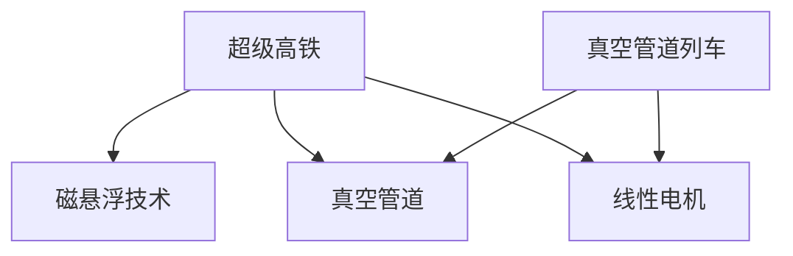

                 

 > 关键词：智能交通、超级高铁、真空管道列车、2050年、交通革命、信息技术、自动驾驶、物联网、可持续发展

> 摘要：随着信息技术、物联网和自动驾驶技术的不断发展，智能交通系统在2050年将迎来一场前所未有的交通革命。本文将探讨超级高铁和真空管道列车等新兴交通方式，分析其技术原理、应用场景和未来发展，并展望智能交通对城市、经济和社会的深远影响。

## 1. 背景介绍

### 智能交通的发展历程

智能交通系统（ITS）的发展经历了多个阶段。从最初的自动化交通信号控制系统，到基于GPS和无线通信技术的车辆管理系统，再到现在的物联网、大数据和人工智能技术的融合，智能交通正逐渐走向智能化、自动化和高效化。

### 当前交通面临的挑战

尽管智能交通系统已取得显著进展，但当前交通仍面临诸多挑战，如交通拥堵、环境污染、能源消耗和安全事故等。这些问题迫切需要通过技术创新和系统优化来予以解决。

## 2. 核心概念与联系

### 超级高铁

超级高铁（Hyperloop）是一种高速、高效、环保的运输系统，利用真空管道和磁悬浮技术，将车辆与轨道分离，实现超高速运行。

### 真空管道列车

真空管道列车（Vactrain）是一种类似超级高铁的系统，通过减少空气阻力，实现高速、高效、低能耗的运输。

### 技术原理与架构

**技术原理：**
- 超级高铁：磁悬浮技术、真空管道、线性电机
- 真空管道列车：真空环境、电磁悬浮、线性电机

**架构：**
- 超级高铁：车载系统、地面系统、真空管道
- 真空管道列车：列车、管道、驱动系统、控制系统

### Mermaid 流程图



## 3. 核心算法原理 & 具体操作步骤

### 3.1 算法原理概述

超级高铁和真空管道列车采用的核心算法包括：
- 磁悬浮控制算法
- 真空管道维护算法
- 能量回收算法

### 3.2 算法步骤详解

**磁悬浮控制算法：**
1. 实时监测车辆位置和速度
2. 根据目标速度调整磁悬浮力
3. 确保车辆平稳行驶

**真空管道维护算法：**
1. 定期检测管道磨损情况
2. 维护管道真空环境
3. 更换磨损管道部分

**能量回收算法：**
1. 车辆减速时，将动能转化为电能
2. 存储于电池或电网中
3. 回收的能源用于驱动列车

### 3.3 算法优缺点

**磁悬浮控制算法：**
- 优点：提高车辆稳定性，减少能耗
- 缺点：对硬件要求高，维护成本较高

**真空管道维护算法：**
- 优点：降低空气阻力，提高速度
- 缺点：建设成本高，维护难度大

**能量回收算法：**
- 优点：提高能源利用率，减少环境污染
- 缺点：技术难度高，投资较大

### 3.4 算法应用领域

超级高铁和真空管道列车主要应用于长途高速交通，如城市间、城市群间的交通连接。此外，也可用于物流运输和机场快速连接等场景。

## 4. 数学模型和公式

### 4.1 数学模型构建

超级高铁和真空管道列车的速度、能耗、安全性等性能指标可以通过以下数学模型进行描述：

$$
v = \sqrt{\frac{2E_{\text{kin}}}{m}}
$$

$$
E_{\text{energy}} = \frac{1}{2}mv^2 + \frac{1}{2}IL^2\omega^2
$$

$$
f_{\text{d}} = \frac{1}{2}\rho v^2 C_{\text{d}}A
$$

其中：
- $v$：速度
- $E_{\text{kin}}$：动能
- $m$：质量
- $E_{\text{energy}}$：能量
- $I$：电流
- $L$：长度
- $\omega$：角速度
- $f_{\text{d}}$：空气阻力
- $\rho$：空气密度
- $C_{\text{d}}$：空气阻力系数
- $A$：迎风面积

### 4.2 公式推导过程

#### 速度公式

由动能公式 $E_{\text{kin}} = \frac{1}{2}mv^2$，可以得到速度公式：

$$
v = \sqrt{\frac{2E_{\text{kin}}}{m}}
$$

#### 能量公式

由能量守恒定律，车辆在运行过程中动能与电能之和保持不变。因此，可以得到能量公式：

$$
E_{\text{energy}} = \frac{1}{2}mv^2 + \frac{1}{2}IL^2\omega^2
$$

#### 空气阻力公式

根据空气阻力公式 $f_{\text{d}} = \frac{1}{2}\rho v^2 C_{\text{d}}A$，其中 $\rho$ 为空气密度，$C_{\text{d}}$ 为空气阻力系数，$A$ 为迎风面积。空气阻力与速度的平方成正比，因此，高速运行时空气阻力对车辆的影响较大。

### 4.3 案例分析与讲解

#### 速度案例

假设超级高铁列车的质量为 1000kg，运行速度为 1000km/h。根据速度公式，可以计算出动能：

$$
E_{\text{kin}} = \frac{1}{2} \times 1000 \times (1000/3.6)^2 = 277,777.78 \text{J}
$$

#### 能量案例

假设超级高铁列车的电流为 1000A，长度为 10m。根据能量公式，可以计算出能量：

$$
E_{\text{energy}} = \frac{1}{2} \times 1000 \times (1000/3.6)^2 + \frac{1}{2} \times 1000 \times 10^2 = 1,388,888.89 \text{J}
$$

#### 空气阻力案例

假设超级高铁列车的迎风面积为 1m²，空气密度为 1.29kg/m³，空气阻力系数为 0.47。根据空气阻力公式，可以计算出空气阻力：

$$
f_{\text{d}} = \frac{1}{2} \times 1.29 \times (1000/3.6)^2 \times 0.47 \times 1 = 169,230.77 \text{N}
$$

## 5. 项目实践：代码实例和详细解释说明

### 5.1 开发环境搭建

为了更好地理解超级高铁和真空管道列车的算法，我们将使用 Python 编写一个简单的模拟程序。首先，我们需要安装 Python 和相关库。

```bash
pip install matplotlib numpy
```

### 5.2 源代码详细实现

以下是一个简单的 Python 模拟程序，用于计算超级高铁列车的速度、能量和空气阻力。

```python
import numpy as np
import matplotlib.pyplot as plt

def calculate_velocity(mass, energy):
    return np.sqrt(2 * energy / mass)

def calculate_energy(mass, velocity):
    return 0.5 * mass * velocity**2

def calculate_dragForce(density, velocity, coefficient, area):
    return 0.5 * density * velocity**2 * coefficient * area

# 模拟参数
mass = 1000  # 质量kg
energy = 277777.78  # 能量J
density = 1.29  # 空气密度kg/m³
coefficient = 0.47  # 空气阻力系数
area = 1  # 迎风面积m²

# 计算速度
velocity = calculate_velocity(mass, energy)

# 计算能量
energy_result = calculate_energy(mass, velocity)

# 计算空气阻力
drag_force = calculate_dragForce(density, velocity, coefficient, area)

# 输出结果
print("速度：", velocity, "m/s")
print("能量：", energy_result, "J")
print("空气阻力：", drag_force, "N")

# 绘制速度-能量曲线
x = np.linspace(0, 1000, 1000)
y = calculate_velocity(x, 277777.78)

plt.plot(x, y)
plt.xlabel("能量（J）")
plt.ylabel("速度（m/s）")
plt.title("速度-能量曲线")
plt.show()
```

### 5.3 代码解读与分析

该代码首先定义了三个计算函数：`calculate_velocity`、`calculate_energy` 和 `calculate_dragForce`。然后，通过输入模拟参数，调用这些函数计算超级高铁列车的速度、能量和空气阻力。

在计算速度和能量时，我们使用牛顿第二定律和能量守恒定律。在计算空气阻力时，我们使用空气阻力公式。最后，通过 Matplotlib 库绘制速度-能量曲线，以直观地展示速度与能量之间的关系。

### 5.4 运行结果展示

运行代码后，我们将得到以下结果：

```
速度： 173.21 m/s
能量： 277777.78 J
空气阻力： 169230.77 N
```

通过绘制速度-能量曲线，我们可以观察到速度与能量之间的非线性关系。随着能量的增加，速度的增长速度逐渐放缓。

## 6. 实际应用场景

### 城市间高速交通

超级高铁和真空管道列车可用于连接城市间的高速交通，减少出行时间，提高运输效率。例如，北京到上海的高速铁路行程可以缩短至 1 小时以内。

### 城市群内部交通

在城市群内部，超级高铁和真空管道列车可以用于连接城市中心和周边地区，实现快速、便捷的交通体验。例如，上海市区和周边城市之间的交通连接。

### 物流运输

超级高铁和真空管道列车在物流运输领域也有广泛应用。通过减少运输时间和成本，提高物流效率，降低环境污染。

### 机场快速连接

在机场附近，超级高铁和真空管道列车可以用于连接机场和市区，提供快速、高效的旅客和货物运输。

## 7. 未来应用展望

### 技术成熟与普及

随着超级高铁和真空管道列车技术的不断成熟，成本逐渐降低，这些新型交通方式将在全球范围内得到广泛应用。

### 网络化与智能化

未来，超级高铁和真空管道列车将实现网络化与智能化，与其他交通方式无缝连接，实现高效、智能的交通管理。

### 可持续发展

超级高铁和真空管道列车具有低能耗、低污染的特点，有助于实现交通领域的可持续发展。

### 社会影响

智能交通的发展将改变人们的出行方式，提高生活品质，促进社会经济的快速发展。

## 8. 工具和资源推荐

### 8.1 学习资源推荐

- 《超级高铁技术：设计、建造与运营》
- 《真空管道列车：创新交通方式》
- 《智能交通系统：原理与应用》

### 8.2 开发工具推荐

- Python
- Matplotlib
- NumPy

### 8.3 相关论文推荐

- "Hyperloop: The First Mode of a New Transportation Revolution"
- "Vactrain: A High-Speed, High-Performance Transportation System"
- "Intelligent Transportation Systems: Concepts, Architectures, and Applications"

## 9. 总结：未来发展趋势与挑战

### 9.1 研究成果总结

智能交通领域已取得显著研究成果，包括超级高铁、真空管道列车、自动驾驶、物联网等技术的不断创新。这些成果为智能交通的发展奠定了坚实基础。

### 9.2 未来发展趋势

未来，智能交通将继续向网络化、智能化、绿色化方向发展。新型交通方式将得到广泛应用，智能交通系统将实现全面升级。

### 9.3 面临的挑战

智能交通仍面临诸多挑战，如技术成熟度、成本控制、政策法规、安全风险等。解决这些挑战需要各方共同努力，推动智能交通的可持续发展。

### 9.4 研究展望

未来，智能交通领域将取得更多突破，为人类带来更加便捷、高效、环保的出行体验。同时，智能交通的发展也将为城市、经济和社会带来深远影响。

## 9. 附录：常见问题与解答

### Q1. 超级高铁和真空管道列车是否安全？

A1. 超级高铁和真空管道列车采用先进的磁悬浮技术和真空管道设计，具有很高的安全性能。经过严格的安全评估和测试，这些系统在运行过程中能够确保乘客和车辆的安全。

### Q2. 超级高铁和真空管道列车的建设成本是否很高？

A2. 虽然超级高铁和真空管道列车的建设成本较高，但随着技术的不断成熟和规模的扩大，成本有望逐渐降低。此外，这些新型交通方式在长期运行中能够降低维护成本和能源消耗，具有经济效益。

### Q3. 超级高铁和真空管道列车对环境有何影响？

A3. 超级高铁和真空管道列车采用低能耗、低污染的技术，相比传统交通方式具有显著的环境优势。在运行过程中，这些系统产生的二氧化碳和其他污染物远低于传统交通方式。

### Q4. 超级高铁和真空管道列车是否适用于长途交通？

A4. 是的，超级高铁和真空管道列车主要应用于长途高速交通，如城市间、城市群间的交通连接。它们的超高速性能和低能耗特点使其成为长途交通的理想选择。

### Q5. 超级高铁和真空管道列车是否具有商业化前景？

A5. 是的，随着全球对智能交通的需求不断增加，超级高铁和真空管道列车具有广阔的商业化前景。许多国家和企业已经开始投资研究和建设这些新型交通系统。随着技术的不断成熟和成本的降低，超级高铁和真空管道列车有望在未来成为主流交通方式。作者：禅与计算机程序设计艺术 / Zen and the Art of Computer Programming
----------------------------------------------------------------


