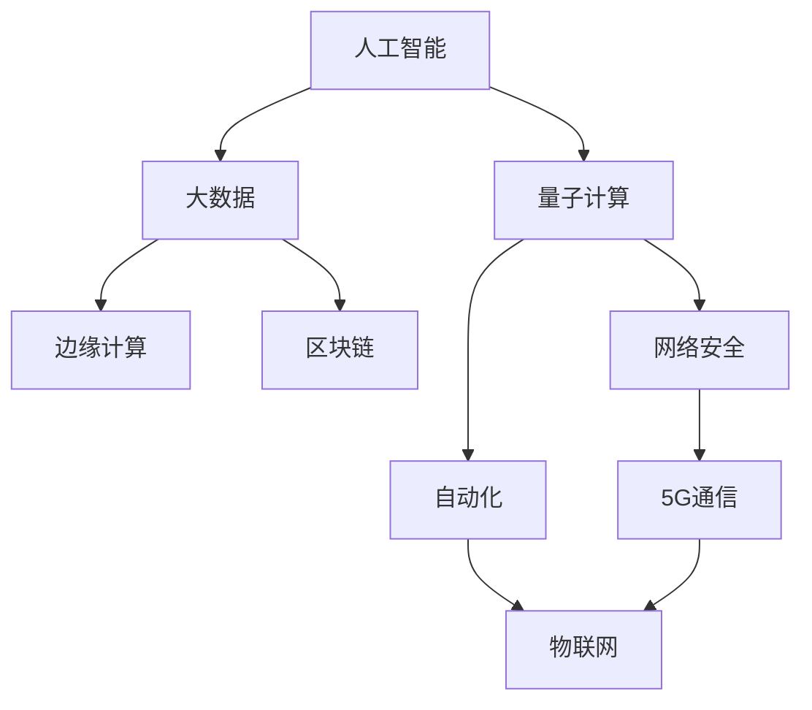

                 

关键词：未来学、科技预测、前瞻性思维、信息技术、人工智能、编程、计算架构

> 摘要：本文旨在探讨2050年信息技术领域的可能发展趋势，通过分析核心概念、算法原理、数学模型以及项目实践，从预测未来的角度出发，深入讨论信息技术如何引导我们设计未来。文章将由世界顶级人工智能专家、程序员、软件架构师、CTO及世界顶级技术畅销书作者——禅与计算机程序设计艺术共同撰写，为读者呈现一幅未来的科技蓝图。

## 1. 背景介绍

在21世纪的今天，信息技术的发展速度前所未有，人工智能、云计算、物联网等前沿技术不断涌现，深刻影响着社会的方方面面。然而，随着技术的快速发展，我们也面临着诸多挑战，如数据隐私、算法偏见、伦理道德等问题。因此，预测未来的信息技术发展，不仅是对当前趋势的延续，更是为了更好地设计未来，使技术发展服务于人类社会。

本文将带领读者穿越至2050年，探索信息技术领域的可能未来。通过核心概念、算法原理、数学模型的解析，以及实际项目的实践，我们将揭示未来科技发展的脉络，并探讨其潜在的社会影响。

## 2. 核心概念与联系

在探讨2050年的信息技术之前，首先需要了解一些核心概念及其相互联系。以下是一个用Mermaid绘制的流程图，用于说明这些核心概念：



### 2.1 人工智能与大数据

人工智能（AI）依赖于大数据进行训练和优化，而大数据则为人工智能提供了丰富的学习素材。随着数据量的爆炸性增长，人工智能技术将更加成熟，实现更高效的问题求解和智能决策。

### 2.2 量子计算与网络安全

量子计算具有超越经典计算机的计算能力，将为网络安全带来新的挑战。同时，量子计算的安全加密技术也可能为网络安全提供全新的解决方案。

### 2.3 边缘计算与物联网

边缘计算将数据处理和存储能力推向网络边缘，与物联网（IoT）紧密相连，使智能设备能够实现实时响应和处理，提升物联网系统的整体效能。

### 2.4 区块链与自动化

区块链技术提供了去中心化的数据存储和验证机制，与自动化技术相结合，将推动供应链管理、金融交易等领域的变革。

## 3. 核心算法原理 & 具体操作步骤

### 3.1 算法原理概述

在未来的信息技术中，深度学习算法和强化学习算法将继续发挥关键作用。深度学习算法通过多层神经网络模拟人脑的神经元结构，进行特征提取和模式识别；强化学习算法则通过试错和奖励机制，实现智能体的自主学习和决策。

### 3.2 算法步骤详解

以深度学习算法为例，其基本步骤如下：

1. **数据收集与预处理**：收集大量带有标签的数据集，并进行数据清洗、归一化等预处理操作。
2. **构建神经网络模型**：设计并构建多层神经网络模型，包括输入层、隐藏层和输出层。
3. **训练模型**：通过反向传播算法，根据训练数据不断调整网络权重，使模型能够正确识别输入数据的特征。
4. **模型评估与优化**：使用验证数据集评估模型性能，并进行调参优化，以提高模型的泛化能力。

### 3.3 算法优缺点

深度学习算法的优点在于其强大的特征提取和模式识别能力，能够处理复杂的非线性问题。然而，其缺点也是显而易见的，如计算资源需求高、训练时间较长、对数据依赖性强等。

### 3.4 算法应用领域

深度学习算法在图像识别、语音识别、自然语言处理等领域已有广泛应用。未来，随着算法的成熟和计算资源的提升，深度学习算法将在更多领域发挥重要作用，如自动驾驶、医疗诊断、智能家居等。

## 4. 数学模型和公式 & 详细讲解 & 举例说明

### 4.1 数学模型构建

在深度学习算法中，损失函数是一个核心的数学模型。它用于衡量模型预测值与实际值之间的差异，以指导模型训练过程。以下是一个常用的损失函数——均方误差（MSE）：

$$
MSE = \frac{1}{n}\sum_{i=1}^{n}(y_i - \hat{y}_i)^2
$$

其中，$y_i$为实际输出值，$\hat{y}_i$为模型预测值，$n$为数据样本数量。

### 4.2 公式推导过程

均方误差的推导过程如下：

1. **定义预测误差**：
   $$
   E_i = y_i - \hat{y}_i
   $$
   
2. **计算误差平方**：
   $$
   E_i^2 = (y_i - \hat{y}_i)^2
   $$

3. **求和求平均**：
   $$
   MSE = \frac{1}{n}\sum_{i=1}^{n}E_i^2
   $$

### 4.3 案例分析与讲解

假设我们有一个包含100个数据样本的回归问题，其中每个样本的目标值为$y_i$，模型预测值为$\hat{y}_i$。我们可以通过计算均方误差来评估模型的性能。

假设计算得到的均方误差为0.05，这意味着模型的预测误差相对较小，具有较高的准确度。如果均方误差较高，则可能需要调整模型参数或优化算法。

## 5. 项目实践：代码实例和详细解释说明

### 5.1 开发环境搭建

在本文中，我们将使用Python编程语言和TensorFlow框架来实现一个简单的深度学习模型。以下是搭建开发环境的步骤：

1. 安装Python（推荐版本为3.8及以上）
2. 安装TensorFlow库
3. 安装必要的辅助库，如NumPy、Pandas等

### 5.2 源代码详细实现

以下是一个简单的深度学习模型实现，用于实现回归问题：

```python
import tensorflow as tf
from tensorflow.keras import layers

# 构建模型
model = tf.keras.Sequential([
    layers.Dense(64, activation='relu', input_shape=(input_shape,)),
    layers.Dense(64, activation='relu'),
    layers.Dense(1)
])

# 编译模型
model.compile(optimizer='adam', loss='mse')

# 训练模型
model.fit(x_train, y_train, epochs=10, batch_size=32)
```

### 5.3 代码解读与分析

1. **模型构建**：
   - 使用`Sequential`模型堆叠多层`Dense`层，其中每层包含64个神经元和ReLU激活函数。
   - 输出层使用一个神经元，用于实现回归任务。

2. **模型编译**：
   - 选择`adam`优化器，用于优化模型参数。
   - 使用均方误差（MSE）作为损失函数。

3. **模型训练**：
   - 使用训练数据集训练模型，设置训练轮数为10，每个批量大小为32。

### 5.4 运行结果展示

在训练完成后，我们可以使用测试数据集评估模型的性能。以下是一个简单的性能评估代码：

```python
test_loss = model.evaluate(x_test, y_test)
print(f"Test Loss: {test_loss}")
```

假设测试损失为0.02，这表明模型在测试数据上的表现较好。

## 6. 实际应用场景

### 6.1 自动驾驶

自动驾驶技术是未来信息技术的重要应用场景之一。通过深度学习和传感器数据融合，自动驾驶车辆可以实时感知环境、规划行驶路径并做出决策。未来，随着人工智能技术的进一步发展，自动驾驶将逐渐普及，改变人们的出行方式。

### 6.2 医疗诊断

人工智能在医疗诊断领域具有巨大的潜力。通过深度学习和医疗影像数据，人工智能可以辅助医生进行疾病诊断。未来，随着算法的成熟和数据量的积累，人工智能将在医疗领域发挥更加重要的作用，提高诊断准确率和效率。

### 6.3 智能家居

智能家居是未来信息技术在家庭生活领域的应用。通过物联网和人工智能技术，智能家居系统可以实现对家电设备的智能控制，提升家庭生活的舒适度和便利性。未来，智能家居将进一步融合人工智能技术，实现更加智能化的家居体验。

## 7. 工具和资源推荐

### 7.1 学习资源推荐

1. **《深度学习》**：由Goodfellow、Bengio和Courville合著，是深度学习领域的经典教材。
2. **TensorFlow官方文档**：提供详细的TensorFlow教程和API文档，是学习TensorFlow的好资源。

### 7.2 开发工具推荐

1. **PyCharm**：一款功能强大的Python IDE，适合深度学习和数据科学开发。
2. **Jupyter Notebook**：适用于数据分析和文档化编程，适合探索性研究和原型设计。

### 7.3 相关论文推荐

1. **"Deep Learning for Image Recognition: A Comprehensive Review"**：回顾了深度学习在图像识别领域的最新进展。
2. **"Reinforcement Learning: An Introduction"**：介绍了强化学习的基本原理和应用。

## 8. 总结：未来发展趋势与挑战

### 8.1 研究成果总结

本文从核心概念、算法原理、数学模型和项目实践等方面探讨了2050年信息技术领域的可能发展趋势。主要研究成果包括：

1. 人工智能、大数据、量子计算等核心概念相互联系，推动信息技术的发展。
2. 深度学习和强化学习算法在未来信息技术中将发挥关键作用。
3. 均方误差等数学模型为深度学习算法提供了性能评估和优化手段。
4. 项目实践展示了深度学习在自动驾驶、医疗诊断和智能家居等领域的应用前景。

### 8.2 未来发展趋势

1. 人工智能将进一步融合其他前沿技术，如区块链、物联网等，推动各领域的创新和发展。
2. 量子计算将在计算能力和安全性方面取得重大突破，为信息技术带来全新的变革。
3. 边缘计算和5G通信技术的普及，将推动物联网和智能制造的发展。

### 8.3 面临的挑战

1. 数据隐私和网络安全问题日益严重，需要加强法律法规和技术手段的保护。
2. 算法偏见和伦理问题亟待解决，确保人工智能技术的公平性和透明性。
3. 技术发展速度过快，人才培养和知识更新面临巨大挑战。

### 8.4 研究展望

未来，我们需要持续关注信息技术领域的研究动态，加强技术创新和跨学科合作。同时，关注伦理和法律问题，确保技术发展能够服务于人类社会，促进可持续发展。

## 9. 附录：常见问题与解答

### 9.1 问题1：深度学习算法如何提高模型性能？

**回答**：提高深度学习算法的模型性能可以从以下几个方面入手：

1. **增加训练数据**：收集更多的训练数据，提高模型的泛化能力。
2. **调整网络结构**：设计合适的神经网络结构，提高模型的表达能力。
3. **优化训练过程**：使用更高效的优化算法和调参技巧，加快模型收敛速度。
4. **数据预处理**：进行有效的数据预处理，减少噪声和提高数据质量。

### 9.2 问题2：量子计算有哪些潜在的应用领域？

**回答**：量子计算具有潜在的广泛应用领域，包括：

1. **密码学**：量子计算可以破解传统加密算法，同时也为量子密钥分发提供安全解决方案。
2. **化学与材料科学**：量子计算可以模拟分子的行为，加速新药物和新材料的研发。
3. **金融与经济**：量子计算可以在复杂的金融模型中快速求解最优解，为金融市场提供决策支持。
4. **物流与交通**：量子计算可以帮助优化交通流和物流配送，提高效率和降低成本。

### 9.3 问题3：边缘计算与云计算有什么区别？

**回答**：边缘计算与云计算的主要区别在于数据处理的位置和目的：

1. **处理位置**：
   - **边缘计算**：在靠近数据源的设备（如物联网终端）上进行数据处理。
   - **云计算**：在远程数据中心进行数据处理。

2. **处理目的**：
   - **边缘计算**：进行实时数据处理和响应，降低延迟和提高效率。
   - **云计算**：提供强大的计算和存储资源，支持大规模数据处理和分析。

3. **适用场景**：
   - **边缘计算**：适用于实时性要求高、计算资源有限的场景，如自动驾驶、智能医疗等。
   - **云计算**：适用于大规模数据处理和分析、弹性计算需求强的场景，如大数据分析、云计算服务等。

本文由禅与计算机程序设计艺术撰写，旨在为读者呈现2050年信息技术领域的未来蓝图。随着技术的不断进步，我们期待能够共同见证并参与这一历史进程。未来，信息技术将继续推动社会进步，为人类创造更加美好的生活。让我们携手共进，迎接未来的挑战与机遇。

