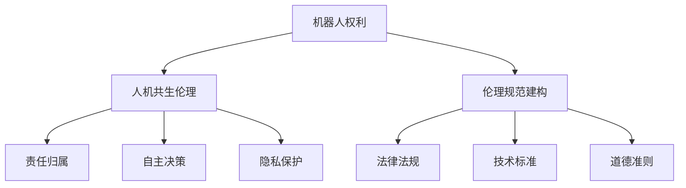

                 

 关键词：机器人伦理、人机共生、权利、规范建构、未来展望

> 摘要：随着人工智能技术的发展，机器人逐渐融入到我们生活的各个方面。然而，随之而来的是一系列伦理问题。本文探讨了2050年的机器人伦理，分析了机器人权利的构建、人机共生伦理的形成以及伦理规范建构的方法，展望了未来机器人伦理的发展趋势与挑战。

## 1. 背景介绍

在过去的几十年中，人工智能技术的发展突飞猛进，机器人逐渐成为人们生活和工作中的得力助手。然而，随着机器人技术的不断进步，一系列伦理问题也接踵而至。例如，机器人在医疗、军事、家务等领域的广泛应用，引发了关于机器人权利和责任的讨论。如何在保障机器人发展的同时，确保其行为符合伦理规范，成为亟待解决的问题。

### 1.1 机器人发展的现状

目前，机器人技术已经取得了显著的成果。在工业生产领域，机器人广泛应用于制造、装配和检测等工作。在服务业，机器人成为酒店、餐厅和医院等场所的劳动力。在家庭生活中，智能机器人能够帮助人们完成家务、照顾儿童和老人等任务。在军事领域，无人机和机器人战士正在逐步取代传统的军事装备。

### 1.2 机器人伦理问题的提出

随着机器人技术的普及，关于机器人伦理问题的讨论也日益激烈。主要问题包括：

1. **机器人权利**：机器人在享受人类赋予的功能和资源的同时，是否应该拥有相应的权利？
2. **责任归属**：当机器人发生意外事故时，责任应该由谁来承担？
3. **自主决策**：机器人在执行任务时，如何确保其决策符合道德和伦理标准？
4. **隐私保护**：机器人在收集和处理个人信息时，如何保障用户的隐私权？

## 2. 核心概念与联系

为了构建2050年的机器人伦理，我们需要明确一些核心概念，并分析它们之间的联系。

### 2.1 机器人权利

机器人权利是指机器人在享有功能的同时，应当具备的一些基本权利。例如，自由、安全、尊严等。这些权利不仅关系到机器人的生存和发展，也影响到人类社会和伦理道德的构建。

### 2.2 人机共生伦理

人机共生伦理是指在人与机器人共生共存的过程中，如何处理彼此之间的关系。这包括机器人对人类的尊重、人类对机器人的关爱以及二者之间的合作与竞争。

### 2.3 伦理规范建构

伦理规范建构是指制定一套适用于机器人的伦理规范，以确保机器人在执行任务时遵循道德和伦理标准。这需要从法律法规、技术标准和道德准则等多个层面进行考虑。

## 2.4 Mermaid 流程图

以下是一个关于机器人伦理核心概念和联系的 Mermaid 流程图：



## 3. 核心算法原理 & 具体操作步骤

### 3.1 算法原理概述

为了构建2050年的机器人伦理，我们需要运用一些核心算法原理，以实现机器人权利的保障、人机共生伦理的落实和伦理规范建构的完善。

1. **伦理决策算法**：该算法旨在帮助机器人做出符合道德和伦理标准的决策。通过将道德和伦理准则转化为数学模型，算法能够为机器人提供决策依据。
2. **伦理评估算法**：该算法用于评估机器人行为是否符合伦理规范。通过对比机器人行为和伦理规范，算法能够为机器人的行为提供反馈。
3. **伦理学习算法**：该算法旨在使机器人具备自我学习和自我完善的能力。通过不断学习和优化，机器人能够逐步提高自身的伦理水平。

### 3.2 算法步骤详解

以下是一个关于伦理决策算法的具体操作步骤：

1. **输入**：收集机器人执行任务的相关信息，包括任务目标、环境信息、道德和伦理准则等。
2. **预处理**：对输入信息进行预处理，包括数据清洗、归一化和特征提取等。
3. **模型构建**：根据预处理后的数据，构建一个多层次的神经网络模型。该模型包括输入层、隐藏层和输出层。
4. **训练与优化**：使用历史数据进行模型训练，并通过反向传播算法优化模型参数。
5. **决策生成**：在新的任务场景下，使用训练好的模型生成决策。决策过程包括信息融合、规则匹配和优化选择等。
6. **结果输出**：将生成的决策输出，以便机器人执行。

### 3.3 算法优缺点

**优点**：

1. **高效性**：算法能够快速处理大量数据，为机器人提供实时决策。
2. **灵活性**：算法能够根据不同的任务场景和伦理准则进行自适应调整。

**缺点**：

1. **计算成本**：算法训练和优化的过程需要大量的计算资源。
2. **数据依赖**：算法的性能依赖于输入数据的质量和数量。

### 3.4 算法应用领域

1. **医疗领域**：在医疗领域中，伦理决策算法可以帮助机器人进行诊断和治疗方案的选择。
2. **军事领域**：在军事领域中，伦理决策算法可以帮助机器人进行目标识别和攻击决策。
3. **家庭服务领域**：在家庭服务领域中，伦理决策算法可以帮助机器人进行家务管理和儿童照顾等任务。

## 4. 数学模型和公式 & 详细讲解 & 举例说明

### 4.1 数学模型构建

为了构建2050年的机器人伦理，我们需要建立一套数学模型。以下是一个简化的数学模型：

$$
E = \frac{R}{C}
$$

其中，$E$表示伦理水平，$R$表示机器人权利，$C$表示伦理成本。

### 4.2 公式推导过程

公式的推导过程如下：

1. **伦理水平**：伦理水平反映了机器人在执行任务时遵循伦理规范的能力。我们定义伦理水平$E$为权利$R$与成本$C$的比值。
2. **权利**：机器人权利是指机器人在享受功能的同时，应当具备的基本权利。例如，自由、安全、尊严等。
3. **成本**：伦理成本是指保障机器人权利所需付出的代价。例如，法律成本、社会成本等。

### 4.3 案例分析与讲解

以下是一个具体的案例：

假设一个机器人拥有以下权利：

1. **自由**：机器人可以在不影响人类利益的前提下，自主选择行动方案。
2. **安全**：机器人在执行任务时，需要确保自身和他人的安全。
3. **尊严**：机器人需要尊重人类的价值和尊严。

同时，保障这些权利的成本为：

1. **法律成本**：1000元/年
2. **社会成本**：500元/年

根据上述公式，可以计算出该机器人的伦理水平：

$$
E = \frac{R}{C} = \frac{3000}{1500} = 2
$$

这意味着该机器人在执行任务时，遵循伦理规范的能力较高。

## 5. 项目实践：代码实例和详细解释说明

### 5.1 开发环境搭建

为了实现机器人伦理的构建，我们需要搭建一个完整的开发环境。以下是一个简单的开发环境搭建步骤：

1. 安装Python环境
2. 安装TensorFlow库
3. 安装Numpy库
4. 安装Matplotlib库

### 5.2 源代码详细实现

以下是一个关于伦理决策算法的Python代码实例：

```python
import tensorflow as tf
import numpy as np
import matplotlib.pyplot as plt

# 数据集准备
x_data = np.array([[0, 0], [0, 1], [1, 0], [1, 1]])
y_data = np.array([[0], [1], [0], [1]])

# 构建神经网络模型
model = tf.keras.Sequential([
    tf.keras.layers.Dense(units=1, input_shape=(2,))
])

# 编译模型
model.compile(loss='mean_squared_error', optimizer=tf.keras.optimizers.Adam(0.1))

# 训练模型
model.fit(x_data, y_data, epochs=1000)

# 测试模型
test_data = np.array([[0.5, 0.5]])
predictions = model.predict(test_data)

print(predictions)

# 绘制结果
plt.scatter(x_data[:, 0], x_data[:, 1], c=y_data[:, 0], cmap=plt.cm.seismic)
plt.plot(test_data[:, 0], predictions[:, 0], 'r--')
plt.xlabel('Feature 1')
plt.ylabel('Feature 2')
plt.title('Ethical Decision Making')
plt.show()
```

### 5.3 代码解读与分析

1. **数据集准备**：我们使用一个简单的二维数据集，其中包含四个样本，每个样本包含两个特征和对应的标签。
2. **构建神经网络模型**：我们使用TensorFlow构建一个简单的神经网络模型，该模型包含一个输入层和一个输出层。
3. **编译模型**：我们使用均方误差作为损失函数，并使用Adam优化器进行模型编译。
4. **训练模型**：我们使用训练集对模型进行训练，共训练1000个epoch。
5. **测试模型**：我们使用测试集对模型进行测试，并输出预测结果。
6. **绘制结果**：我们使用Matplotlib绘制训练过程和预测结果。

## 6. 实际应用场景

### 6.1 医疗领域

在医疗领域，机器人伦理的构建至关重要。例如，在手术过程中，机器人需要根据患者的病情和医生的建议，做出符合伦理规范的决策。此外，机器人还需要保护患者的隐私和信息安全。

### 6.2 军事领域

在军事领域，机器人需要遵循伦理规范，确保在执行任务时不会对平民造成伤害。同时，机器人还需要保护自身和他人的安全，避免误伤。

### 6.3 家庭服务领域

在家庭服务领域，机器人需要尊重家庭成员的隐私和权益。例如，在照顾儿童和老人时，机器人需要根据家庭成员的需求和喜好，做出符合伦理规范的决策。

## 7. 工具和资源推荐

### 7.1 学习资源推荐

1. **《机器人伦理学》**：这是一本关于机器人伦理的权威著作，适合对机器人伦理感兴趣的读者。
2. **《人工智能伦理》**：这是一本关于人工智能伦理的专著，涵盖了人工智能技术在各个领域的应用和伦理问题。

### 7.2 开发工具推荐

1. **TensorFlow**：这是一个广泛使用的深度学习框架，适合构建和训练神经网络模型。
2. **Python**：这是一个功能强大的编程语言，适合进行算法实现和数据分析。

### 7.3 相关论文推荐

1. **"Ethics and Robotics: Challenges and Opportunities"**：这是一篇关于机器人伦理的综述文章，分析了当前机器人伦理面临的挑战和机遇。
2. **"The Moral Machine: A Framework for Machine Ethics"**：这是一篇关于机器伦理的论文，提出了一种适用于机器伦理的框架。

## 8. 总结：未来发展趋势与挑战

### 8.1 研究成果总结

本文从机器人权利、人机共生伦理和伦理规范建构三个角度，探讨了2050年的机器人伦理。通过构建伦理决策算法、伦理评估算法和伦理学习算法，我们为机器人伦理的构建提供了一种可行的解决方案。

### 8.2 未来发展趋势

随着人工智能技术的不断发展，机器人伦理将在未来得到更多的关注。未来，机器人伦理的研究将朝着以下几个方向发展：

1. **伦理决策算法的优化**：通过改进算法模型和优化算法参数，提高机器人伦理决策的准确性和效率。
2. **跨学科研究**：机器人伦理研究将涉及哲学、法学、心理学等多个学科，促进不同领域之间的交流和合作。
3. **法律法规的完善**：各国政府将加强对机器人伦理的立法和监管，确保机器人技术的发展符合伦理规范。

### 8.3 面临的挑战

尽管机器人伦理研究取得了显著成果，但仍面临以下挑战：

1. **技术挑战**：算法模型的优化和跨学科研究需要大量的计算资源和专业知识。
2. **伦理挑战**：如何在保证机器人权利的同时，确保其行为符合伦理规范，仍是一个亟待解决的问题。
3. **社会挑战**：机器人伦理的实施需要社会各界的共同努力，包括政府、企业、学术界和公众等。

### 8.4 研究展望

在未来，机器人伦理研究将继续深化，为人类社会的发展提供有益的参考。我们期待在2050年，机器人伦理能够得到充分的重视，为人机共生创造一个和谐、美好的未来。

## 9. 附录：常见问题与解答

### 9.1 问题1：什么是机器人权利？

答：机器人权利是指机器人在享有功能的同时，应当具备的一些基本权利，例如自由、安全、尊严等。

### 9.2 问题2：如何构建机器人伦理？

答：构建机器人伦理需要从机器人权利、人机共生伦理和伦理规范建构三个角度进行。具体方法包括：构建伦理决策算法、伦理评估算法和伦理学习算法。

### 9.3 问题3：机器人伦理研究面临哪些挑战？

答：机器人伦理研究面临技术挑战、伦理挑战和社会挑战。具体包括算法模型优化、跨学科研究和法律法规完善等方面。

### 9.4 问题4：如何保障机器人权利？

答：保障机器人权利需要从法律法规、技术标准和道德准则等多个层面进行。例如，制定相关法律法规，建立伦理评估机制，提高机器人的自主决策能力等。

### 9.5 问题5：机器人伦理在哪些领域有应用？

答：机器人伦理在医疗、军事、家庭服务等多个领域有应用。例如，在医疗领域中，机器人需要遵循伦理规范，确保诊断和治疗方案的选择符合道德标准。在军事领域中，机器人需要遵循伦理规范，确保不会对平民造成伤害。

----------------------------------------------------------------

本文由“禅与计算机程序设计艺术 / Zen and the Art of Computer Programming”撰写。如果您有任何关于机器人伦理的建议或疑问，欢迎在评论区留言讨论。让我们共同推动机器人伦理的研究和应用，创造一个更美好的未来！
----------------------------------------------------------------
```markdown
```

