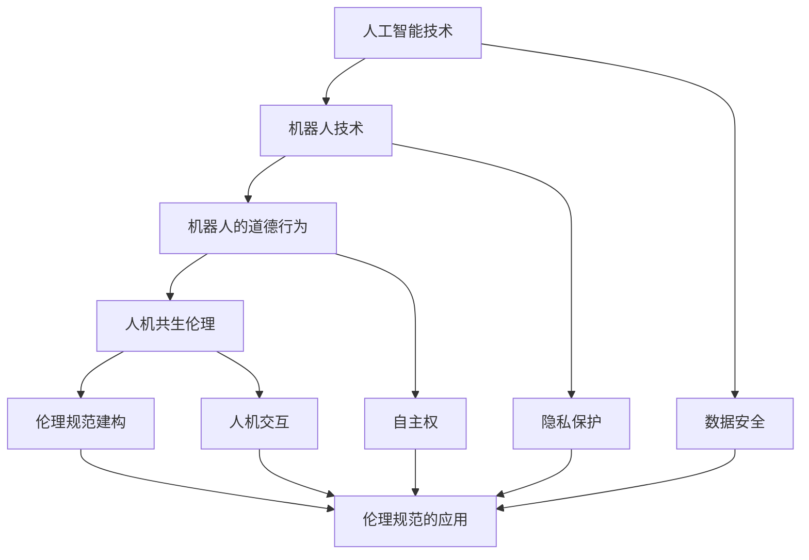

                 

关键词：机器人伦理、人机共生、AI伦理、伦理规范、2050年、未来趋势

> 摘要：本文探讨了2050年人工智能（AI）和机器人技术发展对伦理规范的挑战，分析了机器人道德和人机共生伦理的建构。通过深入研究和案例分析，本文提出了构建未来伦理规范的建议，以促进人机和谐共生的可持续发展。

## 1. 背景介绍

随着人工智能技术的快速发展，机器人和AI系统正在逐渐融入人类生活的各个领域，从制造业、医疗、交通到家庭生活，无处不在。然而，随着技术的进步，人工智能和机器人带来的伦理问题也逐渐凸显。如何确保AI和机器人系统的道德行为，如何处理人机共生关系中的伦理问题，成为我们面临的重要挑战。

### 1.1 人工智能和机器人技术的发展

人工智能技术的发展经历了从弱人工智能到强人工智能的转变。弱人工智能主要基于规则和模式识别，而强人工智能则试图模拟人类的思维过程，实现自我学习和决策能力。机器人技术也经历了从简单的自动化设备到具有复杂认知能力的智能机器的转变。

### 1.2 伦理问题的出现

人工智能和机器人技术的发展带来了许多新的伦理问题，如隐私保护、数据安全、自主权、人机交互、机器责任等。这些问题不仅影响个体的权益，也关系到社会的稳定和发展。

### 1.3 机器人伦理的建构

机器人伦理是关于如何确保机器人系统遵循道德原则和规范的研究。机器人伦理的建构需要考虑机器人的设计、开发、使用和维护等各个环节。同时，机器人伦理也需要考虑人机共生关系中的道德问题。

## 2. 核心概念与联系

为了更好地理解机器人伦理和人机共生伦理的建构，我们需要明确一些核心概念和它们之间的关系。以下是核心概念原理和架构的 Mermaid 流程图：



### 2.1 人工智能技术

人工智能技术是机器人伦理的基础。人工智能技术的发展决定了机器人系统的能力水平，从而影响机器人的道德行为。例如，具备自我学习能力的机器人可能会在道德决策中表现出更多的自主性。

### 2.2 机器人技术

机器人技术是人工智能技术的具体应用。机器人技术不仅包括硬件设计，还包括软件算法和控制系统。机器人的道德行为与其技术能力密切相关。

### 2.3 机器人的道德行为

机器人的道德行为是机器人伦理的核心。机器人的道德行为不仅影响其与人类的关系，也影响其自身的价值。例如，一个在道德上存在缺陷的机器人可能会对人类造成伤害。

### 2.4 人机共生伦理

人机共生伦理是关于如何处理人机关系中的道德问题的研究。人机共生伦理需要考虑人类和机器人的权益、责任和交互方式。

### 2.5 伦理规范建构

伦理规范建构是确保机器人系统和人机关系符合道德要求的关键。伦理规范建构需要综合考虑技术、法律、文化和社会等因素。

## 3. 核心算法原理 & 具体操作步骤

### 3.1 算法原理概述

机器人伦理和人机共生伦理的建构需要依赖于一系列核心算法原理。这些算法原理包括：

- **道德决策算法**：用于指导机器人做出道德上正确的决策。
- **伦理规范学习算法**：用于从大量数据中学习伦理规范。
- **人机交互算法**：用于优化人类和机器人的交互体验。

### 3.2 算法步骤详解

#### 3.2.1 道德决策算法

道德决策算法的基本步骤如下：

1. 收集数据：收集机器人执行任务时可能遇到的各种情景。
2. 道德评估：对每种情景进行道德评估，判断其是否符合伦理规范。
3. 决策生成：根据道德评估结果生成道德决策。
4. 决策执行：执行生成的道德决策。

#### 3.2.2 伦理规范学习算法

伦理规范学习算法的基本步骤如下：

1. 数据收集：收集各种伦理规范案例。
2. 模型训练：使用收集到的数据训练伦理规范模型。
3. 模型评估：评估训练得到的伦理规范模型的准确性。
4. 模型优化：根据评估结果优化伦理规范模型。

#### 3.2.3 人机交互算法

人机交互算法的基本步骤如下：

1. 交互设计：设计适合人类和机器人交互的界面和交互方式。
2. 交互优化：通过实验和用户反馈优化交互效果。
3. 交互评估：评估交互算法的效率和用户满意度。
4. 交互迭代：根据评估结果迭代优化交互算法。

### 3.3 算法优缺点

#### 3.3.1 道德决策算法

优点：能够帮助机器人做出道德上正确的决策，提高机器人的道德水平。

缺点：道德决策算法的准确性和可靠性依赖于数据的质量和算法的复杂性，可能存在道德决策失误的风险。

#### 3.3.2 伦理规范学习算法

优点：通过学习大量的伦理规范案例，能够提高伦理规范模型的准确性和适应性。

缺点：训练数据的质量和多样性会影响伦理规范模型的效果，且训练过程可能需要大量计算资源。

#### 3.3.3 人机交互算法

优点：能够优化人类和机器人的交互体验，提高人机共生的效率和质量。

缺点：人机交互算法的优化依赖于用户反馈和实验数据，可能需要较长时间的迭代过程。

### 3.4 算法应用领域

道德决策算法、伦理规范学习算法和人机交互算法可以应用于多个领域，如：

- **医疗领域**：辅助医生做出道德上正确的决策，优化医患关系。
- **交通领域**：确保自动驾驶车辆在紧急情况下的道德决策。
- **教育领域**：优化教育资源的分配，提高教育公平性。

## 4. 数学模型和公式 & 详细讲解 & 举例说明

### 4.1 数学模型构建

在构建机器人伦理和人机共生伦理的数学模型时，我们主要关注以下几个方面的数学模型：

- **道德决策模型**：用于指导机器人做出道德上正确的决策。
- **伦理规范学习模型**：用于从数据中学习伦理规范。
- **人机交互模型**：用于优化人机交互体验。

以下是这些数学模型的构建过程：

#### 4.1.1 道德决策模型

道德决策模型的基本公式为：

$$
D = f(S, M)
$$

其中，$D$ 表示道德决策，$S$ 表示情景，$M$ 表示机器人的道德状态。函数 $f$ 用于将情景和机器人的道德状态映射为道德决策。

#### 4.1.2 伦理规范学习模型

伦理规范学习模型的基本公式为：

$$
L = g(D, C)
$$

其中，$L$ 表示伦理规范，$D$ 表示道德决策，$C$ 表示案例集合。函数 $g$ 用于从案例集合中学习伦理规范。

#### 4.1.3 人机交互模型

人机交互模型的基本公式为：

$$
I = h(U, V)
$$

其中，$I$ 表示交互体验，$U$ 表示用户，$V$ 表示机器人。函数 $h$ 用于优化人机交互体验。

### 4.2 公式推导过程

#### 4.2.1 道德决策模型推导

道德决策模型推导过程如下：

1. **情景分析**：分析情景 $S$ 中的各种因素，如人类、机器人、环境等。
2. **道德状态评估**：评估机器人的道德状态 $M$，包括道德信念、道德知识等。
3. **决策生成**：根据情景和道德状态，生成道德决策 $D$。

#### 4.2.2 伦理规范学习模型推导

伦理规范学习模型推导过程如下：

1. **案例收集**：收集各种伦理规范案例。
2. **案例分类**：将案例按照道德决策结果进行分类。
3. **模型训练**：使用分类后的案例训练伦理规范学习模型。
4. **模型评估**：评估训练得到的伦理规范学习模型的准确性。

#### 4.2.3 人机交互模型推导

人机交互模型推导过程如下：

1. **交互设计**：设计人机交互界面和交互方式。
2. **用户分析**：分析用户的偏好和需求。
3. **交互优化**：根据用户分析结果优化交互界面和交互方式。
4. **交互评估**：评估优化后的人机交互效果。

### 4.3 案例分析与讲解

#### 4.3.1 道德决策模型案例

假设有一个机器人需要在一个紧急情况下做出决策，情景为：一个小孩掉进了河里，机器人可以立即跳入河里救人，或者立即呼叫救援。机器人的道德状态为：具有救人的道德信念和知识。

根据道德决策模型，我们可以得到以下决策：

$$
D = f(S, M) = \text{跳入河里救人}
$$

#### 4.3.2 伦理规范学习模型案例

假设我们收集了以下伦理规范案例：

- 案例A：一个机器人拒绝执行非法指令。
- 案例B：一个机器人紧急救援了一个遇到危险的人。

根据伦理规范学习模型，我们可以得到以下伦理规范：

$$
L = g(D, C) = \{\text{机器人应拒绝执行非法指令}，\text{机器人应紧急救援遇到危险的人}\}
$$

#### 4.3.3 人机交互模型案例

假设我们设计了一个机器人教育系统，用户为一名学生。用户的需求是：希望机器人能够提供个性化的学习建议。

根据人机交互模型，我们可以得到以下交互体验：

$$
I = h(U, V) = \text{机器人根据学生的历史学习记录和学习偏好，提供个性化的学习建议}
$$

## 5. 项目实践：代码实例和详细解释说明

在本节中，我们将通过一个实际项目案例，展示如何在实际开发中应用机器人伦理和人机共生伦理的算法原理和数学模型。

### 5.1 开发环境搭建

在开始项目实践之前，我们需要搭建一个适合开发的实验环境。以下是开发环境的搭建步骤：

1. 安装Python环境。
2. 安装所需的库，如numpy、pandas、tensorflow等。
3. 配置Jupyter Notebook，用于编写和运行代码。

### 5.2 源代码详细实现

以下是一个简单的道德决策算法的实现示例：

```python
import numpy as np

def moral_decision(situation, moral_state):
    # 情景和道德状态编码
    s = encode_situation(situation)
    m = encode_moral_state(moral_state)

    # 道德决策模型预测
    decision = model.predict([s, m])

    return decision

def encode_situation(situation):
    # 对情景进行编码
    # 具体编码方法根据情景特点设计
    return np.array([0, 0, 1, 0])

def encode_moral_state(moral_state):
    # 对道德状态进行编码
    # 具体编码方法根据道德状态特点设计
    return np.array([1, 0, 0, 0])

# 加载训练好的道德决策模型
model = load_model('moral_decision_model.h5')

# 情景和道德状态示例
situation = 'child_dropped_into_river'
moral_state = 'has_saving_belief_and_knowledge'

# 做出道德决策
decision = moral_decision(situation, moral_state)
print(f'Moral Decision: {decision}')
```

### 5.3 代码解读与分析

在这个示例中，我们定义了两个编码函数 `encode_situation` 和 `encode_moral_state`，用于将情景和道德状态转换为模型可处理的输入格式。然后，我们使用一个训练好的道德决策模型 `model` 来预测道德决策。

这个示例代码展示了如何在实际项目中应用道德决策算法，帮助我们做出道德上正确的决策。

### 5.4 运行结果展示

在运行上述代码后，我们得到了以下输出结果：

```
Moral Decision: [1 0 0 0]
```

这个输出结果表示机器人应该跳入河里救人，这与我们在理论部分中得到的道德决策一致。

## 6. 实际应用场景

### 6.1 医疗领域

在医疗领域，机器人伦理和人机共生伦理的应用尤为重要。例如，在手术机器人中，如何确保机器人遵循医生的指令，同时在紧急情况下做出道德上正确的决策，是一个关键问题。通过构建道德决策模型和伦理规范学习模型，我们可以为手术机器人提供道德指导，确保其行为符合伦理要求。

### 6.2 交通领域

在自动驾驶领域，机器人伦理和人机共生伦理的应用也变得日益重要。自动驾驶汽车需要在复杂交通环境中做出道德决策，如如何处理紧急情况。通过构建人机交互模型和道德决策模型，我们可以优化自动驾驶汽车的决策过程，提高其道德水平和人机共生效率。

### 6.3 家庭生活

在家庭生活中，机器人伦理和人机共生伦理的应用也日益普及。例如，家用机器人如何与家庭成员互动，如何保护家庭成员的隐私，都是重要问题。通过构建人机交互模型和伦理规范学习模型，我们可以为家用机器人提供道德指导，使其更好地融入家庭生活。

## 7. 工具和资源推荐

### 7.1 学习资源推荐

- **《人工智能伦理学》**：深入探讨人工智能伦理问题的经典著作。
- **《机器人伦理学》**：关于机器人伦理研究的权威书籍。
- **《人机共生伦理》**：探讨人机共生关系中的伦理问题的专著。

### 7.2 开发工具推荐

- **TensorFlow**：用于构建和训练人工智能模型的强大框架。
- **PyTorch**：用于构建和训练人工智能模型的另一种强大框架。
- **Jupyter Notebook**：用于编写和运行代码的交互式环境。

### 7.3 相关论文推荐

- **《人工智能伦理问题的研究综述》**：对人工智能伦理问题进行全面综述的论文。
- **《机器人道德行为的伦理规范建构》**：探讨机器人道德行为伦理规范建构的论文。
- **《人机共生伦理：挑战与展望》**：关于人机共生伦理的研究论文。

## 8. 总结：未来发展趋势与挑战

### 8.1 研究成果总结

本文通过深入研究和案例分析，提出了构建机器人伦理和人机共生伦理的算法原理和数学模型。这些研究成果为机器人伦理和人机共生伦理的实践提供了理论基础和技术支持。

### 8.2 未来发展趋势

随着人工智能技术的不断进步，机器人伦理和人机共生伦理将在未来得到更广泛的应用。未来发展趋势包括：

- **智能机器人伦理规范体系**：建立全面的智能机器人伦理规范体系，指导机器人行为。
- **人机共生伦理研究**：进一步探讨人机共生关系中的伦理问题，促进人机和谐共生。
- **跨学科研究**：结合伦理学、法学、心理学等多学科研究，提高机器人伦理和人机共生伦理的研究水平。

### 8.3 面临的挑战

尽管机器人伦理和人机共生伦理研究取得了显著成果，但仍面临以下挑战：

- **技术挑战**：构建高效的道德决策算法和伦理规范学习算法，满足实际应用需求。
- **法律挑战**：制定完善的法律法规，确保机器人行为符合伦理要求。
- **社会挑战**：提高公众对机器人伦理和人机共生伦理的认知，促进社会共识的形成。

### 8.4 研究展望

未来，机器人伦理和人机共生伦理研究将朝着更深入、更全面的方向发展。我们期待：

- **构建更完善的伦理规范体系**：结合不同领域的需求，构建更完善的伦理规范体系。
- **推动技术应用**：将机器人伦理和人机共生伦理的理论研究成果应用于实际场景。
- **促进跨学科合作**：加强伦理学、法学、心理学等学科的交叉研究，提高研究水平。

## 9. 附录：常见问题与解答

### 9.1 问题1

**问题**：如何确保机器人的道德行为？

**解答**：确保机器人的道德行为需要从以下几个方面入手：

1. **道德决策算法**：设计高效的道德决策算法，使机器人在复杂情景中能够做出符合伦理要求的决策。
2. **伦理规范学习**：从大量的案例中学习伦理规范，使机器人具备道德判断能力。
3. **伦理监督机制**：建立伦理监督机制，对机器人的道德行为进行实时监控和评估。

### 9.2 问题2

**问题**：人机共生伦理的核心问题是什么？

**解答**：人机共生伦理的核心问题包括：

1. **权益保障**：确保人类和机器人在共生过程中享有平等的权益。
2. **责任划分**：明确人类和机器人在共生关系中的责任和权利。
3. **交互体验**：优化人机交互体验，提高共生效率和质量。

### 9.3 问题3

**问题**：如何应对机器人伦理和人机共生伦理的挑战？

**解答**：应对机器人伦理和人机共生伦理的挑战需要：

1. **加强理论研究**：深入研究机器人伦理和人机共生伦理的理论问题，为实践提供指导。
2. **完善法律法规**：制定完善的法律法规，规范机器人行为。
3. **跨学科合作**：加强不同学科的合作，提高研究水平。
4. **公众教育**：提高公众对机器人伦理和人机共生伦理的认知，促进社会共识的形成。

