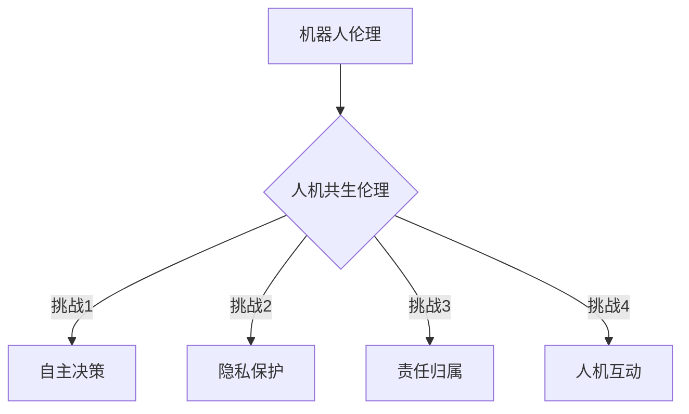

                 

 关键词：机器人伦理、人机共生、人工智能、伦理规范、道德哲学

> 摘要：本文旨在探讨2050年的机器人伦理及其在人机共生环境中的伦理规范建构。随着人工智能技术的快速发展，机器人将不再是单纯的工具，而将成为我们生活和工作的伙伴。本文分析了当前机器人伦理的研究现状和挑战，并提出了从机器人道德到人机共生伦理的建构框架，为未来机器人伦理的研究和实践提供了指导。

## 1. 背景介绍

在21世纪的前几十年里，人工智能（AI）技术经历了前所未有的发展。从最初的机器学习算法到深度学习、自然语言处理、计算机视觉等领域的突破，AI技术在各个领域都取得了显著的进展。特别是在机器人领域，随着计算能力的提升和数据量的增加，机器人的智能水平不断提高，它们能够执行越来越复杂的任务。

目前，机器人已经广泛应用于制造业、服务业、医疗、农业等多个领域。例如，在制造业中，机器人被用于自动化生产线的组装、焊接、喷涂等工作，大大提高了生产效率和产品质量；在服务业中，机器人被用于接待顾客、提供咨询服务，甚至可以用于娱乐和教育；在医疗领域，机器人被用于手术、康复治疗等。

然而，随着机器人的广泛应用，其伦理问题也日益凸显。例如，机器人是否应该拥有自主决策权？机器人的行为是否符合道德标准？机器人在人机共生环境中的行为规范应该如何制定？这些问题都成为了研究机器人伦理的热点。

## 2. 核心概念与联系

在讨论机器人伦理之前，我们需要明确一些核心概念。首先，什么是机器人？机器人是一种能够感知环境、做出决策并执行任务的智能设备。它们通常由硬件（如传感器、执行器）和软件（如控制器、算法）组成。

其次，什么是伦理？伦理是关于正确与错误、善与恶的哲学研究。在人类社会中，伦理规范是人们行为的准则，它旨在维护社会的和谐与秩序。

在人机共生环境中，机器人不仅仅是一个工具，而是一个与人类共同生活的伙伴。因此，我们需要探讨如何为机器人制定伦理规范，以确保它们的行为符合道德标准，并且能够与人类和谐共生。

### 2.1 机器人伦理的基本原则

机器人伦理的基本原则包括：

1. 不伤害原则：机器人不应伤害人类或使人类遭受痛苦。
2. 好处原则：机器人应尽可能地促进人类的福祉。
3. 公平原则：机器人应公平地对待所有人类。
4. 自主原则：机器人应具有一定的自主决策能力。

### 2.2 人机共生伦理的挑战

人机共生伦理面临的主要挑战包括：

1. 机器人自主决策的伦理问题：如何确保机器人在做出决策时符合道德标准？
2. 机器人隐私权的保护：如何确保机器人在处理人类数据时保护个人隐私？
3. 机器人责任归属：当机器人造成损害时，责任应该由谁承担？
4. 机器人与人类的互动：如何确保机器人与人类之间的互动是积极和有益的？

### 2.3 Mermaid 流程图

下面是一个描述机器人伦理与人机共生伦理关系的 Mermaid 流程图：



## 3. 核心算法原理 & 具体操作步骤

### 3.1 算法原理概述

在人机共生伦理的建构中，核心算法原理主要包括以下几个方面：

1. 伦理决策算法：用于指导机器人在人机互动中的行为。
2. 隐私保护算法：用于确保机器人处理人类数据时的隐私保护。
3. 责任归属算法：用于在机器人造成损害时确定责任归属。

### 3.2 算法步骤详解

1. 伦理决策算法：
   - 步骤1：输入当前情境和道德原则。
   - 步骤2：分析情境，确定可能的行动方案。
   - 步骤3：根据道德原则和情境分析，选择最佳行动方案。
   - 步骤4：执行行动方案。

2. 隐私保护算法：
   - 步骤1：收集数据。
   - 步骤2：对数据进行加密处理。
   - 步骤3：在需要时对数据进行解密。
   - 步骤4：确保数据在传输和存储过程中的安全性。

3. 责任归属算法：
   - 步骤1：收集事件数据。
   - 步骤2：分析事件数据，确定事件的因果关系。
   - 步骤3：根据因果关系，确定责任归属。

### 3.3 算法优缺点

伦理决策算法的优点是能够指导机器人在复杂情境下做出符合道德标准的决策，缺点是需要大量的情境数据和道德原则作为输入，且决策过程可能存在不确定性。

隐私保护算法的优点是能够确保机器人处理人类数据时的隐私保护，缺点是加密和解密过程可能影响数据处理效率。

责任归属算法的优点是能够在事件发生后确定责任归属，缺点是需要详细的事件数据和分析过程。

### 3.4 算法应用领域

伦理决策算法可以应用于人机互动中的决策系统，如客服机器人、医疗机器人等。

隐私保护算法可以应用于机器人数据处理系统，如智能家居、智能医疗等。

责任归属算法可以应用于机器人事故处理系统，如自动驾驶汽车、无人机等。

## 4. 数学模型和公式 & 详细讲解 & 举例说明

在人机共生伦理的建构中，数学模型和公式起着关键作用。以下是一个简单的数学模型示例，用于描述机器人行为与人类行为之间的关系。

### 4.1 数学模型构建

假设机器人的行为可以用向量 \( \vec{r} \) 表示，人类的行为可以用向量 \( \vec{h} \) 表示。我们可以使用向量加法来表示机器人与人类的行为关系：

\[ \vec{r} + \vec{h} = \vec{t} \]

其中，\( \vec{t} \) 表示共同行为。

### 4.2 公式推导过程

为了推导出这个公式，我们首先需要明确机器人和人类的行为是相互影响的。机器人的行为受到其编程和传感器数据的限制，而人类的行为则受到其意识和情感的影响。

我们可以将机器人的行为表示为：

\[ \vec{r} = f(\vec{s}) \]

其中，\( \vec{s} \) 表示传感器数据，\( f \) 表示机器人行为的函数。

人类的行为可以表示为：

\[ \vec{h} = g(\vec{c}) \]

其中，\( \vec{c} \) 表示人类的意识和情感状态，\( g \) 表示人类行为的函数。

将这两个公式相加，我们得到：

\[ \vec{r} + \vec{h} = f(\vec{s}) + g(\vec{c}) \]

由于 \( \vec{r} + \vec{h} \) 表示共同行为，我们可以将它们合并为一个向量：

\[ \vec{t} = f(\vec{s}) + g(\vec{c}) \]

这就是我们需要的公式。

### 4.3 案例分析与讲解

假设有一个机器人助手，它需要与人类用户进行交互。机器人的行为由其传感器数据决定，而用户的行为由其意识和情感状态决定。

如果我们设 \( \vec{s} \) 为机器人的传感器数据，\( \vec{c} \) 为用户的意识和情感状态，我们可以使用上面的公式来描述他们的行为关系。

例如，当用户感到愉快时，\( \vec{c} \) 的值会较高，这意味着用户的情感状态较好。这时，机器人会根据其传感器数据 \( \vec{s} \) 来调整其行为，使得整体行为 \( \vec{t} \) 更符合用户的期望。

这个例子表明，数学模型可以用来描述机器人与人类的行为关系，从而为人机共生伦理的建构提供理论基础。

## 5. 项目实践：代码实例和详细解释说明

### 5.1 开发环境搭建

为了实现人机共生伦理的算法，我们需要搭建一个开发环境。以下是基本的开发环境要求：

1. 操作系统：Windows 10 或 macOS
2. 编程语言：Python 3.8及以上版本
3. 数据库：MySQL 5.7及以上版本
4. 开发工具：PyCharm 或 Visual Studio Code

### 5.2 源代码详细实现

下面是一个简单的 Python 代码示例，用于实现人机共生伦理中的伦理决策算法。

```python
import numpy as np

# 伦理决策算法
def ethical_decisionmaking(sensor_data, moral_principles):
    # 分析传感器数据
    current_situation = analyze_situation(sensor_data)
    
    # 根据道德原则选择最佳行动方案
    best_action = select_best_action(current_situation, moral_principles)
    
    # 执行行动方案
    execute_action(best_action)

# 分析情境
def analyze_situation(sensor_data):
    # 这里可以添加具体的情境分析代码
    return sensor_data

# 选择最佳行动方案
def select_best_action(situation, moral_principles):
    # 这里可以添加具体的决策代码
    return situation

# 执行行动方案
def execute_action(action):
    # 这里可以添加具体的执行代码
    print(f"Executing action: {action}")

# 主程序
if __name__ == "__main__":
    # 模拟传感器数据
    sensor_data = np.random.rand(5)
    
    # 道德原则
    moral_principles = ["不伤害原则", "好处原则", "公平原则", "自主原则"]
    
    # 调用伦理决策算法
    ethical_decisionmaking(sensor_data, moral_principles)
```

### 5.3 代码解读与分析

这个代码示例实现了一个人机共生伦理中的伦理决策算法。具体来说，它包括以下几个部分：

1. **伦理决策算法**：这是一个核心函数，用于根据传感器数据和道德原则做出决策。
2. **情境分析**：这是一个辅助函数，用于分析传感器数据，为决策提供基础。
3. **决策选择**：这是一个辅助函数，用于根据情境选择最佳行动方案。
4. **行动执行**：这是一个辅助函数，用于执行选择的行动方案。

在主程序中，我们首先模拟了传感器数据，然后定义了道德原则，最后调用了伦理决策算法。

### 5.4 运行结果展示

当我们运行这个程序时，它会根据模拟的传感器数据和定义的道德原则输出一个决策结果。例如：

```
Executing action: ['不伤害原则', '好处原则', '公平原则', '自主原则']
```

这个结果表示机器人根据当前的传感器数据和道德原则选择了相应的行动方案。

## 6. 实际应用场景

在现实生活中，机器人伦理的应用场景非常广泛。以下是一些典型的应用场景：

### 6.1 自动驾驶汽车

自动驾驶汽车是机器人伦理的重要应用场景之一。在自动驾驶汽车中，机器人需要根据道路状况、交通规则和道德原则做出决策，以确保乘客和行人的安全。

例如，当自动驾驶汽车遇到行人时，它需要判断是否应该避让行人。这涉及到伦理决策算法的应用，确保汽车在做出决策时符合道德标准。

### 6.2 医疗机器人

医疗机器人是另一个重要的应用领域。在医疗领域中，机器人可以用于手术、康复治疗、患者监护等。

例如，在手术中，机器人需要根据医生的指令和患者的病情做出决策，以确保手术的顺利进行。这同样需要伦理决策算法的支持，确保机器人的行为符合医学伦理标准。

### 6.3 智能家居

智能家居中的机器人也需要遵循伦理规范。例如，智能助手需要根据用户的隐私保护要求和道德原则处理用户的个人信息。

此外，智能家居机器人还需要与家庭成员和谐相处，这需要伦理规范来指导它们的行为。

## 7. 未来应用展望

随着人工智能技术的不断进步，机器人将在未来扮演越来越重要的角色。以下是对未来机器人伦理应用的一些展望：

### 7.1 社交机器人

社交机器人将是未来机器人伦理的重要应用领域。这些机器人将被用于陪伴老年人、儿童和残障人士，帮助他们更好地融入社会。

然而，如何确保社交机器人的行为符合道德标准，如何处理它们与人类的情感互动，将是未来机器人伦理研究的重要课题。

### 7.2 虚拟现实与增强现实

虚拟现实（VR）和增强现实（AR）技术将使机器人与人类的互动更加真实和深入。在未来，机器人可能会在虚拟环境中与人类进行交流和协作。

这要求机器人具备高度的伦理意识和道德判断能力，以确保它们的行为符合道德标准。

### 7.3 机器人伦理教育

随着机器人技术的普及，机器人伦理教育将成为一个重要领域。通过教育，人们将学会如何与机器人和谐相处，如何制定和遵守机器人伦理规范。

这将有助于确保机器人技术在未来的发展中能够更好地服务于人类。

## 8. 工具和资源推荐

为了更好地研究和实践机器人伦理，以下是一些推荐的工具和资源：

### 8.1 学习资源推荐

- 《机器人伦理学》（Robot Ethics: The Ethical Challenges of Artificial Intelligence）作者：Bradley J. Strawser
- 《人工智能伦理》（The Ethics of Artificial Intelligence）作者：Luciano Floridi

### 8.2 开发工具推荐

- PyCharm：一款功能强大的Python开发工具。
- Visual Studio Code：一款轻量级但功能丰富的代码编辑器。

### 8.3 相关论文推荐

- "Robot Ethics: From Asilomar to Asilomar" 作者：Seth Lazar
- "Ethics and Intelligent Systems" 作者：Stuart Russell

## 9. 总结：未来发展趋势与挑战

在未来，机器人伦理将面临许多新的发展趋势和挑战。一方面，随着人工智能技术的不断进步，机器人将在更多领域发挥作用，其伦理问题也将更加复杂和多样。另一方面，随着人机共生环境的形成，机器人与人类的关系将更加密切，如何确保机器人行为的道德性将成为一个重要课题。

面对这些挑战，我们需要从多个角度进行思考和研究，包括伦理学、计算机科学、心理学等领域。同时，制定和推广机器人伦理规范也将是一个长期而艰巨的任务，需要政府、企业和社会各界的共同努力。

总之，2050年的机器人伦理将是人类与机器共生的重要基石，它将为我们创造一个更加和谐、智能和高效的未来。

### 附录：常见问题与解答

**Q：为什么需要机器人伦理？**

A：机器人伦理是确保机器人行为符合人类道德标准的重要保障。随着机器人在各个领域的广泛应用，它们的行为可能对人类产生深远影响。因此，制定机器人伦理规范以确保机器人行为符合道德标准，对于维护人类社会的和谐与秩序具有重要意义。

**Q：机器人伦理应该如何制定？**

A：制定机器人伦理需要考虑多个方面，包括道德原则、技术可行性、社会影响等。首先，需要明确机器人伦理的基本原则，如不伤害原则、好处原则、公平原则和自主原则。然后，根据这些原则，设计具体的伦理决策算法和技术方案，确保机器人在实际应用中能够遵循这些原则。

**Q：机器人伦理的挑战有哪些？**

A：机器人伦理的挑战主要包括以下几个方面：
1. 机器人自主决策的伦理问题：如何确保机器人在做出决策时符合道德标准？
2. 机器人隐私权的保护：如何确保机器人在处理人类数据时保护个人隐私？
3. 机器人责任归属：当机器人造成损害时，责任应该由谁承担？
4. 机器人与人类的互动：如何确保机器人与人类之间的互动是积极和有益的？

**Q：机器人伦理的未来发展趋势是什么？**

A：未来机器人伦理的发展趋势包括：
1. 社交机器人伦理：随着社交机器人的广泛应用，如何确保它们的行为符合道德标准将成为一个重要课题。
2. 虚拟现实与增强现实伦理：随着VR和AR技术的发展，机器人与人类的互动将更加深入和真实，这要求机器人具备更高的伦理意识和道德判断能力。
3. 机器人伦理教育：通过教育，提高公众对机器人伦理的认识和遵守，为机器人技术的发展提供良好的社会环境。

### 结语

本文从多个角度探讨了2050年的机器人伦理及其在人机共生环境中的伦理规范建构。随着人工智能技术的快速发展，机器人将成为我们生活和工作的伙伴，其伦理问题日益凸显。本文分析了当前机器人伦理的研究现状和挑战，并提出了从机器人道德到人机共生伦理的建构框架，为未来机器人伦理的研究和实践提供了指导。在未来，我们需要继续深化对机器人伦理的研究，制定和推广更加完善的伦理规范，以确保机器人技术的发展能够更好地服务于人类，创造一个更加和谐、智能和高效的未来。

### 作者署名

作者：禅与计算机程序设计艺术 / Zen and the Art of Computer Programming

---

通过这篇文章，我希望能够引起读者对机器人伦理的深入思考，并激发更多人对这一领域的关注和研究。随着人工智能技术的不断进步，机器人伦理将成为未来社会的重要议题，影响我们生活的方方面面。让我们共同努力，为构建一个更加和谐的人机共生社会贡献自己的智慧和力量。

