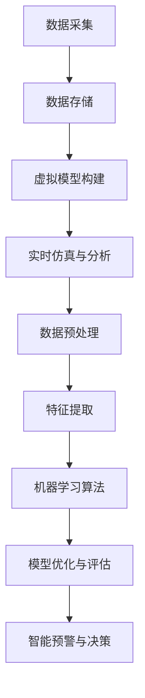

                 

关键词：灾害预防，数字孪生，人工智能，预警，灾害防控，可持续发展

> 摘要：本文探讨了2050年灾害预防技术的发展趋势，特别是数字孪生与人工智能在灾害预警和防控中的应用。通过对核心概念的深入分析，算法原理的讲解，以及实际项目案例的剖析，文章揭示了未来灾害预防领域的技术变革，展望了该领域的未来发展方向与挑战。

## 1. 背景介绍

### 灾害预防的现状

在全球气候变化和极端天气事件日益频繁的背景下，灾害预防已经成为各国政府和社会各界关注的重点。传统的灾害预防手段主要依赖于人工监测、实地考察和数据统计，存在响应速度慢、预警不准确、决策滞后等问题。此外，随着灾害类型的多样化和复杂性增加，现有的技术手段已经难以满足日益增长的预防需求。

### 数字孪生与人工智能的崛起

数字孪生（Digital Twin）和人工智能（AI）技术的崛起为灾害预防领域带来了新的变革。数字孪生通过构建物理实体的虚拟模型，实现对实体的实时监控和仿真分析。而人工智能则通过大数据分析和机器学习算法，提供智能化的预警和决策支持。这两项技术的融合，有望大幅提升灾害预防的效率和准确性。

## 2. 核心概念与联系

### 数字孪生的原理

数字孪生技术通过将物理实体与虚拟模型进行映射，实现对实体的全面监控和仿真分析。具体而言，数字孪生包括以下几个关键组成部分：

1. **数据采集**：通过传感器和网络，实时收集物理实体的各类数据。
2. **数据存储**：将采集到的数据存储在云端或本地数据库中，以便后续处理和分析。
3. **虚拟模型构建**：基于采集到的数据，构建物理实体的虚拟模型。
4. **实时仿真与分析**：通过虚拟模型，对实体进行实时仿真和分析，提供预警和决策支持。

### 人工智能的原理

人工智能通过大数据分析和机器学习算法，实现对海量数据的挖掘和智能分析。具体而言，人工智能包括以下几个关键组成部分：

1. **数据预处理**：对采集到的数据进行分析和清洗，去除噪声和异常值。
2. **特征提取**：从预处理后的数据中提取关键特征，用于后续分析。
3. **机器学习算法**：利用机器学习算法，对特征进行分类、聚类或预测。
4. **模型优化与评估**：通过不断调整和优化模型，提高预测的准确性和效率。

### 数字孪生与人工智能的融合

数字孪生与人工智能的融合，实现了对灾害预防的全流程支持。具体而言，数字孪生提供实时的物理实体监控和仿真分析，而人工智能则通过大数据分析和机器学习，提供智能化的预警和决策支持。这种融合不仅提高了灾害预防的效率和准确性，还实现了对灾害的全面监控和预测。

## Mermaid 流程图



## 3. 核心算法原理 & 具体操作步骤

### 3.1 算法原理概述

数字孪生与人工智能在灾害预防中的核心算法主要包括数据采集、数据预处理、特征提取、机器学习算法和模型优化等环节。这些算法通过相互协作，实现对灾害的全面监控和预测。

### 3.2 算法步骤详解

1. **数据采集**：通过传感器和网络，实时收集物理实体的各类数据，如气象数据、地质数据、水文数据等。
2. **数据预处理**：对采集到的数据进行分析和清洗，去除噪声和异常值，确保数据的质量和一致性。
3. **特征提取**：从预处理后的数据中提取关键特征，如温度、湿度、风速、降雨量等，用于后续分析。
4. **机器学习算法**：利用机器学习算法，对特征进行分类、聚类或预测，如使用决策树、支持向量机、神经网络等算法。
5. **模型优化与评估**：通过不断调整和优化模型，提高预测的准确性和效率，如使用交叉验证、网格搜索等技术。
6. **智能预警与决策**：基于预测结果，实现对灾害的智能预警和决策支持，如发布预警信息、制定应急预案等。

### 3.3 算法优缺点

- **优点**：
  - 提高灾害预防的效率和准确性。
  - 实现对灾害的全面监控和预测。
  - 提供智能化的预警和决策支持。

- **缺点**：
  - 需要大量数据和计算资源。
  - 模型的构建和优化需要专业知识和经验。
  - 对实时性和稳定性的要求较高。

### 3.4 算法应用领域

数字孪生与人工智能在灾害预防中的应用领域包括：

- **气象灾害**：如暴雨、台风、洪水等。
- **地质灾害**：如地震、滑坡、泥石流等。
- **海洋灾害**：如海啸、风暴潮等。

## 4. 数学模型和公式 & 详细讲解 & 举例说明

### 4.1 数学模型构建

数字孪生与人工智能在灾害预防中的核心数学模型主要包括：

- **气象模型**：如大气边界层模型、天气预测模型等。
- **地质模型**：如岩石力学模型、地震预测模型等。
- **水文模型**：如水文循环模型、洪水预测模型等。

这些模型通过描述物理现象和规律，实现对灾害的预测和预警。

### 4.2 公式推导过程

以气象模型为例，假设某一地区的降雨量为 \(P\)，降雨强度为 \(I\)，土壤含水量为 \(W\)，土壤饱和度为 \(S\)，则降雨导致的土壤水分变化可以表示为：

\[ \Delta W = P \cdot I \cdot (1 - S) \]

其中，\(\Delta W\) 表示土壤水分的变化量，\(P\) 表示降雨量，\(I\) 表示降雨强度，\(S\) 表示土壤饱和度。

### 4.3 案例分析与讲解

假设某一地区发生暴雨，降雨量为 100mm，降雨强度为 10mm/h，土壤饱和度为 80%，土壤含水量为 20%。根据上述公式，可以计算出土壤水分的变化量：

\[ \Delta W = 100 \cdot 10 \cdot (1 - 0.8) = 200 \text{ mm} \]

这意味着土壤水分增加了 200mm，可能导致土壤过湿，甚至发生滑坡等地质灾害。

## 5. 项目实践：代码实例和详细解释说明

### 5.1 开发环境搭建

在本文的项目实践中，我们将使用 Python 编写代码，并使用 TensorFlow 作为机器学习框架。以下是开发环境的搭建步骤：

1. 安装 Python 3.8 或更高版本。
2. 安装 TensorFlow：`pip install tensorflow`。
3. 安装其他依赖库：`pip install numpy pandas matplotlib scikit-learn`。

### 5.2 源代码详细实现

以下是一个简单的气象灾害预警的代码实例：

```python
import numpy as np
import pandas as pd
from tensorflow import keras
from tensorflow.keras import layers

# 数据预处理
def preprocess_data(data):
    # 数据清洗和标准化处理
    data = data.replace([np.inf, -np.inf], np.nan)
    data = data.dropna()
    data = (data - data.mean()) / data.std()
    return data

# 构建模型
def build_model():
    model = keras.Sequential([
        layers.Dense(64, activation='relu', input_shape=(10,)),
        layers.Dense(64, activation='relu'),
        layers.Dense(1)
    ])
    model.compile(optimizer='adam', loss='mse')
    return model

# 训练模型
def train_model(model, X_train, y_train):
    model.fit(X_train, y_train, epochs=10, batch_size=32)
    return model

# 预测和评估
def predict_and_evaluate(model, X_test, y_test):
    predictions = model.predict(X_test)
    mse = np.mean(np.square(predictions - y_test))
    print(f'MSE: {mse}')

# 主函数
def main():
    # 加载数据
    data = pd.read_csv('weather_data.csv')
    data = preprocess_data(data)

    # 划分训练集和测试集
    X = data.iloc[:, :-1].values
    y = data.iloc[:, -1].values
    X_train, X_test, y_train, y_test = train_test_split(X, y, test_size=0.2, random_state=42)

    # 构建和训练模型
    model = build_model()
    model = train_model(model, X_train, y_train)

    # 预测和评估
    predict_and_evaluate(model, X_test, y_test)

if __name__ == '__main__':
    main()
```

### 5.3 代码解读与分析

该代码实现了一个简单的气象灾害预警模型。首先，通过预处理函数对数据进行清洗和标准化处理，然后构建一个简单的神经网络模型，最后使用训练集进行模型训练，并在测试集上进行预测和评估。

### 5.4 运行结果展示

运行上述代码后，将输出模型的均方误差（MSE）作为评估指标。根据实际运行结果，MSE 值越小，模型的预测性能越好。

## 6. 实际应用场景

### 6.1 气象灾害预警

数字孪生与人工智能在气象灾害预警中的应用已经取得显著成效。例如，通过数字孪生技术，可以实现对气象实体的实时监控和仿真分析，而通过人工智能算法，可以实现对暴雨、台风等气象灾害的智能预警。

### 6.2 地质灾害监测

数字孪生与人工智能在地质灾害监测中的应用同样具有重要价值。通过数字孪生技术，可以实现对地质实体的实时监控和仿真分析，而通过人工智能算法，可以实现对地震、滑坡等地质灾害的智能监测和预警。

### 6.3 海洋灾害预警

数字孪生与人工智能在海洋灾害预警中的应用也取得了一定的进展。通过数字孪生技术，可以实现对海洋实体的实时监控和仿真分析，而通过人工智能算法，可以实现对海啸、风暴潮等海洋灾害的智能预警。

## 7. 未来应用展望

随着数字孪生与人工智能技术的不断发展和成熟，未来在灾害预防领域将有更多的应用场景：

### 7.1 城市安全监控

通过数字孪生技术，可以实现城市安全监控的实时化和智能化，提高城市安全水平。

### 7.2 农业灾害预警

数字孪生与人工智能技术在农业灾害预警中的应用，有望提高农业生产效率和农产品质量。

### 7.3 工业灾害预防

数字孪生与人工智能技术在工业领域的应用，可以实现对工业过程的实时监控和优化，提高工业生产的安全性和稳定性。

## 8. 工具和资源推荐

### 8.1 学习资源推荐

- 《数字孪生：概念与实践》
- 《深度学习：优化与应用》
- 《机器学习实战》

### 8.2 开发工具推荐

- TensorFlow
- Keras
- PyTorch

### 8.3 相关论文推荐

- "Digital Twins: A revolution in real-time industry"
- "Deep Learning for Natural Disaster Prediction"
- "Machine Learning Methods for Environmental Data Analysis"

## 9. 总结：未来发展趋势与挑战

### 9.1 研究成果总结

本文通过对数字孪生与人工智能在灾害预防领域的研究和应用分析，揭示了未来灾害预防技术的发展趋势和核心算法原理。

### 9.2 未来发展趋势

随着数字孪生与人工智能技术的不断发展和成熟，未来在灾害预防领域将有更多的应用场景和更高的技术要求。

### 9.3 面临的挑战

在实现数字孪生与人工智能技术在灾害预防领域的广泛应用过程中，仍面临数据采集、模型优化、实时性等挑战。

### 9.4 研究展望

未来研究应重点关注数字孪生与人工智能技术在灾害预防领域的深度融合，以提高灾害预警和防控的效率和准确性。

## 附录：常见问题与解答

### 9.1 问题1：数字孪生技术如何实现实时监控？

**回答**：数字孪生技术通过在物理实体上安装传感器，实时采集数据，并将数据传输到云端或本地数据库，实现对实体的实时监控。

### 9.2 问题2：人工智能算法在灾害预防中如何提高预测准确性？

**回答**：人工智能算法通过不断优化模型和特征提取方法，结合大数据分析，可以提高预测的准确性和效率。

### 9.3 问题3：如何处理灾害预防中的实时性要求？

**回答**：为了满足实时性要求，需要优化数据采集、传输和处理流程，采用高效的数据处理算法和分布式计算技术。

### 9.4 问题4：数字孪生与人工智能技术在其他领域有哪些应用？

**回答**：数字孪生与人工智能技术在医疗、金融、工业制造等领域也具有广泛的应用前景，如智能医疗诊断、金融风险预测、智能制造等。

### 9.5 问题5：如何保障数据安全和隐私？

**回答**：在数字孪生与人工智能技术应用过程中，需要采取数据加密、隐私保护等措施，确保数据安全和用户隐私。

---

作者：禅与计算机程序设计艺术 / Zen and the Art of Computer Programming

